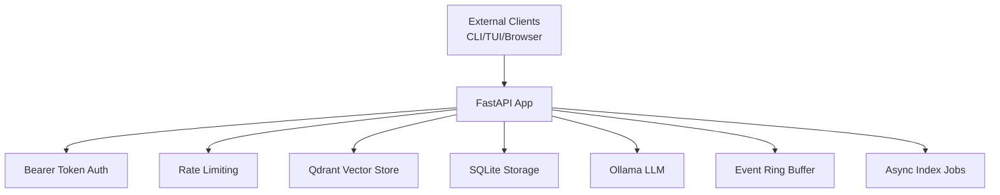
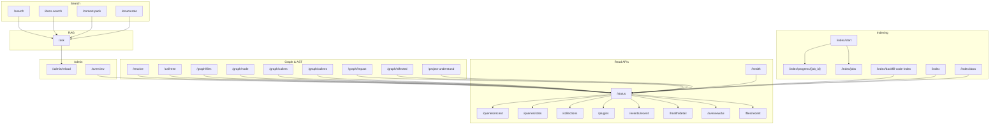
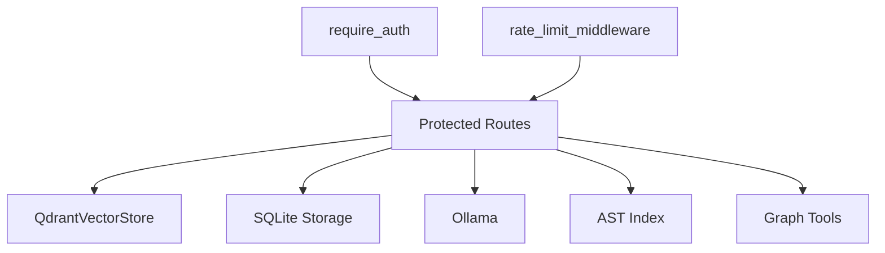

# API Reference

<cite>
**Referenced Files in This Document**
- [server.py](file://src/rag/server.py)
- [config.py](file://src/rag/config.py)
- [app.py](file://src/rag/app.py)
- [index.html](file://src/rag/web/index.html)
</cite>

## Table of Contents
1. [Introduction](#introduction)
2. [Project Structure](#project-structure)
3. [Core Components](#core-components)
4. [Architecture Overview](#architecture-overview)
5. [Detailed Component Analysis](#detailed-component-analysis)
6. [Dependency Analysis](#dependency-analysis)
7. [Performance Considerations](#performance-considerations)
8. [Troubleshooting Guide](#troubleshooting-guide)
9. [Conclusion](#conclusion)
10. [Appendices](#appendices)

## Introduction
This document describes the HTTP REST API and real-time capabilities of the RAG system. It covers:
- Authentication and authorization
- Rate limiting
- All HTTP endpoints grouped by functional domain
- Request/response schemas and validation rules
- Real-time updates via the embedded web dashboard
- Security posture, CORS, and performance guidance
- Practical usage examples and client integration patterns

## Project Structure
The API is implemented as a FastAPI application with:
- Centralized route definitions and request/response models
- Middleware for authentication, CSRF protection, rate limiting, and logging
- Token-based authentication persisted in the user’s home directory
- An embedded web dashboard that polls the same read endpoints

**Diagram sources**
- [server.py:721-789](file://src/rag/server.py#L721-L789)
- [config.py:167-188](file://src/rag/config.py#L167-L188)

**Section sources**
- [server.py:721-789](file://src/rag/server.py#L721-L789)
- [config.py:167-188](file://src/rag/config.py#L167-L188)

## Core Components
- Authentication: Bearer token enforcement via Authorization header. Tokens are stored in ~/.rag/token and injected into the embedded dashboard.
- Rate limiting: Per-token token-bucket limiter applied to all endpoints.
- CSRF protection: Blocks cross-origin POST/DELETE without a valid Authorization header.
- Request logging: Structured logs with latency and event emission for the TUI/logs.
- Embedded web dashboard: Serves index.html and polls read endpoints for real-time updates.

Key behaviors:
- All endpoints except /health are protected by Bearer token authentication.
- Rate limiting is enforced via a database-backed token bucket.
- The server binds to localhost by default; exposing publicly is blocked by configuration.

**Section sources**
- [server.py:592-598](file://src/rag/server.py#L592-L598)
- [server.py:770-789](file://src/rag/server.py#L770-L789)
- [server.py:798-815](file://src/rag/server.py#L798-L815)
- [server.py:819-838](file://src/rag/server.py#L819-L838)
- [config.py:35-50](file://src/rag/config.py#L35-L50)
- [config.py:167-188](file://src/rag/config.py#L167-L188)

## Architecture Overview
The API is organized around:
- Health and status
- Search and retrieval
- Indexing and backfill
- Knowledge graph and project understanding
- Context packing and enumeration
- Ask (RAG) and admin reload
- Real-time updates via the embedded dashboard

**Diagram sources**
- [server.py:841-1164](file://src/rag/server.py#L841-L1164)
- [server.py:1174-1361](file://src/rag/server.py#L1174-L1361)
- [server.py:1363-2400](file://src/rag/server.py#L1363-L2400)
- [server.py:2400-2541](file://src/rag/server.py#L2400-L2541)

## Detailed Component Analysis

### Authentication and Authorization
- Method: Bearer token in the Authorization header.
- Token location: ~/.rag/token; created automatically if absent.
- Enforced on all endpoints except /health.
- Token comparison uses constant-time equality to mitigate timing attacks.

Validation and enforcement:
- Header parsing supports mixed case and trims whitespace.
- Missing or invalid tokens return 401 Unauthorized.

Security notes:
- The server enforces localhost binding by default; exposing publicly is rejected by configuration.
- CSRF guard blocks cross-origin POST/DELETE unless an Origin header matches localhost or a Bearer token is present.

**Section sources**
- [server.py:592-598](file://src/rag/server.py#L592-L598)
- [server.py:798-815](file://src/rag/server.py#L798-L815)
- [config.py:35-50](file://src/rag/config.py#L35-L50)
- [config.py:167-188](file://src/rag/config.py#L167-L188)

### Rate Limiting
- Implemented as a per-token token-bucket middleware.
- On failure, returns 429 with a JSON body indicating the token bucket is exhausted.
- On storage errors, the middleware fails open to avoid blocking the daemon.

Operational details:
- Token defaults to the Bearer token; anonymous requests use a fixed token string.
- The limiter is applied to all endpoints.

**Section sources**
- [server.py:770-789](file://src/rag/server.py#L770-L789)

### Health and Status
- /health: Public endpoint reporting component health (Qdrant, embedder, Ollama).
- /status: Protected endpoint returning daemon state, embedder info, collections, uptime, restart count, and generation model/ctx.

Response fields:
- status, components (qdrant, embedder, ollama, reranker disabled), collections array, uptime_seconds, files_indexed, embedder_warm_ms, restart_count, gen_model, gen_ctx_size.

**Section sources**
- [server.py:841-874](file://src/rag/server.py#L841-L874)
- [server.py:877-957](file://src/rag/server.py#L877-L957)

### Search and Retrieval
Endpoints:
- POST /search: Hybrid planner-driven search with optional repo scoping, filters, and top_k.
- POST /docs-search: Vector search over docs collection.
- POST /context-pack: Token-bounded context slices favoring exact matches and lexical hits.
- POST /enumerate: Exhaustive metadata listing via Qdrant scroll.

Common request/response models:
- SearchRequest: query, top_k, filters, repo, rerank (compat).
- SearchResponse: results[], query, plan, total, latency_ms.
- ContextPackRequest/Response: slices with token estimates and reasons.
- EnumerateRequest/Response: exhaustive listing with truncation flag.

Behavior highlights:
- Strategy selection and fallbacks for LOD, global summaries, and graph walks.
- Lexical search fallback to promote exact matches.
- Token budgeting for context packing.

**Section sources**
- [server.py:33-68](file://src/rag/server.py#L33-L68)
- [server.py:1363-1604](file://src/rag/server.py#L1363-L1604)
- [server.py:1606-1635](file://src/rag/server.py#L1606-L1635)
- [server.py:2008-2141](file://src/rag/server.py#L2008-L2141)
- [server.py:2145-2203](file://src/rag/server.py#L2145-L2203)

### Indexing Control
Endpoints:
- POST /index/start: Queue an asynchronous indexing job for a repository.
- GET /index/progress/{job_id}: Poll progress and status.
- GET /index/jobs: List all jobs.
- POST /index/backfill-code-index: Populate SQLite code_index from Qdrant payloads.
- POST /index: Synchronous indexing of a repository.
- POST /index/docs: Synchronous indexing of documents.

Job lifecycle:
- Queued → Scanning → Running → Completed/Failed.
- Progress updates emitted to the event ring and persisted to disk.

**Section sources**
- [server.py:1174-1283](file://src/rag/server.py#L1174-L1283)
- [server.py:1288-1361](file://src/rag/server.py#L1288-L1361)
- [server.py:2335-2399](file://src/rag/server.py#L2335-L2399)

### Knowledge Graph and AST
Endpoints:
- POST /resolve: Resolve symbols to definitions/usages for a named repository.
- POST /call-tree: Build a call tree for a symbol.
- POST /graph/files: List files with scores and metadata.
- POST /graph/node: Definitions and usages for a symbol.
- POST /graph/callers: Caller relations.
- POST /graph/callees: Callee relations.
- POST /graph/impact: Impact analysis including affected files and tests.
- POST /graph/affected: Files affected by a set of changed files.
- POST /project-understand: High-level project understanding with modules and symbol slices.

**Section sources**
- [server.py:1638-1726](file://src/rag/server.py#L1638-L1726)
- [server.py:1728-1896](file://src/rag/server.py#L1728-L1896)
- [server.py:1898-2004](file://src/rag/server.py#L1898-L2004)

### Retrieval-Augmented Generation (Ask)
Endpoint:
- POST /ask: Retrieve relevant chunks and generate a grounded answer using Ollama.

Request/response:
- AskRequest: question, top_k, repo (optional), max_chunk_chars.
- AskResponse: question, answer, citations[], model, retrieval_ms, generation_ms, latency_ms.

Behavior:
- Uses configured generation model; builds a grounded prompt from retrieved chunks.
- Logs query and latency to storage.

**Section sources**
- [server.py:286-308](file://src/rag/server.py#L286-L308)
- [server.py:2207-2331](file://src/rag/server.py#L2207-L2331)

### Admin and Overview
Endpoints:
- GET /overview: Aggregated statistics over code chunks.
- POST /admin/reload: Hot-reload settings; optionally force embedder reinitialization.

Notes:
- /overview falls back to a scroll-based scan if counters are unavailable and seeds them for future fast paths.
- /admin/reload refuses to change the embedding model unless forced; clears embedding cache and swaps the live embedder.

**Section sources**
- [server.py:2403-2474](file://src/rag/server.py#L2403-L2474)
- [server.py:2478-2541](file://src/rag/server.py#L2478-L2541)

### Real-Time Updates (Embedded Web Dashboard)
The embedded dashboard serves index.html and polls read endpoints:
- /status, /queries/recent, /queries/stats, /collections, /plugins, /events/recent, /health/detail, /overview/tui, /files/recent
- Token injection ensures same-origin fetch calls succeed without manual configuration.

Client behavior:
- Polls endpoints periodically to update KPIs, recent queries, event logs, and overview panels.
- Renders event heatmaps and live tails.

**Section sources**
- [server.py:2552-2581](file://src/rag/server.py#L2552-L2581)
- [app.py:363-661](file://src/rag/app.py#L363-L661)
- [index.html:651-718](file://src/rag/web/index.html#L651-L718)

## Dependency Analysis
- Authentication depends on a persisted token file and constant-time comparison.
- Rate limiting depends on SQLite-backed buckets.
- Search depends on vector store, lexical index, and scoring utilities.
- Indexing depends on repository manager, vector store, and progress callbacks.
- Graph and AST endpoints depend on AST index and graph tools.
- Ask depends on Ollama chat API and vector store retrieval.

**Diagram sources**
- [server.py:592-598](file://src/rag/server.py#L592-L598)
- [server.py:770-789](file://src/rag/server.py#L770-L789)
- [server.py:1363-1604](file://src/rag/server.py#L1363-L1604)

**Section sources**
- [server.py:592-598](file://src/rag/server.py#L592-L598)
- [server.py:770-789](file://src/rag/server.py#L770-L789)
- [server.py:1363-1604](file://src/rag/server.py#L1363-L1604)

## Performance Considerations
- Prefer /context-pack for bounded token budgets to reduce LLM costs.
- Use /enumerate for exhaustive metadata queries; note it performs a scroll across the collection.
- Leverage /queries/stats for monitoring latency percentiles and QPM trends.
- Keep top_k reasonable to avoid excessive retrieval overhead.
- Use repository-scoped collections to constrain search and improve relevance.

[No sources needed since this section provides general guidance]

## Troubleshooting Guide
Common issues and resolutions:
- 401 Unauthorized: Ensure Authorization header contains a valid Bearer token from ~/.rag/token.
- 403 Forbidden: Origin mismatch; ensure requests originate from localhost or include a Bearer token.
- 429 Rate Limited: Wait for the token bucket refill or reduce request frequency.
- 500 Internal Server Error: Inspect structured logs for the failing endpoint; the global error handler returns sanitized details.
- 502 Bad Gateway during /ask: LLM generation failed; verify Ollama service availability and model configuration.

**Section sources**
- [server.py:741-761](file://src/rag/server.py#L741-L761)
- [server.py:763-768](file://src/rag/server.py#L763-L768)
- [server.py:798-815](file://src/rag/server.py#L798-L815)
- [server.py:770-789](file://src/rag/server.py#L770-L789)

## Conclusion
The RAG system exposes a comprehensive HTTP API for search, indexing, retrieval-augmented generation, and administration, with robust authentication, rate limiting, and real-time observability. The embedded web dashboard demonstrates how to consume these endpoints for live monitoring and diagnostics.

[No sources needed since this section summarizes without analyzing specific files]

## Appendices

### API Versioning and Backward Compatibility
- The server declares a version in its FastAPI factory; however, the current endpoint schemas reflect the latest implementation.
- Backward compatibility notes:
  - rerank field in search requests is accepted for compatibility but is ignored (reranker removed).
  - Reranker-related fields in status responses are retained for client parsing.
  - Some legacy fields (e.g., provider in embeddings) are deprecated but parsed for compatibility.

**Section sources**
- [server.py:722](file://src/rag/server.py#L722)
- [server.py:38-40](file://src/rag/server.py#L38-L40)
- [server.py:391-394](file://src/rag/server.py#L391-L394)

### Security and CORS
- Binding policy: server.host defaults to localhost; wildcard binds are rejected by configuration.
- CSRF protection: Cross-origin POST/DELETE without Authorization is blocked unless Origin is localhost.
- CORS: Not applicable; the embedded dashboard is same-origin and relies on token injection.

**Section sources**
- [config.py:35-50](file://src/rag/config.py#L35-L50)
- [server.py:798-815](file://src/rag/server.py#L798-L815)
- [server.py:2552-2581](file://src/rag/server.py#L2552-L2581)

### Practical Usage Examples
- Authentication
  - Set Authorization header: Authorization: Bearer YOUR_TOKEN
  - Token location: ~/.rag/token
- Search
  - curl -H "Authorization: Bearer $(cat ~/.rag/token)" -X POST http://127.0.0.1:7890/search -d '{"query":"foo","top_k":8}'
- Indexing
  - curl -H "Authorization: Bearer $(cat ~/.rag/token)" -X POST http://127.0.0.1:7890/index/start -d '{"repo_path":"/path/to/repo","full":false}'
  - curl -H "Authorization: Bearer $(cat ~/.rag/token)" http://127.0.0.1:7890/index/progress/YOUR_JOB_ID
- Ask
  - curl -H "Authorization: Bearer $(cat ~/.rag/token)" -X POST http://127.0.0.1:7890/ask -d '{"question":"how do I...","top_k":8}'
- Real-time dashboard
  - Open http://127.0.0.1:7890 in a browser; the page injects the daemon token at serve time.

[No sources needed since this section provides general guidance]