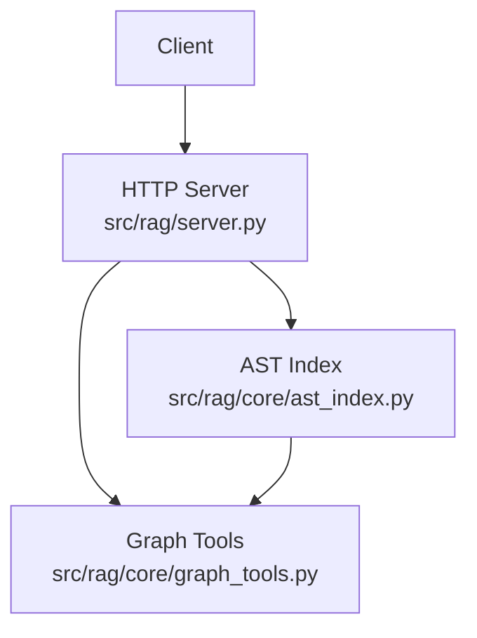
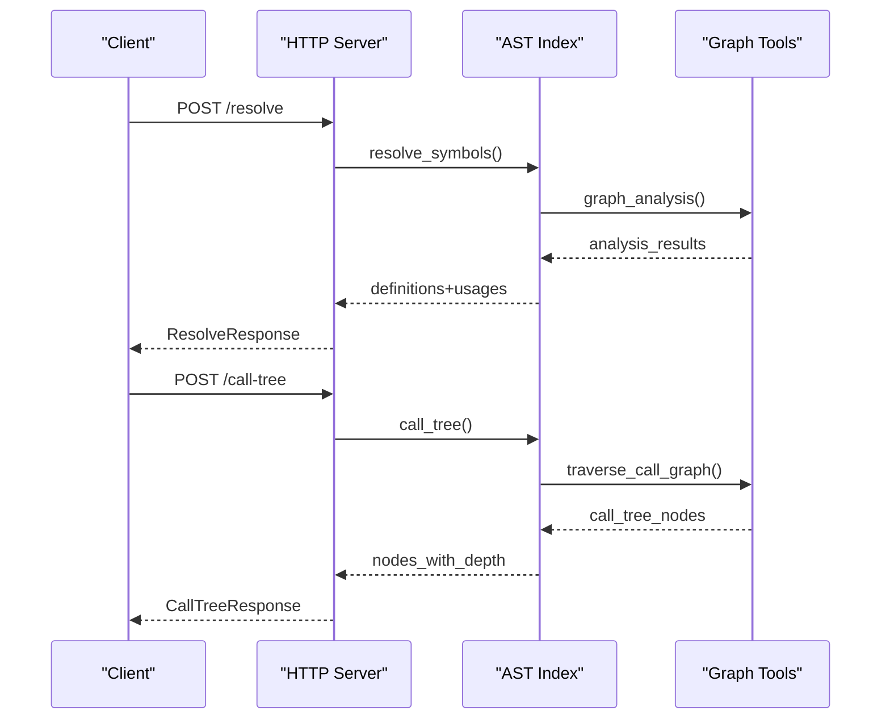
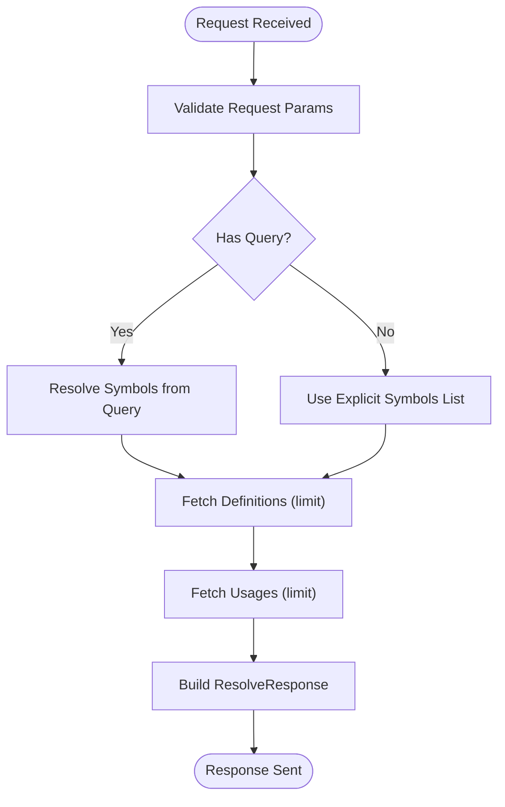
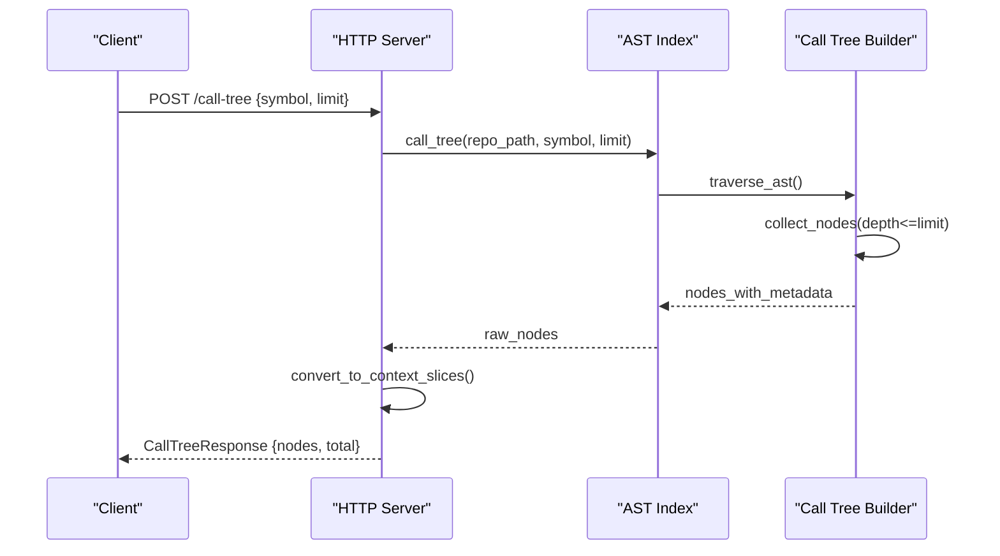
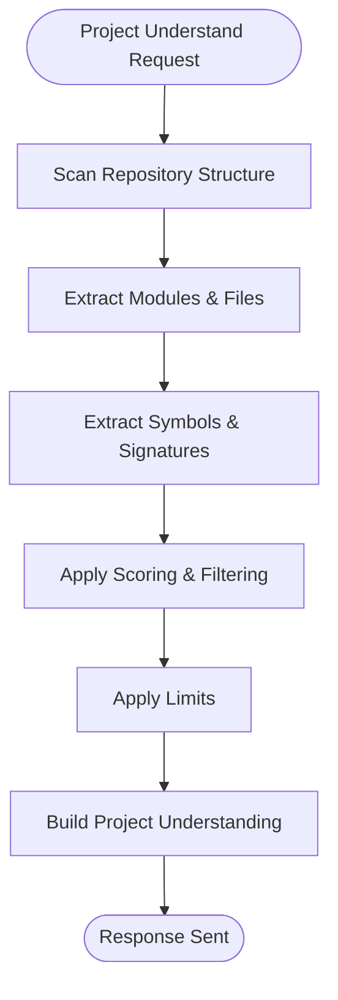
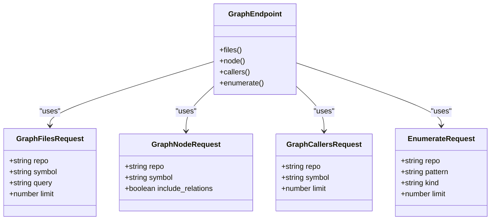
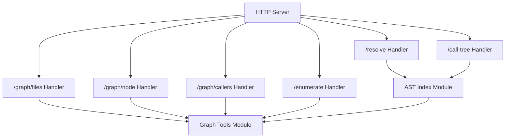

# Advanced Analysis Endpoints

<cite>
**Referenced Files in This Document**
- [server.py](file://src/rag/server.py)
- [ast_index.py](file://src/rag/core/ast_index.py)
- [graph_tools.py](file://src/rag/core/graph_tools.py)
- [test_routes.py](file://tests/test_routes.py)
</cite>

## Table of Contents
1. [Introduction](#introduction)
2. [Project Structure](#project-structure)
3. [Core Components](#core-components)
4. [Architecture Overview](#architecture-overview)
5. [Detailed Component Analysis](#detailed-component-analysis)
6. [Dependency Analysis](#dependency-analysis)
7. [Performance Considerations](#performance-considerations)
8. [Troubleshooting Guide](#troubleshooting-guide)
9. [Conclusion](#conclusion)

## Introduction
This document provides comprehensive API documentation for advanced code analysis HTTP endpoints. It covers symbol resolution, call graph exploration, project comprehension, and specialized graph analysis endpoints. Each endpoint includes request/response schemas, AST-based analysis workflows, and practical examples for IDE-like navigation.

## Project Structure
The advanced analysis endpoints are implemented in the HTTP server module and backed by core analysis modules:
- HTTP server defines routes, request/response models, and orchestration
- AST index module performs symbol resolution and call tree construction
- Graph tools module supports graph-based analysis and relationship extraction

**Diagram sources**
- [server.py](file://src/rag/server.py)
- [ast_index.py](file://src/rag/core/ast_index.py)
- [graph_tools.py](file://src/rag/core/graph_tools.py)

**Section sources**
- [server.py](file://src/rag/server.py)
- [ast_index.py](file://src/rag/core/ast_index.py)
- [graph_tools.py](file://src/rag/core/graph_tools.py)

## Core Components
This section documents the primary analysis endpoints and their schemas.

### POST /resolve
Resolves symbols in a repository either via a natural language query or an explicit symbol list. Returns definitions and usages with configurable limits.

- Request model: ResolveRequest
  - repo: string (required)
  - query: string or null (optional)
  - symbols: array of strings (optional)
  - definitions_limit: integer (1..100, default 20)
  - usages_limit: integer (0..200, default 20)

- Response model: ResolveResponse
  - repo: string
  - symbols: array of strings
  - definitions: array of ContextSlice
  - usages: array of ContextSlice
  - total_definitions: integer
  - total_usages: integer
  - latency_ms: number

Processing workflow:
1. Validate request parameters
2. Determine symbol set from query or explicit symbols
3. Fetch definitions up to definitions_limit
4. Fetch usages up to usages_limit
5. Return combined results with timing metrics

**Section sources**
- [server.py:109-125](file://src/rag/server.py#L109-L125)
- [server.py:1638-1645](file://src/rag/server.py#L1638-L1645)

### POST /call-tree
Explores the call graph for a given symbol with depth-limited traversal.

- Request model: CallTreeRequest
  - repo: string (required)
  - symbol: string (required)
  - limit: integer (1..200, default 50)

- Response model: CallTreeResponse
  - repo: string
  - symbol: string
  - nodes: array of CallTreeNode
  - total: integer
  - latency_ms: number

CallTreeNode extends ContextSlice with:
- depth: integer

Processing workflow:
1. Validate request parameters
2. Build call tree from AST index
3. Convert candidates to context slices
4. Attach depth metadata
5. Return ordered nodes with timing metrics

**Section sources**
- [server.py:127-143](file://src/rag/server.py#L127-L143)
- [server.py:1687-1706](file://src/rag/server.py#L1687-L1706)

### POST /project-understand
Provides project comprehension by extracting modules and symbols.

- Request model: ProjectUnderstandRequest
  - repo: string (required)
  - include_tests: boolean (default false)
  - limit: integer (1..200, default 50)

- Response model: ProjectUnderstandResponse
  - repo: string
  - modules: array of ProjectModule
  - symbols: array of ProjectSymbol
  - total_modules: integer
  - total_symbols: integer
  - latency_ms: number

ProjectModule fields:
- path: string
- file_count: integer
- kinds: object
- score: number

ProjectSymbol fields:
- name: string
- kind: string
- path: string
- line: integer
- signature: string

Processing workflow:
1. Validate request parameters
2. Extract modules and symbols from repository
3. Apply filtering and scoring
4. Return structured project understanding

**Section sources**
- [server.py:1520-1570](file://src/rag/server.py#L1520-L1570)

### Specialized Graph Analysis Endpoints

#### POST /graph/files
Returns files relevant to a symbol or query with graph-based filtering.

- Request model: GraphFilesRequest
  - repo: string (required)
  - symbol: string or null (optional)
  - query: string or null (optional)
  - limit: integer (1..200, default 50)

- Response model: GraphFilesResponse
  - repo: string
  - files: array of string
  - total: integer
  - latency_ms: number

Processing workflow:
1. Validate request parameters
2. Query graph for relevant files
3. Apply filters and scoring
4. Return file list with counts

**Section sources**
- [server.py:1727-1741](file://src/rag/server.py#L1727-L1741)

#### POST /graph/node
Retrieves detailed information about a specific symbol node.

- Request model: GraphNodeRequest
  - repo: string (required)
  - symbol: string (required)
  - include_relations: boolean (default false)

- Response model: GraphNodeResponse
  - repo: string
  - node: object
  - relations: array of object (optional)
  - latency_ms: number

Processing workflow:
1. Validate request parameters
2. Fetch node metadata from graph
3. Optionally include related nodes
4. Return enriched node information

**Section sources**
- [server.py:1755-1769](file://src/rag/server.py#L1755-L1769)

#### POST /graph/callers
Finds all callers of a given symbol with graph traversal.

- Request model: GraphCallersRequest
  - repo: string (required)
  - symbol: string (required)
  - limit: integer (1..200, default 50)

- Response model: GraphRelationResponse
  - repo: string
  - symbol: string
  - callers: array of object
  - total: integer
  - latency_ms: number

Processing workflow:
1. Validate request parameters
2. Traverse graph to find all caller relationships
3. Apply limit and scoring
4. Return caller list with metadata

**Section sources**
- [server.py:1796-1810](file://src/rag/server.py#L1796-L1810)

#### POST /enumerate
Enumerates symbols matching a pattern or category.

- Request model: EnumerateRequest
  - repo: string (required)
  - pattern: string (optional)
  - kind: string (optional)
  - limit: integer (1..200, default 50)

- Response model: EnumerateResponse
  - repo: string
  - symbols: array of string
  - total: integer
  - latency_ms: number

Processing workflow:
1. Validate request parameters
2. Filter symbols by pattern and kind
3. Apply scoring and ordering
4. Return symbol list with counts

**Section sources**
- [server.py:1830-1844](file://src/rag/server.py#L1830-L1844)

## Architecture Overview
The advanced analysis endpoints follow a layered architecture with clear separation of concerns:

**Diagram sources**
- [server.py](file://src/rag/server.py)
- [ast_index.py](file://src/rag/core/ast_index.py)
- [graph_tools.py](file://src/rag/core/graph_tools.py)

## Detailed Component Analysis

### Symbol Resolution Workflow
The /resolve endpoint combines query-based and explicit symbol resolution with configurable limits.

**Diagram sources**
- [server.py:109-125](file://src/rag/server.py#L109-L125)
- [server.py:1638-1645](file://src/rag/server.py#L1638-L1645)

Key implementation details:
- Limits are enforced per-request to prevent excessive resource usage
- Results combine both definitions and usages for comprehensive context
- Latency tracking enables performance monitoring

**Section sources**
- [server.py:109-125](file://src/rag/server.py#L109-L125)
- [server.py:1638-1645](file://src/rag/server.py#L1638-L1645)

### Call Tree Construction
The /call-tree endpoint builds navigable call graphs with depth information.

**Diagram sources**
- [server.py:127-143](file://src/rag/server.py#L127-L143)
- [server.py:1687-1706](file://src/rag/server.py#L1687-L1706)

Validation and testing:
- Unit tests verify call tree construction and depth calculation
- Tests mock AST index behavior for deterministic results

**Section sources**
- [server.py:127-143](file://src/rag/server.py#L127-L143)
- [server.py:1687-1706](file://src/rag/server.py#L1687-L1706)
- [test_routes.py:453-495](file://tests/test_routes.py#L453-L495)

### Project Comprehension
The /project-understand endpoint provides high-level project understanding through module and symbol extraction.

**Diagram sources**
- [server.py:1520-1570](file://src/rag/server.py#L1520-L1570)

**Section sources**
- [server.py:1520-1570](file://src/rag/server.py#L1520-L1570)

### Graph Analysis Endpoints
Specialized endpoints leverage the underlying graph infrastructure for focused analysis tasks.

**Diagram sources**
- [server.py:1727-1844](file://src/rag/server.py#L1727-L1844)

**Section sources**
- [server.py:1727-1844](file://src/rag/server.py#L1727-L1844)

## Dependency Analysis
The advanced analysis endpoints depend on core modules for AST-based analysis and graph operations.

**Diagram sources**
- [server.py](file://src/rag/server.py)
- [ast_index.py](file://src/rag/core/ast_index.py)
- [graph_tools.py](file://src/rag/core/graph_tools.py)

Key dependencies:
- AST index provides symbol resolution and call graph construction
- Graph tools enable specialized graph operations and relationship queries
- All endpoints enforce parameter validation and rate limiting

**Section sources**
- [server.py](file://src/rag/server.py)
- [ast_index.py](file://src/rag/core/ast_index.py)
- [graph_tools.py](file://src/rag/core/graph_tools.py)

## Performance Considerations
- Parameter limits prevent excessive computation and memory usage
- Latency tracking helps monitor endpoint performance
- Graph operations are optimized for large codebases
- Results are paginated to manage response sizes

## Troubleshooting Guide
Common issues and resolutions:
- Validation errors: Ensure required fields are present and within allowed ranges
- Empty results: Verify symbol names and repository paths
- Performance issues: Adjust limits and consider caching strategies
- Authentication failures: Confirm proper authorization headers

**Section sources**
- [server.py](file://src/rag/server.py)
- [test_routes.py:453-495](file://tests/test_routes.py#L453-L495)

## Conclusion
The advanced analysis endpoints provide comprehensive code navigation capabilities through AST-based symbol resolution, call graph exploration, and graph-focused analysis. The modular architecture ensures scalability while maintaining performance through careful parameterization and validation.