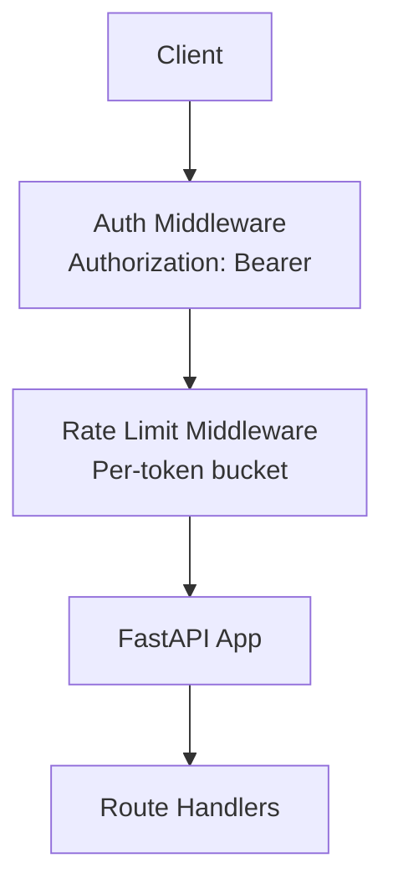
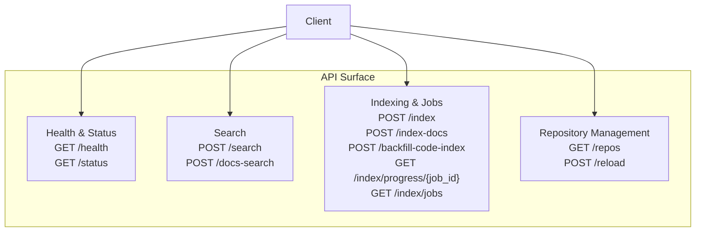
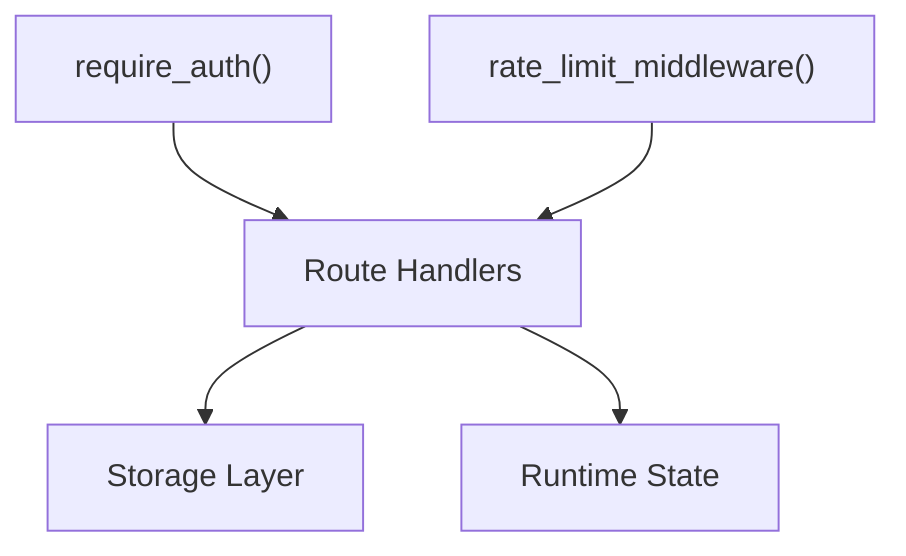

# HTTP Endpoints

<cite>
**Referenced Files in This Document**
- [server.py](file://src/rag/server.py)
- [app.py](file://src/rag/app.py)
- [config.py](file://src/rag/config.py)
- [cli.py](file://src/rag/cli.py)
- [README.md](file://README.md)
</cite>

## Table of Contents
1. [Introduction](#introduction)
2. [Project Structure](#project-structure)
3. [Core Components](#core-components)
4. [Architecture Overview](#architecture-overview)
5. [Detailed Component Analysis](#detailed-component-analysis)
6. [Dependency Analysis](#dependency-analysis)
7. [Performance Considerations](#performance-considerations)
8. [Troubleshooting Guide](#troubleshooting-guide)
9. [Conclusion](#conclusion)
10. [Appendices](#appendices)

## Introduction
This document provides comprehensive HTTP API documentation for the RAG system’s REST endpoints. It covers search, indexing, repository management, and system status endpoints, including HTTP methods, URL patterns, request/response schemas, parameter validation, authentication, rate limiting behavior, and practical usage examples. The API is built with a FastAPI application and protected by an Authorization: Bearer token requirement for most endpoints.

## Project Structure
The HTTP server is implemented in a FastAPI application module. Authentication and rate-limiting middleware are integrated at the application level. The server exposes endpoints for health/status, search, document search, indexing, job progress, and administrative utilities.

**Section sources**
- [server.py](file://src/rag/server.py)
- [app.py](file://src/rag/app.py)

## Core Components
- Authentication: All endpoints under the server module require Authorization: Bearer tokens via a dependency hook.
- Rate Limiting: A per-token bucket middleware enforces rate limits globally across requests.
- Error Handling: Global handlers convert exceptions to structured JSON responses with consistent error fields.

Key behaviors:
- Authentication: Enforced via dependency hooks on selected routes.
- Rate Limiting: Applied via middleware; token consumption occurs per request.
- Error Responses: Standardized with fields for human-readable messages, machine-readable codes, and optional details.

**Section sources**
- [server.py](file://src/rag/server.py)

## Architecture Overview
The API surface is centered around a FastAPI application with route groups for:
- Health and Status
- Search and Retrieval
- Indexing and Jobs
- Administrative Utilities

**Diagram sources**
- [server.py](file://src/rag/server.py)

## Detailed Component Analysis

### Authentication and Security
- Required Header: Authorization: Bearer <token>
- Scope: Most endpoints depend on an authentication hook; public endpoints (e.g., /health) are exempt.
- Token Validation: Implemented via dependency injection; invalid or missing tokens will trigger authentication failures.

Practical usage:
- Include the header in all authenticated requests.
- Rotate tokens periodically and restrict scopes where applicable.

**Section sources**
- [server.py](file://src/rag/server.py)

### Rate Limiting Behavior
- Mechanism: Per-token bucket middleware applied to all requests.
- Effect: Requests consume tokens proportional to their processing cost; excessive bursts are throttled.
- Tuning: Middleware configuration resides in the server module; adjust token refill rates and burst sizes as needed.

Operational notes:
- Monitor QPM and latency metrics to tune thresholds.
- Clients should implement exponential backoff on 429 responses.

**Section sources**
- [server.py](file://src/rag/server.py)

### Endpoint Catalog

#### Health and Status
- GET /health
  - Purpose: Lightweight service health check.
  - Authentication: Not required.
  - Response: Structured health payload (fields defined by the endpoint).
  - Example curl:
    - curl -s https://host/health
  - Notes: Intended for load balancers and monitoring systems.

- GET /status
  - Purpose: Operational status and runtime diagnostics.
  - Authentication: Required.
  - Response: Structured status payload (fields defined by the endpoint).
  - Example curl:
    - curl -s -H "Authorization: Bearer YOUR_TOKEN" https://host/status

**Section sources**
- [server.py](file://src/rag/server.py)

#### Search Endpoints
- POST /search
  - Purpose: Vector/text-based search over indexed content.
  - Authentication: Required.
  - Request Body Schema: SearchRequest (fields defined by the endpoint).
  - Response Schema: SearchResponse (fields defined by the endpoint).
  - Example curl:
    - curl -s -X POST https://host/search \
      -H "Authorization: Bearer YOUR_TOKEN" \
      -H "Content-Type: application/json" \
      -d '{...}'
  - Notes: Use filters and top_k judiciously to balance accuracy and latency.

- POST /docs-search
  - Purpose: Search over documentation chunks.
  - Authentication: Required.
  - Request Body Schema: DocsSearchRequest (fields defined by the endpoint).
  - Response Schema: SearchResponse (fields defined by the endpoint).
  - Example curl:
    - curl -s -X POST https://host/docs-search \
      -H "Authorization: Bearer YOUR_TOKEN" \
      -H "Content-Type: application/json" \
      -d '{...}'

**Section sources**
- [server.py](file://src/rag/server.py)

#### Indexing and Jobs
- POST /index
  - Purpose: Start repository code indexing.
  - Authentication: Required.
  - Request Body Schema: IndexRequest (fields defined by the endpoint).
  - Response: Job initiation response (fields defined by the endpoint).
  - Example curl:
    - curl -s -X POST https://host/index \
      -H "Authorization: Bearer YOUR_TOKEN" \
      -H "Content-Type: application/json" \
      -d '{...}'

- POST /index-docs
  - Purpose: Index documentation content.
  - Authentication: Required.
  - Request Body Schema: IndexDocsRequest (fields defined by the endpoint).
  - Response: Job initiation response (fields defined by the endpoint).
  - Example curl:
    - curl -s -X POST https://host/index-docs \
      -H "Authorization: Bearer YOUR_TOKEN" \
      -H "Content-Type: application/json" \
      -d '{...}'

- POST /backfill-code-index
  - Purpose: Backfill or re-index code content.
  - Authentication: Required.
  - Request Body Schema: BackfillCodeIndexRequest (fields defined by the endpoint).
  - Response: Job initiation response (fields defined by the endpoint).
  - Example curl:
    - curl -s -X POST https://host/backfill-code-index \
      -H "Authorization: Bearer YOUR_TOKEN" \
      -H "Content-Type: application/json" \
      -d '{...}'

- GET /index/progress/{job_id}
  - Purpose: Poll for indexing job progress.
  - Authentication: Required.
  - Path Parameter: job_id (UUID or identifier).
  - Response: Progress payload (fields defined by the endpoint).
  - Example curl:
    - curl -s -H "Authorization: Bearer YOUR_TOKEN" https://host/index/progress/YOUR_JOB_ID

- GET /index/jobs
  - Purpose: List active and recent indexing jobs.
  - Authentication: Required.
  - Response: Jobs list payload (fields defined by the endpoint).
  - Example curl:
    - curl -s -H "Authorization: Bearer YOUR_TOKEN" https://host/index/jobs

**Section sources**
- [server.py](file://src/rag/server.py)

#### Repository Management
- GET /repos
  - Purpose: List tracked repositories.
  - Authentication: Required.
  - Response: Repositories list payload (fields defined by the endpoint).
  - Example curl:
    - curl -s -H "Authorization: Bearer YOUR_TOKEN" https://host/repos

- POST /reload
  - Purpose: Reload repository configuration or caches.
  - Authentication: Required.
  - Request Body Schema: ReloadRequest (fields defined by the endpoint).
  - Response: Confirmation payload (fields defined by the endpoint).
  - Example curl:
    - curl -s -X POST https://host/reload \
      -H "Authorization: Bearer YOUR_TOKEN" \
      -H "Content-Type: application/json" \
      -d '{...}'

**Section sources**
- [server.py](file://src/rag/server.py)

### Request/Response Schemas and Validation
- SearchRequest: Fields include query text, filters, top_k, and optional metadata.
- DocsSearchRequest: Fields include query text, filters, top_k, and optional metadata.
- IndexRequest: Fields include repository identifiers, branch filters, and indexing options.
- IndexDocsRequest: Fields include documentation sources and indexing options.
- BackfillCodeIndexRequest: Fields include repository identifiers and backfill parameters.
- ReloadRequest: Fields include repository identifiers and reload options.
- Responses: Each endpoint defines a dedicated Pydantic model for serialization. Common fields include identifiers, counts, timestamps, and nested result objects.

Validation behavior:
- FastAPI automatically validates request bodies against Pydantic models.
- Missing or malformed fields produce 422 Unprocessable Entity responses with field-specific details.

**Section sources**
- [server.py](file://src/rag/server.py)

### Error Codes and Handling
- 401 Unauthorized: Missing or invalid Authorization: Bearer token.
- 403 Forbidden: Insufficient permissions or blocked by policy.
- 404 Not Found: Unknown endpoint or resource.
- 422 Unprocessable Entity: Request body validation failure.
- 429 Too Many Requests: Rate limit exceeded.
- 500 Internal Server Error: Unexpected server errors; response body excludes sensitive details.

Global error handling:
- Exceptions are logged server-side with stack traces.
- Client-visible messages avoid leaking internal details.

**Section sources**
- [server.py](file://src/rag/server.py)

### Practical Usage Examples and Client Guidelines
- Authentication:
  - Always attach Authorization: Bearer YOUR_TOKEN to authenticated requests.
  - Store tokens securely and refresh as needed.

- Rate Limiting:
  - Expect 429 responses under heavy load; implement exponential backoff.
  - Monitor QPM and latency metrics to tune client concurrency.

- Search:
  - Start with moderate top_k and refine filters incrementally.
  - Paginate results when supported by the endpoint.

- Indexing:
  - Submit jobs via POST /index or POST /index-docs.
  - Poll GET /index/progress/{job_id} until completion.
  - Use GET /index/jobs to monitor queue status.

- Repository Management:
  - Use GET /repos to enumerate tracked repositories.
  - Use POST /reload to refresh configuration after changes.

- curl Patterns:
  - Replace host and token placeholders.
  - Use -s for silent operation and -H for headers.
  - Use -d '{...}' for JSON payloads.

**Section sources**
- [server.py](file://src/rag/server.py)

## Dependency Analysis
The server module orchestrates route registration and middleware application. Routes depend on:
- Authentication dependency for protected endpoints.
- Rate-limiting middleware for all requests.
- Storage and state modules for operational data (e.g., recent queries, events).

**Diagram sources**
- [server.py](file://src/rag/server.py)

**Section sources**
- [server.py](file://src/rag/server.py)

## Performance Considerations
- Latency: Use smaller top_k and targeted filters to reduce search latency.
- Throughput: Batch requests where possible; implement client-side queuing.
- Monitoring: Track p50/p95 latencies and QPM via the queries statistics endpoint.
- Indexing: Schedule heavy indexing during off-peak hours; use backfill sparingly.

[No sources needed since this section provides general guidance]

## Troubleshooting Guide
Common issues and resolutions:
- 401 Unauthorized:
  - Verify token validity and expiration.
  - Confirm the Authorization header format.

- 429 Too Many Requests:
  - Reduce request frequency or implement backoff.
  - Adjust client concurrency.

- 422 Unprocessable Entity:
  - Validate request body against the documented schema.
  - Check required fields and data types.

- 500 Internal Server Error:
  - Retry with exponential backoff.
  - Inspect server logs for stack traces.

Operational checks:
- Use GET /health for quick service verification.
- Use GET /status for diagnostics when available.

**Section sources**
- [server.py](file://src/rag/server.py)

## Conclusion
The RAG system exposes a cohesive set of REST endpoints for health/status, search, indexing, and repository management. Authentication and rate limiting are enforced consistently, while standardized error handling ensures predictable client experiences. Follow the documented schemas and usage patterns to integrate reliably.

[No sources needed since this section summarizes without analyzing specific files]

## Appendices

### Endpoint Reference Summary
- Health and Status
  - GET /health
  - GET /status

- Search
  - POST /search
  - POST /docs-search

- Indexing and Jobs
  - POST /index
  - POST /index-docs
  - POST /backfill-code-index
  - GET /index/progress/{job_id}
  - GET /index/jobs

- Repository Management
  - GET /repos
  - POST /reload

**Section sources**
- [server.py](file://src/rag/server.py)