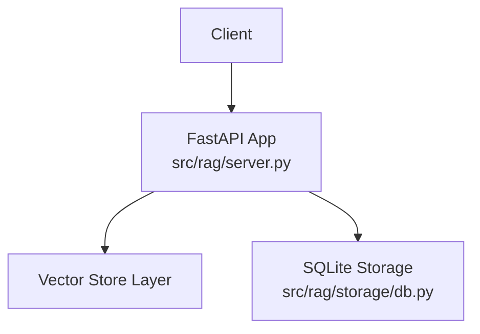
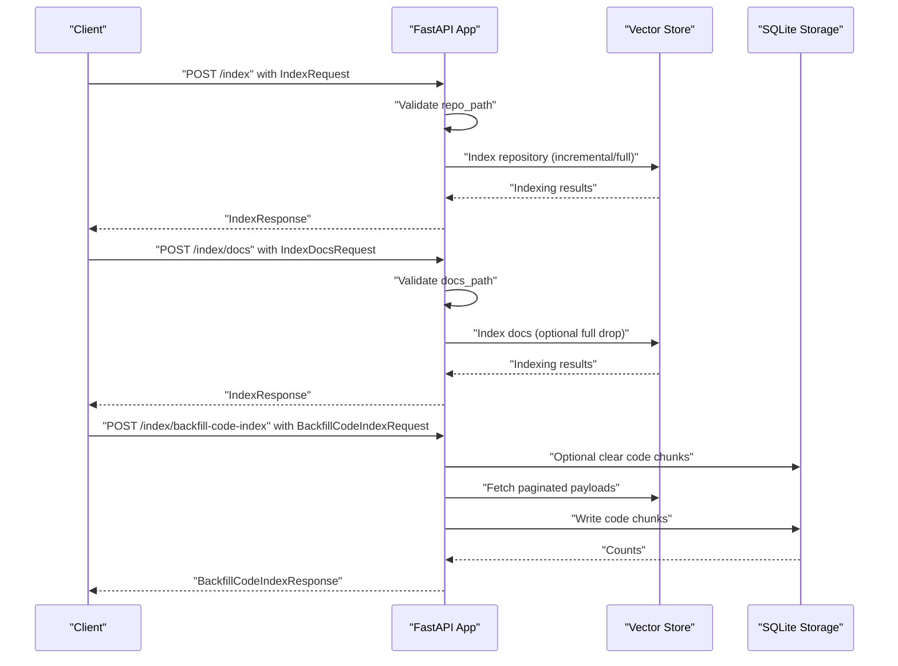
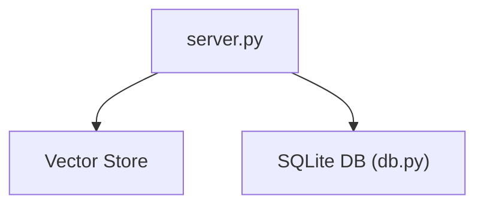

# Indexing Endpoints

<cite>
**Referenced Files in This Document**
- [server.py](file://src/rag/server.py)
- [test_e2e.py](file://tests/test_e2e.py)
- [cli.py](file://src/rag/cli.py)
- [db.py](file://src/rag/storage/db.py)
</cite>

## Table of Contents
1. [Introduction](#introduction)
2. [Project Structure](#project-structure)
3. [Core Components](#core-components)
4. [Architecture Overview](#architecture-overview)
5. [Detailed Component Analysis](#detailed-component-analysis)
6. [Dependency Analysis](#dependency-analysis)
7. [Performance Considerations](#performance-considerations)
8. [Troubleshooting Guide](#troubleshooting-guide)
9. [Conclusion](#conclusion)

## Introduction
This document provides detailed API documentation for repository and documentation indexing endpoints. It covers:
- POST /index for repository indexing with repository path, full scan mode, and language filtering options
- POST /index/docs for documentation indexing with documentation path and document type filtering
- POST /index/backfill-code-index for bulk indexing operations with pagination and collection targeting
It also documents request/response schemas, path validation, error handling, batch processing behavior, and practical usage scenarios. Differences between incremental and full indexing modes are explained.

## Project Structure
The indexing endpoints are implemented in the FastAPI application module. Supporting logic for validation, vector storage operations, and database queries resides in related modules.

**Diagram sources**
- [server.py](file://src/rag/server.py)
- [db.py](file://src/rag/storage/db.py)

**Section sources**
- [server.py](file://src/rag/server.py)

## Core Components
- Request and response models for indexing operations
- Endpoint handlers for repository indexing, documentation indexing, and backfill operations
- Validation utilities for path inputs
- Batch processing and pagination behavior for backfill operations

Key schemas and endpoints:
- IndexRequest and IndexResponse for repository indexing
- IndexDocsRequest and IndexResponse for documentation indexing
- BackfillCodeIndexRequest and BackfillCodeIndexResponse for bulk indexing
- Endpoints: POST /index, POST /index/docs, POST /index/backfill-code-index

**Section sources**
- [server.py:316-353](file://src/rag/server.py#L316-L353)
- [server.py:355-366](file://src/rag/server.py#L355-L366)
- [server.py:2334-2400](file://src/rag/server.py#L2334-L2400)
- [server.py:2374-2400](file://src/rag/server.py#L2374-L2400)
- [server.py:1289-1361](file://src/rag/server.py#L1289-L1361)

## Architecture Overview
The indexing pipeline integrates FastAPI routes, validation, vector store operations, and SQLite-backed code indexing. The CLI can trigger indexing jobs and poll for completion.

**Diagram sources**
- [server.py:2334-2400](file://src/rag/server.py#L2334-L2400)
- [server.py:2374-2400](file://src/rag/server.py#L2374-L2400)
- [server.py:1289-1361](file://src/rag/server.py#L1289-L1361)

## Detailed Component Analysis

### POST /index (Repository Indexing)
Purpose:
- Index a local repository at repo_path with optional full scan and language filtering.

Request Schema: IndexRequest
- repo_path: string, required. Absolute path to a directory. Validation ensures existence, directory type, and no path traversal.
- full: boolean, optional, default false. When true, drops the target collection before indexing.
- languages: array of strings, optional. Filters files by language. Unknown languages are sanitized out.
- collection: string, optional. Overrides the default collection derived from the repository.

Response Schema: IndexResponse
- files_processed: integer
- chunks_indexed: integer
- files_skipped: integer
- files_deleted: integer
- errors: array of strings

Behavior:
- Validates repo_path using strict checks (exists, is dir, no traversal).
- Supports incremental indexing by default; full mode clears prior data if enabled.
- Applies language filters to restrict processing to supported languages.
- Returns counts and any encountered errors.

Validation and Sanitization:
- Path validation blocks non-existent or non-directory paths and path traversal attempts.
- Language filters are sanitized; unknown languages are removed.

Batch and Pagination:
- Not applicable for this endpoint; processes repository in batches internally by the indexing pipeline.

Error Handling:
- On failure, returns HTTP 500 with a descriptive message including the exception type.

Practical Examples:
- Full repository index:
  - POST /index with {"repo_path": "/absolute/path/to/repo", "full": true}
- Incremental index with language filter:
  - POST /index with {"repo_path": "/absolute/path/to/repo", "languages": ["python", "javascript"]}
- Target a specific collection:
  - POST /index with {"repo_path": "/absolute/path/to/repo", "collection": "my-collection"}

Differences Between Incremental and Full Indexing:
- Incremental: Adds new or changed files without clearing prior data.
- Full: Drops the target collection and rebuilds from scratch.

**Section sources**
- [server.py:316-327](file://src/rag/server.py#L316-L327)
- [server.py:2334-2360](file://src/rag/server.py#L2334-L2360)
- [server.py:2360-2400](file://src/rag/server.py#L2360-L2400)
- [test_e2e.py:253-276](file://tests/test_e2e.py#L253-L276)

### POST /index/docs (Documentation Indexing)
Purpose:
- Index documentation files located at docs_path with optional document type filtering and full mode.

Request Schema: IndexDocsRequest
- docs_path: string, required. Absolute path to a directory. Validation ensures existence and no path traversal.
- collection: string, optional. Overrides the default documentation collection.
- doc_types: array of strings, optional. Filters documents by type.
- full: boolean, optional, default false. When true, drops the target collection before indexing.

Response Schema: IndexResponse
- Same as repository indexing response.

Behavior:
- Validates docs_path similarly to repo_path.
- Supports incremental indexing by default; full mode clears prior data if enabled.
- Filters documents by doc_types when provided.

Error Handling:
- On failure, returns HTTP 500 with a descriptive message.

Practical Examples:
- Full documentation index:
  - POST /index/docs with {"docs_path": "/absolute/path/to/docs", "full": true}
- Filter by document types:
  - POST /index/docs with {"docs_path": "/absolute/path/to/docs", "doc_types": ["guide", "api"]}

**Section sources**
- [server.py:330-344](file://src/rag/server.py#L330-L344)
- [server.py:2374-2400](file://src/rag/server.py#L2374-L2400)

### POST /index/backfill-code-index (Bulk Code Index Backfill)
Purpose:
- Populate SQLite code_index from existing Qdrant payloads to avoid a full embedding pass.

Request Schema: BackfillCodeIndexRequest
- repo: string, optional. Derives collection if collection is not provided.
- collection: string, optional. Explicitly targets a collection.
- clear: boolean, optional, default true. If true, clears existing code chunks for the collection before backfill.
- page_size: integer, optional, default 256. Must be between 1 and 1000.

Response Schema: BackfillCodeIndexResponse
- collection: string
- chunks_indexed: integer
- chunks_skipped: integer
- latency_ms: number

Behavior:
- Determines collection from repo or uses explicit collection.
- Optionally clears existing code chunks if clear is true.
- Iterates over paginated results from the vector store client.
- Writes code chunks to SQLite storage and returns counts and latency.

Batch and Pagination:
- Uses page_size to iterate in pages up to 1000 per request.
- Aggregates indexed and skipped counts across pages.

Error Handling:
- On failure, returns HTTP 500 with a descriptive message.

Practical Example:
- Backfill with defaults:
  - POST /index/backfill-code-index with {}
- Backfill with explicit collection and smaller page size:
  - POST /index/backfill-code-index with {"collection": "my-collection", "page_size": 128}

**Section sources**
- [server.py:355-366](file://src/rag/server.py#L355-L366)
- [server.py:1289-1361](file://src/rag/server.py#L1289-L1361)

### Path Validation and Sanitization
- repo_path and docs_path validations:
  - Resolve to absolute paths and check existence and type.
  - Reject path traversal attempts.
- Language filters sanitization:
  - Unknown languages are removed; known languages and other fields are preserved.

**Section sources**
- [server.py:316-327](file://src/rag/server.py#L316-L327)
- [server.py:336-344](file://src/rag/server.py#L336-L344)
- [db.py:278-295](file://src/rag/storage/db.py#L278-L295)

### End-to-End Workflow and Job Tracking
- The CLI can trigger indexing jobs and poll /index/jobs to track progress and match jobs by repo_path, collection, full flag, and languages.

**Section sources**
- [cli.py:1384-1429](file://src/rag/cli.py#L1384-L1429)
- [server.py:1285-1287](file://src/rag/server.py#L1285-L1287)

## Dependency Analysis
Relationships among components involved in indexing:

**Diagram sources**
- [server.py](file://src/rag/server.py)
- [db.py](file://src/rag/storage/db.py)

**Section sources**
- [server.py](file://src/rag/server.py)
- [db.py](file://src/rag/storage/db.py)

## Performance Considerations
- Full indexing mode drops and rebuilds collections, which is more expensive but ensures consistency.
- Incremental indexing minimizes work by processing only new or changed files.
- Backfill operations use pagination controlled by page_size; larger page sizes reduce overhead but increase memory footprint.
- Vector store operations are logged with latency metrics for monitoring.

## Troubleshooting Guide
Common issues and resolutions:
- Path validation errors:
  - Ensure repo_path and docs_path exist, are directories, and do not contain path traversal sequences.
- Unknown language filters:
  - Remove unsupported languages; only supported languages are processed.
- Full vs incremental confusion:
  - Set full to true to drop and rebuild; leave false for incremental updates.
- Backfill failures:
  - Verify collection name and permissions; check vector store connectivity; retry with adjusted page_size.

**Section sources**
- [server.py:316-327](file://src/rag/server.py#L316-L327)
- [server.py:336-344](file://src/rag/server.py#L336-L344)
- [server.py:1289-1361](file://src/rag/server.py#L1289-L1361)

## Conclusion
The indexing endpoints provide flexible, validated, and observable mechanisms for repository and documentation ingestion, along with efficient bulk backfilling. Use full mode for clean rebuilds, incremental mode for ongoing updates, and backfill to reuse existing vector payloads for faster indexing.