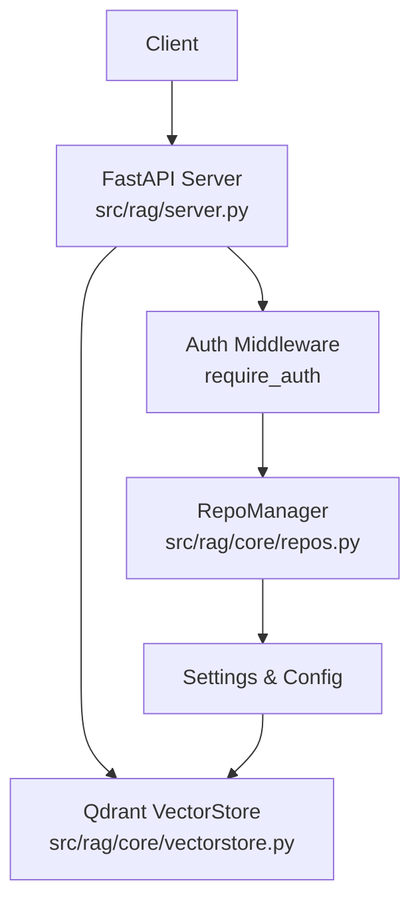
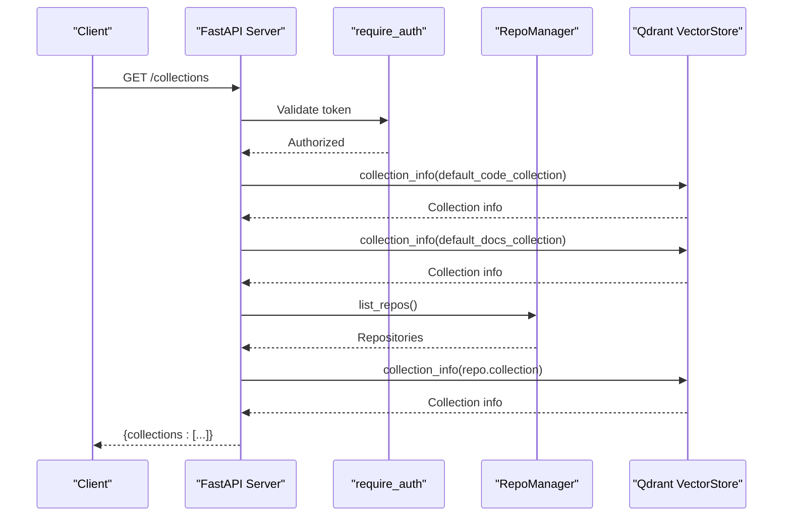
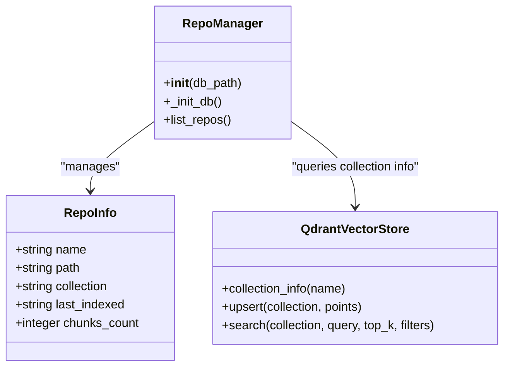
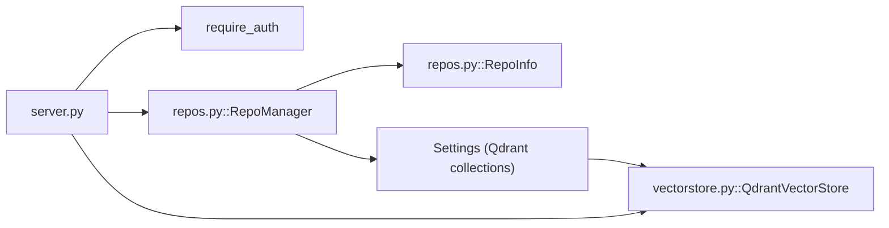

# Repository Management Endpoints

<cite>
**Referenced Files in This Document**
- [server.py](file://src/rag/server.py)
- [repos.py](file://src/rag/core/repos.py)
- [vectorstore.py](file://src/rag/core/vectorstore.py)
- [indexer.py](file://src/rag/core/indexer.py)
- [test_routes.py](file://tests/test_routes.py)
- [test_auth.py](file://tests/test_auth.py)
- [index.html](file://src/rag/web/index.html)
</cite>

## Table of Contents
1. [Introduction](#introduction)
2. [Project Structure](#project-structure)
3. [Core Components](#core-components)
4. [Architecture Overview](#architecture-overview)
5. [Detailed Component Analysis](#detailed-component-analysis)
6. [Dependency Analysis](#dependency-analysis)
7. [Performance Considerations](#performance-considerations)
8. [Troubleshooting Guide](#troubleshooting-guide)
9. [Conclusion](#conclusion)

## Introduction
This document provides comprehensive API documentation for repository management HTTP endpoints in the RAG system. It focuses on:
- Listing indexed repositories with filtering and pagination support
- Reloading the daemon with force option and configuration refresh
- Response schemas (RepoListResponse, ReloadResponse)
- Repository collection management and isolation behavior
- Authentication requirements and repository validation
- Examples of repository discovery, reload scenarios, and collection switching
- The relationship between repositories and Qdrant collections

## Project Structure
The repository management endpoints are implemented in the FastAPI application server, with core repository metadata managed by a SQLite-backed registry. Vector operations integrate with Qdrant for collection management.

**Diagram sources**
- [server.py](file://src/rag/server.py)
- [repos.py](file://src/rag/core/repos.py)
- [vectorstore.py](file://src/rag/core/vectorstore.py)

**Section sources**
- [server.py](file://src/rag/server.py)
- [repos.py](file://src/rag/core/repos.py)

## Core Components
- Repository Registry: SQLite-backed database storing repository metadata (name, path, collection, last_indexed, chunks_count).
- Collection Management: Each repository maps to a dedicated Qdrant collection; default collections exist for code and documentation.
- Authentication: All protected endpoints require a bearer token via the require_auth dependency.
- Vector Store Operations: Upsert, search, and collection info queries against Qdrant.

Key implementation references:
- Repository metadata model and manager: [repos.py](file://src/rag/core/repos.py)
- Protected endpoints and collection listing: [server.py](file://src/rag/server.py)
- Vector store integration: [vectorstore.py](file://src/rag/core/vectorstore.py)

**Section sources**
- [repos.py:13-42](file://src/rag/core/repos.py#L13-L42)
- [server.py:1010-1051](file://src/rag/server.py#L1010-L1051)
- [vectorstore.py:393-431](file://src/rag/core/vectorstore.py#L393-L431)

## Architecture Overview
The system separates concerns across layers:
- Web Layer: FastAPI routes handle HTTP requests and enforce authentication.
- Domain Layer: RepoManager manages repository metadata and persistence.
- Storage Layer: Qdrant vector store persists embeddings and supports collection-level operations.
- UI Integration: Frontend polls collection status and displays live repositories.

**Diagram sources**
- [server.py:1012-1051](file://src/rag/server.py#L1012-L1051)
- [repos.py:22-42](file://src/rag/core/repos.py#L22-L42)
- [vectorstore.py:424-431](file://src/rag/core/vectorstore.py#L424-L431)

## Detailed Component Analysis

### Endpoint: GET /collections
Purpose: List all Qdrant collections associated with the daemon, including default code/docs collections and per-repository collections. Each entry includes repository metadata and collection statistics.

Behavior:
- Requires authentication via bearer token.
- Returns a list of collections with fields: name, kind, repo (optional), path (optional), and Qdrant collection info (status, points_count, etc.).
- Attempts to fetch collection info for default collections and all registered repositories.

Response Schema:
- collections: array of collection objects
  - name: string (collection name)
  - kind: string ("default" or "repo")
  - repo: string (repository name, optional)
  - path: string (repository path, optional)
  - status: string (e.g., "not_found", optional)
  - points_count: integer (Qdrant points count)

Example usage:
- Polling endpoint for UI to display live repositories and collection stats.

**Section sources**
- [server.py:1012-1051](file://src/rag/server.py#L1012-L1051)

### Endpoint: POST /admin/reload
Purpose: Reload the daemon process with optional force flag and configuration refresh.

Behavior:
- Requires authentication via bearer token.
- Accepts request body with force option (boolean) to control reload behavior.
- Triggers daemon reload and returns a structured ReloadResponse.

Response Schema:
- status: string (reload outcome)
- message: string (human-readable status)
- timestamp: number (epoch seconds)

Notes:
- The force option allows bypassing certain checks during reload.
- Configuration refresh ensures the daemon picks up latest settings.

**Section sources**
- [server.py:2477-2490](file://src/rag/server.py#L2477-L2490)

### Repository Collection Management and Isolation
- Each repository is mapped to a dedicated Qdrant collection via RepoManager.
- Default collections exist for code and documentation; per-repository collections are enumerated from the registry.
- Collection isolation ensures that queries and operations target only the intended repository.

**Diagram sources**
- [repos.py:13-42](file://src/rag/core/repos.py#L13-L42)
- [vectorstore.py:424-431](file://src/rag/core/vectorstore.py#L424-L431)

**Section sources**
- [repos.py:13-42](file://src/rag/core/repos.py#L13-L42)
- [vectorstore.py:393-431](file://src/rag/core/vectorstore.py#L393-L431)

### Authentication and Validation
- Authentication: All protected endpoints depend on require_auth, expecting a Bearer token in the Authorization header.
- Validation: Requests are validated by FastAPI pydantic models; invalid inputs return 422 Unprocessable Entity.
- CSRF Protection: Non-safe methods are guarded against cross-origin submissions unless originating from localhost or a valid bearer token is present.

References:
- Authentication middleware and CSRF guard: [server.py:772-817](file://src/rag/server.py#L772-L817)
- Route validation tests: [test_routes.py:140-186](file://tests/test_routes.py#L140-L186)
- Successful authenticated requests: [test_auth.py:109-134](file://tests/test_auth.py#L109-L134)

**Section sources**
- [server.py:772-817](file://src/rag/server.py#L772-L817)
- [test_routes.py:140-186](file://tests/test_routes.py#L140-L186)
- [test_auth.py:109-134](file://tests/test_auth.py#L109-L134)

### Repository Discovery and Collection Switching
- Discovery: The frontend polls /collections to discover live repositories and collection counts.
- Collection switching: The UI constructs labels combining repository name and collection, enabling user-driven selection across repositories.

UI integration references:
- Frontend polling and rendering: [index.html:543-576](file://src/rag/web/index.html#L543-L576)

**Section sources**
- [index.html:543-576](file://src/rag/web/index.html#L543-L576)

### Example Workflows

#### Listing Indexed Repositories
- Call GET /collections to retrieve current state of default and repository-specific collections.
- Use the returned repo and name fields to correlate collections with repositories.

**Section sources**
- [server.py:1012-1051](file://src/rag/server.py#L1012-L1051)

#### Reloading the Daemon
- Trigger POST /admin/reload with force set appropriately.
- Observe ReloadResponse for status and timestamp.

**Section sources**
- [server.py:2477-2490](file://src/rag/server.py#L2477-L2490)

#### Collection Switching in UI
- Poll /collections and render live repositories.
- Allow users to select a repository/collection pair for focused operations.

**Section sources**
- [index.html:543-576](file://src/rag/web/index.html#L543-L576)

## Dependency Analysis
The following diagram shows key dependencies among components involved in repository management:

**Diagram sources**
- [server.py](file://src/rag/server.py)
- [repos.py:13-42](file://src/rag/core/repos.py#L13-L42)
- [vectorstore.py:424-431](file://src/rag/core/vectorstore.py#L424-L431)

**Section sources**
- [server.py](file://src/rag/server.py)
- [repos.py:13-42](file://src/rag/core/repos.py#L13-L42)
- [vectorstore.py:424-431](file://src/rag/core/vectorstore.py#L424-L431)

## Performance Considerations
- Collection Info Queries: Each repository collection requires a separate info call; batch operations should be minimized to reduce latency.
- Upsert and Search: Vector operations are asynchronous; ensure appropriate top_k and filters to control query cost.
- Rate Limiting: The server enforces rate limiting via middleware to prevent abuse.

[No sources needed since this section provides general guidance]

## Troubleshooting Guide
Common issues and resolutions:
- Authentication failures: Ensure Authorization header contains a valid bearer token for protected endpoints.
- Unknown repository: Verify repository registration via RepoManager and that the collection exists in Qdrant.
- Empty collections: Confirm indexing completed successfully; check last_indexed and chunks_count fields.
- CSRF blocked: Non-safe requests from external origins without a bearer token are rejected.

Validation references:
- Authentication and route tests: [test_auth.py:109-134](file://tests/test_auth.py#L109-L134), [test_routes.py:140-186](file://tests/test_routes.py#L140-L186)

**Section sources**
- [test_auth.py:109-134](file://tests/test_auth.py#L109-L134)
- [test_routes.py:140-186](file://tests/test_routes.py#L140-L186)

## Conclusion
The repository management endpoints provide a robust foundation for multi-repository operations with clear collection isolation and strong authentication. By leveraging RepoManager for metadata and Qdrant for vector persistence, the system supports scalable discovery, reload, and switching across repositories.