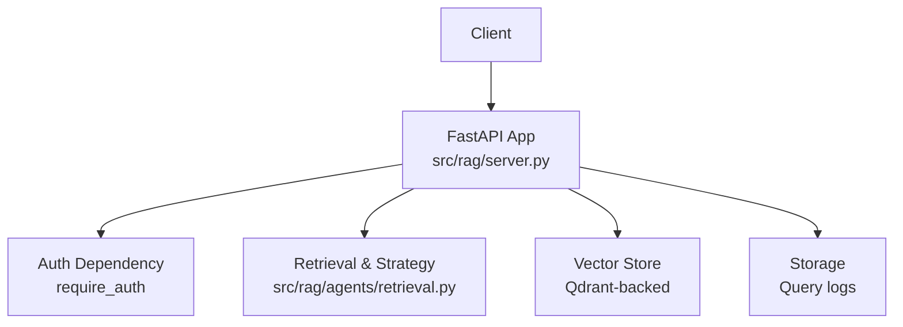
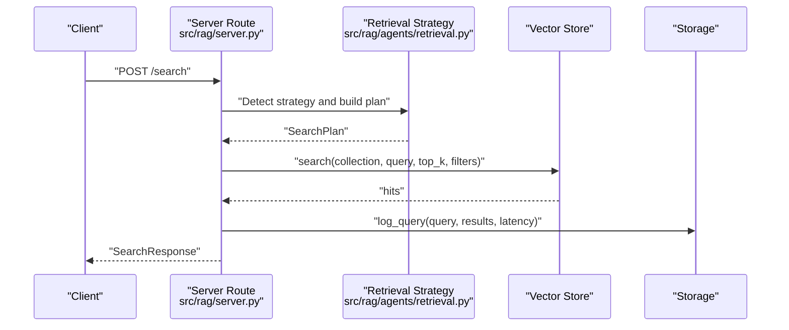
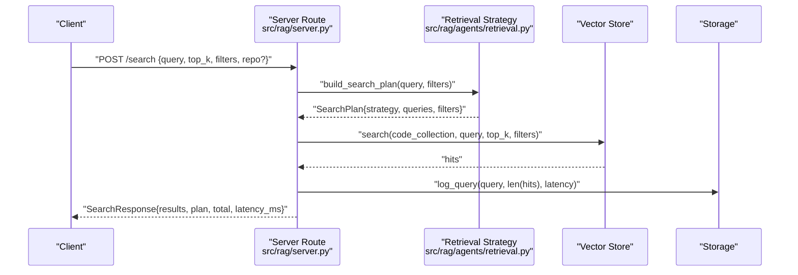
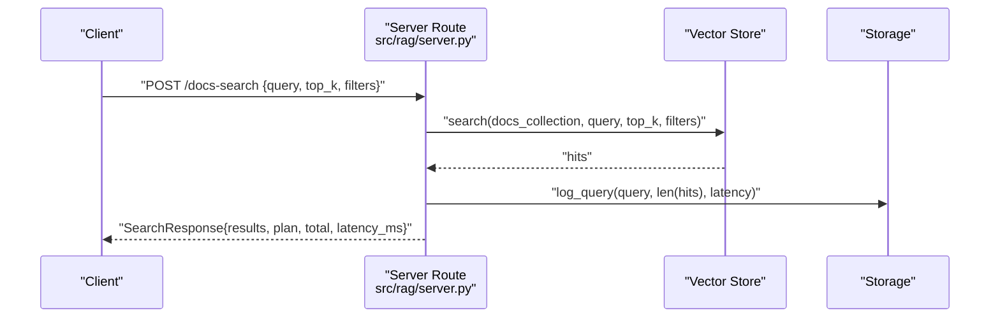
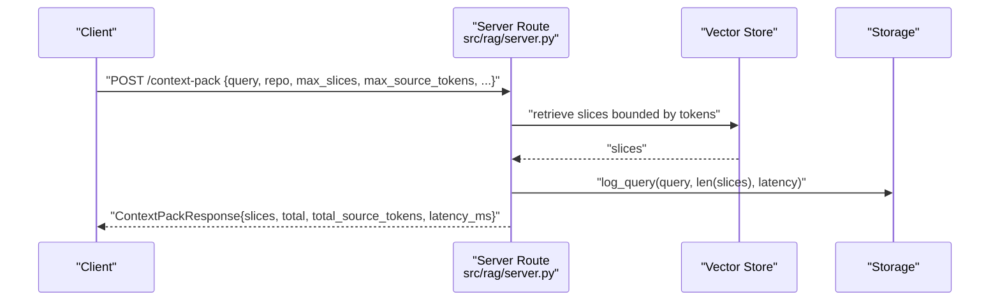
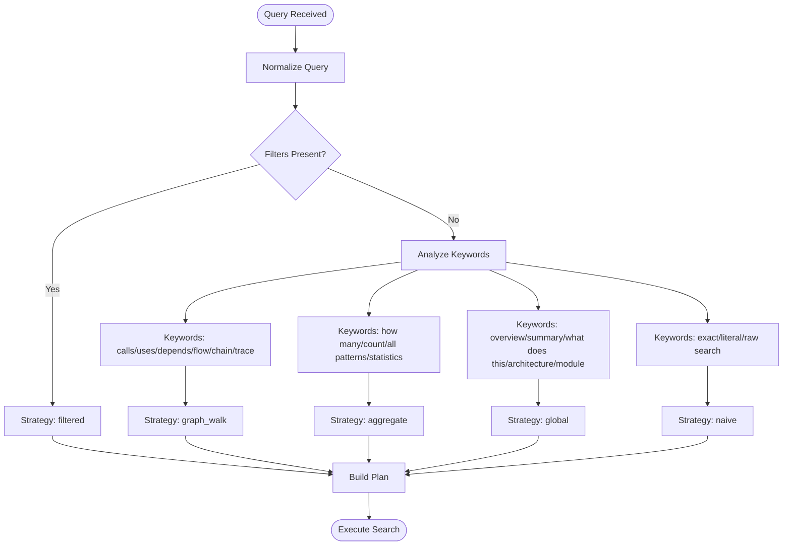
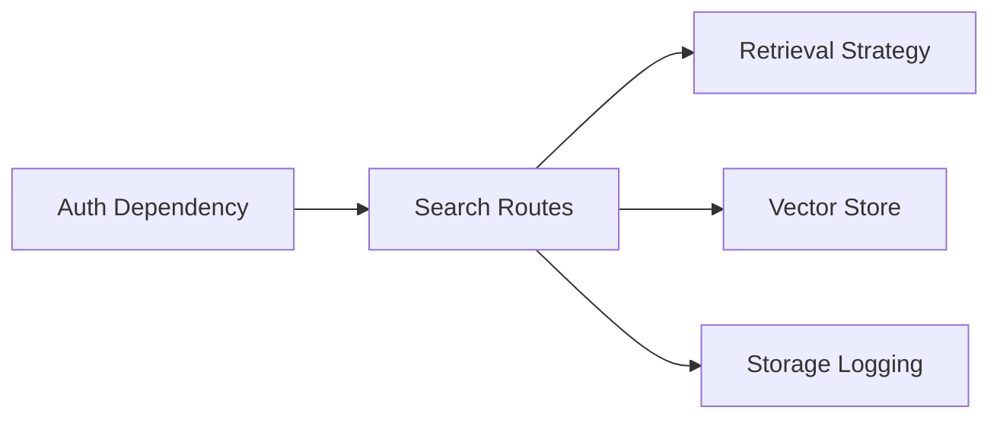

# Search Endpoints

<cite>
**Referenced Files in This Document**
- [server.py](file://src/rag/server.py)
- [retrieval.py](file://src/rag/agents/retrieval.py)
- [test_routes.py](file://tests/test_routes.py)
- [test_e2e.py](file://tests/test_e2e.py)
- [cli.py](file://src/rag/cli.py)
</cite>

## Table of Contents
1. [Introduction](#introduction)
2. [Project Structure](#project-structure)
3. [Core Components](#core-components)
4. [Architecture Overview](#architecture-overview)
5. [Detailed Component Analysis](#detailed-component-analysis)
6. [Dependency Analysis](#dependency-analysis)
7. [Performance Considerations](#performance-considerations)
8. [Troubleshooting Guide](#troubleshooting-guide)
9. [Conclusion](#conclusion)
10. [Appendices](#appendices)

## Introduction
This document provides comprehensive API documentation for search-related HTTP endpoints exposed by the backend service. It covers:
- POST /search for semantic code search with query, top_k, filters, and repo parameters
- POST /docs-search for documentation search with similar parameters
- POST /context-pack for building context packs with token budgeting and slicing options

It also documents authentication requirements, error handling, request/response schemas using Pydantic models, practical usage examples, and curl commands. Finally, it explains the relationship between different search strategies.

## Project Structure
The search endpoints are implemented in the FastAPI application module. The relevant routes and their handlers are defined alongside supporting retrieval logic and tests.



**Diagram sources**
- [server.py](file://src/rag/server.py)
- [retrieval.py](file://src/rag/agents/retrieval.py)

**Section sources**
- [server.py](file://src/rag/server.py)
- [retrieval.py](file://src/rag/agents/retrieval.py)

## Core Components
This section outlines the three primary endpoints and their associated Pydantic models.

- POST /search
  - Purpose: Semantic code search across indexed code
  - Authentication: Required
  - Request model: SearchRequest
  - Response model: SearchResponse
  - Additional parameters: filters, repo (optional)
  - Behavior: Applies strategy detection, executes vector search, aggregates results, and logs query metrics

- POST /docs-search
  - Purpose: Semantic documentation/spec search across docs collection
  - Authentication: Required
  - Request model: DocsSearchRequest
  - Response model: SearchResponse
  - Behavior: Executes vector search against docs collection and returns results with strategy metadata

- POST /context-pack
  - Purpose: Build a token-bounded context pack for a given query and repository
  - Authentication: Required
  - Request model: ContextPackRequest
  - Response model: ContextPackResponse
  - Behavior: Builds a compact, token-aware slice set for developer workflows

Key Pydantic models (request/response) used by these endpoints:
- SearchRequest
- SearchResponse
- DocsSearchRequest
- ContextPackRequest
- ContextPackResponse
- SearchPlanInfo
- SearchResultItem

Note: The exact model definitions are implemented in the server module and referenced by the route handlers.

**Section sources**
- [server.py](file://src/rag/server.py)

## Architecture Overview
The search endpoints share a common pattern:
- Authentication enforced via a dependency
- Strategy detection and plan construction (for /search)
- Vector store search invocation
- Result aggregation and response packaging
- Query metrics logging



**Diagram sources**
- [server.py](file://src/rag/server.py)
- [retrieval.py](file://src/rag/agents/retrieval.py)

**Section sources**
- [server.py](file://src/rag/server.py)
- [retrieval.py](file://src/rag/agents/retrieval.py)

## Detailed Component Analysis

### POST /search
- Endpoint: POST /search
- Authentication: Required
- Handler: search (route registration and implementation)
- Request model: SearchRequest
- Response model: SearchResponse
- Behavior:
  - Detects strategy based on query keywords and filters
  - Builds a plan with expanded queries and sanitized filters
  - Executes vector search against the configured code collection
  - Aggregates results and attaches matched query indices
  - Logs query statistics
  - Returns structured SearchResponse with plan metadata



**Diagram sources**
- [server.py](file://src/rag/server.py)
- [retrieval.py](file://src/rag/agents/retrieval.py)

**Section sources**
- [server.py](file://src/rag/server.py)
- [retrieval.py](file://src/rag/agents/retrieval.py)

### POST /docs-search
- Endpoint: POST /docs-search
- Authentication: Required
- Handler: docs_search
- Request model: DocsSearchRequest
- Response model: SearchResponse
- Behavior:
  - Executes vector search against the docs collection
  - Constructs SearchResponse with strategy metadata indicating docs search
  - Logs execution metrics



**Diagram sources**
- [server.py](file://src/rag/server.py)

**Section sources**
- [server.py](file://src/rag/server.py)

### POST /context-pack
- Endpoint: POST /context-pack
- Authentication: Required
- Handler: context_pack
- Request model: ContextPackRequest
- Response model: ContextPackResponse
- Behavior:
  - Builds a token-bounded set of source slices for a query and repository
  - Supports toggles for AST index usage and semantic inclusion
  - Returns aggregated slices and token counts



**Diagram sources**
- [server.py](file://src/rag/server.py)

**Section sources**
- [server.py](file://src/rag/server.py)

### Relationship Between Search Strategies
The system detects and applies different strategies based on query semantics and filters:
- lod_drill (default): Local on-demand drill-down
- filtered: Applies filters to constrain search
- graph_walk: Traversal-style queries (e.g., calls, uses, depends)
- aggregate: Count/statistics queries
- global: Overview/summary/architecture queries
- naive/exact/raw: Direct vector search without reranking

These strategies influence how queries are expanded and filtered before vector search.



**Diagram sources**
- [retrieval.py](file://src/rag/agents/retrieval.py)

**Section sources**
- [retrieval.py](file://src/rag/agents/retrieval.py)

## Dependency Analysis
- Authentication dependency ensures all search endpoints require a valid token
- Retrieval strategy module influences plan construction for /search
- Vector store handles vector similarity search for both code and docs collections
- Storage logs queries for observability and metrics



**Diagram sources**
- [server.py](file://src/rag/server.py)
- [retrieval.py](file://src/rag/agents/retrieval.py)

**Section sources**
- [server.py](file://src/rag/server.py)
- [retrieval.py](file://src/rag/agents/retrieval.py)

## Performance Considerations
- top_k controls result cardinality; larger values increase latency and token usage
- filters reduce search space and improve precision
- Token budgeting in /context-pack helps keep downstream consumption manageable
- Query logging enables monitoring of latency and throughput

[No sources needed since this section provides general guidance]

## Troubleshooting Guide
Common issues and resolutions:
- 401 Unauthorized: Ensure Authorization header is present and valid
- 403 Forbidden: Verify token permissions
- 404 Not Found: Occurs when a requested repository is unknown
- 422 Unprocessable Entity: Validation failures for empty query, excessive length, or out-of-range top_k
- 500 Internal Server Error: Backend exceptions during search or pack building

Validation and error handling are enforced by the server routes and tests.

**Section sources**
- [test_routes.py](file://tests/test_routes.py)
- [server.py](file://src/rag/server.py)

## Conclusion
The search endpoints provide a robust foundation for semantic code and documentation discovery, along with a token-aware context packing capability. Strategy detection enhances relevance, while strict validation and logging support reliability and observability.

[No sources needed since this section summarizes without analyzing specific files]

## Appendices

### Request/Response Schemas Overview
- SearchRequest
  - Fields: query (string), top_k (integer), filters (object), repo (string, optional)
  - Used by: POST /search
- DocsSearchRequest
  - Fields: query (string), top_k (integer), filters (object)
  - Used by: POST /docs-search
- ContextPackRequest
  - Fields: query (string), repo (string), max_slices (integer), max_source_tokens (integer), use_ast_index (boolean), include_semantic (boolean)
  - Used by: POST /context-pack
- SearchResponse
  - Fields: results (array of SearchResultItem), query (string), plan (SearchPlanInfo), total (integer), latency_ms (number)
- ContextPackResponse
  - Fields: query (string), repo (string), slices (array), total (integer), total_source_tokens (integer), latency_ms (number)
- SearchPlanInfo
  - Fields: strategy (string), queries (array), filters (object)
- SearchResultItem
  - Fields: derived from vector store hit slim representation plus matched_queries

Note: These models are defined and used within the server module and referenced by the route handlers.

**Section sources**
- [server.py](file://src/rag/server.py)

### Authentication Requirements
- All search endpoints require a valid Authorization header
- Tests demonstrate proper header usage and expected failures without it

**Section sources**
- [test_routes.py](file://tests/test_routes.py)

### Practical Usage Examples

- POST /search
  - Example curl:
    ```bash
    curl -X POST "$BASE_URL/search" \
      -H "Authorization: Bearer $TOKEN" \
      -H "Content-Type: application/json" \
      -d '{"query":"user login authentication token","top_k":5}'
    ```
  - Example curl with filters and repo:
    ```bash
    curl -X POST "$BASE_URL/search" \
      -H "Authorization: Bearer $TOKEN" \
      -H "Content-Type: application/json" \
      -d '{"query":"error handling","top_k":10,"filters":{"tag":"backend"},"repo":"my-repo"}'
    ```

- POST /docs-search
  - Example curl:
    ```bash
    curl -X POST "$BASE_URL/docs-search" \
      -H "Authorization: Bearer $TOKEN" \
      -H "Content-Type: application/json" \
      -d '{"query":"authentication flow","top_k":8}'
    ```

- POST /context-pack
  - Example curl:
    ```bash
    curl -X POST "$BASE_URL/context-pack" \
      -H "Authorization: Bearer $TOKEN" \
      -H "Content-Type: application/json" \
      -d '{"query":"login handler","repo":"my-repo","max_slices":5,"max_source_tokens":2000,"use_ast_index":true,"include_semantic":false}'
    ```

- CLI usage (internal client)
  - The CLI posts to /context-pack and prints formatted results

**Section sources**
- [test_e2e.py](file://tests/test_e2e.py)
- [cli.py](file://src/rag/cli.py)