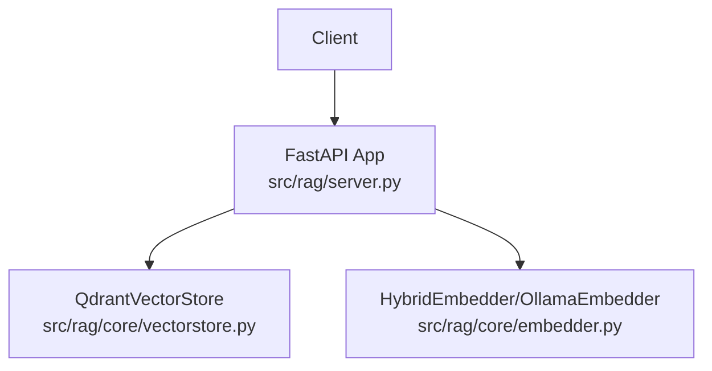
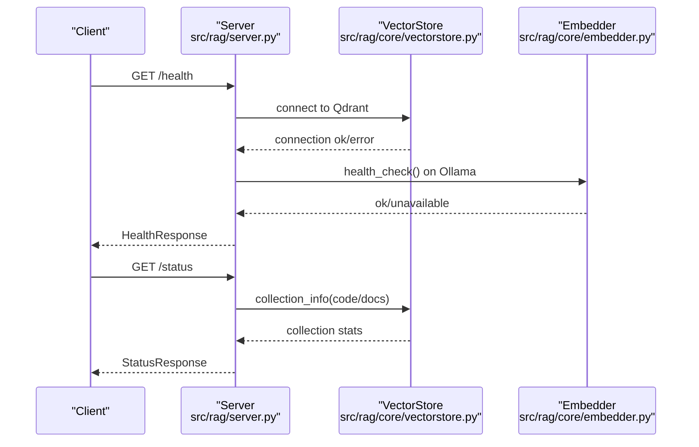
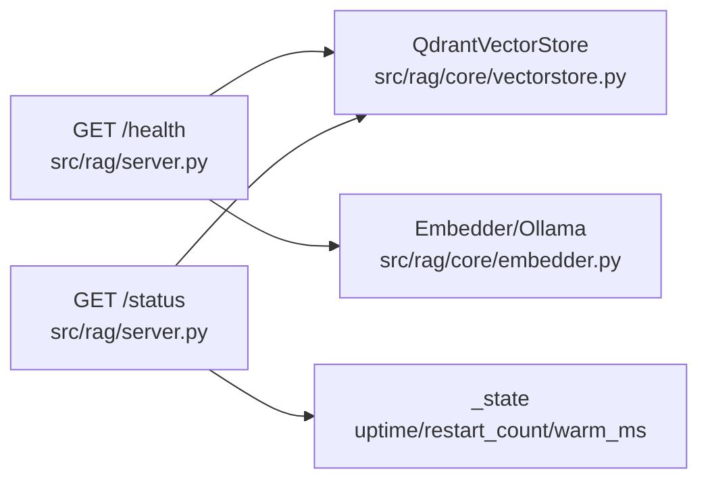

# System Status Endpoints

<cite>
**Referenced Files in This Document**
- [server.py](file://src/rag/server.py)
- [vectorstore.py](file://src/rag/core/vectorstore.py)
- [embedder.py](file://src/rag/core/embedder.py)
</cite>

## Table of Contents
1. [Introduction](#introduction)
2. [Project Structure](#project-structure)
3. [Core Components](#core-components)
4. [Architecture Overview](#architecture-overview)
5. [Detailed Component Analysis](#detailed-component-analysis)
6. [Dependency Analysis](#dependency-analysis)
7. [Performance Considerations](#performance-considerations)
8. [Troubleshooting Guide](#troubleshooting-guide)
9. [Conclusion](#conclusion)

## Introduction
This document provides detailed API documentation for system status and health monitoring endpoints exposed by the backend service. It covers:
- GET /health: service availability and component status reporting
- GET /status: comprehensive system information including embedder details, collection status, uptime metrics, and performance indicators

It explains the response schemas (HealthResponse, StatusResponse), the meaning of status fields, monitoring examples, integration patterns, and how to interpret performance metrics such as restart counts, embedder warm-up timing, and Qdrant connectivity status.

## Project Structure
The health and status endpoints are implemented in the FastAPI application module. Supporting components include:
- Vector store integration for Qdrant collection information
- Embedder health checks for Ollama availability
- In-memory state tracking for uptime, restart count, and warm-up timing

**Diagram sources**
- [server.py:840-875](file://src/rag/server.py#L840-L875)
- [vectorstore.py:507-525](file://src/rag/core/vectorstore.py#L507-L525)
- [embedder.py:154-154](file://src/rag/core/embedder.py#L154-L154)

**Section sources**
- [server.py:840-875](file://src/rag/server.py#L840-L875)
- [vectorstore.py:507-525](file://src/rag/core/vectorstore.py#L507-L525)
- [embedder.py:154-154](file://src/rag/core/embedder.py#L154-L154)

## Core Components
- Health endpoint (/health): Returns overall system status and per-component status (Qdrant, Embedder provider, Ollama, Reranker).
- Status endpoint (/status): Returns detailed system information including embedder/provider/model, collection stats, uptime, indexing metrics, and restart counters.

Key runtime state used by endpoints:
- Restart counter persisted to disk and loaded on startup
- Uptime computed from process start time
- Embedder warm-up timing captured during initialization

**Section sources**
- [server.py:840-875](file://src/rag/server.py#L840-L875)
- [server.py:878-958](file://src/rag/server.py#L878-L958)
- [server.py:613-641](file://src/rag/server.py#L613-L641)

## Architecture Overview
The health and status endpoints integrate with the vector store and embedder subsystems to report real-time system health and operational status.

**Diagram sources**
- [server.py:840-875](file://src/rag/server.py#L840-L875)
- [server.py:878-958](file://src/rag/server.py#L878-L958)
- [vectorstore.py:507-525](file://src/rag/core/vectorstore.py#L507-L525)
- [embedder.py:154-154](file://src/rag/core/embedder.py#L154-L154)

## Detailed Component Analysis

### Health Endpoint: GET /health
Purpose:
- Report service availability and component status for Qdrant, Embedder provider, Ollama, and Reranker.

Behavior:
- Qdrant: Attempts to establish a client connection; marks status as ok or error.
- Embedder: Reports the provider string if initialized; otherwise indicates not_initialized.
- Reranker: Reported as disabled.
- Ollama: Uses the shared embedder’s underlying client health_check if available; otherwise constructs a temporary OllamaEmbedder for a single health check. Returns ok or unavailable.

Response Schema: HealthResponse
- Fields:
  - status: overall system status (ok or degraded)
  - components: dictionary containing component-specific statuses
    - qdrant: ok or error
    - embedder: provider string or not_initialized
    - reranker: disabled
    - ollama: ok or unavailable

Operational Notes:
- The overall status is ok only if Qdrant is ok; otherwise degraded.
- Ollama health check avoids repeated instantiation by reusing the shared embedder’s dense client when available.

Example Monitoring Integration:
- Use a load balancer or orchestrator health probe against /health.
- Treat ok as healthy and degraded as warning; monitor ollama for unexpected unavailable states.

**Section sources**
- [server.py:840-875](file://src/rag/server.py#L840-L875)

### Status Endpoint: GET /status
Purpose:
- Provide comprehensive system information for operators and monitoring dashboards.

Behavior:
- Gathers settings and vector store references.
- Collects collection statistics for code and docs collections via vectorstore.collection_info.
- Computes uptime from process start time.
- Gathers embedder provider, model, and warm-up timing from runtime state.
- Counts indexed files and reports restart count from persistent state.

Response Schema: StatusResponse
- Fields:
  - status: running
  - embedder_provider: provider string from the active embedder
  - embedder_model: configured embeddings model
  - reranker_model: disabled
  - reranker_enabled: false
  - collections: array of collection objects with:
    - name: collection identifier
    - kind: default
    - status: ok/not_found/unknown
    - points_count: number of points
    - vectors_count: number of vectors
  - uptime_seconds: seconds since process start
  - files_indexed: total number of indexed files
  - embedder_warm_ms: milliseconds taken to warm up the embedder
  - restart_count: persistent restart counter
  - gen_model: generation model (if available)
  - gen_ctx_size: generation context size (if available)

Operational Notes:
- Collection info returns not_found when the collection does not exist; otherwise returns status and counts.
- Uptime is computed as current time minus start time.
- Restart count is persisted to disk and incremented on cold start.

Monitoring Examples:
- Track uptime to detect unexpected restarts.
- Monitor collections status and points_count growth to validate indexing.
- Watch embedder_warm_ms to identify slow initialization periods.
- Observe restart_count spikes indicating frequent cold starts.

**Section sources**
- [server.py:878-958](file://src/rag/server.py#L878-L958)
- [vectorstore.py:507-525](file://src/rag/core/vectorstore.py#L507-L525)
- [server.py:613-641](file://src/rag/server.py#L613-L641)

### Supporting Components

#### Vector Store Collection Info
- Purpose: Retrieve collection metadata and status.
- Behavior: Checks existence and fetches collection info; returns not_found when missing.

**Section sources**
- [vectorstore.py:507-525](file://src/rag/core/vectorstore.py#L507-L525)

#### Embedder Health Check
- Purpose: Validate external embedder service availability.
- Behavior: health_check returns true if the underlying service responds.

**Section sources**
- [embedder.py:154-154](file://src/rag/core/embedder.py#L154-L154)

### API Definitions and Field Meanings

#### HealthResponse
- status: overall system health
  - ok: Qdrant is reachable
  - degraded: Qdrant is not reachable
- components:
  - qdrant: ok or error
  - embedder: provider string or not_initialized
  - reranker: disabled
  - ollama: ok or unavailable

#### StatusResponse
- status: running
- embedder_provider: active embedder provider
- embedder_model: configured model name
- reranker_model: disabled
- reranker_enabled: false
- collections: array of collection objects
  - name: collection identifier
  - kind: default
  - status: ok/not_found/unknown
  - points_count: number of stored points
  - vectors_count: number of stored vectors
- uptime_seconds: process uptime in seconds
- files_indexed: total indexed files
- embedder_warm_ms: embedder warm-up duration in milliseconds
- restart_count: persistent restart counter
- gen_model: generation model (if available)
- gen_ctx_size: generation context size (if available)

**Section sources**
- [server.py:840-875](file://src/rag/server.py#L840-L875)
- [server.py:878-958](file://src/rag/server.py#L878-L958)

### Monitoring Examples and Integration Patterns
- Load Balancer/Ingress Probes:
  - Use GET /health for readiness/liveness checks.
  - Treat ok as ready; degraded as warning requiring investigation.
- Dashboard Metrics:
  - Plot uptime_seconds to track stability.
  - Track restart_count to detect frequent cold starts.
  - Monitor collections[].points_count to observe indexing progress.
- Alerting:
  - Alert on qdrant status changing to error.
  - Alert on ollama status changing to unavailable.
  - Alert on sustained increases in embedder_warm_ms.

**Section sources**
- [server.py:840-875](file://src/rag/server.py#L840-L875)
- [server.py:878-958](file://src/rag/server.py#L878-L958)

### Performance Metric Interpretation
- Uptime:
  - Indicates system stability; sudden drops suggest restarts or crashes.
- Restart Count:
  - Increments on cold start; rising values may indicate instability or configuration reloads.
- Embedder Warm-up Timing:
  - Reflects model loading and initialization cost; spikes may indicate model changes or resource contention.
- Qdrant Connectivity:
  - Direct indicator of vector database availability; errors imply downstream search failures.

**Section sources**
- [server.py:613-641](file://src/rag/server.py#L613-L641)
- [server.py:840-875](file://src/rag/server.py#L840-L875)
- [server.py:878-958](file://src/rag/server.py#L878-L958)

## Dependency Analysis
The health and status endpoints depend on:
- Vector store for Qdrant connectivity and collection metadata
- Embedder for provider identity and Ollama health checks
- Runtime state for uptime, restart count, and warm-up timing

**Diagram sources**
- [server.py:840-875](file://src/rag/server.py#L840-L875)
- [server.py:878-958](file://src/rag/server.py#L878-L958)
- [vectorstore.py:507-525](file://src/rag/core/vectorstore.py#L507-L525)
- [embedder.py:154-154](file://src/rag/core/embedder.py#L154-L154)

**Section sources**
- [server.py:840-875](file://src/rag/server.py#L840-L875)
- [server.py:878-958](file://src/rag/server.py#L878-L958)
- [vectorstore.py:507-525](file://src/rag/core/vectorstore.py#L507-L525)
- [embedder.py:154-154](file://src/rag/core/embedder.py#L154-L154)

## Performance Considerations
- Health endpoint minimizes overhead by reusing the shared embedder client for Ollama checks.
- Status endpoint aggregates lightweight metadata; avoid excessive polling in production.
- Persisted restart_count and warm-up timing enable trend analysis without heavy instrumentation.

[No sources needed since this section provides general guidance]

## Troubleshooting Guide
Common issues and resolutions:
- Qdrant error in health:
  - Verify Qdrant service availability and network connectivity.
  - Check credentials and collection names in settings.
- Ollama unavailable:
  - Confirm Ollama service is running and models are pulled.
  - Review logs for health check failures.
- Collections not found:
  - Ensure collections exist and are properly initialized.
  - Validate indexing pipeline and permissions.
- Unexpected restarts:
  - Investigate restart_count spikes; review configuration reloads and crash logs.

**Section sources**
- [server.py:840-875](file://src/rag/server.py#L840-L875)
- [server.py:878-958](file://src/rag/server.py#L878-L958)
- [vectorstore.py:507-525](file://src/rag/core/vectorstore.py#L507-L525)

## Conclusion
The /health and /status endpoints provide essential observability for the system. Use /health for quick availability checks and /status for comprehensive diagnostics. Monitor uptime, restart count, embedder warm-up timing, and Qdrant connectivity to maintain reliable operation.

[No sources needed since this section summarizes without analyzing specific files]