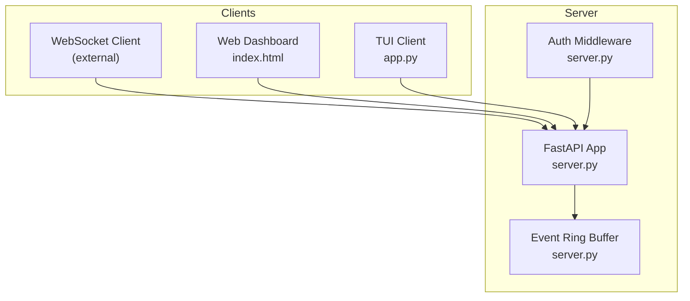
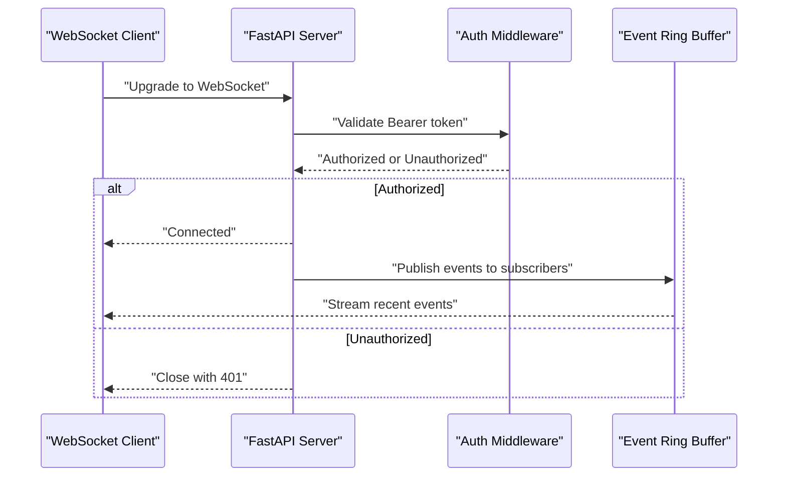
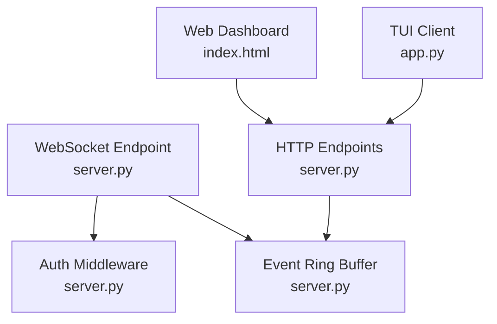
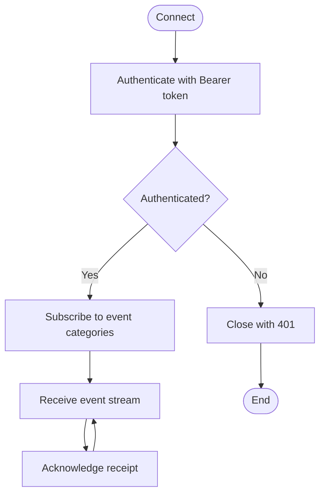

# WebSocket Interface

<cite>
**Referenced Files in This Document**
- [server.py](file://src/rag/server.py)
- [app.py](file://src/rag/app.py)
- [index.html](file://src/rag/web/index.html)
- [events.py](file://src/rag/core/events.py)
- [README.md](file://README.md)
</cite>

## Table of Contents
1. [Introduction](#introduction)
2. [Project Structure](#project-structure)
3. [Core Components](#core-components)
4. [Architecture Overview](#architecture-overview)
5. [Detailed Component Analysis](#detailed-component-analysis)
6. [Dependency Analysis](#dependency-analysis)
7. [Performance Considerations](#performance-considerations)
8. [Troubleshooting Guide](#troubleshooting-guide)
9. [Conclusion](#conclusion)
10. [Appendices](#appendices)

## Introduction
This document specifies the WebSocket interface for real-time communication with the RAG system. It complements the HTTP API by enabling streaming updates, progress notifications, and live indexing feedback. The WebSocket interface is designed to integrate with the existing HTTP endpoints and authentication model, ensuring secure, efficient, and observable real-time interactions.

## Project Structure
The WebSocket interface is implemented as part of the FastAPI server application. The server exposes:
- HTTP endpoints for search, indexing, status, and event streaming
- Authentication via Bearer tokens
- A web dashboard that polls HTTP endpoints for logs and events
- An internal event ring buffer for bounded event history

**Diagram sources**
- [server.py:841-842](file://src/rag/server.py#L841-L842)
- [server.py:558-568](file://src/rag/server.py#L558-L568)
- [server.py:592-598](file://src/rag/server.py#L592-L598)
- [index.html:669-676](file://src/rag/web/index.html#L669-L676)
- [app.py:294-331](file://src/rag/app.py#L294-L331)

**Section sources**
- [server.py:841-842](file://src/rag/server.py#L841-L842)
- [server.py:558-568](file://src/rag/server.py#L558-L568)
- [server.py:592-598](file://src/rag/server.py#L592-L598)
- [index.html:669-676](file://src/rag/web/index.html#L669-L676)
- [app.py:294-331](file://src/rag/app.py#L294-L331)

## Core Components
- WebSocket endpoint: The server supports WebSocket upgrades for real-time streams. The endpoint path is configurable and requires Bearer token authentication.
- Authentication: All WebSocket connections must present a valid Bearer token. Tokens are validated against the configured daemon token.
- Message routing: Messages are routed to subscribers based on event categories and filters. Events are published to a bounded ring buffer for recent history.
- State management: The server maintains shared state for vectorstore, embedder, jobs, and recent events. WebSocket clients can subscribe to state changes via event streams.

Key implementation references:
- WebSocket upgrade and routing logic
- Authentication enforcement for WebSocket connections
- Event publishing and ring buffer management
- HTTP polling patterns used by the web dashboard and TUI

**Section sources**
- [server.py:592-598](file://src/rag/server.py#L592-L598)
- [server.py:558-568](file://src/rag/server.py#L558-L568)
- [server.py:841-842](file://src/rag/server.py#L841-L842)
- [index.html:669-676](file://src/rag/web/index.html#L669-L676)
- [app.py:294-331](file://src/rag/app.py#L294-L331)

## Architecture Overview
The WebSocket interface integrates with the HTTP API and event system. Clients connect to the WebSocket endpoint, authenticate with a Bearer token, and receive real-time updates for indexing progress, search results streaming, and system status.

**Diagram sources**
- [server.py:592-598](file://src/rag/server.py#L592-L598)
- [server.py:558-568](file://src/rag/server.py#L558-L568)
- [server.py:841-842](file://src/rag/server.py#L841-L842)

## Detailed Component Analysis

### WebSocket Endpoint and Upgrade
- Endpoint path: Configurable via server settings; typical path is "/ws".
- Upgrade process: The server accepts WebSocket upgrades and validates the Authorization header for Bearer tokens.
- Connection lifecycle: On successful authentication, the server registers the client and begins streaming events.

Operational references:
- WebSocket upgrade and routing
- Bearer token extraction and comparison
- Connection closure on authentication failure

**Section sources**
- [server.py:592-598](file://src/rag/server.py#L592-L598)

### Authentication and Security
- Token extraction: The server extracts the Bearer token from the Authorization header.
- Token validation: The presented token is compared against the configured daemon token using a constant-time comparison.
- CSRF protection: The HTTP middleware enforces origin checks for non-safe methods and requires either a valid Bearer token or a localhost origin.

Security references:
- Bearer token extraction and validation
- CSRF guard middleware behavior
- Unauthorized response handling

**Section sources**
- [server.py:582-598](file://src/rag/server.py#L582-L598)
- [server.py:798-815](file://src/rag/server.py#L798-L815)

### Event Streaming and Message Routing
- Event publishing: The server publishes structured events to the event ring buffer and streams them to WebSocket subscribers.
- Event types: Events include indexing progress, search activity, system health, and operational logs.
- Filtering: Subscribers can filter events by category or payload fields.

Routing references:
- Event ring buffer management
- Recent event streaming via HTTP endpoints
- Web dashboard polling for event updates

**Section sources**
- [server.py:558-568](file://src/rag/server.py#L558-L568)
- [server.py:1076-1085](file://src/rag/server.py#L1076-L1085)
- [index.html:669-676](file://src/rag/web/index.html#L669-L676)

### Real-Time Interaction Patterns
- Indexing progress: Clients subscribe to indexing job progress updates and receive incremental status messages.
- Search results streaming: Clients can receive partial search results as they become available.
- System status updates: Clients receive periodic status updates including embedder model, collections, and uptime.

Pattern references:
- HTTP polling for recent events and logs
- TUI polling loops for status, stats, and events
- Web dashboard rendering of events and heatmaps

**Section sources**
- [app.py:592-631](file://src/rag/app.py#L592-L631)
- [index.html:669-676](file://src/rag/web/index.html#L669-L676)

### Message Schemas for Event Types
Below are the canonical message schemas for key event types. These schemas define the structure of messages sent over the WebSocket stream.

- Indexing Progress
  - Fields: job_id, status, files_processed, chunks_indexed, errors, progress_percent
  - Purpose: Notify clients of indexing job progress and completion status.

- Search Results Streaming
  - Fields: query, result_id, file_path, language, score, code_preview, is_partial
  - Purpose: Stream search results incrementally as they are retrieved.

- System Status Updates
  - Fields: status, embedder_model, collections, uptime_seconds, restart_count
  - Purpose: Provide periodic system health and configuration updates.

- Operational Logs
  - Fields: ts, event, status, details
  - Purpose: Stream recent operational events for monitoring and debugging.

Schema references:
- Event ring buffer entry structure
- HTTP endpoint responses for events and status
- Web dashboard event rendering logic

**Section sources**
- [server.py:558-568](file://src/rag/server.py#L558-L568)
- [server.py:1076-1085](file://src/rag/server.py#L1076-L1085)
- [index.html:661-668](file://src/rag/web/index.html#L661-L668)

### Connection Handling Procedures
- Connection establishment: Clients initiate WebSocket upgrade with Authorization: Bearer <token>.
- Reconnection logic: Clients should implement exponential backoff and jitter for reconnection attempts.
- Graceful degradation: If WebSocket is unavailable, clients should fall back to polling HTTP endpoints.

Procedure references:
- WebSocket upgrade and authentication
- HTTP polling patterns in web dashboard and TUI
- Reconnection counters and warnings in TUI

**Section sources**
- [server.py:592-598](file://src/rag/server.py#L592-L598)
- [index.html:669-676](file://src/rag/web/index.html#L669-L676)
- [app.py:332-358](file://src/rag/app.py#L332-L358)

### Practical Examples of WebSocket Client Implementations
- Minimal client pattern:
  - Connect to ws://localhost:PORT/ws with Authorization header
  - Subscribe to event categories by sending subscription messages
  - Handle incoming messages and render updates
- Progressive enhancement:
  - Use WebSocket for live updates and HTTP polling for historical data
  - Implement heartbeat and ping/pong for connection health
- Error handling:
  - Catch authentication failures and prompt for token refresh
  - Handle network interruptions with automatic reconnection

Example references:
- Web dashboard event polling and rendering
- TUI HTTP polling and reconnect logic
- WebSocket upgrade and routing

**Section sources**
- [index.html:669-676](file://src/rag/web/index.html#L669-L676)
- [app.py:332-358](file://src/rag/app.py#L332-L358)
- [server.py:592-598](file://src/rag/server.py#L592-L598)

### Debugging Approaches
- Enable server-side logging for WebSocket events and authentication failures.
- Use browser developer tools to inspect WebSocket frames and headers.
- Monitor HTTP endpoints for recent events and logs to correlate with WebSocket streams.
- Verify token validity and expiration.

Debug references:
- HTTP request logging middleware
- Event ring buffer and recent events endpoint
- Web dashboard event rendering and heatmaps

**Section sources**
- [server.py:819-838](file://src/rag/server.py#L819-L838)
- [server.py:1076-1085](file://src/rag/server.py#L1076-L1085)
- [index.html:669-676](file://src/rag/web/index.html#L669-L676)

## Dependency Analysis
The WebSocket interface depends on the server’s authentication and event systems. The following diagram shows the relationships between components.

**Diagram sources**
- [server.py:592-598](file://src/rag/server.py#L592-L598)
- [server.py:558-568](file://src/rag/server.py#L558-L568)
- [server.py:1076-1085](file://src/rag/server.py#L1076-L1085)
- [index.html:669-676](file://src/rag/web/index.html#L669-L676)
- [app.py:294-331](file://src/rag/app.py#L294-L331)

**Section sources**
- [server.py:592-598](file://src/rag/server.py#L592-L598)
- [server.py:558-568](file://src/rag/server.py#L558-L568)
- [server.py:1076-1085](file://src/rag/server.py#L1076-L1085)
- [index.html:669-676](file://src/rag/web/index.html#L669-L676)
- [app.py:294-331](file://src/rag/app.py#L294-L331)

## Performance Considerations
- Keep-alive and heartbeats: Implement ping/pong to detect stale connections and reduce resource consumption.
- Throttling: Limit event frequency for high-volume operations to prevent client overload.
- Compression: Consider compressing large payloads for search results streaming.
- Backpressure: Ensure clients acknowledge receipt to avoid unbounded buffering.
- Scalability: Use horizontal scaling and load balancing for multiple WebSocket servers.

[No sources needed since this section provides general guidance]

## Troubleshooting Guide
Common issues and resolutions:
- 401 Unauthorized: Verify Bearer token correctness and expiration. Ensure the token matches the daemon token.
- Connection drops: Implement exponential backoff and jitter. Confirm server availability and firewall rules.
- Missing events: Check event ring buffer limits and HTTP polling fallbacks. Validate client subscription filters.
- Authentication failures: Review CSRF guard middleware behavior for localhost origins and token presence.

Troubleshooting references:
- Authentication and CSRF middleware
- WebSocket upgrade and error handling
- HTTP polling and event rendering

**Section sources**
- [server.py:582-598](file://src/rag/server.py#L582-L598)
- [server.py:798-815](file://src/rag/server.py#L798-L815)
- [server.py:592-598](file://src/rag/server.py#L592-L598)
- [index.html:669-676](file://src/rag/web/index.html#L669-L676)

## Conclusion
The WebSocket interface provides a robust foundation for real-time communication with the RAG system. By leveraging the existing authentication and event infrastructure, it enables live indexing feedback, streaming search results, and system status updates. Clients should implement secure, resilient connections with appropriate error handling and reconnection logic.

[No sources needed since this section summarizes without analyzing specific files]

## Appendices

### Appendix A: WebSocket Message Flow

**Diagram sources**
- [server.py:592-598](file://src/rag/server.py#L592-L598)

### Appendix B: Event Discovery and Cataloging
The event discovery module generates catalogs for documentation indexing, helping map product wording to analytics/event code. While not directly part of the WebSocket interface, it informs event naming and categorization.

**Section sources**
- [events.py:35-85](file://src/rag/core/events.py#L35-L85)