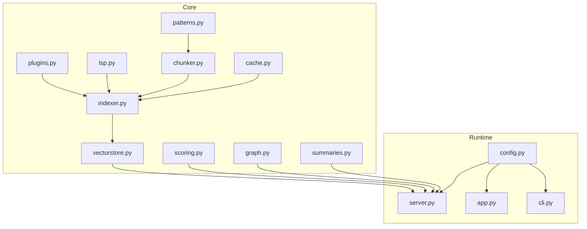
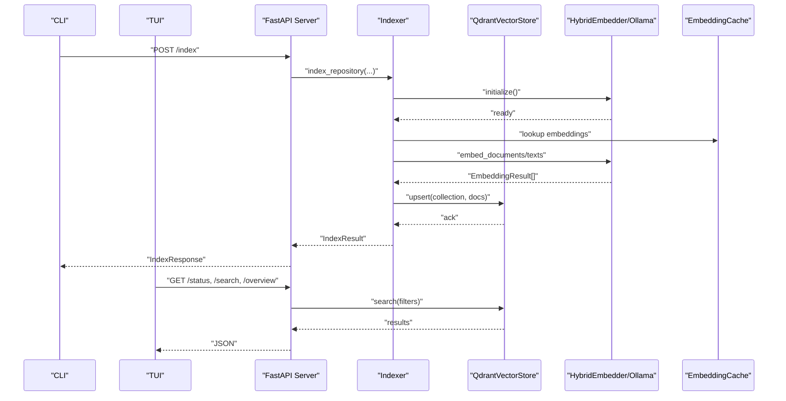
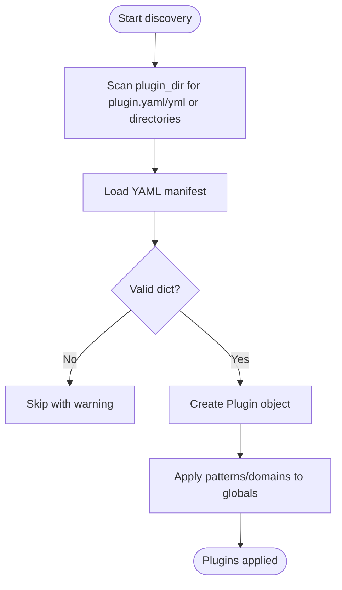
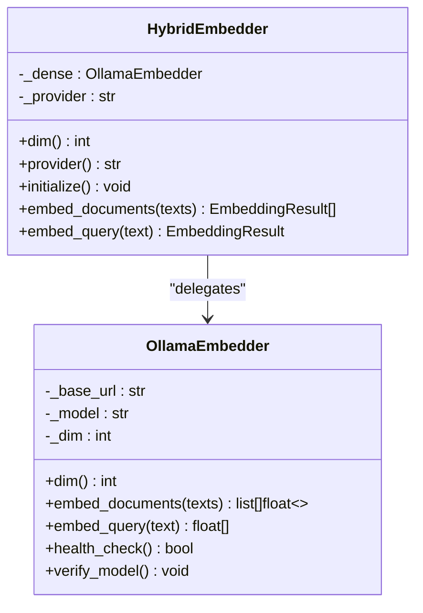
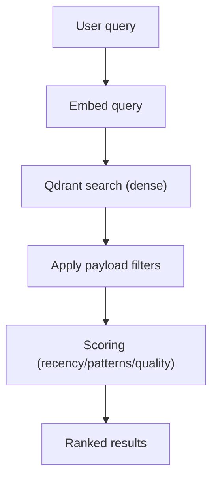
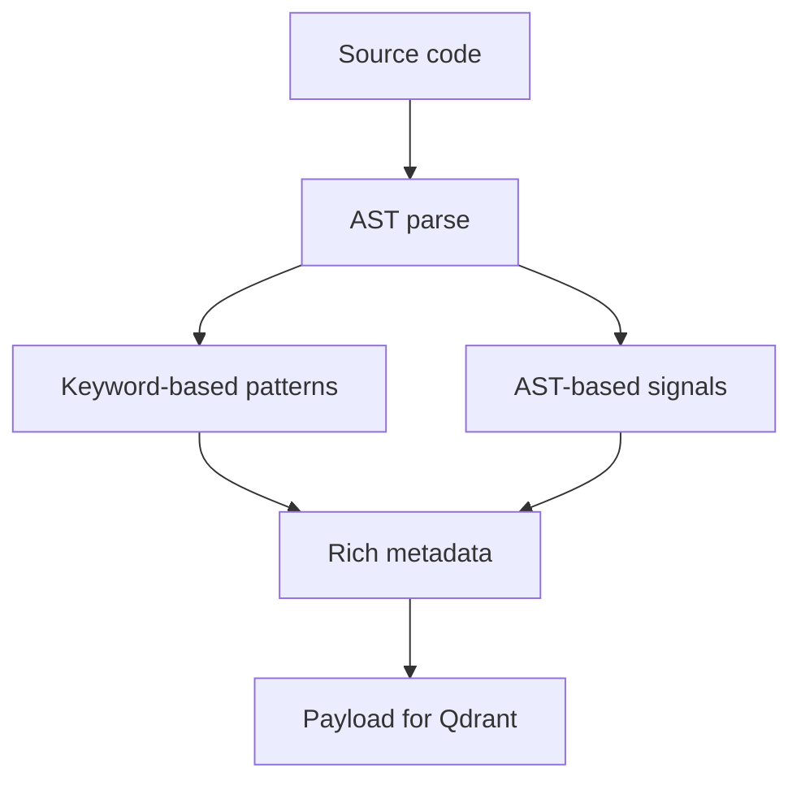
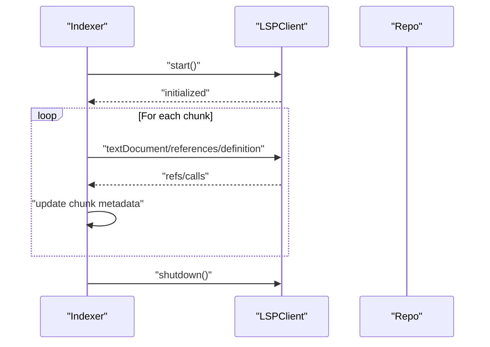
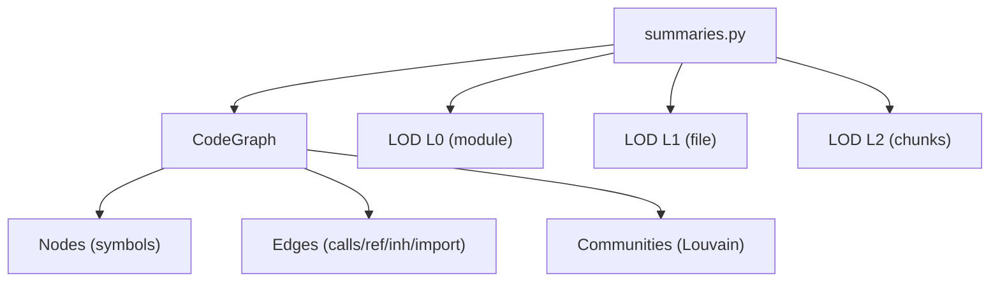
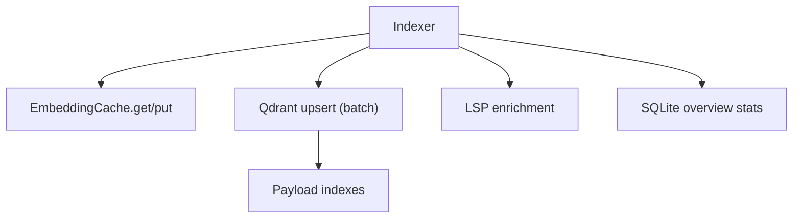
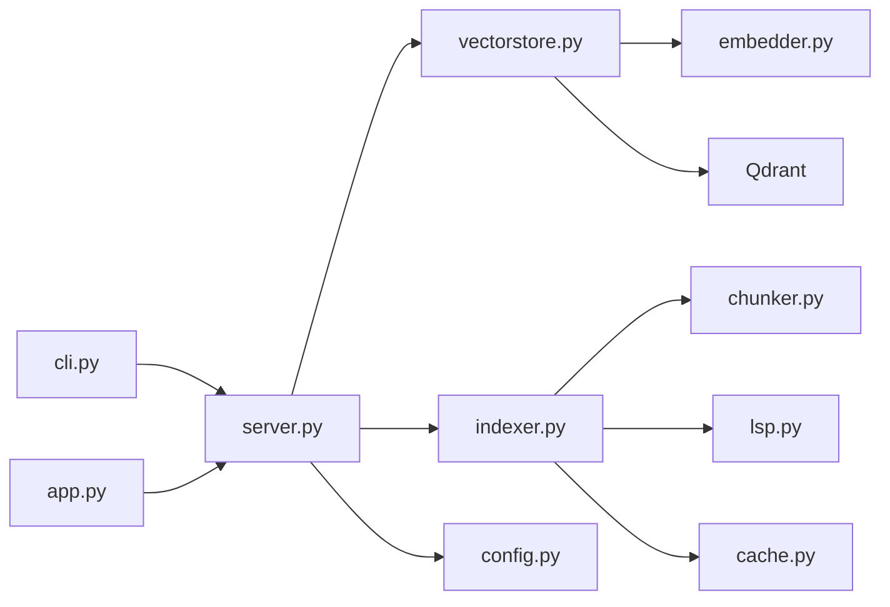

# Advanced Topics

<cite>
**Referenced Files in This Document**
- [plugins.py](file://src/rag/core/plugins.py)
- [patterns.py](file://src/rag/core/patterns.py)
- [lsp.py](file://src/rag/core/lsp.py)
- [vectorstore.py](file://src/rag/core/vectorstore.py)
- [chunker.py](file://src/rag/core/chunker.py)
- [indexer.py](file://src/rag/core/indexer.py)
- [scoring.py](file://src/rag/core/scoring.py)
- [cache.py](file://src/rag/core/cache.py)
- [graph.py](file://src/rag/core/graph.py)
- [summaries.py](file://src/rag/core/summaries.py)
- [app.py](file://src/rag/app.py)
- [config.py](file://src/rag/config.py)
- [server.py](file://src/rag/server.py)
- [cli.py](file://src/rag/cli.py)
</cite>

## Table of Contents
1. [Introduction](#introduction)
2. [Project Structure](#project-structure)
3. [Core Components](#core-components)
4. [Architecture Overview](#architecture-overview)
5. [Detailed Component Analysis](#detailed-component-analysis)
6. [Dependency Analysis](#dependency-analysis)
7. [Performance Considerations](#performance-considerations)
8. [Troubleshooting Guide](#troubleshooting-guide)
9. [Conclusion](#conclusion)
10. [Appendices](#appendices)

## Introduction
This document focuses on advanced topics for extending and optimizing the RAG system. It covers:
- Plugin development framework for custom pattern detectors and chunking strategies
- Extending the embedding provider integration (Ollama-only path)
- Extensible search strategy implementation and scoring
- Pattern recognition systems and LSP integration for enhanced code intelligence
- Advanced code analysis techniques (AST-based enrichment, call graphs, communities)
- Performance tuning, memory optimization, and large-scale deployment considerations
- Architectural patterns, design principles, and best practices for system extension
- Experimental features, research implementations, and roadmap considerations
- Practical examples, troubleshooting, and contribution guidelines

## Project Structure
The system is organized around a modular core with clear separation of concerns:
- Core ingestion and indexing pipeline (chunking, enrichment, upsert)
- Vector store abstraction and dense-only search
- Scoring and ranking utilities
- LSP integration for index-time enrichment
- Plugin framework for extensibility
- Knowledge graph and hierarchical LOD summaries
- HTTP server, CLI, and TUI dashboards

**Diagram sources**
- [plugins.py:1-123](file://src/rag/core/plugins.py#L1-L123)
- [patterns.py:1-398](file://src/rag/core/patterns.py#L1-L398)
- [lsp.py:1-404](file://src/rag/core/lsp.py#L1-L404)
- [chunker.py:1-622](file://src/rag/core/chunker.py#L1-L622)
- [indexer.py:1-740](file://src/rag/core/indexer.py#L1-L740)
- [vectorstore.py:1-530](file://src/rag/core/vectorstore.py#L1-L530)
- [scoring.py:1-143](file://src/rag/core/scoring.py#L1-L143)
- [cache.py:1-195](file://src/rag/core/cache.py#L1-L195)
- [graph.py:1-267](file://src/rag/core/graph.py#L1-L267)
- [summaries.py:1-469](file://src/rag/core/summaries.py#L1-L469)
- [server.py:1-800](file://src/rag/server.py#L1-L800)
- [config.py:1-194](file://src/rag/config.py#L1-L194)
- [app.py:1-800](file://src/rag/app.py#L1-L800)
- [cli.py:1-800](file://src/rag/cli.py#L1-L800)

**Section sources**
- [plugins.py:1-123](file://src/rag/core/plugins.py#L1-L123)
- [patterns.py:1-398](file://src/rag/core/patterns.py#L1-L398)
- [lsp.py:1-404](file://src/rag/core/lsp.py#L1-L404)
- [chunker.py:1-622](file://src/rag/core/chunker.py#L1-L622)
- [indexer.py:1-740](file://src/rag/core/indexer.py#L1-L740)
- [vectorstore.py:1-530](file://src/rag/core/vectorstore.py#L1-L530)
- [scoring.py:1-143](file://src/rag/core/scoring.py#L1-L143)
- [cache.py:1-195](file://src/rag/core/cache.py#L1-L195)
- [graph.py:1-267](file://src/rag/core/graph.py#L1-L267)
- [summaries.py:1-469](file://src/rag/core/summaries.py#L1-L469)
- [server.py:1-800](file://src/rag/server.py#L1-L800)
- [config.py:1-194](file://src/rag/config.py#L1-L194)
- [app.py:1-800](file://src/rag/app.py#L1-L800)
- [cli.py:1-800](file://src/rag/cli.py#L1-L800)

## Core Components
- Plugin system: Discover and apply custom pattern/domain configurations from plugin manifests.
- Pattern detection: AST-based and keyword-driven pattern recognition for design patterns, concurrency, domains, layers, and quality signals.
- LSP integration: Index-time enrichment via Language Server Protocol for references, definitions, implementations, and dead-code detection.
- Chunking: Tree-sitter–based 3-tier chunking for code with language-specific grammars and fallbacks.
- Indexing pipeline: Incremental git-based indexing with advisory locks, batched upserts, and optional LSP enrichment.
- Vector store: Dense-only Qdrant-backed store with payload indexes and server/embedded modes.
- Scoring: Weighted relevance scoring combining recency, pattern relevance, and code quality signals.
- Embedding cache: SQLite-backed binary cache for dense embeddings with TTL.
- Knowledge graph and LOD: Community detection, call graphs, and hierarchical summaries.
- Runtime: FastAPI server with authentication, rate limiting, and TUI/CLI clients.

**Section sources**
- [plugins.py:1-123](file://src/rag/core/plugins.py#L1-L123)
- [patterns.py:1-398](file://src/rag/core/patterns.py#L1-L398)
- [lsp.py:1-404](file://src/rag/core/lsp.py#L1-L404)
- [chunker.py:1-622](file://src/rag/core/chunker.py#L1-L622)
- [indexer.py:1-740](file://src/rag/core/indexer.py#L1-L740)
- [vectorstore.py:1-530](file://src/rag/core/vectorstore.py#L1-L530)
- [scoring.py:1-143](file://src/rag/core/scoring.py#L1-L143)
- [cache.py:1-195](file://src/rag/core/cache.py#L1-L195)
- [graph.py:1-267](file://src/rag/core/graph.py#L1-L267)
- [summaries.py:1-469](file://src/rag/core/summaries.py#L1-L469)
- [server.py:1-800](file://src/rag/server.py#L1-L800)
- [config.py:1-194](file://src/rag/config.py#L1-L194)
- [app.py:1-800](file://src/rag/app.py#L1-L800)
- [cli.py:1-800](file://src/rag/cli.py#L1-L800)

## Architecture Overview
The system follows a layered architecture:
- Data ingestion and enrichment (plugins, patterns, LSP) feed the indexing pipeline
- The indexer batches and upserts embeddings into Qdrant
- The server exposes search, retrieval, and knowledge graph APIs
- Clients (CLI, TUI, web) consume the server

**Diagram sources**
- [indexer.py:242-550](file://src/rag/core/indexer.py#L242-L550)
- [vectorstore.py:296-422](file://src/rag/core/vectorstore.py#L296-L422)
- [server.py:1-800](file://src/rag/server.py#L1-L800)
- [cli.py:1-800](file://src/rag/cli.py#L1-L800)
- [app.py:1-800](file://src/rag/app.py#L1-L800)

## Detailed Component Analysis

### Plugin Development Framework
The plugin system enables dynamic discovery and application of custom pattern and chunking configurations:
- Manifest scanning in a dedicated plugin directory
- YAML-based plugin manifests specifying patterns, chunking overrides, and domain keywords
- Application merges plugin dictionaries into global detection maps

**Diagram sources**
- [plugins.py:28-83](file://src/rag/core/plugins.py#L28-L83)

Practical extension points:
- Add new pattern categories or domain keywords via plugin manifests
- Override language-specific chunking behavior for specialized DSLs or frameworks
- Introduce domain-specific heuristics for pattern detection

**Section sources**
- [plugins.py:1-123](file://src/rag/core/plugins.py#L1-L123)
- [patterns.py:25-97](file://src/rag/core/patterns.py#L25-L97)

### Custom Embedding Provider Integration
Current embedding provider integration is Ollama-only:
- Dense embeddings via Qwen3 on Ollama
- Configurable model, dimension, batch size, and keep-alive
- Retry/backoff with deadlines and health checks
- HybridEmbedder facade ensures consistent API

**Diagram sources**
- [vectorstore.py:199-214](file://src/rag/core/vectorstore.py#L199-L214)
- [embedder.py:48-244](file://src/rag/core/embedder.py#L48-L244)

Guidelines for extending:
- To support additional providers, introduce a factory or registry pattern in HybridEmbedder
- Maintain consistent EmbeddingResult shape and dimension checks
- Preserve retry/backoff semantics and health verification

**Section sources**
- [embedder.py:1-244](file://src/rag/core/embedder.py#L1-L244)
- [vectorstore.py:199-214](file://src/rag/core/vectorstore.py#L199-L214)
- [config.py:53-62](file://src/rag/config.py#L53-L62)

### Extensible Search Strategy Implementation
Search combines dense vector retrieval with payload filtering and scoring:
- Query embedding via HybridEmbedder
- Qdrant query_points with server-side filters
- Lightweight scoring adjusts base scores by recency, pattern relevance, and quality signals

**Diagram sources**
- [vectorstore.py:424-465](file://src/rag/core/vectorstore.py#L424-L465)
- [scoring.py:31-57](file://src/rag/core/scoring.py#L31-L57)

Optimization tips:
- Tune retrieval_top_k and payload indexes for your workload
- Use filters to reduce candidate sets and improve recall
- Monitor embed cache hit rates to minimize redundant embeddings

**Section sources**
- [vectorstore.py:119-156](file://src/rag/core/vectorstore.py#L119-L156)
- [scoring.py:19-28](file://src/rag/core/scoring.py#L19-L28)

### Pattern Recognition Systems
Pattern detection enriches chunks with design patterns, concurrency, domains, layers, and quality signals:
- Keyword-based detection for names, inheritance, decorators, and concurrency
- AST-based analysis for complexity, docstrings, public/abstract status, and call graphs
- Domain and layer classification for architectural understanding

**Diagram sources**
- [patterns.py:164-349](file://src/rag/core/patterns.py#L164-L349)

Use cases:
- Boost results for high-value patterns (repository, service, strategy)
- Penalize dead code candidates and very high-complexity functions
- Filter by domains (auth, payment) or layers (controller, service)

**Section sources**
- [patterns.py:1-398](file://src/rag/core/patterns.py#L1-L398)

### LSP Integration for Enhanced Code Intelligence
LSP integration enriches chunks at index time:
- Detects installed LSP servers per language
- Starts language servers, queries references/definitions/implementations
- Computes fan-in/fan-out and marks potential dead code
- Shuts down servers after enrichment

**Diagram sources**
- [lsp.py:120-193](file://src/rag/core/lsp.py#L120-L193)
- [lsp.py:313-403](file://src/rag/core/lsp.py#L313-L403)
- [indexer.py:666-676](file://src/rag/core/indexer.py#L666-L676)

Operational notes:
- LSP servers are started per detected language
- Enrichment is guarded by timeouts and skipped if no servers available
- Dead code candidates are inferred when fan-in is zero for public symbols

**Section sources**
- [lsp.py:1-404](file://src/rag/core/lsp.py#L1-L404)
- [indexer.py:666-676](file://src/rag/core/indexer.py#L666-L676)

### Advanced Code Analysis Techniques
- Knowledge graph: Nodes are symbols; edges represent calls, references, inheritance, imports. Louvain community detection clusters related symbols.
- Hierarchical LOD summaries: Generate per-file and per-module summaries to reduce token costs during agent-driven exploration.
- AST-based chunking: Tree-sitter grammars enable precise 3-tier chunking with language-specific rules and fallbacks.

**Diagram sources**
- [graph.py:39-128](file://src/rag/core/graph.py#L39-L128)
- [summaries.py:250-462](file://src/rag/core/summaries.py#L250-L462)
- [chunker.py:385-536](file://src/rag/core/chunker.py#L385-L536)

**Section sources**
- [graph.py:1-267](file://src/rag/core/graph.py#L1-L267)
- [summaries.py:1-469](file://src/rag/core/summaries.py#L1-L469)
- [chunker.py:1-622](file://src/rag/core/chunker.py#L1-L622)

### Memory Optimization and Large-Scale Deployment
Key strategies:
- Embedding cache: Binary-packed SQLite cache with TTL prevents repeated embeddings
- Payload indexes: Enable server-side filtering for reduced post-filtering overhead
- Batch sizing: Tune embedding batch size and upsert batch size for throughput/latency balance
- Watch mode: Auto-reindex on file changes for large repos
- Qdrant modes: Embedded vs server for resource-constrained environments

**Diagram sources**
- [cache.py:101-195](file://src/rag/core/cache.py#L101-L195)
- [vectorstore.py:230-294](file://src/rag/core/vectorstore.py#L230-L294)
- [indexer.py:379-422](file://src/rag/core/indexer.py#L379-L422)

**Section sources**
- [cache.py:1-195](file://src/rag/core/cache.py#L1-L195)
- [vectorstore.py:1-530](file://src/rag/core/vectorstore.py#L1-L530)
- [indexer.py:1-740](file://src/rag/core/indexer.py#L1-L740)
- [server.py:603-716](file://src/rag/server.py#L603-L716)

## Dependency Analysis
High-level dependencies:
- Indexer depends on Chunker, LSP, EmbeddingCache, and QdrantVectorStore
- Server orchestrates routes, delegates to vector store, and manages state
- CLI/TUI depend on server endpoints and configuration

**Diagram sources**
- [cli.py:1-800](file://src/rag/cli.py#L1-L800)
- [app.py:1-800](file://src/rag/app.py#L1-L800)
- [server.py:1-800](file://src/rag/server.py#L1-L800)
- [indexer.py:1-740](file://src/rag/core/indexer.py#L1-L740)
- [vectorstore.py:1-530](file://src/rag/core/vectorstore.py#L1-L530)
- [chunker.py:1-622](file://src/rag/core/chunker.py#L1-L622)
- [lsp.py:1-404](file://src/rag/core/lsp.py#L1-L404)
- [cache.py:1-195](file://src/rag/core/cache.py#L1-L195)
- [config.py:1-194](file://src/rag/config.py#L1-L194)

**Section sources**
- [cli.py:1-800](file://src/rag/cli.py#L1-L800)
- [app.py:1-800](file://src/rag/app.py#L1-L800)
- [server.py:1-800](file://src/rag/server.py#L1-L800)
- [indexer.py:1-740](file://src/rag/core/indexer.py#L1-L740)
- [vectorstore.py:1-530](file://src/rag/core/vectorstore.py#L1-L530)
- [chunker.py:1-622](file://src/rag/core/chunker.py#L1-L622)
- [lsp.py:1-404](file://src/rag/core/lsp.py#L1-L404)
- [cache.py:1-195](file://src/rag/core/cache.py#L1-L195)
- [config.py:1-194](file://src/rag/config.py#L1-L194)

## Performance Considerations
- Embedding throughput: Benchmark batch sizes to maximize throughput without degrading interactivity
- Payload indexes: Enable indexes for frequently filtered fields to reduce post-filtering costs
- Cache utilization: Monitor hit/miss ratios and adjust TTL to balance freshness and cost
- Batch sizing: Align embedding batch size with upsert batch size for efficient I/O
- Watch mode: Use incremental reindexing for large repos to minimize downtime
- Qdrant mode: Prefer embedded mode for single-node setups; server mode for distributed deployments

[No sources needed since this section provides general guidance]

## Troubleshooting Guide
Common issues and resolutions:
- Ollama connectivity: Verify model availability and network reachability; use health checks
- Indexing conflicts: Advisory locks prevent concurrent runs; resolve lock files if stuck
- LSP server detection: Ensure language servers are installed and on PATH; check timeouts
- Qdrant dimension mismatch: Recreate collection after changing embedding dimensions
- Cache corruption: Clear cache and rebuild embeddings if anomalies occur
- Rate limiting: Ensure proper token usage and storage initialization

**Section sources**
- [embedder.py:155-186](file://src/rag/core/embedder.py#L155-L186)
- [indexer.py:54-99](file://src/rag/core/indexer.py#L54-L99)
- [lsp.py:100-117](file://src/rag/core/lsp.py#L100-L117)
- [vectorstore.py:260-278](file://src/rag/core/vectorstore.py#L260-L278)
- [cache.py:164-173](file://src/rag/core/cache.py#L164-L173)
- [server.py:770-788](file://src/rag/server.py#L770-L788)

## Conclusion
This advanced guide outlined how to extend the RAG system through plugins, customize embedding providers, implement extensible search strategies, and leverage LSP and AST-based analysis. It provided performance tuning strategies, memory optimization techniques, and large-scale deployment considerations. By following the documented patterns and best practices, you can evolve the system to meet sophisticated code intelligence needs while maintaining reliability and scalability.

[No sources needed since this section summarizes without analyzing specific files]

## Appendices

### Experimental Features and Research Implementations
- Removed sparse BM25 and cross-encoder reranking; current path is dense-only
- LOD summaries and community detection are optional and gated by environment flags
- Hierarchical LOD enables agent-driven drill-down to reduce token costs

**Section sources**
- [vectorstore.py:1-5](file://src/rag/core/vectorstore.py#L1-L5)
- [summaries.py:1-5](file://src/rag/core/summaries.py#L1-L5)
- [indexer.py:518-532](file://src/rag/core/indexer.py#L518-L532)

### Future Roadmap Considerations
- Provider abstraction for pluggable embedding backends
- Cross-encoder reranking reintroduction behind a feature flag
- Enhanced LSP coverage for additional languages and richer metadata
- Dynamic payload indexing and adaptive filtering strategies
- Distributed Qdrant clusters and replication for high availability

[No sources needed since this section provides general guidance]

### Practical Extension Examples
- Adding a new domain keyword set via plugin manifest
- Tuning embedding batch size using the benchmark command
- Enabling LOD summaries for hierarchical navigation
- Adjusting scoring weights for domain-specific priorities

**Section sources**
- [plugins.py:28-83](file://src/rag/core/plugins.py#L28-L83)
- [cli.py:302-385](file://src/rag/cli.py#L302-L385)
- [summaries.py:350-462](file://src/rag/core/summaries.py#L350-L462)
- [scoring.py:19-28](file://src/rag/core/scoring.py#L19-L28)