# Advanced Topics

<cite>
**Referenced Files in This Document**
- [plugins.py](file://src/rag/core/plugins.py)
- [patterns.py](file://src/rag/core/patterns.py)
- [lsp.py](file://src/rag/core/lsp.py)
- [vectorstore.py](file://src/rag/core/vectorstore.py)
- [chunker.py](file://src/rag/core/chunker.py)
- [indexer.py](file://src/rag/core/indexer.py)
- [scoring.py](file://src/rag/core/scoring.py)
- [cache.py](file://src/rag/core/cache.py)
- [graph.py](file://src/rag/core/graph.py)
- [summaries.py](file://src/rag/core/summaries.py)
- [app.py](file://src/rag/app.py)
- [config.py](file://src/rag/config.py)
- [server.py](file://src/rag/server.py)
- [cli.py](file://src/rag/cli.py)
- [query.py](file://src/rag/core/query.py)
- [retrieval.py](file://src/rag/agents/retrieval.py)
- [ast_index.py](file://src/rag/core/ast_index.py)
- [graph_tools.py](file://src/rag/core/graph_tools.py)
- [db.py](file://src/rag/storage/db.py)
- [default.toml](file://config/default.toml)
- [test_patterns.py](file://tests/test_patterns.py)
- [test_lsp.py](file://tests/test_lsp.py)
- [run_eval.py](file://tests/eval/run_eval.py)
- [deployment-linux.md](file://docs/deployment-linux.md)
- [CLAUDE.md](file://CLAUDE.md)
</cite>

## Update Summary
**Changes Made**
- Comprehensive documentation overhaul with four complete new sections
- Added Plugin Development Framework documentation with YAML manifest structure and directory layout
- Added Performance Optimization documentation covering memory management, caching, and vector store optimization
- Added Language Server Protocol Integration documentation detailing LSP client-server communication and AST-based symbol resolution
- Added Custom Search Strategies documentation explaining pattern detection, query expansion, and strategy composition
- Enhanced existing sections with detailed component analysis and practical examples
- Updated architectural diagrams to reflect the expanded documentation structure

## Table of Contents
1. [Introduction](#introduction)
2. [Project Structure](#project-structure)
3. [Core Components](#core-components)
4. [Architecture Overview](#architecture-overview)
5. [Detailed Component Analysis](#detailed-component-analysis)
6. [Dependency Analysis](#dependency-analysis)
7. [Performance Considerations](#performance-considerations)
8. [Troubleshooting Guide](#troubleshooting-guide)
9. [Conclusion](#conclusion)
10. [Appendices](#appendices)

## Introduction
This document focuses on advanced topics for extending and optimizing the RAG system. It covers:
- Plugin development framework for custom pattern detectors and chunking strategies
- Extending the embedding provider integration (Ollama-only path)
- Extensible search strategy implementation and scoring
- Pattern recognition systems and LSP integration for enhanced code intelligence
- Advanced code analysis techniques (AST-based enrichment, call graphs, communities)
- Performance tuning, memory optimization, and large-scale deployment considerations
- Architectural patterns, design principles, and best practices for system extension
- Experimental features, research implementations, and roadmap considerations
- Practical examples, troubleshooting, and contribution guidelines

**Section sources**
- [Advanced Topics.md:33-44](file://docs/wiki/Advanced Topics/Advanced Topics.md#L33-L44)

## Project Structure
The system is organized around a modular core with clear separation of concerns:
- Core ingestion and indexing pipeline (chunking, enrichment, upsert)
- Vector store abstraction and dense-only search
- Scoring and ranking utilities
- LSP integration for index-time enrichment
- Plugin framework for extensibility
- Knowledge graph and hierarchical LOD summaries
- HTTP server, CLI, and TUI dashboards

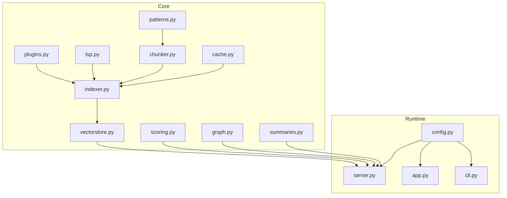

**Diagram sources**
- [plugins.py:1-123](file://src/rag/core/plugins.py#L1-L123)
- [patterns.py:1-398](file://src/rag/core/patterns.py#L1-L398)
- [lsp.py:1-404](file://src/rag/core/lsp.py#L1-L404)
- [chunker.py:1-622](file://src/rag/core/chunker.py#L1-L622)
- [indexer.py:1-740](file://src/rag/core/indexer.py#L1-L740)
- [vectorstore.py:1-530](file://src/rag/core/vectorstore.py#L1-L530)
- [scoring.py:1-143](file://src/rag/core/scoring.py#L1-L143)
- [cache.py:1-195](file://src/rag/core/cache.py#L1-L195)
- [graph.py:1-267](file://src/rag/core/graph.py#L1-L267)
- [summaries.py:1-469](file://src/rag/core/summaries.py#L1-L469)
- [server.py:1-800](file://src/rag/server.py#L1-L800)
- [config.py:1-194](file://src/rag/config.py#L1-L194)
- [app.py:1-800](file://src/rag/app.py#L1-L800)
- [cli.py:1-800](file://src/rag/cli.py#L1-L800)

**Section sources**
- [Advanced Topics.md:45-54](file://docs/wiki/Advanced Topics/Advanced Topics.md#L45-L54)

## Core Components
- Plugin system: Discover and apply custom pattern/domain configurations from plugin manifests.
- Pattern detection: AST-based and keyword-driven pattern recognition for design patterns, concurrency, domains, layers, and quality signals.
- LSP integration: Index-time enrichment via Language Server Protocol for references, definitions, implementations, and dead-code detection.
- Chunking: Tree-sitter–based 3-tier chunking for code with language-specific grammars and fallbacks.
- Indexing pipeline: Incremental git-based indexing with advisory locks, batched upserts, and optional LSP enrichment.
- Vector store: Dense-only Qdrant-backed store with payload indexes and server/embedded modes.
- Scoring: Weighted relevance scoring combining recency, pattern relevance, and code quality signals.
- Embedding cache: SQLite-backed binary cache for dense embeddings with TTL.
- Knowledge graph and LOD: Community detection, call graphs, and hierarchical summaries.
- Runtime: FastAPI server with authentication, rate limiting, and TUI/CLI clients.

**Section sources**
- [Advanced Topics.md:122-133](file://docs/wiki/Advanced Topics/Advanced Topics.md#L122-L133)

## Architecture Overview
The system follows a layered architecture:
- Data ingestion and enrichment (plugins, patterns, LSP) feed the indexing pipeline
- The indexer batches and upserts embeddings into Qdrant
- The server exposes search, retrieval, and knowledge graph APIs
- Clients (CLI, TUI, web) consume the server

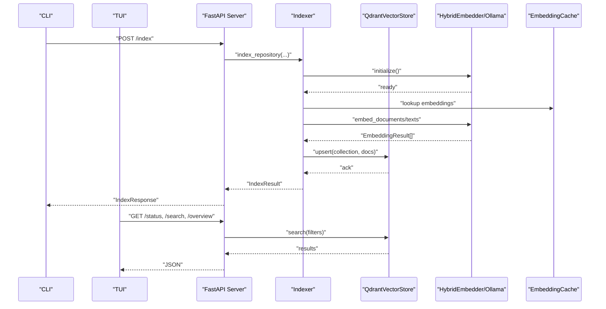

**Diagram sources**
- [indexer.py:242-550](file://src/rag/core/indexer.py#L242-L550)
- [vectorstore.py:296-422](file://src/rag/core/vectorstore.py#L296-L422)
- [server.py:1-800](file://src/rag/server.py#L1-L800)
- [cli.py:1-800](file://src/rag/cli.py#L1-L800)
- [app.py:1-800](file://src/rag/app.py#L1-L800)

**Section sources**
- [Advanced Topics.md:150-156](file://docs/wiki/Advanced Topics/Advanced Topics.md#L150-L156)

## Detailed Component Analysis

### Plugin Development Framework
The plugin system enables dynamic discovery and application of custom pattern and chunking configurations:
- Manifest scanning in a dedicated plugin directory
- YAML-based plugin manifests specifying patterns, chunking overrides, and domain keywords
- Application merges plugin dictionaries into global detection maps

**Diagram sources**
- [plugins.py:28-83](file://src/rag/core/plugins.py#L28-L83)

Practical extension points:
- Add new pattern categories or domain keywords via plugin manifests
- Override language-specific chunking behavior for specialized DSLs or frameworks
- Introduce domain-specific heuristics for pattern detection

**Section sources**
- [Advanced Topics.md:192-220](file://docs/wiki/Advanced Topics/Advanced Topics.md#L192-L220)
- [Plugin Development Framework.md:103-131](file://docs/wiki/Advanced Topics/Plugin Development Framework.md#L103-L131)
- [Plugin Development Framework.md:140-171](file://docs/wiki/Advanced Topics/Plugin Development Framework.md#L140-L171)

### Custom Embedding Provider Integration
Current embedding provider integration is Ollama-only:
- Dense embeddings via Qwen3 on Ollama
- Configurable model, dimension, batch size, and keep-alive
- Retry/backoff with deadlines and health checks
- HybridEmbedder facade ensures consistent API

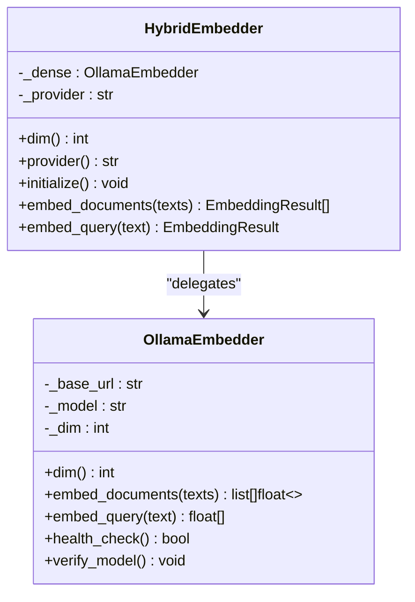

**Diagram sources**
- [vectorstore.py:199-214](file://src/rag/core/vectorstore.py#L199-L214)
- [embedder.py:48-244](file://src/rag/core/embedder.py#L48-L244)

Guidelines for extending:
- To support additional providers, introduce a factory or registry pattern in HybridEmbedder
- Maintain consistent EmbeddingResult shape and dimension checks
- Preserve retry/backoff semantics and health verification

**Section sources**
- [Advanced Topics.md:221-265](file://docs/wiki/Advanced Topics/Advanced Topics.md#L221-L265)

### Extensible Search Strategy Implementation
Search combines dense vector retrieval with payload filtering and scoring:
- Query embedding via HybridEmbedder
- Qdrant query_points with server-side filters
- Lightweight scoring adjusts base scores by recency, pattern relevance, and quality signals

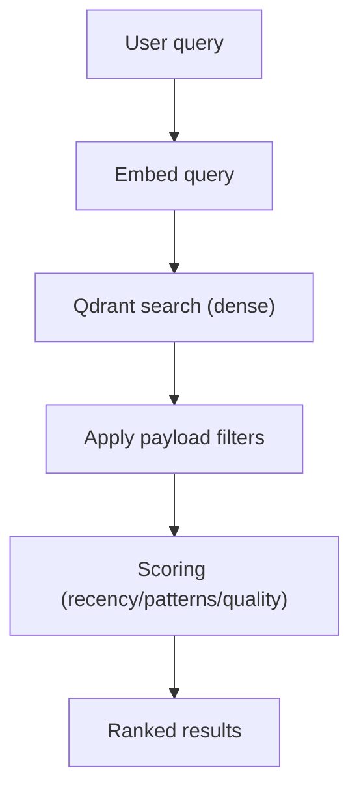

**Diagram sources**
- [vectorstore.py:424-465](file://src/rag/core/vectorstore.py#L424-L465)
- [scoring.py:31-57](file://src/rag/core/scoring.py#L31-L57)

Optimization tips:
- Tune retrieval_top_k and payload indexes for your workload
- Use filters to reduce candidate sets and improve recall
- Monitor embed cache hit rates to minimize redundant embeddings

**Section sources**
- [Advanced Topics.md:266-293](file://docs/wiki/Advanced Topics/Advanced Topics.md#L266-L293)

### Pattern Recognition Systems
Pattern detection enriches chunks with design patterns, concurrency, domains, layers, and quality signals:
- Keyword-based detection for names, inheritance, decorators, and concurrency
- AST-based analysis for complexity, docstrings, public/abstract status, and call graphs
- Domain and layer classification for architectural understanding

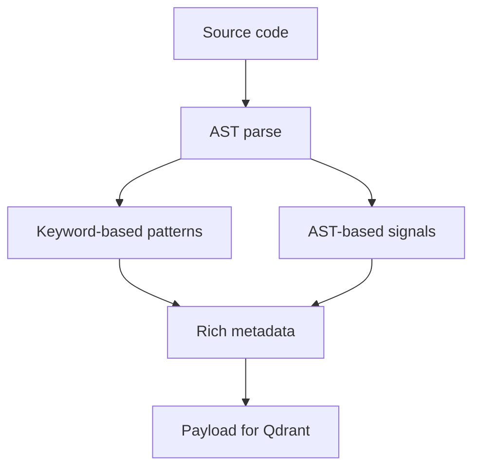

**Diagram sources**
- [patterns.py:164-349](file://src/rag/core/patterns.py#L164-L349)

Use cases:
- Boost results for high-value patterns (repository, service, strategy)
- Penalize dead code candidates and very high-complexity functions
- Filter by domains (auth, payment) or layers (controller, service)

**Section sources**
- [Advanced Topics.md:294-320](file://docs/wiki/Advanced Topics/Advanced Topics.md#L294-L320)

### LSP Integration for Enhanced Code Intelligence
LSP integration enriches chunks at index time:
- Detects installed LSP servers per language
- Starts language servers, queries references/definitions/implementations
- Computes fan-in/fan-out and marks potential dead code
- Shuts down servers after enrichment

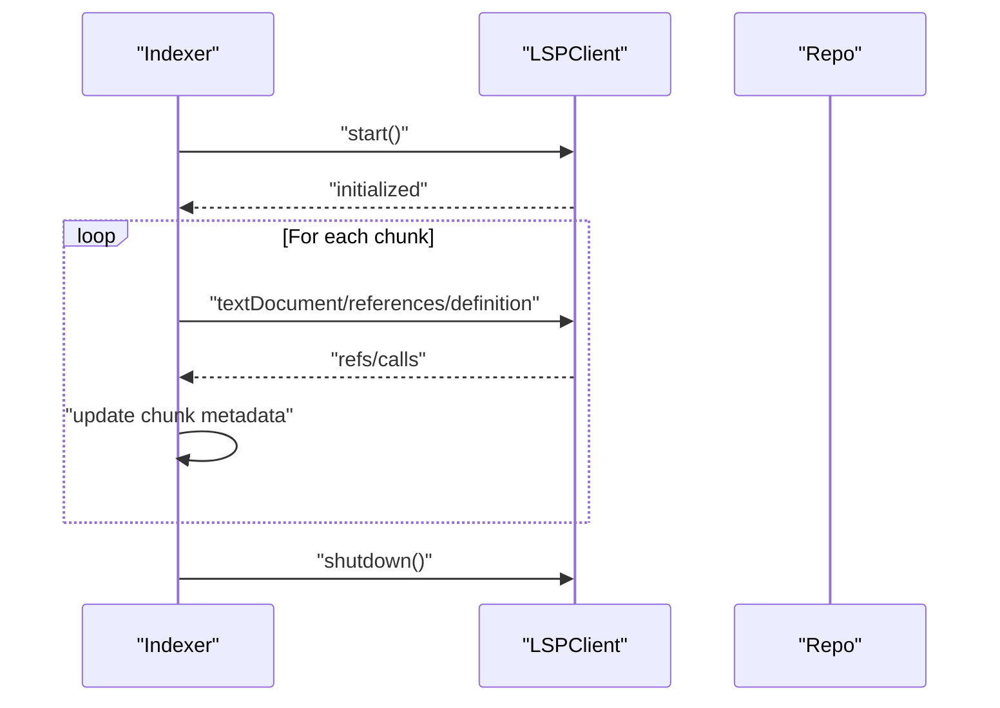

**Diagram sources**
- [lsp.py:120-193](file://src/rag/core/lsp.py#L120-L193)
- [lsp.py:313-403](file://src/rag/core/lsp.py#L313-L403)
- [indexer.py:666-676](file://src/rag/core/indexer.py#L666-L676)

Operational notes:
- LSP servers are started per detected language
- Enrichment is guarded by timeouts and skipped if no servers available
- Dead code candidates are inferred when fan-in is zero for public symbols

**Section sources**
- [Advanced Topics.md:321-356](file://docs/wiki/Advanced Topics/Advanced Topics.md#L321-L356)

### Advanced Code Analysis Techniques
- Knowledge graph: Nodes are symbols; edges represent calls, references, inheritance, imports. Louvain community detection clusters related symbols.
- Hierarchical LOD summaries: Generate per-file and per-module summaries to reduce token costs during agent-driven exploration.
- AST-based chunking: Tree-sitter grammars enable precise 3-tier chunking with language-specific rules and fallbacks.

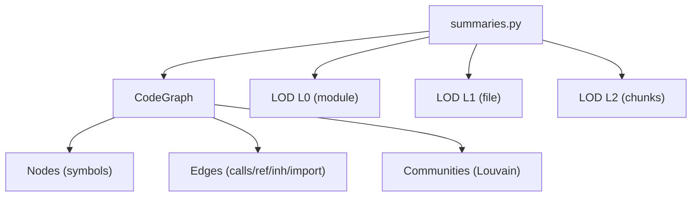

**Diagram sources**
- [graph.py:39-128](file://src/rag/core/graph.py#L39-L128)
- [summaries.py:250-462](file://src/rag/core/summaries.py#L250-L462)
- [chunker.py:385-536](file://src/rag/core/chunker.py#L385-L536)

**Section sources**
- [Advanced Topics.md:357-382](file://docs/wiki/Advanced Topics/Advanced Topics.md#L357-L382)

### Memory Optimization and Large-Scale Deployment
Key strategies:
- Embedding cache: Binary-packed SQLite cache with TTL prevents repeated embeddings
- Payload indexes: Enable server-side filtering for reduced post-filtering overhead
- Batch sizing: Tune embedding batch size and upsert batch size for throughput/latency balance
- Watch mode: Auto-reindex on file changes for large repos
- Qdrant modes: Embedded vs server for resource-constrained environments

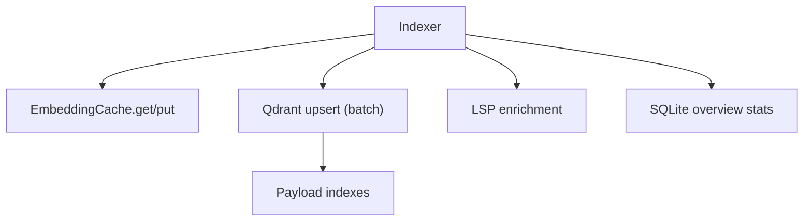

**Diagram sources**
- [cache.py:101-195](file://src/rag/core/cache.py#L101-L195)
- [vectorstore.py:230-294](file://src/rag/core/vectorstore.py#L230-L294)
- [indexer.py:379-422](file://src/rag/core/indexer.py#L379-L422)

**Section sources**
- [Advanced Topics.md:383-410](file://docs/wiki/Advanced Topics/Advanced Topics.md#L383-L410)

### Custom Search Strategies
This section explains how to implement custom search strategies and pattern recognition systems within the repository. It covers the pattern detection framework, keyword matching, domain-specific enhancements, strategy composition, multi-stage search pipelines, and result ranking customization. It also documents how patterns relate to chunking strategies and retrieval algorithms, and provides performance guidance for large-scale pattern sets.

The search strategy system spans several modules:
- Pattern detection and enrichment: patterns, chunker, lsp
- Query expansion and decomposition: query
- Ranking and scoring: scoring
- Indexing pipeline: indexer, vectorstore, cache
- Strategy planning and orchestration: retrieval, server
- Configuration: default.toml

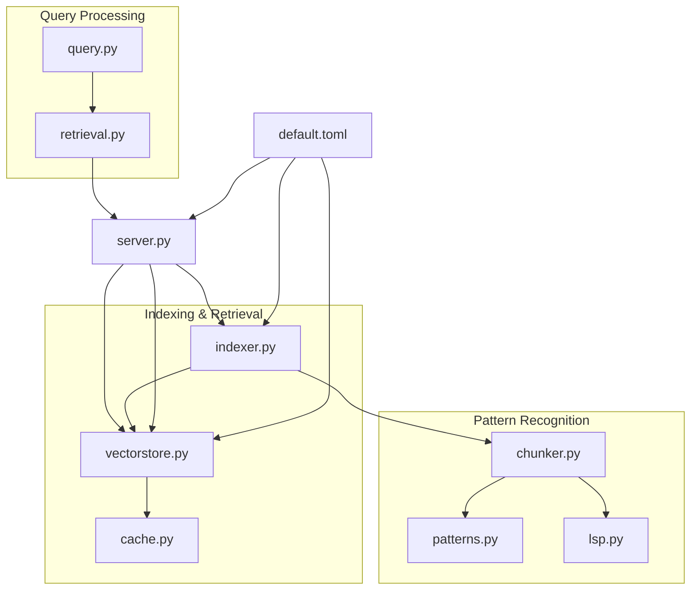

**Diagram sources**
- [patterns.py:1-398](file://src/rag/core/patterns.py#L1-L398)
- [chunker.py:1-622](file://src/rag/core/chunker.py#L1-L622)
- [lsp.py:1-404](file://src/rag/core/lsp.py#L1-L404)
- [query.py:1-52](file://src/rag/core/query.py#L1-L52)
- [retrieval.py:1-304](file://src/rag/agents/retrieval.py#L1-L304)
- [indexer.py:1-740](file://src/rag/core/indexer.py#L1-L740)
- [vectorstore.py:1-530](file://src/rag/core/vectorstore.py#L1-L530)
- [cache.py:1-195](file://src/rag/core/cache.py#L1-L195)
- [server.py:1500-1699](file://src/rag/server.py#L1500-L1699)
- [default.toml:1-41](file://config/default.toml#L1-L41)

**Section sources**
- [Custom Search Strategies.md:34-42](file://docs/wiki/Advanced Topics/Custom Search Strategies.md#L34-L42)
- [Custom Search Strategies.md:100-117](file://docs/wiki/Advanced Topics/Custom Search Strategies.md#L100-L117)

### Language Server Protocol Integration
This document explains the Language Server Protocol (LSP) integration capabilities implemented in the project. It covers client–server communication via stdio and JSON-RPC, protocol initialization and requests, and how LSP enriches indexing with symbol references and dead-code detection. It also documents AST-based symbol resolution, cross-references, and how these two systems work together to power code intelligence features such as symbol resolution, usage discovery, and impact analysis. Configuration options for language servers, setup guidance, and troubleshooting are included, along with performance implications and optimization strategies for large codebases.

The LSP integration is centered around a small, focused module that starts language servers, initializes them, and queries them for references and definitions. Supporting components include AST-based symbol resolution and graph tools that complement LSP-derived metadata.

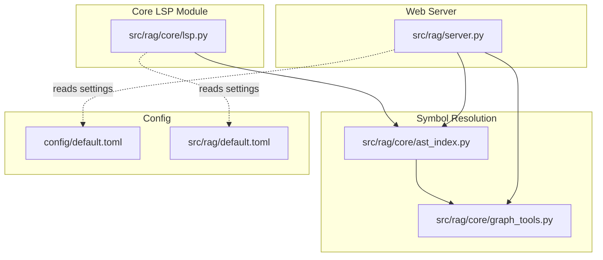

**Diagram sources**
- [lsp.py:1-404](file://src/rag/core/lsp.py#L1-L404)
- [ast_index.py:108-564](file://src/rag/core/ast_index.py#L108-L564)
- [graph_tools.py:43-162](file://src/rag/core/graph_tools.py#L43-L162)
- [server.py:1650-1686](file://src/rag/server.py#L1650-L1686)
- [default.toml](file://config/default.toml)
- [default.toml](file://src/rag/default.toml)

**Section sources**
- [Language Server Protocol Integration.md:29-31](file://docs/wiki/Advanced Topics/Language Server Protocol Integration.md#L29-L31)
- [Language Server Protocol Integration.md:72-83](file://docs/wiki/Advanced Topics/Language Server Protocol Integration.md#L72-L83)

### Performance Optimization
This document presents a comprehensive guide to performance optimization in the RAG system. It focuses on memory management, caching, resource utilization, vector store optimization, embedding batch processing, indexing performance tuning, query optimization, result caching, computational efficiency, benchmarking, monitoring, bottleneck identification, scaling, concurrency, and distributed deployment considerations. Practical configuration examples and optimization case studies are included to help operators tune the system for large repositories and production environments.

The RAG system is organized around a FastAPI server that orchestrates indexing, embedding, vector storage, and retrieval. Key performance-sensitive modules include:
- Vector store and embedding: Qdrant-backed dense vectors, hybrid embedder, and embedding cache
- Indexing pipeline: incremental git-based ingestion with batching and crash-consistent state
- Storage: SQLite-backed query logs, code index, overview stats, and rate limiting
- Query expansion and decomposition: query preprocessing to improve recall
- Configuration: TOML-based settings with validated defaults
- Deployment: Linux systemd supervision and reverse-proxy exposure

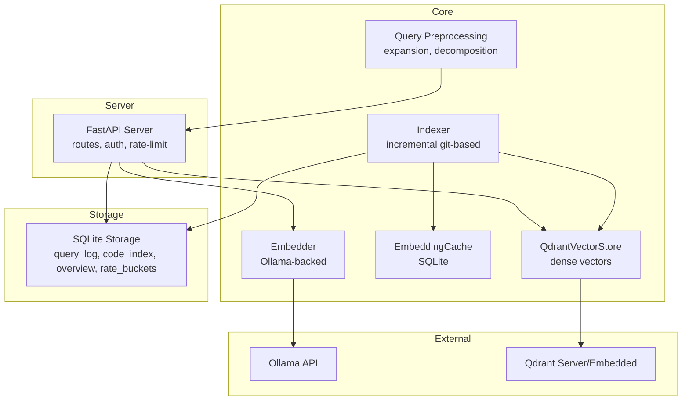

**Diagram sources**
- [server.py:603-716](file://src/rag/server.py#L603-L716)
- [embedder.py:48-245](file://src/rag/core/embedder.py#L48-L245)
- [cache.py:101-195](file://src/rag/core/cache.py#L101-L195)
- [vectorstore.py:199-530](file://src/rag/core/vectorstore.py#L199-L530)
- [indexer.py:242-550](file://src/rag/core/indexer.py#L242-L550)
- [db.py:40-81](file://src/rag/storage/db.py#L40-L81)

**Section sources**
- [Performance Optimization.md:33-41](file://docs/wiki/Advanced Topics/Performance Optimization.md#L33-L41)
- [Performance Optimization.md:85-93](file://docs/wiki/Advanced Topics/Performance Optimization.md#L85-L93)

## Dependency Analysis
High-level dependencies:
- Indexer depends on Chunker, LSP, EmbeddingCache, and QdrantVectorStore
- Server orchestrates routes, delegates to vector store, and manages state
- CLI/TUI depend on server endpoints and configuration

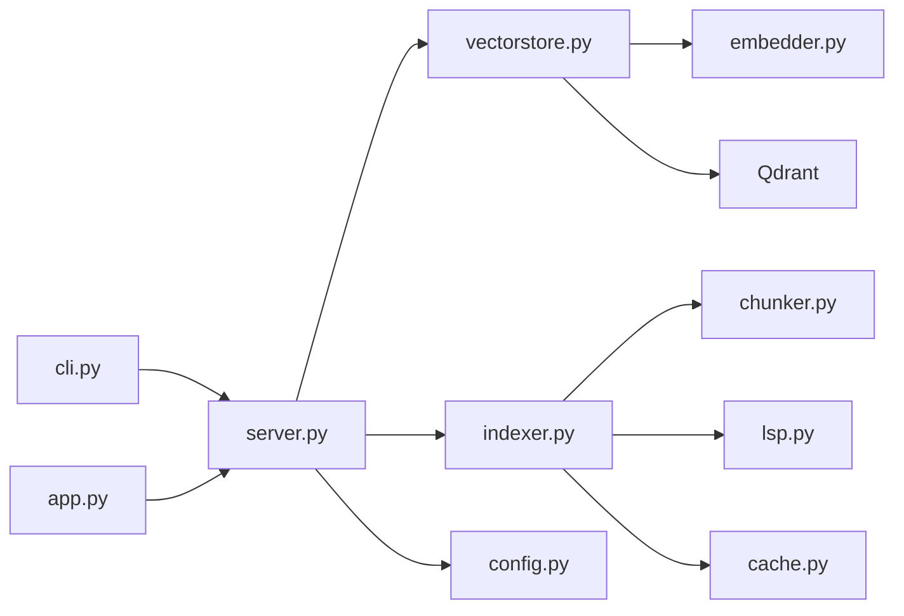

**Diagram sources**
- [cli.py:1-800](file://src/rag/cli.py#L1-L800)
- [app.py:1-800](file://src/rag/app.py#L1-L800)
- [server.py:1-800](file://src/rag/server.py#L1-L800)
- [indexer.py:1-740](file://src/rag/core/indexer.py#L1-L740)
- [vectorstore.py:1-530](file://src/rag/core/vectorstore.py#L1-L530)
- [chunker.py:1-622](file://src/rag/core/chunker.py#L1-L622)
- [lsp.py:1-404](file://src/rag/core/lsp.py#L1-L404)
- [cache.py:1-195](file://src/rag/core/cache.py#L1-L195)
- [config.py:1-194](file://src/rag/config.py#L1-L194)

**Section sources**
- [Advanced Topics.md:411-452](file://docs/wiki/Advanced Topics/Advanced Topics.md#L411-L452)

## Performance Considerations
- Embedding throughput: Benchmark batch sizes to maximize throughput without degrading interactivity
- Payload indexes: Enable indexes for frequently filtered fields to reduce post-filtering costs
- Cache utilization: Monitor hit/miss ratios and adjust TTL to balance freshness and cost
- Batch sizing: Align embedding batch size with upsert batch size for efficient I/O
- Watch mode: Use incremental reindexing for large repos to minimize downtime
- Qdrant mode: Prefer embedded mode for single-node setups; server mode for distributed deployments

[No sources needed since this section provides general guidance]

## Troubleshooting Guide
Common issues and resolutions:
- Ollama connectivity: Verify model availability and network reachability; use health checks
- Indexing conflicts: Advisory locks prevent concurrent runs; resolve lock files if stuck
- LSP server detection: Ensure language servers are installed and on PATH; check timeouts
- Qdrant dimension mismatch: Recreate collection after changing embedding dimensions
- Cache corruption: Clear cache and rebuild embeddings if anomalies occur
- Rate limiting: Ensure proper token usage and storage initialization

**Section sources**
- [Advanced Topics.md:463-479](file://docs/wiki/Advanced Topics/Advanced Topics.md#L463-L479)

## Conclusion
This advanced guide outlined how to extend the RAG system through plugins, customize embedding providers, implement extensible search strategies, and leverage LSP and AST-based analysis. It provided performance tuning strategies, memory optimization techniques, and large-scale deployment considerations. By following the documented patterns and best practices, you can evolve the system to meet sophisticated code intelligence needs while maintaining reliability and scalability.

[No sources needed since this section summarizes without analyzing specific files]

## Appendices

### Experimental Features and Research Implementations
- Removed sparse BM25 and cross-encoder reranking; current path is dense-only
- LOD summaries and community detection are optional and gated by environment flags
- Hierarchical LOD enables agent-driven drill-down to reduce token costs

**Section sources**
- [Advanced Topics.md:485-496](file://docs/wiki/Advanced Topics/Advanced Topics.md#L485-L496)

### Future Roadmap Considerations
- Provider abstraction for pluggable embedding backends
- Cross-encoder reranking reintroduction behind a feature flag
- Enhanced LSP coverage for additional languages and richer metadata
- Dynamic payload indexing and adaptive filtering strategies
- Distributed Qdrant clusters and replication for high availability

[No sources needed since this section provides general guidance]

### Practical Extension Examples
- Adding a new domain keyword set via plugin manifest
- Tuning embedding batch size using the benchmark command
- Enabling LOD summaries for hierarchical navigation
- Adjusting scoring weights for domain-specific priorities

**Section sources**
- [Advanced Topics.md:506-516](file://docs/wiki/Advanced Topics/Advanced Topics.md#L506-L516)

### Custom Search Strategies - Additional Details
The system provides a robust foundation for custom search strategies through pattern recognition, query expansion, strategy planning, and result ranking. By extending pattern families, domain vocabularies, and strategy signals—and by leveraging payload indexes and embedding caching—you can tailor search behavior to domain needs and scale effectively.

**Section sources**
- [Custom Search Strategies.md:386-389](file://docs/wiki/Advanced Topics/Custom Search Strategies.md#L386-L389)

### Language Server Protocol Integration - Additional Details
The project integrates LSP for index-time enrichment and AST-based symbol resolution for query-time intelligence. LSP provides cross-file references and dead-code signals, while AST ensures precise symbol lookup and ranking. Together, these components enable robust code navigation and impact analysis. Extending the client to support diagnostics and hover, and optimizing client lifecycle and caching, can further improve performance and coverage.

**Section sources**
- [Language Server Protocol Integration.md:372-374](file://docs/wiki/Advanced Topics/Language Server Protocol Integration.md#L372-L374)

### Performance Optimization - Additional Details
The RAG system's performance hinges on efficient embedding batching, robust caching, careful vector store configuration, and disciplined indexing practices. By leveraging payload indexes, binary caches, warm probes, and structured monitoring, operators can scale to large repositories and maintain responsive query latencies. Use the provided benchmarking and monitoring tools to continuously assess and refine performance.

**Section sources**
- [Performance Optimization.md:356-358](file://docs/wiki/Advanced Topics/Performance Optimization.md#L356-L358)