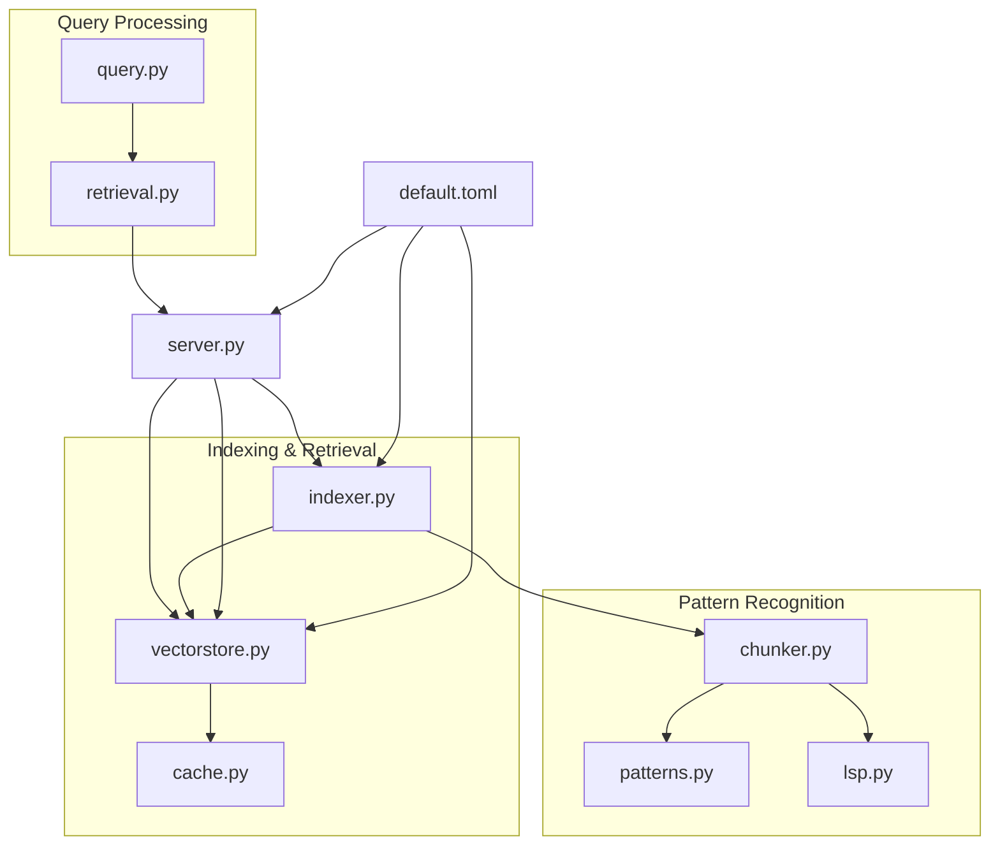
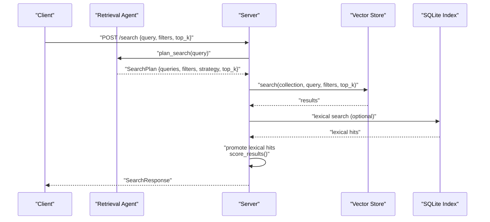
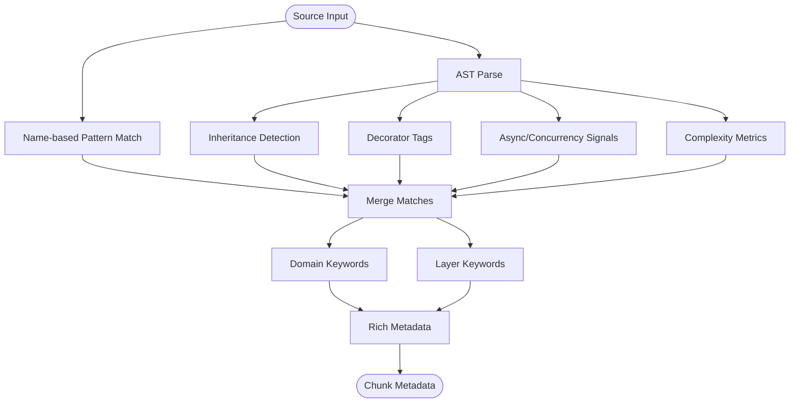
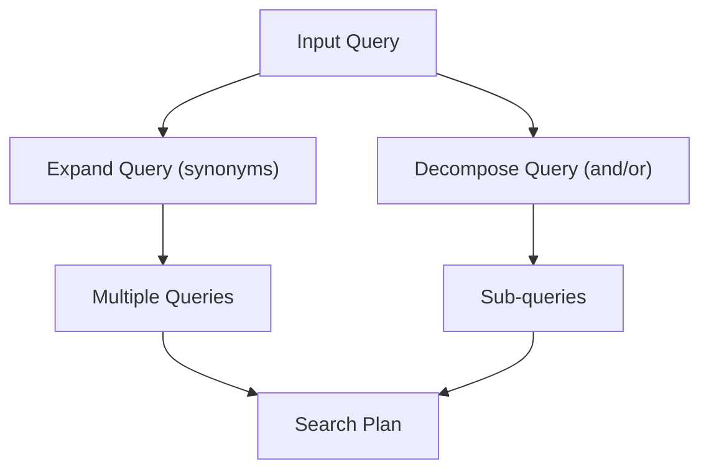
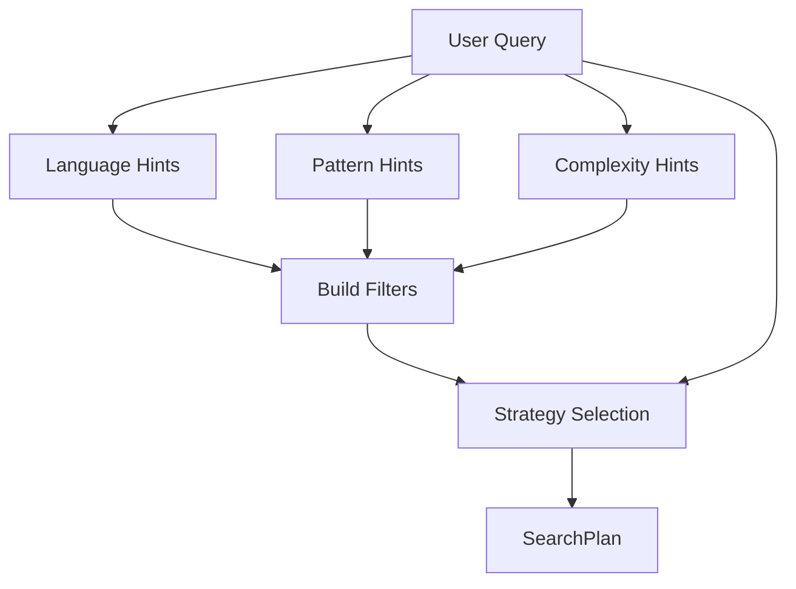
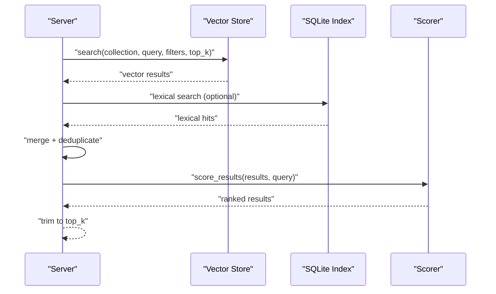
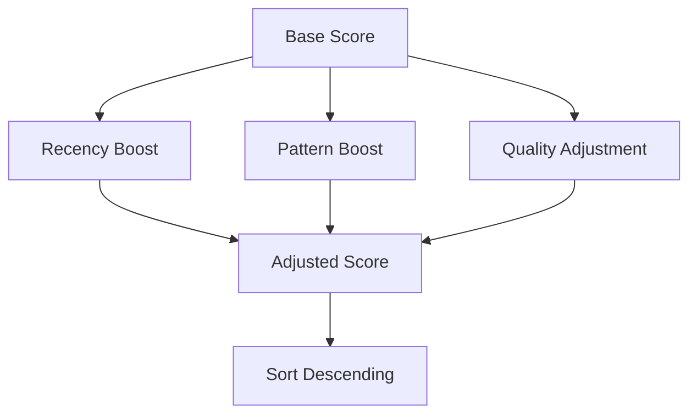
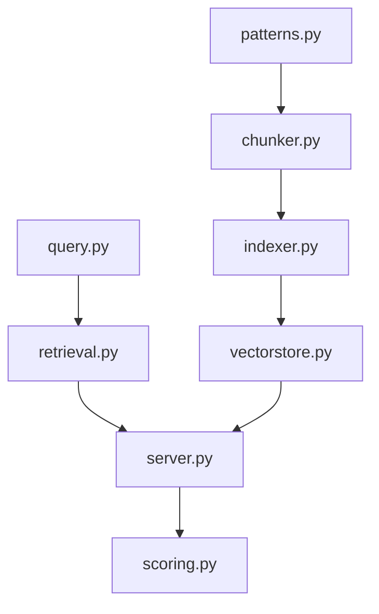

# Custom Search Strategies

<cite>
**Referenced Files in This Document**
- [patterns.py](file://src/rag/core/patterns.py)
- [query.py](file://src/rag/core/query.py)
- [scoring.py](file://src/rag/core/scoring.py)
- [chunker.py](file://src/rag/core/chunker.py)
- [indexer.py](file://src/rag/core/indexer.py)
- [vectorstore.py](file://src/rag/core/vectorstore.py)
- [lsp.py](file://src/rag/core/lsp.py)
- [cache.py](file://src/rag/core/cache.py)
- [retrieval.py](file://src/rag/agents/retrieval.py)
- [server.py](file://src/rag/server.py)
- [default.toml](file://config/default.toml)
- [test_patterns.py](file://tests/test_patterns.py)
</cite>

## Table of Contents
1. [Introduction](#introduction)
2. [Project Structure](#project-structure)
3. [Core Components](#core-components)
4. [Architecture Overview](#architecture-overview)
5. [Detailed Component Analysis](#detailed-component-analysis)
6. [Dependency Analysis](#dependency-analysis)
7. [Performance Considerations](#performance-considerations)
8. [Troubleshooting Guide](#troubleshooting-guide)
9. [Conclusion](#conclusion)
10. [Appendices](#appendices)

## Introduction
This document explains how to implement custom search strategies and pattern recognition systems within the repository. It covers the pattern detection framework, keyword matching, domain-specific enhancements, strategy composition, multi-stage search pipelines, and result ranking customization. It also documents how patterns relate to chunking strategies and retrieval algorithms, and provides performance guidance for large-scale pattern sets.

## Project Structure
The search strategy system spans several modules:
- Pattern detection and enrichment: patterns, chunker, lsp
- Query expansion and decomposition: query
- Ranking and scoring: scoring
- Indexing pipeline: indexer, vectorstore, cache
- Strategy planning and orchestration: retrieval, server
- Configuration: default.toml

**Diagram sources**
- [patterns.py:1-398](file://src/rag/core/patterns.py#L1-L398)
- [chunker.py:1-622](file://src/rag/core/chunker.py#L1-L622)
- [lsp.py:1-404](file://src/rag/core/lsp.py#L1-L404)
- [query.py:1-52](file://src/rag/core/query.py#L1-L52)
- [retrieval.py:1-304](file://src/rag/agents/retrieval.py#L1-L304)
- [indexer.py:1-740](file://src/rag/core/indexer.py#L1-L740)
- [vectorstore.py:1-530](file://src/rag/core/vectorstore.py#L1-L530)
- [cache.py:1-195](file://src/rag/core/cache.py#L1-L195)
- [server.py:1500-1699](file://src/rag/server.py#L1500-L1699)
- [default.toml:1-41](file://config/default.toml#L1-L41)

**Section sources**
- [patterns.py:1-398](file://src/rag/core/patterns.py#L1-L398)
- [chunker.py:1-622](file://src/rag/core/chunker.py#L1-L622)
- [lsp.py:1-404](file://src/rag/core/lsp.py#L1-L404)
- [query.py:1-52](file://src/rag/core/query.py#L1-L52)
- [retrieval.py:1-304](file://src/rag/agents/retrieval.py#L1-L304)
- [indexer.py:1-740](file://src/rag/core/indexer.py#L1-L740)
- [vectorstore.py:1-530](file://src/rag/core/vectorstore.py#L1-L530)
- [cache.py:1-195](file://src/rag/core/cache.py#L1-L195)
- [server.py:1500-1699](file://src/rag/server.py#L1500-L1699)
- [default.toml:1-41](file://config/default.toml#L1-L41)

## Core Components
- Pattern detection and metadata enrichment: extracts design patterns, domains, layers, concurrency, and quality signals from code.
- Query expansion and decomposition: expands queries with synonyms and splits compound queries.
- Scoring and ranking: applies weighted boosts based on recency, pattern relevance, and code quality.
- Chunking and indexing: code-aware 3-tier chunking, metadata enrichment, and vector store integration.
- Strategy planning: decides search strategy (e.g., hierarchical drill-down vs. filtered search) and composes filters.
- Retrieval pipeline: orchestrates vector search, lexical promotion, and result ranking.

**Section sources**
- [patterns.py:15-398](file://src/rag/core/patterns.py#L15-L398)
- [query.py:31-52](file://src/rag/core/query.py#L31-L52)
- [scoring.py:31-143](file://src/rag/core/scoring.py#L31-L143)
- [chunker.py:35-82](file://src/rag/core/chunker.py#L35-L82)
- [indexer.py:242-550](file://src/rag/core/indexer.py#L242-L550)
- [vectorstore.py:199-466](file://src/rag/core/vectorstore.py#L199-L466)
- [retrieval.py:85-303](file://src/rag/agents/retrieval.py#L85-L303)
- [server.py:1513-1564](file://src/rag/server.py#L1513-L1564)

## Architecture Overview
The system builds a multi-stage search pipeline:
- Indexing phase: parse, chunk, enrich, embed, and upsert into vector store.
- Query phase: expand/decompose query, plan strategy, execute vector search, promote lexical hits, rank results.

**Diagram sources**
- [retrieval.py:203-303](file://src/rag/agents/retrieval.py#L203-L303)
- [server.py:1513-1564](file://src/rag/server.py#L1513-L1564)
- [vectorstore.py:424-466](file://src/rag/core/vectorstore.py#L424-L466)
- [indexer.py:679-740](file://src/rag/core/indexer.py#L679-L740)

## Detailed Component Analysis

### Pattern Detection Framework
The pattern detection framework identifies design patterns, domains, layers, concurrency, and quality signals from code names and source structure. It populates metadata attached to chunks for downstream filtering and ranking.

Key capabilities:
- Name-based pattern detection: matches keywords against predefined pattern families.
- AST-based source analysis: detects inheritance, decorators, async usage, complexity, and more.
- Domain and layer detection: infers domains (auth, payment, queue) and layers (controller, service).
- Quality signals: docstrings, public visibility, unit tests, and complexity heuristics.

**Diagram sources**
- [patterns.py:111-398](file://src/rag/core/patterns.py#L111-L398)

**Section sources**
- [patterns.py:15-398](file://src/rag/core/patterns.py#L15-L398)
- [test_patterns.py:11-91](file://tests/test_patterns.py#L11-L91)

### Keyword Matching and Query Expansion
Keyword matching is implemented via:
- Query expansion: appends domain-specific synonyms when query keys are detected.
- Query decomposition: splits compound queries on logical connectors.

These mechanisms increase recall by capturing semantically similar terms and enabling multi-part searches.

**Diagram sources**
- [query.py:31-52](file://src/rag/core/query.py#L31-L52)

**Section sources**
- [query.py:7-52](file://src/rag/core/query.py#L7-L52)

### Strategy Composition and Planning
The retrieval agent plans the search strategy based on query semantics:
- Detects filters from explicit hints (language, patterns, complexity).
- Chooses among strategies: hierarchical drill-down, filtered, graph walk, aggregate, global, naive.
- Falls back to simple expansion and heuristic selection when LLM is unavailable.

**Diagram sources**
- [retrieval.py:243-303](file://src/rag/agents/retrieval.py#L243-L303)

**Section sources**
- [retrieval.py:85-303](file://src/rag/agents/retrieval.py#L85-L303)

### Multi-Stage Search Pipeline
The server orchestrates a multi-stage pipeline:
- Execute vector search per query.
- Optionally promote lexical hits from SQLite for exact matches.
- Apply weighted scoring combining base similarity with recency, pattern relevance, and quality signals.
- Return ranked results with matched queries mapping.

**Diagram sources**
- [server.py:1513-1564](file://src/rag/server.py#L1513-L1564)
- [scoring.py:31-143](file://src/rag/core/scoring.py#L31-L143)

**Section sources**
- [server.py:1513-1564](file://src/rag/server.py#L1513-L1564)
- [scoring.py:31-143](file://src/rag/core/scoring.py#L31-L143)

### Result Ranking Customization
Ranking combines:
- Base vector similarity.
- Recency boost based on last modified date.
- Pattern relevance boost (high-value patterns, query matches).
- Code quality adjustments (docstrings, public visibility, complexity, tests).

Weights and thresholds are configurable.

**Diagram sources**
- [scoring.py:31-143](file://src/rag/core/scoring.py#L31-L143)

**Section sources**
- [scoring.py:19-98](file://src/rag/core/scoring.py#L19-L98)

### Relationship Between Patterns, Chunking, and Retrieval
- Chunking: code-aware 3-tier strategy enriches each chunk with rich metadata (patterns, domains, layers, concurrency).
- Indexing: chunks are embedded and upserted into the vector store with payload indexes for efficient filtering.
- Retrieval: filters leverage payload indexes (e.g., patterns, domains, layers) to narrow search scope and improve precision.

**Diagram sources**
- [chunker.py:58-82](file://src/rag/core/chunker.py#L58-L82)
- [indexer.py:424-437](file://src/rag/core/indexer.py#L424-L437)
- [vectorstore.py:23-74](file://src/rag/core/vectorstore.py#L23-L74)

**Section sources**
- [chunker.py:35-82](file://src/rag/core/chunker.py#L35-L82)
- [indexer.py:424-437](file://src/rag/core/indexer.py#L424-L437)
- [vectorstore.py:119-157](file://src/rag/core/vectorstore.py#L119-L157)

### Practical Examples and Extension Patterns
- Domain keyword configuration: extend domain keyword lists to include new verticals (e.g., billing, compliance).
- Pattern definition files: maintain centralized dictionaries for pattern families and inheritance/decorator mappings.
- Strategy extension: add new strategy signals in the retrieval agent and corresponding payload filters.
- Regex support: use query expansion to append synonyms; for advanced matching, integrate regex preprocessing at ingestion or query time.
- Fuzzy matching: leverage vector search similarity; optionally combine with lexical fuzzy matching at the server stage.

[No sources needed since this section provides general guidance]

## Dependency Analysis
The modules interact as follows:
- chunker depends on patterns for metadata enrichment.
- indexer coordinates chunking, enrichment, embedding, and upsert.
- vectorstore exposes dense search with payload filtering.
- retrieval agent plans strategy and filters.
- server orchestrates search, merges results, and ranks.

**Diagram sources**
- [patterns.py:1-398](file://src/rag/core/patterns.py#L1-L398)
- [chunker.py:1-622](file://src/rag/core/chunker.py#L1-L622)
- [indexer.py:1-740](file://src/rag/core/indexer.py#L1-L740)
- [vectorstore.py:1-530](file://src/rag/core/vectorstore.py#L1-L530)
- [query.py:1-52](file://src/rag/core/query.py#L1-L52)
- [retrieval.py:1-304](file://src/rag/agents/retrieval.py#L1-L304)
- [server.py:1500-1699](file://src/rag/server.py#L1500-L1699)
- [scoring.py:1-143](file://src/rag/core/scoring.py#L1-L143)

**Section sources**
- [patterns.py:1-398](file://src/rag/core/patterns.py#L1-L398)
- [chunker.py:1-622](file://src/rag/core/chunker.py#L1-L622)
- [indexer.py:1-740](file://src/rag/core/indexer.py#L1-L740)
- [vectorstore.py:1-530](file://src/rag/core/vectorstore.py#L1-L530)
- [query.py:1-52](file://src/rag/core/query.py#L1-L52)
- [retrieval.py:1-304](file://src/rag/agents/retrieval.py#L1-L304)
- [server.py:1500-1699](file://src/rag/server.py#L1500-L1699)
- [scoring.py:1-143](file://src/rag/core/scoring.py#L1-L143)

## Performance Considerations
- Payload indexes: enable payload indexes on frequently filtered fields (patterns, domains, layers, quality flags) to accelerate filtering.
- Embedding cache: reuse embeddings for unchanged chunks to reduce compute overhead.
- Batch sizing: tune batch sizes for chunking, embedding, and upsert to balance throughput and memory.
- Concurrency: chunking runs in a thread pool to avoid blocking the event loop.
- Query expansion: limit extra terms to avoid excessive vector workload.
- Scoring cost: keep scoring lightweight; weights and thresholds should be tuned for acceptable latency.

[No sources needed since this section provides general guidance]

## Troubleshooting Guide
- Pattern detection anomalies: verify keyword lists and ensure case-insensitive matching; confirm AST parsing succeeds.
- Query expansion not applied: check query keys and ensure they are recognized by the expansion dictionary.
- Strategy misclassification: review retrieval agent instructions and filter sanitization; validate allowed filter values.
- Slow retrieval: confirm payload indexes exist; consider reducing top_k or adding filters; monitor embedding cache hit rate.
- Lexical promotion failures: ensure SQLite index is available and searchable; check for exceptions during lexical search.

**Section sources**
- [patterns.py:181-187](file://src/rag/core/patterns.py#L181-L187)
- [retrieval.py:40-83](file://src/rag/agents/retrieval.py#L40-L83)
- [server.py:1540-1561](file://src/rag/server.py#L1540-L1561)
- [cache.py:112-143](file://src/rag/core/cache.py#L112-L143)

## Conclusion
The system provides a robust foundation for custom search strategies through pattern recognition, query expansion, strategy planning, and result ranking. By extending pattern families, domain vocabularies, and strategy signals—and by leveraging payload indexes and embedding caching—you can tailor search behavior to domain needs and scale effectively.

[No sources needed since this section summarizes without analyzing specific files]

## Appendices

### Configuration Options
- Embedding model and dimensions, Qdrant connection, index chunk size, retrieval top_k, and LSP settings are configured centrally.

**Section sources**
- [default.toml:5-41](file://config/default.toml#L5-L41)

### Example Strategy Extension Workflow
- Add new domain keywords to the domain keyword dictionary.
- Introduce pattern families and inheritance/decorator mappings as needed.
- Extend retrieval agent strategy detection with new query signals.
- Add payload indexes for new filter fields.
- Tune scoring weights and thresholds.

[No sources needed since this section provides general guidance]