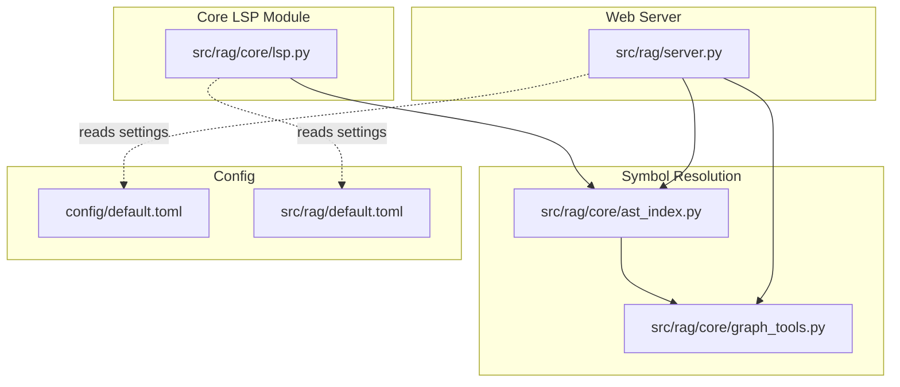
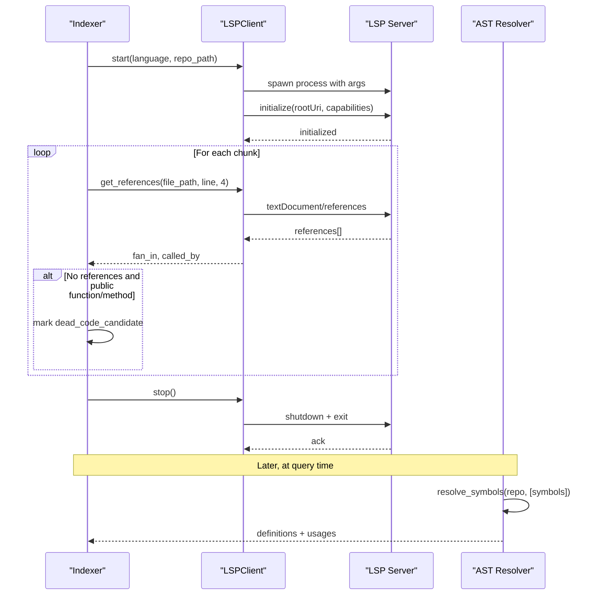
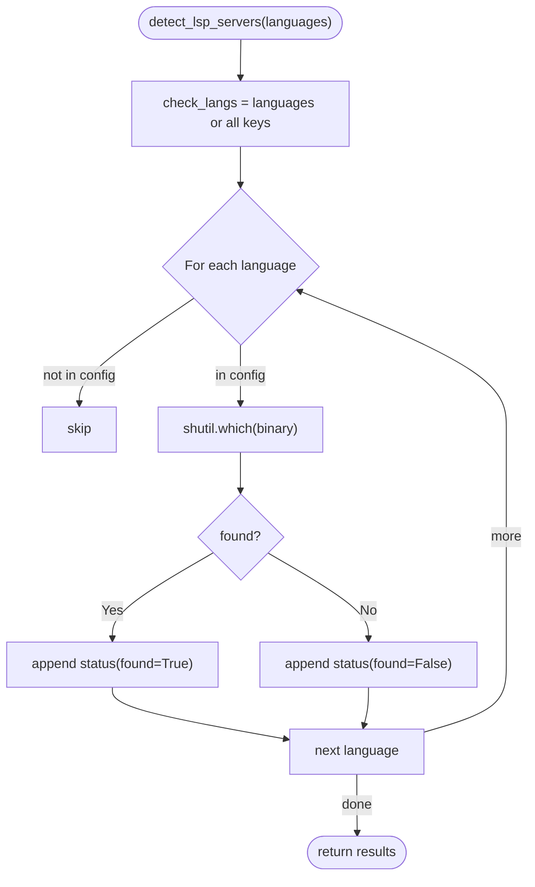
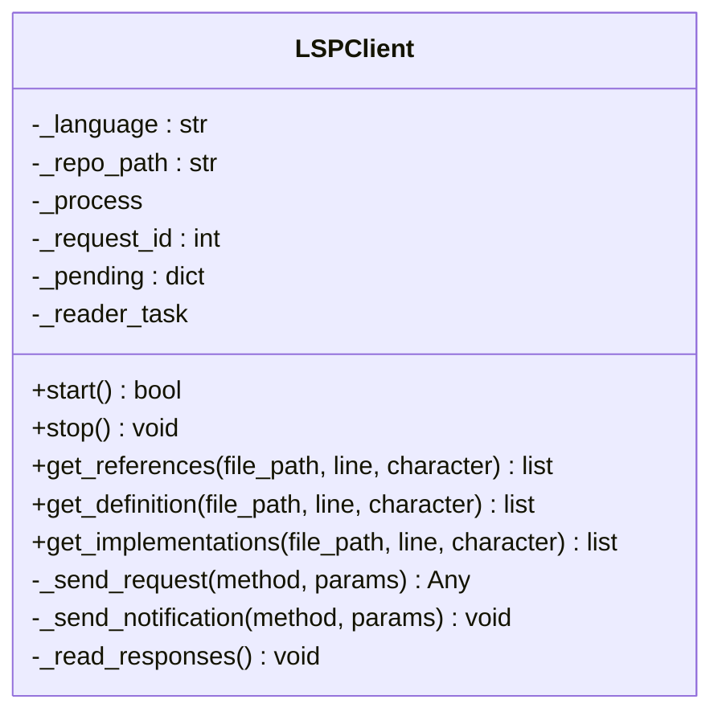
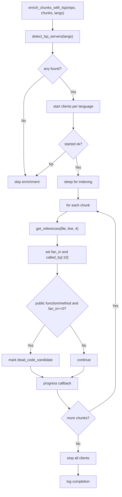
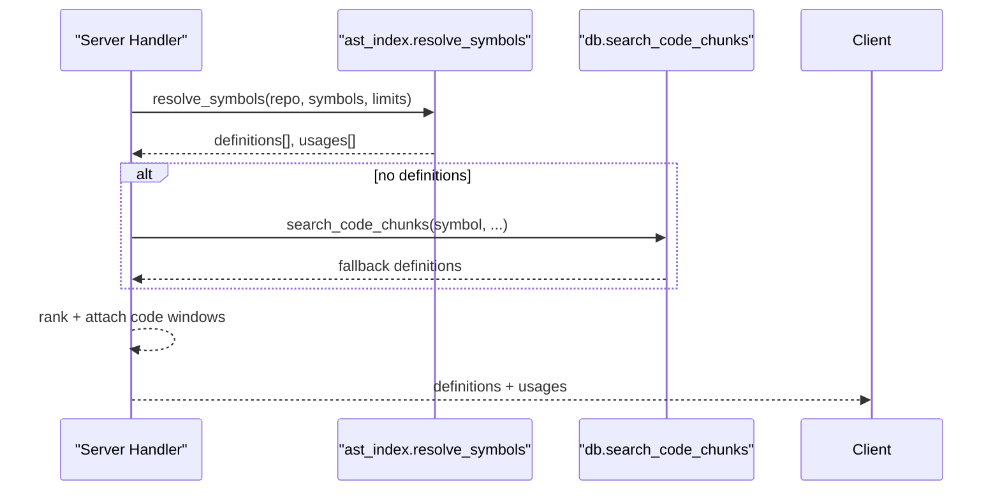
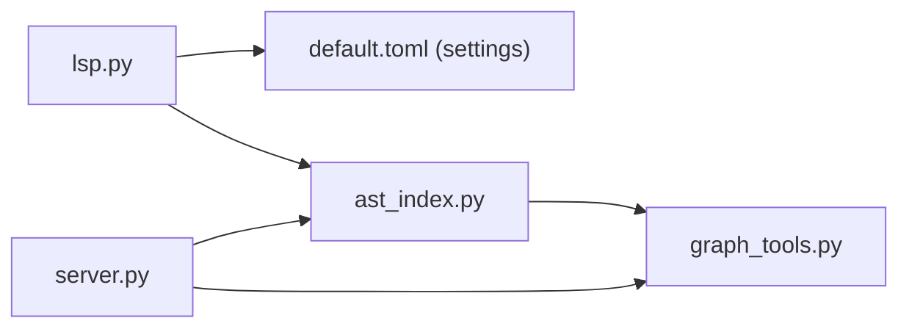

# Language Server Protocol Integration

<cite>
**Referenced Files in This Document**
- [lsp.py](file://src/rag/core/lsp.py)
- [test_lsp.py](file://tests/test_lsp.py)
- [ast_index.py](file://src/rag/core/ast_index.py)
- [graph_tools.py](file://src/rag/core/graph_tools.py)
- [server.py](file://src/rag/server.py)
- [default.toml](file://config/default.toml)
- [default.toml](file://src/rag/default.toml)
</cite>

## Table of Contents
1. [Introduction](#introduction)
2. [Project Structure](#project-structure)
3. [Core Components](#core-components)
4. [Architecture Overview](#architecture-overview)
5. [Detailed Component Analysis](#detailed-component-analysis)
6. [Dependency Analysis](#dependency-analysis)
7. [Performance Considerations](#performance-considerations)
8. [Troubleshooting Guide](#troubleshooting-guide)
9. [Conclusion](#conclusion)
10. [Appendices](#appendices)

## Introduction
This document explains the Language Server Protocol (LSP) integration capabilities implemented in the project. It covers client–server communication via stdio and JSON-RPC, protocol initialization and requests, and how LSP enriches indexing with symbol references and dead-code detection. It also documents AST-based symbol resolution, cross-references, and how these two systems work together to power code intelligence features such as symbol resolution, usage discovery, and impact analysis. Configuration options for language servers, setup guidance, and troubleshooting are included, along with performance implications and optimization strategies for large codebases.

## Project Structure
The LSP integration is centered around a small, focused module that starts language servers, initializes them, and queries them for references and definitions. Supporting components include AST-based symbol resolution and graph tools that complement LSP-derived metadata.

**Diagram sources**
- [lsp.py:1-404](file://src/rag/core/lsp.py#L1-L404)
- [ast_index.py:108-564](file://src/rag/core/ast_index.py#L108-L564)
- [graph_tools.py:43-162](file://src/rag/core/graph_tools.py#L43-L162)
- [server.py:1650-1686](file://src/rag/server.py#L1650-L1686)
- [default.toml](file://config/default.toml)
- [default.toml](file://src/rag/default.toml)

**Section sources**
- [lsp.py:1-404](file://src/rag/core/lsp.py#L1-L404)
- [ast_index.py:108-564](file://src/rag/core/ast_index.py#L108-L564)
- [graph_tools.py:43-162](file://src/rag/core/graph_tools.py#L43-L162)
- [server.py:1650-1686](file://src/rag/server.py#L1650-L1686)
- [default.toml](file://config/default.toml)
- [default.toml](file://src/rag/default.toml)

## Core Components
- LSP server detection and configuration: Detects installed language servers per language and provides installation hints.
- Minimal LSP client: Spawns language servers, initializes them, and sends JSON-RPC requests for references and definitions.
- Index-time enrichment: Uses LSP to compute fan-in, called-by lists, and dead-code candidates during indexing.
- AST-based symbol resolution: Provides symbol definitions and usages, code windowing, and ranking.
- Graph tools: Builds caller/callee relationships and computes impact of symbol changes.

Key responsibilities:
- LSP module: Manage lifecycle of language servers, send requests, parse responses, and enrich chunks.
- AST module: Resolve symbols, attach code windows, and rank results.
- Graph tools: Compute callers, heuristically infer callees, and estimate impact.

**Section sources**
- [lsp.py:25-117](file://src/rag/core/lsp.py#L25-L117)
- [lsp.py:120-311](file://src/rag/core/lsp.py#L120-L311)
- [lsp.py:313-404](file://src/rag/core/lsp.py#L313-L404)
- [ast_index.py:112-146](file://src/rag/core/ast_index.py#L112-L146)
- [graph_tools.py:43-118](file://src/rag/core/graph_tools.py#L43-L118)

## Architecture Overview
The system integrates LSP for index-time enrichment and AST-based resolution for precise symbol lookups. At indexing time, the LSP client starts language servers, queries references and definitions, and annotates chunks with fan-in and dead-code indicators. At query time, the web server resolves symbols via AST and graph tools, returning definitions and usages with context slices.

**Diagram sources**
- [lsp.py:131-174](file://src/rag/core/lsp.py#L131-L174)
- [lsp.py:195-234](file://src/rag/core/lsp.py#L195-L234)
- [lsp.py:313-404](file://src/rag/core/lsp.py#L313-L404)
- [ast_index.py:112-146](file://src/rag/core/ast_index.py#L112-L146)

## Detailed Component Analysis

### LSP Server Detection and Configuration
- Supported languages and commands are configured centrally, including binary name, human-readable name, install hint, and command-line arguments.
- Detection checks PATH for each configured binary and reports availability and install hints.

**Diagram sources**
- [lsp.py:100-117](file://src/rag/core/lsp.py#L100-L117)

**Section sources**
- [lsp.py:25-76](file://src/rag/core/lsp.py#L25-L76)
- [lsp.py:100-117](file://src/rag/core/lsp.py#L100-L117)
- [test_lsp.py:1-29](file://tests/test_lsp.py#L1-L29)

### Minimal LSP Client
- Lifecycle: start spawns the server, initializes it, and sets up a reader task to handle responses. stop shuts down gracefully.
- Requests: Supports textDocument/references, textDocument/definition, and textDocument/implementation. Responses are matched by request ID.
- JSON-RPC transport: Sends Content-Length headers and parses responses line-by-line.

**Diagram sources**
- [lsp.py:120-311](file://src/rag/core/lsp.py#L120-L311)

**Section sources**
- [lsp.py:120-194](file://src/rag/core/lsp.py#L120-L194)
- [lsp.py:236-311](file://src/rag/core/lsp.py#L236-L311)

### Index-Time Enrichment with LSP
- Starts LSP clients for available languages, waits briefly for indexing, then iterates chunks to compute fan-in and called-by entries.
- Marks potential dead code for public functions/methods with zero references.
- Cleans up by stopping all clients.

**Diagram sources**
- [lsp.py:313-404](file://src/rag/core/lsp.py#L313-L404)

**Section sources**
- [lsp.py:313-404](file://src/rag/core/lsp.py#L313-L404)

### AST-Based Symbol Resolution and Cross-References
- resolve_symbols finds definitions and usages for a list of symbols using the AST index, attaches code windows, ranks results, and returns context candidates.
- graph_tools.node resolves a single symbol and falls back to database search if AST yields nothing.
- callers and callees helpers compute caller relationships and heuristically infer likely callees from code scanning.

**Diagram sources**
- [ast_index.py:112-146](file://src/rag/core/ast_index.py#L112-L146)
- [graph_tools.py:43-65](file://src/rag/core/graph_tools.py#L43-L65)

**Section sources**
- [ast_index.py:112-146](file://src/rag/core/ast_index.py#L112-L146)
- [graph_tools.py:43-118](file://src/rag/core/graph_tools.py#L43-L118)
- [server.py:1650-1686](file://src/rag/server.py#L1650-L1686)

### Workspace Management Through LSP
- The LSP client initializes with a root URI pointing to the repository path and minimal capabilities for definition, references, typeDefinition, and implementation.
- This enables symbol navigation and cross-file references during indexing.

**Section sources**
- [lsp.py:156-168](file://src/rag/core/lsp.py#L156-L168)

### Diagnostics and Hover Information
- The current LSP integration does not expose diagnostics or hover information. The client initializes with basic capabilities and does not subscribe to notifications such as textDocument/publishDiagnostics or request hover content.

**Section sources**
- [lsp.py:159-166](file://src/rag/core/lsp.py#L159-L166)

### Semantic Highlighting
- The LSP client does not request semantic tokens or subscribe to textDocument/semanticTokens. There is no semantic highlighting pipeline in the current implementation.

**Section sources**
- [lsp.py:159-166](file://src/rag/core/lsp.py#L159-L166)

### Configuration Options for Different Programming Languages
- Language-specific server binaries, names, install hints, and arguments are defined in a centralized mapping.
- Supported languages include Python, TypeScript/JavaScript, Go, Rust, Java, C, C++, and Dart.

**Section sources**
- [lsp.py:25-76](file://src/rag/core/lsp.py#L25-L76)

### LSP Server Setup and Client Integration Patterns
- Server setup: Install the appropriate language server and ensure it is available on PATH. The detection routine checks PATH and reports install hints.
- Client integration: Start the LSP client per language, initialize, query references/definitions, and stop after enrichment.

**Section sources**
- [lsp.py:100-117](file://src/rag/core/lsp.py#L100-L117)
- [lsp.py:131-174](file://src/rag/core/lsp.py#L131-L174)
- [lsp.py:195-234](file://src/rag/core/lsp.py#L195-L234)

### Practical Examples of LSP-Enabled Features
- Dead code detection: During indexing, symbols with zero references and public visibility are flagged as candidates for removal.
- Cross-file references: Enriched chunks include fan-in counts and a sampled list of callers.
- Symbol resolution: At query time, the server resolves definitions and usages with context windows.

**Section sources**
- [lsp.py:370-396](file://src/rag/core/lsp.py#L370-L396)
- [ast_index.py:112-146](file://src/rag/core/ast_index.py#L112-L146)
- [server.py:1650-1686](file://src/rag/server.py#L1650-L1686)

### Custom Language Support
- To add a new language, extend the language mapping with the binary name, human-readable name, install hint, and command-line arguments. Ensure the binary is available on PATH.

**Section sources**
- [lsp.py:25-76](file://src/rag/core/lsp.py#L25-L76)

### Troubleshooting Connection Issues
- If no servers are found, verify PATH and installation hints. The detection routine returns install hints per language.
- If initialization fails, check logs for startup failures and confirm the server supports stdio mode as configured.
- If requests time out, adjust the LSP timeout setting and consider server load or indexing delays.

**Section sources**
- [lsp.py:100-117](file://src/rag/core/lsp.py#L100-L117)
- [lsp.py:172-174](file://src/rag/core/lsp.py#L172-L174)
- [lsp.py:253-258](file://src/rag/core/lsp.py#L253-L258)

## Dependency Analysis
- LSP module depends on configuration settings for timeouts and relies on external language servers via stdio.
- AST resolver and graph tools depend on the AST index and database fallbacks.
- Web server handlers depend on AST and graph tools for symbol resolution.

**Diagram sources**
- [lsp.py:313-404](file://src/rag/core/lsp.py#L313-L404)
- [ast_index.py:112-146](file://src/rag/core/ast_index.py#L112-L146)
- [graph_tools.py:43-118](file://src/rag/core/graph_tools.py#L43-L118)
- [server.py:1650-1686](file://src/rag/server.py#L1650-L1686)
- [default.toml](file://src/rag/default.toml)

**Section sources**
- [lsp.py:313-404](file://src/rag/core/lsp.py#L313-L404)
- [ast_index.py:112-146](file://src/rag/core/ast_index.py#L112-L146)
- [graph_tools.py:43-118](file://src/rag/core/graph_tools.py#L43-L118)
- [server.py:1650-1686](file://src/rag/server.py#L1650-L1686)
- [default.toml](file://src/rag/default.toml)

## Performance Considerations
- Per-request timeouts: LSP requests are bounded by a configurable timeout to avoid blocking indexing.
- Startup overhead: Each language server is spawned per chunk language; batching or reusing clients could reduce overhead.
- Indexing delay: A short sleep is used to allow servers to index before querying; tune based on repository size.
- Ranking and code windowing: AST-based resolution attaches code windows and ranks results to minimize downstream processing.
- Impact computation: Caller and affected-file computations avoid whole-file reads by focusing on symbol locations.

Recommendations:
- Centralize LSP client lifecycle per repository to avoid repeated startups.
- Cache LSP responses for repeated queries within a session.
- Tune LSP timeout and sleep duration based on server performance and repository scale.
- Use AST-based ranking to reduce false positives and limit context window sizes.

**Section sources**
- [lsp.py:370-375](file://src/rag/core/lsp.py#L370-L375)
- [lsp.py:350-351](file://src/rag/core/lsp.py#L350-L351)
- [ast_index.py:326-337](file://src/rag/core/ast_index.py#L326-L337)
- [graph_tools.py:121-162](file://src/rag/core/graph_tools.py#L121-L162)

## Troubleshooting Guide
Common issues and resolutions:
- No LSP servers detected: Confirm PATH includes the installed language server binary and review install hints.
- Initialization failure: Verify the server supports stdio mode and the root URI is correct.
- Timeout on requests: Increase the LSP timeout setting and ensure the server is not overloaded.
- Missing diagnostics/hover: These features are not currently exposed by the client; extend capabilities if needed.

**Section sources**
- [lsp.py:100-117](file://src/rag/core/lsp.py#L100-L117)
- [lsp.py:172-174](file://src/rag/core/lsp.py#L172-L174)
- [lsp.py:253-258](file://src/rag/core/lsp.py#L253-L258)
- [default.toml](file://src/rag/default.toml)

## Conclusion
The project integrates LSP for index-time enrichment and AST-based symbol resolution for query-time intelligence. LSP provides cross-file references and dead-code signals, while AST ensures precise symbol lookup and ranking. Together, these components enable robust code navigation and impact analysis. Extending the client to support diagnostics and hover, and optimizing client lifecycle and caching, can further improve performance and coverage.

## Appendices

### Configuration Options
- LSP timeout: Controls per-request timeout for LSP operations.
- Language server mapping: Binary, name, install hint, and arguments per language.

**Section sources**
- [default.toml](file://src/rag/default.toml)
- [lsp.py:25-76](file://src/rag/core/lsp.py#L25-L76)