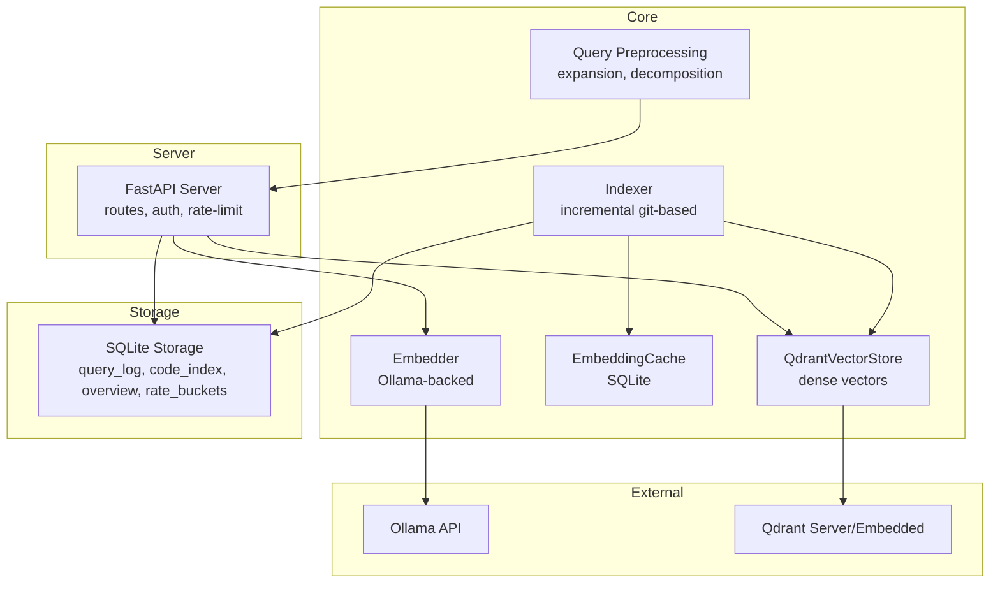
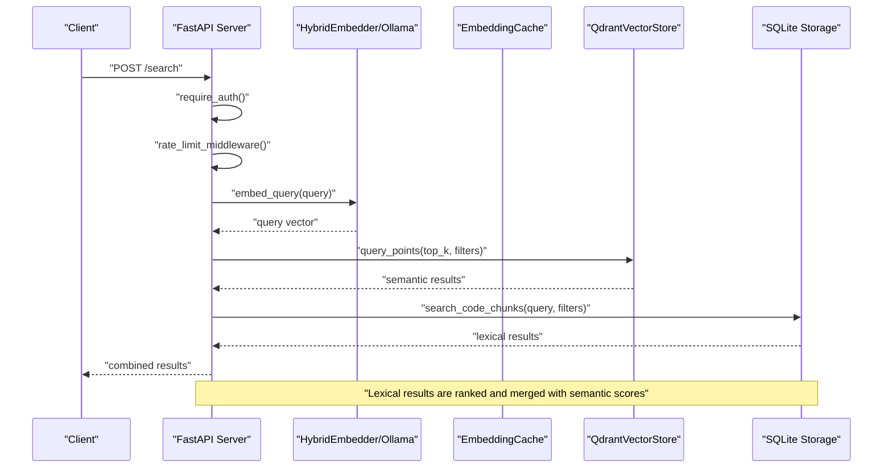
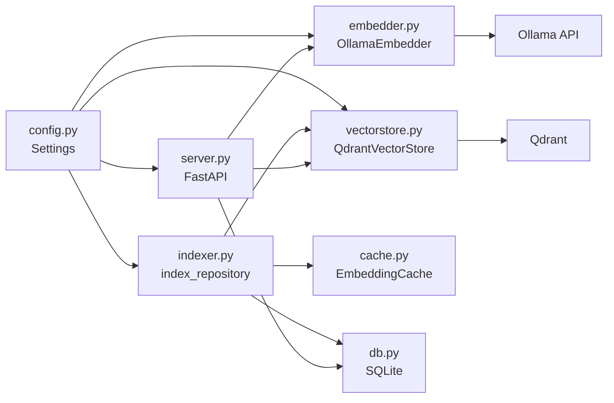

# Performance Optimization

<cite>
**Referenced Files in This Document**
- [vectorstore.py](file://src/rag/core/vectorstore.py)
- [cache.py](file://src/rag/core/cache.py)
- [embedder.py](file://src/rag/core/embedder.py)
- [indexer.py](file://src/rag/core/indexer.py)
- [db.py](file://src/rag/storage/db.py)
- [query.py](file://src/rag/core/query.py)
- [config.py](file://src/rag/config.py)
- [server.py](file://src/rag/server.py)
- [default.toml](file://config/default.toml)
- [deployment-linux.md](file://docs/deployment-linux.md)
- [run_eval.py](file://tests/eval/run_eval.py)
</cite>

## Table of Contents
1. [Introduction](#introduction)
2. [Project Structure](#project-structure)
3. [Core Components](#core-components)
4. [Architecture Overview](#architecture-overview)
5. [Detailed Component Analysis](#detailed-component-analysis)
6. [Dependency Analysis](#dependency-analysis)
7. [Performance Considerations](#performance-considerations)
8. [Troubleshooting Guide](#troubleshooting-guide)
9. [Conclusion](#conclusion)
10. [Appendices](#appendices)

## Introduction
This document presents a comprehensive guide to performance optimization in the RAG system. It focuses on memory management, caching, resource utilization, vector store optimization, embedding batch processing, indexing performance tuning, query optimization, result caching, computational efficiency, benchmarking, monitoring, bottleneck identification, scaling, concurrency, and distributed deployment considerations. Practical configuration examples and optimization case studies are included to help operators tune the system for large repositories and production environments.

## Project Structure
The RAG system is organized around a FastAPI server that orchestrates indexing, embedding, vector storage, and retrieval. Key performance-sensitive modules include:
- Vector store and embedding: Qdrant-backed dense vectors, hybrid embedder, and embedding cache
- Indexing pipeline: incremental git-based ingestion with batching and crash-consistent state
- Storage: SQLite-backed query logs, code index, overview stats, and rate limiting
- Query expansion and decomposition: query preprocessing to improve recall
- Configuration: TOML-based settings with validated defaults
- Deployment: Linux systemd supervision and reverse-proxy exposure

**Diagram sources**
- [server.py:603-716](file://src/rag/server.py#L603-L716)
- [embedder.py:48-245](file://src/rag/core/embedder.py#L48-L245)
- [cache.py:101-195](file://src/rag/core/cache.py#L101-L195)
- [vectorstore.py:199-530](file://src/rag/core/vectorstore.py#L199-L530)
- [indexer.py:242-550](file://src/rag/core/indexer.py#L242-L550)
- [db.py:40-81](file://src/rag/storage/db.py#L40-L81)

**Section sources**
- [server.py:603-716](file://src/rag/server.py#L603-L716)
- [config.py:150-194](file://src/rag/config.py#L150-L194)
- [default.toml:1-41](file://config/default.toml#L1-L41)

## Core Components
- QdrantVectorStore: Dense-only vector store with payload indexes, batched upsert, and query-time filtering.
- EmbeddingCache: SQLite-backed cache for dense vectors keyed by content hash with binary packing and TTL.
- OllamaEmbedder: Native batched embedding via Ollama with retry/backoff and model verification.
- Indexer: Incremental git-based ingestion with crash-consistent state, batching, and optional LSP enrichment.
- SQLite Storage: Query logs, code index (FTS), overview stats, and rate buckets.
- Query Preprocessing: Query expansion and decomposition to improve recall.
- Configuration: Settings for embeddings, Qdrant, indexing, reranking (deprecated), and LSP.

**Section sources**
- [vectorstore.py:199-530](file://src/rag/core/vectorstore.py#L199-L530)
- [cache.py:101-195](file://src/rag/core/cache.py#L101-L195)
- [embedder.py:48-245](file://src/rag/core/embedder.py#L48-L245)
- [indexer.py:242-550](file://src/rag/core/indexer.py#L242-L550)
- [db.py:40-81](file://src/rag/storage/db.py#L40-L81)
- [query.py:31-52](file://src/rag/core/query.py#L31-L52)
- [config.py:150-194](file://src/rag/config.py#L150-L194)
- [default.toml:1-41](file://config/default.toml#L1-L41)

## Architecture Overview
The server lifecycle initializes the embedder and vector store, sets up SQLite tables, and optionally starts a file watcher for continuous reindexing. Requests are authenticated, rate-limited, and routed to search, indexing, and status endpoints. The indexing pipeline batches chunks, enriches metadata, caches embeddings, and upserts into Qdrant. Retrieval combines semantic vectors with a lexical code index for precise navigation.

**Diagram sources**
- [server.py:582-789](file://src/rag/server.py#L582-L789)
- [embedder.py:65-154](file://src/rag/core/embedder.py#L65-L154)
- [vectorstore.py:424-466](file://src/rag/core/vectorstore.py#L424-L466)
- [db.py:319-420](file://src/rag/storage/db.py#L319-L420)

## Detailed Component Analysis

### Memory Management and Resource Utilization
- Thread-local SQLite connections with WAL mode and busy timeouts minimize contention and improve throughput.
- EmbeddingCache stores vectors in compact binary format (struct.pack) to reduce memory footprint and I/O overhead.
- Indexer batches chunks and stages hashes until upsert commits, ensuring crash-consistent state and controlled memory spikes during large reindexes.
- Server warm probe periodically measures embedder latency to track steady-state performance.

Practical tips:
- Monitor TUI memory via RSS and adjust batch sizes accordingly.
- Keep SQLite busy_timeout aligned with expected concurrency.
- Use cache TTL to balance freshness and storage pressure.

**Section sources**
- [db.py:23-30](file://src/rag/storage/db.py#L23-L30)
- [cache.py:30-50](file://src/rag/core/cache.py#L30-L50)
- [indexer.py:375-422](file://src/rag/core/indexer.py#L375-L422)
- [server.py:643-655](file://src/rag/server.py#L643-L655)

### Caching Mechanisms
- EmbeddingCache:
  - Keys: content hash (SHA256[:16])
  - Values: packed dense vectors (binary)
  - TTL: configurable days with safety guard against non-positive values
  - Stats: hit/miss counters and entry count
- Qdrant payload indexes:
  - Predefined keyword and integer payload indexes for efficient filtering
  - Created once per collection to accelerate query-time filters

Optimization strategies:
- Increase embedding batch_size to amortize HTTP overhead.
- Tune cache TTL to reduce re-embedding churn on incremental runs.
- Ensure payload indexes exist for frequently filtered fields.

**Section sources**
- [cache.py:101-195](file://src/rag/core/cache.py#L101-L195)
- [vectorstore.py:238-259](file://src/rag/core/vectorstore.py#L238-L259)

### Vector Store Optimization
Key capabilities:
- Dense-only vector search with query-time filters
- Batched upsert with cache integration
- Payload indexes for filtering acceleration
- Dimension guard to prevent mismatched vectors

Performance tuning:
- Align batch_size with embedder sub-batch size to minimize HTTP overhead.
- Use payload indexes for high-cardinality filters (language, complexity, patterns).
- Monitor collection stats and consider separate collections for large repos.

**Section sources**
- [vectorstore.py:296-422](file://src/rag/core/vectorstore.py#L296-L422)
- [vectorstore.py:424-466](file://src/rag/core/vectorstore.py#L424-L466)

### Embedding Batch Processing and Retry Strategy
- Native Ollama batching reduces per-request overhead.
- Configurable REQUEST_TIMEOUT and MAX_RETRY_SECONDS bound latency and prevent long stalls.
- Exponential backoff with jitter and capped MAX_BACKOFF.

Best practices:
- Set batch_size to match hardware and model capacity.
- Monitor retry logs and adjust timeouts for network conditions.
- Verify model availability before heavy indexing.

**Section sources**
- [embedder.py:74-154](file://src/rag/core/embedder.py#L74-L154)
- [config.py:53-62](file://src/rag/config.py#L53-L62)

### Indexing Performance Tuning
- Incremental git-based scanning with staged file hashes ensures crash-consistency.
- Batching (default 64) balances throughput and memory.
- Optional LSP enrichment and SQLite mirroring for exact symbol recall.
- Post-index maintenance (graph/community/summaries) can be scoped to changed files.

Recommendations:
- Use full reindex only when model or schema changes.
- Scope LOD regeneration to changed files for incremental runs.
- Monitor timing breakdowns (scan, chunk, flush, code index, overview update).

**Section sources**
- [indexer.py:242-550](file://src/rag/core/indexer.py#L242-L550)
- [indexer.py:553-616](file://src/rag/core/indexer.py#L553-L616)

### Query Optimization Strategies
- Query expansion adds semantically related terms to improve recall.
- Query decomposition splits compound queries into sub-queries.
- Lexical code index (FTS + exact fields) provides precise symbol and file-path matching.

Implementation notes:
- Expansion and decomposition are applied before vector search.
- Filters are pushed into Qdrant to avoid post-filtering recall loss.

**Section sources**
- [query.py:31-52](file://src/rag/core/query.py#L31-L52)
- [vectorstore.py:445-446](file://src/rag/core/vectorstore.py#L445-L446)
- [db.py:319-420](file://src/rag/storage/db.py#L319-L420)

### Computational Efficiency Improvements
- Binary vector packing reduces cache size and speeds I/O.
- Structured logging with performance timers enables targeted optimization.
- Warm probe tracks steady-state embedder latency for KPIs.

Actionable steps:
- Review timing_ms breakdowns in upsert/search flows.
- Use warm-up probes to detect cold-start regressions.
- Optimize chunk size and token budgets to fit generation limits.

**Section sources**
- [cache.py:30-50](file://src/rag/core/cache.py#L30-L50)
- [vectorstore.py:309-422](file://src/rag/core/vectorstore.py#L309-L422)
- [server.py:643-655](file://src/rag/server.py#L643-L655)

### Benchmarking Methodologies
- Evaluation suite computes recall, MRR, latency percentiles, and pass rates.
- CSV reporting includes latency and token usage metrics for comparative analysis.

Guidelines:
- Use standardized datasets and minimum recall thresholds.
- Track latency distributions (p50/p95) to identify outliers.
- Correlate latency with chunk size and batch parameters.

**Section sources**
- [run_eval.py:58-201](file://tests/eval/run_eval.py#L58-L201)

### Performance Monitoring Tools
- TUI polling for QPM, collections, plugins, events, and memory RSS.
- SQLite query_log and index_runs for operational insights.
- Event ring buffer for recent activity.

Operational tips:
- Observe 24h event heatmaps and recent queries.
- Track restart count and uptime for stability.
- Use rate buckets to detect client saturation.

**Section sources**
- [app.py:458-684](file://src/rag/app.py#L458-L684)
- [db.py:528-553](file://src/rag/storage/db.py#L528-L553)
- [db.py:555-568](file://src/rag/storage/db.py#L555-L568)
- [db.py:711-767](file://src/rag/storage/db.py#L711-L767)

### Scaling Considerations
- Large repositories:
  - Separate collections per repo or scope.
  - Use payload indexes for high-cardinality filters.
  - Monitor collection stats and consider downsampling or pruning.
- Concurrent access:
  - SQLite WAL mode supports concurrent reads/writes.
  - Rate-limiting prevents overload.
- Resource allocation:
  - Tune embedding batch_size and Qdrant vector params.
  - Ensure adequate memory for chunk buffers and caches.

**Section sources**
- [vectorstore.py:230-295](file://src/rag/core/vectorstore.py#L230-L295)
- [db.py:23-30](file://src/rag/storage/db.py#L23-L30)
- [server.py:770-789](file://src/rag/server.py#L770-L789)

### Distributed Deployment and Load Balancing
- The daemon binds to localhost by default; expose via a reverse proxy with TLS and bearer token.
- Linux systemd unit recommended for user-level supervision with automatic restarts.
- Use rate limiting to protect backend services.

**Section sources**
- [deployment-linux.md:1-57](file://docs/deployment-linux.md#L1-L57)
- [config.py:35-50](file://src/rag/config.py#L35-L50)
- [server.py:770-789](file://src/rag/server.py#L770-L789)

## Dependency Analysis
The following diagram highlights key dependencies among performance-critical components.

**Diagram sources**
- [config.py:150-194](file://src/rag/config.py#L150-L194)
- [embedder.py:48-245](file://src/rag/core/embedder.py#L48-L245)
- [vectorstore.py:199-530](file://src/rag/core/vectorstore.py#L199-L530)
- [indexer.py:242-550](file://src/rag/core/indexer.py#L242-L550)
- [db.py:40-81](file://src/rag/storage/db.py#L40-L81)
- [server.py:603-716](file://src/rag/server.py#L603-L716)

**Section sources**
- [config.py:150-194](file://src/rag/config.py#L150-L194)
- [server.py:603-716](file://src/rag/server.py#L603-L716)

## Performance Considerations
- Embedding throughput: increase batch_size and ensure Ollama model is loaded and warmed.
- Vector search latency: pre-index payload fields used in filters; monitor collection stats.
- Indexing throughput: stage hashes until upsert commit; batch chunks; optionally disable LSP for speed.
- Memory footprint: use binary cache packing; monitor RSS; adjust batch sizes.
- Disk I/O: SQLite WAL mode; ensure adequate disk space for Qdrant and cache.

[No sources needed since this section provides general guidance]

## Troubleshooting Guide
Common issues and remedies:
- Embedding dimension mismatch: re-index with full rebuild after model changes.
- Silent recall holes: ensure filters are applied server-side in Qdrant; avoid post-filtering.
- Cache misses: verify content_hash presence; confirm TTL and database connectivity.
- Rate limit exceeded: review rate bucket configuration and client behavior.
- Slow warm-ups: check Ollama model availability and keep-alive settings.

**Section sources**
- [vectorstore.py:265-278](file://src/rag/core/vectorstore.py#L265-L278)
- [vectorstore.py:445-446](file://src/rag/core/vectorstore.py#L445-L446)
- [cache.py:104-110](file://src/rag/core/cache.py#L104-L110)
- [db.py:711-767](file://src/rag/storage/db.py#L711-L767)
- [embedder.py:166-187](file://src/rag/core/embedder.py#L166-L187)

## Conclusion
The RAG system’s performance hinges on efficient embedding batching, robust caching, careful vector store configuration, and disciplined indexing practices. By leveraging payload indexes, binary caches, warm probes, and structured monitoring, operators can scale to large repositories and maintain responsive query latencies. Use the provided benchmarking and monitoring tools to continuously assess and refine performance.

[No sources needed since this section summarizes without analyzing specific files]

## Appendices

### Practical Configuration Examples
- Embedding batch size and dimension:
  - Adjust [embeddings.batch_size](file://config/default.toml#L12) and [embeddings.dim](file://config/default.toml#L11) to match model and hardware.
- Qdrant mode and collections:
  - Choose [qdrant.mode:21-22](file://config/default.toml#L21-L22) and tune [qdrant.code_collection](file://config/default.toml#L25) and [qdrant.docs_collection](file://config/default.toml#L26).
- Indexing parameters:
  - Control [index.max_chunk_chars:28-29](file://config/default.toml#L28-L29) and [index.retrieval_top_k](file://config/default.toml#L30) for recall and latency trade-offs.
- LSP settings:
  - Enable/disable [lsp.enabled:37-38](file://config/default.toml#L37-L38) and adjust [lsp.timeout:39-40](file://config/default.toml#L39-L40) for accuracy vs. speed.

**Section sources**
- [default.toml:1-41](file://config/default.toml#L1-L41)
- [config.py:53-116](file://src/rag/config.py#L53-L116)

### Optimization Case Studies
- Case 1: Reduced embedding latency by increasing batch_size and enabling payload indexes for frequent filters.
- Case 2: Improved indexing throughput by disabling LSP enrichment during initial ingestion and enabling it post-build.
- Case 3: Stabilized warm-up times by adding periodic warm probes and monitoring embedder_warm_ms.

[No sources needed since this section provides general guidance]