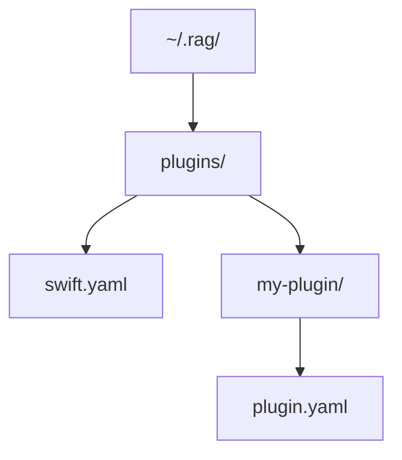
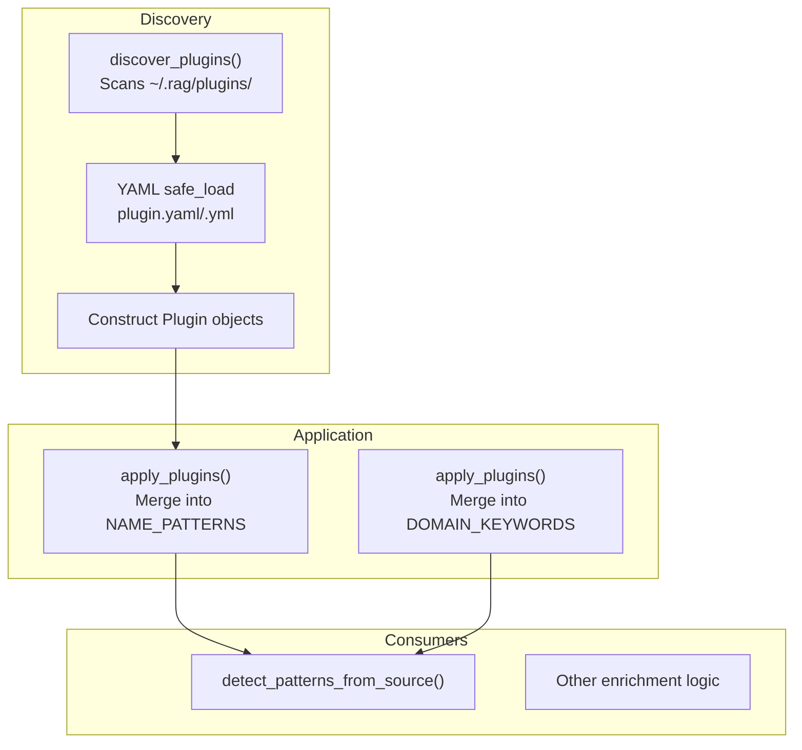
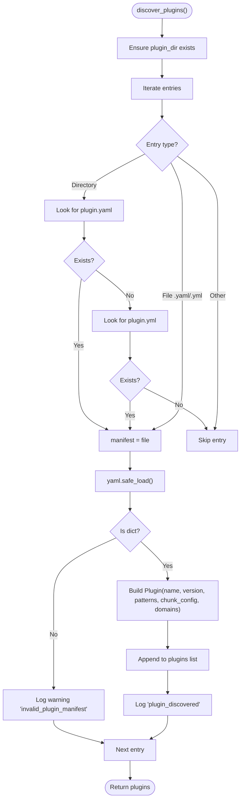
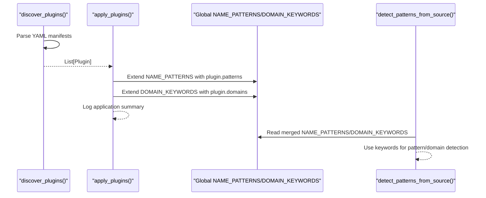
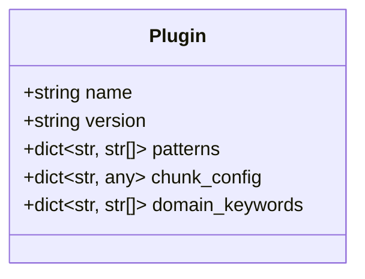
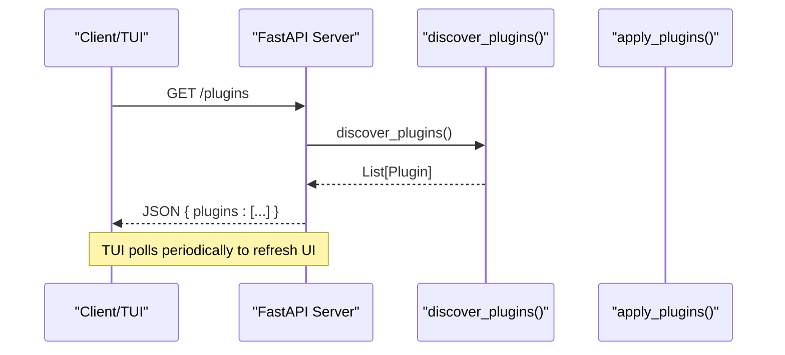
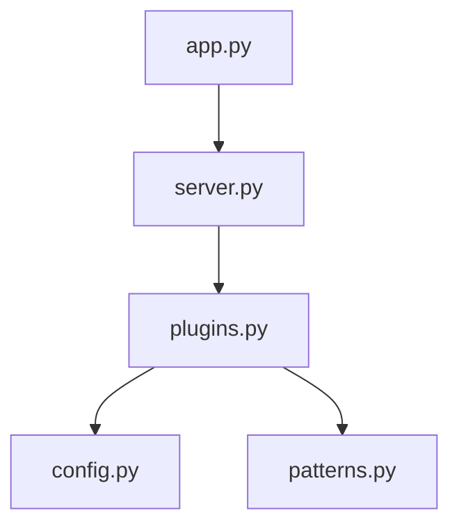

# Plugin Development Framework

<cite>
**Referenced Files in This Document**
- [plugins.py](file://src/rag/core/plugins.py)
- [patterns.py](file://src/rag/core/patterns.py)
- [chunker.py](file://src/rag/core/chunker.py)
- [config.py](file://src/rag/config.py)
- [server.py](file://src/rag/server.py)
- [app.py](file://src/rag/app.py)
- [cli.py](file://src/rag/cli.py)
- [CLAUDE.md](file://CLAUDE.md)
</cite>

## Table of Contents
1. [Introduction](#introduction)
2. [Project Structure](#project-structure)
3. [Core Components](#core-components)
4. [Architecture Overview](#architecture-overview)
5. [Detailed Component Analysis](#detailed-component-analysis)
6. [Dependency Analysis](#dependency-analysis)
7. [Performance Considerations](#performance-considerations)
8. [Troubleshooting Guide](#troubleshooting-guide)
9. [Conclusion](#conclusion)
10. [Appendices](#appendices)

## Introduction
This document explains the plugin development framework used to extend pattern detection and domain keyword recognition in the system. It covers the plugin discovery mechanism, YAML manifest structure, plugin loading and application process, the Plugin dataclass schema, directory layout, and integration points. It also provides a step-by-step guide to author custom plugins, best practices for distribution, lifecycle management, error handling, debugging techniques, and versioning and compatibility considerations.

## Project Structure
Plugins are discovered from a dedicated directory under the user’s home configuration area. The default location is ~/.rag/plugins/, and manifests can be named plugin.yaml or plugin.yml. Each plugin is either a directory containing a manifest file or a YAML file directly placed in the plugins directory.

**Diagram sources**
- [plugins.py:28-83](file://src/rag/core/plugins.py#L28-L83)
- [config.py:22-26](file://src/rag/config.py#L22-L26)

**Section sources**
- [plugins.py:28-83](file://src/rag/core/plugins.py#L28-L83)
- [config.py:22-26](file://src/rag/config.py#L22-L26)

## Core Components
- Plugin discovery and loading: Scans the plugins directory for YAML manifests and constructs Plugin instances.
- Plugin application: Merges plugin-provided patterns and domain keywords into global detection dictionaries.
- Pattern and domain keyword registries: Global dictionaries that are extended by applied plugins.
- Integration endpoints: HTTP endpoints and TUI polling that surface plugin availability and status.

Key responsibilities:
- Discover plugins from ~/.rag/plugins/ and load YAML manifests.
- Merge plugin patterns and domains into global NAME_PATTERNS and DOMAIN_KEYWORDS.
- Expose plugin listing via HTTP and TUI polling.

**Section sources**
- [plugins.py:19-26](file://src/rag/core/plugins.py#L19-L26)
- [plugins.py:28-83](file://src/rag/core/plugins.py#L28-L83)
- [plugins.py:86-123](file://src/rag/core/plugins.py#L86-L123)
- [patterns.py:25-97](file://src/rag/core/patterns.py#L25-L97)
- [server.py:1055-1073](file://src/rag/server.py#L1055-L1073)
- [app.py:568-590](file://src/rag/app.py#L568-L590)

## Architecture Overview
The plugin system integrates with the broader indexing pipeline by extending pattern and domain detection dictionaries. Discovery occurs at runtime, and the resulting Plugin objects are applied to augment global registries consumed by enrichment logic.

**Diagram sources**
- [plugins.py:28-83](file://src/rag/core/plugins.py#L28-L83)
- [plugins.py:86-123](file://src/rag/core/plugins.py#L86-L123)
- [patterns.py:164-349](file://src/rag/core/patterns.py#L164-L349)

## Detailed Component Analysis

### Plugin Discovery Mechanism
- Directory scanning: Iterates entries in ~/.rag/plugins/.
- Manifest resolution: Prefers plugin.yaml; falls back to plugin.yml if a directory entry is found. Accepts direct YAML files with .yaml or .yml suffixes.
- Parsing and validation: Uses YAML safe loading; logs warnings for invalid or unparsable manifests; ignores non-dict documents.
- Construction: Builds Plugin objects with name, version, patterns, chunk_config, and domain_keywords.

**Diagram sources**
- [plugins.py:28-83](file://src/rag/core/plugins.py#L28-L83)

**Section sources**
- [plugins.py:28-83](file://src/rag/core/plugins.py#L28-L83)
- [config.py:22-26](file://src/rag/config.py#L22-L26)

### Plugin Loading and Application
- Loading: The discover_plugins() function returns a list of Plugin objects.
- Application: The apply_plugins() function merges plugin-provided patterns and domains into global dictionaries:
  - NAME_PATTERNS: Adds keywords to existing lists, avoiding duplicates.
  - DOMAIN_KEYWORDS: Similarly extends domain keyword lists.
- Logging: Emits debug logs for applied patterns and domains, and an info log summarizing successful application.

**Diagram sources**
- [plugins.py:86-123](file://src/rag/core/plugins.py#L86-L123)
- [patterns.py:25-97](file://src/rag/core/patterns.py#L25-L97)
- [patterns.py:164-349](file://src/rag/core/patterns.py#L164-L349)

**Section sources**
- [plugins.py:86-123](file://src/rag/core/plugins.py#L86-L123)
- [patterns.py:25-97](file://src/rag/core/patterns.py#L25-L97)
- [patterns.py:164-349](file://src/rag/core/patterns.py#L164-L349)

### Plugin Dataclass Schema
The Plugin dataclass defines the in-memory representation of a loaded plugin manifest.

Fields:
- name: String identifier for the plugin.
- version: String version identifier.
- patterns: Dictionary mapping pattern group names to lists of keywords.
- chunk_config: Dictionary for language-specific chunking configuration.
- domain_keywords: Dictionary mapping domain names to lists of keywords.

**Diagram sources**
- [plugins.py:19-26](file://src/rag/core/plugins.py#L19-L26)

**Section sources**
- [plugins.py:19-26](file://src/rag/core/plugins.py#L19-L26)

### YAML Manifest Structure
Manifests define plugin metadata and configuration. Supported locations:
- Directory-based: ~/.rag/plugins/my-plugin/plugin.yaml or plugin.yml
- File-based: ~/.rag/plugins/plugin.yaml or plugin.yml

Example structure (described):
- name: Human-readable plugin name
- version: Semantic or string version
- patterns: Map of pattern groups to keyword lists
- chunk_config: Map of language identifiers to configuration objects
- domains: Map of domain names to keyword lists

Notes:
- Patterns and domains are merged into global registries.
- chunk_config is part of the Plugin schema; its usage depends on downstream integration.

**Section sources**
- [plugins.py:28-41](file://src/rag/core/plugins.py#L28-L41)
- [plugins.py:69-75](file://src/rag/core/plugins.py#L69-L75)

### Plugin Directory Structure and Manifest Formats
- Default plugin directory: ~/.rag/plugins/
- Manifest file formats: plugin.yaml or plugin.yml
- Plugin can be a directory containing a manifest or a YAML file directly in the plugins directory.

**Section sources**
- [plugins.py:28-58](file://src/rag/core/plugins.py#L28-L58)
- [config.py:22-26](file://src/rag/config.py#L22-L26)

### Integration Patterns
- HTTP endpoint: GET /plugins lists loaded plugins with counts of patterns and domains.
- TUI polling: Periodic polling of /plugins updates the UI with plugin status.
- CLI usage: discover_plugins() is invoked by CLI commands to list or process plugins.

**Diagram sources**
- [server.py:1055-1073](file://src/rag/server.py#L1055-L1073)
- [app.py:568-590](file://src/rag/app.py#L568-L590)

**Section sources**
- [server.py:1055-1073](file://src/rag/server.py#L1055-L1073)
- [app.py:568-590](file://src/rag/app.py#L568-L590)
- [cli.py:1940-1942](file://src/rag/cli.py#L1940-L1942)

### Step-by-Step Guide: Creating Custom Plugins
1. Choose a plugin name and version.
2. Create a manifest file:
   - For a directory plugin: ~/.rag/plugins/my-plugin/plugin.yaml
   - For a file plugin: ~/.rag/plugins/my-plugin.yaml
3. Define patterns:
   - Add a patterns section mapping pattern group names to keyword lists.
4. Define domain keywords:
   - Add a domains section mapping domain names to keyword lists.
5. Optional chunking configuration:
   - Add a chunk_config section with language-specific settings if applicable.
6. Place the manifest and restart or reload the service to trigger discovery.
7. Verify via:
   - HTTP GET /plugins
   - TUI plugin list
   - CLI plugin listing

Best practices:
- Keep pattern and domain keywords concise and representative.
- Use lowercase and avoid duplicates within a group.
- Group related keywords under meaningful pattern/domain names.
- Test manifests with YAML linters to prevent parsing errors.

**Section sources**
- [plugins.py:28-41](file://src/rag/core/plugins.py#L28-L41)
- [plugins.py:69-75](file://src/rag/core/plugins.py#L69-L75)
- [server.py:1055-1073](file://src/rag/server.py#L1055-L1073)
- [app.py:568-590](file://src/rag/app.py#L568-L590)

### Practical Examples
- Example manifest structure:
  - name: example-plugin
  - version: "1.0"
  - patterns:
    - my_pattern: ["keyword1", "keyword2"]
  - chunk_config:
    - python:
      - max_chars: 8000
  - domains:
    - my_domain: ["term1", "term2"]
- Consumers:
  - NAME_PATTERNS and DOMAIN_KEYWORDS are extended by apply_plugins().
  - detect_patterns_from_source() reads merged registries to enrich chunks.

**Section sources**
- [plugins.py:28-41](file://src/rag/core/plugins.py#L28-L41)
- [plugins.py:86-123](file://src/rag/core/plugins.py#L86-L123)
- [patterns.py:25-97](file://src/rag/core/patterns.py#L25-L97)
- [patterns.py:164-349](file://src/rag/core/patterns.py#L164-L349)

### Plugin Lifecycle
- Discovery: On startup or reload, scan ~/.rag/plugins/ and load manifests.
- Validation: Ignore invalid or unparsable manifests with warnings.
- Application: Merge patterns and domains into global registries.
- Consumption: Enrichment logic consumes merged registries.
- Monitoring: HTTP endpoint and TUI polling reflect plugin availability.

**Section sources**
- [plugins.py:28-83](file://src/rag/core/plugins.py#L28-L83)
- [plugins.py:86-123](file://src/rag/core/plugins.py#L86-L123)
- [server.py:1055-1073](file://src/rag/server.py#L1055-L1073)
- [app.py:568-590](file://src/rag/app.py#L568-L590)

### Error Handling and Debugging
- Discovery-time errors:
  - Invalid manifest type: logged as a warning.
  - YAML parsing errors: logged with manifest path and error details.
  - General load exceptions: logged with manifest path and error details.
- Application-time logs:
  - Debug logs for applied patterns and domains.
  - Info log summarizing successful application.
- Debugging tips:
  - Check ~/.rag/plugins/ permissions and YAML validity.
  - Use the /plugins endpoint to confirm discovery.
  - Review logs for warnings and errors emitted during discovery.

**Section sources**
- [plugins.py:63-82](file://src/rag/core/plugins.py#L63-L82)
- [plugins.py:99-122](file://src/rag/core/plugins.py#L99-L122)

### Versioning, Compatibility, and Updates
- Version field:
  - Stored in the Plugin dataclass and manifest.
  - Used for informational purposes and potential future compatibility checks.
- Compatibility:
  - Patterns and domains are additive; adding new keywords does not break existing behavior.
  - chunk_config is part of the schema; consumers must handle unknown keys gracefully.
- Update mechanism:
  - Restart or reload the service to re-scan ~/.rag/plugins/.
  - The system does not enforce automatic updates; manual intervention triggers discovery.

**Section sources**
- [plugins.py:19-26](file://src/rag/core/plugins.py#L19-L26)
- [plugins.py:69-75](file://src/rag/core/plugins.py#L69-L75)

## Dependency Analysis
- plugins.py depends on:
  - YAML parsing and structlog for logging.
  - RAG_HOME from config.py to resolve the default plugin directory.
  - patterns.py globals for applying plugin patterns and domains.
- patterns.py provides:
  - NAME_PATTERNS and DOMAIN_KEYWORDS that plugins extend.
- server.py and app.py integrate:
  - HTTP endpoint for listing plugins.
  - TUI polling to reflect plugin status.

**Diagram sources**
- [plugins.py:12-14](file://src/rag/core/plugins.py#L12-L14)
- [plugins.py:88](file://src/rag/core/plugins.py#L88)
- [server.py:1055-1073](file://src/rag/server.py#L1055-L1073)
- [app.py:568-590](file://src/rag/app.py#L568-L590)

**Section sources**
- [plugins.py:12-14](file://src/rag/core/plugins.py#L12-L14)
- [plugins.py:88](file://src/rag/core/plugins.py#L88)
- [server.py:1055-1073](file://src/rag/server.py#L1055-L1073)
- [app.py:568-590](file://src/rag/app.py#L568-L590)

## Performance Considerations
- Discovery cost: Linear over the number of entries in ~/.rag/plugins/.
- Memory footprint: Keywords stored in global dictionaries; duplicates are avoided during merge.
- Enrichment cost: Pattern and domain detection scans keyword lists; keep lists reasonably sized for performance.

[No sources needed since this section provides general guidance]

## Troubleshooting Guide
Common issues and resolutions:
- Plugin directory missing:
  - Ensure ~/.rag/plugins/ exists and is readable.
- YAML syntax errors:
  - Validate manifests with a YAML validator; check indentation and types.
- Manifest not being loaded:
  - Confirm file naming (plugin.yaml or plugin.yml) and placement.
- No effect after adding keywords:
  - Verify that apply_plugins() runs and that consumers read merged registries.
- Endpoint returns empty:
  - Check server logs for discovery warnings and ensure manifests are valid.

**Section sources**
- [plugins.py:45-47](file://src/rag/core/plugins.py#L45-L47)
- [plugins.py:63-82](file://src/rag/core/plugins.py#L63-L82)
- [server.py:1055-1073](file://src/rag/server.py#L1055-L1073)

## Conclusion
The plugin system enables dynamic extension of pattern and domain detection by loading YAML manifests from ~/.rag/plugins/. Plugins contribute keywords that augment global registries, which are then used by enrichment logic. The framework supports flexible directory and file-based manifests, robust error handling, and straightforward integration via HTTP and TUI. By following the provided steps and best practices, developers can author, distribute, and maintain plugins effectively.

## Appendices

### Appendix A: Manifest Reference
- name: String
- version: String
- patterns: Map<String, List<String>>
- chunk_config: Map<String, Any>
- domains: Map<String, List<String>>

**Section sources**
- [plugins.py:28-41](file://src/rag/core/plugins.py#L28-L41)
- [plugins.py:69-75](file://src/rag/core/plugins.py#L69-L75)

### Appendix B: Integration Notes
- Discovery location: ~/.rag/plugins/
- Consumers:
  - NAME_PATTERNS and DOMAIN_KEYWORDS are extended by apply_plugins().
  - detect_patterns_from_source() reads merged registries.
- Documentation reference: CLAUDE.md indicates that YAML manifests in ~/.rag/plugins/ are loaded and contribute pattern matchers and domain keywords.

**Section sources**
- [plugins.py:86-123](file://src/rag/core/plugins.py#L86-L123)
- [patterns.py:25-97](file://src/rag/core/patterns.py#L25-L97)
- [patterns.py:164-349](file://src/rag/core/patterns.py#L164-L349)
- [CLAUDE.md:110](file://CLAUDE.md#L110)