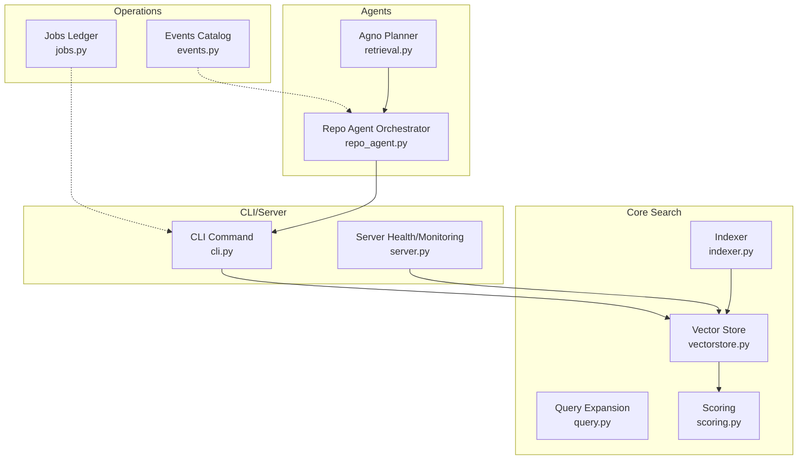
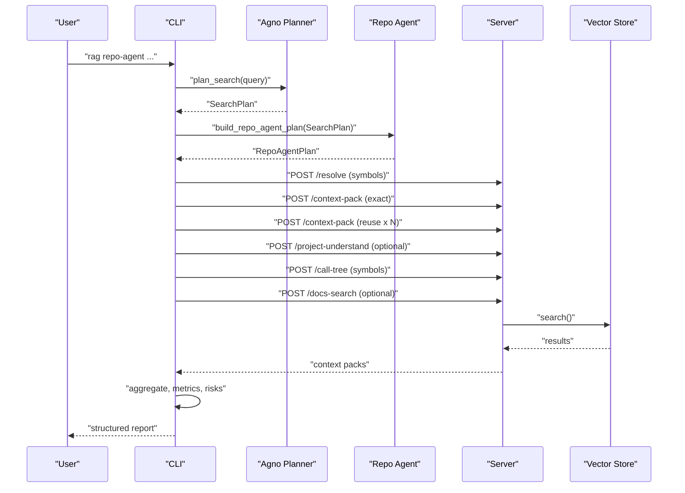
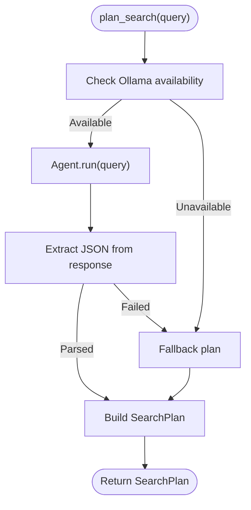
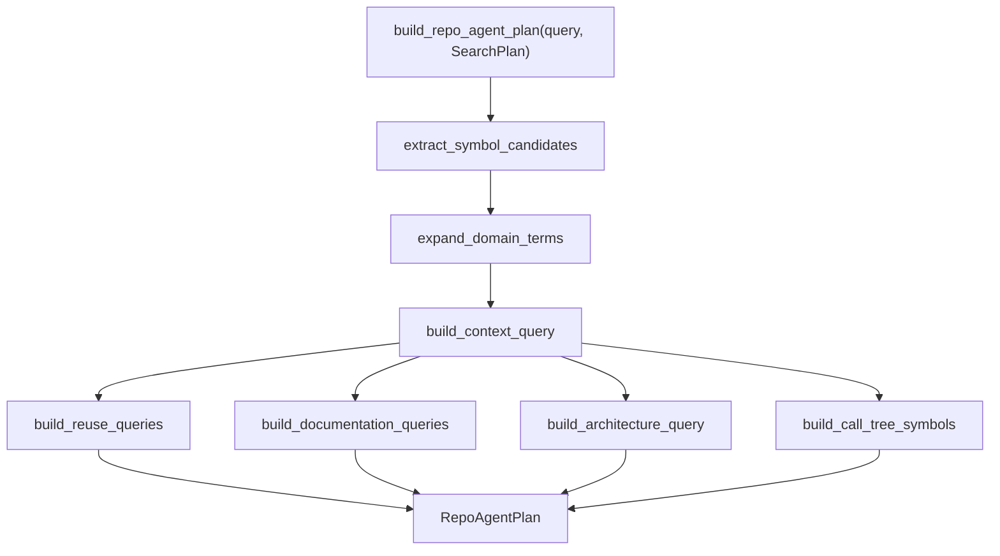
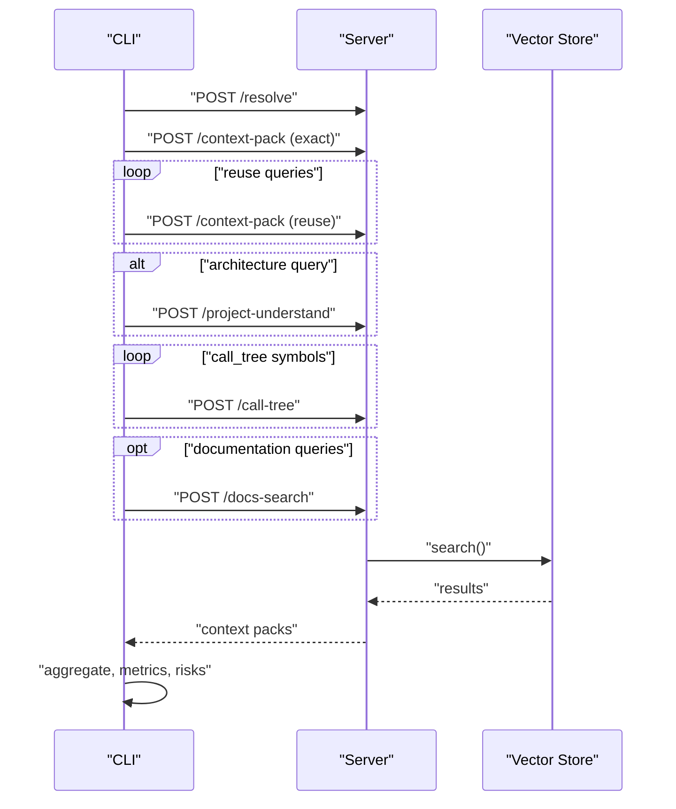
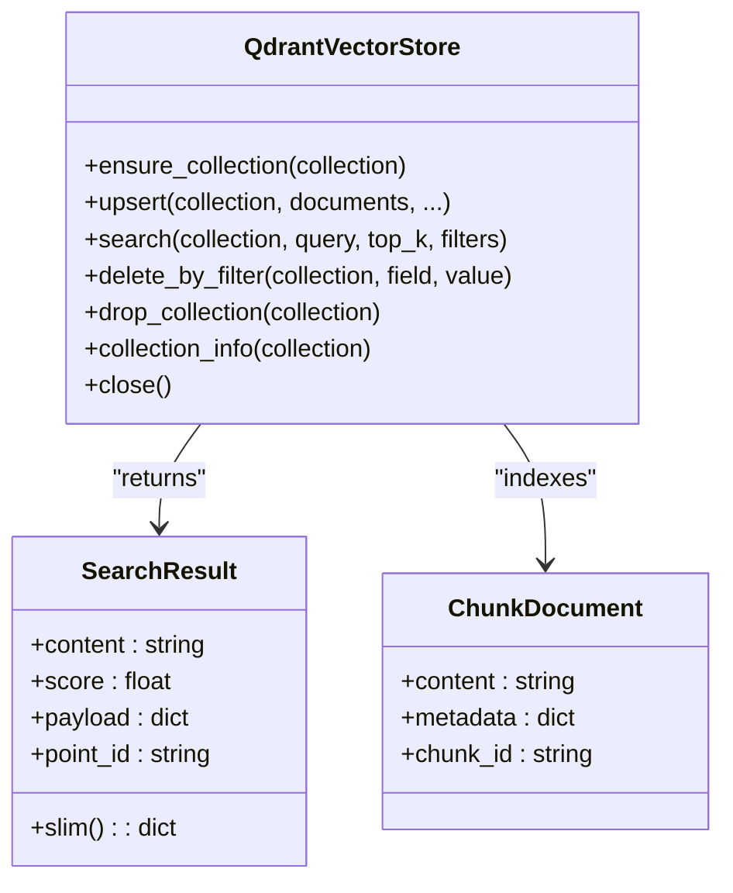
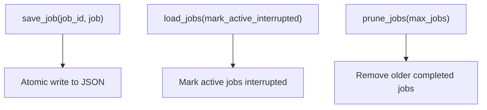
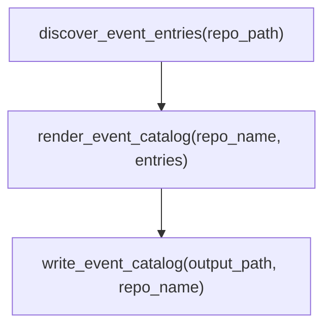
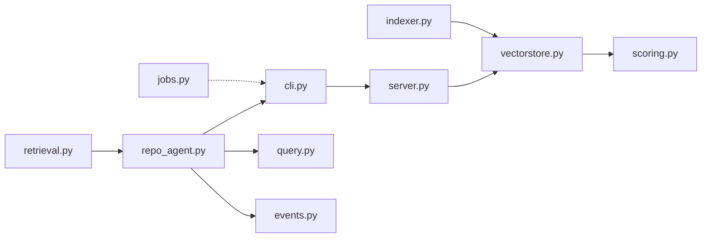

# Agent Orchestration

<cite>
**Referenced Files in This Document**
- [repo_agent.py](file://src/rag/agents/repo_agent.py)
- [retrieval.py](file://src/rag/agents/retrieval.py)
- [query.py](file://src/rag/core/query.py)
- [cli.py](file://src/rag/cli.py)
- [jobs.py](file://src/rag/core/jobs.py)
- [events.py](file://src/rag/core/events.py)
- [scoring.py](file://src/rag/core/scoring.py)
- [indexer.py](file://src/rag/core/indexer.py)
- [vectorstore.py](file://src/rag/core/vectorstore.py)
- [server.py](file://src/rag/server.py)
- [SKILL.md](file://skills/rag-project-enrichment/SKILL.md)
- [test_agent.py](file://tests/test_agent.py)
- [test_repo_agent.py](file://tests/test_repo_agent.py)
- [test_events.py](file://tests/test_events.py)
</cite>

## Table of Contents
1. [Introduction](#introduction)
2. [Project Structure](#project-structure)
3. [Core Components](#core-components)
4. [Architecture Overview](#architecture-overview)
5. [Detailed Component Analysis](#detailed-component-analysis)
6. [Dependency Analysis](#dependency-analysis)
7. [Performance Considerations](#performance-considerations)
8. [Troubleshooting Guide](#troubleshooting-guide)
9. [Conclusion](#conclusion)
10. [Appendices](#appendices)

## Introduction
This document explains agent orchestration for intelligent query planning and multi-agent coordination in the system. It focuses on:
- How the Agno retrieval agent decides search strategies from natural language queries and degrades gracefully when the LLM is unavailable.
- How the Repo agent coordinates retrieval across multiple sources, manages search plans, constructs context packs, and applies fallback heuristics.
- Job scheduling and persistence for background work.
- Asynchronous processing, result aggregation, and evaluation metrics.
- Agent communication patterns, error handling, and fallback mechanisms.
- Practical examples of complex retrieval scenarios, configuration options, and performance optimization.
- Monitoring, debugging, and troubleshooting coordination issues.

## Project Structure
The orchestration spans several modules:
- Agents: Agno planner and Repo agent orchestrators.
- Core search and indexing: query expansion, vector store, scoring, and indexing pipeline.
- CLI and server: synchronous and asynchronous orchestration of multi-source retrieval.
- Jobs: persistent job ledger for daemon-managed background work.
- Events: discovery and rendering of event catalogs for domain-specific retrieval.

**Diagram sources**
- [retrieval.py:203-241](file://src/rag/agents/retrieval.py#L203-L241)
- [repo_agent.py:351-377](file://src/rag/agents/repo_agent.py#L351-L377)
- [query.py:31-52](file://src/rag/core/query.py#L31-L52)
- [vectorstore.py:424-466](file://src/rag/core/vectorstore.py#L424-L466)
- [scoring.py:31-57](file://src/rag/core/scoring.py#L31-L57)
- [indexer.py:242-550](file://src/rag/core/indexer.py#L242-L550)
- [cli.py:557-900](file://src/rag/cli.py#L557-L900)
- [server.py:967-1010](file://src/rag/server.py#L967-L1010)
- [jobs.py:25-55](file://src/rag/core/jobs.py#L25-L55)
- [events.py:35-124](file://src/rag/core/events.py#L35-L124)

**Section sources**
- [retrieval.py:1-304](file://src/rag/agents/retrieval.py#L1-L304)
- [repo_agent.py:1-563](file://src/rag/agents/repo_agent.py#L1-L563)
- [query.py:1-52](file://src/rag/core/query.py#L1-L52)
- [vectorstore.py:1-530](file://src/rag/core/vectorstore.py#L1-L530)
- [scoring.py:1-143](file://src/rag/core/scoring.py#L1-L143)
- [indexer.py:1-740](file://src/rag/core/indexer.py#L1-L740)
- [cli.py:550-900](file://src/rag/cli.py#L550-L900)
- [server.py:967-1010](file://src/rag/server.py#L967-L1010)
- [jobs.py:1-68](file://src/rag/core/jobs.py#L1-L68)
- [events.py:1-124](file://src/rag/core/events.py#L1-L124)

## Core Components
- Agno retrieval agent: Decides search strategy from natural language queries using an LLM. Falls back to query expansion and heuristic strategy selection when the LLM is unavailable.
- Repo agent orchestrator: Builds a deterministic plan from the Agno plan, extracts symbol candidates, expands domain terms, composes context queries, and orchestrates multiple retrieval sources (exact/lexical context packs, reuse checks, documentation/spec queries, architecture understanding, call trees, and optional semantic fallback).
- CLI orchestration: Executes the Repo agent plan, dispatches requests to the server, aggregates results, computes metrics, and prints a structured report.
- Vector store and scoring: Dense vector search with payload filtering and scoring adjustments for recency, pattern relevance, and quality signals.
- Indexer: Incremental git-based indexing with batching, LSP enrichment, and LOD/summaries generation.
- Jobs ledger: Persistent job registry for daemon-managed background work.
- Events catalog: Discovers and renders event catalogs to improve domain-specific retrieval.

**Section sources**
- [retrieval.py:203-304](file://src/rag/agents/retrieval.py#L203-L304)
- [repo_agent.py:167-377](file://src/rag/agents/repo_agent.py#L167-L377)
- [cli.py:557-900](file://src/rag/cli.py#L557-L900)
- [vectorstore.py:424-466](file://src/rag/core/vectorstore.py#L424-L466)
- [scoring.py:31-57](file://src/rag/core/scoring.py#L31-L57)
- [indexer.py:242-550](file://src/rag/core/indexer.py#L242-L550)
- [jobs.py:25-55](file://src/rag/core/jobs.py#L25-L55)
- [events.py:35-124](file://src/rag/core/events.py#L35-L124)

## Architecture Overview
The orchestration follows a layered pattern:
- Planner layer: Agno decides strategy and filters.
- Orchestrator layer: Repo agent composes multi-source retrieval plan.
- Execution layer: CLI invokes server endpoints for AST resolve, context packs, reuse checks, documentation search, architecture understanding, and call trees.
- Storage layer: Vector store and indexing pipeline support dense search and payload filtering.
- Operations layer: Jobs ledger and events catalog support long-running tasks and domain knowledge.

**Diagram sources**
- [cli.py:557-900](file://src/rag/cli.py#L557-L900)
- [retrieval.py:203-241](file://src/rag/agents/retrieval.py#L203-L241)
- [repo_agent.py:351-377](file://src/rag/agents/repo_agent.py#L351-L377)
- [vectorstore.py:424-466](file://src/rag/core/vectorstore.py#L424-L466)

## Detailed Component Analysis

### Agno Retrieval Agent
- Strategy selection: Uses an LLM to produce a JSON plan with queries, filters, strategy, and top_k. Strategy guide includes hierarchical drill-down, hybrid, filtered, graph walk, aggregate, global, and naive.
- Fallback: If Ollama is unreachable or parsing fails, falls back to query decomposition, expansion, and heuristic strategy detection based on query keywords and hints.
- Filter sanitization: Validates enum-like filter values against allowed sets and logs warnings for invalid values.

**Diagram sources**
- [retrieval.py:203-241](file://src/rag/agents/retrieval.py#L203-L241)
- [retrieval.py:243-304](file://src/rag/agents/retrieval.py#L243-L304)

**Section sources**
- [retrieval.py:100-118](file://src/rag/agents/retrieval.py#L100-L118)
- [retrieval.py:121-166](file://src/rag/agents/retrieval.py#L121-L166)
- [retrieval.py:172-201](file://src/rag/agents/retrieval.py#L172-L201)
- [retrieval.py:203-241](file://src/rag/agents/retrieval.py#L203-L241)
- [retrieval.py:243-304](file://src/rag/agents/retrieval.py#L243-L304)

### Repo Agent Orchestrator
- Plan construction: Extracts symbol candidates, expands domain terms, builds context queries, reuse queries, documentation queries, architecture queries, and call-tree symbols.
- Semantic fallback decision: Determines whether to run semantic search based on exact pack density and inclusion reasons.
- Evidence aggregation: Collects top files, tests, modules, disambiguates symbol definitions, infers risks, and computes evaluation metrics.

**Diagram sources**
- [repo_agent.py:351-377](file://src/rag/agents/repo_agent.py#L351-L377)
- [repo_agent.py:194-348](file://src/rag/agents/repo_agent.py#L194-L348)

**Section sources**
- [repo_agent.py:167-192](file://src/rag/agents/repo_agent.py#L167-L192)
- [repo_agent.py:194-348](file://src/rag/agents/repo_agent.py#L194-L348)
- [repo_agent.py:351-377](file://src/rag/agents/repo_agent.py#L351-L377)
- [repo_agent.py:380-394](file://src/rag/agents/repo_agent.py#L380-L394)
- [repo_agent.py:418-466](file://src/rag/agents/repo_agent.py#L418-L466)
- [repo_agent.py:469-488](file://src/rag/agents/repo_agent.py#L469-L488)
- [repo_agent.py:491-505](file://src/rag/agents/repo_agent.py#L491-L505)
- [repo_agent.py:508-521](file://src/rag/agents/repo_agent.py#L508-L521)
- [repo_agent.py:524-562](file://src/rag/agents/repo_agent.py#L524-L562)

### CLI Orchestration and Result Aggregation
- Executes the planner and orchestrator, then dispatches multiple server requests:
  - Resolve symbols
  - Exact context pack
  - Reuse context packs
  - Architecture understanding (optional)
  - Call trees (optional)
  - Documentation/spec search (optional)
- Aggregates results into an evidence bundle, computes metrics, and prints a structured report.

**Diagram sources**
- [cli.py:557-900](file://src/rag/cli.py#L557-L900)

**Section sources**
- [cli.py:557-900](file://src/rag/cli.py#L557-L900)

### Vector Store and Scoring
- Dense vector search with payload filtering and scoring adjustments for recency, pattern relevance, and code quality signals.
- Indexer supports incremental git-based indexing, batching, LSP enrichment, LOD/summaries, and crash-consistent state management.

**Diagram sources**
- [vectorstore.py:199-530](file://src/rag/core/vectorstore.py#L199-L530)

**Section sources**
- [vectorstore.py:424-466](file://src/rag/core/vectorstore.py#L424-L466)
- [scoring.py:31-57](file://src/rag/core/scoring.py#L31-L57)
- [indexer.py:242-550](file://src/rag/core/indexer.py#L242-L550)

### Jobs Ledger and Persistence
- Persistent job registry for daemon-managed background work with atomic save, load with interruption marking, and pruning.

**Diagram sources**
- [jobs.py:25-68](file://src/rag/core/jobs.py#L25-L68)

**Section sources**
- [jobs.py:1-68](file://src/rag/core/jobs.py#L1-L68)

### Events Catalog and Domain Knowledge
- Discovers event constants and analytics/tracking methods, renders a catalog for documentation indexing, and improves domain-specific retrieval.

**Diagram sources**
- [events.py:35-124](file://src/rag/core/events.py#L35-L124)

**Section sources**
- [events.py:35-124](file://src/rag/core/events.py#L35-L124)
- [SKILL.md:36-80](file://skills/rag-project-enrichment/SKILL.md#L36-L80)

## Dependency Analysis
- Planner depends on settings and HTTP client to check Ollama availability and initialize the agent.
- Repo agent depends on the planner’s SearchPlan and uses query expansion utilities.
- CLI depends on both agents and orchestrates server endpoints.
- Vector store depends on the embedder and Qdrant client; scoring adjusts results without changing plan shape.
- Indexer depends on chunker, LSP enrichment, and graph/summaries modules.

**Diagram sources**
- [retrieval.py:100-166](file://src/rag/agents/retrieval.py#L100-L166)
- [repo_agent.py:15-16](file://src/rag/agents/repo_agent.py#L15-L16)
- [cli.py:557-900](file://src/rag/cli.py#L557-L900)
- [vectorstore.py:199-530](file://src/rag/core/vectorstore.py#L199-L530)
- [scoring.py:31-57](file://src/rag/core/scoring.py#L31-L57)
- [indexer.py:242-550](file://src/rag/core/indexer.py#L242-L550)
- [query.py:31-52](file://src/rag/core/query.py#L31-L52)
- [events.py:35-124](file://src/rag/core/events.py#L35-L124)
- [jobs.py:25-55](file://src/rag/core/jobs.py#L25-L55)

**Section sources**
- [retrieval.py:100-166](file://src/rag/agents/retrieval.py#L100-L166)
- [repo_agent.py:15-16](file://src/rag/agents/repo_agent.py#L15-L16)
- [cli.py:557-900](file://src/rag/cli.py#L557-L900)
- [vectorstore.py:199-530](file://src/rag/core/vectorstore.py#L199-L530)
- [scoring.py:31-57](file://src/rag/core/scoring.py#L31-L57)
- [indexer.py:242-550](file://src/rag/core/indexer.py#L242-L550)
- [query.py:31-52](file://src/rag/core/query.py#L31-L52)
- [events.py:35-124](file://src/rag/core/events.py#L35-L124)
- [jobs.py:25-55](file://src/rag/core/jobs.py#L25-L55)

## Performance Considerations
- Asynchronous processing: Planner and CLI orchestration leverage async I/O and batched upserts to minimize latency.
- Payload filtering: Filters are applied server-side to avoid post-filtering recall loss and reduce result set size early.
- Embedding caching: Reuse cached embeddings to avoid redundant computation during upserts.
- Incremental indexing: Git-based change detection and staged hash promotion ensure crash-consistency and faster updates.
- Scoring adjustments: Recency, pattern relevance, and quality signals improve result ranking without reranking overhead.
- Batch sizing: Vector store upsert batches align with embedder sub-batches to optimize throughput.

[No sources needed since this section provides general guidance]

## Troubleshooting Guide
Common issues and resolutions:
- Planner fails to parse JSON or LLM unavailable:
  - The planner falls back to query expansion and heuristic strategy selection. Verify query keywords and filters.
  - Check Ollama availability and model tags via server health endpoint.
- HTTP connection errors to daemon:
  - CLI catches connection errors and exits with a clear message. Ensure the daemon is reachable and authenticated.
- Empty or irrelevant documentation context:
  - The CLI continues without docs collection. Generate and index documentation to improve domain coverage.
- Ambiguous symbol definitions:
  - Use the evidence bundle’s symbol ambiguities to disambiguate and select the correct definition.
- Missing tests or module boundaries:
  - The risk inference highlights missing tests and module-boundary concerns; adjust the plan accordingly.

**Section sources**
- [retrieval.py:203-241](file://src/rag/agents/retrieval.py#L203-L241)
- [cli.py:701-712](file://src/rag/cli.py#L701-L712)
- [server.py:1086-1117](file://src/rag/server.py#L1086-L1117)
- [repo_agent.py:508-521](file://src/rag/agents/repo_agent.py#L508-L521)

## Conclusion
The system combines an LLM-driven Agno planner with a deterministic Repo agent orchestrator to coordinate multi-source retrieval. It leverages vector search with payload filtering, scoring adjustments, and incremental indexing to deliver precise, efficient results. The CLI orchestrates heterogeneous sources, aggregates outcomes, and provides structured reporting with metrics and risk inference. Robust fallbacks, error handling, and monitoring enable reliable operation across diverse environments.

[No sources needed since this section summarizes without analyzing specific files]

## Appendices

### Practical Examples of Complex Retrieval Scenarios
- Analytics event addition:
  - The Repo agent detects domain terms and composes reuse and documentation queries to suggest existing patterns before adding new ones.
- Module boundary refactor:
  - Architecture-aware queries and call trees help identify boundary violations and guide refactoring decisions.
- Domain glossary and catalog creation:
  - Events catalog discovery and rendering improve retrieval for product-specific terminology.

**Section sources**
- [repo_agent.py:240-311](file://src/rag/agents/repo_agent.py#L240-L311)
- [events.py:35-124](file://src/rag/core/events.py#L35-L124)
- [SKILL.md:36-80](file://skills/rag-project-enrichment/SKILL.md#L36-L80)

### Agent Configuration Options
- Repo agent options:
  - max_slices, max_source_tokens, definitions_limit, usages_limit, min_exact_slices, allow_semantic_fallback.
- Planner options:
  - Strategy selection, query expansion, filter sanitization, and fallback behavior.
- CLI options:
  - Control semantic fallback, reuse queries, documentation queries, architecture queries, and call-tree symbols.

**Section sources**
- [repo_agent.py:167-177](file://src/rag/agents/repo_agent.py#L167-L177)
- [retrieval.py:243-304](file://src/rag/agents/retrieval.py#L243-L304)
- [cli.py:557-900](file://src/rag/cli.py#L557-L900)

### Monitoring, Debugging, and Testing
- Health and statistics:
  - Server exposes health details and query statistics for latency and throughput monitoring.
- Tests:
  - Fallback detection for language, patterns, complexity, and strategies; symbol extraction and plan building validations.

**Section sources**
- [server.py:967-1010](file://src/rag/server.py#L967-L1010)
- [server.py:1086-1117](file://src/rag/server.py#L1086-L1117)
- [test_agent.py:12-47](file://tests/test_agent.py#L12-L47)
- [test_repo_agent.py:20-92](file://tests/test_repo_agent.py#L20-L92)
- [test_events.py:6-41](file://tests/test_events.py#L6-L41)