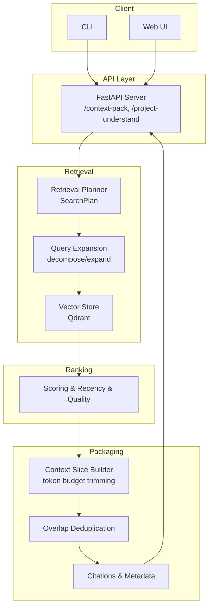
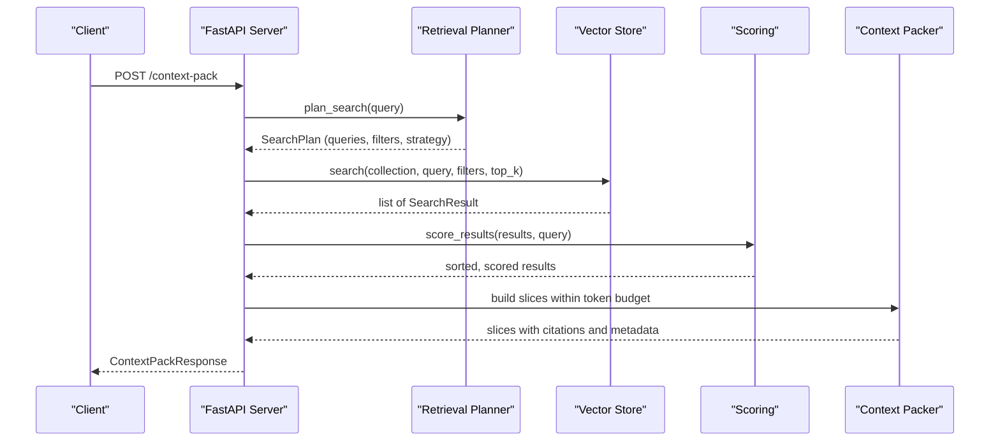
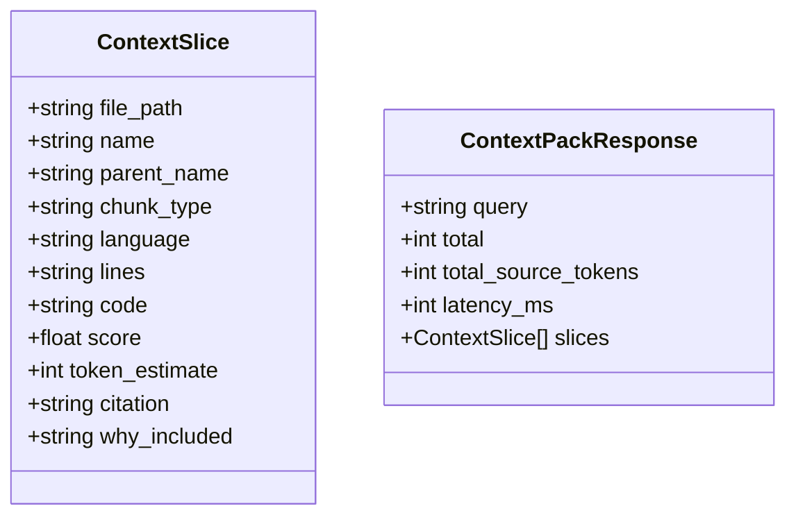

# Context Pack Construction and Packaging

<cite>
**Referenced Files in This Document**
- [server.py](file://src/rag/server.py)
- [cli.py](file://src/rag/cli.py)
- [scoring.py](file://src/rag/core/scoring.py)
- [vectorstore.py](file://src/rag/core/vectorstore.py)
- [indexer.py](file://src/rag/core/indexer.py)
- [retrieval.py](file://src/rag/agents/retrieval.py)
- [query.py](file://src/rag/core/query.py)
- [codex_rag_precision_improvement_plan.md](file://docs/codex_rag_precision_improvement_plan.md)
- [db.py](file://src/rag/storage/db.py)
</cite>

## Table of Contents
1. [Introduction](#introduction)
2. [Project Structure](#project-structure)
3. [Core Components](#core-components)
4. [Architecture Overview](#architecture-overview)
5. [Detailed Component Analysis](#detailed-component-analysis)
6. [Dependency Analysis](#dependency-analysis)
7. [Performance Considerations](#performance-considerations)
8. [Troubleshooting Guide](#troubleshooting-guide)
9. [Conclusion](#conclusion)
10. [Appendices](#appendices)

## Introduction
This document explains how the system constructs context packs and packages results for client consumption. It covers how retrieved results are aggregated, ranked, and packaged; how the context window and token budget are managed; how content filtering and deduplication are applied; and how relevance scoring and prioritization work. It also documents packaging formats, metadata inclusion, client-specific adaptations, error handling for incomplete results, timeout management, fallback strategies, and practical guidance for debugging, monitoring, and optimizing context delivery performance.

## Project Structure
The context pack pipeline spans several modules:
- Retrieval planning and query expansion
- Vector search and result shaping
- Scoring and ranking adjustments
- Context slicing and token budget enforcement
- Packaging and client adaptation

**Diagram sources**
- [server.py:2008-2118](file://src/rag/server.py#L2008-L2118)
- [retrieval.py:203-303](file://src/rag/agents/retrieval.py#L203-L303)
- [query.py:31-52](file://src/rag/core/query.py#L31-L52)
- [vectorstore.py:424-465](file://src/rag/core/vectorstore.py#L424-L465)
- [scoring.py:31-57](file://src/rag/core/scoring.py#L31-L57)

**Section sources**
- [server.py:2008-2118](file://src/rag/server.py#L2008-L2118)
- [retrieval.py:203-303](file://src/rag/agents/retrieval.py#L203-L303)
- [query.py:31-52](file://src/rag/core/query.py#L31-L52)
- [vectorstore.py:424-465](file://src/rag/core/vectorstore.py#L424-L465)
- [scoring.py:31-57](file://src/rag/core/scoring.py#L31-L57)

## Core Components
- Retrieval planner decides search strategy and filters, and expands queries.
- Vector store performs dense semantic search with server-side filtering.
- Scoring adjusts base scores by recency, pattern relevance, and quality signals.
- Context pack builder trims code to token budget, deduplicates overlapping slices, and builds citations.
- Packaging formats include metadata such as file path, symbol, lines, token estimate, and why-included rationale.

Key implementation references:
- Context pack endpoint and slicing logic: [server.py:2008-2118](file://src/rag/server.py#L2008-L2118)
- Retrieval planning and fallbacks: [retrieval.py:203-303](file://src/rag/agents/retrieval.py#L203-L303)
- Query expansion/decomposition: [query.py:31-52](file://src/rag/core/query.py#L31-L52)
- Vector search and result shape: [vectorstore.py:424-465](file://src/rag/core/vectorstore.py#L424-L465)
- Scoring adjustments: [scoring.py:31-57](file://src/rag/core/scoring.py#L31-L57)

**Section sources**
- [server.py:2008-2118](file://src/rag/server.py#L2008-L2118)
- [retrieval.py:203-303](file://src/rag/agents/retrieval.py#L203-L303)
- [query.py:31-52](file://src/rag/core/query.py#L31-L52)
- [vectorstore.py:424-465](file://src/rag/core/vectorstore.py#L424-L465)
- [scoring.py:31-57](file://src/rag/core/scoring.py#L31-L57)

## Architecture Overview
The context pack pipeline integrates retrieval, ranking, and packaging into a cohesive flow:

**Diagram sources**
- [server.py:2008-2118](file://src/rag/server.py#L2008-L2118)
- [retrieval.py:203-303](file://src/rag/agents/retrieval.py#L203-L303)
- [vectorstore.py:424-465](file://src/rag/core/vectorstore.py#L424-L465)
- [scoring.py:31-57](file://src/rag/core/scoring.py#L31-L57)

## Detailed Component Analysis

### Retrieval Planning and Query Expansion
- The planner decides strategy and filters, and expands/decouples queries.
- Fallback logic detects Ollama availability and degrades to simple query expansion and heuristic filters.
- Filters are sanitized against allowed values to prevent invalid queries.

Key references:
- Plan decision and fallback: [retrieval.py:203-303](file://src/rag/agents/retrieval.py#L203-L303)
- Filter sanitization: [retrieval.py:40-82](file://src/rag/agents/retrieval.py#L40-L82)
- Query expansion/decomposition: [query.py:31-52](file://src/rag/core/query.py#L31-L52)

**Section sources**
- [retrieval.py:203-303](file://src/rag/agents/retrieval.py#L203-L303)
- [query.py:31-52](file://src/rag/core/query.py#L31-L52)

### Vector Search and Result Shaping
- Dense vector search with server-side filtering to avoid post-filtering recall loss.
- Results are shaped into a common structure with content, score, payload, and point id.
- Citations are generated from payload metadata.

Key references:
- Search and result shaping: [vectorstore.py:424-465](file://src/rag/core/vectorstore.py#L424-L465)
- Citation generation: [vectorstore.py:99-107](file://src/rag/core/vectorstore.py#L99-L107)

**Section sources**
- [vectorstore.py:424-465](file://src/rag/core/vectorstore.py#L424-L465)
- [vectorstore.py:99-107](file://src/rag/core/vectorstore.py#L99-L107)

### Scoring, Ranking, and Relevance Adjustment
- Base scores are adjusted by recency, pattern relevance, and code quality signals.
- The scoring function preserves externally reranked results when requested.
- Sorting is descending by adjusted score.

Key references:
- Scoring and sorting: [scoring.py:31-57](file://src/rag/core/scoring.py#L31-L57)
- Recency boost: [scoring.py:60-77](file://src/rag/core/scoring.py#L60-L77)
- Pattern boost: [scoring.py:80-97](file://src/rag/core/scoring.py#L80-L97)
- Quality adjustment: [scoring.py:117-142](file://src/rag/core/scoring.py#L117-L142)

**Section sources**
- [scoring.py:31-57](file://src/rag/core/scoring.py#L31-L57)
- [scoring.py:60-77](file://src/rag/core/scoring.py#L60-L77)
- [scoring.py:80-97](file://src/rag/core/scoring.py#L80-L97)
- [scoring.py:117-142](file://src/rag/core/scoring.py#L117-L142)

### Context Slice Building and Token Budget Management
- Each candidate is trimmed to fit the remaining token budget.
- Slices are accumulated until either max slices or max source tokens is reached.
- Overlapping slices are skipped to reduce redundancy.

Key references:
- Slice building and budget trimming: [server.py:515-535](file://src/rag/server.py#L515-L535)
- Candidate sorting and accumulation: [server.py:2104-2118](file://src/rag/server.py#L2104-L2118)

**Section sources**
- [server.py:515-535](file://src/rag/server.py#L515-L535)
- [server.py:2104-2118](file://src/rag/server.py#L2104-L2118)

### Deduplication and Overlap Handling
- Overlapping candidates are skipped during accumulation to avoid redundant context.
- This reduces token waste and improves signal-to-noise.

Key references:
- Overlap check and skip: [server.py:2111-2112](file://src/rag/server.py#L2111-L2112)

**Section sources**
- [server.py:2111-2112](file://src/rag/server.py#L2111-L2112)

### Packaging Formats and Metadata
- Each slice includes file path, symbol, parent symbol, chunk type, language, line range, code, score, token estimate, citation, and rationale for inclusion.
- The response aggregates slices and total source tokens, and exposes latency.

Key references:
- Slice construction and metadata: [server.py:515-535](file://src/rag/server.py#L515-L535)
- Response composition: [server.py:2008-2118](file://src/rag/server.py#L2008-L2118)

**Section sources**
- [server.py:515-535](file://src/rag/server.py#L515-L535)
- [server.py:2008-2118](file://src/rag/server.py#L2008-L2118)

### Client-Specific Adaptations and Timeout Management
- CLI orchestrates multiple context packs (exact, reuse, architecture) with tailored budgets and timeouts.
- Semantic fallback is conditionally enabled when exact pack lacks sufficient relevant slices.

Key references:
- Exact and reuse packs with budgets: [cli.py:608-634](file://src/rag/cli.py#L608-L634)
- Semantic fallback usage: [cli.py:680-700](file://src/rag/cli.py#L680-L700)
- Budget guidance for tasks: [codex_rag_precision_improvement_plan.md:183-189](file://docs/codex_rag_precision_improvement_plan.md#L183-L189)

**Section sources**
- [cli.py:608-634](file://src/rag/cli.py#L608-L634)
- [cli.py:680-700](file://src/rag/cli.py#L680-L700)
- [codex_rag_precision_improvement_plan.md:183-189](file://docs/codex_rag_precision_improvement_plan.md#L183-L189)

### Error Handling, Incomplete Results, and Fallback Strategies
- If semantic fallback is used, the system records whether semantic matches were included.
- The planner logs and falls back to simple strategies when LLM is unavailable.
- Vector store upsert guards against dimension mismatches and missing embeddings.

Key references:
- Semantic fallback decision and usage: [cli.py:680-700](file://src/rag/cli.py#L680-L700)
- Planner fallback and warnings: [retrieval.py:208-240](file://src/rag/agents/retrieval.py#L208-L240)
- Uplsert safety checks: [vectorstore.py:376-391](file://src/rag/core/vectorstore.py#L376-L391)

**Section sources**
- [cli.py:680-700](file://src/rag/cli.py#L680-L700)
- [retrieval.py:208-240](file://src/rag/agents/retrieval.py#L208-L240)
- [vectorstore.py:376-391](file://src/rag/core/vectorstore.py#L376-L391)

### Complex Context Construction Scenarios
- Exact function patch: prioritize function bodies and focused tests under a token budget.
- Test trace: include failing test plus production function chain.
- Refactor: include target function, duplicates, callers, and relevant tests.
- Architecture: include interfaces/classes and call edges.

References:
- Budget guidance: [codex_rag_precision_improvement_plan.md:183-189](file://docs/codex_rag_precision_improvement_plan.md#L183-L189)
- Slice metadata expectations: [codex_rag_precision_improvement_plan.md:191-199](file://docs/codex_rag_precision_improvement_plan.md#L191-L199)

**Section sources**
- [codex_rag_precision_improvement_plan.md:183-189](file://docs/codex_rag_precision_improvement_plan.md#L183-L189)
- [codex_rag_precision_improvement_plan.md:191-199](file://docs/codex_rag_precision_improvement_plan.md#L191-L199)

### Performance Optimization Techniques
- Use server-side filtering to preserve recall and avoid post-filtering overhead.
- Batch upserts and leverage embedding cache to reduce compute.
- Prefer exact or filtered strategies for constrained budgets; reserve hybrid/graph_walk for deeper exploration.
- Monitor per-stage timings exposed by indexing and upsert flows.

References:
- Server-side filtering: [vectorstore.py:445-453](file://src/rag/core/vectorstore.py#L445-L453)
- Uplsert batching and cache: [indexer.py:379-422](file://src/rag/core/indexer.py#L379-L422)
- Timings exposure: [indexer.py:280-283](file://src/rag/core/indexer.py#L280-L283)

**Section sources**
- [vectorstore.py:445-453](file://src/rag/core/vectorstore.py#L445-L453)
- [indexer.py:379-422](file://src/rag/core/indexer.py#L379-L422)
- [indexer.py:280-283](file://src/rag/core/indexer.py#L280-L283)

### Quality Assurance Measures
- Evaluate context precision as relevant source tokens divided by total source tokens.
- Track first relevant file/symbol rank, recall, number of unnecessary files, and latency.
- Use evaluation harness tasks to measure downstream quality.

References:
- Metrics and harness: [codex_rag_precision_improvement_plan.md:200-225](file://docs/codex_rag_precision_improvement_plan.md#L200-L225)

**Section sources**
- [codex_rag_precision_improvement_plan.md:200-225](file://docs/codex_rag_precision_improvement_plan.md#L200-L225)

## Dependency Analysis
The context pack pipeline depends on retrieval planning, vector search, scoring, and packaging. Cohesion is strong within each stage; coupling is primarily through shared data structures (SearchResult, ContextSlice) and the server’s orchestration.

**Diagram sources**
- [server.py:2008-2118](file://src/rag/server.py#L2008-L2118)
- [retrieval.py:203-303](file://src/rag/agents/retrieval.py#L203-L303)
- [vectorstore.py:424-465](file://src/rag/core/vectorstore.py#L424-L465)
- [scoring.py:31-57](file://src/rag/core/scoring.py#L31-L57)

**Section sources**
- [server.py:2008-2118](file://src/rag/server.py#L2008-L2118)
- [retrieval.py:203-303](file://src/rag/agents/retrieval.py#L203-L303)
- [vectorstore.py:424-465](file://src/rag/core/vectorstore.py#L424-L465)
- [scoring.py:31-57](file://src/rag/core/scoring.py#L31-L57)

## Performance Considerations
- Keep top_k proportional to budget to reduce downstream trimming.
- Prefer filtered or exact strategies for constrained contexts; reserve hybrid/graph_walk for broader exploration.
- Monitor per-stage timings (collection ensure, cache lookup, embed, upsert, point build) to identify bottlenecks.
- Ensure payload indexes are created once to accelerate filter queries.

[No sources needed since this section provides general guidance]

## Troubleshooting Guide
Common issues and remedies:
- Empty or low-quality slices:
  - Verify token budget and overlap deduplication thresholds.
  - Confirm semantic fallback usage when exact pack is insufficient.
- Missing or mismatched embeddings:
  - Check dimension guard and embedding cache hits.
- Slow or failing LLM planner:
  - Inspect fallback logic and warnings; confirm Ollama availability.
- Post-filtering recall drops:
  - Use server-side filtering to avoid post-filtering.

References:
- Token budget trimming and overlap checks: [server.py:515-535](file://src/rag/server.py#L515-L535), [server.py:2111-2112](file://src/rag/server.py#L2111-L2112)
- Semantic fallback: [cli.py:680-700](file://src/rag/cli.py#L680-L700)
- Embedding dimension guard: [vectorstore.py:376-391](file://src/rag/core/vectorstore.py#L376-L391)
- Planner fallback and warnings: [retrieval.py:208-240](file://src/rag/agents/retrieval.py#L208-L240)

**Section sources**
- [server.py:515-535](file://src/rag/server.py#L515-L535)
- [server.py:2111-2112](file://src/rag/server.py#L2111-L2112)
- [cli.py:680-700](file://src/rag/cli.py#L680-L700)
- [vectorstore.py:376-391](file://src/rag/core/vectorstore.py#L376-L391)
- [retrieval.py:208-240](file://src/rag/agents/retrieval.py#L208-L240)

## Conclusion
The context pack pipeline combines retrieval planning, dense vector search, relevance scoring, and strict token budgeting to deliver concise, high-quality context. Deduplication and citation metadata improve signal-to-noise, while client-specific adaptations and fallback strategies ensure robustness. Monitoring and evaluation enable continuous improvement of precision and latency.

[No sources needed since this section summarizes without analyzing specific files]

## Appendices

### Packaging Data Model

**Diagram sources**
- [server.py:515-535](file://src/rag/server.py#L515-L535)
- [server.py:2008-2118](file://src/rag/server.py#L2008-L2118)