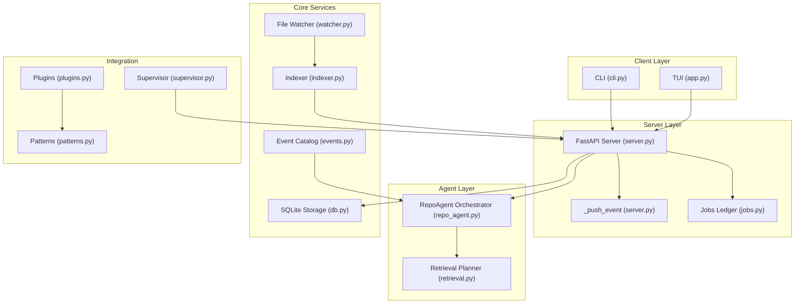
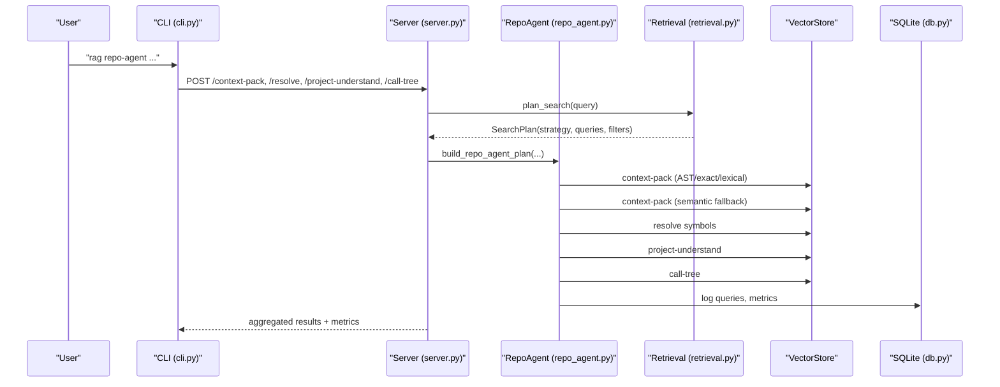
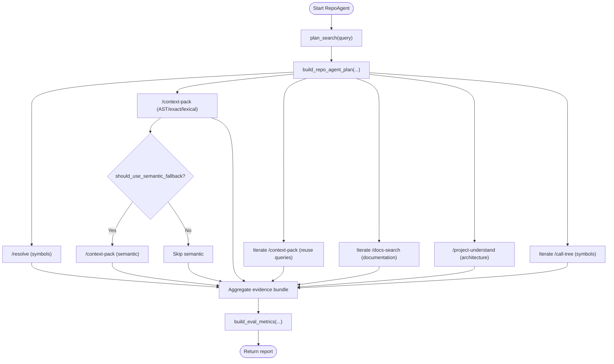
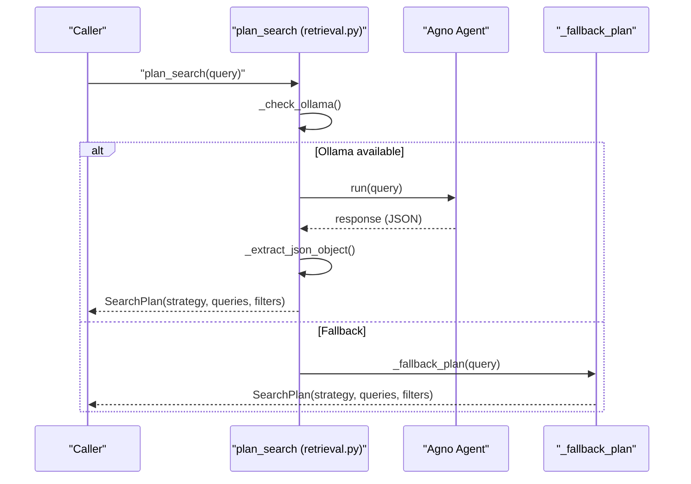
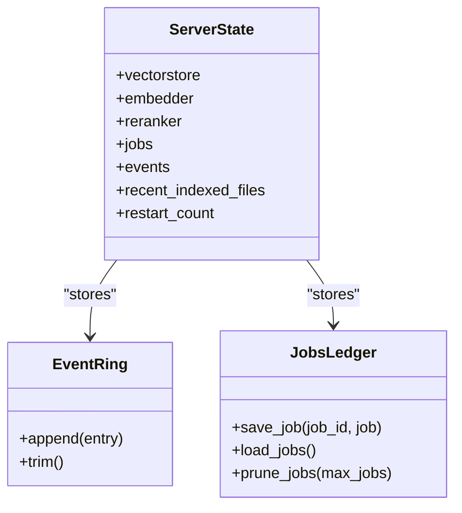
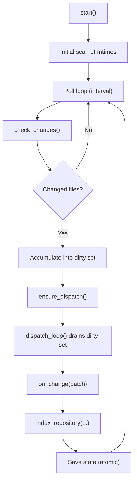
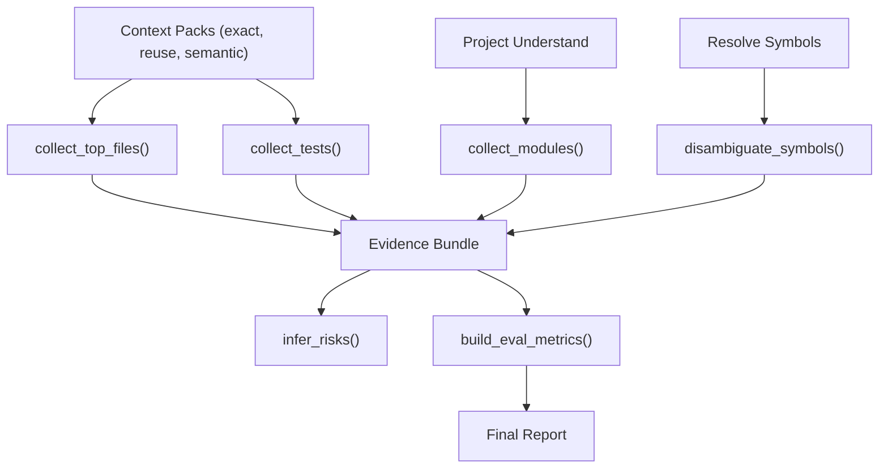
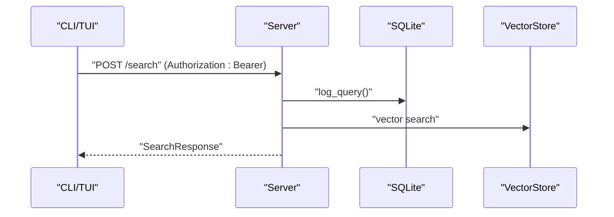
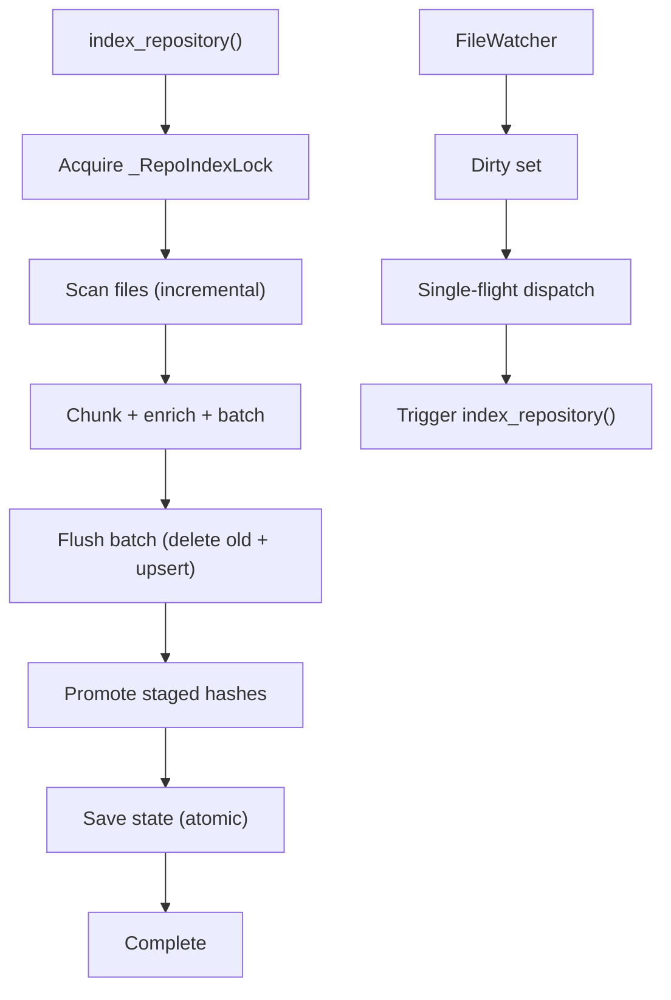
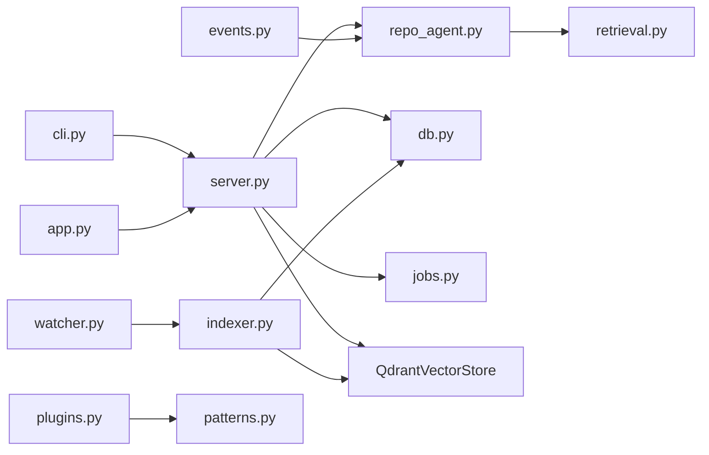

# Multi-Agent Coordination and Communication

<cite>
**Referenced Files in This Document**
- [repo_agent.py](file://src/rag/agents/repo_agent.py)
- [retrieval.py](file://src/rag/agents/retrieval.py)
- [server.py](file://src/rag/server.py)
- [cli.py](file://src/rag/cli.py)
- [indexer.py](file://src/rag/core/indexer.py)
- [watcher.py](file://src/rag/core/watcher.py)
- [db.py](file://src/rag/storage/db.py)
- [supervisor.py](file://src/rag/integration/supervisor.py)
- [app.py](file://src/rag/app.py)
- [jobs.py](file://src/rag/core/jobs.py)
- [patterns.py](file://src/rag/core/patterns.py)
- [plugins.py](file://src/rag/core/plugins.py)
- [events.py](file://src/rag/core/events.py)
- [test_repo_agent.py](file://tests/test_repo_agent.py)
</cite>

## Table of Contents
1. [Introduction](#introduction)
2. [Project Structure](#project-structure)
3. [Core Components](#core-components)
4. [Architecture Overview](#architecture-overview)
5. [Detailed Component Analysis](#detailed-component-analysis)
6. [Dependency Analysis](#dependency-analysis)
7. [Performance Considerations](#performance-considerations)
8. [Troubleshooting Guide](#troubleshooting-guide)
9. [Conclusion](#conclusion)
10. [Appendices](#appendices)

## Introduction
This document explains multi-agent coordination and communication patterns in the RAG system, focusing on how the RepoAgent orchestrates parallel retrieval operations across multiple sources and agents. It covers agent communication protocols, message passing mechanisms, state synchronization, job scheduling, resource allocation, conflict resolution, event-driven coordination, asynchronous processing, result aggregation, lifecycle management, health monitoring, failure recovery, debugging, monitoring, and scaling strategies.

## Project Structure
The system is organized around a FastAPI server that exposes retrieval APIs, a CLI and TUI for user interaction, and background workers for indexing and file watching. Agents encapsulate planning and retrieval orchestration, while storage and caching layers persist state and coordinate resource usage.

**Diagram sources**
- [server.py:603-716](file://src/rag/server.py#L603-L716)
- [cli.py:530-800](file://src/rag/cli.py#L530-L800)
- [app.py:156-800](file://src/rag/app.py#L156-L800)
- [repo_agent.py:351-377](file://src/rag/agents/repo_agent.py#L351-L377)
- [retrieval.py:203-241](file://src/rag/agents/retrieval.py#L203-L241)
- [indexer.py:242-550](file://src/rag/core/indexer.py#L242-L550)
- [watcher.py:18-184](file://src/rag/core/watcher.py#L18-L184)
- [db.py:40-82](file://src/rag/storage/db.py#L40-L82)
- [jobs.py:25-55](file://src/rag/core/jobs.py#L25-L55)
- [events.py:35-124](file://src/rag/core/events.py#L35-L124)
- [supervisor.py:46-153](file://src/rag/integration/supervisor.py#L46-L153)
- [plugins.py:28-123](file://src/rag/core/plugins.py#L28-L123)
- [patterns.py:15-42](file://src/rag/core/patterns.py#L15-L42)

**Section sources**
- [server.py:603-716](file://src/rag/server.py#L603-L716)
- [cli.py:530-800](file://src/rag/cli.py#L530-L800)
- [app.py:156-800](file://src/rag/app.py#L156-L800)

## Core Components
- RepoAgent orchestrator: Builds deterministic retrieval plans, coordinates parallel context-pack retrievals, and aggregates results.
- Retrieval planner: Decides search strategy and filters using a local LLM agent with graceful fallback.
- Server: Exposes HTTP endpoints, manages shared state, and coordinates background tasks.
- CLI/TUI: Provide user-facing entry points and dashboards.
- Indexer and Watcher: Handle incremental indexing and file change detection.
- Storage: SQLite-backed logging, rate limiting, and exact/lexical code index.
- Jobs ledger: Persistent job registry for daemon-managed background work.
- Event catalog: Generates domain-specific event catalogs for product-language-to-code mapping.
- Supervisor: OS-level service integration for daemon supervision.

**Section sources**
- [repo_agent.py:167-377](file://src/rag/agents/repo_agent.py#L167-L377)
- [retrieval.py:85-241](file://src/rag/agents/retrieval.py#L85-L241)
- [server.py:410-716](file://src/rag/server.py#L410-L716)
- [cli.py:530-800](file://src/rag/cli.py#L530-L800)
- [app.py:156-800](file://src/rag/app.py#L156-L800)
- [indexer.py:242-550](file://src/rag/core/indexer.py#L242-L550)
- [watcher.py:18-184](file://src/rag/core/watcher.py#L18-L184)
- [db.py:40-82](file://src/rag/storage/db.py#L40-L82)
- [jobs.py:25-55](file://src/rag/core/jobs.py#L25-L55)
- [events.py:35-124](file://src/rag/core/events.py#L35-L124)
- [supervisor.py:46-153](file://src/rag/integration/supervisor.py#L46-L153)

## Architecture Overview
The system follows a client-server architecture with agent-driven retrieval orchestration and event-driven background processing. Clients (CLI/TUI) send HTTP requests to the server, which delegates to agents and services. Background tasks (indexing, watching, warm probes) run asynchronously and update shared state.

**Diagram sources**
- [cli.py:530-800](file://src/rag/cli.py#L530-L800)
- [server.py:410-716](file://src/rag/server.py#L410-L716)
- [repo_agent.py:351-377](file://src/rag/agents/repo_agent.py#L351-L377)
- [retrieval.py:203-241](file://src/rag/agents/retrieval.py#L203-L241)
- [db.py:528-553](file://src/rag/storage/db.py#L528-L553)

## Detailed Component Analysis

### RepoAgent Orchestration
The RepoAgent builds a deterministic plan from the retrieval planner and orchestrates parallel retrievals:
- Extract symbol candidates and expand domain terms
- Build context queries and reuse/documentation/architecture queries
- Coordinate resolve, context-pack (AST/exact/lexical), semantic fallback, project-understand, call-tree, and docs-search
- Aggregate results and compute evaluation metrics

**Diagram sources**
- [repo_agent.py:351-377](file://src/rag/agents/repo_agent.py#L351-L377)
- [repo_agent.py:532-800](file://src/rag/agents/repo_agent.py#L532-L800)
- [retrieval.py:203-241](file://src/rag/agents/retrieval.py#L203-L241)
- [cli.py:530-800](file://src/rag/cli.py#L530-L800)

**Section sources**
- [repo_agent.py:167-377](file://src/rag/agents/repo_agent.py#L167-L377)
- [repo_agent.py:532-800](file://src/rag/agents/repo_agent.py#L532-L800)
- [test_repo_agent.py:19-205](file://tests/test_repo_agent.py#L19-L205)

### Retrieval Planner and Strategy Selection
The retrieval planner decides strategy and filters using a local LLM agent. It validates filter values and falls back to query expansion when the agent is unavailable.

**Diagram sources**
- [retrieval.py:100-241](file://src/rag/agents/retrieval.py#L100-L241)

**Section sources**
- [retrieval.py:85-241](file://src/rag/agents/retrieval.py#L85-L241)

### Server State Management and Event Coordination
The server maintains shared state, including vector store, embedder, jobs, events ring buffer, and restart counter. It pushes structured events for TUI logs and supports rate limiting and global error handling.

**Diagram sources**
- [server.py:410-716](file://src/rag/server.py#L410-L716)
- [jobs.py:25-68](file://src/rag/core/jobs.py#L25-L68)

**Section sources**
- [server.py:410-716](file://src/rag/server.py#L410-L716)
- [jobs.py:25-68](file://src/rag/core/jobs.py#L25-L68)

### Asynchronous Indexing and File Watching
The indexer performs incremental indexing with advisory locks and batches. The file watcher polls for changes and dispatches callbacks in a single-flight manner to prevent concurrent re-indexing.

**Diagram sources**
- [watcher.py:50-184](file://src/rag/core/watcher.py#L50-L184)
- [indexer.py:242-550](file://src/rag/core/indexer.py#L242-L550)

**Section sources**
- [watcher.py:18-184](file://src/rag/core/watcher.py#L18-L184)
- [indexer.py:242-550](file://src/rag/core/indexer.py#L242-L550)

### Result Aggregation and Evaluation Metrics
The RepoAgent aggregates evidence from multiple retrievals, computes metrics, and infers risks. It collects top files, tests, modules, and symbol ambiguities, and tracks whether embeddings were used.

**Diagram sources**
- [repo_agent.py:418-563](file://src/rag/agents/repo_agent.py#L418-L563)

**Section sources**
- [repo_agent.py:418-563](file://src/rag/agents/repo_agent.py#L418-L563)

### Agent Communication Protocols and Message Passing
- HTTP-based protocol: CLI/TUI communicate with the server via JSON payloads and bearer token authentication.
- Structured events: The server maintains a bounded ring buffer of events pushed during operations for TUI consumption.
- Rate limiting: Token-bucket middleware enforces per-token rate limits.

**Diagram sources**
- [server.py:582-789](file://src/rag/server.py#L582-L789)
- [db.py:528-553](file://src/rag/storage/db.py#L528-L553)

**Section sources**
- [server.py:582-789](file://src/rag/server.py#L582-L789)
- [db.py:528-553](file://src/rag/storage/db.py#L528-L553)

### Job Scheduling, Resource Allocation, and Conflict Resolution
- Jobs ledger persists job state and marks active jobs interrupted on restart.
- Advisory locks serialize concurrent index runs per repository.
- Single-flight dispatch prevents overlapping re-indexing triggered by file watcher.
- Batched upserts and staged hashes ensure crash-consistent state promotion.

**Diagram sources**
- [indexer.py:242-550](file://src/rag/core/indexer.py#L242-L550)
- [watcher.py:156-184](file://src/rag/core/watcher.py#L156-L184)
- [jobs.py:25-68](file://src/rag/core/jobs.py#L25-L68)

**Section sources**
- [indexer.py:242-550](file://src/rag/core/indexer.py#L242-L550)
- [watcher.py:156-184](file://src/rag/core/watcher.py#L156-L184)
- [jobs.py:25-68](file://src/rag/core/jobs.py#L25-L68)

### Event-Driven Coordination Patterns
- File watcher detects changes and dispatches a single in-flight callback to avoid concurrency conflicts.
- Server warm probe periodically measures embedder latency for KPIs.
- Events ring buffer captures structured events for TUI logs.

**Section sources**
- [watcher.py:156-184](file://src/rag/core/watcher.py#L156-L184)
- [server.py:645-655](file://src/rag/server.py#L645-L655)
- [server.py:558-568](file://src/rag/server.py#L558-L568)

### Agent Lifecycle Management, Health Monitoring, and Failure Recovery
- Server lifespan initializes embedder, vector store, jobs, events, and restart counter; cleans up on shutdown.
- Rate limiting middleware and global error handlers protect availability.
- Supervisor integrates with OS service managers for daemon supervision.

**Section sources**
- [server.py:603-716](file://src/rag/server.py#L603-L716)
- [server.py:741-768](file://src/rag/server.py#L741-L768)
- [supervisor.py:46-153](file://src/rag/integration/supervisor.py#L46-L153)

### Complex Coordination Scenarios and Deadlock Prevention
- Parallel retrieval: The RepoAgent coordinates multiple HTTP calls to the server in a controlled sequence, aggregating results and computing metrics.
- Deadlock prevention: Advisory locks, single-flight dispatch, and staged hash promotion prevent interleaving corruption and overlapping work.
- Conflict resolution: Staged hashes ensure only successfully flushed batches promote file hashes; removed files are deleted before state updates.

**Section sources**
- [repo_agent.py:532-800](file://src/rag/agents/repo_agent.py#L532-L800)
- [indexer.py:379-422](file://src/rag/core/indexer.py#L379-L422)
- [watcher.py:156-184](file://src/rag/core/watcher.py#L156-L184)

### Performance Optimization Techniques
- Batched embeddings and upserts aligned with embedder sub-batches.
- Exact/lexical code index (FTS) for high-recall symbol-aware retrieval.
- Warm probe loop to measure steady-state embedder latency.
- Token budgeting and slicing to control source token usage.

**Section sources**
- [indexer.py:379-422](file://src/rag/core/indexer.py#L379-L422)
- [db.py:136-144](file://src/rag/storage/db.py#L136-L144)
- [server.py:645-655](file://src/rag/server.py#L645-L655)
- [repo_agent.py:556-563](file://src/rag/agents/repo_agent.py#L556-L563)

## Dependency Analysis
The system exhibits layered dependencies: CLI/TUI depend on the server; the server depends on agents, storage, and vector store; background workers depend on storage and vector store. Filters and strategies are validated to prevent silent misconfiguration.

**Diagram sources**
- [cli.py:530-800](file://src/rag/cli.py#L530-L800)
- [app.py:156-800](file://src/rag/app.py#L156-L800)
- [server.py:410-716](file://src/rag/server.py#L410-L716)
- [repo_agent.py:351-377](file://src/rag/agents/repo_agent.py#L351-L377)
- [retrieval.py:203-241](file://src/rag/agents/retrieval.py#L203-L241)
- [indexer.py:242-550](file://src/rag/core/indexer.py#L242-L550)
- [watcher.py:18-184](file://src/rag/core/watcher.py#L18-L184)
- [db.py:40-82](file://src/rag/storage/db.py#L40-L82)
- [jobs.py:25-68](file://src/rag/core/jobs.py#L25-L68)
- [events.py:35-124](file://src/rag/core/events.py#L35-L124)
- [plugins.py:86-123](file://src/rag/core/plugins.py#L86-L123)
- [patterns.py:15-42](file://src/rag/core/patterns.py#L15-L42)

**Section sources**
- [cli.py:530-800](file://src/rag/cli.py#L530-L800)
- [app.py:156-800](file://src/rag/app.py#L156-L800)
- [server.py:410-716](file://src/rag/server.py#L410-L716)
- [repo_agent.py:351-377](file://src/rag/agents/repo_agent.py#L351-L377)
- [retrieval.py:203-241](file://src/rag/agents/retrieval.py#L203-L241)
- [indexer.py:242-550](file://src/rag/core/indexer.py#L242-L550)
- [watcher.py:18-184](file://src/rag/core/watcher.py#L18-L184)
- [db.py:40-82](file://src/rag/storage/db.py#L40-L82)
- [jobs.py:25-68](file://src/rag/core/jobs.py#L25-L68)
- [events.py:35-124](file://src/rag/core/events.py#L35-L124)
- [plugins.py:86-123](file://src/rag/core/plugins.py#L86-L123)
- [patterns.py:15-42](file://src/rag/core/patterns.py#L15-L42)

## Performance Considerations
- Use exact/lexical retrieval for high-recall symbol navigation and reserve semantic search for thin exact packs.
- Tune batch sizes for embedding throughput and balance interactivity.
- Monitor embedder warm-up latency and adjust client expectations accordingly.
- Limit token budgets per context pack to control latency and cost.

[No sources needed since this section provides general guidance]

## Troubleshooting Guide
- Debugging coordination issues:
  - Inspect server logs for unhandled errors and rate-limiting responses.
  - Verify bearer token authentication and rate bucket state.
  - Check event ring buffer for recent operation events.
- Monitoring agent interactions:
  - Use TUI dashboards to monitor QPM, collections, and overview statistics.
  - Review recent queries and index runs in SQLite.
- Failure recovery:
  - Jobs ledger marks active jobs interrupted on restart; resume safely.
  - Advisory locks prevent interleaving corruption during concurrent index runs.
  - Single-flight dispatch avoids overlapping re-indexing from file watcher.

**Section sources**
- [server.py:741-768](file://src/rag/server.py#L741-L768)
- [server.py:582-598](file://src/rag/server.py#L582-L598)
- [server.py:558-568](file://src/rag/server.py#L558-L568)
- [jobs.py:37-55](file://src/rag/core/jobs.py#L37-L55)
- [watcher.py:156-184](file://src/rag/core/watcher.py#L156-L184)
- [db.py:528-553](file://src/rag/storage/db.py#L528-L553)

## Conclusion
The RAG system coordinates multi-agent retrieval through deterministic planning, parallel context-pack retrieval, and robust state management. It leverages event-driven background processing, careful resource allocation, and conflict resolution to maintain reliability and performance. The modular design enables scaling by adding agents, extending plugins, and integrating with OS-level supervisors.

[No sources needed since this section summarizes without analyzing specific files]

## Appendices
- Example CLI usage: The CLI provides commands for starting the daemon, launching the TUI, searching, and invoking the RepoAgent with configurable parameters.
- Plugin system: Plugins extend pattern detection and domain keywords, enabling customization of retrieval strategies.

**Section sources**
- [cli.py:162-400](file://src/rag/cli.py#L162-L400)
- [plugins.py:28-123](file://src/rag/core/plugins.py#L28-L123)
- [patterns.py:15-42](file://src/rag/core/patterns.py#L15-L42)