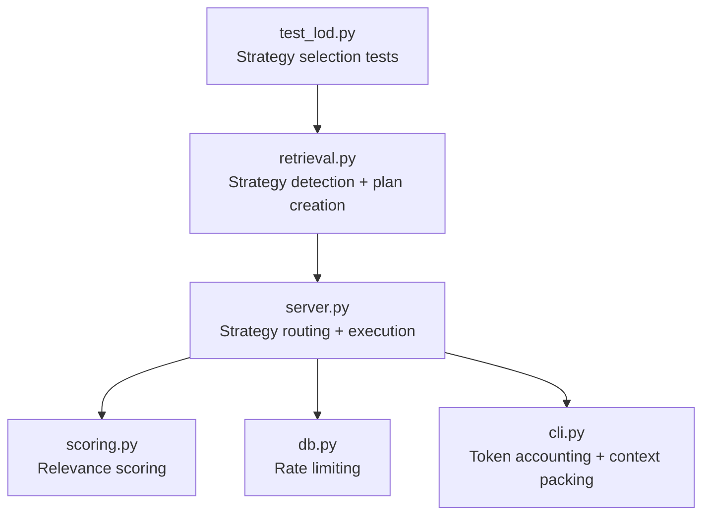
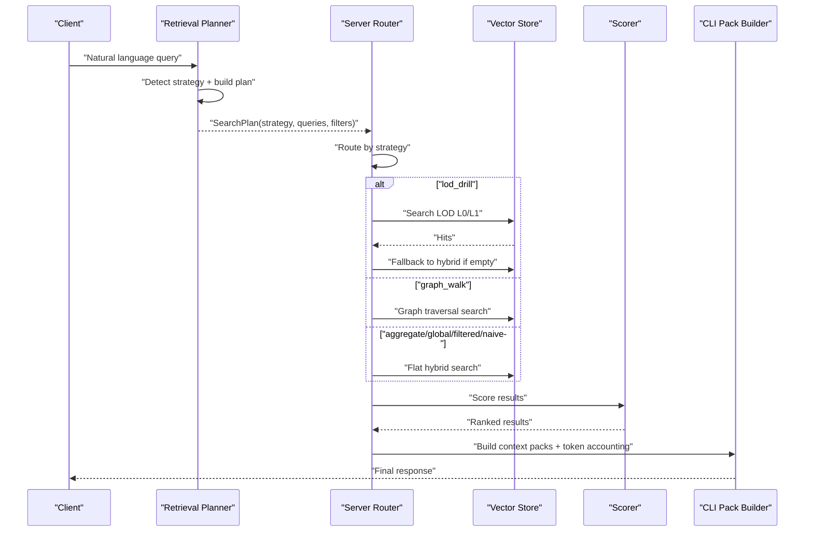
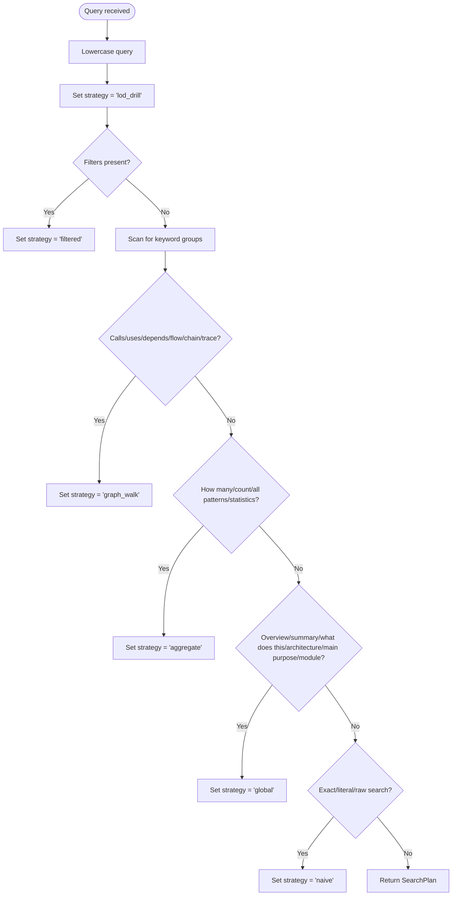
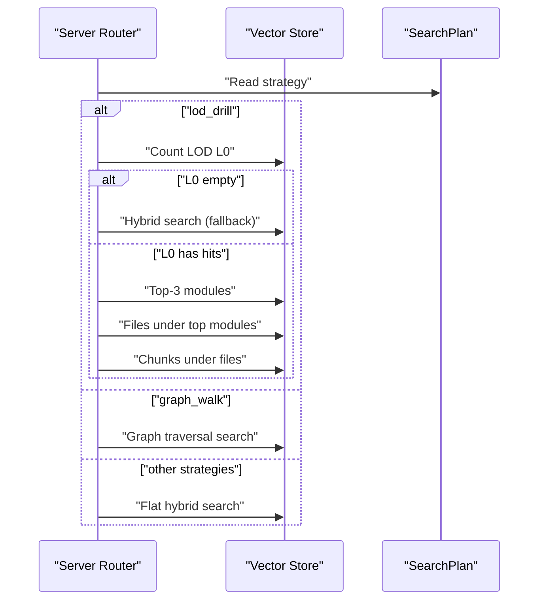
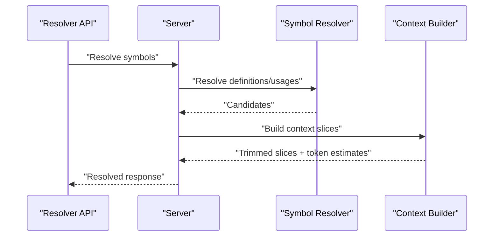
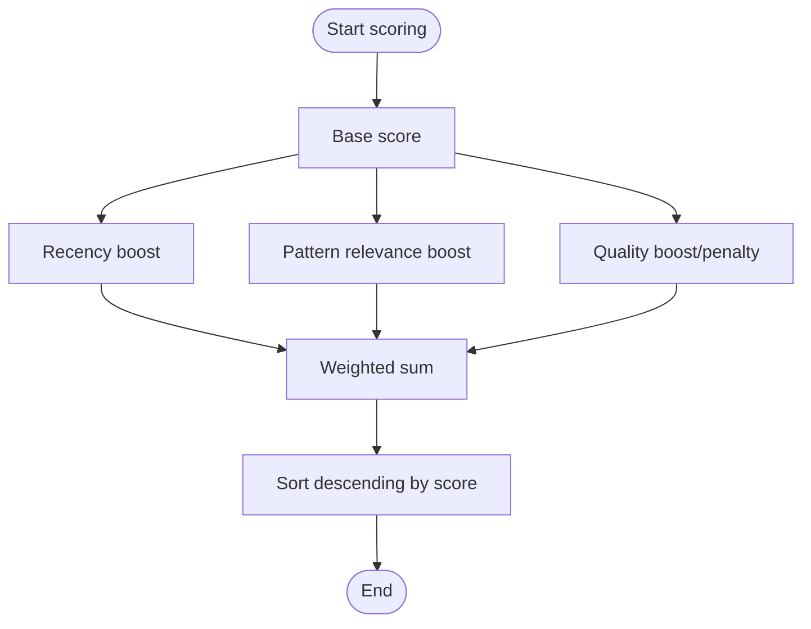
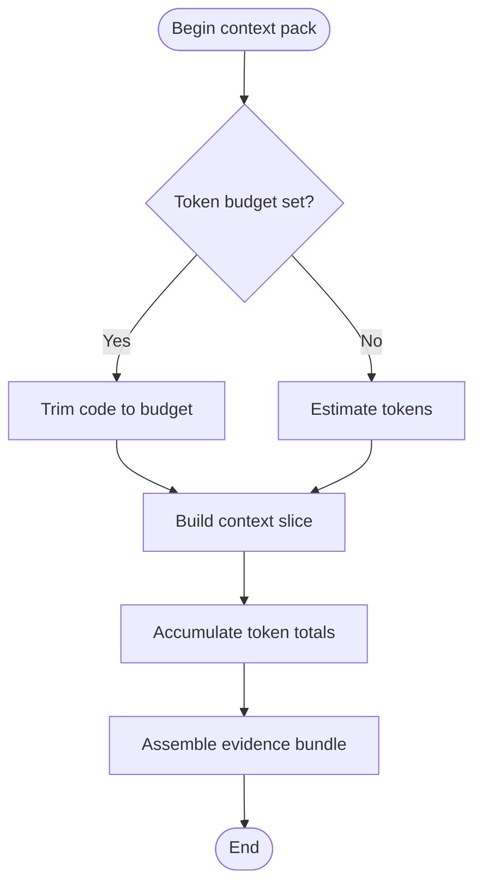
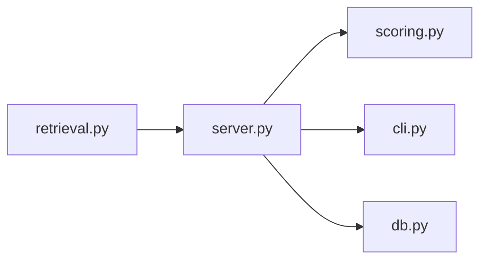

# Query Planning and Strategy Selection

<cite>
**Referenced Files in This Document**
- [retrieval.py](file://src/rag/agents/retrieval.py)
- [server.py](file://src/rag/server.py)
- [scoring.py](file://src/rag/core/scoring.py)
- [db.py](file://src/rag/storage/db.py)
- [test_lod.py](file://tests/test_lod.py)
- [cli.py](file://src/rag/cli.py)
- [default.toml](file://config/default.toml)
</cite>

## Table of Contents
1. [Introduction](#introduction)
2. [Project Structure](#project-structure)
3. [Core Components](#core-components)
4. [Architecture Overview](#architecture-overview)
5. [Detailed Component Analysis](#detailed-component-analysis)
6. [Dependency Analysis](#dependency-analysis)
7. [Performance Considerations](#performance-considerations)
8. [Troubleshooting Guide](#troubleshooting-guide)
9. [Conclusion](#conclusion)
10. [Appendices](#appendices)

## Introduction
This document describes the Agno query planner’s subsystem responsible for decomposing natural-language queries into actionable search strategies and selecting the most appropriate retrieval approach. It covers strategy detection heuristics, symbol resolution, context analysis, scoring mechanisms, token budgeting, and result prioritization. It also documents configuration options for tuning strategy weights, fallback behaviors, and optimization parameters.

## Project Structure
The query planning and strategy selection subsystem spans several modules:
- Strategy detection and plan creation
- Strategy routing and execution
- Scoring and ranking
- Token budgeting and context trimming
- Tests validating strategy selection and fallback behavior

**Diagram sources**
- [retrieval.py:283-303](file://src/rag/agents/retrieval.py#L283-L303)
- [server.py:1371-1417](file://src/rag/server.py#L1371-L1417)
- [server.py:1650-1686](file://src/rag/server.py#L1650-L1686)
- [scoring.py:31-57](file://src/rag/core/scoring.py#L31-L57)
- [db.py:711-712](file://src/rag/storage/db.py#L711-L712)
- [cli.py:713-748](file://src/rag/cli.py#L713-L748)
- [test_lod.py:34-50](file://tests/test_lod.py#L34-L50)

**Section sources**
- [retrieval.py:283-303](file://src/rag/agents/retrieval.py#L283-L303)
- [server.py:1371-1417](file://src/rag/server.py#L1371-L1417)
- [server.py:1650-1686](file://src/rag/server.py#L1650-L1686)
- [scoring.py:31-57](file://src/rag/core/scoring.py#L31-L57)
- [db.py:711-712](file://src/rag/storage/db.py#L711-L712)
- [cli.py:713-748](file://src/rag/cli.py#L713-L748)
- [test_lod.py:34-50](file://tests/test_lod.py#L34-L50)

## Core Components
- Strategy detection: Converts natural language queries into a canonical strategy label (e.g., lod_drill, filtered, graph_walk, aggregate, global, naive).
- Plan creation: Produces a structured plan containing expanded queries, sanitized filters, and selected strategy.
- Strategy routing: Executes the chosen strategy against vector stores and caches, with fallbacks and repo-scoped behavior.
- Scoring: Adjusts base vector search scores using recency, pattern relevance, and quality signals.
- Token budgeting: Trims context slices to stay within token budgets and computes totals across packs.
- Symbol resolution: Resolves symbols to definitions and usages, producing context slices for downstream processing.

**Section sources**
- [retrieval.py:283-303](file://src/rag/agents/retrieval.py#L283-L303)
- [server.py:1371-1417](file://src/rag/server.py#L1371-L1417)
- [server.py:1650-1686](file://src/rag/server.py#L1650-L1686)
- [scoring.py:31-57](file://src/rag/core/scoring.py#L31-L57)
- [cli.py:713-748](file://src/rag/cli.py#L713-L748)

## Architecture Overview
The query planner orchestrates strategy detection, plan execution, and result refinement. The server routes plans to strategy-specific handlers, applies scoring, and enforces token budgets for context inclusion.

**Diagram sources**
- [retrieval.py:283-303](file://src/rag/agents/retrieval.py#L283-L303)
- [server.py:1371-1417](file://src/rag/server.py#L1371-L1417)
- [scoring.py:31-57](file://src/rag/core/scoring.py#L31-L57)
- [cli.py:713-748](file://src/rag/cli.py#L713-L748)

## Detailed Component Analysis

### Strategy Detection and Plan Creation
- Strategy detection heuristics:
  - Default strategy is “lod_drill”.
  - Filters trigger “filtered”.
  - Graph-related keywords select “graph_walk”.
  - Count/statistics keywords select “aggregate”.
  - Overview/architecture/module keywords select “global”.
  - Exact/literal/raw search keywords select “naive”.
- Plan composition:
  - Expanded queries
  - Sanitized filters
  - Strategy label

**Diagram sources**
- [retrieval.py:283-303](file://src/rag/agents/retrieval.py#L283-L303)

**Section sources**
- [retrieval.py:283-303](file://src/rag/agents/retrieval.py#L283-L303)
- [test_lod.py:34-50](file://tests/test_lod.py#L34-L50)

### Strategy Routing and Execution
- lod_drill:
  - Hierarchical drill-down: L0 (modules) → L1 (files) → L2 (chunks).
  - If L0 is empty, degrade to flat hybrid search.
- graph_walk:
  - Executes graph traversal search.
- aggregate/global/filtered/naive:
  - Executes flat hybrid search with optional filters.
- Repo-scoped override:
  - When a repository is specified and strategy is “lod_drill”, “global”, or “graph_walk”, switch to “hybrid”.

**Diagram sources**
- [server.py:1371-1417](file://src/rag/server.py#L1371-L1417)

**Section sources**
- [server.py:1371-1417](file://src/rag/server.py#L1371-L1417)

### Symbol Resolution and Context Analysis
- Symbols are resolved to definitions and usages.
- Context slices are constructed with token estimates and trimmed to budget when needed.
- Results are logged with timing and counts.

**Diagram sources**
- [server.py:1650-1686](file://src/rag/server.py#L1650-L1686)

**Section sources**
- [server.py:1650-1686](file://src/rag/server.py#L1650-L1686)

### Scoring Mechanisms
- Base vector search scores are adjusted by:
  - Recency boost based on last modified date (exponential decay up to a threshold).
  - Pattern relevance boost based on domain-relevant patterns.
  - Quality signal boost/penalty derived from payload metadata.
- Final score is a weighted combination; results are sorted descending by score.

**Diagram sources**
- [scoring.py:31-57](file://src/rag/core/scoring.py#L31-L57)

**Section sources**
- [scoring.py:31-57](file://src/rag/core/scoring.py#L31-L57)

### Token Budgeting and Result Prioritization
- Context slices are trimmed to a token budget when provided.
- Token totals across context packs are computed for downstream processing.
- Evidence bundles assemble top files, symbols, call trees, tests, modules, and docs.

**Diagram sources**
- [cli.py:713-748](file://src/rag/cli.py#L713-L748)
- [server.py:515-535](file://src/rag/server.py#L515-L535)

**Section sources**
- [cli.py:713-748](file://src/rag/cli.py#L713-L748)
- [server.py:515-535](file://src/rag/server.py#L515-L535)

### Strategy Evaluation Matrices and Examples
- Strategy selection matrix (conceptual):
  - Filters present → filtered
  - Graph keywords → graph_walk
  - Count/statistics → aggregate
  - Overview/architecture/module → global
  - Exact/literal/raw → naive
  - Otherwise → lod_drill
- Example scenarios:
  - “Show module architecture” → global
  - “What calls login?” → graph_walk
  - “How many patterns?” → aggregate
  - “Find Python files” → filtered
  - “Explain the service layer” → lod_drill

[No sources needed since this section provides conceptual examples]

## Dependency Analysis
- retrieval.py depends on keyword heuristics to produce SearchPlan.
- server.py routes plans to strategy-specific handlers and applies fallbacks.
- scoring.py modifies result scores post-search.
- cli.py consumes scored results and constructs context packs with token accounting.
- db.py provides rate-limiting primitives used during request processing.

**Diagram sources**
- [retrieval.py:283-303](file://src/rag/agents/retrieval.py#L283-L303)
- [server.py:1371-1417](file://src/rag/server.py#L1371-L1417)
- [scoring.py:31-57](file://src/rag/core/scoring.py#L31-L57)
- [cli.py:713-748](file://src/rag/cli.py#L713-L748)
- [db.py:711-712](file://src/rag/storage/db.py#L711-L712)

**Section sources**
- [retrieval.py:283-303](file://src/rag/agents/retrieval.py#L283-L303)
- [server.py:1371-1417](file://src/rag/server.py#L1371-L1417)
- [scoring.py:31-57](file://src/rag/core/scoring.py#L31-L57)
- [cli.py:713-748](file://src/rag/cli.py#L713-L748)
- [db.py:711-712](file://src/rag/storage/db.py#L711-L712)

## Performance Considerations
- Strategy selection is O(n) over the number of keyword checks and filter presence.
- lod_drill degrades gracefully to hybrid search when LOD collections are empty, avoiding expensive graph operations.
- Scoring is linear in the number of results and uses lightweight computations.
- Token budgeting trims code to reduce context size, lowering downstream costs.

[No sources needed since this section provides general guidance]

## Troubleshooting Guide
- Strategy unexpectedly overridden:
  - Verify keyword matches in the query and filter presence.
  - Confirm repo-scoped override behavior in the router.
- lod_drill degraded to hybrid:
  - Check LOD collection counts and index completeness.
- Poor result quality:
  - Review scoring weights and payload metadata availability.
- Excessive token usage:
  - Adjust token budget thresholds and ensure context trimming is applied.

**Section sources**
- [test_lod.py:34-50](file://tests/test_lod.py#L34-L50)
- [server.py:1371-1417](file://src/rag/server.py#L1371-L1417)
- [scoring.py:31-57](file://src/rag/core/scoring.py#L31-L57)
- [cli.py:713-748](file://src/rag/cli.py#L713-L748)

## Conclusion
The Agno query planner transforms natural language into precise search strategies, routes execution via a robust server pipeline, enriches results with scoring and token-aware context, and supports configurable fallbacks and optimizations. Together, these components deliver reliable, efficient, and adaptive retrieval across diverse query types.

[No sources needed since this section summarizes without analyzing specific files]

## Appendices

### Configuration Options
- Strategy weights and scoring:
  - Recency weight, pattern weight, quality weight, and pattern sets influence result scoring.
- Rate limiting:
  - Token-bucket capacity and refill rates can be tuned for per-client throttling.
- Strategy overrides:
  - Repo-scoped strategies may force hybrid mode for certain strategies.

**Section sources**
- [scoring.py:19-28](file://src/rag/core/scoring.py#L19-L28)
- [db.py:711-712](file://src/rag/storage/db.py#L711-L712)
- [server.py:1371-1378](file://src/rag/server.py#L1371-L1378)