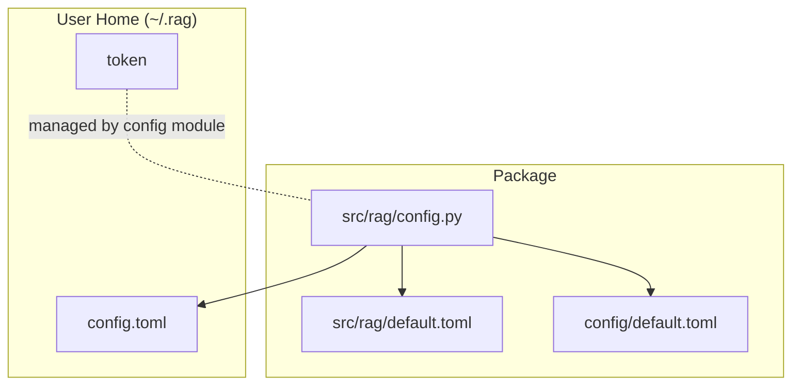
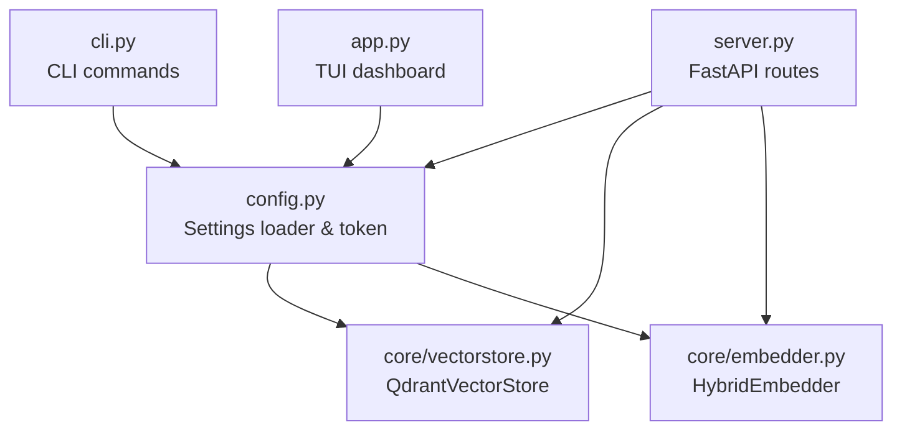
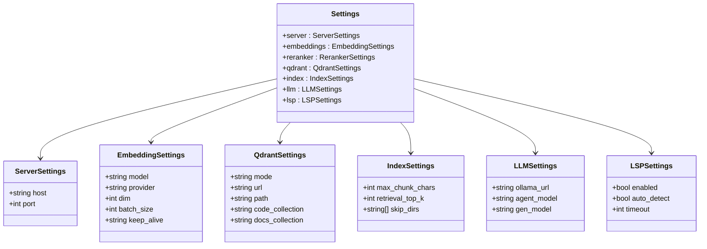
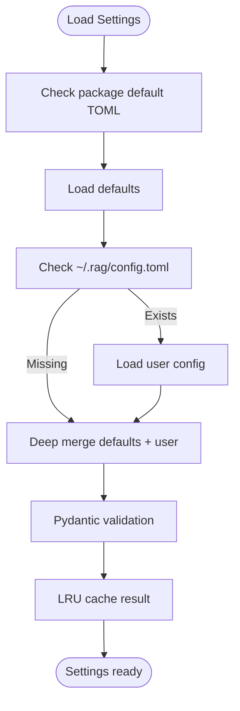
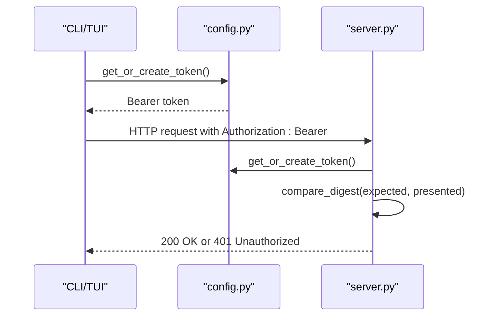
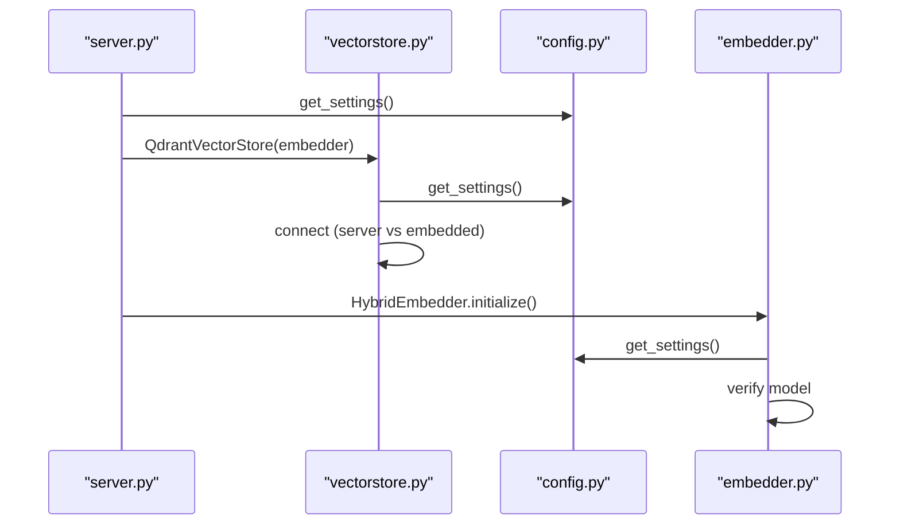
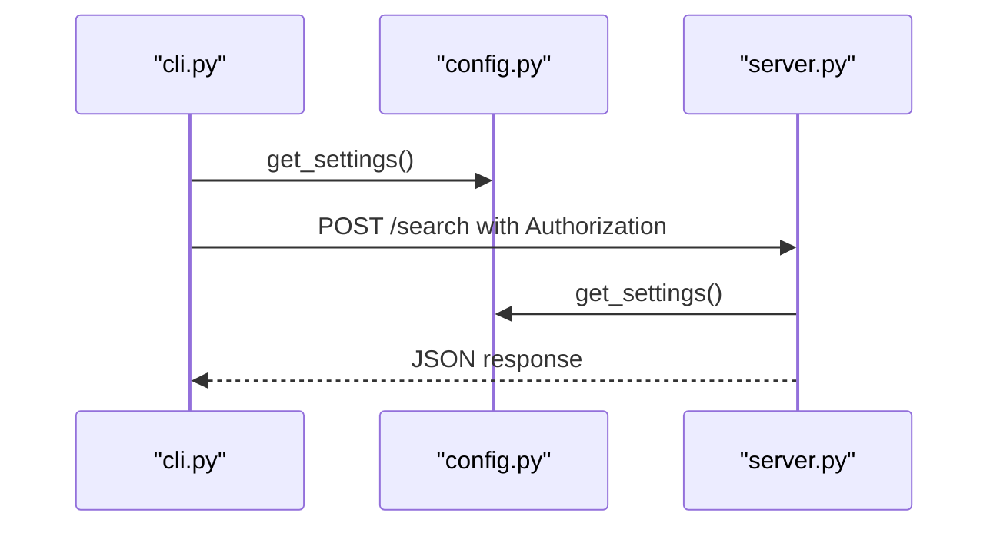
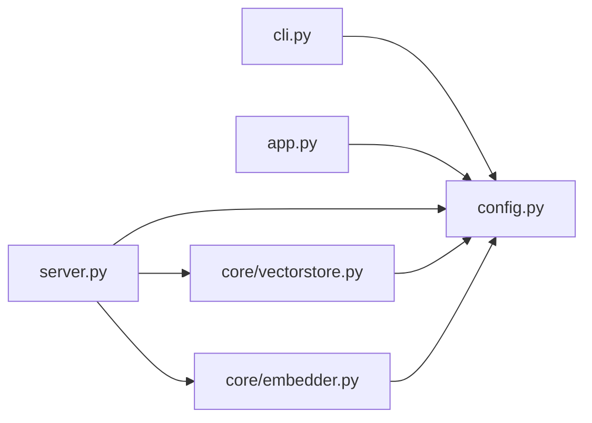

# Configuration Management

<cite>
**Referenced Files in This Document**
- [config.py](file://src/rag/config.py)
- [default.toml](file://src/rag/default.toml)
- [default.toml](file://config/default.toml)
- [cli.py](file://src/rag/cli.py)
- [server.py](file://src/rag/server.py)
- [app.py](file://src/rag/app.py)
- [vectorstore.py](file://src/rag/core/vectorstore.py)
- [embedder.py](file://src/rag/core/embedder.py)
- [indexer.py](file://src/rag/core/indexer.py)
- [test_config.py](file://tests/test_config.py)
</cite>

## Table of Contents
1. [Introduction](#introduction)
2. [Project Structure](#project-structure)
3. [Core Components](#core-components)
4. [Architecture Overview](#architecture-overview)
5. [Detailed Component Analysis](#detailed-component-analysis)
6. [Dependency Analysis](#dependency-analysis)
7. [Performance Considerations](#performance-considerations)
8. [Troubleshooting Guide](#troubleshooting-guide)
9. [Conclusion](#conclusion)
10. [Appendices](#appendices)

## Introduction
This document explains the configuration management system for the RAG system. It covers the settings structure, validation, defaults, and customization options for embedding providers, vector store backends, indexing/search behavior, and UI preferences. It also documents the configuration file hierarchy, runtime behavior, hot-reloading, security considerations around credentials, and how configuration influences indexing, search, and agent operations. Practical examples, performance tuning tips, and troubleshooting guidance are included.

## Project Structure
Configuration is defined in a TOML-based schema and validated at runtime using Pydantic models. The system loads a default configuration bundled with the package and merges it with a user-specific configuration stored under the user’s home directory. A bearer token is managed under the same home directory for secure daemon authentication.

**Diagram sources**
- [config.py:23-32](file://src/rag/config.py#L23-L32)
- [default.toml](file://src/rag/default.toml)
- [default.toml](file://config/default.toml)

**Section sources**
- [config.py:23-32](file://src/rag/config.py#L23-L32)
- [default.toml](file://src/rag/default.toml)
- [default.toml](file://config/default.toml)

## Core Components
The configuration system centers on a hierarchical merge of defaults and user overrides, with strict validation and caching for performance and safety.

- Configuration hierarchy
  - Defaults are loaded from the package’s default TOML files (two locations checked for backward compatibility).
  - User overrides are loaded from ~/.rag/config.toml if present.
  - The two dictionaries are deep-merged, with user values overriding defaults.
- Validation and defaults
  - Pydantic models define required fields, default values, and numeric/string constraints.
  - Unknown top-level keys are allowed to preserve backward compatibility with legacy sections.
- Runtime behavior
  - Settings are cached via an LRU cache to avoid repeated file I/O.
  - A reload function clears the cache to force re-reading configuration on demand.
- Security
  - A bearer token is generated and persisted at ~/.rag/token with restrictive permissions.
  - The server enforces Authorization: Bearer on protected routes and validates the token.

Key configuration sections and their roles:
- server: Network binding and port for the HTTP daemon.
- embeddings: Embedding model, dimensionality, batching, and keep-alive for the Ollama embedder.
- qdrant: Vector store mode (server or embedded), endpoint/path, and collection names.
- index: Chunk size limits and retrieval top-K.
- llm: Local LLM URL and model names for agent and generation.
- lsp: IDE integration toggles and timeouts.

**Section sources**
- [config.py:118-131](file://src/rag/config.py#L118-L131)
- [config.py:150-159](file://src/rag/config.py#L150-L159)
- [config.py:191-193](file://src/rag/config.py#L191-L193)
- [default.toml](file://src/rag/default.toml)
- [default.toml](file://config/default.toml)

## Architecture Overview
The configuration is consumed by the CLI, TUI, and server. The server initializes the vector store and embedder using settings, and routes use settings for collection names and limits. The CLI and TUI use settings for base URLs and token-based authentication.

**Diagram sources**
- [config.py:150-159](file://src/rag/config.py#L150-L159)
- [cli.py:24-26](file://src/rag/cli.py#L24-L26)
- [app.py:294-296](file://src/rag/app.py#L294-L296)
- [server.py:606-607](file://src/rag/server.py#L606-L607)
- [vectorstore.py:206-228](file://src/rag/core/vectorstore.py#L206-L228)
- [embedder.py:217-228](file://src/rag/core/embedder.py#L217-L228)

## Detailed Component Analysis

### Settings Model and Validation
The Settings model composes subsections for server, embeddings, qdrant, index, llm, and lsp. Each subsection defines defaults and validations. Notable validations include:
- server.host rejects wildcard binds for security.
- server.port is constrained to a valid TCP port range.
- embeddings.dim is bounded and provider is validated (deprecated field retained for compatibility).
- qdrant.url must start with http:// or https:// and is normalized.
- llm.ollama_url must start with http:// or https://.
- index.max_chunk_chars is bounded for performance and safety.
- LRU caching ensures efficient repeated reads.

**Diagram sources**
- [config.py:35-131](file://src/rag/config.py#L35-L131)

**Section sources**
- [config.py:35-131](file://src/rag/config.py#L35-L131)
- [test_config.py:6-71](file://tests/test_config.py#L6-L71)

### Configuration Loading and Merging
The loader:
- Loads defaults from the package default TOML files (checking two locations).
- Loads ~/.rag/config.toml if present.
- Deep-merges user overrides into defaults.
- Returns a validated Settings instance.
- Provides a reload function to clear the cache and force re-reading.

**Diagram sources**
- [config.py:133-159](file://src/rag/config.py#L133-L159)

**Section sources**
- [config.py:133-159](file://src/rag/config.py#L133-L159)

### Token and Security
- The token is created at ~/.rag/token if missing and set to restrictive permissions.
- The server extracts the Authorization header and compares it securely to the persisted token.
- The CLI and TUI use the same token for authentication.

**Diagram sources**
- [config.py:167-188](file://src/rag/config.py#L167-L188)
- [server.py:592-598](file://src/rag/server.py#L592-L598)

**Section sources**
- [config.py:167-188](file://src/rag/config.py#L167-L188)
- [server.py:592-598](file://src/rag/server.py#L592-L598)

### Vector Store and Embedding Settings
- QdrantVectorStore reads qdrant.mode and qdrant.url or qdrant.path to connect to a remote or embedded instance.
- HybridEmbedder reads embeddings settings to initialize the Ollama-backed embedder and verify the configured model.
- Retrieval top-K and chunk sizing come from index settings.

**Diagram sources**
- [vectorstore.py:206-228](file://src/rag/core/vectorstore.py#L206-L228)
- [embedder.py:217-228](file://src/rag/core/embedder.py#L217-L228)
- [server.py:606-618](file://src/rag/server.py#L606-L618)

**Section sources**
- [vectorstore.py:206-228](file://src/rag/core/vectorstore.py#L206-L228)
- [embedder.py:217-228](file://src/rag/core/embedder.py#L217-L228)
- [server.py:606-618](file://src/rag/server.py#L606-L618)

### CLI and TUI Usage of Settings
- CLI constructs base URLs and authentication headers using settings and token.
- TUI reads settings to populate UI panels and status bars.

**Diagram sources**
- [cli.py:24-30](file://src/rag/cli.py#L24-L30)
- [app.py:294-296](file://src/rag/app.py#L294-L296)
- [server.py:606-607](file://src/rag/server.py#L606-L607)

**Section sources**
- [cli.py:24-30](file://src/rag/cli.py#L24-L30)
- [app.py:294-296](file://src/rag/app.py#L294-L296)
- [server.py:606-607](file://src/rag/server.py#L606-L607)

### Hot-Reloading and Runtime Behavior
- The CLI provides a mechanism to reload settings by clearing the LRU cache.
- The server lifecycle initializes resources once and does not automatically re-check configuration during operation.

Practical usage:
- After editing ~/.rag/config.toml, call the reload command to refresh settings in the CLI/TUI.
- Restart the server to apply changes that require re-initialization (e.g., vector store connection or model verification).

**Section sources**
- [config.py:191-193](file://src/rag/config.py#L191-L193)
- [server.py:606-700](file://src/rag/server.py#L606-L700)

## Dependency Analysis
Configuration is consumed across modules with clear boundaries:
- Loader and token management in config.py.
- CLI and TUI depend on config.py for settings and token.
- Server depends on config.py for vector store and embedder initialization.
- Vector store and embedder depend on config.py for runtime settings.

**Diagram sources**
- [config.py:150-159](file://src/rag/config.py#L150-L159)
- [cli.py:24-30](file://src/rag/cli.py#L24-L30)
- [app.py:294-296](file://src/rag/app.py#L294-L296)
- [server.py:606-618](file://src/rag/server.py#L606-L618)
- [vectorstore.py:206-228](file://src/rag/core/vectorstore.py#L206-L228)
- [embedder.py:217-228](file://src/rag/core/embedder.py#L217-L228)

**Section sources**
- [config.py:150-159](file://src/rag/config.py#L150-L159)
- [cli.py:24-30](file://src/rag/cli.py#L24-L30)
- [app.py:294-296](file://src/rag/app.py#L294-L296)
- [server.py:606-618](file://src/rag/server.py#L606-L618)
- [vectorstore.py:206-228](file://src/rag/core/vectorstore.py#L206-L228)
- [embedder.py:217-228](file://src/rag/core/embedder.py#L217-L228)

## Performance Considerations
- Embedding batch size: Tune embeddings.batch_size for throughput vs. responsiveness. Use the CLI benchmark command to measure effective throughput.
- Chunk size: Increase index.max_chunk_chars cautiously; larger chunks improve context but increase memory and latency.
- Top-K: Adjust index.retrieval_top_k to balance recall and latency.
- Qdrant mode: Embedded mode avoids network latency but consumes local disk and memory; server mode scales externally.
- Keep-alive: Configure embeddings.keep_alive to reduce cold-start costs for the embedder.

Practical tuning steps:
- Run the embedding benchmark to pick an optimal batch size.
- Start with conservative chunk sizes and top-K, then increase gradually while monitoring latency and memory.
- Prefer embedded mode for development and server mode for production deployments.

**Section sources**
- [cli.py:302-385](file://src/rag/cli.py#L302-L385)
- [config.py:83-85](file://src/rag/config.py#L83-L85)
- [config.py:58-61](file://src/rag/config.py#L58-L61)
- [vectorstore.py:206-228](file://src/rag/core/vectorstore.py#L206-L228)

## Troubleshooting Guide
Common configuration issues and resolutions:
- Invalid server.host
  - Symptom: Validation error when setting host to wildcard addresses.
  - Resolution: Use loopback or explicit LAN IP; bind behind a reverse proxy for TLS.
- Invalid server.port
  - Symptom: Validation error for out-of-range or zero ports.
  - Resolution: Set port within 1–65535.
- Invalid qdrant.url
  - Symptom: Validation error if scheme is missing or incorrect.
  - Resolution: Prefix with http:// or https://.
- Invalid llm.ollama_url
  - Symptom: Validation error for unsupported schemes.
  - Resolution: Use http:// or https://.
- Invalid embeddings.dim
  - Symptom: Validation error for out-of-range dimensions.
  - Resolution: Choose a value within the allowed bounds.
- Index bounds exceeded
  - Symptom: Validation error for max_chunk_chars outside allowed range.
  - Resolution: Adjust to within the permitted interval.
- Configuration not applied
  - Symptom: Changes to ~/.rag/config.toml have no effect.
  - Resolution: Clear settings cache or restart the server; for CLI/TUI, reload settings.

Security-related checks:
- Token permissions
  - Verify ~/.rag/token exists and has restricted permissions.
- Authentication failures
  - Ensure Authorization: Bearer header matches the persisted token.

Validation and defaults tests:
- Tests confirm default values and validation constraints for all major settings.

**Section sources**
- [config.py:39-50](file://src/rag/config.py#L39-L50)
- [config.py:71-76](file://src/rag/config.py#L71-L76)
- [config.py:104-109](file://src/rag/config.py#L104-L109)
- [config.py:48-53](file://src/rag/config.py#L48-L53)
- [config.py:68-71](file://src/rag/config.py#L68-L71)
- [test_config.py:13-33](file://tests/test_config.py#L13-L33)
- [test_config.py:56-62](file://tests/test_config.py#L56-L62)
- [test_config.py:65-71](file://tests/test_config.py#L65-L71)
- [config.py:167-188](file://src/rag/config.py#L167-L188)
- [server.py:592-598](file://src/rag/server.py#L592-L598)

## Conclusion
The configuration system provides a robust, validated, and secure foundation for the RAG system. Defaults are packaged with the application, user overrides are cleanly layered, and runtime behavior is consistent across CLI, TUI, and server. Security is addressed through validated bindings, bearer token enforcement, and careful file permissions. By tuning embedding batch size, chunk size, and retrieval parameters, operators can optimize performance for their environments. Use hot-reloading and server restarts to apply changes safely.

## Appendices

### Configuration Reference
- server
  - host: Bind address (loopback recommended; avoid wildcards).
  - port: TCP port number.
- embeddings
  - model: Embedding model identifier.
  - provider: Deprecated; ignored at runtime.
  - dim: Embedding dimension.
  - batch_size: Batch size for embedding.
  - keep_alive: Keep-alive duration for the embedder.
- qdrant
  - mode: server or embedded.
  - url: Remote endpoint (http/https).
  - path: Local path for embedded mode.
  - code_collection: Name of the code collection.
  - docs_collection: Name of the docs collection.
- index
  - max_chunk_chars: Maximum chunk size.
  - retrieval_top_k: Number of results to retrieve.
  - skip_dirs: Directory patterns to exclude.
- llm
  - ollama_url: Local LLM service endpoint.
  - agent_model: Model used for agent tasks.
  - gen_model: Model used for generation (optional).
- lsp
  - enabled: Enable IDE integration.
  - auto_detect: Auto-detect LSP servers.
  - timeout: LSP operation timeout.

**Section sources**
- [config.py:35-131](file://src/rag/config.py#L35-L131)
- [default.toml](file://src/rag/default.toml)
- [default.toml](file://config/default.toml)