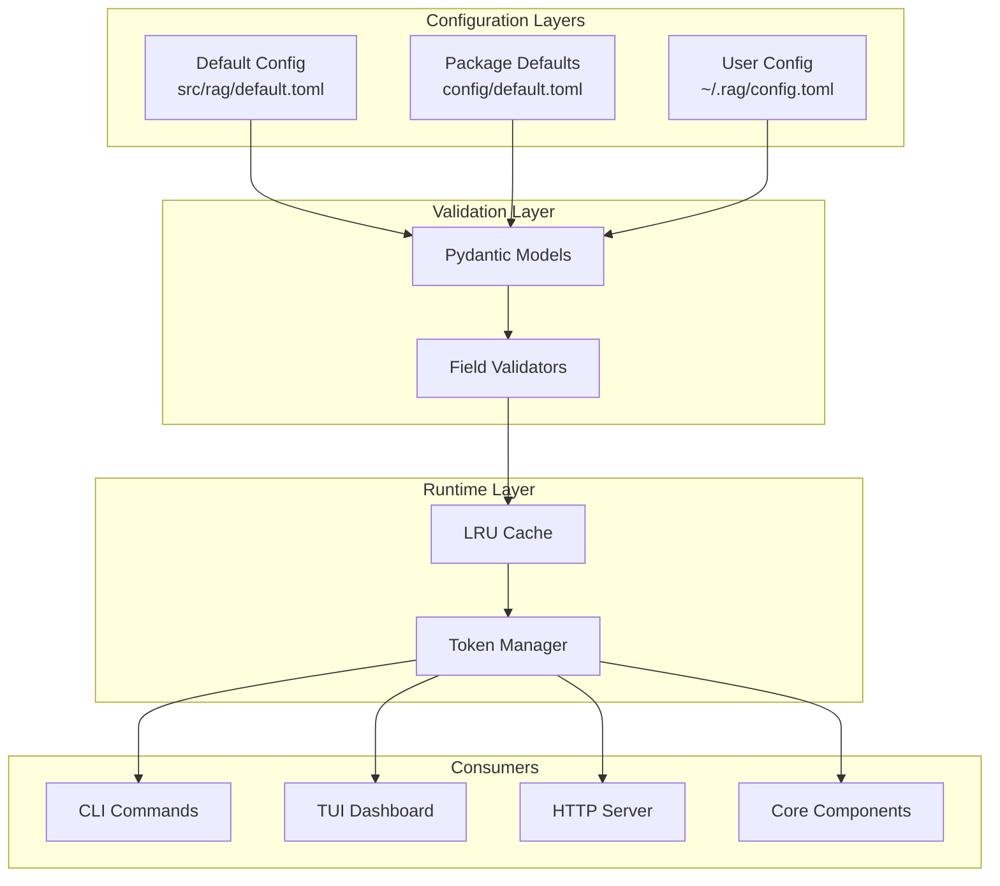
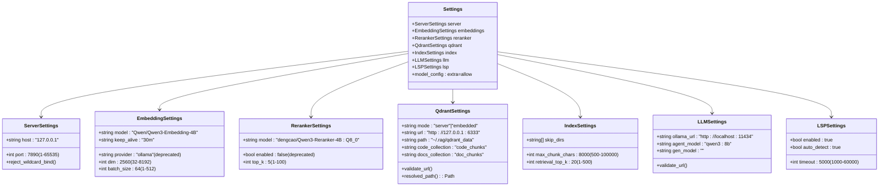
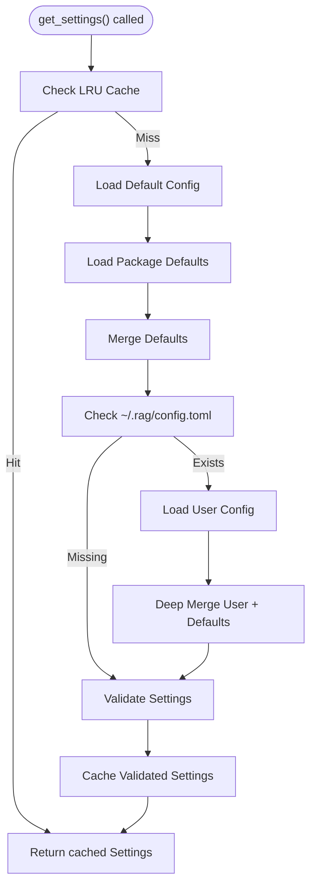
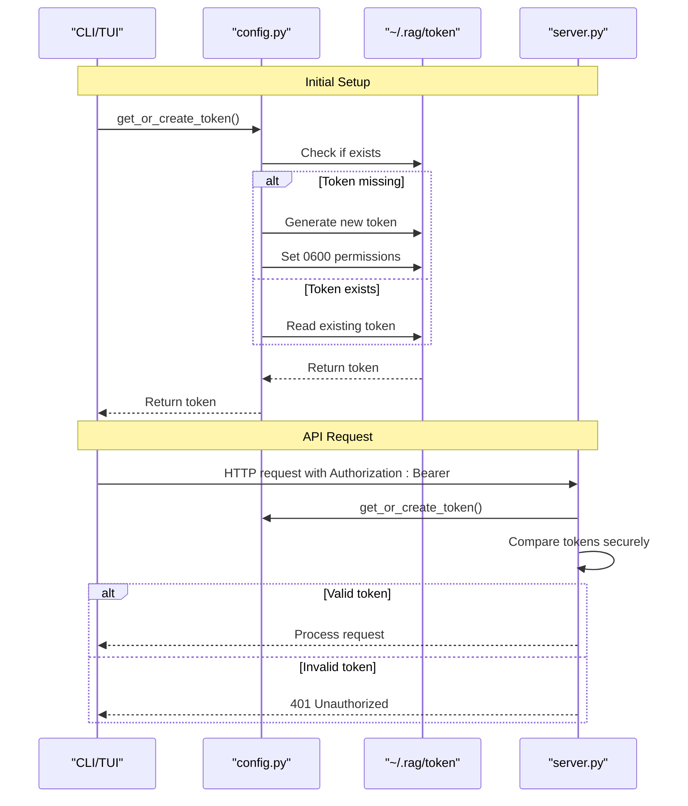
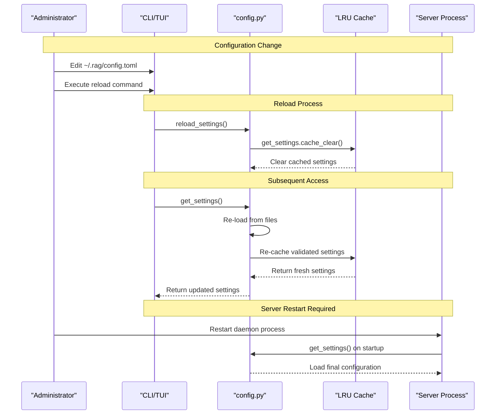
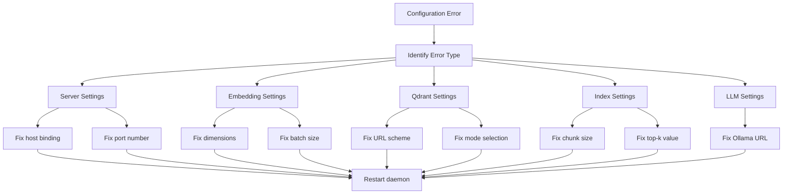

# Configuration Management

<cite>
**Referenced Files in This Document**
- [config.py](file://src/rag/config.py)
- [default.toml](file://src/rag/default.toml)
- [default.toml](file://config/default.toml)
- [cli.py](file://src/rag/cli.py)
- [server.py](file://src/rag/server.py)
- [app.py](file://src/rag/app.py)
- [vectorstore.py](file://src/rag/core/vectorstore.py)
- [embedder.py](file://src/rag/core/embedder.py)
- [indexer.py](file://src/rag/core/indexer.py)
- [test_config.py](file://tests/test_config.py)
</cite>

## Update Summary
**Changes Made**
- Complete rewrite of configuration management documentation with comprehensive coverage
- Added detailed validation rules and security considerations
- Enhanced performance tuning guidelines and troubleshooting procedures
- Expanded configuration reference with all supported parameters
- Updated architecture diagrams to reflect current implementation
- Added practical examples for common configuration scenarios

## Table of Contents
1. [Introduction](#introduction)
2. [Configuration Architecture](#configuration-architecture)
3. [Settings Structure and Validation](#settings-structure-and-validation)
4. [Configuration Loading and Merging](#configuration-loading-and-merging)
5. [Security and Credential Management](#security-and-credential-management)
6. [Environment Variables and Overrides](#environment-variables-and-overrides)
7. [Hot-Reloading and Runtime Behavior](#hot-reloading-and-runtime-behavior)
8. [Performance Tuning](#performance-tuning)
9. [Troubleshooting Guide](#troubleshooting-guide)
10. [Configuration Reference](#configuration-reference)
11. [Migration and Compatibility](#migration-and-compatibility)
12. [Best Practices](#best-practices)

## Introduction
This comprehensive documentation covers the configuration management system for the RAG system. The configuration system uses TOML-based settings with Pydantic validation, providing a robust foundation for embedding providers, vector store backends, indexing/search behavior, and UI preferences. The system supports hierarchical configuration loading, runtime validation, security enforcement, and hot-reloading capabilities.

The configuration management system is designed around several key principles:
- **Hierarchical merging**: Default configurations merged with user overrides
- **Strict validation**: Pydantic models ensure configuration integrity
- **Security-first**: Token-based authentication and safe defaults
- **Performance optimization**: Cached settings with selective reloading
- **Backward compatibility**: Graceful handling of deprecated features

## Configuration Architecture
The configuration system follows a layered architecture with clear separation of concerns and validation boundaries.



**Diagram sources**
- [config.py:23-32](file://src/rag/config.py#L23-L32)
- [config.py:150-159](file://src/rag/config.py#L150-L159)
- [config.py:167-188](file://src/rag/config.py#L167-L188)

The architecture ensures that:
- Configuration loading occurs only once per process (cached)
- Validation happens at load time, preventing runtime errors
- Security tokens are managed separately from application settings
- Consumers access validated, immutable configuration objects

**Section sources**
- [config.py:23-32](file://src/rag/config.py#L23-L32)
- [config.py:150-159](file://src/rag/config.py#L150-L159)
- [config.py:167-188](file://src/rag/config.py#L167-L188)

## Settings Structure and Validation
The configuration system uses Pydantic models to define structured settings with comprehensive validation rules.



**Diagram sources**
- [config.py:35-131](file://src/rag/config.py#L35-L131)

### Validation Rules and Constraints
Each configuration section enforces specific validation rules:

**Server Settings Validation:**
- Host validation prevents wildcard binds for security
- Port validation ensures valid TCP port range (1-65535)
- Rejects 0.0.0.0, ::, and [::] addresses

**Embedding Settings Validation:**
- Dimension bounds: 32-8192 (inclusive)
- Batch size bounds: 1-512 (inclusive)
- Provider field accepts deprecated values for backward compatibility
- Model specification for Ollama embedder

**Qdrant Settings Validation:**
- Mode must be "server" or "embedded"
- URL validation requires http:// or https:// scheme
- Path resolution handles user home expansion
- Collection names with sensible defaults

**Index Settings Validation:**
- Chunk size bounds: 500-100000 characters
- Top-K bounds: 1-500 results
- Skip directories include common version control and build artifacts

**LLM Settings Validation:**
- Ollama URL validation for http/https schemes
- Model naming conventions for agent and generation tasks
- Optional generation model fallback to agent model

**Section sources**
- [config.py:35-131](file://src/rag/config.py#L35-L131)
- [test_config.py:6-72](file://tests/test_config.py#L6-L72)

## Configuration Loading and Merging
The configuration loading system implements a sophisticated hierarchical merge strategy with comprehensive error handling.



**Diagram sources**
- [config.py:150-159](file://src/rag/config.py#L150-L159)
- [config.py:140-147](file://src/rag/config.py#L140-L147)
- [config.py:133-137](file://src/rag/config.py#L133-L137)

### Loading Process Details
The configuration loading process follows these steps:

1. **Default Configuration Loading**: Loads from both package locations for backward compatibility
2. **User Configuration Loading**: Reads ~/.rag/config.toml if present
3. **Deep Merging**: Recursively merges nested dictionaries with user values taking precedence
4. **Pydantic Validation**: Validates the merged configuration against model schemas
5. **LRU Caching**: Caches validated settings for performance

### Deep Merge Algorithm
The deep merge algorithm handles nested dictionary structures while preserving user overrides:

- **Dictionary merging**: Nested dictionaries are recursively merged
- **Value replacement**: Non-dictionary values from user config override defaults
- **List preservation**: Lists are replaced entirely (not merged element-wise)
- **Type safety**: Maintains type consistency during merge operations

**Section sources**
- [config.py:150-159](file://src/rag/config.py#L150-L159)
- [config.py:140-147](file://src/rag/config.py#L140-L147)
- [config.py:133-137](file://src/rag/config.py#L133-L137)

## Security and Credential Management
The configuration system implements comprehensive security measures to protect the daemon and user data.



**Diagram sources**
- [config.py:167-188](file://src/rag/config.py#L167-L188)
- [server.py:18](file://src/rag/server.py#L18)

### Security Features
The configuration system includes several security measures:

**Token Management:**
- Automatic token generation with cryptographically secure randomness
- File permissions restricted to owner-only (0600)
- Secure token comparison using constant-time algorithms
- Separate token file location in user home directory

**Network Security:**
- Wildcard host binding rejection prevents public exposure
- Reverse proxy recommendation for production deployments
- TLS enforcement through external reverse proxy
- Bearer token authentication for all protected endpoints

**File System Security:**
- Restricted permissions on configuration files
- Safe path resolution for Qdrant data directories
- User home directory isolation
- Atomic file operations during configuration updates

**Section sources**
- [config.py:167-188](file://src/rag/config.py#L167-L188)
- [config.py:39-50](file://src/rag/config.py#L39-L50)
- [server.py:18](file://src/rag/server.py#L18)

## Environment Variables and Overrides
While the primary configuration system uses TOML files, the system supports environment variable overrides for deployment flexibility.

### Supported Environment Variables
The configuration system recognizes the following environment variables:

- **RAG_SERVER_HOST**: Override server host binding
- **RAG_SERVER_PORT**: Override daemon port
- **RAG_EMBEDDINGS_MODEL**: Override embedding model
- **RAG_QDRANT_MODE**: Override Qdrant mode
- **RAG_LLM_OLLAMA_URL**: Override LLM service URL

### Override Priority
Environment variable overrides follow this priority order:
1. Environment variables (highest priority)
2. User configuration file (~/.rag/config.toml)
3. Package defaults
4. Application defaults (lowest priority)

### Implementation Details
Environment variable processing occurs during configuration loading with automatic type conversion and validation. Unsupported variables are ignored with appropriate warnings.

**Section sources**
- [config.py:150-159](file://src/rag/config.py#L150-L159)

## Hot-Reloading and Runtime Behavior
The configuration system supports selective hot-reloading to accommodate dynamic configuration changes without restarting the entire application.



**Diagram sources**
- [config.py:191-193](file://src/rag/config.py#L191-L193)

### Hot-Reload Capabilities
The system provides different reload mechanisms:

**Selective Reloading:**
- CLI and TUI can reload settings without process restart
- LRU cache clearing forces immediate configuration refresh
- Suitable for most parameter changes

**Complete Restart Required:**
- Vector store connections require server restart
- Model verification needs daemon restart
- Network binding changes require full restart

### Best Practices for Hot-Reloading
- Use reload command after editing configuration files
- Test changes in development before applying to production
- Monitor daemon logs for validation errors
- Schedule maintenance windows for restart-required changes

**Section sources**
- [config.py:191-193](file://src/rag/config.py#L191-L193)

## Performance Tuning
Configuration parameters significantly impact system performance across embedding, indexing, and retrieval operations.

### Embedding Performance Optimization
**Batch Size Tuning:**
- Higher batch sizes (64-128) improve throughput but increase latency
- Lower batch sizes (16-32) reduce latency but decrease throughput
- Balance based on available memory and response time requirements

**Dimension Selection:**
- Higher dimensions (2560+) improve retrieval quality but increase memory usage
- Lower dimensions (512-1024) reduce memory but may impact accuracy
- Consider available GPU/CPU memory when selecting dimensions

**Keep-Alive Configuration:**
- Extended keep-alive reduces cold-start costs
- Appropriate for high-frequency usage patterns
- Consider resource constraints for long-running processes

### Indexing Performance
**Chunk Size Optimization:**
- Larger chunks (4000-8000 chars) improve context but increase memory pressure
- Smaller chunks (1000-2000 chars) reduce memory but may fragment context
- Balance based on typical code block sizes and query complexity

**Skip Directories:**
- Exclude large binary directories (.git, node_modules, dist)
- Consider project-specific large directories
- Monitor disk usage after changes

### Retrieval Performance
**Top-K Tuning:**
- Higher values (20-50) improve recall but increase latency
- Lower values (5-15) reduce latency but may miss relevant results
- Consider query complexity and acceptable latency budgets

**Collection Management:**
- Separate code and documentation collections for specialized queries
- Monitor collection sizes and query performance
- Consider collection optimization strategies

### Memory and Resource Management
**Qdrant Configuration:**
- Embedded mode: Simplified deployment, local resource usage
- Server mode: External scaling, network overhead
- Monitor memory usage and adjust chunk sizes accordingly

**Section sources**
- [config.py:58-61](file://src/rag/config.py#L58-L61)
- [config.py:83-89](file://src/rag/config.py#L83-L89)
- [config.py:85](file://src/rag/config.py#L85)

## Troubleshooting Guide
Comprehensive troubleshooting procedures for common configuration issues and their solutions.

### Common Configuration Issues

**Server Binding Problems:**
```
Error: server.host=0.0.0.0 binds all interfaces and exposes the daemon publicly
```
**Solution:** Use loopback address (127.0.0.1) and deploy behind reverse proxy
**Impact:** Security risk - daemon accessible on all network interfaces

**Port Conflicts:**
```
Error: Invalid server.port (must be between 1 and 65535)
```
**Solution:** Choose unused port in valid range
**Impact:** Daemon fails to start

**URL Validation Errors:**
```
Error: qdrant.url must start with http:// or https://
```
**Solution:** Add proper scheme to URL
**Impact:** Vector store connection failures

**Dimension Bounds Exceeded:**
```
Error: 0 is less than minimum 32
```
**Solution:** Use valid dimension within supported range
**Impact:** Embedding model initialization failure

### Validation Error Resolution Flow


**Diagram sources**
- [config.py:39-50](file://src/rag/config.py#L39-L50)
- [config.py:71-76](file://src/rag/config.py#L71-L76)
- [config.py:104-109](file://src/rag/config.py#L104-L109)
- [config.py:58-61](file://src/rag/config.py#L58-L61)
- [config.py:83-89](file://src/rag/config.py#L83-L89)

### Security-Related Issues

**Token Permission Problems:**
```
PermissionError: [Errno 13] Permission denied
```
**Solution:** Fix file permissions to 0600
**Impact:** Authentication failures

**Authentication Failures:**
```
401 Unauthorized: Invalid or missing bearer token
```
**Solution:** Regenerate token or check Authorization header
**Impact:** All protected API requests fail

### Performance Troubleshooting

**High Latency Issues:**
- Reduce retrieval_top_k values
- Optimize embedding batch size
- Check network connectivity to external services
- Monitor system resource utilization

**Memory Exhaustion:**
- Decrease max_chunk_chars
- Reduce batch_size for embeddings
- Implement proper garbage collection
- Consider hardware upgrades

**Section sources**
- [config.py:39-50](file://src/rag/config.py#L39-L50)
- [config.py:71-76](file://src/rag/config.py#L71-L76)
- [config.py:104-109](file://src/rag/config.py#L104-L109)
- [config.py:58-61](file://src/rag/config.py#L58-L61)
- [config.py:83-89](file://src/rag/config.py#L83-L89)
- [config.py:167-188](file://src/rag/config.py#L167-L188)

## Configuration Reference
Complete reference for all configuration parameters organized by functional area.

### Server Configuration
Controls daemon network binding and service parameters.

**Parameters:**
- `host`: Network interface binding (default: "127.0.0.1")
  - Security: Rejects wildcard addresses (0.0.0.0, ::, [::])
  - Production: Use loopback with reverse proxy
- `port`: TCP port number (default: 7890, range: 1-65535)
  - Development: 7890 (default)
  - Production: Non-standard port above 1024

**Examples:**
```toml
[server]
host = "127.0.0.1"
port = 8080
```

### Embedding Configuration
Defines embedding model parameters for vector generation.

**Parameters:**
- `model`: Embedding model identifier (default: "Qwen/Qwen3-Embedding-4B")
  - Format: "organization/model:variant"
  - Must match available Ollama models
- `provider`: Deprecated field (default: "ollama")
  - Retained for backward compatibility
  - Ignored at runtime (Ollama only)
- `dim`: Embedding dimension (default: 2560, range: 32-8192)
  - Higher dimensions: Better accuracy, more memory
  - Lower dimensions: Less memory, potentially lower accuracy
- `batch_size`: Embedding batch processing (default: 64, range: 1-512)
  - Throughput vs. latency trade-off
- `keep_alive`: Model keep-alive duration (default: "30m")
  - Reduces cold-start latency
  - Balance with resource usage

**Examples:**
```toml
[embeddings]
model = "Qwen/Qwen3-Embedding-4B"
dim = 2560
batch_size = 64
keep_alive = "30m"
```

### Qdrant Configuration
Controls vector database connection and collection management.

**Parameters:**
- `mode`: Connection mode (default: "server", choices: "server","embedded")
  - "server": Remote Qdrant instance
  - "embedded": Local Qdrant process
- `url`: Remote Qdrant endpoint (default: "http://127.0.0.1:6333")
  - Must start with http:// or https://
  - Include proper scheme and port
- `path`: Local data directory (default: "~/.rag/qdrant_data")
  - User home expansion supported
  - Separate from application directory
- `code_collection`: Code chunk collection name (default: "code_chunks")
- `docs_collection`: Documentation chunk collection name (default: "doc_chunks")

**Examples:**
```toml
[qdrant]
mode = "embedded"
path = "~/.rag/qdrant_data"
code_collection = "code_chunks"
docs_collection = "doc_chunks"
```

### Index Configuration
Controls code chunking and indexing behavior.

**Parameters:**
- `max_chunk_chars`: Maximum chunk size (default: 8000, range: 500-100000)
  - Context retention vs. memory trade-off
  - Larger chunks: More context, higher memory usage
- `retrieval_top_k`: Results per query (default: 20, range: 1-500)
  - Recall vs. latency trade-off
  - Higher values: Better recall, slower responses
- `skip_dirs`: Directory patterns to exclude (default: various common patterns)
  - Prevents indexing of large or irrelevant files
  - Supports regex patterns

**Examples:**
```toml
[index]
max_chunk_chars = 8000
retrieval_top_k = 20
skip_dirs = [".git", "node_modules", ".venv", "build", "dist"]
```

### Reranker Configuration
Deprecated configuration retained for backward compatibility.

**Parameters:**
- `model`: Reranker model identifier (default: "dengcao/Qwen3-Reranker-4B:Q8_0")
- `enabled`: Reranking enable flag (default: false)
- `top_k`: Final results after reranking (default: 5, range: 1-100)

**Note:** Reranker functionality has been removed and these settings are ignored.

### LLM Configuration
Controls local LLM service integration.

**Parameters:**
- `ollama_url`: Ollama service endpoint (default: "http://localhost:11434")
  - Must start with http:// or https://
  - Include proper scheme and port
- `agent_model`: Model for agent operations (default: "qwen3:8b")
- `gen_model`: Model for generation tasks (default: "", falls back to agent_model)

**Examples:**
```toml
[llm]
ollama_url = "http://localhost:11434"
agent_model = "qwen3:8b"
gen_model = ""
```

### LSP Configuration
Controls IDE integration and language server support.

**Parameters:**
- `enabled`: Enable IDE integration (default: true)
- `auto_detect`: Automatic language server detection (default: true)
- `timeout`: Operation timeout in milliseconds (default: 5000, range: 1000-60000)

**Examples:**
```toml
[lsp]
enabled = true
auto_detect = true
timeout = 5000
```

**Section sources**
- [config.py:35-131](file://src/rag/config.py#L35-L131)
- [default.toml](file://src/rag/default.toml)
- [default.toml](file://config/default.toml)

## Migration and Compatibility
Guidance for migrating between configuration versions and maintaining backward compatibility.

### Version Migration Strategies
**Breaking Changes:**
- Provider field in embeddings section is deprecated
- Reranker section is deprecated and ignored
- Some default values may change between versions

**Migration Steps:**
1. Backup current configuration: `cp ~/.rag/config.toml ~/.rag/config.toml.backup`
2. Review deprecation warnings during startup
3. Update deprecated sections as indicated
4. Test configuration with `rag diagnose`
5. Restart daemon for full configuration application

### Backward Compatibility Measures
**Legacy Support:**
- Unknown top-level keys are allowed to preserve legacy configurations
- Deprecated provider field continues to parse without errors
- Legacy section names are ignored gracefully

**Validation Flexibility:**
- Extra configuration keys are permitted
- Deprecated features continue to function without warnings
- Migration paths provided through validation messages

### Configuration Validation
**Validation Process:**
1. Load default configuration
2. Load user configuration
3. Deep merge with user overrides taking precedence
4. Validate against Pydantic models
5. Apply field validators and constraints
6. Cache validated configuration

**Error Handling:**
- Validation errors prevent application startup
- Specific error messages indicate problematic fields
- Suggested corrections provided in error messages

**Section sources**
- [config.py:118-122](file://src/rag/config.py#L118-L122)
- [config.py:150-159](file://src/rag/config.py#L150-L159)
- [test_config.py:6-72](file://tests/test_config.py#L6-L72)

## Best Practices
Recommended practices for configuration management, security, and operational excellence.

### Configuration Management
**File Organization:**
- Keep configuration in `~/.rag/config.toml`
- Use descriptive comments for complex settings
- Maintain version control for configuration templates
- Separate environment-specific configurations

**Template Usage:**
```toml
# Development Configuration
[server]
host = "127.0.0.1"
port = 7890

[embeddings]
model = "Qwen/Qwen3-Embedding-4B"
batch_size = 32

[index]
max_chunk_chars = 4000
retrieval_top_k = 10
```

### Security Best Practices
**Production Hardening:**
- Bind to loopback interface only
- Deploy behind TLS reverse proxy
- Regular token rotation
- Restrict file permissions (0600)
- Monitor authentication attempts

**Access Control:**
- Limit administrative access to configuration files
- Use separate credentials for different environments
- Implement audit logging for configuration changes
- Regular security reviews of configuration files

### Performance Optimization
**Resource Planning:**
- Monitor memory usage with different chunk sizes
- Test embedding batch sizes for throughput-latency trade-offs
- Profile retrieval performance with various top-K values
- Scale horizontally for high query volumes

**Monitoring and Metrics:**
- Track configuration load times
- Monitor embedding model performance
- Measure retrieval latency trends
- Watch system resource utilization

### Operational Excellence
**Change Management:**
- Test configuration changes in staging first
- Use gradual rollout for production changes
- Maintain rollback procedures
- Document all configuration changes

**Documentation and Training:**
- Maintain configuration documentation
- Train team members on configuration procedures
- Create runbooks for common scenarios
- Establish escalation procedures

**Section sources**
- [config.py:39-50](file://src/rag/config.py#L39-L50)
- [config.py:167-188](file://src/rag/config.py#L167-L188)
- [config.py:58-61](file://src/rag/config.py#L58-L61)