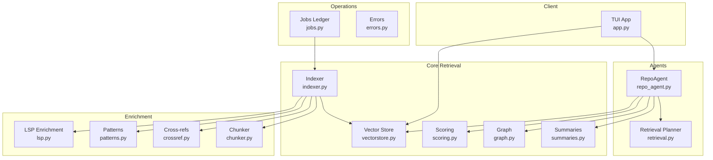
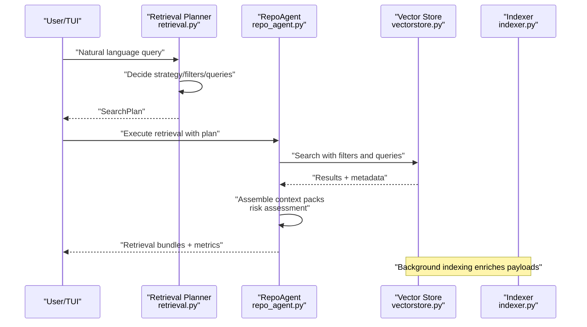
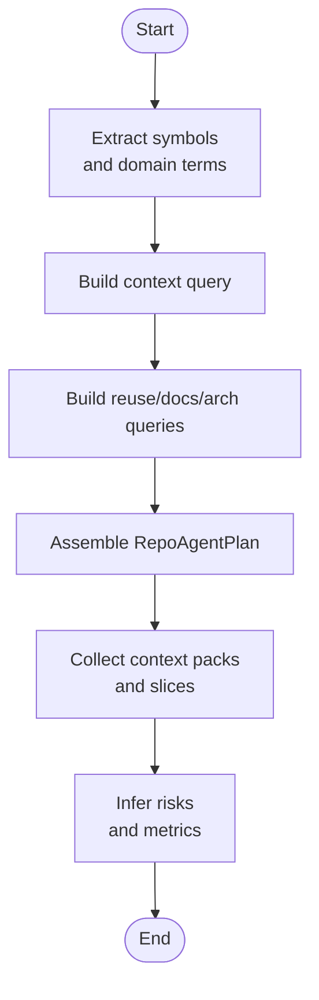
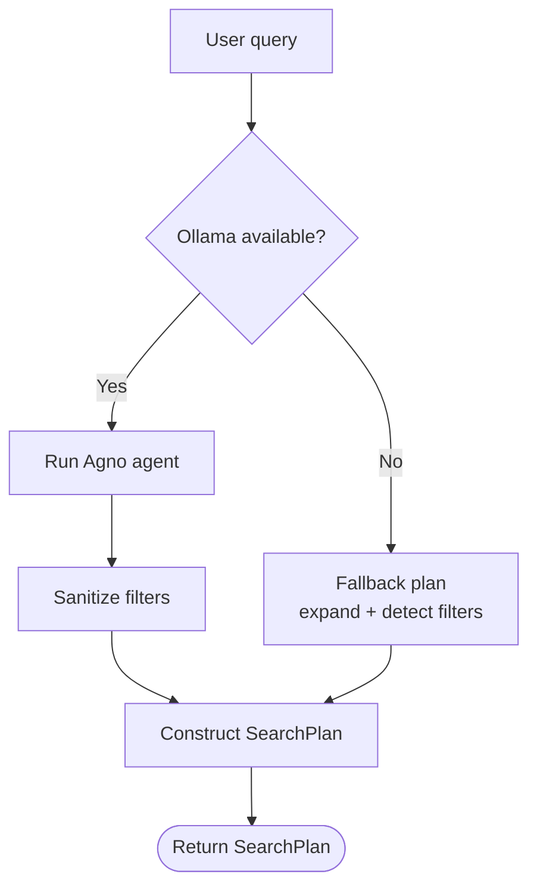
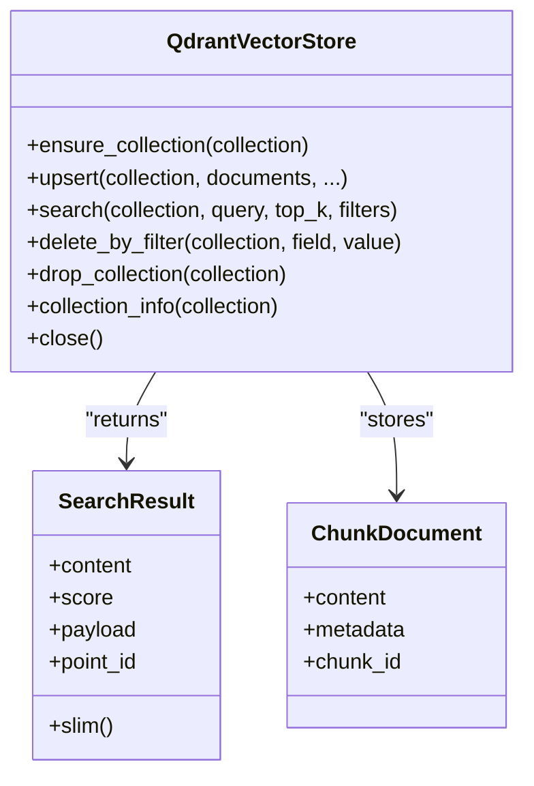
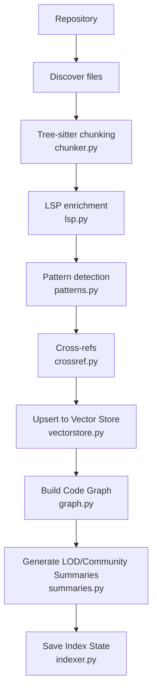
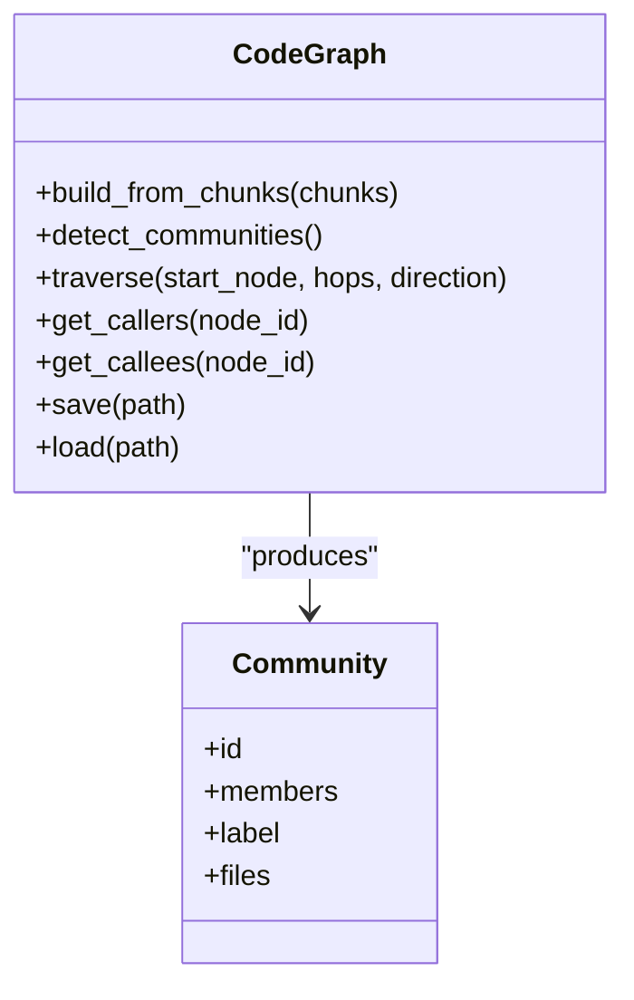
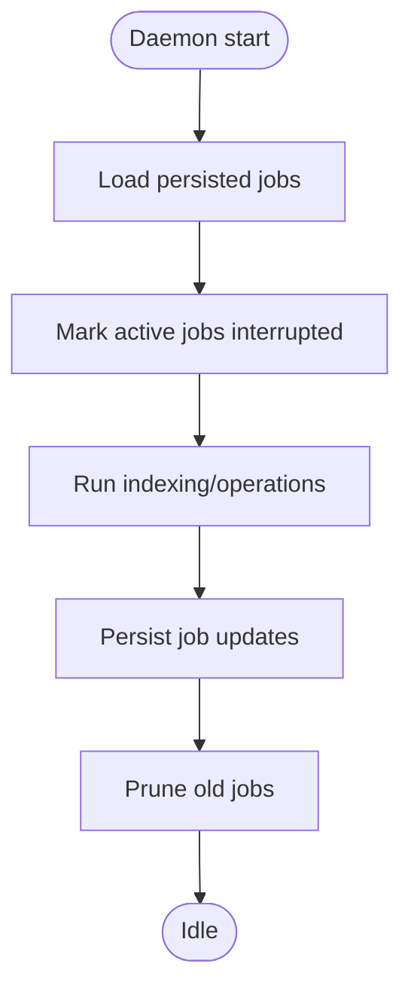
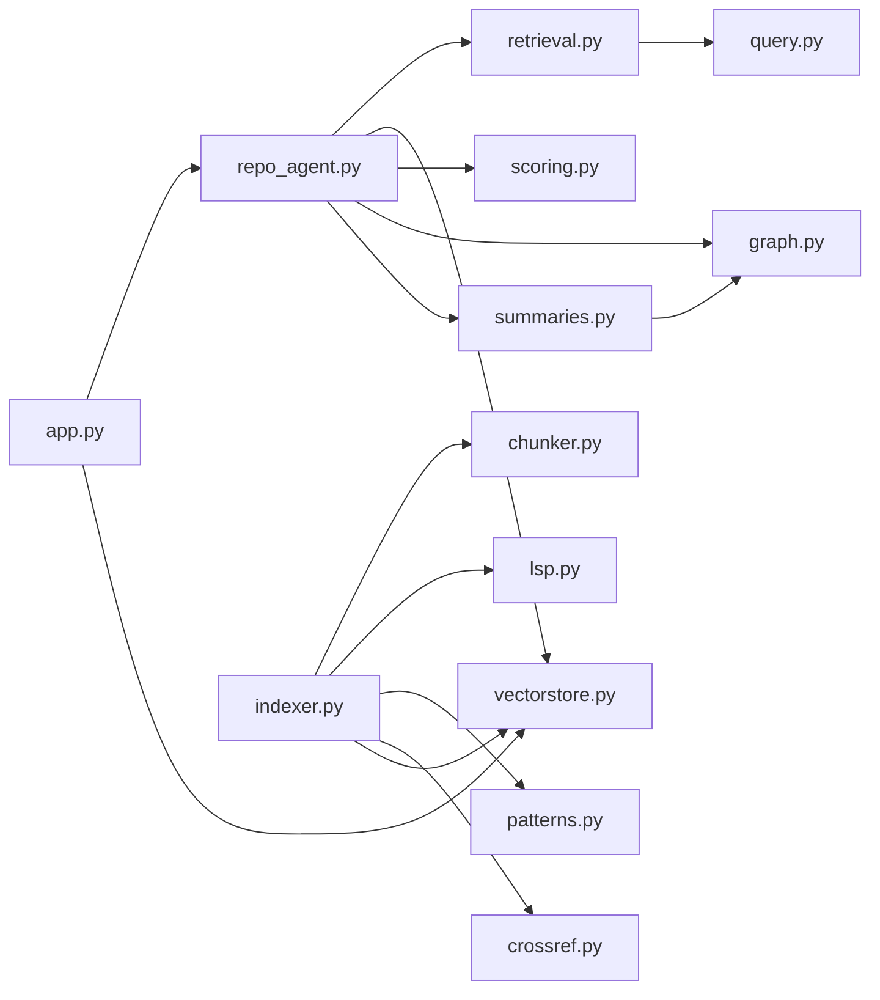

# Agent Orchestration

<cite>
**Referenced Files in This Document**
- [repo_agent.py](file://src/rag/agents/repo_agent.py)
- [retrieval.py](file://src/rag/agents/retrieval.py)
- [jobs.py](file://src/rag/core/jobs.py)
- [query.py](file://src/rag/core/query.py)
- [indexer.py](file://src/rag/core/indexer.py)
- [crossref.py](file://src/rag/core/crossref.py)
- [scoring.py](file://src/rag/core/scoring.py)
- [errors.py](file://src/rag/core/errors.py)
- [vectorstore.py](file://src/rag/core/vectorstore.py)
- [chunker.py](file://src/rag/core/chunker.py)
- [graph.py](file://src/rag/core/graph.py)
- [lsp.py](file://src/rag/core/lsp.py)
- [patterns.py](file://src/rag/core/patterns.py)
- [summaries.py](file://src/rag/core/summaries.py)
- [app.py](file://src/rag/app.py)
</cite>

## Table of Contents
1. [Introduction](#introduction)
2. [Project Structure](#project-structure)
3. [Core Components](#core-components)
4. [Architecture Overview](#architecture-overview)
5. [Detailed Component Analysis](#detailed-component-analysis)
6. [Dependency Analysis](#dependency-analysis)
7. [Performance Considerations](#performance-considerations)
8. [Troubleshooting Guide](#troubleshooting-guide)
9. [Conclusion](#conclusion)
10. [Appendices](#appendices)

## Introduction
This document explains the agent orchestration system that coordinates complex retrieval operations across repositories and contexts. It focuses on how RepoAgent plans multi-step retrieval strategies, how SearchPlan is generated from natural language queries, how context packs are constructed under token budgets, and how jobs are scheduled and monitored. It also covers symbolic reasoning for resolving code references and cross-file dependencies, error handling and fallback strategies, and performance monitoring and optimization of agent workflows.

## Project Structure
The orchestration system spans several modules:
- Agents: RepoAgent orchestrates retrieval plans and context pack assembly.
- Retrieval: The Agno-based planner generates SearchPlan with strategy, filters, and queries.
- Core retrieval and indexing: Vector store, chunking, scoring, LSP enrichment, and summaries.
- Job ledger: Persistent job tracking for daemon-managed background work.
- Cross-modal enrichment: Code-doc cross-reference detection.
- TUI: Interactive client that polls daemon state and triggers retrieval.

**Diagram sources**
- [repo_agent.py:1-563](file://src/rag/agents/repo_agent.py#L1-L563)
- [retrieval.py:1-304](file://src/rag/agents/retrieval.py#L1-L304)
- [indexer.py:1-740](file://src/rag/core/indexer.py#L1-L740)
- [vectorstore.py:1-530](file://src/rag/core/vectorstore.py#L1-L530)
- [scoring.py:1-143](file://src/rag/core/scoring.py#L1-L143)
- [graph.py:1-267](file://src/rag/core/graph.py#L1-L267)
- [summaries.py:1-469](file://src/rag/core/summaries.py#L1-L469)
- [lsp.py:1-404](file://src/rag/core/lsp.py#L1-L404)
- [patterns.py:1-398](file://src/rag/core/patterns.py#L1-L398)
- [crossref.py:1-90](file://src/rag/core/crossref.py#L1-L90)
- [chunker.py:1-622](file://src/rag/core/chunker.py#L1-L622)
- [jobs.py:1-68](file://src/rag/core/jobs.py#L1-L68)
- [errors.py:1-30](file://src/rag/core/errors.py#L1-L30)
- [app.py:1-800](file://src/rag/app.py#L1-L800)

**Section sources**
- [repo_agent.py:1-563](file://src/rag/agents/repo_agent.py#L1-L563)
- [retrieval.py:1-304](file://src/rag/agents/retrieval.py#L1-L304)
- [indexer.py:1-740](file://src/rag/core/indexer.py#L1-L740)
- [vectorstore.py:1-530](file://src/rag/core/vectorstore.py#L1-L530)
- [scoring.py:1-143](file://src/rag/core/scoring.py#L1-L143)
- [graph.py:1-267](file://src/rag/core/graph.py#L1-L267)
- [summaries.py:1-469](file://src/rag/core/summaries.py#L1-L469)
- [lsp.py:1-404](file://src/rag/core/lsp.py#L1-L404)
- [patterns.py:1-398](file://src/rag/core/patterns.py#L1-L398)
- [crossref.py:1-90](file://src/rag/core/crossref.py#L1-L90)
- [chunker.py:1-622](file://src/rag/core/chunker.py#L1-L622)
- [jobs.py:1-68](file://src/rag/core/jobs.py#L1-L68)
- [errors.py:1-30](file://src/rag/core/errors.py#L1-L30)
- [app.py:1-800](file://src/rag/app.py#L1-L800)

## Core Components
- RepoAgent orchestrator: Builds a deterministic plan from a natural language query, expands domain-specific terms, and constructs context packs for reuse, documentation, architecture, and call-tree exploration. It also evaluates risks and metrics for the retrieval outcome.
- Retrieval planner: Uses an Agno agent to decide strategy, filters, and queries; degrades gracefully to a fallback when the LLM is unavailable.
- Vector store and search: Dense-only vector search with payload filtering, embedding caching, and timing instrumentation.
- Indexing pipeline: Tree-sitter chunking, LSP enrichment, pattern detection, and LOD/summaries generation.
- Symbolic reasoning: Graph-based call/cross-file relationships, community detection, and cross-reference detection between docs and code.
- Job ledger: Persistent job registry for daemon-managed background indexing and maintenance.
- Scoring: Weighted relevance scoring incorporating recency, pattern relevance, and code quality signals.
- TUI: Client that polls daemon status and executes retrieval/search requests.

**Section sources**
- [repo_agent.py:167-377](file://src/rag/agents/repo_agent.py#L167-L377)
- [retrieval.py:85-304](file://src/rag/agents/retrieval.py#L85-L304)
- [vectorstore.py:199-466](file://src/rag/core/vectorstore.py#L199-L466)
- [indexer.py:242-550](file://src/rag/core/indexer.py#L242-L550)
- [graph.py:39-267](file://src/rag/core/graph.py#L39-L267)
- [summaries.py:71-149](file://src/rag/core/summaries.py#L71-L149)
- [jobs.py:25-68](file://src/rag/core/jobs.py#L25-L68)
- [scoring.py:31-143](file://src/rag/core/scoring.py#L31-L143)
- [app.py:722-800](file://src/rag/app.py#L722-L800)

## Architecture Overview
The orchestration integrates a planner-driven strategy with deterministic and semantic retrieval, guided by a vector store and enriched knowledge graph.

**Diagram sources**
- [retrieval.py:203-304](file://src/rag/agents/retrieval.py#L203-L304)
- [repo_agent.py:351-377](file://src/rag/agents/repo_agent.py#L351-L377)
- [vectorstore.py:424-466](file://src/rag/core/vectorstore.py#L424-L466)
- [indexer.py:242-550](file://src/rag/core/indexer.py#L242-L550)

## Detailed Component Analysis

### RepoAgent: Planning and Context Pack Construction
RepoAgent transforms a natural language query into a deterministic retrieval plan and assembles context packs:
- Symbol extraction and domain expansion
- Context query construction
- Deterministic reuse and documentation queries
- Architecture-focused queries
- Call-tree symbol selection
- Risk inference and evaluation metrics

**Diagram sources**
- [repo_agent.py:194-377](file://src/rag/agents/repo_agent.py#L194-L377)

**Section sources**
- [repo_agent.py:167-377](file://src/rag/agents/repo_agent.py#L167-L377)
- [repo_agent.py:508-563](file://src/rag/agents/repo_agent.py#L508-L563)

### Retrieval Planner: SearchPlan Generation
The planner decides strategy, filters, and queries. It validates filter values and falls back to query expansion when the LLM is unavailable.

**Diagram sources**
- [retrieval.py:100-118](file://src/rag/agents/retrieval.py#L100-L118)
- [retrieval.py:203-241](file://src/rag/agents/retrieval.py#L203-L241)
- [retrieval.py:243-304](file://src/rag/agents/retrieval.py#L243-L304)

**Section sources**
- [retrieval.py:85-304](file://src/rag/agents/retrieval.py#L85-L304)
- [query.py:31-52](file://src/rag/core/query.py#L31-L52)

### Vector Store and Search
Vector search is dense-only with payload filtering and embedding caching. Upsert validates dimensions and caches embeddings to reduce redundant work.

**Diagram sources**
- [vectorstore.py:199-466](file://src/rag/core/vectorstore.py#L199-L466)

**Section sources**
- [vectorstore.py:199-466](file://src/rag/core/vectorstore.py#L199-L466)

### Indexing Pipeline and Enrichment
The indexer performs incremental git-based indexing with tree-sitter chunking, LSP enrichment, pattern detection, and cross-reference enrichment. It maintains atomic state and supports LOD/summaries.

**Diagram sources**
- [indexer.py:242-550](file://src/rag/core/indexer.py#L242-L550)
- [chunker.py:385-622](file://src/rag/core/chunker.py#L385-L622)
- [lsp.py:313-404](file://src/rag/core/lsp.py#L313-L404)
- [patterns.py:164-398](file://src/rag/core/patterns.py#L164-L398)
- [crossref.py:41-90](file://src/rag/core/crossref.py#L41-L90)
- [graph.py:47-129](file://src/rag/core/graph.py#L47-L129)
- [summaries.py:71-149](file://src/rag/core/summaries.py#L71-L149)

**Section sources**
- [indexer.py:242-550](file://src/rag/core/indexer.py#L242-L550)
- [chunker.py:25-622](file://src/rag/core/chunker.py#L25-L622)
- [lsp.py:1-404](file://src/rag/core/lsp.py#L1-L404)
- [patterns.py:1-398](file://src/rag/core/patterns.py#L1-L398)
- [crossref.py:1-90](file://src/rag/core/crossref.py#L1-L90)
- [graph.py:1-267](file://src/rag/core/graph.py#L1-L267)
- [summaries.py:1-469](file://src/rag/core/summaries.py#L1-L469)

### Symbolic Reasoning and Cross-File Dependencies
Symbolic reasoning leverages:
- Code graph built from LSP and metadata
- Community detection for module clustering
- Cross-file call graphs and inheritance
- Cross-modal references between docs and code

**Diagram sources**
- [graph.py:39-267](file://src/rag/core/graph.py#L39-L267)

**Section sources**
- [graph.py:47-129](file://src/rag/core/graph.py#L47-L129)
- [crossref.py:29-90](file://src/rag/core/crossref.py#L29-L90)

### Job Scheduling and Monitoring
The job ledger persists and prunes background jobs, marking active jobs interrupted on restart. The TUI polls daemon status and metrics.

**Diagram sources**
- [jobs.py:37-68](file://src/rag/core/jobs.py#L37-L68)

**Section sources**
- [jobs.py:25-68](file://src/rag/core/jobs.py#L25-L68)
- [app.py:363-685](file://src/rag/app.py#L363-L685)

### Agent Collaboration Patterns
Common collaboration patterns include:
- Refactoring coordination: Use architecture queries to discover module boundaries and dependencies, then gather reuse queries to find existing helpers before introducing new code.
- Architectural analysis: Build project-understand modules and leverage LOD summaries to drill down from module to file to code chunks.

These patterns are encoded in RepoAgent’s architecture detection and query construction helpers.

**Section sources**
- [repo_agent.py:313-336](file://src/rag/agents/repo_agent.py#L313-L336)
- [repo_agent.py:287-311](file://src/rag/agents/repo_agent.py#L287-L311)
- [repo_agent.py:240-284](file://src/rag/agents/repo_agent.py#L240-L284)
- [summaries.py:350-462](file://src/rag/core/summaries.py#L350-L462)

## Dependency Analysis
Key dependencies and coupling:
- RepoAgent depends on SearchPlan generation and vector store search.
- Retrieval planner depends on LLM availability and query expansion utilities.
- Indexer depends on chunker, LSP, patterns, crossref, and vector store.
- Graph and summaries depend on code chunks and LLM for generation.
- TUI depends on daemon endpoints for status, queries, and collections.

**Diagram sources**
- [retrieval.py:1-304](file://src/rag/agents/retrieval.py#L1-L304)
- [repo_agent.py:1-563](file://src/rag/agents/repo_agent.py#L1-L563)
- [indexer.py:1-740](file://src/rag/core/indexer.py#L1-L740)
- [vectorstore.py:1-530](file://src/rag/core/vectorstore.py#L1-L530)
- [scoring.py:1-143](file://src/rag/core/scoring.py#L1-L143)
- [graph.py:1-267](file://src/rag/core/graph.py#L1-L267)
- [summaries.py:1-469](file://src/rag/core/summaries.py#L1-L469)
- [lsp.py:1-404](file://src/rag/core/lsp.py#L1-L404)
- [patterns.py:1-398](file://src/rag/core/patterns.py#L1-L398)
- [crossref.py:1-90](file://src/rag/core/crossref.py#L1-L90)
- [chunker.py:1-622](file://src/rag/core/chunker.py#L1-L622)
- [query.py:1-52](file://src/rag/core/query.py#L1-L52)
- [app.py:1-800](file://src/rag/app.py#L1-L800)

**Section sources**
- [retrieval.py:1-304](file://src/rag/agents/retrieval.py#L1-L304)
- [repo_agent.py:1-563](file://src/rag/agents/repo_agent.py#L1-L563)
- [indexer.py:1-740](file://src/rag/core/indexer.py#L1-L740)
- [vectorstore.py:1-530](file://src/rag/core/vectorstore.py#L1-L530)
- [scoring.py:1-143](file://src/rag/core/scoring.py#L1-L143)
- [graph.py:1-267](file://src/rag/core/graph.py#L1-L267)
- [summaries.py:1-469](file://src/rag/core/summaries.py#L1-L469)
- [lsp.py:1-404](file://src/rag/core/lsp.py#L1-L404)
- [patterns.py:1-398](file://src/rag/core/patterns.py#L1-L398)
- [crossref.py:1-90](file://src/rag/core/crossref.py#L1-L90)
- [chunker.py:1-622](file://src/rag/core/chunker.py#L1-L622)
- [query.py:1-52](file://src/rag/core/query.py#L1-L52)
- [app.py:1-800](file://src/rag/app.py#L1-L800)

## Performance Considerations
- Embedding caching: Reduce repeated embeddings during upserts.
- Batched upserts: Align with embedder sub-batches to minimize HTTP overhead.
- Payload indexes: Enable payload indexes in server mode to accelerate filtering.
- LOD summaries: Hierarchical summaries reduce token costs by drilling down from module to file to code chunks.
- Scoring weights: Adjust recency, pattern, and quality weights to emphasize relevant signals.
- Indexing granularity: Tree-sitter chunking balances coverage and precision; tune max chunk size and overlap.
- LSP timeouts: Configure LSP timeouts to prevent long hangs during enrichment.

[No sources needed since this section provides general guidance]

## Troubleshooting Guide
- LLM unavailability: The planner falls back to query expansion and filter detection.
- Embedding dimension mismatch: Collection dimension validation prevents silent corruption; re-index with full rebuild.
- Missing embeddings during upsert: Logs an error and skips the chunk; investigate embedder configuration.
- Daemon connectivity: TUI polls endpoints and warns on non-200 responses; ensure daemon is running.
- Interrupted jobs: Active jobs are marked interrupted on restart; prune old jobs to manage disk usage.
- LSP server detection: If no LSP servers are found, enrichment is skipped; install and configure language servers.

**Section sources**
- [retrieval.py:203-241](file://src/rag/agents/retrieval.py#L203-L241)
- [vectorstore.py:274-278](file://src/rag/core/vectorstore.py#L274-L278)
- [vectorstore.py:377-383](file://src/rag/core/vectorstore.py#L377-L383)
- [app.py:301-331](file://src/rag/app.py#L301-L331)
- [jobs.py:37-55](file://src/rag/core/jobs.py#L37-L55)
- [lsp.py:100-118](file://src/rag/core/lsp.py#L100-L118)

## Conclusion
The agent orchestration system combines a planner-driven SearchPlan with deterministic and semantic retrieval, enriched by a robust indexing pipeline and symbolic reasoning. RepoAgent coordinates multi-step retrieval across repositories and contexts, respects token budgets through context pack construction, and provides risk-aware evaluation. The system offers graceful fallbacks, persistent job management, and performance optimizations for scalable developer workflows.

[No sources needed since this section summarizes without analyzing specific files]

## Appendices
- Example usage patterns:
  - Refactoring coordination: Build reuse queries to locate existing patterns before adding new ones.
  - Architectural analysis: Use architecture queries and LOD summaries to explore module boundaries and dependencies.
- Metrics and evaluation: Use RepoAgent’s risk inference and evaluation metrics to assess retrieval quality and correctness.

[No sources needed since this section provides general guidance]