# Code Chunking and Indexing

<cite>
**Referenced Files in This Document**
- [chunker.py](file://src/rag/core/chunker.py)
- [indexer.py](file://src/rag/core/indexer.py)
- [vectorstore.py](file://src/rag/core/vectorstore.py)
- [ast_index.py](file://src/rag/core/ast_index.py)
- [crossref.py](file://src/rag/core/crossref.py)
- [patterns.py](file://src/rag/core/patterns.py)
- [config.py](file://src/rag/config.py)
- [test_chunker.py](file://tests/test_chunker.py)
</cite>

## Table of Contents
1. [Introduction](#introduction)
2. [Project Structure](#project-structure)
3. [Core Components](#core-components)
4. [Architecture Overview](#architecture-overview)
5. [Detailed Component Analysis](#detailed-component-analysis)
6. [Dependency Analysis](#dependency-analysis)
7. [Performance Considerations](#performance-considerations)
8. [Troubleshooting Guide](#troubleshooting-guide)
9. [Conclusion](#conclusion)

## Introduction
This document explains the code chunking and indexing system that powers semantic retrieval across multiple programming languages. It covers the Tree-Sitter-based chunking pipeline, AST indexing, chunk boundary detection, metadata enrichment, and the end-to-end ingestion pipeline that feeds a vector store for efficient search.

## Project Structure
The chunking and indexing system spans several modules:
- Chunking engine: parses source code into semantic chunks using Tree-Sitter grammars
- Indexing pipeline: discovers files, chunks them, enriches metadata, and upserts into Qdrant
- Vector store: dense embeddings with payload indexes for filtering and retrieval
- AST index adapter: optional fast symbol/usage lookup via an external CLI
- Cross-reference detector: enriches documentation with code symbol references
- Pattern detector: extracts design patterns and quality signals for Python

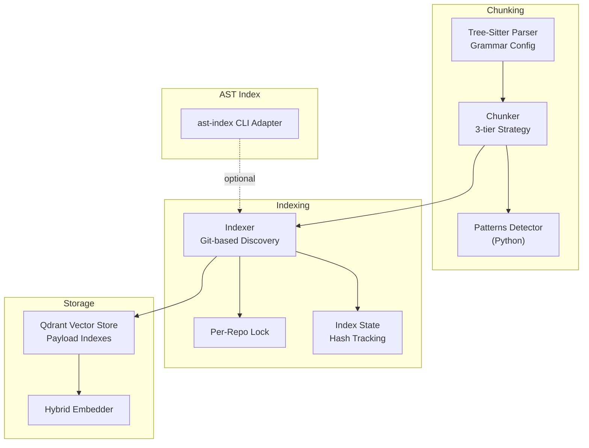

**Diagram sources**
- [chunker.py:385-443](file://src/rag/core/chunker.py#L385-L443)
- [indexer.py:242-550](file://src/rag/core/indexer.py#L242-L550)
- [vectorstore.py:199-422](file://src/rag/core/vectorstore.py#L199-L422)
- [ast_index.py:77-110](file://src/rag/core/ast_index.py#L77-L110)

**Section sources**
- [chunker.py:1-622](file://src/rag/core/chunker.py#L1-L622)
- [indexer.py:1-740](file://src/rag/core/indexer.py#L1-L740)
- [vectorstore.py:1-530](file://src/rag/core/vectorstore.py#L1-L530)
- [ast_index.py:1-635](file://src/rag/core/ast_index.py#L1-L635)

## Core Components
- Tree-Sitter-based chunker: Implements a three-tier strategy (file summary, class/method summary, function detail) with language-specific grammar configurations and fallback sliding window chunking.
- Indexer: Discovers files, computes incremental changes, chunks and enriches, batches upserts, and maintains index state.
- Vector store: Dense vector search with payload indexes enabling keyword and numeric filtering.
- AST index adapter: Optional exact symbol lookup and call graphs via an external CLI.
- Cross-reference detector: Extracts code symbol references from documentation for cross-modal retrieval.
- Pattern detector: Rich metadata for Python including design patterns, complexity, concurrency, and domain layers.

**Section sources**
- [chunker.py:25-82](file://src/rag/core/chunker.py#L25-L82)
- [indexer.py:101-169](file://src/rag/core/indexer.py#L101-L169)
- [vectorstore.py:23-73](file://src/rag/core/vectorstore.py#L23-L73)
- [ast_index.py:38-71](file://src/rag/core/ast_index.py#L38-L71)
- [crossref.py:16-62](file://src/rag/core/crossref.py#L16-L62)
- [patterns.py:15-41](file://src/rag/core/patterns.py#L15-L41)

## Architecture Overview
The ingestion pipeline integrates discovery, chunking, enrichment, embedding, and upsert into Qdrant. It supports incremental runs by tracking file hashes and last commit, and it maintains payload indexes for efficient filtering.

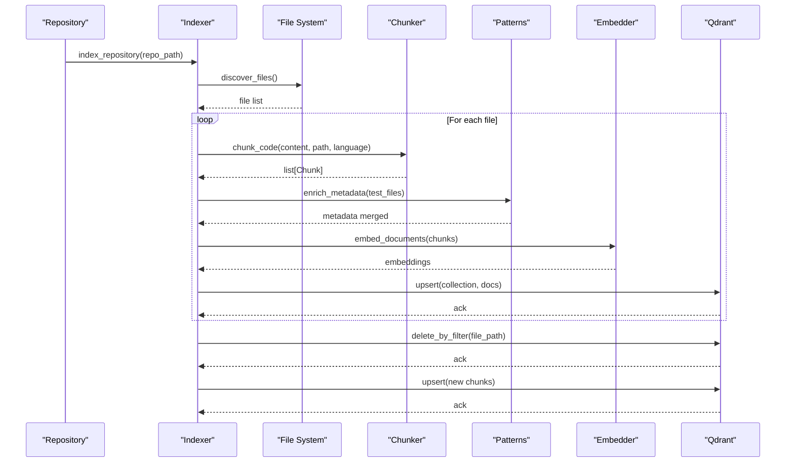

**Diagram sources**
- [indexer.py:242-550](file://src/rag/core/indexer.py#L242-L550)
- [chunker.py:385-443](file://src/rag/core/chunker.py#L385-L443)
- [patterns.py:164-349](file://src/rag/core/patterns.py#L164-L349)
- [vectorstore.py:296-422](file://src/rag/core/vectorstore.py#L296-L422)

## Detailed Component Analysis

### Tree-Sitter Chunker
The chunker builds semantic chunks using Tree-Sitter parsers configured per language. It defines:
- Language configuration mapping grammar modules, node types, and fields
- Three-tier chunking:
  - File summary: imports and top-level declarations
  - Class summary: class/interface signature and member signatures
  - Function detail: full function body with a context header
- Fallback sliding window chunking for unsupported or unparsable files
- Metadata enrichment for Python and Kotlin/Java heuristics

Key behaviors:
- Language detection from file extensions
- Parser selection with special handling for TypeScript sub-language and community-pack languages
- Node name resolution across languages (including Dart’s split signature/body)
- Context header injection to preserve file/class/language context in function chunks

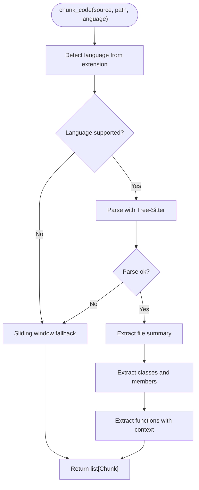

**Diagram sources**
- [chunker.py:385-443](file://src/rag/core/chunker.py#L385-L443)
- [chunker.py:588-613](file://src/rag/core/chunker.py#L588-L613)

**Section sources**
- [chunker.py:190-300](file://src/rag/core/chunker.py#L190-L300)
- [chunker.py:314-374](file://src/rag/core/chunker.py#L314-L374)
- [chunker.py:385-443](file://src/rag/core/chunker.py#L385-L443)
- [chunker.py:458-537](file://src/rag/core/chunker.py#L458-L537)
- [chunker.py:588-613](file://src/rag/core/chunker.py#L588-L613)

### Language Configuration and Grammar Selection
The system supports multiple languages with tailored grammar modules and node-type mappings. It includes:
- Standard tree-sitter-* packages for most languages
- Community-pack loader for languages without standalone wheels
- Special handling for TypeScript sub-language
- Extension-to-language mapping for discovery

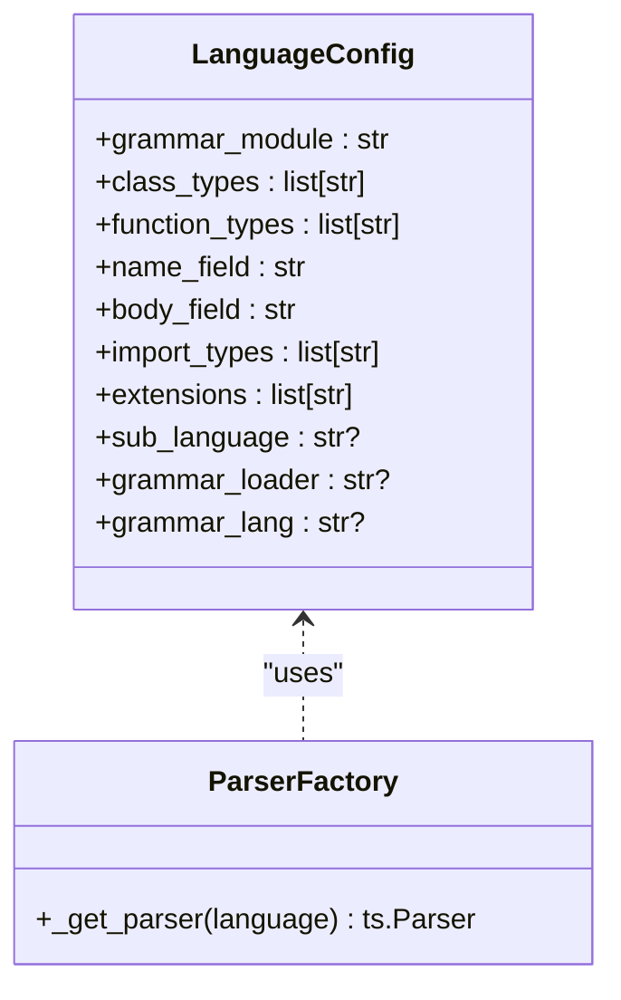

**Diagram sources**
- [chunker.py:190-300](file://src/rag/core/chunker.py#L190-L300)
- [chunker.py:314-336](file://src/rag/core/chunker.py#L314-L336)

**Section sources**
- [chunker.py:190-300](file://src/rag/core/chunker.py#L190-L300)
- [chunker.py:309-336](file://src/rag/core/chunker.py#L309-L336)

### Chunk Boundary Detection and Context Preservation
Boundary detection leverages Tree-Sitter node types and fields:
- Class boundaries: class bodies and blocks containing member functions
- Function boundaries: function definitions with optional Dart body merging
- Context preservation: each function chunk includes a header with file path, class, and language

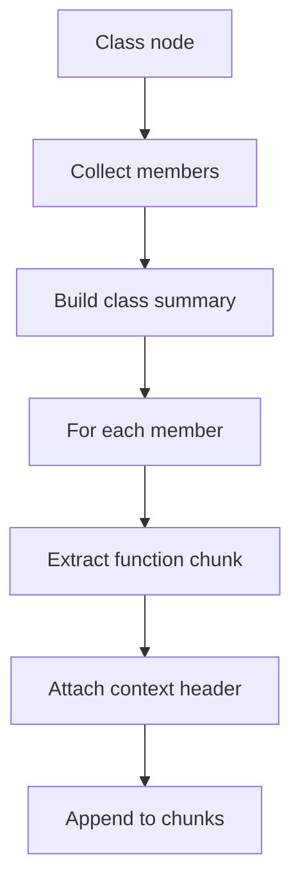

**Diagram sources**
- [chunker.py:446-494](file://src/rag/core/chunker.py#L446-L494)
- [chunker.py:496-537](file://src/rag/core/chunker.py#L496-L537)
- [chunker.py:377-382](file://src/rag/core/chunker.py#L377-L382)

**Section sources**
- [chunker.py:446-494](file://src/rag/core/chunker.py#L446-L494)
- [chunker.py:496-537](file://src/rag/core/chunker.py#L496-L537)
- [chunker.py:377-382](file://src/rag/core/chunker.py#L377-L382)

### Metadata Enrichment and Indexing Metadata
Chunks carry structured metadata for filtering and retrieval:
- Core fields: file_path, language, chunk_type, name, parent_name, start_line, end_line, content_hash
- Language-specific flags: coroutine/singletons/interfaces/etc.
- Python-specific patterns: design patterns, complexity metrics, concurrency, domains, layers, decorators, tests
- Cross-reference enrichment for documentation chunks

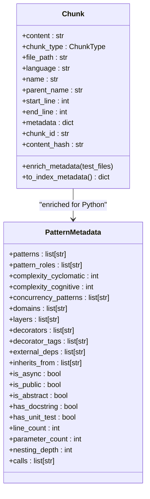

**Diagram sources**
- [chunker.py:35-81](file://src/rag/core/chunker.py#L35-L81)
- [patterns.py:164-349](file://src/rag/core/patterns.py#L164-L349)
- [crossref.py:41-62](file://src/rag/core/crossref.py#L41-L62)

**Section sources**
- [chunker.py:58-81](file://src/rag/core/chunker.py#L58-L81)
- [patterns.py:164-349](file://src/rag/core/patterns.py#L164-L349)
- [crossref.py:41-76](file://src/rag/core/crossref.py#L41-L76)

### Vector Store and Payload Indexes
The vector store uses dense embeddings and payload indexes for filtering:
- Payload indexes include structural, pattern/architecture, code quality, and dependency fields
- Upsert pipeline embeds content, validates dimensions, and writes to Qdrant
- Search pushes filters into Qdrant to avoid recall loss from post-filtering

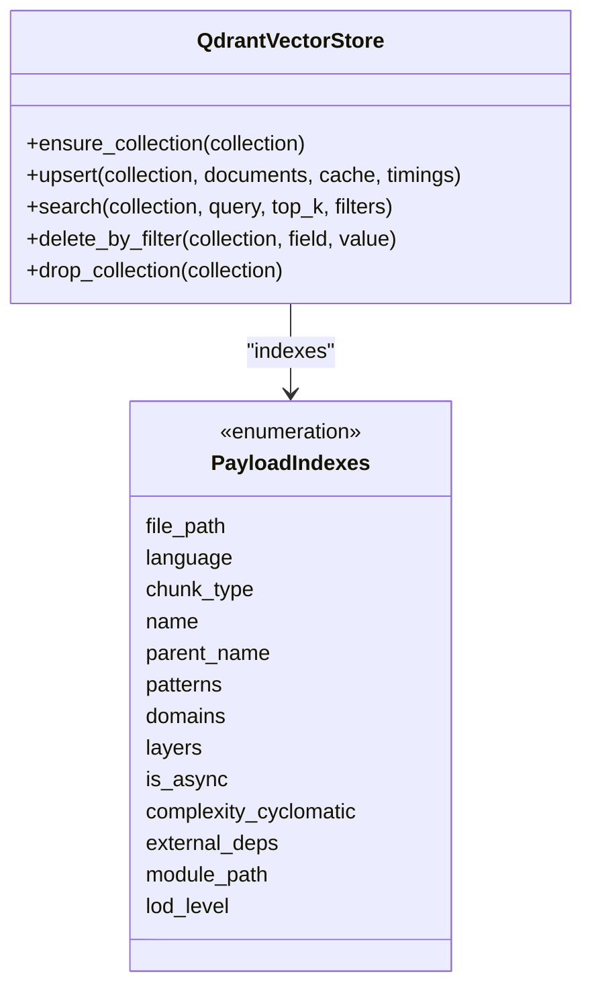

**Diagram sources**
- [vectorstore.py:199-422](file://src/rag/core/vectorstore.py#L199-L422)
- [vectorstore.py:23-73](file://src/rag/core/vectorstore.py#L23-L73)

**Section sources**
- [vectorstore.py:23-73](file://src/rag/core/vectorstore.py#L23-L73)
- [vectorstore.py:296-422](file://src/rag/core/vectorstore.py#L296-L422)
- [vectorstore.py:424-465](file://src/rag/core/vectorstore.py#L424-L465)

### AST Index Adapter
The optional AST index adapter provides fast exact symbol and usage lookup:
- Resolves symbols and usages via an external CLI
- Builds call trees and caller lists
- Ranks hits by proximity and context
- Attaches compact code slices around matched lines

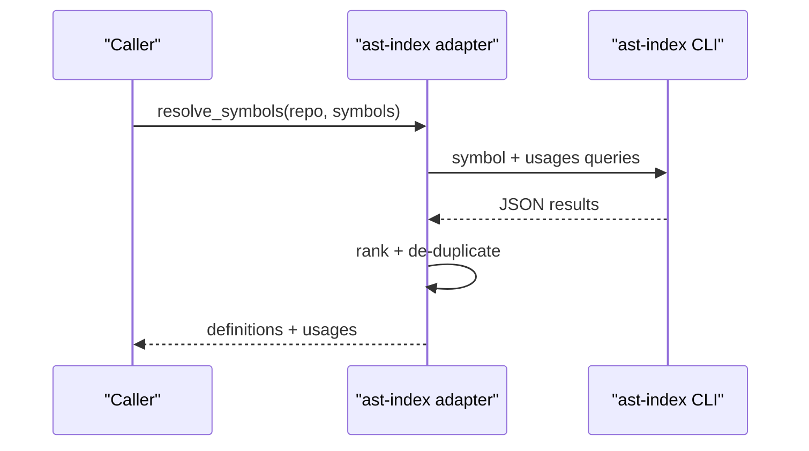

**Diagram sources**
- [ast_index.py:112-146](file://src/rag/core/ast_index.py#L112-L146)
- [ast_index.py:340-387](file://src/rag/core/ast_index.py#L340-L387)

**Section sources**
- [ast_index.py:77-110](file://src/rag/core/ast_index.py#L77-L110)
- [ast_index.py:112-146](file://src/rag/core/ast_index.py#L112-L146)
- [ast_index.py:439-508](file://src/rag/core/ast_index.py#L439-L508)

### Cross-Reference Detection for Docs
Documentation chunks can be enriched with references to code symbols:
- Extracts backtick identifiers, file paths, CamelCase, and snake_case function references
- Optionally filters to known symbols for precision
- Limits references to avoid payload bloat

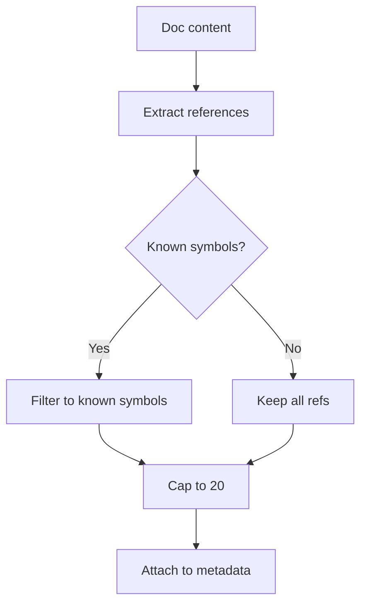

**Diagram sources**
- [crossref.py:29-62](file://src/rag/core/crossref.py#L29-L62)

**Section sources**
- [crossref.py:16-76](file://src/rag/core/crossref.py#L16-L76)

### End-to-End Indexing Pipeline
The indexer orchestrates discovery, chunking, enrichment, batching, and upsert:
- Per-repo advisory lock prevents concurrent runs
- Git-based incremental detection of changed files and commits
- Thread pool chunking to avoid blocking the event loop
- Batched upsert with payload deletion for changed files
- Optional LSP enrichment and post-index maintenance

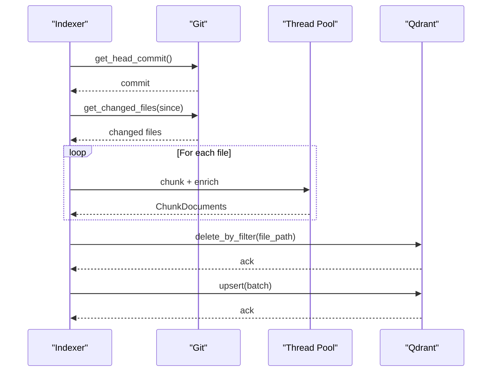

**Diagram sources**
- [indexer.py:242-550](file://src/rag/core/indexer.py#L242-L550)
- [indexer.py:379-422](file://src/rag/core/indexer.py#L379-L422)

**Section sources**
- [indexer.py:54-99](file://src/rag/core/indexer.py#L54-L99)
- [indexer.py:175-213](file://src/rag/core/indexer.py#L175-L213)
- [indexer.py:242-550](file://src/rag/core/indexer.py#L242-L550)

## Dependency Analysis
The system exhibits clear separation of concerns:
- chunker depends on Tree-Sitter grammars and language configs
- indexer depends on chunker, vectorstore, and git operations
- vectorstore depends on embedder and Qdrant client
- ast_index is optional and best-effort
- crossref and patterns augment metadata

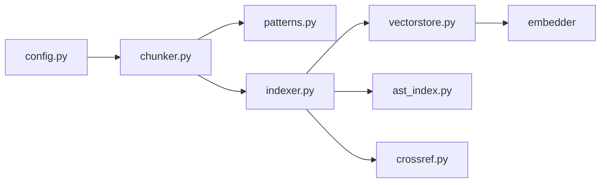

**Diagram sources**
- [config.py:83-90](file://src/rag/config.py#L83-L90)
- [chunker.py:1-22](file://src/rag/core/chunker.py#L1-L22)
- [indexer.py:17-19](file://src/rag/core/indexer.py#L17-L19)
- [vectorstore.py:15-19](file://src/rag/core/vectorstore.py#L15-L19)
- [ast_index.py:1-21](file://src/rag/core/ast_index.py#L1-L21)
- [crossref.py:7-14](file://src/rag/core/crossref.py#L7-L14)
- [patterns.py:8-12](file://src/rag/core/patterns.py#L8-L12)

**Section sources**
- [chunker.py:1-22](file://src/rag/core/chunker.py#L1-L22)
- [indexer.py:17-19](file://src/rag/core/indexer.py#L17-L19)
- [vectorstore.py:15-19](file://src/rag/core/vectorstore.py#L15-L19)
- [ast_index.py:1-21](file://src/rag/core/ast_index.py#L1-L21)
- [crossref.py:7-14](file://src/rag/core/crossref.py#L7-L14)
- [patterns.py:8-12](file://src/rag/core/patterns.py#L8-L12)

## Performance Considerations
- Chunk size optimization: controlled by configuration to balance precision and computational cost
- Batched embedding and upsert reduce overhead and leverage caching
- Payload indexes enable efficient filtering without post-filtering recall loss
- Sliding window fallback ensures robustness for unsupported languages
- Thread pool chunking prevents event loop blocking during CPU-intensive parsing

Practical tuning tips:
- Adjust max_chunk_chars to trade off retrieval precision vs. embedding cost
- Tune batch_size to match embedder throughput and memory limits
- Enable/disable LSP enrichment based on latency requirements
- Use incremental indexing to minimize repeated work

**Section sources**
- [config.py:83-90](file://src/rag/config.py#L83-L90)
- [indexer.py:344-346](file://src/rag/core/indexer.py#L344-L346)
- [vectorstore.py:296-422](file://src/rag/core/vectorstore.py#L296-L422)

## Troubleshooting Guide
Common issues and resolutions:
- Parsing failures: The chunker logs parse failures and falls back to sliding window chunking
- Unknown language: Files without supported extensions are chunked via sliding window
- Dimension mismatch: Vector store enforces embedding dimension consistency and raises explicit errors
- Concurrent indexing: Per-repo advisory lock prevents race conditions on state files
- Missing ast-index: Adapter gracefully returns empty results when the CLI is unavailable

Operational checks:
- Verify language configs and grammar availability
- Confirm payload indexes exist in server mode
- Review indexing logs for parse errors and file skips
- Validate token and server settings for remote Qdrant

**Section sources**
- [chunker.py:401-403](file://src/rag/core/chunker.py#L401-L403)
- [chunker.py:390-391](file://src/rag/core/chunker.py#L390-L391)
- [vectorstore.py:274-278](file://src/rag/core/vectorstore.py#L274-L278)
- [indexer.py:54-99](file://src/rag/core/indexer.py#L54-L99)
- [ast_index.py:73-74](file://src/rag/core/ast_index.py#L73-L74)

## Conclusion
The chunking and indexing system combines Tree-Sitter-powered semantic parsing, robust fallback strategies, rich metadata enrichment, and efficient vector storage to deliver precise and scalable code retrieval. The optional AST index adapter further enhances developer navigation with exact symbol and call-graph insights, while cross-modal references bridge documentation and code for comprehensive understanding.