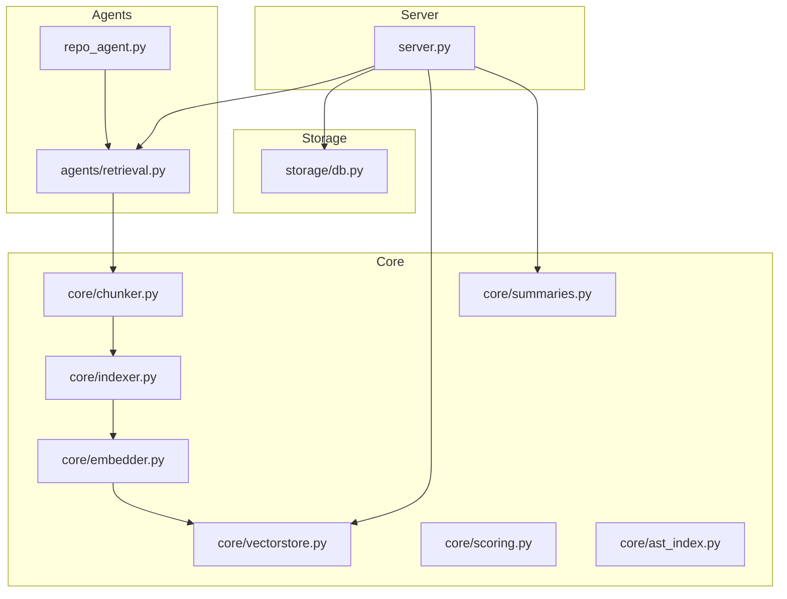
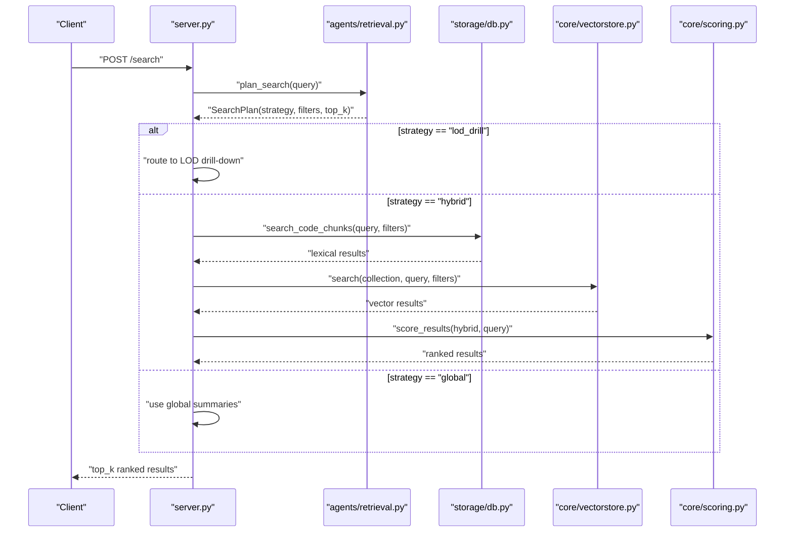
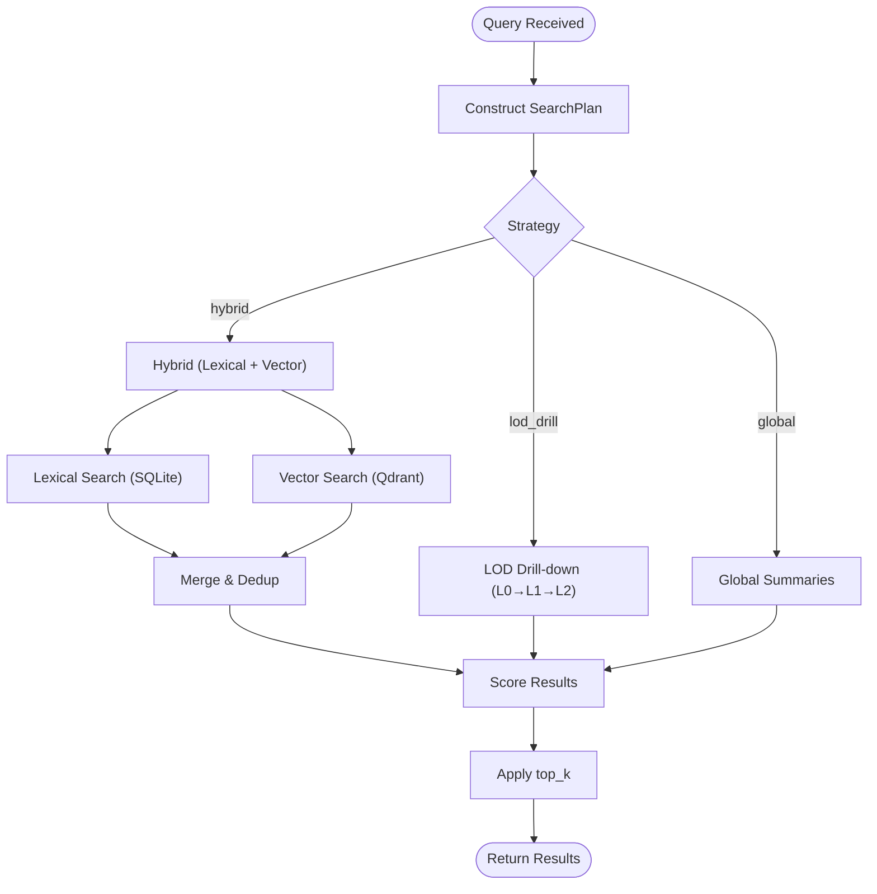
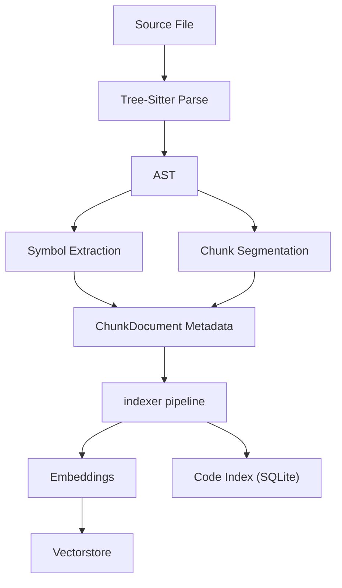
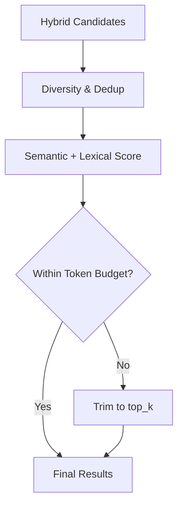
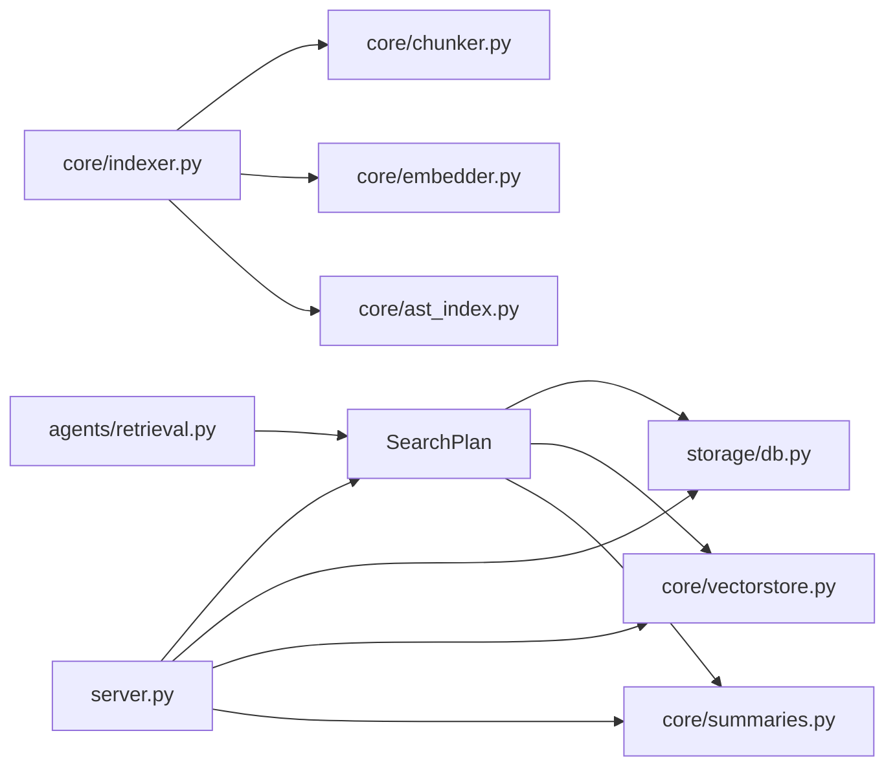

# Core Concepts

<cite>
**Referenced Files in This Document**
- [README.md](file://README.md)
- [src/rag/app.py](file://src/rag/app.py)
- [src/rag/server.py](file://src/rag/server.py)
- [src/rag/agents/retrieval.py](file://src/rag/agents/retrieval.py)
- [src/rag/core/chunker.py](file://src/rag/core/chunker.py)
- [src/rag/core/indexer.py](file://src/rag/core/indexer.py)
- [src/rag/core/scoring.py](file://src/rag/core/scoring.py)
- [src/rag/core/embedder.py](file://src/rag/core/embedder.py)
- [src/rag/core/vectorstore.py](file://src/rag/core/vectorstore.py)
- [src/rag/storage/db.py](file://src/rag/storage/db.py)
- [src/rag/core/ast_index.py](file://src/rag/core/ast_index.py)
- [src/rag/core/summaries.py](file://src/rag/core/summaries.py)
- [src/rag/agents/repo_agent.py](file://src/rag/agents/repo_agent.py)
- [docs/dodo_rag_replacement_plan.md](file://docs/dodo_rag_replacement_plan.md)
</cite>

## Table of Contents
1. [Introduction](#introduction)
2. [Project Structure](#project-structure)
3. [Core Components](#core-components)
4. [Architecture Overview](#architecture-overview)
5. [Detailed Component Analysis](#detailed-component-analysis)
6. [Dependency Analysis](#dependency-analysis)
7. [Performance Considerations](#performance-considerations)
8. [Troubleshooting Guide](#troubleshooting-guide)
9. [Conclusion](#conclusion)

## Introduction
This document explains the core concepts of Retrieval-Augmented Generation (RAG) as implemented in the system, focusing on fundamentals and system architecture. It covers retrieval strategies, vector databases and embeddings, code-aware chunking powered by Tree-Sitter, AST-based symbol indexing, token budgeting and context packaging, result scoring, and operational plans for hybrid, LOD drill-down, and global summarization modes. Terminology aligns with the codebase, including ChunkDocument, SearchPlan, RepoAgentPlan, and indexer.

## Project Structure
The RAG system is organized around:
- Agents: orchestrate retrieval and agent workflows
- Core: chunking, indexing, embeddings, vector storage, scoring, summaries, AST indexing
- Storage: code-index-backed lexical search
- Web/Server: API endpoints and routing for retrieval strategies

**Diagram sources**
- [src/rag/agents/repo_agent.py](file://src/rag/agents/repo_agent.py)
- [src/rag/agents/retrieval.py](file://src/rag/agents/retrieval.py)
- [src/rag/core/chunker.py](file://src/rag/core/chunker.py)
- [src/rag/core/indexer.py](file://src/rag/core/indexer.py)
- [src/rag/core/embedder.py](file://src/rag/core/embedder.py)
- [src/rag/core/vectorstore.py](file://src/rag/core/vectorstore.py)
- [src/rag/core/scoring.py](file://src/rag/core/scoring.py)
- [src/rag/core/ast_index.py](file://src/rag/core/ast_index.py)
- [src/rag/core/summaries.py](file://src/rag/core/summaries.py)
- [src/rag/storage/db.py](file://src/rag/storage/db.py)
- [src/rag/server.py](file://src/rag/server.py)

**Section sources**
- [README.md](file://README.md)
- [src/rag/app.py](file://src/rag/app.py)
- [src/rag/server.py](file://src/rag/server.py)

## Core Components
- ChunkDocument: the unit of indexed content produced by the chunker and stored in the vector database and code index.
- SearchPlan: encapsulates the chosen retrieval strategy, filters, and top-k for a given query.
- RepoAgentPlan: agent-level plan that orchestrates search and synthesis steps.
- indexer: the indexing pipeline that parses code, builds ASTs, extracts symbols, chunks code, and produces embeddings.

Key responsibilities:
- Chunking: code-aware segmentation via Tree-Sitter for multiple languages, preserving syntactic and semantic boundaries.
- Indexing: AST-based symbol extraction, cross-references, and chunk metadata for lexical and semantic retrieval.
- Embedding: generating dense vectors for semantic search.
- Vectorstore: persistent storage and similarity search over embeddings.
- Scoring: combining lexical, semantic, and structural signals to rank results.
- Summaries: LOD-style hierarchical summaries enabling drill-down retrieval.

**Section sources**
- [src/rag/core/chunker.py](file://src/rag/core/chunker.py)
- [src/rag/core/indexer.py](file://src/rag/core/indexer.py)
- [src/rag/core/ast_index.py](file://src/rag/core/ast_index.py)
- [src/rag/core/embedder.py](file://src/rag/core/embedder.py)
- [src/rag/core/vectorstore.py](file://src/rag/core/vectorstore.py)
- [src/rag/core/scoring.py](file://src/rag/core/scoring.py)
- [src/rag/core/summaries.py](file://src/rag/core/summaries.py)
- [src/rag/storage/db.py](file://src/rag/storage/db.py)

## Architecture Overview
The retrieval pipeline integrates lexical and semantic signals with strategy-aware routing. At query time, the server constructs a SearchPlan and dispatches to strategies:
- Hybrid: combines lexical (SQLite-backed) and vector (Qdrant) results, deduplicating and re-ranking.
- LOD drill-down: hierarchical retrieval across L0 (modules), L1 (files), L2 (chunks) summaries.
- Global summaries: top-level summaries for broad context.
- Graph walk: leverages graph neighbors for related context.

**Diagram sources**
- [src/rag/server.py](file://src/rag/server.py)
- [src/rag/agents/retrieval.py](file://src/rag/agents/retrieval.py)
- [src/rag/storage/db.py](file://src/rag/storage/db.py)
- [src/rag/core/vectorstore.py](file://src/rag/core/vectorstore.py)
- [src/rag/core/scoring.py](file://src/rag/core/scoring.py)

## Detailed Component Analysis

### Retrieval Strategies and SearchPlan
- Hybrid: merges lexical and vector results, deduplicates by payload key, promotes exact matches, and applies semantic re-ranking.
- LOD drill-down: hierarchical traversal across LOD collections (L0 modules, L1 files, L2 chunks), falling back to flat hybrid when LOD collections are unavailable.
- Global summaries: leverages top-level summaries for broad context.
- Filters and top_k: applied consistently across strategies; strategy adjustments ensure repo-scoped isolation for certain modes.

**Diagram sources**
- [src/rag/server.py](file://src/rag/server.py)
- [src/rag/agents/retrieval.py](file://src/rag/agents/retrieval.py)
- [src/rag/core/summaries.py](file://src/rag/core/summaries.py)

**Section sources**
- [src/rag/server.py](file://src/rag/server.py)
- [src/rag/agents/retrieval.py](file://src/rag/agents/retrieval.py)
- [src/rag/core/summaries.py](file://src/rag/core/summaries.py)

### Code-Aware Chunking and AST-Based Symbol Resolution
- ChunkDocument: produced by the chunker, carries metadata (file_path, language, chunk_type, name, line ranges) and content for embedding and lexical retrieval.
- Tree-Sitter parsing: language-specific parsing yields ASTs that inform chunk boundaries and symbol extraction.
- Symbol resolution: AST index captures symbols (functions, classes, properties, etc.) with attributes (kind, modifiers, signature, parent, annotations) enabling precise lexical matches and graph walks.

**Diagram sources**
- [src/rag/core/chunker.py](file://src/rag/core/chunker.py)
- [src/rag/core/indexer.py](file://src/rag/core/indexer.py)
- [src/rag/core/ast_index.py](file://src/rag/core/ast_index.py)
- [src/rag/core/embedder.py](file://src/rag/core/embedder.py)
- [src/rag/core/vectorstore.py](file://src/rag/core/vectorstore.py)

**Section sources**
- [src/rag/core/chunker.py](file://src/rag/core/chunker.py)
- [src/rag/core/indexer.py](file://src/rag/core/indexer.py)
- [src/rag/core/ast_index.py](file://src/rag/core/ast_index.py)

### Token Budgeting, Context Packaging, and Result Scoring
- Token budgeting: enforced by limiting slices and applying top_k post-scoring; hybrid mode ensures sufficient candidates before deduplication.
- Context packaging: results include structured metadata (file_path, lines, language, chunk_type) to support downstream synthesis and editing.
- Result scoring: prioritizes exact/lexical matches, applies semantic re-ranking, and enforces diversity constraints to avoid over-representation of single files or symbols.

**Diagram sources**
- [src/rag/server.py](file://src/rag/server.py)
- [src/rag/core/scoring.py](file://src/rag/core/scoring.py)

**Section sources**
- [src/rag/server.py](file://src/rag/server.py)
- [src/rag/core/scoring.py](file://src/rag/core/scoring.py)

### Operational Plans and Indexer Enhancements
- Exact symbol storage: persist AST symbols separately to enable precise symbol-level retrieval.
- Symbol search endpoint: supports filtering by kind, modifiers, path glob, and query.
- Hybrid retrieval order: prioritize exact matches over semantic noise.
- Deduplication and diversification: enforce file and symbol diversity after scoring.
- Resumable indexing: expose job identifiers, progress counters, and checkpoints.
- Resource separation: separate indexing and query embedding queues to prevent starvation.
- Tuned batching: configurable batch sizes and state checkpoints for large repositories.

**Section sources**
- [docs/dodo_rag_replacement_plan.md](file://docs/dodo_rag_replacement_plan.md)

## Dependency Analysis
The retrieval pipeline exhibits clear layering:
- Agents depend on retrieval planning and storage/vector backends.
- Indexer depends on chunker, embedder, and AST index.
- Server orchestrates strategies and coordinates storage and vectorstore.

**Diagram sources**
- [src/rag/agents/retrieval.py](file://src/rag/agents/retrieval.py)
- [src/rag/server.py](file://src/rag/server.py)
- [src/rag/core/chunker.py](file://src/rag/core/chunker.py)
- [src/rag/core/indexer.py](file://src/rag/core/indexer.py)
- [src/rag/core/embedder.py](file://src/rag/core/embedder.py)
- [src/rag/core/ast_index.py](file://src/rag/core/ast_index.py)
- [src/rag/core/vectorstore.py](file://src/rag/core/vectorstore.py)
- [src/rag/core/summaries.py](file://src/rag/core/summaries.py)
- [src/rag/storage/db.py](file://src/rag/storage/db.py)

**Section sources**
- [src/rag/agents/retrieval.py](file://src/rag/agents/retrieval.py)
- [src/rag/server.py](file://src/rag/server.py)
- [src/rag/core/chunker.py](file://src/rag/core/chunker.py)
- [src/rag/core/indexer.py](file://src/rag/core/indexer.py)
- [src/rag/core/ast_index.py](file://src/rag/core/ast_index.py)
- [src/rag/core/embedder.py](file://src/rag/core/embedder.py)
- [src/rag/core/vectorstore.py](file://src/rag/core/vectorstore.py)
- [src/rag/core/summaries.py](file://src/rag/core/summaries.py)
- [src/rag/storage/db.py](file://src/rag/storage/db.py)

## Performance Considerations
- Strategy selection: repo-scoped queries force hybrid mode to avoid cross-collection contamination.
- Hybrid tuning: adjust top_k and max_slices to balance lexical and vector coverage while respecting token budgets.
- Embedding throughput: separate queues or priorities for query-time embeddings to avoid blocking background indexing.
- LOD fallback: when LOD collections are missing, fall back to hybrid to maintain responsiveness.
- Deduplication cost: minimize redundant embeddings and lexical scans by leveraging result keys and seen sets.

[No sources needed since this section provides general guidance]

## Troubleshooting Guide
Common issues and mitigations:
- Lexical search failures: caught and logged; fallback to semantic search continues.
- Missing LOD collections: server switches to hybrid automatically.
- Overly noisy semantic results: promote exact matches and apply diversity constraints.
- Timeout during indexing: leverage resumable indexing with job identifiers and checkpoints.

**Section sources**
- [src/rag/server.py](file://src/rag/server.py)
- [docs/dodo_rag_replacement_plan.md](file://docs/dodo_rag_replacement_plan.md)

## Conclusion
The system implements a robust RAG architecture centered on code-aware chunking, AST-based symbol indexing, and hybrid retrieval strategies. SearchPlan and RepoAgentPlan orchestrate strategy selection and result ranking, while token budgeting and diversity ensure practical, high-quality outputs. The operational plan outlines enhancements for symbol-level retrieval, resumable indexing, and resource separation to scale effectively across large codebases.