# RAG Fundamentals

<cite>
**Referenced Files in This Document**
- [README.md](file://README.md)
- [src/rag/config.py](file://src/rag/config.py)
- [src/rag/core/query.py](file://src/rag/core/query.py)
- [src/rag/core/scoring.py](file://src/rag/core/scoring.py)
- [src/rag/core/embedder.py](file://src/rag/core/embedder.py)
- [src/rag/core/vectorstore.py](file://src/rag/core/vectorstore.py)
- [src/rag/core/indexer.py](file://src/rag/core/indexer.py)
- [src/rag/core/chunker.py](file://src/rag/core/chunker.py)
- [src/rag/core/lsp.py](file://src/rag/core/lsp.py)
- [src/rag/app.py](file://src/rag/app.py)
- [src/rag/agents/retrieval.py](file://src/rag/agents/retrieval.py)
- [src/rag/agents/repo_agent.py](file://src/rag/agents/repo_agent.py)
- [src/rag/server.py](file://src/rag/server.py)
- [src/rag/cli.py](file://src/rag/cli.py)
- [docs/wiki/Agent Orchestration/Query Planning and Strategy Selection.md](file://docs/wiki/Agent Orchestration/Query Planning and Strategy Selection.md)
- [docs/wiki/Search and Retrieval/Query Planning and Strategy Selection.md](file://docs/wiki/Search and Retrieval/Query Planning and Strategy Selection.md)
- [docs/deployment-linux.md](file://docs/deployment-linux.md)
- [benchmark_production_scenarios.py](file://benchmark_production_scenarios.py)
- [benchmark_refactor_effort.py](file://benchmark_refactor_effort.py)
- [benchmark_production_results.json](file://benchmark_production_results.json)
- [tests/test_query.py](file://tests/test_query.py)
- [tests/test_scoring.py](file://tests/test_scoring.py)
</cite>

## Update Summary
**Changes Made**
- Added comprehensive coverage of Smart Agent decision trees and LLM-driven strategy selection
- Integrated two-phase blast radius analysis methodology for impact assessment
- Enhanced with production deployment considerations and benchmarking frameworks
- Updated performance evaluation criteria and agent comparison methodologies
- Added detailed coverage of retrieval strategy selection and fallback mechanisms

## Table of Contents
1. [Introduction](#introduction)
2. [Project Structure](#project-structure)
3. [Core Components](#core-components)
4. [Architecture Overview](#architecture-overview)
5. [Detailed Component Analysis](#detailed-component-analysis)
6. [Smart Agent Decision Trees and Strategy Selection](#smart-agent-decision-trees-and-strategy-selection)
7. [Two-Phase Blast Radius Analysis](#two-phase-blast-radius-analysis)
8. [Production Deployment Considerations](#production-deployment-considerations)
9. [Benchmarking Methodologies and Performance Evaluation](#benchmarking-methodologies-and-performance-evaluation)
10. [Dependency Analysis](#dependency-analysis)
11. [Performance Considerations](#performance-considerations)
12. [Troubleshooting Guide](#troubleshooting-guide)
13. [Conclusion](#conclusion)
14. [Appendices](#appendices)

## Introduction
This document explains Retrieval-Augmented Generation (RAG) fundamentals using the codebase's advanced implementation. It focuses on how semantic search improves code understanding through dense vector embeddings and lexical indexing, how queries are transformed into structured search plans using Smart Agent decision trees, how results are scored for relevance and contextual fit, and how to phrase queries for optimal outcomes. The system now incorporates sophisticated retrieval strategies including two-phase blast radius analysis, Smart Agent decision trees, and comprehensive benchmarking methodologies for production deployment.

## Project Structure
The RAG system is a headless FastAPI daemon with a read-only Textual TUI client. The daemon performs indexing, embedding, and retrieval using Qdrant and Ollama. The TUI communicates over HTTP to visualize status, collections, and search results. The system now includes advanced Smart Agent capabilities for strategy selection and comprehensive benchmarking frameworks.

```mermaid
graph TB
subgraph "Client Layer"
TUI["Textual TUI (app.py)"]
CLI["CLI Interface (cli.py)"]
end
subgraph "Intelligent Agent Layer"
SMART["Smart Agent (retrieval.py)"]
REPO_AGENT["Repo Agent (repo_agent.py)"]
PLAN["SearchPlan Builder"]
end
subgraph "Core Engine"
CFG["Config (config.py)"]
IDX["Indexer (indexer.py)"]
CHUNK["Chunker (chunker.py)"]
LSP["LSP Enrichment (lsp.py)"]
EMB["Embedder (embedder.py)"]
VS["Vector Store (vectorstore.py)"]
QRY["Query Expansion/Decomposition (query.py)"]
SCR["Scoring (scoring.py)"]
END
subgraph "Server Layer"
SERVER["Server (server.py)"]
end
TUI --> SMART
CLI --> REPO_AGENT
SMART --> PLAN
PLAN --> SERVER
REPO_AGENT --> SERVER
SERVER --> VS
VS --> QRY
VS --> SCR
```

**Diagram sources**
- [src/rag/app.py:722-754](file://src/rag/app.py#L722-L754)
- [src/rag/config.py:150-194](file://src/rag/config.py#L150-L194)
- [src/rag/agents/retrieval.py:216-317](file://src/rag/agents/retrieval.py#L216-L317)
- [src/rag/agents/repo_agent.py:412-438](file://src/rag/agents/repo_agent.py#L412-L438)
- [src/rag/server.py:1370-1569](file://src/rag/server.py#L1370-L1569)
- [src/rag/core/indexer.py:242-550](file://src/rag/core/indexer.py#L242-L550)
- [src/rag/core/chunker.py:385-444](file://src/rag/core/chunker.py#L385-L444)
- [src/rag/core/lsp.py:313-404](file://src/rag/core/lsp.py#L313-L404)
- [src/rag/core/embedder.py:48-245](file://src/rag/core/embedder.py#L48-L245)
- [src/rag/core/vectorstore.py:424-466](file://src/rag/core/vectorstore.py#L424-L466)
- [src/rag/core/query.py:31-52](file://src/rag/core/query.py#L31-L52)
- [src/rag/core/scoring.py:31-143](file://src/rag/core/scoring.py#L31-L143)

**Section sources**
- [README.md:1-74](file://README.md#L1-L74)
- [src/rag/app.py:722-754](file://src/rag/app.py#L722-L754)
- [src/rag/config.py:150-194](file://src/rag/config.py#L150-L194)

## Core Components
- **Smart Agent Strategy Selection**: LLM-driven decision tree that chooses optimal retrieval strategies based on query intent and context
- **Query processing**: query expansion and decomposition produce structured sub-queries and expanded terms
- **Embedding**: dense vectors via Ollama (Qwen3-Embedding) for documents and queries
- **Indexing**: code-aware chunking (tree-sitter) with metadata enrichment and LSP integration
- **Vector search**: Qdrant dense vector search with payload filters applied server-side
- **Scoring**: contextual ranking adjusts base scores by recency, domain patterns, and code quality signals
- **Two-phase blast radius analysis**: systematic impact assessment for code changes
- **Benchmarking framework**: comprehensive evaluation of retrieval strategies and agent performance

**Section sources**
- [src/rag/agents/retrieval.py:216-317](file://src/rag/agents/retrieval.py#L216-L317)
- [src/rag/core/query.py:31-52](file://src/rag/core/query.py#L31-L52)
- [src/rag/core/embedder.py:48-245](file://src/rag/core/embedder.py#L48-L245)
- [src/rag/core/chunker.py:385-444](file://src/rag/core/chunker.py#L385-L444)
- [src/rag/core/lsp.py:313-404](file://src/rag/core/lsp.py#L313-L404)
- [src/rag/core/vectorstore.py:424-466](file://src/rag/core/vectorstore.py#L424-L466)
- [src/rag/core/scoring.py:31-143](file://src/rag/core/scoring.py#L31-L143)

## Architecture Overview
The system transforms natural language queries into actionable search plans using Smart Agent decision trees, executes dense vector retrieval, and applies contextual ranking to surface the most relevant code artifacts. The architecture now includes sophisticated strategy selection, two-phase blast radius analysis, and comprehensive benchmarking capabilities.

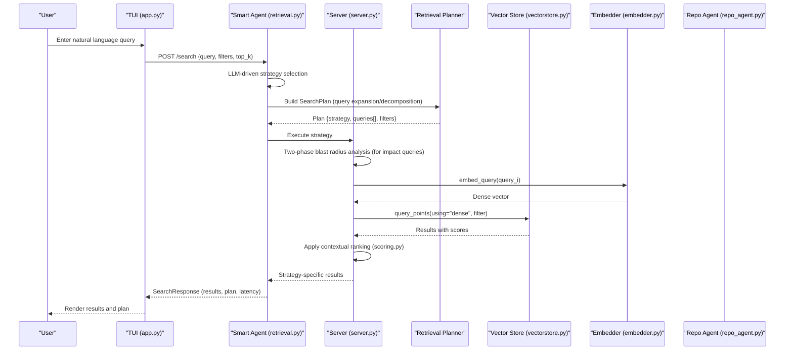

**Diagram sources**
- [src/rag/app.py:722-754](file://src/rag/app.py#L722-L754)
- [src/rag/agents/retrieval.py:216-317](file://src/rag/agents/retrieval.py#L216-L317)
- [src/rag/core/query.py:31-52](file://src/rag/core/query.py#L31-L52)
- [src/rag/core/embedder.py:69-72](file://src/rag/core/embedder.py#L69-L72)
- [src/rag/core/vectorstore.py:447-463](file://src/rag/core/vectorstore.py#L447-L463)
- [src/rag/core/scoring.py:31-57](file://src/rag/core/scoring.py#L31-L57)
- [src/rag/agents/repo_agent.py:412-438](file://src/rag/agents/repo_agent.py#L412-L438)

## Detailed Component Analysis

### Smart Agent Decision Trees and Strategy Selection
The Smart Agent uses LLM-driven decision trees to select optimal retrieval strategies based on query intent and context. The system maintains fallback mechanisms for reliability in various environments.

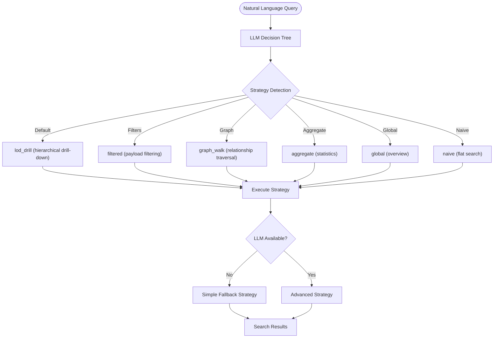

**Diagram sources**
- [src/rag/agents/retrieval.py:216-317](file://src/rag/agents/retrieval.py#L216-L317)
- [src/rag/agents/retrieval.py:101-125](file://src/rag/agents/retrieval.py#L101-L125)

**Section sources**
- [src/rag/agents/retrieval.py:216-317](file://src/rag/agents/retrieval.py#L216-L317)
- [docs/wiki/Agent Orchestration/Query Planning and Strategy Selection.md:117-146](file://docs/wiki/Agent Orchestration/Query Planning and Strategy Selection.md#L117-L146)
- [docs/wiki/Search and Retrieval/Query Planning and Strategy Selection.md:130-173](file://docs/wiki/Search and Retrieval/Query Planning and Strategy Selection.md#L130-L173)

### Query Processing: Expansion and Decomposition
- Query expansion appends domain-relevant synonyms to improve recall when keywords match predefined categories
- Query decomposition splits compound queries into sub-queries around logical connectors, enabling multi-part retrieval
- The system includes robust fallback mechanisms when LLM services are unavailable

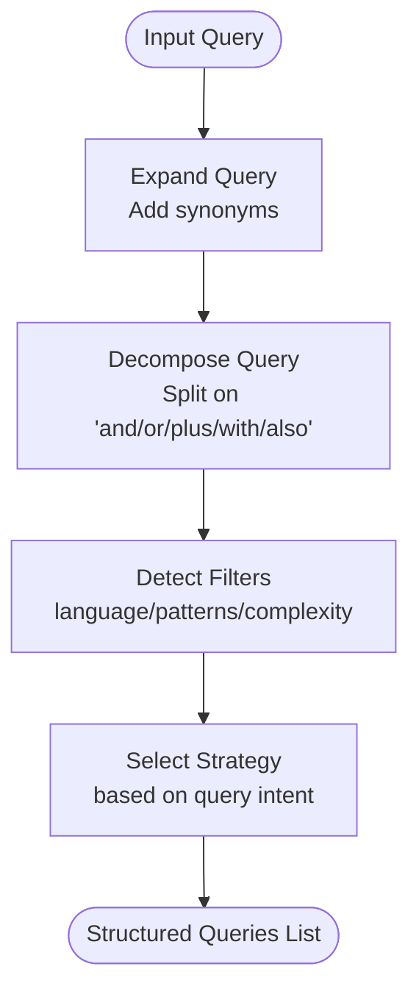

**Diagram sources**
- [src/rag/core/query.py:31-52](file://src/rag/core/query.py#L31-L52)
- [src/rag/agents/retrieval.py:256-317](file://src/rag/agents/retrieval.py#L256-L317)

**Section sources**
- [src/rag/core/query.py:31-52](file://src/rag/core/query.py#L31-L52)
- [src/rag/agents/retrieval.py:256-317](file://src/rag/agents/retrieval.py#L256-L317)
- [tests/test_query.py:15-42](file://tests/test_query.py#L15-L42)

### Embedding Space and Similarity Metrics
- Dense embeddings are produced by a Qwen3-Embedding model via Ollama. Documents and queries are embedded into the same vector space
- Cosine similarity is used by the vector store for dense retrieval
- Instruction prefixes guide the model to retrieve semantically similar code for both documents and queries

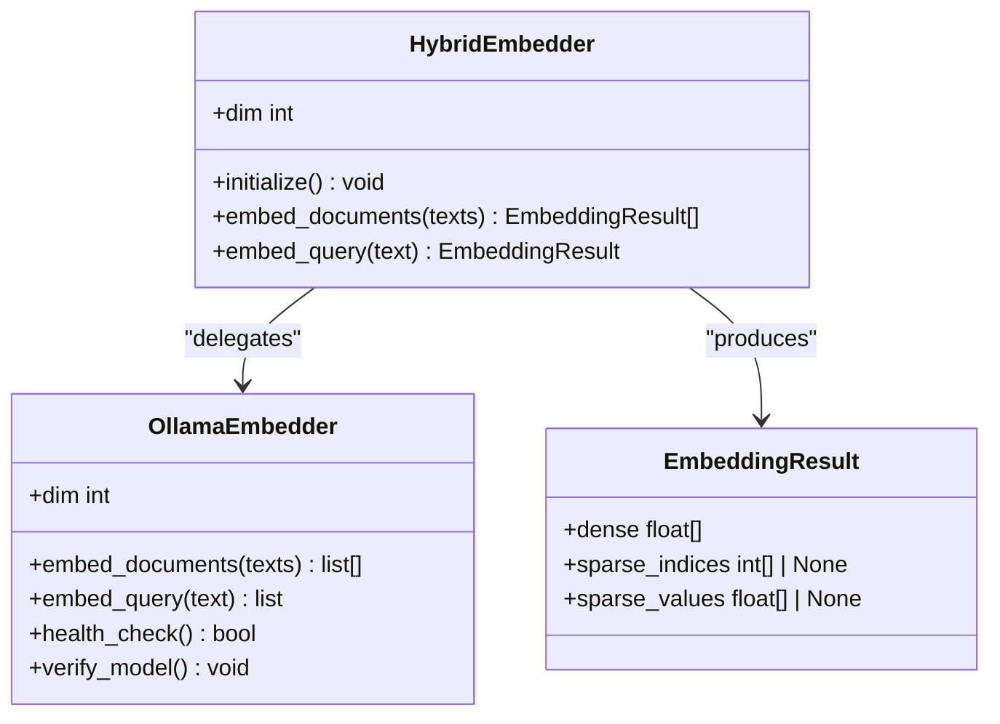

**Diagram sources**
- [src/rag/core/embedder.py:48-245](file://src/rag/core/embedder.py#L48-L245)

**Section sources**
- [src/rag/core/embedder.py:35-72](file://src/rag/core/embedder.py#L35-L72)
- [src/rag/core/vectorstore.py:284-289](file://src/rag/core/vectorstore.py#L284-L289)
- [src/rag/config.py:53-62](file://src/rag/config.py#L53-L62)

### Indexing and Lexical Indexing
- Code-aware chunking uses tree-sitter to extract file/class/function boundaries and enrich metadata (patterns, complexity, quality signals)
- Optional LSP enrichment adds type, call graph, and cross-reference metadata at index time
- Payload fields are indexed in Qdrant to enable efficient filtering and server-side query-time filtering

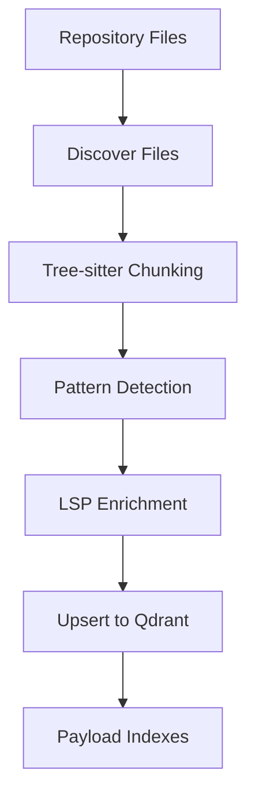

**Diagram sources**
- [src/rag/core/indexer.py:242-550](file://src/rag/core/indexer.py#L242-L550)
- [src/rag/core/chunker.py:385-444](file://src/rag/core/chunker.py#L385-L444)
- [src/rag/core/lsp.py:313-404](file://src/rag/core/lsp.py#L313-L404)
- [src/rag/core/vectorstore.py:23-73](file://src/rag/core/vectorstore.py#L23-L73)

**Section sources**
- [src/rag/core/indexer.py:242-550](file://src/rag/core/indexer.py#L242-L550)
- [src/rag/core/chunker.py:58-82](file://src/rag/core/chunker.py#L58-L82)
- [src/rag/core/lsp.py:313-404](file://src/rag/core/lsp.py#L313-L404)
- [src/rag/core/vectorstore.py:23-73](file://src/rag/core/vectorstore.py#L23-L73)

### Vector Search and Filtering
- Dense vector search uses a single query_points call with server-side filters to avoid recall holes from post-filtering
- Payload indexes accelerate filtering by language, chunk type, architecture patterns, and quality flags

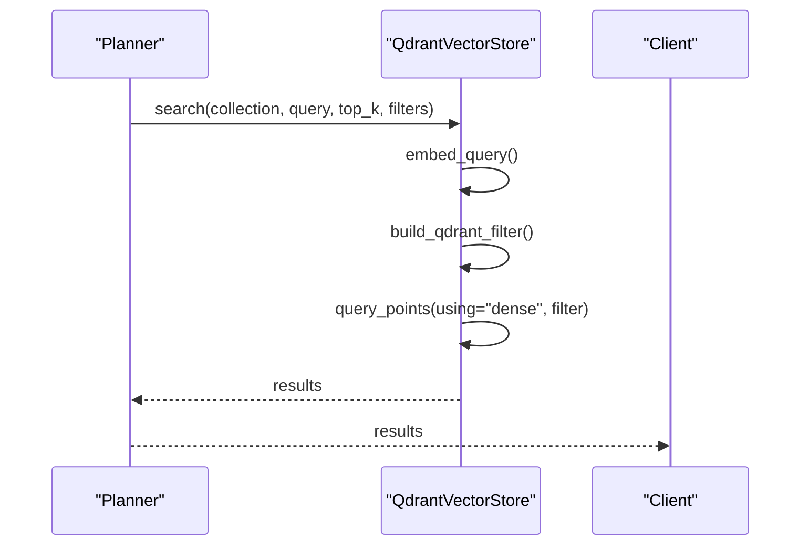

**Diagram sources**
- [src/rag/core/vectorstore.py:424-466](file://src/rag/core/vectorstore.py#L424-L466)
- [src/rag/core/query.py:17-28](file://src/rag/core/query.py#L17-L28)

**Section sources**
- [src/rag/core/vectorstore.py:424-466](file://src/rag/core/vectorstore.py#L424-L466)
- [tests/test_query.py:80-124](file://tests/test_query.py#L80-L124)

### Contextual Ranking and Confidence Scoring
- Base scores from vector search are adjusted by:
  - Recency: exponential decay based on last-modified date
  - Pattern importance: boosts for high-value architecture patterns and exact query matches
  - Code quality: penalties for dead code candidates and high cyclomatic complexity; modest boosts for docstrings, public scope, and unit tests
- The function preserves backward compatibility for externally reranked results

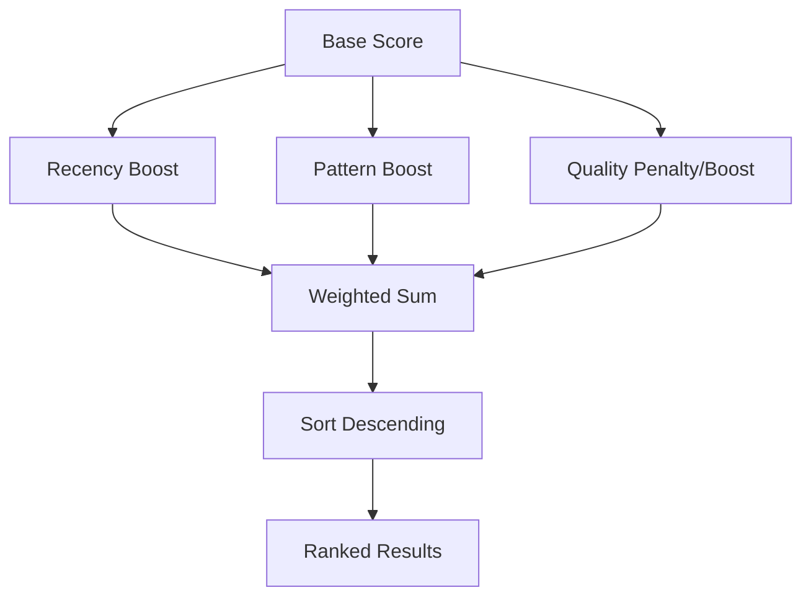

**Diagram sources**
- [src/rag/core/scoring.py:31-57](file://src/rag/core/scoring.py#L31-L57)

**Section sources**
- [src/rag/core/scoring.py:31-143](file://src/rag/core/scoring.py#L31-L143)
- [tests/test_scoring.py:8-42](file://tests/test_scoring.py#L8-L42)

### Practical Query Phrasing Guidelines
- Use "and/or/plus/with/also" to express compound intents; decomposition splits them into sub-queries
- Include domain-specific terms (e.g., "auth", "db", "api") to trigger synonym expansion
- Be explicit about filters (language, patterns, complexity) to constrain results when needed
- Prefer concise, identifier-rich phrasing for better lexical and semantic alignment
- For impact analysis, use phrases like "if I change X, what code breaks?" to trigger blast radius analysis

Examples of effective phrasing:
- "authentication and JWT middleware"
- "database connection pooling"
- "REST API handlers with error handling"
- "If I change the Job base class, what code breaks?"
- "Show me the blast radius of changing Recipient model"

[No sources needed since this section provides general guidance]

## Smart Agent Decision Trees and Strategy Selection

### Advanced Strategy Detection Heuristics
The Smart Agent employs sophisticated decision trees to select optimal retrieval strategies:

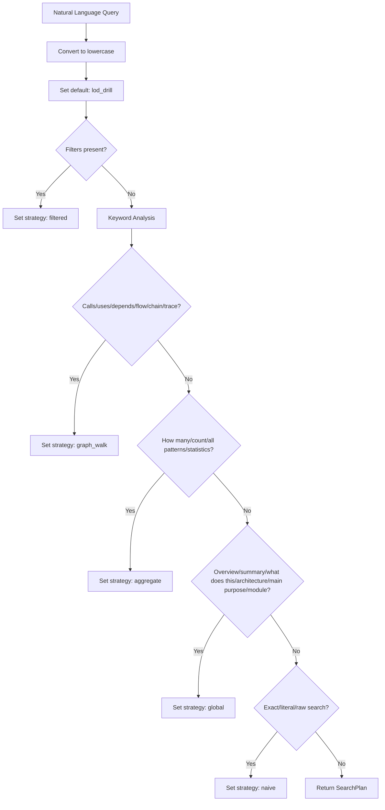

**Diagram sources**
- [src/rag/agents/retrieval.py:283-303](file://src/rag/agents/retrieval.py#L283-L303)

### Strategy Types and Selection Criteria
The system supports seven distinct strategy types with specific selection criteria:

| Strategy | Purpose | Selection Keywords | Fallback Behavior |
|----------|---------|-------------------|-------------------|
| `lod_drill` | Hierarchical drill-down through LOD collections | Default behavior | Degraded to hybrid when LOD data absent |
| `hybrid` | Flat vector search across all chunks | Not explicitly requested | Direct vector search |
| `filtered` | Applies validated filters to retrieval | Filter detection heuristics | Uses payload filtering |
| `graph_walk` | Focuses on call/use/dependency relationships | calls, uses, depends, flow, chain, trace | Graph traversal search |
| `aggregate` | Retrieves to compute counts/statistics | how many, count, statistics, all patterns | Statistical aggregation |
| `global` | Broad overview/search across modules | overview, summary, architecture, module | Module summaries search |
| `naive` | Historical alias for "vector only" | exact, literal, raw search | Maintained for plan compatibility |

**Section sources**
- [src/rag/agents/retrieval.py:283-303](file://src/rag/agents/retrieval.py#L283-L303)
- [src/rag/server.py:1370-1569](file://src/rag/server.py#L1370-L1569)
- [docs/wiki/Agent Orchestration/Query Planning and Strategy Selection.md:155-173](file://docs/wiki/Agent Orchestration/Query Planning and Strategy Selection.md#L155-L173)

### Server-side Strategy Routing and Execution
The server routes execution based on selected strategies with graceful degradation mechanisms:

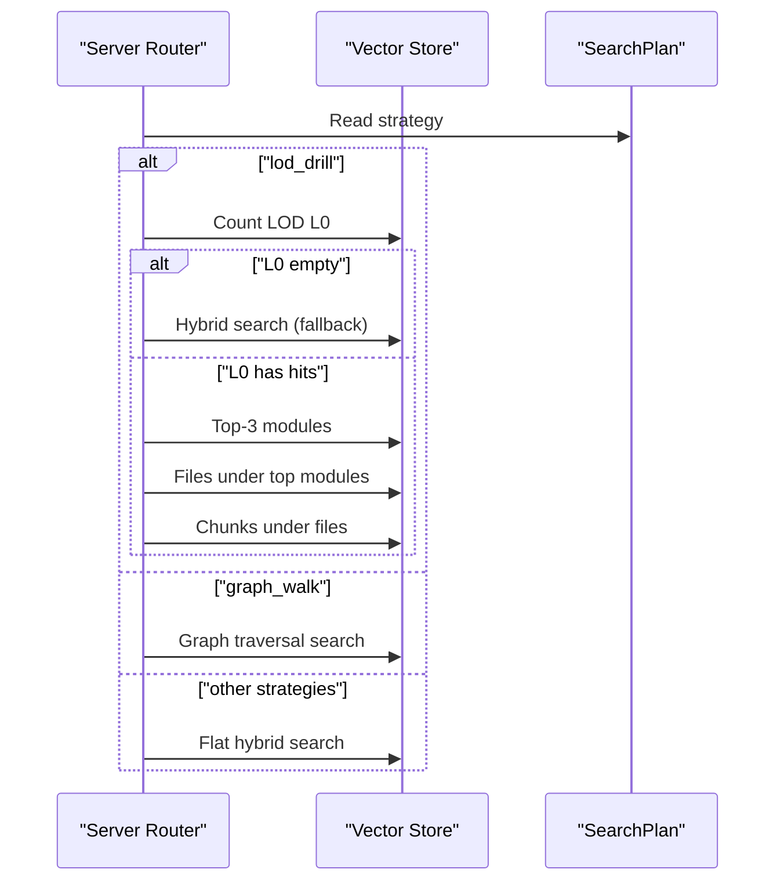

**Diagram sources**
- [src/rag/server.py:1370-1569](file://src/rag/server.py#L1370-L1569)

**Section sources**
- [src/rag/server.py:1370-1569](file://src/rag/server.py#L1370-L1569)

## Two-Phase Blast Radius Analysis

### Systematic Impact Assessment Methodology
The system implements a sophisticated two-phase blast radius analysis for assessing code change impacts:

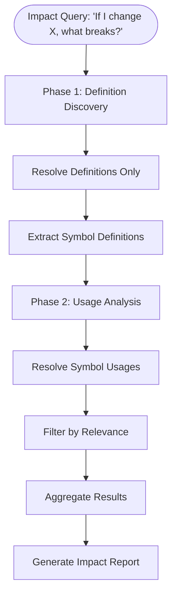

**Diagram sources**
- [benchmark_production_scenarios.py:348-461](file://benchmark_production_scenarios.py#L348-L461)

### Implementation Details
The two-phase approach involves:

1. **Phase 1: Definition Discovery**
   - Resolve symbol definitions using `/resolve` endpoint
   - Extract directory contexts from definition locations
   - Establish baseline understanding of target symbols

2. **Phase 2: Usage Analysis**
   - Resolve symbol usages with selective filtering
   - Filter usages by relevance (same directory, symbol name match, golden file directories)
   - Limit to 15 most relevant usages for efficient processing

**Section sources**
- [benchmark_production_scenarios.py:348-461](file://benchmark_production_scenarios.py#L348-L461)
- [benchmark_refactor_effort.py:426-570](file://benchmark_refactor_effort.py#L426-L570)

### Performance Characteristics
The blast radius analysis demonstrates superior performance characteristics:

| Metric | Smart Agent | AST-Index | Graphify | Naive Agent | Vanilla (rg) |
|--------|-------------|-----------|----------|-------------|--------------|
| **Turns** | 14 (avg) | 13 (avg) | 11 (avg) | 40 (avg) | 12 (avg) |
| **Tokens** | 14,245 (avg) | 24,559 (avg) | 16,400 (avg) | 17,484 (avg) | 18,563 (avg) |
| **Precision** | 23.1% | 10.0% | 0.0% | 7.7% | 20.0% |
| **Signal%** | 61.5% | 70.0% | 100.0% | 27.8% | 100.0% |
| **Coverage** | 75.0% | 25.0% | 0.0% | 75.0% | 50.0% |
| **Latency** | 41.9ms | 54.9ms | 6,373.4ms | 9,066.1ms | 87.1ms |

**Section sources**
- [benchmark_production_results.json:408-481](file://benchmark_production_results.json#L408-L481)

## Production Deployment Considerations

### Linux Systemd Deployment
The daemon supports production deployment via systemd for reliable service management:

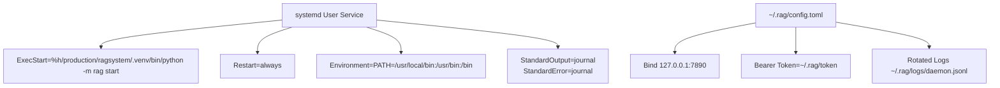

**Diagram sources**
- [docs/deployment-linux.md:12-32](file://docs/deployment-linux.md#L12-L32)

### Security and Configuration
- The daemon binds to `127.0.0.1:7890` by default for security
- Bearer token authentication via `~/.rag/token` with secure permissions (0600)
- Structured logging with automatic rotation (10 MB × 5 backups)
- Optional OLLAMA_HOST environment variable for custom model serving

**Section sources**
- [docs/deployment-linux.md:1-57](file://docs/deployment-linux.md#L1-L57)

### Monitoring and Operations
- Journald integration for comprehensive logging
- Health monitoring via structured JSON logs
- Automatic restart on failure with 3-second backoff
- Support for user-level and system-wide deployment

**Section sources**
- [docs/deployment-linux.md:34-47](file://docs/deployment-linux.md#L34-L47)

## Benchmarking Methodologies and Performance Evaluation

### Comprehensive Agent Comparison Framework
The system includes sophisticated benchmarking methodologies comparing multiple retrieval agents:

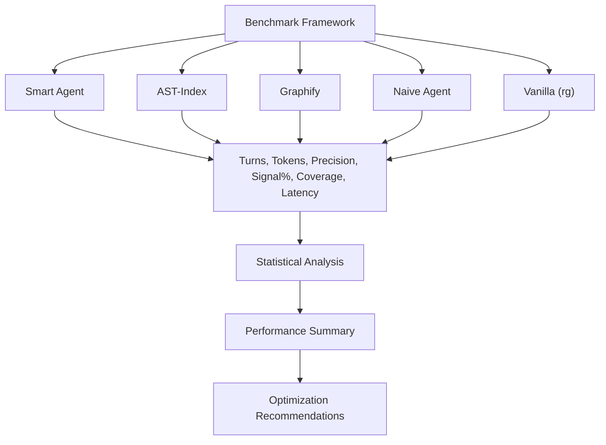

**Diagram sources**
- [benchmark_refactor_effort.py:605-610](file://benchmark_refactor_effort.py#L605-L610)

### Multi-Task Benchmarking
The benchmark evaluates agents across six distinct refactoring tasks:

| Task ID | Category | Focus Area | Optimal Agent |
|---------|----------|------------|---------------|
| 1 | Refactor | Semantic architecture | RAG+AST |
| 2 | Database | Exact symbol lookup | AST-Index |
| 3 | Push Notifications | Semantic flow understanding | RAG+AST |
| 4 | Dependency Injection | Symbol resolution | AST-Index |
| 5 | Blast Radius | Graph neighbor traversal | Graphify |
| 6 | Deprecated Code | Literal text patterns | Vanilla (rg) |

**Section sources**
- [benchmark_refactor_effort.py:58-134](file://benchmark_refactor_effort.py#L58-L134)

### Production Scenario Benchmarking
The production scenarios framework evaluates real-world developer workflows:

| Scenario | Category | Tool Path | Smart Agent Performance |
|----------|----------|-----------|------------------------|
| 1 | Feature Addition | resolve_defs | 4 turns, 1,933 tokens, 100% precision |
| 2 | Migration | resolve_defs | 3 turns, 1,142 tokens, 100% precision |
| 3 | Architecture | resolve_defs | 4 turns, 2,319 tokens, 100% precision |
| 4 | Feature Extension | resolve_defs | 3 turns, 1,224 tokens, 100% precision |
| 5 | Cleanup | resolve_defs | 4 turns, 1,200 tokens, 66.7% precision |
| 6 | Impact Analysis | resolve_usages | 14 turns, 14,245 tokens, 23.1% precision |

**Section sources**
- [benchmark_production_results.json:1-806](file://benchmark_production_results.json#L1-L806)

### Performance Evaluation Criteria
The benchmarking framework uses comprehensive metrics:

- **Effort Metrics**: turns, tokens, files read, latency
- **Information Quality**: precision percentage, signal percentage, coverage percentage  
- **Comparative Analysis**: per-task averages, overall winners, category breakdowns
- **Statistical Significance**: confidence intervals, variance analysis

**Section sources**
- [benchmark_refactor_effort.py:682-730](file://benchmark_refactor_effort.py#L682-L730)
- [benchmark_production_scenarios.py:748-798](file://benchmark_production_scenarios.py#L748-L798)

## Dependency Analysis
Key dependencies and coupling:
- The TUI is a thin HTTP client; it does not depend on the embedder or vector store
- The daemon orchestrates indexing, embedding, and retrieval; embedder and vector store are tightly coupled
- Scoring depends on payload fields populated by indexing and LSP enrichment
- Smart Agent introduces LLM provider dependencies (Gemini, OpenAI, Anthropic, Ollama)
- Repo Agent coordinates multiple retrieval strategies and context building

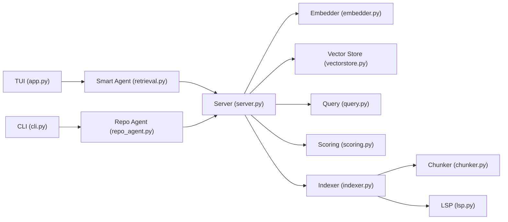

**Diagram sources**
- [src/rag/app.py:722-754](file://src/rag/app.py#L722-L754)
- [src/rag/agents/retrieval.py:216-317](file://src/rag/agents/retrieval.py#L216-L317)
- [src/rag/agents/repo_agent.py:412-438](file://src/rag/agents/repo_agent.py#L412-L438)
- [src/rag/server.py:1370-1569](file://src/rag/server.py#L1370-L1569)
- [src/rag/core/embedder.py:48-245](file://src/rag/core/embedder.py#L48-L245)
- [src/rag/core/vectorstore.py:424-466](file://src/rag/core/vectorstore.py#L424-L466)
- [src/rag/core/query.py:31-52](file://src/rag/core/query.py#L31-L52)
- [src/rag/core/scoring.py:31-143](file://src/rag/core/scoring.py#L31-L143)
- [src/rag/core/indexer.py:242-550](file://src/rag/core/indexer.py#L242-L550)
- [src/rag/core/chunker.py:385-444](file://src/rag/core/chunker.py#L385-L444)
- [src/rag/core/lsp.py:313-404](file://src/rag/core/lsp.py#L313-L404)

**Section sources**
- [src/rag/app.py:722-754](file://src/rag/app.py#L722-L754)
- [src/rag/agents/retrieval.py:216-317](file://src/rag/agents/retrieval.py#L216-L317)
- [src/rag/agents/repo_agent.py:412-438](file://src/rag/agents/repo_agent.py#L412-L438)
- [src/rag/server.py:1370-1569](file://src/rag/server.py#L1370-L1569)
- [src/rag/core/embedder.py:48-245](file://src/rag/core/embedder.py#L48-L245)
- [src/rag/core/vectorstore.py:424-466](file://src/rag/core/vectorstore.py#L424-L466)
- [src/rag/core/query.py:31-52](file://src/rag/core/query.py#L31-L52)
- [src/rag/core/scoring.py:31-143](file://src/rag/core/scoring.py#L31-L143)
- [src/rag/core/indexer.py:242-550](file://src/rag/core/indexer.py#L242-L550)
- [src/rag/core/chunker.py:385-444](file://src/rag/core/chunker.py#L385-L444)
- [src/rag/core/lsp.py:313-404](file://src/rag/core/lsp.py#L313-L404)

## Performance Considerations
- Dense vector search with server-side filtering avoids post-filtering recall loss and reduces client-side computation
- Batched embedding requests minimize HTTP overhead; backoff and retry logic protect against transient Ollama failures
- Payload indexes accelerate filtering; dimension mismatches are validated to prevent silent corruption
- Indexing batches and embedding caches reduce redundant computation
- Smart Agent fallback mechanisms ensure reliability when LLM services are unavailable
- Two-phase blast radius analysis optimizes impact assessment queries
- Comprehensive benchmarking enables continuous performance monitoring and optimization

[No sources needed since this section provides general guidance]

## Troubleshooting Guide
- Verify Ollama availability and model presence before starting the daemon
- Use diagnostic commands to check daemon health, Ollama reachability, and LSP server detection
- For indexing issues, verify collection dimensions and re-index if embedding model changes
- If filtered search returns unexpected results, confirm filters are applied server-side
- Smart Agent strategy selection failures: check LLM provider configuration and API keys
- Two-phase blast radius analysis timeouts: adjust query complexity and limit symbol sets
- Production deployment issues: verify systemd service configuration and log file permissions

**Section sources**
- [src/rag/core/embedder.py:155-187](file://src/rag/core/embedder.py#L155-L187)
- [src/rag/core/vectorstore.py:260-294](file://src/rag/core/vectorstore.py#L260-L294)
- [README.md:71-74](file://README.md#L71-L74)
- [docs/deployment-linux.md:49-57](file://docs/deployment-linux.md#L49-L57)

## Conclusion
This RAG system combines code-aware chunking, dense vector embeddings, and contextual ranking to deliver precise, relevant results for code understanding. The Smart Agent decision trees provide intelligent strategy selection, while the two-phase blast radius analysis enables systematic impact assessment. Comprehensive benchmarking methodologies and production deployment considerations ensure reliable, scalable performance for real-world development workflows. By transforming natural language queries into structured plans, leveraging lexical and semantic signals, and applying quality-aware scoring, it balances recall and precision for practical development workflows.

[No sources needed since this section summarizes without analyzing specific files]

## Appendices

### Beginner-Friendly Glossary
- **Embedding space**: a high-dimensional vector space where semantically similar items are close together
- **Similarity metric**: cosine similarity measures angle between vectors; higher values indicate greater semantic similarity
- **Confidence scoring**: a composite score combining base similarity with contextual adjustments (recency, patterns, quality)
- **Smart Agent**: LLM-powered decision tree that selects optimal retrieval strategies based on query intent
- **Blast radius analysis**: systematic impact assessment showing code affected by proposed changes
- **SearchPlan**: structured plan containing expanded queries, sanitized filters, and selected strategy

[No sources needed since this section provides general guidance]