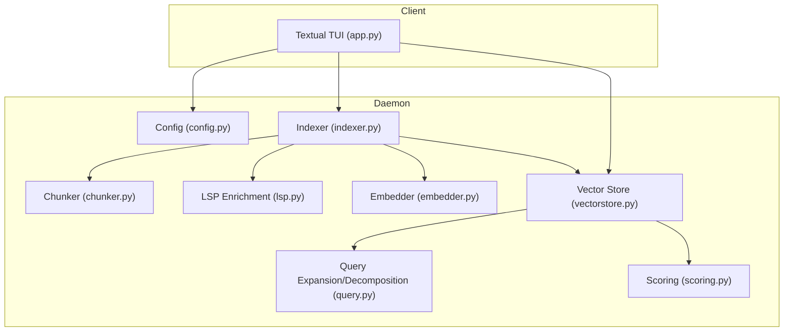
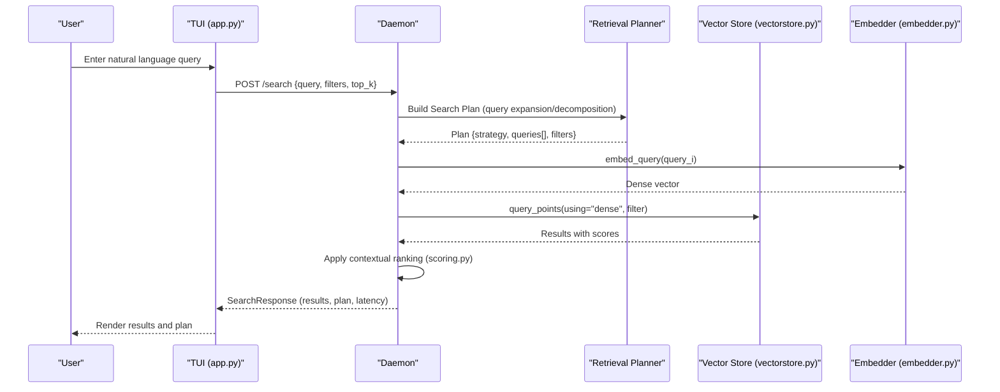
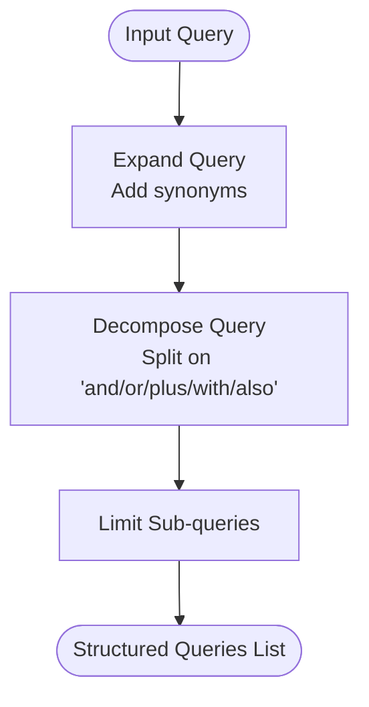
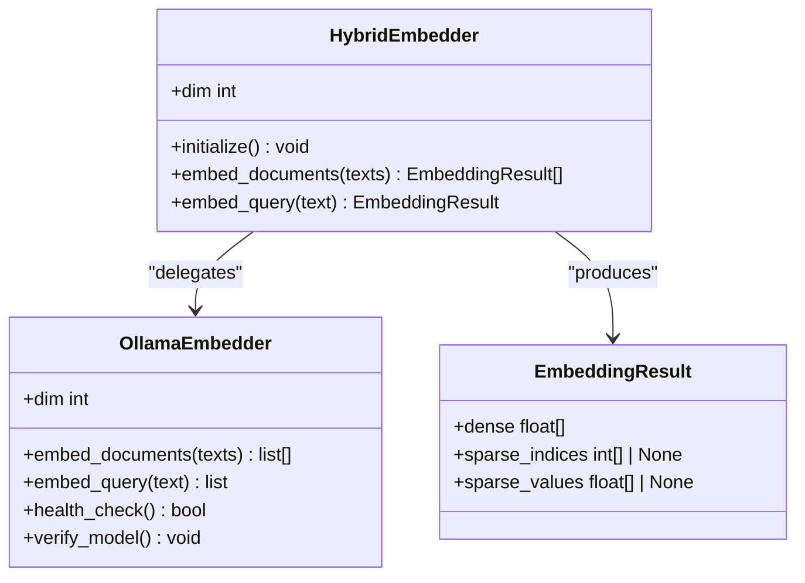
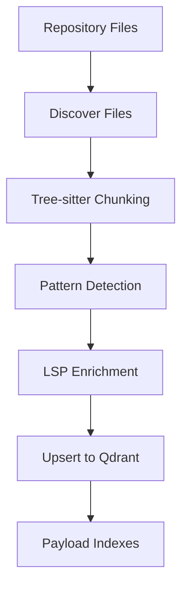
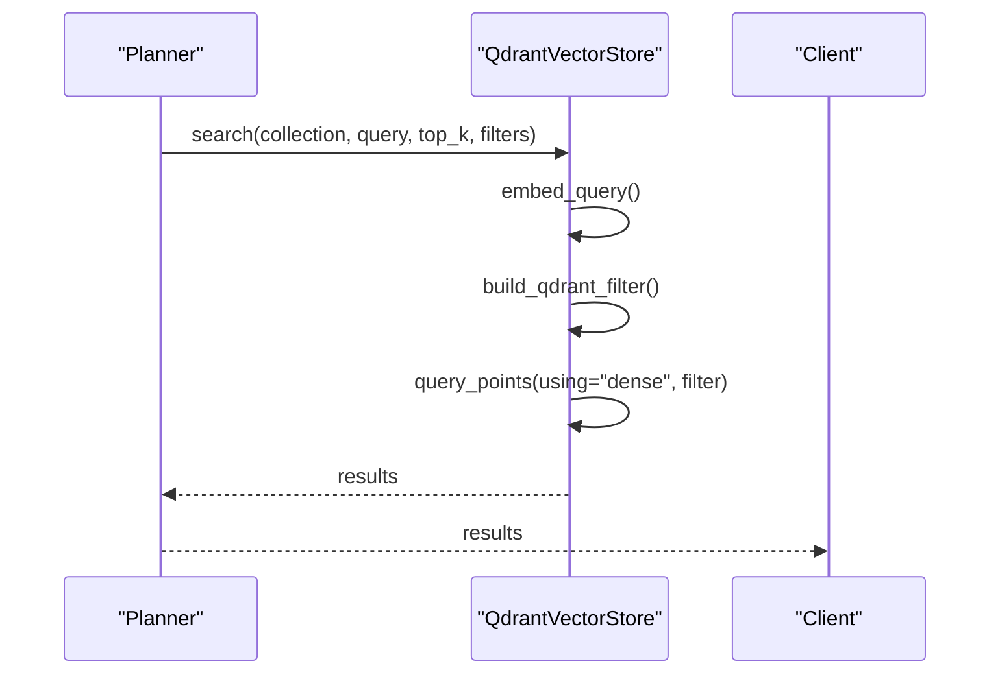
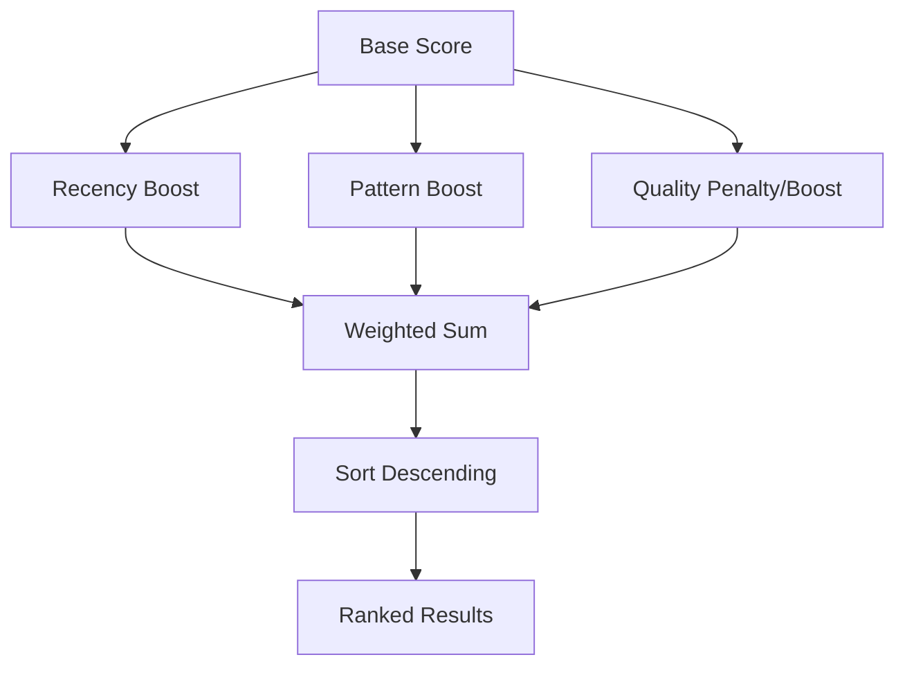
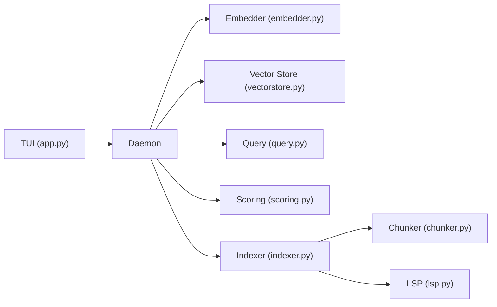

# RAG Fundamentals

<cite>
**Referenced Files in This Document**
- [README.md](file://README.md)
- [src/rag/config.py](file://src/rag/config.py)
- [src/rag/core/query.py](file://src/rag/core/query.py)
- [src/rag/core/scoring.py](file://src/rag/core/scoring.py)
- [src/rag/core/embedder.py](file://src/rag/core/embedder.py)
- [src/rag/core/vectorstore.py](file://src/rag/core/vectorstore.py)
- [src/rag/core/indexer.py](file://src/rag/core/indexer.py)
- [src/rag/core/chunker.py](file://src/rag/core/chunker.py)
- [src/rag/core/lsp.py](file://src/rag/core/lsp.py)
- [src/rag/app.py](file://src/rag/app.py)
- [tests/test_query.py](file://tests/test_query.py)
- [tests/test_scoring.py](file://tests/test_scoring.py)
</cite>

## Table of Contents
1. [Introduction](#introduction)
2. [Project Structure](#project-structure)
3. [Core Components](#core-components)
4. [Architecture Overview](#architecture-overview)
5. [Detailed Component Analysis](#detailed-component-analysis)
6. [Dependency Analysis](#dependency-analysis)
7. [Performance Considerations](#performance-considerations)
8. [Troubleshooting Guide](#troubleshooting-guide)
9. [Conclusion](#conclusion)
10. [Appendices](#appendices)

## Introduction
This document explains Retrieval-Augmented Generation (RAG) fundamentals using the codebase’s implementation. It focuses on how semantic search improves code understanding through dense vector embeddings and lexical indexing, how queries are transformed into structured search plans, how results are scored for relevance and contextual fit, and how to phrase queries for optimal outcomes. It also clarifies embedding spaces, similarity metrics, and confidence scoring in the context of this system.

## Project Structure
The RAG system is a headless FastAPI daemon with a read-only Textual TUI client. The daemon performs indexing, embedding, and retrieval using Qdrant and Ollama. The TUI communicates over HTTP to visualize status, collections, and search results.

**Diagram sources**
- [src/rag/app.py:722-754](file://src/rag/app.py#L722-L754)
- [src/rag/config.py:150-194](file://src/rag/config.py#L150-L194)
- [src/rag/core/indexer.py:242-550](file://src/rag/core/indexer.py#L242-L550)
- [src/rag/core/chunker.py:385-444](file://src/rag/core/chunker.py#L385-L444)
- [src/rag/core/lsp.py:313-404](file://src/rag/core/lsp.py#L313-L404)
- [src/rag/core/embedder.py:48-245](file://src/rag/core/embedder.py#L48-L245)
- [src/rag/core/vectorstore.py:424-466](file://src/rag/core/vectorstore.py#L424-L466)
- [src/rag/core/query.py:31-52](file://src/rag/core/query.py#L31-L52)
- [src/rag/core/scoring.py:31-143](file://src/rag/core/scoring.py#L31-L143)

**Section sources**
- [README.md:1-74](file://README.md#L1-L74)
- [src/rag/app.py:722-754](file://src/rag/app.py#L722-L754)
- [src/rag/config.py:150-194](file://src/rag/config.py#L150-L194)

## Core Components
- Query processing: query expansion and decomposition produce structured sub-queries and expanded terms.
- Embedding: dense vectors via Ollama (Qwen3-Embedding) for documents and queries.
- Indexing: code-aware chunking (tree-sitter) with metadata enrichment and LSP integration.
- Vector search: Qdrant dense vector search with payload filters applied server-side.
- Scoring: contextual ranking adjusts base scores by recency, domain patterns, and code quality signals.

**Section sources**
- [src/rag/core/query.py:31-52](file://src/rag/core/query.py#L31-L52)
- [src/rag/core/embedder.py:48-245](file://src/rag/core/embedder.py#L48-L245)
- [src/rag/core/chunker.py:385-444](file://src/rag/core/chunker.py#L385-L444)
- [src/rag/core/lsp.py:313-404](file://src/rag/core/lsp.py#L313-L404)
- [src/rag/core/vectorstore.py:424-466](file://src/rag/core/vectorstore.py#L424-L466)
- [src/rag/core/scoring.py:31-143](file://src/rag/core/scoring.py#L31-L143)

## Architecture Overview
The system transforms natural language queries into actionable search plans, executes dense vector retrieval, and applies contextual ranking to surface the most relevant code artifacts.

**Diagram sources**
- [src/rag/app.py:722-754](file://src/rag/app.py#L722-L754)
- [src/rag/core/query.py:31-52](file://src/rag/core/query.py#L31-L52)
- [src/rag/core/embedder.py:69-72](file://src/rag/core/embedder.py#L69-L72)
- [src/rag/core/vectorstore.py:447-463](file://src/rag/core/vectorstore.py#L447-L463)
- [src/rag/core/scoring.py:31-57](file://src/rag/core/scoring.py#L31-L57)

## Detailed Component Analysis

### Query Processing: Expansion and Decomposition
- Query expansion appends domain-relevant synonyms to improve recall when keywords match predefined categories.
- Query decomposition splits compound queries into sub-queries around logical connectors, enabling multi-part retrieval.

**Diagram sources**
- [src/rag/core/query.py:31-52](file://src/rag/core/query.py#L31-L52)

**Section sources**
- [src/rag/core/query.py:31-52](file://src/rag/core/query.py#L31-L52)
- [tests/test_query.py:15-42](file://tests/test_query.py#L15-L42)

### Embedding Space and Similarity Metrics
- Dense embeddings are produced by a Qwen3-Embedding model via Ollama. Documents and queries are embedded into the same vector space.
- Cosine similarity is used by the vector store for dense retrieval.
- Instruction prefixes guide the model to retrieve semantically similar code for both documents and queries.

**Diagram sources**
- [src/rag/core/embedder.py:48-245](file://src/rag/core/embedder.py#L48-L245)

**Section sources**
- [src/rag/core/embedder.py:35-72](file://src/rag/core/embedder.py#L35-L72)
- [src/rag/core/vectorstore.py:284-289](file://src/rag/core/vectorstore.py#L284-L289)
- [src/rag/config.py:53-62](file://src/rag/config.py#L53-L62)

### Indexing and Lexical Indexing
- Code-aware chunking uses tree-sitter to extract file/class/function boundaries and enrich metadata (patterns, complexity, quality signals).
- Optional LSP enrichment adds type, call graph, and cross-reference metadata at index time.
- Payload fields are indexed in Qdrant to enable efficient filtering and server-side query-time filtering.

**Diagram sources**
- [src/rag/core/indexer.py:242-550](file://src/rag/core/indexer.py#L242-L550)
- [src/rag/core/chunker.py:385-444](file://src/rag/core/chunker.py#L385-L444)
- [src/rag/core/lsp.py:313-404](file://src/rag/core/lsp.py#L313-L404)
- [src/rag/core/vectorstore.py:23-73](file://src/rag/core/vectorstore.py#L23-L73)

**Section sources**
- [src/rag/core/indexer.py:242-550](file://src/rag/core/indexer.py#L242-L550)
- [src/rag/core/chunker.py:58-82](file://src/rag/core/chunker.py#L58-L82)
- [src/rag/core/lsp.py:313-404](file://src/rag/core/lsp.py#L313-L404)
- [src/rag/core/vectorstore.py:23-73](file://src/rag/core/vectorstore.py#L23-L73)

### Vector Search and Filtering
- Dense vector search uses a single query_points call with server-side filters to avoid recall holes from post-filtering.
- Payload indexes accelerate filtering by language, chunk type, architecture patterns, and quality flags.

**Diagram sources**
- [src/rag/core/vectorstore.py:424-466](file://src/rag/core/vectorstore.py#L424-L466)
- [src/rag/core/query.py:17-28](file://src/rag/core/query.py#L17-L28)

**Section sources**
- [src/rag/core/vectorstore.py:424-466](file://src/rag/core/vectorstore.py#L424-L466)
- [tests/test_query.py:80-124](file://tests/test_query.py#L80-L124)

### Contextual Ranking and Confidence Scoring
- Base scores from vector search are adjusted by:
  - Recency: exponential decay based on last-modified date.
  - Pattern importance: boosts for high-value architecture patterns and exact query matches.
  - Code quality: penalties for dead code candidates and high cyclomatic complexity; modest boosts for docstrings, public scope, and unit tests.
- The function preserves backward compatibility for externally reranked results.

**Diagram sources**
- [src/rag/core/scoring.py:31-57](file://src/rag/core/scoring.py#L31-L57)

**Section sources**
- [src/rag/core/scoring.py:31-143](file://src/rag/core/scoring.py#L31-L143)
- [tests/test_scoring.py:8-42](file://tests/test_scoring.py#L8-L42)

### Practical Query Phrasing Guidelines
- Use “and/or/plus/with/also” to express compound intents; decomposition splits them into sub-queries.
- Include domain-specific terms (e.g., “auth”, “db”, “api”) to trigger synonym expansion.
- Be explicit about filters (language, patterns, complexity) to constrain results when needed.
- Prefer concise, identifier-rich phrasing for better lexical and semantic alignment.

Examples of effective phrasing:
- “authentication and JWT middleware”
- “database connection pooling”
- “REST API handlers with error handling”

[No sources needed since this section provides general guidance]

## Dependency Analysis
Key dependencies and coupling:
- The TUI is a thin HTTP client; it does not depend on the embedder or vector store.
- The daemon orchestrates indexing, embedding, and retrieval; embedder and vector store are tightly coupled.
- Scoring depends on payload fields populated by indexing and LSP enrichment.

**Diagram sources**
- [src/rag/app.py:722-754](file://src/rag/app.py#L722-L754)
- [src/rag/core/embedder.py:48-245](file://src/rag/core/embedder.py#L48-L245)
- [src/rag/core/vectorstore.py:424-466](file://src/rag/core/vectorstore.py#L424-L466)
- [src/rag/core/query.py:31-52](file://src/rag/core/query.py#L31-L52)
- [src/rag/core/scoring.py:31-143](file://src/rag/core/scoring.py#L31-L143)
- [src/rag/core/indexer.py:242-550](file://src/rag/core/indexer.py#L242-L550)
- [src/rag/core/chunker.py:385-444](file://src/rag/core/chunker.py#L385-L444)
- [src/rag/core/lsp.py:313-404](file://src/rag/core/lsp.py#L313-L404)

**Section sources**
- [src/rag/app.py:722-754](file://src/rag/app.py#L722-L754)
- [src/rag/core/embedder.py:48-245](file://src/rag/core/embedder.py#L48-L245)
- [src/rag/core/vectorstore.py:424-466](file://src/rag/core/vectorstore.py#L424-L466)
- [src/rag/core/query.py:31-52](file://src/rag/core/query.py#L31-L52)
- [src/rag/core/scoring.py:31-143](file://src/rag/core/scoring.py#L31-L143)
- [src/rag/core/indexer.py:242-550](file://src/rag/core/indexer.py#L242-L550)
- [src/rag/core/chunker.py:385-444](file://src/rag/core/chunker.py#L385-L444)
- [src/rag/core/lsp.py:313-404](file://src/rag/core/lsp.py#L313-L404)

## Performance Considerations
- Dense vector search with server-side filtering avoids post-filtering recall loss and reduces client-side computation.
- Batched embedding requests minimize HTTP overhead; backoff and retry logic protect against transient Ollama failures.
- Payload indexes accelerate filtering; dimension mismatches are validated to prevent silent corruption.
- Indexing batches and embedding caches reduce redundant computation.

[No sources needed since this section provides general guidance]

## Troubleshooting Guide
- Verify Ollama availability and model presence before starting the daemon.
- Use diagnostic commands to check daemon health, Ollama reachability, and LSP server detection.
- For indexing issues, verify collection dimensions and re-index if embedding model changes.
- If filtered search returns unexpected results, confirm filters are applied server-side.

**Section sources**
- [src/rag/core/embedder.py:155-187](file://src/rag/core/embedder.py#L155-L187)
- [src/rag/core/vectorstore.py:260-294](file://src/rag/core/vectorstore.py#L260-L294)
- [README.md:71-74](file://README.md#L71-L74)

## Conclusion
This RAG system combines code-aware chunking, dense vector embeddings, and contextual ranking to deliver precise, relevant results for code understanding. By transforming natural language queries into structured plans, leveraging lexical and semantic signals, and applying quality-aware scoring, it balances recall and precision for practical development workflows.

[No sources needed since this section summarizes without analyzing specific files]

## Appendices

### Beginner-Friendly Glossary
- Embedding space: a high-dimensional vector space where semantically similar items are close together.
- Similarity metric: cosine similarity measures angle between vectors; higher values indicate greater semantic similarity.
- Confidence scoring: a composite score combining base similarity with contextual adjustments (recency, patterns, quality).

[No sources needed since this section provides general guidance]