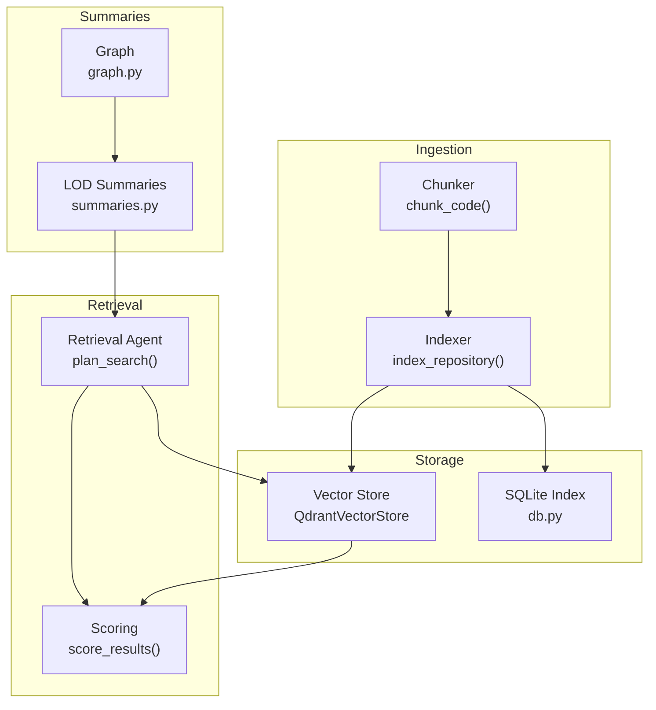
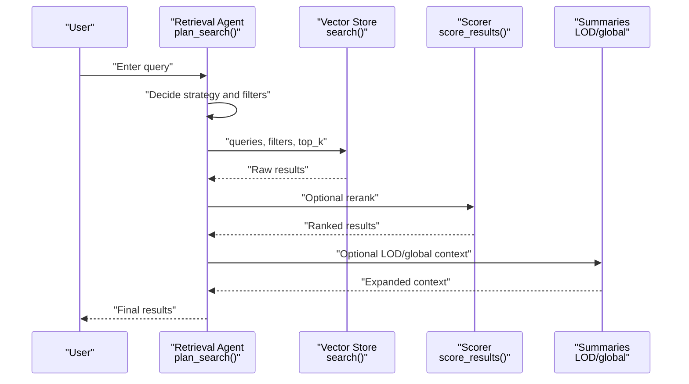
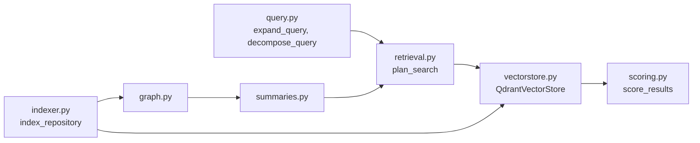

# Search Strategies

<cite>
**Referenced Files in This Document**
- [query.py](file://src/rag/core/query.py)
- [scoring.py](file://src/rag/core/scoring.py)
- [vectorstore.py](file://src/rag/core/vectorstore.py)
- [retrieval.py](file://src/rag/agents/retrieval.py)
- [indexer.py](file://src/rag/core/indexer.py)
- [chunker.py](file://src/rag/core/chunker.py)
- [graph.py](file://src/rag/core/graph.py)
- [summaries.py](file://src/rag/core/summaries.py)
- [embedder.py](file://src/rag/core/embedder.py)
- [cache.py](file://src/rag/core/cache.py)
- [db.py](file://src/rag/storage/db.py)
</cite>

## Table of Contents
1. [Introduction](#introduction)
2. [Project Structure](#project-structure)
3. [Core Components](#core-components)
4. [Architecture Overview](#architecture-overview)
5. [Detailed Component Analysis](#detailed-component-analysis)
6. [Dependency Analysis](#dependency-analysis)
7. [Performance Considerations](#performance-considerations)
8. [Troubleshooting Guide](#troubleshooting-guide)
9. [Conclusion](#conclusion)
10. [Appendices](#appendices)

## Introduction
This document explains the search strategies and algorithms powering the RAG system. It focuses on:
- Hybrid search combining dense vector similarity with lexical filtering
- LOD (Level-of-Detail) drill-down for progressive refinement
- Global summary techniques for high-level context
- Multi-stage search pipeline: broad retrieval, targeted refinement, and context expansion
- Strategy selection logic and performance characteristics
- Token budgeting impact on strategy choice and result quality
- Practical guidance for choosing and optimizing search approaches

## Project Structure
The search stack spans ingestion, storage, retrieval, and orchestration:
- Ingestion and chunking produce structured, enriched chunks with metadata
- Vector store persists dense vectors and payload indexes
- Retrieval agent decides strategy and filters
- Scoring adjusts base vector scores with recency, patterns, and quality signals
- LOD summaries and global summaries provide hierarchical context

**Diagram sources**
- [indexer.py:242-550](file://src/rag/core/indexer.py#L242-L550)
- [vectorstore.py:424-465](file://src/rag/core/vectorstore.py#L424-L465)
- [retrieval.py:203-303](file://src/rag/agents/retrieval.py#L203-L303)
- [scoring.py:31-57](file://src/rag/core/scoring.py#L31-L57)
- [graph.py](file://src/rag/core/graph.py)
- [summaries.py](file://src/rag/core/summaries.py)

**Section sources**
- [indexer.py:242-550](file://src/rag/core/indexer.py#L242-L550)
- [vectorstore.py:424-465](file://src/rag/core/vectorstore.py#L424-L465)
- [retrieval.py:203-303](file://src/rag/agents/retrieval.py#L203-L303)
- [scoring.py:31-57](file://src/rag/core/scoring.py#L31-L57)
- [graph.py](file://src/rag/core/graph.py)
- [summaries.py](file://src/rag/core/summaries.py)

## Core Components
- Query expansion and decomposition: expands keywords and splits compound queries into sub-queries
- Dense vector search: single dense query embedding with payload filtering
- Scoring: applies recency, pattern, and quality adjustments to base scores
- Retrieval agent: selects strategy and filters using an LLM or fallback heuristics
- LOD and global summaries: hierarchical context generation for drill-down and overview

Key implementation references:
- Query expansion and decomposition: [expand_query:31-44](file://src/rag/core/query.py#L31-L44), [decompose_query:47-51](file://src/rag/core/query.py#L47-L51)
- Dense vector search: [QdrantVectorStore.search:424-465](file://src/rag/core/vectorstore.py#L424-L465)
- Scoring: [score_results:31-57](file://src/rag/core/scoring.py#L31-L57)
- Strategy planning: [plan_search:203-241](file://src/rag/agents/retrieval.py#L203-L241), [fallback plan:243-303](file://src/rag/agents/retrieval.py#L243-L303)
- LOD and summaries: [indexer graph/summaries:553-616](file://src/rag/core/indexer.py#L553-L616), [graph](file://src/rag/core/graph.py), [summaries](file://src/rag/core/summaries.py)

**Section sources**
- [query.py:31-51](file://src/rag/core/query.py#L31-L51)
- [vectorstore.py:424-465](file://src/rag/core/vectorstore.py#L424-L465)
- [scoring.py:31-57](file://src/rag/core/scoring.py#L31-L57)
- [retrieval.py:203-303](file://src/rag/agents/retrieval.py#L203-L303)
- [indexer.py:553-616](file://src/rag/core/indexer.py#L553-L616)

## Architecture Overview
The system implements a multi-stage search pipeline:
1. Strategy selection: Decide whether to use LOD drill-down, flat vector search, filtered search, graph walk, aggregation, global overview, or naive vector search.
2. Broad retrieval: Dense vector search with payload filters.
3. Targeted refinement: Optional additional filters and scoring adjustments.
4. Context expansion: Use LOD/global summaries to expand context before returning results.

**Diagram sources**
- [retrieval.py:203-303](file://src/rag/agents/retrieval.py#L203-L303)
- [vectorstore.py:424-465](file://src/rag/core/vectorstore.py#L424-L465)
- [scoring.py:31-57](file://src/rag/core/scoring.py#L31-L57)
- [indexer.py:553-616](file://src/rag/core/indexer.py#L553-L616)

## Detailed Component Analysis

### Strategy Selection and Planning
The retrieval agent chooses a strategy and constructs a plan:
- Uses an LLM (Agno/Ollama) to output a structured plan with queries, filters, strategy, and top_k
- Falls back to heuristics when the LLM is unavailable
- Strategy guide includes LOD drill-down, hybrid, filtered, graph_walk, aggregate, global, naive

Key logic:
- LLM plan parsing and sanitization of filter values
- Fallback heuristics detect language, patterns, complexity, call/flow/chain, statistics, overview/summary/module, exact/literal requests
- Allowed filter values whitelist ensures safe payload filtering

Practical guidance:
- Prefer LOD drill-down for most queries to reduce token consumption and improve precision
- Use filtered when the query specifies domain/pattern/language/complexity
- Use graph_walk for call chains/relationships
- Use aggregate for counts/statistics
- Use global for architecture/module overview
- Use naive/hybrid when raw vector search is desired

**Section sources**
- [retrieval.py:85-94](file://src/rag/agents/retrieval.py#L85-L94)
- [retrieval.py:100-118](file://src/rag/agents/retrieval.py#L100-L118)
- [retrieval.py:121-166](file://src/rag/agents/retrieval.py#L121-L166)
- [retrieval.py:172-201](file://src/rag/agents/retrieval.py#L172-L201)
- [retrieval.py:203-241](file://src/rag/agents/retrieval.py#L203-L241)
- [retrieval.py:243-303](file://src/rag/agents/retrieval.py#L243-L303)

### Dense Vector Search and Payload Filtering
The vector store performs dense vector search with payload filtering:
- Embeds the query and executes a single dense search
- Filters are applied server-side via Qdrant filters to avoid post-filtering recall loss
- Results include content, score, and payload for downstream scoring

Performance characteristics:
- Single dense query call reduces latency compared to hybrid/sparse approaches
- Payload indexes accelerate filtering; correctness is maintained even without indexes

**Section sources**
- [vectorstore.py:424-465](file://src/rag/core/vectorstore.py#L424-L465)
- [vectorstore.py:119-156](file://src/rag/core/vectorstore.py#L119-L156)

### Query Expansion and Decomposition
Queries are expanded with synonyms and split into sub-queries:
- Expansion adds relevant terms based on keyword categories
- Decomposition splits compound queries on logical connectors

Usage:
- Applied by the retrieval agent’s fallback path to broaden coverage when LLM is unavailable

**Section sources**
- [query.py:31-44](file://src/rag/core/query.py#L31-L44)
- [query.py:47-51](file://src/rag/core/query.py#L47-L51)

### Scoring and Re-ranking
Results are scored using weighted adjustments:
- Recency boost based on last modified date (exponential decay)
- Pattern boost for high-value/architecture patterns and exact query matches
- Quality adjustments for dead code, docstrings, public visibility, complexity, and tests

Notes:
- The reranking flag preserves externally-calibrated scores when enabled
- Adjustments are additive with base score and normalized to maintain ranking order

**Section sources**
- [scoring.py:31-57](file://src/rag/core/scoring.py#L31-L57)
- [scoring.py:60-77](file://src/rag/core/scoring.py#L60-L77)
- [scoring.py:80-97](file://src/rag/core/scoring.py#L80-L97)
- [scoring.py:117-142](file://src/rag/core/scoring.py#L117-L142)

### LOD Drill-Down and Global Summaries
Hierarchical summaries enable progressive refinement:
- LOD levels (L0/L1) summarize modules/directories and files
- Graph-based community detection and summaries support contextual expansion
- Summaries are regenerated incrementally on changed files

How it fits search:
- Strategy defaults to LOD drill-down for efficient, low-token-first-pass
- Summaries provide concise context before expanding to code chunks

**Section sources**
- [indexer.py:553-616](file://src/rag/core/indexer.py#L553-L616)
- [graph.py](file://src/rag/core/graph.py)
- [summaries.py](file://src/rag/core/summaries.py)

### Token Budgeting and Strategy Choice
Token budgeting influences strategy selection:
- LOD drill-down reads short summaries (~100 tokens) before fetching full code, reducing prompt tokens
- Flat vector search (hybrid/naive) retrieves more chunks, increasing token usage
- Global summaries provide high-level context to reduce downstream token costs

Guidance:
- Use LOD drill-down for broad queries to constrain tokens
- Use filtered/graph_walk/aggregate when precise context is needed but token budgets allow
- Reserve global for architecture/module-level overviews

[No sources needed since this section synthesizes guidance from earlier sections]

### Multi-Stage Search Pipeline
The pipeline stages:
1. Initial broad retrieval: dense vector search with payload filters
2. Targeted refinement: apply additional filters and scoring
3. Context expansion: optionally leverage LOD/global summaries

Concrete examples:
- Simple function name: use LOD drill-down with language/pattern filters; expand with global summary if needed
- Complex architectural question: use LOD drill-down to scope to module, then expand with LOD summaries; optionally switch to global for overview
- Call chain/relationship: use graph_walk strategy; fall back to LOD drill-down if unavailable
- Statistics/count: use aggregate strategy
- Exact/raw search: use naive/hybrid strategy

**Section sources**
- [retrieval.py:147-156](file://src/rag/agents/retrieval.py#L147-L156)
- [retrieval.py:283-298](file://src/rag/agents/retrieval.py#L283-L298)
- [indexer.py:553-616](file://src/rag/core/indexer.py#L553-L616)

## Dependency Analysis
Key dependencies and interactions:
- Retrieval agent depends on query expansion/decomposition and filter sanitization
- Vector store depends on embedder and payload indexes
- Scoring depends on result payloads enriched during ingestion
- LOD/global summaries depend on graph construction and chunk payloads

**Diagram sources**
- [query.py:31-51](file://src/rag/core/query.py#L31-L51)
- [retrieval.py:203-303](file://src/rag/agents/retrieval.py#L203-L303)
- [vectorstore.py:424-465](file://src/rag/core/vectorstore.py#L424-L465)
- [scoring.py:31-57](file://src/rag/core/scoring.py#L31-L57)
- [indexer.py:242-550](file://src/rag/core/indexer.py#L242-L550)
- [graph.py](file://src/rag/core/graph.py)
- [summaries.py](file://src/rag/core/summaries.py)

**Section sources**
- [query.py:31-51](file://src/rag/core/query.py#L31-L51)
- [retrieval.py:203-303](file://src/rag/agents/retrieval.py#L203-L303)
- [vectorstore.py:424-465](file://src/rag/core/vectorstore.py#L424-L465)
- [scoring.py:31-57](file://src/rag/core/scoring.py#L31-L57)
- [indexer.py:242-550](file://src/rag/core/indexer.py#L242-L550)
- [graph.py](file://src/rag/core/graph.py)
- [summaries.py](file://src/rag/core/summaries.py)

## Performance Considerations
- Dense-only search is faster than hybrid/sparse approaches; payload filtering in Qdrant avoids post-filtering recall loss
- Embedding caching reduces repeated computation for unchanged chunks
- LOD/global summaries reduce token usage by providing concise context before retrieving full code
- Strategy selection impacts latency and quality; choose LOD drill-down for broad queries to minimize cost and latency

[No sources needed since this section provides general guidance]

## Troubleshooting Guide
Common issues and remedies:
- Strategy plan unparsable or LLM unavailable: fallback to query expansion/decomposition and heuristic strategy detection
- Filter values invalid: sanitized via allowed-value whitelist; incorrect values are dropped with warnings
- Collection dimension mismatch: guard against silent corruption by validating embedding dimension at runtime
- Missing embeddings during upsert: logs errors and skips insertion to prevent garbage vectors

**Section sources**
- [retrieval.py:211-241](file://src/rag/agents/retrieval.py#L211-L241)
- [retrieval.py:40-82](file://src/rag/agents/retrieval.py#L40-L82)
- [vectorstore.py:265-278](file://src/rag/core/vectorstore.py#L265-L278)
- [vectorstore.py:376-391](file://src/rag/core/vectorstore.py#L376-L391)

## Conclusion
The RAG system’s search strategy centers on dense vector search with payload filtering, guided by a retrieval agent that selects appropriate strategies. LOD drill-down and global summaries provide efficient, low-token-first-pass contexts, while scoring enhances relevance using recency, patterns, and quality signals. Strategy selection balances precision, recall, and token budget, enabling robust performance across diverse query types.

[No sources needed since this section summarizes without analyzing specific files]

## Appendices

### Strategy Selection Logic Summary
- lod_drill: default hierarchical drill-down
- hybrid/naive: flat dense vector search
- filtered: explicit domain/pattern/language/complexity filters
- graph_walk: call chains/relationships
- aggregate: counts/statistics
- global: architecture/module overview

**Section sources**
- [retrieval.py:147-156](file://src/rag/agents/retrieval.py#L147-L156)
- [retrieval.py:283-298](file://src/rag/agents/retrieval.py#L283-L298)