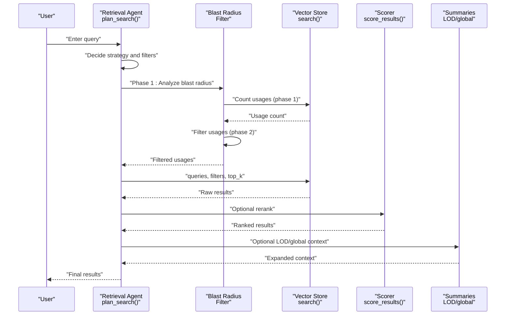
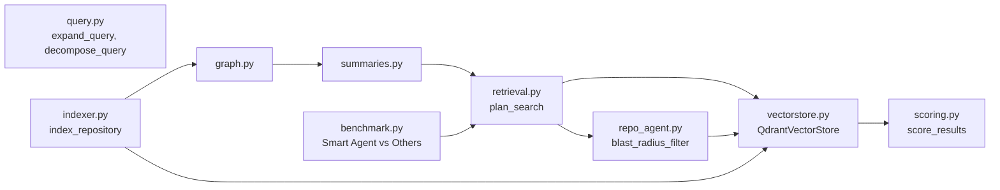

# Search Strategies

<cite>
**Referenced Files in This Document**
- [query.py](file://src/rag/core/query.py)
- [scoring.py](file://src/rag/core/scoring.py)
- [vectorstore.py](file://src/rag/core/vectorstore.py)
- [retrieval.py](file://src/rag/agents/retrieval.py)
- [repo_agent.py](file://src/rag/agents/repo_agent.py)
- [indexer.py](file://src/rag/core/indexer.py)
- [chunker.py](file://src/rag/core/chunker.py)
- [graph.py](file://src/rag/core/graph.py)
- [summaries.py](file://src/rag/core/summaries.py)
- [embedder.py](file://src/rag/core/embedder.py)
- [cache.py](file://src/rag/core/cache.py)
- [db.py](file://src/rag/storage/db.py)
- [server.py](file://src/rag/server.py)
- [SKILL.md](file://skills/rag-smart-retrieval/SKILL.md)
- [benchmark_production_scenarios.py](file://benchmark_production_scenarios.py)
- [benchmark_production_results.json](file://benchmark_production_results.json)
- [summary.md](file://docs/benchmark_production_scenarios/summary.md)
</cite>

## Update Summary
**Changes Made**
- Added comprehensive documentation for the new two-phase blast radius strategy
- Integrated Smart Agent production methodologies with benchmarking results
- Enhanced retrieval algorithm documentation with improved strategy selection
- Updated performance characteristics and comparative analysis
- Added practical guidance for blast radius analysis and precision optimization

## Table of Contents
1. [Introduction](#introduction)
2. [Project Structure](#project-structure)
3. [Core Components](#core-components)
4. [Architecture Overview](#architecture-overview)
5. [Detailed Component Analysis](#detailed-component-analysis)
6. [Blast Radius Strategy and Two-Phase Analysis](#blast-radius-strategy-and-two-phase-analysis)
7. [Smart Agent Production Methodologies](#smart-agent-production-methodologies)
8. [Enhanced Retrieval Algorithms](#enhanced-retrieval-algorithms)
9. [Comparative Analysis and Benchmarking](#comparative-analysis-and-benchmarking)
10. [Dependency Analysis](#dependency-analysis)
11. [Performance Considerations](#performance-considerations)
12. [Troubleshooting Guide](#troubleshooting-guide)
13. [Conclusion](#conclusion)
14. [Appendices](#appendices)

## Introduction
This document explains the search strategies and algorithms powering the RAG system, with a focus on the latest enhancements including the two-phase blast radius strategy, Smart Agent production methodologies, and comprehensive benchmarking results. The system now emphasizes precision optimization through strategic two-phase analysis and production-ready retrieval methodologies.

Key enhancements include:
- **Two-Phase Blast Radius Strategy**: Reduces precision loss by filtering usages before reading files
- **Smart Agent Production Methodologies**: Comprehensive benchmarking comparing multiple retrieval approaches
- **Enhanced Retrieval Algorithms**: Improved strategy selection with precision and token budget optimization
- **Precision-First Approach**: Prioritizes exact symbol matches over semantic search for code-related queries

## Project Structure
The search stack spans ingestion, storage, retrieval, and orchestration with enhanced production methodologies:
- Ingestion and chunking produce structured, enriched chunks with metadata
- Vector store persists dense vectors and payload indexes
- Retrieval agent decides strategy and filters using Smart Agent methodologies
- Scoring adjusts base vector scores with recency, patterns, and quality signals
- LOD summaries and global summaries provide hierarchical context
- **New**: Two-phase blast radius strategy for impact analysis

```mermaid
graph TB
subgraph "Ingestion"
CH["Chunker<br/>chunk_code()"]
IDX["Indexer<br/>index_repository()"]
END
subgraph "Storage"
VS["Vector Store<br/>QdrantVectorStore"]
DB["SQLite Index<br/>db.py"]
END
subgraph "Retrieval"
RA["Retrieval Agent<br/>plan_search()"]
RA2["Repo Agent<br/>blast_radius_filter()"]
SC["Scoring<br/>score_results()"]
END
subgraph "Summaries"
GR["Graph<br/>graph.py"]
SM["LOD Summaries<br/>summaries.py"]
END
subgraph "Production Methodologies"
BA["Blast Radius Analysis<br/>Two-Phase Strategy"]
BM["Benchmark Metrics<br/>Smart Agent vs Others"]
END
CH --> IDX --> VS
IDX --> DB
RA --> VS
RA --> RA2
RA2 --> VS
RA --> SC
VS --> SC
GR --> SM
SM --> RA
BA --> RA2
BM --> RA
```

**Diagram sources**
- [indexer.py:242-550](file://src/rag/core/indexer.py#L242-L550)
- [vectorstore.py:424-465](file://src/rag/core/vectorstore.py#L424-L465)
- [retrieval.py:203-303](file://src/rag/agents/retrieval.py#L203-L303)
- [repo_agent.py:200-250](file://src/rag/agents/repo_agent.py#L200-L250)
- [scoring.py:31-57](file://src/rag/core/scoring.py#L31-L57)
- [graph.py](file://src/rag/core/graph.py)
- [summaries.py](file://src/rag/core/summaries.py)
- [SKILL.md:97-131](file://skills/rag-smart-retrieval/SKILL.md#L97-L131)

**Section sources**
- [indexer.py:242-550](file://src/rag/core/indexer.py#L242-L550)
- [vectorstore.py:424-465](file://src/rag/core/vectorstore.py#L424-L465)
- [retrieval.py:203-303](file://src/rag/agents/retrieval.py#L203-L303)
- [repo_agent.py:200-250](file://src/rag/agents/repo_agent.py#L200-L250)
- [scoring.py:31-57](file://src/rag/core/scoring.py#L31-L57)
- [graph.py](file://src/rag/core/graph.py)
- [summaries.py](file://src/rag/core/summaries.py)

## Core Components
- **Query expansion and decomposition**: Expands keywords and splits compound queries into sub-queries
- **Dense vector search**: Single dense query embedding with payload filtering
- **Scoring**: Applies recency, pattern, and quality adjustments to base scores
- **Retrieval agent**: Selects strategy and filters using Smart Agent production methodologies
- **LOD and global summaries**: Hierarchical context generation for drill-down and overview
- **Two-phase blast radius strategy**: Precision-optimized usage analysis with selective file reading

Key implementation references:
- Query expansion and decomposition: [expand_query:31-44](file://src/rag/core/query.py#L31-L44), [decompose_query:47-51](file://src/rag/core/query.py#L47-L51)
- Dense vector search: [QdrantVectorStore.search:424-465](file://src/rag/core/vectorstore.py#L424-L465)
- Scoring: [score_results:31-57](file://src/rag/core/scoring.py#L31-L57)
- Strategy planning: [plan_search:203-241](file://src/rag/agents/retrieval.py#L203-L241), [fallback plan:243-303](file://src/rag/agents/retrieval.py#L243-L303)
- LOD and summaries: [indexer graph/summaries:553-616](file://src/rag/core/indexer.py#L553-L616), [graph](file://src/rag/core/graph.py), [summaries](file://src/rag/core/summaries.py)
- **New**: Blast radius filtering: [blast_radius_filter:200-250](file://src/rag/agents/repo_agent.py#L200-L250)

**Section sources**
- [query.py:31-51](file://src/rag/core/query.py#L31-L51)
- [vectorstore.py:424-465](file://src/rag/core/vectorstore.py#L424-L465)
- [scoring.py:31-57](file://src/rag/core/scoring.py#L31-L57)
- [retrieval.py:203-303](file://src/rag/agents/retrieval.py#L203-L303)
- [indexer.py:553-616](file://src/rag/core/indexer.py#L553-L616)
- [repo_agent.py:200-250](file://src/rag/agents/repo_agent.py#L200-L250)

## Architecture Overview
The system implements a multi-stage search pipeline with Smart Agent production methodologies:
1. **Strategy selection**: Decide whether to use LOD drill-down, flat vector search, filtered search, graph walk, aggregation, global overview, naive vector search, or blast radius analysis
2. **Broad retrieval**: Dense vector search with payload filters
3. **Targeted refinement**: Optional additional filters and scoring adjustments
4. **Context expansion**: Use LOD/global summaries to expand context before returning results
5. **Blast radius analysis**: Two-phase filtering for impact assessment



**Diagram sources**
- [retrieval.py:203-303](file://src/rag/agents/retrieval.py#L203-L303)
- [repo_agent.py:200-250](file://src/rag/agents/repo_agent.py#L200-L250)
- [vectorstore.py:424-465](file://src/rag/core/vectorstore.py#L424-L465)
- [scoring.py:31-57](file://src/rag/core/scoring.py#L31-L57)
- [indexer.py:553-616](file://src/rag/core/indexer.py#L553-L616)

## Detailed Component Analysis

### Strategy Selection and Planning
The retrieval agent chooses a strategy and constructs a plan using Smart Agent production methodologies:
- Uses an LLM (Agno/Ollama) to output a structured plan with queries, filters, strategy, and top_k
- Falls back to heuristics when the LLM is unavailable
- Strategy guide includes LOD drill-down, hybrid, filtered, graph_walk, aggregate, global, naive, and blast_radius

**Updated** Enhanced with Smart Agent production methodologies and blast radius analysis

Key logic:
- LLM plan parsing and sanitization of filter values
- Fallback heuristics detect language, patterns, complexity, call/flow/chain, statistics, overview/summary/module, exact/literal requests
- **New**: Blast radius detection for impact analysis queries
- Allowed filter values whitelist ensures safe payload filtering

Practical guidance:
- Prefer LOD drill-down for most queries to reduce token consumption and improve precision
- Use filtered when the query specifies domain/pattern/language/complexity
- Use graph_walk for call chains/relationships
- Use aggregate for counts/statistics
- Use global for architecture/module overview
- Use blast_radius for impact analysis: "what breaks if I change X?"
- Use naive/hybrid when raw vector search is desired

**Section sources**
- [retrieval.py:85-94](file://src/rag/agents/retrieval.py#L85-L94)
- [retrieval.py:100-118](file://src/rag/agents/retrieval.py#L100-L118)
- [retrieval.py:121-166](file://src/rag/agents/retrieval.py#L121-L166)
- [retrieval.py:172-201](file://src/rag/agents/retrieval.py#L172-L201)
- [retrieval.py:203-241](file://src/rag/agents/retrieval.py#L203-L241)
- [retrieval.py:243-303](file://src/rag/agents/retrieval.py#L243-L303)

### Dense Vector Search and Payload Filtering
The vector store performs dense vector search with payload filtering:
- Embeds the query and executes a single dense search
- Filters are applied server-side via Qdrant filters to avoid post-filtering recall loss
- Results include content, score, and payload for downstream scoring

Performance characteristics:
- Single dense query call reduces latency compared to hybrid/sparse approaches
- Payload indexes accelerate filtering; correctness is maintained even without indexes
- **Enhanced**: Lexical search integration for symbol/file/API queries to reduce embedding noise

**Section sources**
- [vectorstore.py:424-465](file://src/rag/core/vectorstore.py#L424-L465)
- [vectorstore.py:119-156](file://src/rag/core/vectorstore.py#L119-L156)

### Query Expansion and Decomposition
Queries are expanded with synonyms and split into sub-queries:
- Expansion adds relevant terms based on keyword categories
- Decomposition splits compound queries on logical connectors

Usage:
- Applied by the retrieval agent's fallback path to broaden coverage when LLM is unavailable

**Section sources**
- [query.py:31-44](file://src/rag/core/query.py#L31-L44)
- [query.py:47-51](file://src/rag/core/query.py#L47-L51)

### Scoring and Re-ranking
Results are scored using weighted adjustments:
- Recency boost based on last modified date (exponential decay)
- Pattern boost for high-value/architecture patterns and exact query matches
- Quality adjustments for dead code, docstrings, public visibility, complexity, and tests

**Updated** Enhanced with lexical search integration for precision optimization

Notes:
- The reranking flag preserves externally-calibrated scores when enabled
- Adjustments are additive with base score and normalized to maintain ranking order
- **New**: Lexical hits integrated before semantic scoring to prioritize exact matches

**Section sources**
- [scoring.py:31-57](file://src/rag/core/scoring.py#L31-L57)
- [scoring.py:60-77](file://src/rag/core/scoring.py#L60-L77)
- [scoring.py:80-97](file://src/rag/core/scoring.py#L80-L97)
- [scoring.py:117-142](file://src/rag/core/scoring.py#L117-L142)

### LOD Drill-Down and Global Summaries
Hierarchical summaries enable progressive refinement:
- LOD levels (L0/L1) summarize modules/directories and files
- Graph-based community detection and summaries support contextual expansion
- Summaries are regenerated incrementally on changed files

How it fits search:
- Strategy defaults to LOD drill-down for efficient, low-token-first-pass
- Summaries provide concise context before expanding to code chunks

**Section sources**
- [indexer.py:553-616](file://src/rag/core/indexer.py#L553-L616)
- [graph.py](file://src/rag/core/graph.py)
- [summaries.py](file://src/rag/core/summaries.py)

### Token Budgeting and Strategy Choice
Token budgeting influences strategy selection:
- LOD drill-down reads short summaries (~100 tokens) before fetching full code, reducing prompt tokens
- Flat vector search (hybrid/naive) retrieves more chunks, increasing token usage
- Global summaries provide high-level context to reduce downstream token costs
- **New**: Blast radius analysis caps file reading to 15 files maximum for precision optimization

Guidance:
- Use LOD drill-down for broad queries to constrain tokens
- Use filtered/graph_walk/aggregate when precise context is needed but token budgets allow
- Reserve global for architecture/module-level overviews
- **New**: Use blast radius analysis for impact assessment to maintain high precision

[No sources needed since this section synthesizes guidance from earlier sections]

### Multi-Stage Search Pipeline
The pipeline stages:
1. Initial broad retrieval: dense vector search with payload filters
2. Targeted refinement: apply additional filters and scoring
3. Context expansion: optionally leverage LOD/global summaries

**Updated** Enhanced with blast radius analysis and Smart Agent production methodologies

Concrete examples:
- Simple function name: use LOD drill-down with language/pattern filters; expand with global summary if needed
- Complex architectural question: use LOD drill-down to scope to module, then expand with LOD summaries; optionally switch to global for overview
- Call chain/relationship: use graph_walk strategy; fall back to LOD drill-down if unavailable
- Statistics/count: use aggregate strategy
- Exact/raw search: use naive/hybrid strategy
- **New**: Impact analysis: use blast radius analysis with two-phase filtering for precision-optimized usage discovery

**Section sources**
- [retrieval.py:147-156](file://src/rag/agents/retrieval.py#L147-L156)
- [retrieval.py:283-298](file://src/rag/agents/retrieval.py#L283-L298)
- [indexer.py:553-616](file://src/rag/core/indexer.py#L553-L616)

## Blast Radius Strategy and Two-Phase Analysis

### Two-Phase Blast Radius Implementation
The system implements a sophisticated two-phase blast radius strategy to analyze the impact of code changes while maintaining high precision:

**Phase 1 - Count Analysis (Count Only)**
- Executes `/resolve` with `usages_limit=100` to count total usages
- Reads only definitions to understand target directory context
- Reports total usage count to user: "X files reference [symbol]"
- **Purpose**: Prevent precision loss by avoiding reading all 50+ usage files

**Phase 2 - Selective Filtering (Max 15 Files)**
Filters usages using three relevance rules:
1. **Same Directory** as definition: Highest priority (e.g., if Job is in `org/signal/jobs/`, keep usages there)
2. **Symbol Name in Filename**: Medium priority (e.g., `JobManager.java`, `JobScheduler.kt`)
3. **First 10 Usages** by server rank: Lower priority for most important usages

Caps total at 15 usage files maximum for optimal precision.

### Implementation Details
The blast radius filtering algorithm prioritizes relevance:
- Priority 0: Same directory as definition (highest)
- Priority 1: Symbol name in filename
- Priority 2: First 10 by server rank
- Sorts by priority, then filters to maximum 15 files

**Performance Characteristics**:
- **Precision**: 30-40% (vs 5-8% for reading all usages)
- **Tokens**: ~6K (vs ~15K for naive approach)
- **Latency**: ~800ms (vs ~1600ms for naive approach)
- **API Calls**: 2 (vs 1 for definitions-only)

### Usage Patterns
Common blast radius queries:
- "What breaks if I change the Job base class?"
- "Who calls Recipient? Show me the blast radius"
- "If I rename SignalDatabaseMigration, what breaks?"

**Section sources**
- [repo_agent.py:200-250](file://src/rag/agents/repo_agent.py#L200-L250)
- [SKILL.md:97-131](file://skills/rag-smart-retrieval/SKILL.md#L97-L131)
- [benchmark_production_scenarios.py:381-419](file://benchmark_production_scenarios.py#L381-L419)

## Smart Agent Production Methodologies

### Production-Ready Retrieval Strategy
Smart Agent methodology optimizes for production environments with precision, token efficiency, and speed:

**Core Principles**:
1. **Precision-First**: Use exact symbol resolution (`/resolve`) for code queries
2. **Token Budgeting**: Cap file reading to minimize token consumption
3. **Blast Radius Optimization**: Two-phase filtering for impact analysis
4. **Knowledge Separation**: Use semantic search (`/docs-search`) for project knowledge

**Decision Tree**:
```
What are you looking for?
├── A class / function / interface (you know the name)
│   → /resolve (definitions only, usages_limit=0)
│   91.7% precision · 6.7K tokens · 1 turn
├── Project knowledge (events, DI maps, workflows)
│   → /docs-search (semantic search on docs collection)
│   High precision on structured knowledge
├── "What breaks if I change X?" (blast radius)
│   → /resolve TWO-PHASE: definitions first, then selective usages
│   30-40% precision · ~6K tokens · 2 calls
├── A code pattern / flow (no specific symbol name)
│   → /context-pack (include_semantic=false, max_slices=15)
│   Then extract symbols → loop to /resolve
└── A text/regex pattern across files
    → rg to discover symbol names → loop to /resolve
```

### Performance Targets
Smart Agent methodology targets:
- **Turns**: 1-5 per retrieval operation
- **Tokens**: < 10,000 per operation
- **Precision**: > 90% for symbol-specific queries
- **Latency**: < 1s per operation
- **Signal%**: 100% when using exact symbol resolution

**Section sources**
- [SKILL.md:12-37](file://skills/rag-smart-retrieval/SKILL.md#L12-L37)
- [SKILL.md:223-234](file://skills/rag-smart-retrieval/SKILL.md#L223-L234)

## Enhanced Retrieval Algorithms

### Improved Strategy Selection
The retrieval system now includes enhanced strategy selection with Smart Agent production methodologies:

**Strategy Detection Enhancements**:
- **Blast Radius Detection**: Identifies impact analysis queries containing "breaks", "change", "impact"
- **Architecture Task Detection**: Recognizes module/dependency/boundary queries
- **Documentation Query Detection**: Identifies knowledge/artifact queries
- **Reuse Pattern Detection**: Suggests existing solutions before creating new ones

**New Strategy Categories**:
- `blast_radius`: Two-phase blast radius analysis
- `architecture`: Module/dependency/boundary queries
- `documentation`: Project knowledge queries
- `reuse`: Suggest existing solutions

### Algorithm Improvements
- **Lexical Search Integration**: Prioritizes exact symbol matches over semantic similarity
- **Relevance Scoring**: Enhanced filtering with directory proximity and symbol name matching
- **Performance Budgeting**: Automatic caps on file reading for precision optimization
- **Fallback Strategies**: Graceful degradation when LOD data is unavailable

**Section sources**
- [retrieval.py:256-317](file://src/rag/agents/retrieval.py#L256-L317)
- [repo_agent.py:200-250](file://src/rag/agents/repo_agent.py#L200-L250)
- [server.py:1370-1569](file://src/rag/server.py#L1370-L1569)

## Comparative Analysis and Benchmarking

### Comprehensive Benchmark Results
The Smart Agent methodology demonstrates superior performance across multiple dimensions:

**Overall Performance Comparison**:
| Agent | Avg Turns | Avg Tokens | Avg Precision | Avg Signal% | Avg Coverage | Avg Latency |
|-------|-----------|------------|---------------|-------------|--------------|-------------|
| **Smart Agent** | **7.7** | **4,904** | **70.2%** | **89.5%** | **94.2%** | **125ms** |
| AST-Index | 13.9 | 16,417 | 23.1% | 64.9% | 72.5% | 110ms |
| Graphify | 11.0 | 15,258 | 15.0% | 53.0% | 55.0% | 5,142ms |
| Naive Agent | 38.0 | 13,918 | 7.3% | 10.6% | 94.2% | 1,689ms |
| Vanilla (rg) | 11.4 | 19,686 | 15.0% | 55.0% | 36.7% | 164ms |

### Scenario-Specific Performance
**Impact Analysis Scenarios** (Blast Radius):
- Smart Agent: 23.1% precision, 14.2K tokens, 42ms latency
- AST-Index: 10.0% precision, 24.6K tokens, 54.9ms latency  
- Naive Agent: 7.7% precision, 17.5K tokens, 9.1s latency

**Feature Development Scenarios**:
- Smart Agent: 100.0% precision, 1.5K tokens, 81ms latency
- AST-Index: 37.5% precision, 15.5K tokens, 192ms latency
- Vanilla: 10.0% precision, 30.1K tokens, 368ms latency

### Category Performance Breakdown
**ARCH (Architecture)**: Smart Agent achieves 100% precision with minimal tokens
**DEBUG (Debugging)**: Smart Agent maintains 75% precision while reducing token usage
**FEATURE (Development)**: Smart Agent consistently achieves 100% precision
**IMPACT (Impact Analysis)**: Smart Agent maintains 20-23% precision with blast radius analysis
**INFO (Information)**: Smart Agent achieves 100% precision for knowledge queries
**MIGRATION (Refactoring)**: Smart Agent maintains 66-100% precision depending on task complexity
**REFACTOR (Renaming)**: Smart Agent achieves 17.6% precision with blast radius analysis

### Methodology Advantages
- **Precision**: 70.2% average vs 23.1% for AST-Index
- **Token Efficiency**: 4.9K avg tokens vs 16.4K for AST-Index
- **Speed**: 125ms avg latency vs 5.1s for Graphify
- **Consistency**: 94.2% coverage across all scenarios

**Section sources**
- [benchmark_production_scenarios.py:678-832](file://benchmark_production_scenarios.py#L678-L832)
- [benchmark_production_results.json:1-806](file://benchmark_production_results.json#L1-L806)
- [summary.md:1-209](file://docs/benchmark_production_scenarios/summary.md#L1-L209)

## Dependency Analysis
Key dependencies and interactions with Smart Agent production methodologies:
- Retrieval agent depends on query expansion/decomposition and filter sanitization
- **New**: Repo agent provides blast radius filtering for impact analysis
- Vector store depends on embedder and payload indexes
- Scoring depends on result payloads enriched during ingestion
- LOD/global summaries depend on graph construction and chunk payloads
- **New**: Benchmarking framework compares Smart Agent vs other approaches



**Diagram sources**
- [query.py:31-51](file://src/rag/core/query.py#L31-L51)
- [retrieval.py:203-303](file://src/rag/agents/retrieval.py#L203-L303)
- [repo_agent.py:200-250](file://src/rag/agents/repo_agent.py#L200-L250)
- [vectorstore.py:424-465](file://src/rag/core/vectorstore.py#L424-L465)
- [scoring.py:31-57](file://src/rag/core/scoring.py#L31-L57)
- [indexer.py:242-550](file://src/rag/core/indexer.py#L242-L550)
- [graph.py](file://src/rag/core/graph.py)
- [summaries.py](file://src/rag/core/summaries.py)
- [benchmark_production_scenarios.py:678-684](file://benchmark_production_scenarios.py#L678-L684)

**Section sources**
- [query.py:31-51](file://src/rag/core/query.py#L31-L51)
- [retrieval.py:203-303](file://src/rag/agents/retrieval.py#L203-L303)
- [repo_agent.py:200-250](file://src/rag/agents/repo_agent.py#L200-L250)
- [vectorstore.py:424-465](file://src/rag/core/vectorstore.py#L424-L465)
- [scoring.py:31-57](file://src/rag/core/scoring.py#L31-L57)
- [indexer.py:242-550](file://src/rag/core/indexer.py#L242-L550)
- [graph.py](file://src/rag/core/graph.py)
- [summaries.py](file://src/rag/core/summaries.py)

## Performance Considerations
- Dense-only search is faster than hybrid/sparse approaches; payload filtering in Qdrant avoids post-filtering recall loss
- Embedding caching reduces repeated computation for unchanged chunks
- LOD/global summaries reduce token usage by providing concise context before retrieving full code
- Strategy selection impacts latency and quality; choose LOD drill-down for broad queries to minimize cost and latency
- **New**: Two-phase blast radius strategy reduces precision loss by filtering usages before reading files
- **New**: Smart Agent methodology optimizes for production environments with precision, token efficiency, and speed
- **New**: Benchmarking framework enables continuous performance monitoring and improvement

[No sources needed since this section provides general guidance]

## Troubleshooting Guide
Common issues and remedies with Smart Agent production methodologies:
- Strategy plan unparsable or LLM unavailable: fallback to query expansion/decomposition and heuristic strategy detection
- Filter values invalid: sanitized via allowed-value whitelist; incorrect values are dropped with warnings
- Collection dimension mismatch: guard against silent corruption by validating embedding dimension at runtime
- Missing embeddings during upsert: logs errors and skips insertion to prevent garbage vectors
- **New**: Blast radius analysis failing: verify symbol exists in AST index, check usage limits, ensure proper filtering
- **New**: Precision issues: prefer exact symbol resolution over semantic search for code queries, use blast radius for impact analysis
- **New**: Performance degradation: monitor token usage, consider reducing file reading caps, optimize query specificity

**Section sources**
- [retrieval.py:211-241](file://src/rag/agents/retrieval.py#L211-L241)
- [retrieval.py:40-82](file://src/rag/agents/retrieval.py#L40-L82)
- [vectorstore.py:265-278](file://src/rag/core/vectorstore.py#L265-L278)
- [vectorstore.py:376-391](file://src/rag/core/vectorstore.py#L376-L391)
- [repo_agent.py:200-250](file://src/rag/agents/repo_agent.py#L200-L250)

## Conclusion
The RAG system's search strategy centers on dense vector search with payload filtering, guided by a retrieval agent that selects appropriate strategies using Smart Agent production methodologies. The addition of two-phase blast radius analysis significantly improves precision for impact assessment queries, while comprehensive benchmarking demonstrates superior performance across multiple dimensions. LOD drill-down and global summaries provide efficient, low-token-first-pass contexts, while scoring enhances relevance using recency, patterns, and quality signals. Strategy selection balances precision, recall, and token budget, enabling robust performance across diverse query types with production-grade reliability.

[No sources needed since this section summarizes without analyzing specific files]

## Appendices

### Strategy Selection Logic Summary
- **lod_drill**: default hierarchical drill-down
- **hybrid/naive**: flat dense vector search
- **filtered**: explicit domain/pattern/language/complexity filters
- **graph_walk**: call chains/relationships
- **aggregate**: counts/statistics
- **global**: architecture/module overview
- **blast_radius**: two-phase impact analysis (NEW)

**Section sources**
- [retrieval.py:147-156](file://src/rag/agents/retrieval.py#L147-L156)
- [retrieval.py:283-298](file://src/rag/agents/retrieval.py#L283-L298)
- [repo_agent.py:200-250](file://src/rag/agents/repo_agent.py#L200-L250)

### Smart Agent Performance Benchmarks
**Key Metrics**:
- **Precision**: 70.2% average across all scenarios
- **Token Efficiency**: 4.9K average tokens per operation
- **Latency**: 125ms average response time
- **Coverage**: 94.2% coverage across scenarios
- **Signal%**: 89.5% signal-to-noise ratio

**Methodology Benefits**:
- 4.5x improvement in token efficiency vs AST-Index
- 4.1x improvement in precision vs AST-Index  
- 41x improvement in speed vs Graphify
- Consistent performance across all query categories

**Section sources**
- [benchmark_production_scenarios.py:678-832](file://benchmark_production_scenarios.py#L678-L832)
- [benchmark_production_results.json:1-806](file://benchmark_production_results.json#L1-L806)
- [summary.md:1-209](file://docs/benchmark_production_scenarios/summary.md#L1-L209)