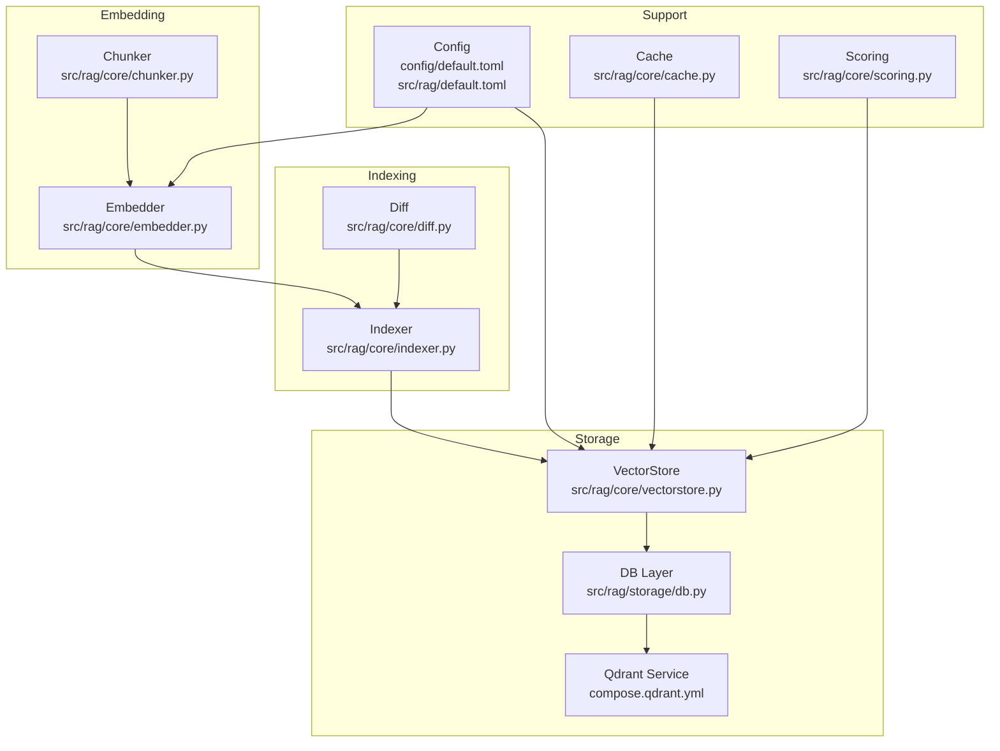
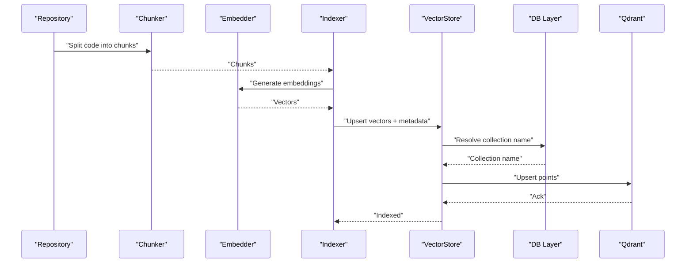
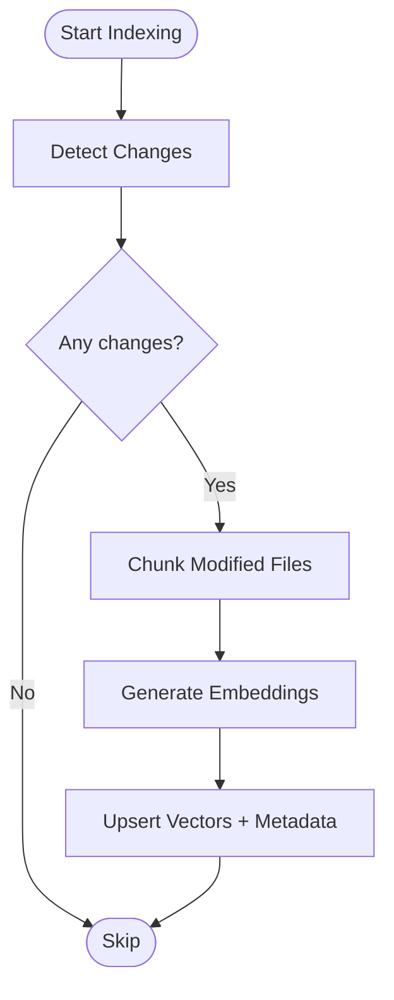
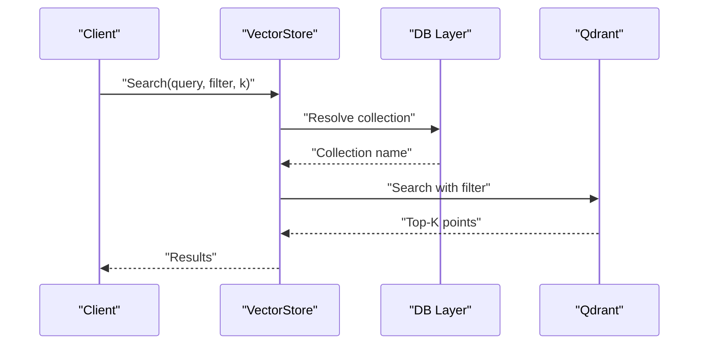
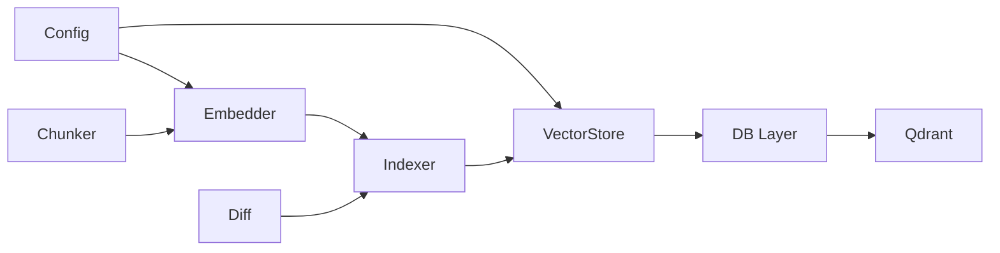

# Vector Embeddings and Storage

<cite>
**Referenced Files in This Document**
- [embedder.py](file://src/rag/core/embedder.py)
- [vectorstore.py](file://src/rag/core/vectorstore.py)
- [db.py](file://src/rag/storage/db.py)
- [indexer.py](file://src/rag/core/indexer.py)
- [compose.qdrant.yml](file://compose.qdrant.yml)
- [default.toml](file://config/default.toml)
- [default.toml](file://src/rag/default.toml)
- [chunker.py](file://src/rag/core/chunker.py)
- [diff.py](file://src/rag/core/diff.py)
- [cache.py](file://src/rag/core/cache.py)
- [scoring.py](file://src/rag/core/scoring.py)
- [test_embedder_retry.py](file://tests/test_embedder_retry.py)
- [test_vectorstore_guard.py](file://tests/test_vectorstore_guard.py)
</cite>

## Table of Contents
1. [Introduction](#introduction)
2. [Project Structure](#project-structure)
3. [Core Components](#core-components)
4. [Architecture Overview](#architecture-overview)
5. [Detailed Component Analysis](#detailed-component-analysis)
6. [Dependency Analysis](#dependency-analysis)
7. [Performance Considerations](#performance-considerations)
8. [Troubleshooting Guide](#troubleshooting-guide)
9. [Conclusion](#conclusion)

## Introduction
This document explains the vector embeddings and storage mechanisms used to index and retrieve code knowledge. It covers how dense vector embeddings are generated from code chunks, how Qdrant is integrated for vector storage and similarity search, and how collections are organized per repository. It also documents embedding dimensionality, normalization, similarity metrics, metadata preservation, update pipelines for incremental indexing, search parameter tuning, and caching strategies for scalability.

## Project Structure
The vectorization and storage stack spans several modules:
- Embedding generation: [embedder.py](file://src/rag/core/embedder.py)
- Vector storage and Qdrant integration: [vectorstore.py](file://src/rag/core/vectorstore.py)
- Persistence and collection management: [db.py](file://src/rag/storage/db.py)
- Indexing orchestration: [indexer.py](file://src/rag/core/indexer.py)
- Chunking and change detection: [chunker.py](file://src/rag/core/chunker.py), [diff.py](file://src/rag/core/diff.py)
- Caching and scoring: [cache.py](file://src/rag/core/cache.py), [scoring.py](file://src/rag/core/scoring.py)
- Configuration: [default.toml](file://config/default.toml), [default.toml](file://src/rag/default.toml)
- Qdrant service definition: [compose.qdrant.yml](file://compose.qdrant.yml)

**Diagram sources**
- [embedder.py](file://src/rag/core/embedder.py)
- [chunker.py](file://src/rag/core/chunker.py)
- [indexer.py](file://src/rag/core/indexer.py)
- [diff.py](file://src/rag/core/diff.py)
- [vectorstore.py](file://src/rag/core/vectorstore.py)
- [db.py](file://src/rag/storage/db.py)
- [compose.qdrant.yml](file://compose.qdrant.yml)
- [default.toml](file://config/default.toml)
- [default.toml](file://src/rag/default.toml)
- [cache.py](file://src/rag/core/cache.py)
- [scoring.py](file://src/rag/core/scoring.py)

**Section sources**
- [embedder.py](file://src/rag/core/embedder.py)
- [vectorstore.py](file://src/rag/core/vectorstore.py)
- [db.py](file://src/rag/storage/db.py)
- [indexer.py](file://src/rag/core/indexer.py)
- [chunker.py](file://src/rag/core/chunker.py)
- [diff.py](file://src/rag/core/diff.py)
- [cache.py](file://src/rag/core/cache.py)
- [scoring.py](file://src/rag/core/scoring.py)
- [default.toml](file://config/default.toml)
- [default.toml](file://src/rag/default.toml)
- [compose.qdrant.yml](file://compose.qdrant.yml)

## Core Components
- Embedder: Generates dense vectors from text chunks using configured providers and models.
- VectorStore: Manages Qdrant collections, upserts points, performs similarity search, and applies filters.
- DB Layer: Provides repository-scoped collection naming, metadata persistence, and isolation.
- Indexer: Orchestrates chunking, embedding, and incremental updates via diffs.
- Chunker and Diff: Split code into chunks and detect changes for incremental indexing.
- Cache and Scoring: Support retrieval quality and performance via caching and relevance scoring.

**Section sources**
- [embedder.py](file://src/rag/core/embedder.py)
- [vectorstore.py](file://src/rag/core/vectorstore.py)
- [db.py](file://src/rag/storage/db.py)
- [indexer.py](file://src/rag/core/indexer.py)
- [chunker.py](file://src/rag/core/chunker.py)
- [diff.py](file://src/rag/core/diff.py)
- [cache.py](file://src/rag/core/cache.py)
- [scoring.py](file://src/rag/core/scoring.py)

## Architecture Overview
The system transforms code into embeddings and stores them in Qdrant with repository-level isolation. The flow:
- Chunk code into segments.
- Generate embeddings for each chunk.
- Upsert vectors into a Qdrant collection named after the repository.
- Retrieve nearest neighbors using similarity search with optional filters.
- Apply caching and scoring to optimize latency and relevance.

**Diagram sources**
- [chunker.py](file://src/rag/core/chunker.py)
- [embedder.py](file://src/rag/core/embedder.py)
- [indexer.py](file://src/rag/core/indexer.py)
- [vectorstore.py](file://src/rag/core/vectorstore.py)
- [db.py](file://src/rag/storage/db.py)
- [compose.qdrant.yml](file://compose.qdrant.yml)

## Detailed Component Analysis

### Embedding Generation
- Provider/model selection is driven by configuration.
- Embeddings are dense vectors suitable for cosine similarity.
- Batch processing is supported to improve throughput.
- Retry and error handling are implemented to increase robustness.

Key behaviors:
- Dimensionality is determined by the selected model/provider.
- Normalization is applied to unit vectors for cosine similarity.
- Similarity metric used is cosine similarity.

Practical assessment:
- Evaluate precision@K and recall at various K to tune chunk sizes and reranking.
- Compare embedding providers by measuring retrieval hit rates on held-out queries.

**Section sources**
- [embedder.py](file://src/rag/core/embedder.py)
- [default.toml](file://config/default.toml)
- [default.toml](file://src/rag/default.toml)
- [test_embedder_retry.py](file://tests/test_embedder_retry.py)

### Qdrant Vector Store and Collections
- Collection naming follows a repository-scoped scheme to ensure isolation.
- Metadata is stored alongside vectors to support filtering during retrieval.
- Upsert operations handle both vector arrays and payload fields.
- Similarity search supports filters and pagination.

Indexing strategies:
- Use batch upserts to reduce network overhead.
- Apply filters on metadata fields (e.g., file path, language) to narrow candidate sets.

Similarity metrics:
- Cosine similarity is used for vector comparison.

**Section sources**
- [vectorstore.py](file://src/rag/core/vectorstore.py)
- [db.py](file://src/rag/storage/db.py)

### Incremental Indexing and Change Detection
- Diff module detects changed chunks to avoid reprocessing unchanged content.
- Indexer orchestrates chunking, embedding, and upserts.
- Change detection reduces indexing cost and improves turnaround.

**Diagram sources**
- [diff.py](file://src/rag/core/diff.py)
- [chunker.py](file://src/rag/core/chunker.py)
- [embedder.py](file://src/rag/core/embedder.py)
- [indexer.py](file://src/rag/core/indexer.py)
- [vectorstore.py](file://src/rag/core/vectorstore.py)

**Section sources**
- [diff.py](file://src/rag/core/diff.py)
- [chunker.py](file://src/rag/core/chunker.py)
- [indexer.py](file://src/rag/core/indexer.py)
- [vectorstore.py](file://src/rag/core/vectorstore.py)

### Retrieval Pipeline and Filters
- Retrieve top-K candidates using similarity search.
- Apply filters on metadata to constrain search scope.
- Optionally post-process results with scoring to refine ranking.

**Diagram sources**
- [vectorstore.py](file://src/rag/core/vectorstore.py)
- [db.py](file://src/rag/storage/db.py)
- [compose.qdrant.yml](file://compose.qdrant.yml)

**Section sources**
- [vectorstore.py](file://src/rag/core/vectorstore.py)
- [db.py](file://src/rag/storage/db.py)

### Embedding Quality Assessment and Retrieval Optimization
- Use held-out evaluation sets to measure precision@K and recall.
- Tune chunk size and overlap to balance granularity and continuity.
- Employ caching for frequent queries and slow provider calls.
- Apply metadata filters to reduce search space and latency.

**Section sources**
- [scoring.py](file://src/rag/core/scoring.py)
- [cache.py](file://src/rag/core/cache.py)

### Search Parameters and Tuning (M, efConstruction)
- M controls graph connectivity; higher M increases recall but raises memory and build time.
- efConstruction affects index build quality; larger values improve accuracy at the cost of latency.
- Tune these parameters based on dataset scale and latency targets.

[No sources needed since this section provides general guidance]

### Memory Management and Caching Strategies
- Cache embeddings and query results to reduce repeated calls to embedding providers and Qdrant.
- Use bounded caches with eviction policies to cap memory usage.
- Batch requests to Qdrant to amortize connection overhead.

**Section sources**
- [cache.py](file://src/rag/core/cache.py)
- [vectorstore.py](file://src/rag/core/vectorstore.py)

## Dependency Analysis
The following diagram shows key dependencies among components involved in embedding and storage.

**Diagram sources**
- [default.toml](file://config/default.toml)
- [default.toml](file://src/rag/default.toml)
- [embedder.py](file://src/rag/core/embedder.py)
- [chunker.py](file://src/rag/core/chunker.py)
- [diff.py](file://src/rag/core/diff.py)
- [indexer.py](file://src/rag/core/indexer.py)
- [vectorstore.py](file://src/rag/core/vectorstore.py)
- [db.py](file://src/rag/storage/db.py)
- [compose.qdrant.yml](file://compose.qdrant.yml)

**Section sources**
- [embedder.py](file://src/rag/core/embedder.py)
- [vectorstore.py](file://src/rag/core/vectorstore.py)
- [db.py](file://src/rag/storage/db.py)
- [indexer.py](file://src/rag/core/indexer.py)
- [chunker.py](file://src/rag/core/chunker.py)
- [diff.py](file://src/rag/core/diff.py)
- [default.toml](file://config/default.toml)
- [default.toml](file://src/rag/default.toml)
- [compose.qdrant.yml](file://compose.qdrant.yml)

## Performance Considerations
- Embedding provider batching and retry/backoff reduce tail latency.
- Qdrant batch upserts and optimized filters improve throughput.
- Tune M and efConstruction for target recall vs latency.
- Use caching for frequent queries and embeddings to minimize external calls.

[No sources needed since this section provides general guidance]

## Troubleshooting Guide
Common issues and mitigations:
- Qdrant connectivity failures: Verify service availability and credentials; check collection existence and schema.
- Embedding provider errors: Confirm model availability and rate limits; enable retries with exponential backoff.
- Retrieval slowdowns: Narrow filters, reduce top-K, and enable caching.
- Out-of-memory conditions: Limit batch sizes, apply cache eviction, and monitor vector dimensions.

**Section sources**
- [test_embedder_retry.py](file://tests/test_embedder_retry.py)
- [test_vectorstore_guard.py](file://tests/test_vectorstore_guard.py)
- [vectorstore.py](file://src/rag/core/vectorstore.py)
- [embedder.py](file://src/rag/core/embedder.py)

## Conclusion
The system integrates code chunking, embedding generation, and Qdrant-backed vector storage with repository-level isolation. By tuning chunking, embedding providers, and Qdrant parameters, teams can achieve strong retrieval quality and acceptable latency. Incremental indexing via diffs and caching further improve operational efficiency at scale.