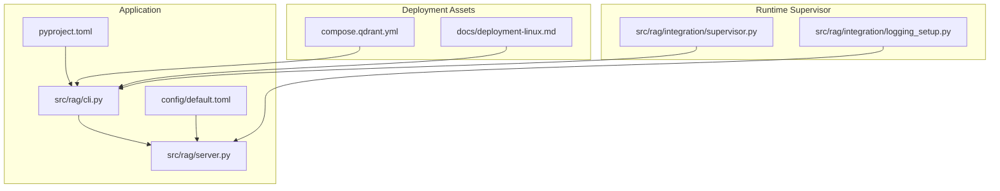
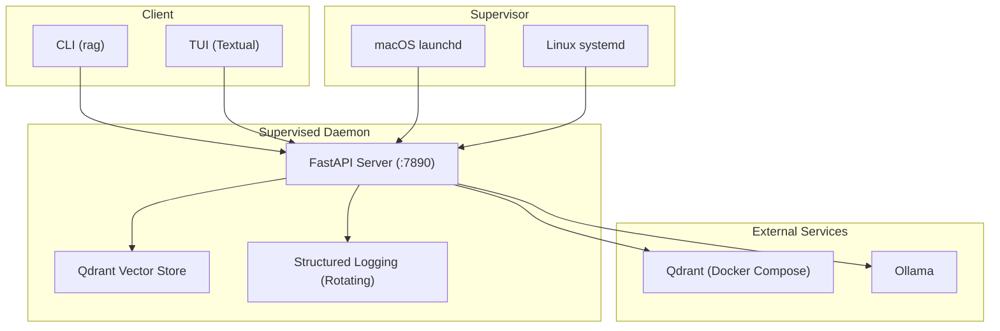
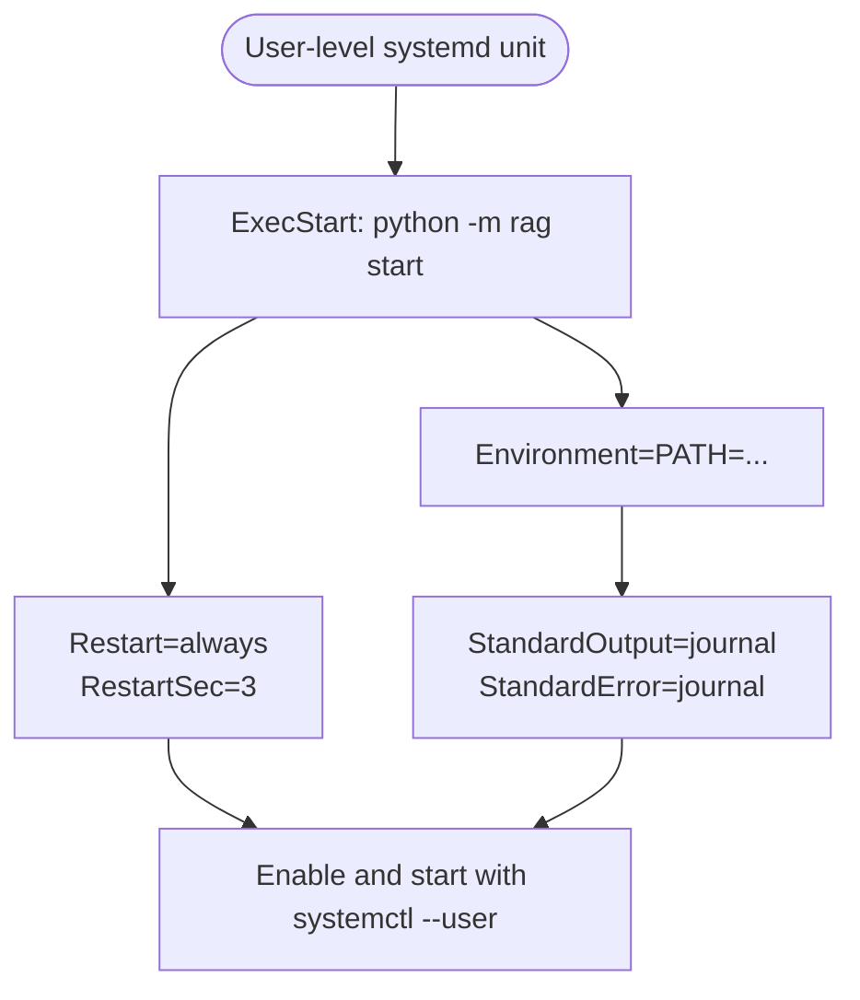
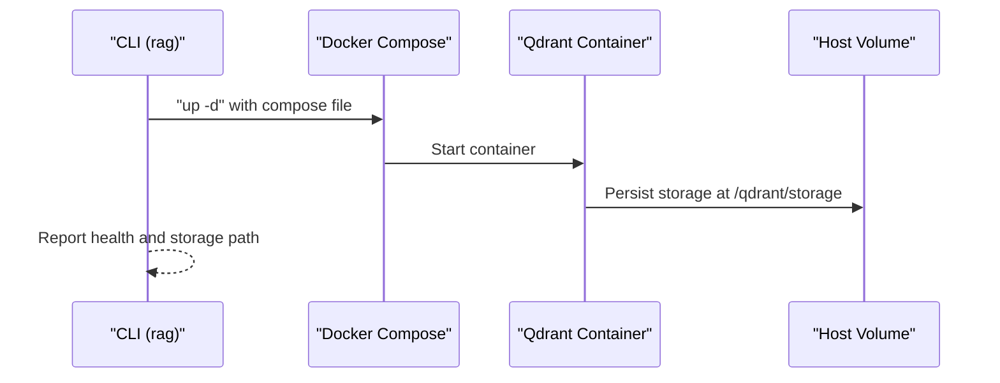
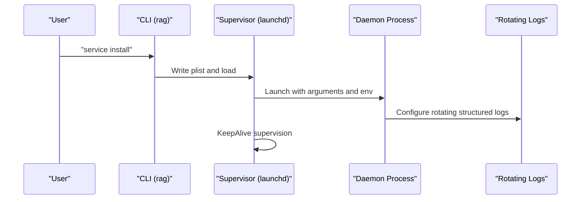
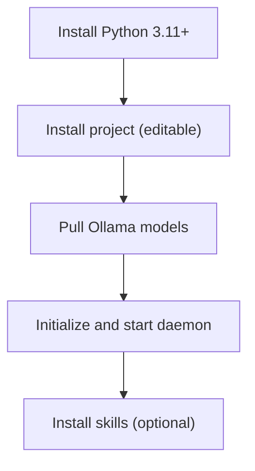
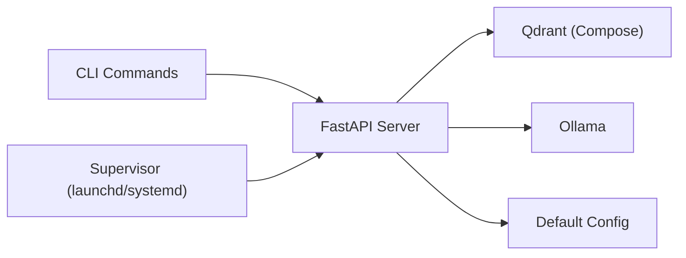

# Deployment Strategies

<cite>
**Referenced Files in This Document**
- [compose.qdrant.yml](file://compose.qdrant.yml)
- [docs/deployment-linux.md](file://docs/deployment-linux.md)
- [src/rag/integration/supervisor.py](file://src/rag/integration/supervisor.py)
- [src/rag/integration/logging_setup.py](file://src/rag/integration/logging_setup.py)
- [src/rag/cli.py](file://src/rag/cli.py)
- [src/rag/server.py](file://src/rag/server.py)
- [config/default.toml](file://config/default.toml)
- [pyproject.toml](file://pyproject.toml)
- [README.md](file://README.md)
</cite>

## Table of Contents
1. [Introduction](#introduction)
2. [Project Structure](#project-structure)
3. [Core Components](#core-components)
4. [Architecture Overview](#architecture-overview)
5. [Detailed Component Analysis](#detailed-component-analysis)
6. [Dependency Analysis](#dependency-analysis)
7. [Performance Considerations](#performance-considerations)
8. [Troubleshooting Guide](#troubleshooting-guide)
9. [Conclusion](#conclusion)
10. [Appendices](#appendices)

## Introduction
This document provides comprehensive deployment strategies for the RAG system across multiple environments and methods. It covers:
- Linux systemd deployment (user-level and system-wide)
- Docker Compose deployment for the vector database
- Supervised daemon architecture and auto-start mechanisms via launchd on macOS
- Bare metal installation, virtual environment setup, and dependency management
- Environment-specific configurations, PATH settings, and service dependencies
- Step-by-step installation guides with practical examples and troubleshooting tips

## Project Structure
The repository organizes deployment-related assets and runtime components as follows:
- Deployment configuration and documentation:
  - Linux systemd unit example and guidance
  - Docker Compose file for the vector database
- Runtime supervisor integrations:
  - macOS launchd integration for auto-start and supervision
  - Structured logging with rotation for supervised daemons
- Application entrypoints and commands:
  - CLI commands for starting the daemon, managing Qdrant, and interacting with the system
  - Server configuration and runtime behavior

**Diagram sources**
- [compose.qdrant.yml:1-11](file://compose.qdrant.yml#L1-L11)
- [docs/deployment-linux.md:1-57](file://docs/deployment-linux.md#L1-L57)
- [src/rag/integration/supervisor.py:1-153](file://src/rag/integration/supervisor.py#L1-L153)
- [src/rag/integration/logging_setup.py:1-108](file://src/rag/integration/logging_setup.py#L1-L108)
- [src/rag/cli.py:1-800](file://src/rag/cli.py#L1-L800)
- [src/rag/server.py:1-800](file://src/rag/server.py#L1-L800)
- [config/default.toml:1-41](file://config/default.toml#L1-L41)
- [pyproject.toml:1-83](file://pyproject.toml#L1-L83)

**Section sources**
- [compose.qdrant.yml:1-11](file://compose.qdrant.yml#L1-L11)
- [docs/deployment-linux.md:1-57](file://docs/deployment-linux.md#L1-L57)
- [src/rag/integration/supervisor.py:1-153](file://src/rag/integration/supervisor.py#L1-L153)
- [src/rag/integration/logging_setup.py:1-108](file://src/rag/integration/logging_setup.py#L1-L108)
- [src/rag/cli.py:1-800](file://src/rag/cli.py#L1-L800)
- [src/rag/server.py:1-800](file://src/rag/server.py#L1-L800)
- [config/default.toml:1-41](file://config/default.toml#L1-L41)
- [pyproject.toml:1-83](file://pyproject.toml#L1-L83)

## Core Components
- Daemon process: A headless FastAPI server listening on localhost by default, designed to be supervised by OS-level services.
- CLI: Provides commands to start the daemon, manage Qdrant, and interact with the system.
- Vector database: Qdrant is configured to run locally via Docker Compose.
- Supervisor integrations: macOS launchd integration for auto-start and supervision; Linux systemd guidance is provided in documentation.

Key runtime characteristics:
- The daemon binds to 127.0.0.1 by default and requires a bearer token for authenticated requests.
- Structured logging with rotation is configured to prevent disk growth under supervision.
- Environment variables such as PATH and optional Ollama host are forwarded to the supervised process.

**Section sources**
- [src/rag/server.py:603-716](file://src/rag/server.py#L603-L716)
- [src/rag/cli.py:162-244](file://src/rag/cli.py#L162-L244)
- [config/default.toml:1-41](file://config/default.toml#L1-L41)
- [src/rag/integration/logging_setup.py:38-108](file://src/rag/integration/logging_setup.py#L38-L108)

## Architecture Overview
The deployment architecture centers on a supervised daemon that remains resilient to client crashes. The CLI and TUI are thin clients that communicate with the daemon over HTTP.

**Diagram sources**
- [src/rag/server.py:721-799](file://src/rag/server.py#L721-L799)
- [src/rag/cli.py:246-280](file://src/rag/cli.py#L246-L280)
- [src/rag/integration/supervisor.py:46-111](file://src/rag/integration/supervisor.py#L46-L111)
- [compose.qdrant.yml:1-11](file://compose.qdrant.yml#L1-L11)

## Detailed Component Analysis

### Linux systemd Deployment
- Purpose: Run the daemon as a user-level service on Linux with automatic restarts and logging to the systemd journal.
- Key elements:
  - ExecStart points to the Python module entrypoint for the daemon.
  - Restart policy is set to always with a short delay.
  - PATH is explicitly set to ensure external tools (e.g., Ollama, git) are discoverable.
  - Optional environment variables can forward Ollama host settings.
  - Logs are captured by the systemd journal; the daemon also writes rotated structured logs to a dedicated directory.

**Diagram sources**
- [docs/deployment-linux.md:8-41](file://docs/deployment-linux.md#L8-L41)

Practical steps:
- Save the provided unit file to the user systemd directory.
- Reload and enable the unit, then check status and follow logs.
- To survive logout, enable lingering for the user.

Operational notes:
- The daemon listens on localhost by default; do not bind to all interfaces.
- Bearer token is stored securely and backed up on encrypted storage.
- Restart behavior mirrors macOS launchd KeepAlive semantics.

**Section sources**
- [docs/deployment-linux.md:1-57](file://docs/deployment-linux.md#L1-L57)

### Docker Compose Deployment (Qdrant)
- Purpose: Provision a local Qdrant instance for vector storage.
- Key elements:
  - Image tag pinned to latest; container name is set.
  - Ports mapped to localhost with explicit binding.
  - Volume mounted to a user-writable directory for persistence.

**Diagram sources**
- [src/rag/cli.py:246-262](file://src/rag/cli.py#L246-L262)
- [compose.qdrant.yml:1-11](file://compose.qdrant.yml#L1-L11)

Practical steps:
- Start Qdrant with the provided compose file.
- Verify health and storage location.
- Stop or bring down the service when not needed.

Networking and volumes:
- Ports exposed locally for health checks and client access.
- Host volume ensures persistence across restarts.

**Section sources**
- [compose.qdrant.yml:1-11](file://compose.qdrant.yml#L1-L11)
- [src/rag/cli.py:246-280](file://src/rag/cli.py#L246-L280)

### Supervised Daemon Architecture and launchd (macOS)
- Purpose: Auto-start and supervise the daemon on macOS using launchd.
- Key elements:
  - Generates a launchd plist that runs the daemon as a background process.
  - Pulls PATH and selected environment variables from the current environment.
  - Uses KeepAlive to ensure continuous operation.
  - Writes logs to dedicated files for monitoring.

**Diagram sources**
- [src/rag/integration/supervisor.py:75-111](file://src/rag/integration/supervisor.py#L75-L111)
- [src/rag/integration/logging_setup.py:38-108](file://src/rag/integration/logging_setup.py#L38-L108)

Practical steps:
- Install the service via the CLI command.
- Check status and review logs.
- Uninstall the service when needed.

Environment variables:
- PATH is forwarded to ensure discovery of external tools.
- Optional variables (e.g., OLLAMA_HOST) are forwarded if present.

**Section sources**
- [src/rag/integration/supervisor.py:1-153](file://src/rag/integration/supervisor.py#L1-L153)
- [src/rag/integration/logging_setup.py:1-108](file://src/rag/integration/logging_setup.py#L1-L108)

### Bare Metal Installation and Virtual Environment Setup
- Prerequisites:
  - Python 3.11+ is required.
  - Ollama is required for embeddings and recommended for the planner agent.
- Steps:
  - Install the project in editable mode.
  - Pull the required Ollama models.
  - Initialize the system and start the daemon.
  - Optionally install project-owned skills.

**Diagram sources**
- [README.md:9-35](file://README.md#L9-L35)
- [pyproject.toml:1-83](file://pyproject.toml#L1-L83)

Notes:
- The CLI provides commands to start the daemon and manage Qdrant.
- Dependencies are declared in the project configuration.

**Section sources**
- [README.md:9-35](file://README.md#L9-L35)
- [pyproject.toml:1-83](file://pyproject.toml#L1-L83)

### Environment-Specific Configurations and Service Dependencies
- Server configuration:
  - Host defaults to localhost; port is set for the daemon.
  - Authentication relies on a bearer token stored in a secure location.
- Vector database configuration:
  - Qdrant is configured to connect to a local server URL.
  - Collections and storage paths are defined.
- External dependencies:
  - Ollama is required for embeddings and agent LLM.
  - PATH must include locations for external tools (e.g., git, Ollama).

**Section sources**
- [config/default.toml:1-41](file://config/default.toml#L1-L41)
- [src/rag/server.py:582-598](file://src/rag/server.py#L582-L598)
- [docs/deployment-linux.md:23-26](file://docs/deployment-linux.md#L23-L26)

## Dependency Analysis
The deployment pipeline depends on:
- CLI commands orchestrating the daemon lifecycle and Qdrant management
- Supervisor integrations for OS-level auto-start and supervision
- Runtime server configuration and environment variables
- Docker Compose for vector database provisioning

**Diagram sources**
- [src/rag/cli.py:246-280](file://src/rag/cli.py#L246-L280)
- [src/rag/integration/supervisor.py:46-111](file://src/rag/integration/supervisor.py#L46-L111)
- [src/rag/server.py:603-716](file://src/rag/server.py#L603-L716)
- [config/default.toml:21-26](file://config/default.toml#L21-L26)

**Section sources**
- [src/rag/cli.py:246-280](file://src/rag/cli.py#L246-L280)
- [src/rag/integration/supervisor.py:46-111](file://src/rag/integration/supervisor.py#L46-L111)
- [src/rag/server.py:603-716](file://src/rag/server.py#L603-L716)
- [config/default.toml:21-26](file://config/default.toml#L21-L26)

## Performance Considerations
- Logging rotation prevents disk growth under supervision; ensure adequate disk space for logs.
- The daemon initializes and maintains a warm probe for the embedder to track latency.
- Watch mode can trigger incremental reindexing on file changes; use judiciously to avoid excessive I/O.

[No sources needed since this section provides general guidance]

## Troubleshooting Guide
Common issues and remedies:
- Daemon not reachable:
  - Verify the daemon is running and listening on the expected host/port.
  - Confirm the bearer token exists and is readable.
- Qdrant connectivity:
  - Ensure the Qdrant container is running and healthy.
  - Check port bindings and volume mounts.
- Supervisor behavior:
  - On Linux, confirm the user-level unit is enabled and the user is allowed to linger if needed.
  - On macOS, verify the launchd plist is loaded and logs are being written.
- Environment variables:
  - Ensure PATH includes required tools (e.g., git, Ollama).
  - Optionally set OLLAMA_HOST if the default host is not suitable.

**Section sources**
- [src/rag/cli.py:33-48](file://src/rag/cli.py#L33-L48)
- [src/rag/cli.py:282-300](file://src/rag/cli.py#L282-L300)
- [src/rag/integration/logging_setup.py:38-108](file://src/rag/integration/logging_setup.py#L38-L108)
- [docs/deployment-linux.md:43-57](file://docs/deployment-linux.md#L43-L57)

## Conclusion
This document outlines robust deployment strategies for the RAG system across Linux, macOS, and bare metal environments. By leveraging OS-level supervisors, Docker Compose for vector storage, and structured logging, the system achieves reliable operation with minimal operational overhead. Follow the step-by-step guides and troubleshooting tips to deploy and maintain the system effectively.

[No sources needed since this section summarizes without analyzing specific files]

## Appendices

### Step-by-Step Installation Guides

- Linux (systemd)
  - Save the user-level unit file to the user systemd directory.
  - Reload and enable the unit, then check status and follow logs.
  - To survive logout, enable lingering for the user.

- Docker Compose (Qdrant)
  - Start Qdrant with the provided compose file.
  - Verify health and storage location.
  - Stop or bring down the service when not needed.

- macOS (launchd)
  - Install the service via the CLI command.
  - Check status and review logs.
  - Uninstall the service when needed.

- Bare Metal
  - Install the project in editable mode.
  - Pull the required Ollama models.
  - Initialize the system and start the daemon.
  - Optionally install project-owned skills.

**Section sources**
- [docs/deployment-linux.md:8-57](file://docs/deployment-linux.md#L8-L57)
- [src/rag/cli.py:246-280](file://src/rag/cli.py#L246-L280)
- [src/rag/integration/supervisor.py:75-111](file://src/rag/integration/supervisor.py#L75-L111)
- [README.md:9-35](file://README.md#L9-L35)