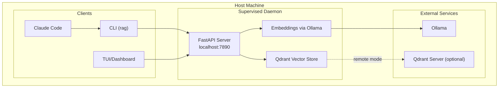
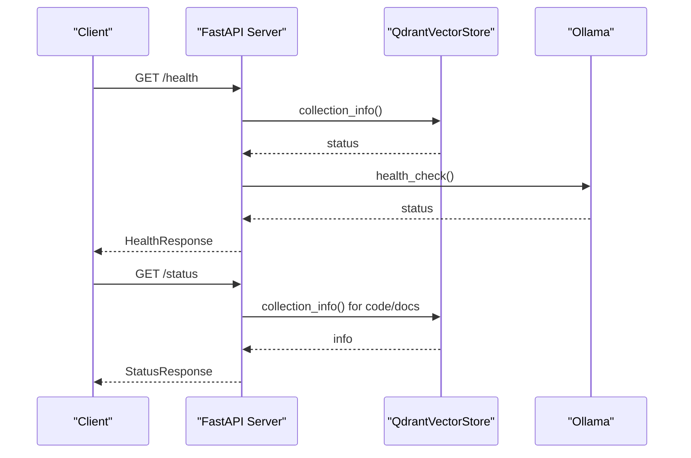
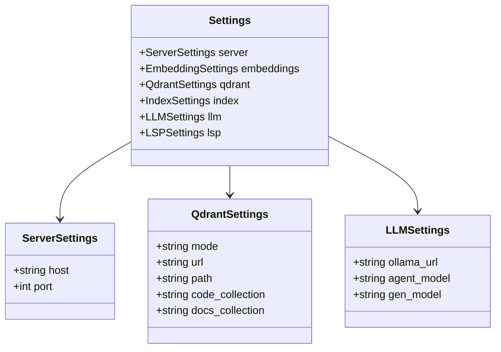
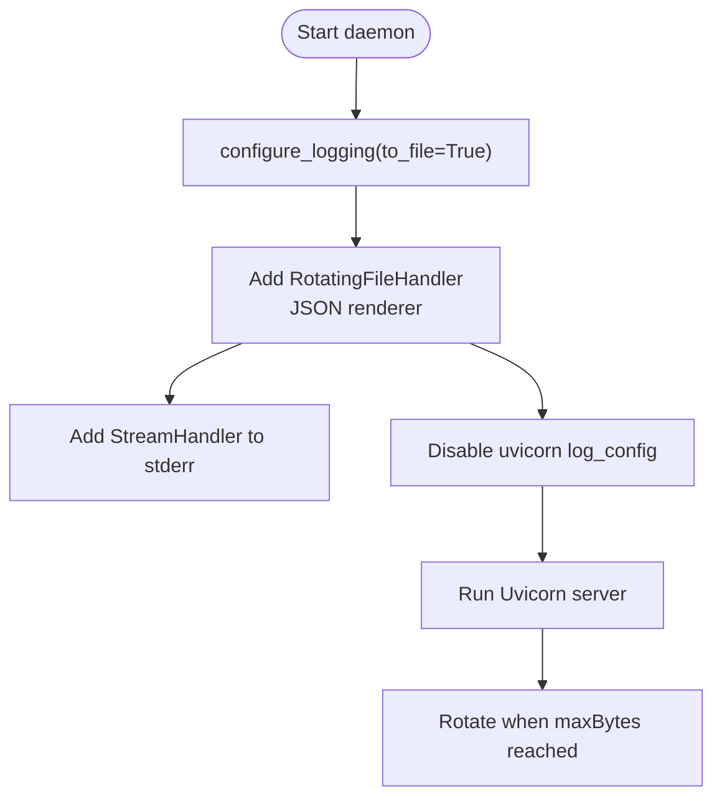
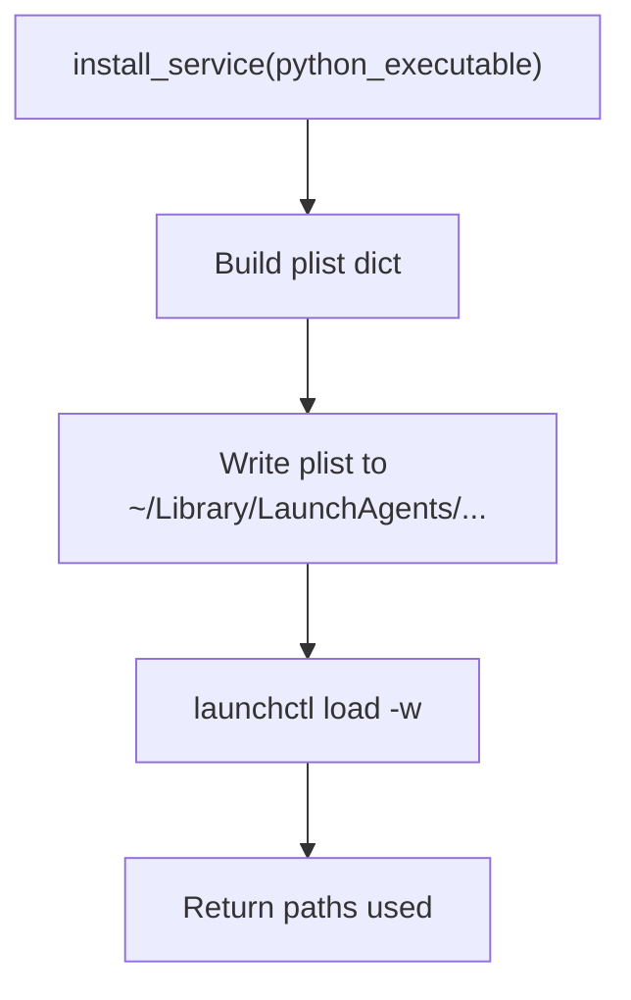
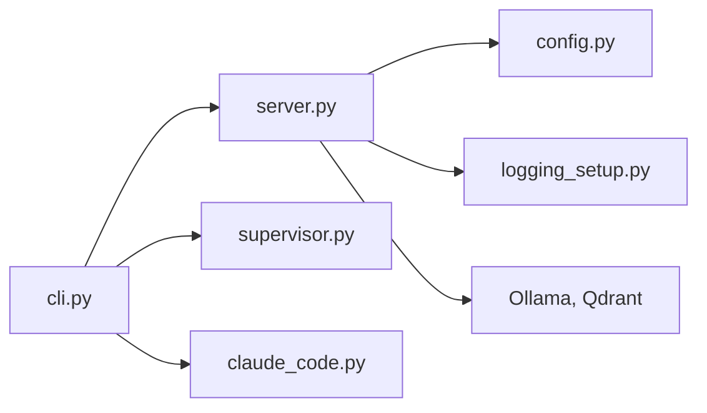
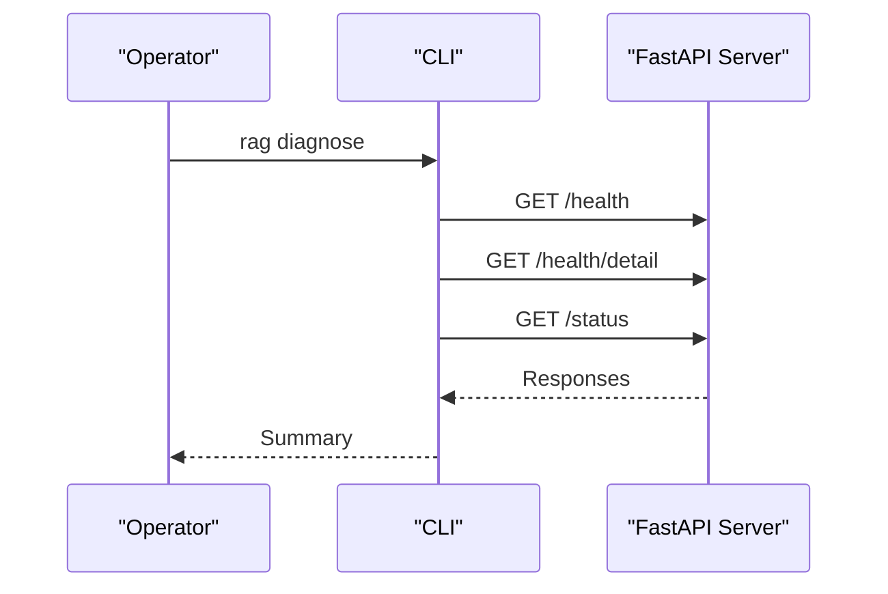

# Deployment and Operations

<cite>
**Referenced Files in This Document**
- [README.md](file://README.md)
- [compose.qdrant.yml](file://compose.qdrant.yml)
- [config/default.toml](file://config/default.toml)
- [src/rag/config.py](file://src/rag/config.py)
- [src/rag/server.py](file://src/rag/server.py)
- [src/rag/integration/supervisor.py](file://src/rag/integration/supervisor.py)
- [src/rag/integration/logging_setup.py](file://src/rag/integration/logging_setup.py)
- [src/rag/integration/claude_code.py](file://src/rag/integration/claude_code.py)
- [src/rag/cli.py](file://src/rag/cli.py)
- [docs/deployment-linux.md](file://docs/deployment-linux.md)
- [docs/ADR/001-full-stack-decision.md](file://docs/ADR/001-full-stack-decision.md)
- [scripts/install-codex-skills.sh](file://scripts/install-codex-skills.sh)
- [pyproject.toml](file://pyproject.toml)
</cite>

## Table of Contents
1. [Introduction](#introduction)
2. [Project Structure](#project-structure)
3. [Core Components](#core-components)
4. [Architecture Overview](#architecture-overview)
5. [Detailed Component Analysis](#detailed-component-analysis)
6. [Dependency Analysis](#dependency-analysis)
7. [Performance Considerations](#performance-considerations)
8. [Monitoring and Observability](#monitoring-and-observability)
9. [Scaling, Load Balancing, and High Availability](#scaling-load-balancing-and-high-availability)
10. [Backup and Recovery](#backup-and-recovery)
11. [Security Hardening and Network Configuration](#security-hardening-and-network-configuration)
12. [Deployment Strategies](#deployment-strategies)
13. [Common Operational Scenarios](#common-operational-scenarios)
14. [Troubleshooting Guide](#troubleshooting-guide)
15. [Conclusion](#conclusion)

## Introduction
This document provides production-focused deployment and operations guidance for the RAG system. It covers supervised daemon operation, auto-start mechanisms, logging and monitoring, health checks, scaling, high availability, backup and recovery, security hardening, and integration with external services such as Claude Code. It also includes practical procedures for Docker Compose, Kubernetes, and bare-metal deployments.

## Project Structure
The repository organizes operational concerns across configuration, server lifecycle, logging, supervisor integration, CLI orchestration, and documentation. Key areas:
- Configuration and defaults define server, embeddings, Qdrant, index, LLM, and LSP settings.
- The FastAPI server implements health, status, and operational endpoints.
- Supervisor integration manages macOS launchd service installation and status.
- Logging setup ensures rotated structured logs for long-running daemons.
- CLI commands orchestrate startup, TUI, Qdrant lifecycle, diagnostics, and external integrations.

```mermaid
graph TB
subgraph "Configuration"
CFG["config.py<br/>Settings models"]
DEF["config/default.toml<br/>Defaults"]
end
subgraph "Server"
SRV["server.py<br/>FastAPI app, routes, lifespan"]
LOG["integration/logging_setup.py<br/>Rotating JSON logs"]
end
subgraph "Supervision"
SUP["integration/supervisor.py<br/>launchd plist, install/uninstall/status"]
end
subgraph "CLI"
CLI["cli.py<br/>Commands: start, qdrant-up/down/status, diagnose, install-agent"]
end
subgraph "External Integrations"
CC["integration/claude_code.py<br/>Slash command & hook"]
SK["scripts/install-codex-skills.sh<br/>Install Codex skills"]
end
CFG --> SRV
DEF --> CFG
SRV --> LOG
CLI --> SRV
CLI --> SUP
CLI --> CC
CLI --> SK
```

**Diagram sources**
- [src/rag/config.py:150-194](file://src/rag/config.py#L150-L194)
- [config/default.toml:1-41](file://config/default.toml#L1-L41)
- [src/rag/server.py:603-716](file://src/rag/server.py#L603-L716)
- [src/rag/integration/logging_setup.py:38-108](file://src/rag/integration/logging_setup.py#L38-L108)
- [src/rag/integration/supervisor.py:75-153](file://src/rag/integration/supervisor.py#L75-L153)
- [src/rag/cli.py:162-244](file://src/rag/cli.py#L162-L244)
- [src/rag/integration/claude_code.py:49-120](file://src/rag/integration/claude_code.py#L49-L120)
- [scripts/install-codex-skills.sh:1-28](file://scripts/install-codex-skills.sh#L1-L28)

**Section sources**
- [README.md:1-74](file://README.md#L1-L74)
- [src/rag/config.py:150-194](file://src/rag/config.py#L150-L194)
- [config/default.toml:1-41](file://config/default.toml#L1-L41)
- [src/rag/server.py:603-716](file://src/rag/server.py#L603-L716)
- [src/rag/integration/logging_setup.py:38-108](file://src/rag/integration/logging_setup.py#L38-L108)
- [src/rag/integration/supervisor.py:75-153](file://src/rag/integration/supervisor.py#L75-L153)
- [src/rag/cli.py:162-244](file://src/rag/cli.py#L162-L244)
- [src/rag/integration/claude_code.py:49-120](file://src/rag/integration/claude_code.py#L49-L120)
- [scripts/install-codex-skills.sh:1-28](file://scripts/install-codex-skills.sh#L1-L28)

## Core Components
- Supervised daemon: The FastAPI server runs as a supervised process, ensuring resilience and restart on failure. It exposes health, status, and operational endpoints.
- Configuration: Centralized TOML-based settings with Pydantic validation and environment overrides.
- Logging: Structured, rotating JSON logs to prevent disk growth under long-running supervision.
- Supervisor integration: macOS launchd integration for auto-start and crash recovery; Linux systemd guidance provided.
- CLI orchestration: Commands to start the daemon, manage Qdrant, diagnose health, and integrate with external systems.

**Section sources**
- [README.md:7-74](file://README.md#L7-L74)
- [src/rag/server.py:603-716](file://src/rag/server.py#L603-L716)
- [src/rag/config.py:150-194](file://src/rag/config.py#L150-L194)
- [src/rag/integration/logging_setup.py:38-108](file://src/rag/integration/logging_setup.py#L38-L108)
- [src/rag/integration/supervisor.py:75-153](file://src/rag/integration/supervisor.py#L75-L153)
- [src/rag/cli.py:162-244](file://src/rag/cli.py#L162-L244)

## Architecture Overview
The system follows a supervised daemon model:
- The daemon is the single supervised process, hosted on localhost with a bearer token.
- CLI and TUI are thin clients that communicate over HTTP.
- Qdrant can run embedded or as a remote server; Docker Compose is provided for local server mode.
- External integrations include Claude Code slash commands and Codex skills.



**Diagram sources**
- [src/rag/server.py:603-716](file://src/rag/server.py#L603-L716)
- [src/rag/config.py:35-131](file://src/rag/config.py#L35-L131)
- [config/default.toml:1-41](file://config/default.toml#L1-L41)
- [src/rag/integration/claude_code.py:49-120](file://src/rag/integration/claude_code.py#L49-L120)

**Section sources**
- [README.md:67-74](file://README.md#L67-L74)
- [docs/ADR/001-full-stack-decision.md:80-96](file://docs/ADR/001-full-stack-decision.md#L80-L96)

## Detailed Component Analysis

### Supervised Daemon Lifecycle and Endpoints
- Lifespan initializes the embedder, vector store, restart counter, periodic warm probe, and optional file watcher.
- Health endpoint aggregates component readiness (Qdrant, Ollama).
- Status endpoint surfaces embedder model, collections, uptime, restart count, and file counts.
- Authentication requires a bearer token stored in the user’s home directory.



**Diagram sources**
- [src/rag/server.py:858-874](file://src/rag/server.py#L858-L874)
- [src/rag/server.py:878-902](file://src/rag/server.py#L878-L902)

**Section sources**
- [src/rag/server.py:603-716](file://src/rag/server.py#L603-L716)
- [src/rag/server.py:858-874](file://src/rag/server.py#L858-L874)
- [src/rag/server.py:878-902](file://src/rag/server.py#L878-L902)

### Configuration Model and Validation
- Settings include server host/port, embeddings, Qdrant mode/url/path, index parameters, LLM Ollama URL and models, and LSP toggles.
- The server enforces binding to localhost and rejects wildcard binds; reverse proxy recommended for external exposure.
- Token is persisted securely at ~/.rag/token with restricted permissions.



**Diagram sources**
- [src/rag/config.py:118-131](file://src/rag/config.py#L118-L131)
- [src/rag/config.py:35-116](file://src/rag/config.py#L35-L116)

**Section sources**
- [src/rag/config.py:35-131](file://src/rag/config.py#L35-L131)
- [config/default.toml:1-41](file://config/default.toml#L1-L41)

### Logging and Rotation
- Structured JSON logs are rotated with a 10 MB per file and 5 backups, capped at ~50 MB.
- Uvicorn logging is disabled to avoid conflicts with the rotating handler.
- Logs are written to ~/.rag/logs/daemon.jsonl.



**Diagram sources**
- [src/rag/integration/logging_setup.py:38-108](file://src/rag/integration/logging_setup.py#L38-L108)

**Section sources**
- [src/rag/integration/logging_setup.py:38-108](file://src/rag/integration/logging_setup.py#L38-L108)

### macOS launchd Supervisor
- Generates a launchd plist to run the daemon under KeepAlive supervision.
- Captures stdout/stderr to ~/.rag/logs/ and forwards environment variables.
- Provides install, uninstall, and status functions.



**Diagram sources**
- [src/rag/integration/supervisor.py:75-111](file://src/rag/integration/supervisor.py#L75-L111)

**Section sources**
- [src/rag/integration/supervisor.py:75-153](file://src/rag/integration/supervisor.py#L75-L153)

### Linux systemd Guidance
- User-level unit is recommended; survives logout with lingering enabled.
- Environment variables ensure Ollama and git are on PATH.
- Journal captures stdout/stderr; logs are rotated by the daemon.

**Section sources**
- [docs/deployment-linux.md:1-57](file://docs/deployment-linux.md#L1-L57)

### Qdrant Management via CLI
- Docker Compose is provided for local Qdrant server mode.
- CLI commands start/stop/status the Qdrant container and report health.

**Section sources**
- [compose.qdrant.yml:1-11](file://compose.qdrant.yml#L1-L11)
- [src/rag/cli.py:246-300](file://src/rag/cli.py#L246-L300)

### External Integrations
- Claude Code slash command generator and hook installer.
- Codex skills installer script to deploy project-owned skills.

**Section sources**
- [src/rag/integration/claude_code.py:49-120](file://src/rag/integration/claude_code.py#L49-L120)
- [scripts/install-codex-skills.sh:1-28](file://scripts/install-codex-skills.sh#L1-L28)
- [src/rag/cli.py:143-160](file://src/rag/cli.py#L143-L160)

## Dependency Analysis
Runtime dependencies include FastAPI, Uvicorn, Pydantic, Qdrant client, Ollama, structlog, and others. The CLI exposes commands that orchestrate the daemon and external services.



**Diagram sources**
- [src/rag/cli.py:162-244](file://src/rag/cli.py#L162-L244)
- [src/rag/server.py:603-716](file://src/rag/server.py#L603-L716)
- [src/rag/config.py:150-194](file://src/rag/config.py#L150-L194)
- [src/rag/integration/logging_setup.py:38-108](file://src/rag/integration/logging_setup.py#L38-L108)
- [src/rag/integration/supervisor.py:75-153](file://src/rag/integration/supervisor.py#L75-L153)
- [src/rag/integration/claude_code.py:49-120](file://src/rag/integration/claude_code.py#L49-L120)

**Section sources**
- [pyproject.toml:15-57](file://pyproject.toml#L15-L57)

## Performance Considerations
- Embedding throughput tuning: Use the CLI benchmark command to evaluate batch sizes against Ollama.
- Warm probe: The daemon periodically measures embedder warm latency to inform UI KPIs.
- Rate limiting: Per-token token-bucket rate limiting protects the daemon under load.
- Logging: Rotating JSON logs prevent disk pressure; disable uvicorn’s logging to avoid duplication.

**Section sources**
- [src/rag/cli.py:302-385](file://src/rag/cli.py#L302-L385)
- [src/rag/server.py:645-655](file://src/rag/server.py#L645-L655)
- [src/rag/server.py:772-788](file://src/rag/server.py#L772-L788)
- [src/rag/integration/logging_setup.py:38-108](file://src/rag/integration/logging_setup.py#L38-L108)

## Monitoring and Observability
- Health endpoint: Public, unauthenticated; aggregates Qdrant and Ollama status.
- Status endpoint: Protected by bearer token; returns embedder model, collections, uptime, restart count, and file counts.
- Events ring: Bounded ring buffer for TUI logs tail and latency metrics.
- CLI diagnose: Health checks for daemon, Ollama, LSP servers, and cache statistics.



**Diagram sources**
- [src/rag/cli.py:33-48](file://src/rag/cli.py#L33-L48)
- [src/rag/server.py:858-874](file://src/rag/server.py#L858-L874)
- [src/rag/server.py:1086-1117](file://src/rag/server.py#L1086-L1117)
- [src/rag/server.py:878-902](file://src/rag/server.py#L878-L902)

**Section sources**
- [src/rag/server.py:858-874](file://src/rag/server.py#L858-L874)
- [src/rag/server.py:878-902](file://src/rag/server.py#L878-L902)
- [src/rag/server.py:1086-1117](file://src/rag/server.py#L1086-L1117)
- [src/rag/cli.py:33-48](file://src/rag/cli.py#L33-L48)

## Scaling, Load Balancing, and High Availability
- Current design: Single supervised daemon bound to localhost with a bearer token.
- Reverse proxy: Expose externally behind TLS and forward the bearer token; the server rejects wildcard binds.
- Horizontal scaling: Not implemented in the current codebase; consider deploying multiple instances behind a load balancer and coordinating shared storage for Qdrant if needed.
- Redundancy: Use supervisor (launchd/systemd) to ensure automatic restarts; maintain persistent restart counters.

**Section sources**
- [src/rag/config.py:39-50](file://src/rag/config.py#L39-L50)
- [docs/deployment-linux.md:51-57](file://docs/deployment-linux.md#L51-L57)
- [README.md:67-74](file://README.md#L67-L74)

## Backup and Recovery
- Token: Stored at ~/.rag/token with restricted permissions; back up on encrypted media.
- Qdrant data: Local path configurable; back up the directory when the daemon is offline.
- Collections: Use CLI import/export endpoints to back up and restore data as needed.

**Section sources**
- [src/rag/config.py:167-189](file://src/rag/config.py#L167-L189)
- [config/default.toml:21-26](file://config/default.toml#L21-L26)
- [src/rag/cli.py:60-66](file://src/rag/cli.py#L60-L66)

## Security Hardening and Network Configuration
- Binding policy: Rejects wildcard binds; use a reverse proxy for external access.
- Authentication: Bearer token enforcement on protected routes; CLI and TUI share the token.
- CSRF guard: Middleware validates Origin for non-idempotent methods.
- Secrets: Token file permissions are restricted; ensure secure storage and backups.

**Section sources**
- [src/rag/config.py:39-50](file://src/rag/config.py#L39-L50)
- [src/rag/server.py:592-598](file://src/rag/server.py#L592-L598)
- [src/rag/server.py:790-800](file://src/rag/server.py#L790-L800)
- [src/rag/config.py:167-189](file://src/rag/config.py#L167-L189)

## Deployment Strategies

### Docker Compose (Local Qdrant Server)
- Use the provided Compose file to run Qdrant locally with persistence.
- The daemon connects to the server URL defined in configuration.

**Section sources**
- [compose.qdrant.yml:1-11](file://compose.qdrant.yml#L1-L11)
- [config/default.toml:21-26](file://config/default.toml#L21-L26)

### Kubernetes (Conceptual)
- Deploy the daemon as a Stateful workload with a sidecar or separate pod for Qdrant server.
- Expose via a Service and Ingress with TLS termination and bearer token forwarding.
- Persist Qdrant data using PersistentVolumes; ensure restart policy aligns with KeepAlive semantics.

[No sources needed since this section provides conceptual guidance]

### Bare Metal (macOS and Linux)
- macOS: Use launchd supervisor to auto-start and restart the daemon.
- Linux: Use user-level systemd unit; enable lingering for logout resilience.

**Section sources**
- [src/rag/integration/supervisor.py:75-153](file://src/rag/integration/supervisor.py#L75-L153)
- [docs/deployment-linux.md:1-57](file://docs/deployment-linux.md#L1-L57)

## Common Operational Scenarios

### Start the Daemon and Index a Repository
- Initialize configuration, start the daemon in background, and index the current directory.
- Verify health and status via CLI.

**Section sources**
- [src/rag/cli.py:82-141](file://src/rag/cli.py#L82-L141)
- [src/rag/cli.py:33-48](file://src/rag/cli.py#L33-L48)

### Install and Integrate with Claude Code
- Generate a slash command and install a hook to enable RAG search integration.

**Section sources**
- [src/rag/integration/claude_code.py:49-120](file://src/rag/integration/claude_code.py#L49-L120)
- [src/rag/cli.py:60-66](file://src/rag/cli.py#L60-L66)

### Manage Qdrant Lifecycle
- Start/stop the local Qdrant server via CLI and check health.

**Section sources**
- [src/rag/cli.py:246-300](file://src/rag/cli.py#L246-L300)
- [compose.qdrant.yml:1-11](file://compose.qdrant.yml#L1-L11)

### Repair Index Integrity
- Detect and remove orphaned chunks to maintain index integrity.

**Section sources**
- [src/rag/cli.py:2098-2141](file://src/rag/cli.py#L2098-L2141)

## Troubleshooting Guide
- Use the diagnose command to check daemon, Ollama, LSP servers, and cache stats.
- For index issues, run verification and repair to remove orphans and duplicates.
- Monitor logs in ~/.rag/logs/daemon.jsonl and systemd journal for errors.

**Section sources**
- [README.md:71-74](file://README.md#L71-L74)
- [src/rag/cli.py:33-48](file://src/rag/cli.py#L33-L48)
- [src/rag/cli.py:2098-2141](file://src/rag/cli.py#L2098-L2141)
- [src/rag/integration/logging_setup.py:38-108](file://src/rag/integration/logging_setup.py#L38-L108)
- [docs/deployment-linux.md:34-41](file://docs/deployment-linux.md#L34-L41)

## Conclusion
The RAG system is designed as a supervised daemon with robust logging, health monitoring, and external integrations. Production deployments should leverage supervisor mechanisms (launchd/systemd), secure bearer token authentication, and reverse proxies for external access. Use the CLI for lifecycle management, diagnostics, and integrations, and maintain regular backups of tokens and Qdrant data.