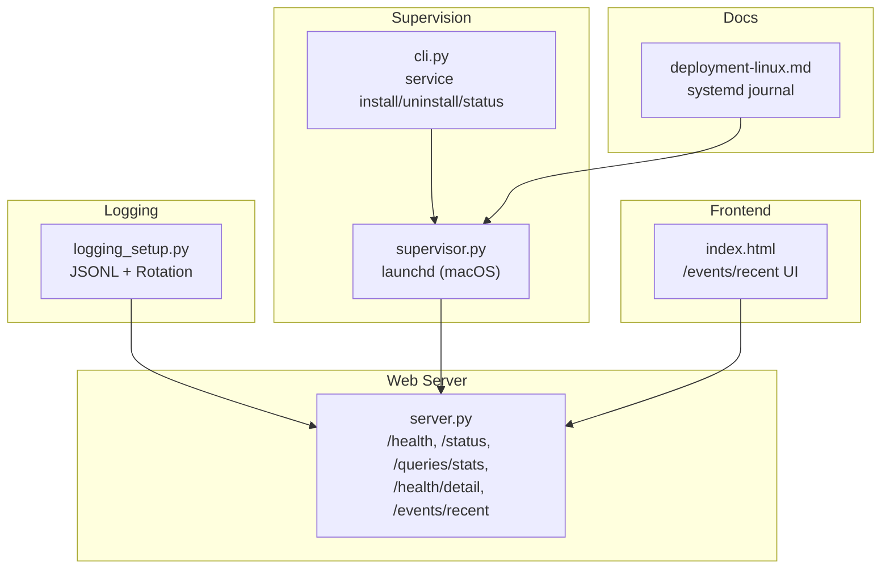
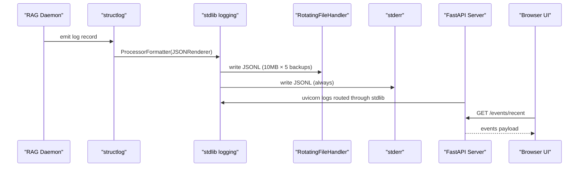
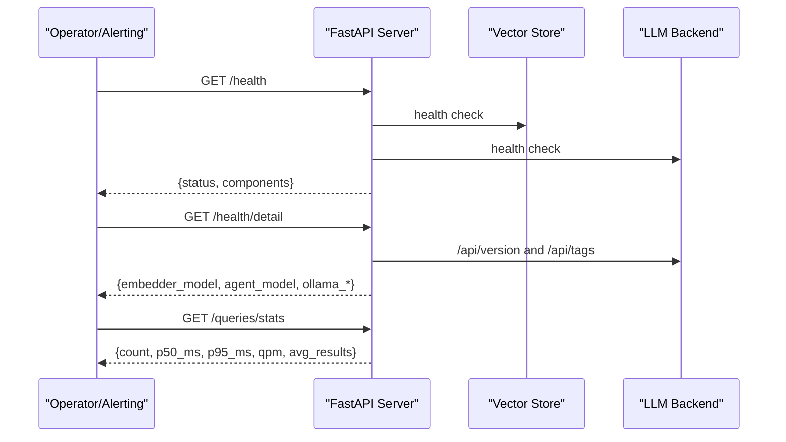
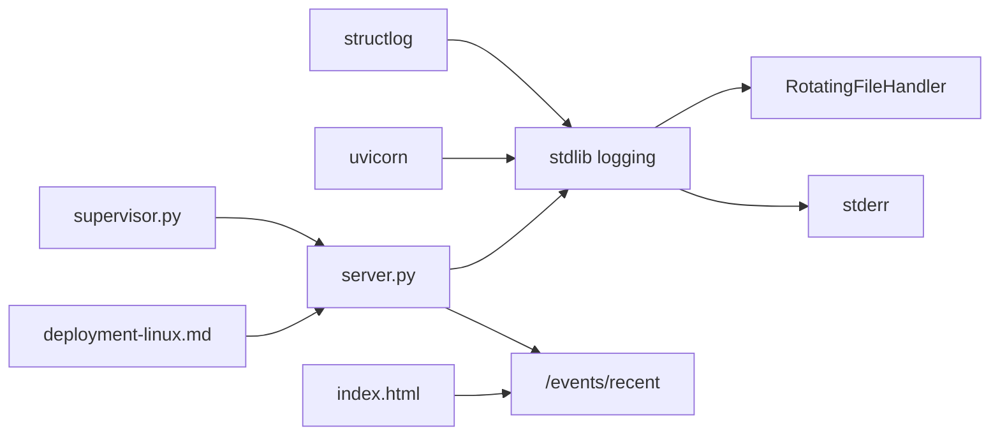

# Monitoring and Logging

<cite>
**Referenced Files in This Document**
- [logging_setup.py](file://src/rag/integration/logging_setup.py)
- [server.py](file://src/rag/server.py)
- [supervisor.py](file://src/rag/integration/supervisor.py)
- [deployment-linux.md](file://docs/deployment-linux.md)
- [cli.py](file://src/rag/cli.py)
- [index.html](file://src/rag/web/index.html)
- [app.py](file://src/rag/app.py)
</cite>

## Table of Contents
1. [Introduction](#introduction)
2. [Project Structure](#project-structure)
3. [Core Components](#core-components)
4. [Architecture Overview](#architecture-overview)
5. [Detailed Component Analysis](#detailed-component-analysis)
6. [Dependency Analysis](#dependency-analysis)
7. [Performance Considerations](#performance-considerations)
8. [Troubleshooting Guide](#troubleshooting-guide)
9. [Conclusion](#conclusion)
10. [Appendices](#appendices)

## Introduction
This document explains the monitoring and logging architecture for observability and operational visibility. It covers structured JSONL logging with automatic rotation, systemd journal integration, log location management, health checks and status endpoints, performance metrics collection, error monitoring, and practical log analysis and debugging workflows. Guidance is grounded in the repository’s actual implementation.

## Project Structure
The monitoring and logging system spans:
- Centralized logging configuration with rotation and JSON renderer
- Web server exposing health, status, and metrics endpoints
- OS-level supervisor integration for macOS launchd and Linux systemd
- Frontend event feed for real-time operational visibility
- CLI commands for service lifecycle and status

**Diagram sources**
- [logging_setup.py:38-107](file://src/rag/integration/logging_setup.py#L38-L107)
- [server.py:876-1117](file://src/rag/server.py#L876-L1117)
- [supervisor.py:1-43](file://src/rag/integration/supervisor.py#L1-L43)
- [cli.py:2234-2273](file://src/rag/cli.py#L2234-L2273)
- [index.html:651-718](file://src/rag/web/index.html#L651-L718)
- [deployment-linux.md:1-57](file://docs/deployment-linux.md#L1-L57)

**Section sources**
- [logging_setup.py:1-107](file://src/rag/integration/logging_setup.py#L1-L107)
- [server.py:876-1117](file://src/rag/server.py#L876-L1117)
- [supervisor.py:1-43](file://src/rag/integration/supervisor.py#L1-L43)
- [deployment-linux.md:1-57](file://docs/deployment-linux.md#L1-L57)
- [cli.py:2234-2273](file://src/rag/cli.py#L2234-L2273)
- [index.html:651-718](file://src/rag/web/index.html#L651-L718)

## Core Components
- Structured logging with JSONL output and size-based rotation
- Health and status endpoints for service monitoring
- Event stream endpoint for real-time operational visibility
- OS-level supervisor integration for launchd (macOS) and systemd (Linux)
- Frontend UI for event polling and visualization

Key implementation references:
- Logging configuration and rotation: [configure_logging:38-107](file://src/rag/integration/logging_setup.py#L38-L107)
- Health and status endpoints: [/health:858-874](file://src/rag/server.py#L858-L874), [/status:878-967](file://src/rag/server.py#L878-L967), [/health/detail:1086-1117](file://src/rag/server.py#L1086-L1117)
- Metrics endpoint: [/queries/stats:969-1008](file://src/rag/server.py#L969-L1008)
- Events endpoint: [/events/recent:1077-1082](file://src/rag/server.py#L1077-L1082)
- Supervisor integration: [supervisor.py:1-43](file://src/rag/integration/supervisor.py#L1-L43)
- Frontend event rendering: [index.html:651-718](file://src/rag/web/index.html#L651-L718)

**Section sources**
- [logging_setup.py:38-107](file://src/rag/integration/logging_setup.py#L38-L107)
- [server.py:858-1117](file://src/rag/server.py#L858-L1117)
- [supervisor.py:1-43](file://src/rag/integration/supervisor.py#L1-L43)
- [index.html:651-718](file://src/rag/web/index.html#L651-L718)

## Architecture Overview
The system routes structured logs through structlog into Python’s stdlib logging, then to a rotating file handler and stderr. The web server exposes health, status, and metrics endpoints. The frontend polls the events endpoint to visualize recent activity. On macOS, a launchd agent supervises the daemon; on Linux, systemd is recommended with journal capture.

**Diagram sources**
- [logging_setup.py:38-107](file://src/rag/integration/logging_setup.py#L38-L107)
- [server.py:101-105](file://src/rag/server.py#L101-L105)
- [index.html:669-676](file://src/rag/web/index.html#L669-L676)

**Section sources**
- [logging_setup.py:38-107](file://src/rag/integration/logging_setup.py#L38-L107)
- [server.py:101-105](file://src/rag/server.py#L101-L105)
- [index.html:669-676](file://src/rag/web/index.html#L669-L676)

## Detailed Component Analysis

### Structured Logging with JSONL and Rotation
- Uses structlog with a JSON renderer and stdlib logging processors.
- Routes uvicorn logs through stdlib to share handlers and rotation.
- Creates a rotating file handler with 10 MB per file and 5 backups (~50 MB total).
- Writes to ~/.rag/logs/daemon.jsonl by default; also streams to stderr.
- Idempotent configuration that removes previous handlers before adding new ones.

Operational implications:
- Disk usage bounded by rotation policy.
- Crash traces captured via stderr redirection by supervisors.
- Logs are machine-readable JSONL for easy ingestion and parsing.

**Section sources**
- [logging_setup.py:25-27](file://src/rag/integration/logging_setup.py#L25-L27)
- [logging_setup.py:38-107](file://src/rag/integration/logging_setup.py#L38-L107)

### Health Checks and Service Status
- /health: aggregates component health (Qdrant, Ollama), returns overall status.
- /status: authenticated view of vector store collections, plugin discovery, and other runtime details.
- /health/detail: drill-down details (Ollama version/tags, recent embedding latency percentiles).
- /queries/stats: rolling latency quantiles (p50/p95), queries-per-minute, average results.

These endpoints support:
- Availability monitoring (public /health).
- Operational diagnostics (/status and /health/detail).
- Performance trend analysis (/queries/stats).

**Diagram sources**
- [server.py:858-874](file://src/rag/server.py#L858-L874)
- [server.py:1086-1117](file://src/rag/server.py#L1086-L1117)
- [server.py:969-1008](file://src/rag/server.py#L969-L1008)

**Section sources**
- [server.py:858-874](file://src/rag/server.py#L858-L874)
- [server.py:878-967](file://src/rag/server.py#L878-L967)
- [server.py:1086-1117](file://src/rag/server.py#L1086-L1117)
- [server.py:969-1008](file://src/rag/server.py#L969-L1008)

### Event Stream and Frontend Visibility
- /events/recent: returns recent operational events for UI and dashboards.
- Frontend polls and renders events with severity-derived coloring and a temporal heat map.

Practical uses:
- Real-time dashboards for operational visibility.
- Debugging by correlating UI events with backend logs.

**Section sources**
- [server.py:1077-1082](file://src/rag/server.py#L1077-L1082)
- [index.html:651-718](file://src/rag/web/index.html#L651-L718)

### OS-Level Supervision and Log Location Management
- macOS: launchd agent installs a plist that supervises the daemon; logs go to ~/.rag/logs/daemon.jsonl.
- Linux: systemd unit file recommended; stdout/stderr captured by journal; no separate logrotate needed for the daemon’s JSONL files.

Log locations:
- macOS: ~/.rag/logs/daemon.jsonl (rotated)
- Linux: systemd journal (journalctl) for stdout/stderr; daemon JSONL files remain at ~/.rag/logs/daemon.jsonl

**Section sources**
- [supervisor.py:40-43](file://src/rag/integration/supervisor.py#L40-L43)
- [deployment-linux.md:1-57](file://docs/deployment-linux.md#L1-L57)

### CLI Service Lifecycle Commands
- service install/uninstall/status: manage launchd agent on macOS; prints paths and status.

**Section sources**
- [cli.py:2234-2273](file://src/rag/cli.py#L2234-L2273)

## Dependency Analysis
Logging depends on structlog and stdlib logging; the web server integrates with stdlib logging for uvicorn logs. Supervision integrates with OS-specific service managers. The frontend depends on the events endpoint.

**Diagram sources**
- [logging_setup.py:60-105](file://src/rag/integration/logging_setup.py#L60-L105)
- [server.py:101-105](file://src/rag/server.py#L101-L105)
- [index.html:669-676](file://src/rag/web/index.html#L669-L676)
- [supervisor.py:1-43](file://src/rag/integration/supervisor.py#L1-L43)
- [deployment-linux.md:1-57](file://docs/deployment-linux.md#L1-L57)

**Section sources**
- [logging_setup.py:60-105](file://src/rag/integration/logging_setup.py#L60-L105)
- [server.py:101-105](file://src/rag/server.py#L101-L105)
- [index.html:669-676](file://src/rag/web/index.html#L669-L676)
- [supervisor.py:1-43](file://src/rag/integration/supervisor.py#L1-L43)
- [deployment-linux.md:1-57](file://docs/deployment-linux.md#L1-L57)

## Performance Considerations
- Latency percentiles: p50/p95 computed from recent query latencies for quick performance diagnostics.
- Throughput: qpm calculated from recent query timestamps for capacity planning.
- Memory: RSS-based memory indicator in the TUI for lightweight resource tracking.

Recommendations:
- Monitor /queries/stats trends to detect regressions.
- Correlate p95_ms spikes with /health/detail and /events/recent.
- Use systemd journal for high-volume stdout/stderr capture on Linux.

**Section sources**
- [server.py:969-1008](file://src/rag/server.py#L969-L1008)
- [app.py:663-684](file://src/rag/app.py#L663-L684)

## Troubleshooting Guide
Common scenarios and workflows:

- Service not starting on macOS
  - Verify launchd agent installation and load status via CLI service status.
  - Check ~/.rag/logs/daemon.jsonl for startup errors; stderr traces captured by launchd.

- Service not starting on Linux
  - Confirm systemd unit is enabled and running; follow journalctl logs.
  - Ensure PATH and environment variables are set in the unit file.

- High latency or degraded performance
  - Query /queries/stats for p50/p95 and qpm.
  - Inspect /health/detail for Ollama availability and model status.
  - Review /events/recent for error/warn events around the same timeframe.

- Crashes and stack traces
  - On macOS, review stderr logs captured by launchd.
  - On Linux, inspect systemd journal for crash traces.

- Log location verification
  - macOS: ~/.rag/logs/daemon.jsonl (rotated).
  - Linux: systemd journal for stdout/stderr; daemon JSONL files at ~/.rag/logs/daemon.jsonl.

Practical log parsing tips:
- Filter by level: use the “level” field emitted by the JSONL logs.
- Correlate timestamps: align log entries with /events/recent timestamps.
- Alert on severity: set thresholds for error/warn counts over time windows.

**Section sources**
- [cli.py:2257-2271](file://src/rag/cli.py#L2257-L2271)
- [deployment-linux.md:34-41](file://docs/deployment-linux.md#L34-L41)
- [logging_setup.py:38-107](file://src/rag/integration/logging_setup.py#L38-L107)
- [server.py:858-874](file://src/rag/server.py#L858-L874)
- [server.py:1086-1117](file://src/rag/server.py#L1086-L1117)
- [server.py:969-1008](file://src/rag/server.py#L969-L1008)
- [server.py:1077-1082](file://src/rag/server.py#L1077-L1082)

## Conclusion
The system provides robust observability through structured JSONL logs with automatic rotation, centralized health and status endpoints, event streaming for real-time visibility, and OS-level supervision with clear log location management. Operators can monitor availability, performance, and errors, and troubleshoot efficiently by correlating logs, events, and metrics.

## Appendices

### Endpoint Reference
- /health: public health summary
- /health/detail: authenticated drill-down
- /status: authenticated runtime status
- /queries/stats: performance metrics (p50/p95, qpm, avg results)
- /events/recent: recent operational events for UI

**Section sources**
- [server.py:858-874](file://src/rag/server.py#L858-L874)
- [server.py:1086-1117](file://src/rag/server.py#L1086-L1117)
- [server.py:878-967](file://src/rag/server.py#L878-L967)
- [server.py:969-1008](file://src/rag/server.py#L969-L1008)
- [server.py:1077-1082](file://src/rag/server.py#L1077-L1082)