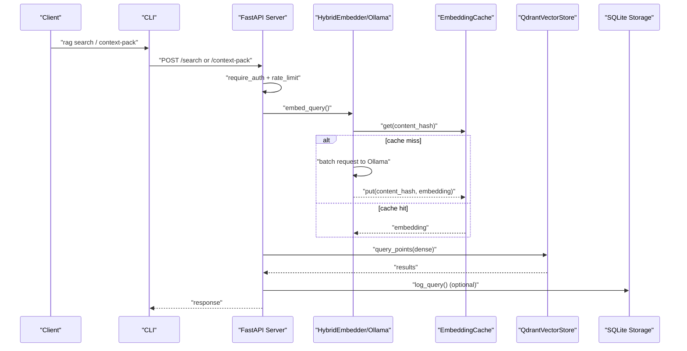
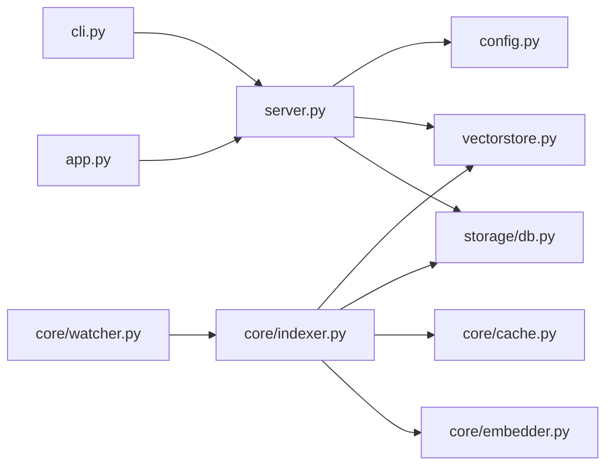

# Scaling and Maintenance

<cite>
**Referenced Files in This Document**
- [src/rag/server.py](file://src/rag/server.py)
- [src/rag/config.py](file://src/rag/config.py)
- [config/default.toml](file://config/default.toml)
- [src/rag/storage/db.py](file://src/rag/storage/db.py)
- [src/rag/core/vectorstore.py](file://src/rag/core/vectorstore.py)
- [src/rag/core/indexer.py](file://src/rag/core/indexer.py)
- [src/rag/core/cache.py](file://src/rag/core/cache.py)
- [src/rag/core/embedder.py](file://src/rag/core/embedder.py)
- [src/rag/core/watcher.py](file://src/rag/core/watcher.py)
- [src/rag/cli.py](file://src/rag/cli.py)
- [compose.qdrant.yml](file://compose.qdrant.yml)
- [src/rag/app.py](file://src/rag/app.py)
</cite>

## Table of Contents
1. [Introduction](#introduction)
2. [Project Structure](#project-structure)
3. [Core Components](#core-components)
4. [Architecture Overview](#architecture-overview)
5. [Detailed Component Analysis](#detailed-component-analysis)
6. [Dependency Analysis](#dependency-analysis)
7. [Performance Considerations](#performance-considerations)
8. [Troubleshooting Guide](#troubleshooting-guide)
9. [Conclusion](#conclusion)
10. [Appendices](#appendices)

## Introduction
This document focuses on scaling and maintenance for the RAG daemon, covering horizontal and vertical strategies, memory and CPU optimization, concurrent request handling, database maintenance, backups and recovery, capacity planning, high availability, and disaster recovery. It synthesizes the system’s runtime architecture, configuration, storage, and operational controls to guide safe growth and reliable operation.

## Project Structure
The RAG daemon is a FastAPI service with integrated indexing, vector search, and observability. Key areas:
- Configuration and settings management
- HTTP server with routes, rate limiting, and health checks
- Vector store integration (Qdrant)
- Indexing pipeline with incremental change detection and LSP enrichment
- Embedding subsystem with caching and retry/backoff
- SQLite-backed storage for logs, rate buckets, and code index mirroring
- CLI for lifecycle and diagnostics
- Optional file watcher for auto re-indexing
- TUI and web dashboards for monitoring

```mermaid
graph TB
subgraph "Runtime"
S["FastAPI Server<br/>routes, auth, rate-limit"]
V["QdrantVectorStore<br/>dense search"]
E["HybridEmbedder/OllamaEmbedder<br/>embedding"]
C["EmbeddingCache<br/>SQLite binary cache"]
D["SQLite Storage<br/>query_log, index_runs,<br/>rate_buckets, code_index"]
I["Indexer<br/>incremental git-based indexing"]
W["FileWatcher<br/>polling changes"]
end
subgraph "CLI"
CLI["CLI Commands<br/>start, qdrant-up/down, search, benchmark"]
end
subgraph "Clients"
TUI["TUI Dashboard"]
WEB["Web Dashboard"]
end
CLI --> S
TUI --> S
WEB --> S
S --> V
S --> D
I --> V
I --> D
I --> C
E --> C
W --> I
```

**Diagram sources**
- [src/rag/server.py:721-790](file://src/rag/server.py#L721-L790)
- [src/rag/core/vectorstore.py:199-530](file://src/rag/core/vectorstore.py#L199-L530)
- [src/rag/core/embedder.py:189-245](file://src/rag/core/embedder.py#L189-L245)
- [src/rag/core/cache.py:101-195](file://src/rag/core/cache.py#L101-L195)
- [src/rag/storage/db.py:40-82](file://src/rag/storage/db.py#L40-L82)
- [src/rag/core/indexer.py:242-550](file://src/rag/core/indexer.py#L242-L550)
- [src/rag/core/watcher.py:18-184](file://src/rag/core/watcher.py#L18-L184)
- [src/rag/cli.py:162-244](file://src/rag/cli.py#L162-L244)

**Section sources**
- [src/rag/server.py:721-790](file://src/rag/server.py#L721-L790)
- [src/rag/config.py:150-194](file://src/rag/config.py#L150-L194)
- [src/rag/storage/db.py:40-82](file://src/rag/storage/db.py#L40-L82)
- [src/rag/core/vectorstore.py:199-530](file://src/rag/core/vectorstore.py#L199-L530)
- [src/rag/core/indexer.py:242-550](file://src/rag/core/indexer.py#L242-L550)
- [src/rag/core/cache.py:101-195](file://src/rag/core/cache.py#L101-L195)
- [src/rag/core/embedder.py:189-245](file://src/rag/core/embedder.py#L189-L245)
- [src/rag/core/watcher.py:18-184](file://src/rag/core/watcher.py#L18-L184)
- [src/rag/cli.py:162-244](file://src/rag/cli.py#L162-L244)

## Core Components
- Server and routing: FastAPI app with request/response models, authentication, rate limiting, and health endpoints.
- Configuration: TOML-based settings with Pydantic validation and runtime merging of defaults and user overrides.
- Vector store: Qdrant-backed dense vector search with payload indexes and collection management.
- Indexer: Git-based incremental indexing with hashing, change detection, batched upserts, and post-index maintenance.
- Embedder: Ollama-backed dense embeddings with instruction prompts, batching, and retry/backoff.
- Cache: SQLite-backed binary cache for embeddings with TTL and statistics.
- Storage: SQLite for query logs, index runs, rate buckets, and a mirrored FTS index for exact/lexical code search.
- Watcher: Polling-based file watcher for auto re-indexing.
- CLI: Daemon lifecycle, diagnostics, benchmarking, and dashboard access.
- Dashboards: TUI and web dashboards for status, queries, events, and overview.

**Section sources**
- [src/rag/server.py:30-410](file://src/rag/server.py#L30-L410)
- [src/rag/config.py:150-194](file://src/rag/config.py#L150-L194)
- [config/default.toml:1-41](file://config/default.toml#L1-L41)
- [src/rag/core/vectorstore.py:199-530](file://src/rag/core/vectorstore.py#L199-L530)
- [src/rag/core/indexer.py:242-550](file://src/rag/core/indexer.py#L242-L550)
- [src/rag/core/embedder.py:189-245](file://src/rag/core/embedder.py#L189-L245)
- [src/rag/core/cache.py:101-195](file://src/rag/core/cache.py#L101-L195)
- [src/rag/storage/db.py:40-82](file://src/rag/storage/db.py#L40-L82)
- [src/rag/core/watcher.py:18-184](file://src/rag/core/watcher.py#L18-L184)
- [src/rag/cli.py:162-244](file://src/rag/cli.py#L162-L244)
- [src/rag/app.py:156-800](file://src/rag/app.py#L156-L800)

## Architecture Overview
The daemon orchestrates embedding, indexing, and retrieval:
- Clients send requests to the FastAPI server.
- Authentication and rate limiting are enforced.
- Queries trigger hybrid retrieval: exact/lexical via SQLite and dense semantic via Qdrant.
- Indexing uses incremental change detection and batches for throughput.
- Embeddings leverage a cache and are produced by Ollama with retry/backoff.
- Operational telemetry is persisted for monitoring and diagnostics.



**Diagram sources**
- [src/rag/server.py:770-790](file://src/rag/server.py#L770-L790)
- [src/rag/core/embedder.py:189-245](file://src/rag/core/embedder.py#L189-L245)
- [src/rag/core/cache.py:112-163](file://src/rag/core/cache.py#L112-L163)
- [src/rag/core/vectorstore.py:424-466](file://src/rag/core/vectorstore.py#L424-L466)
- [src/rag/storage/db.py:528-538](file://src/rag/storage/db.py#L528-L538)
- [src/rag/cli.py:426-477](file://src/rag/cli.py#L426-L477)

## Detailed Component Analysis

### Horizontal and Vertical Scaling Strategies
- Vertical scaling
  - Increase embedding batch size to improve throughput during indexing and search.
  - Tune Ollama keep-alive and model availability to reduce cold-start latency.
  - Adjust retrieval top_k to balance latency and recall.
- Horizontal scaling
  - Run multiple daemon instances behind a reverse proxy with sticky sessions or stateless routing.
  - Separate Qdrant into a dedicated service or container for independent scaling.
  - Use rate limiting and tokenization to distribute load across clients.

Operational levers:
- Server concurrency and timeouts are controlled by the Uvicorn runner and FastAPI request validation.
- Embedding batching and retry/backoff are configured in the embedder.

**Section sources**
- [src/rag/server.py:721-790](file://src/rag/server.py#L721-L790)
- [src/rag/core/embedder.py:65-100](file://src/rag/core/embedder.py#L65-L100)
- [src/rag/config.py:84-90](file://src/rag/config.py#L84-L90)

### Memory Management and CPU Optimization
- Embedding cache reduces repeated computation and memory churn.
- Indexing batches and thread pool offloading minimize CPU contention.
- SQLite WAL mode and busy timeouts improve concurrency and reduce stalls.
- Qdrant embedded mode stores vectors locally; server mode scales independently.

Practical tips:
- Monitor restart count and uptime to detect memory pressure.
- Use the TUI “Health Detail” memory indicator to track RSS.
- Reduce batch sizes if CPU saturation occurs during embedding.

**Section sources**
- [src/rag/core/cache.py:101-195](file://src/rag/core/cache.py#L101-L195)
- [src/rag/core/indexer.py:379-422](file://src/rag/core/indexer.py#L379-L422)
- [src/rag/storage/db.py:23-31](file://src/rag/storage/db.py#L23-L31)
- [src/rag/server.py:643-655](file://src/rag/server.py#L643-L655)
- [src/rag/app.py:663-684](file://src/rag/app.py#L663-L684)

### Concurrent Request Handling
- Rate limiting per token via SQLite bucket ensures fair sharing.
- CSRF guard middleware protects against cross-origin misuse.
- Global exception handlers return sanitized errors to clients.

Operational guidance:
- Monitor rate limit responses and adjust token distribution.
- Use the TUI to observe QPM and recent events for load trends.

**Section sources**
- [src/rag/server.py:770-790](file://src/rag/server.py#L770-L790)
- [src/rag/storage/db.py:709-767](file://src/rag/storage/db.py#L709-L767)
- [src/rag/app.py:458-526](file://src/rag/app.py#L458-L526)

### Database Maintenance Procedures
- SQLite initialization creates tables and indexes for logs, runs, overview stats, and rate buckets.
- Code index mirroring supports exact/lexical retrieval with FTS virtual table and supporting indexes.
- Overview counters are materialized and can be rebuilt incrementally or fully.

Maintenance tasks:
- Vacuum/analyze periodically if storage becomes fragmented (SQLite best practice).
- Reset overview counters before full re-index to avoid double-counting.
- Ensure WAL mode remains enabled for concurrent reads/writes.

**Section sources**
- [src/rag/storage/db.py:40-82](file://src/rag/storage/db.py#L40-L82)
- [src/rag/storage/db.py:136-144](file://src/rag/storage/db.py#L136-L144)
- [src/rag/storage/db.py:602-633](file://src/rag/storage/db.py#L602-L633)
- [src/rag/core/indexer.py:288-303](file://src/rag/core/indexer.py#L288-L303)

### Index Optimization and Storage Management
- Payload indexes in Qdrant accelerate filtering; created on-demand per collection.
- Collection dimension validation prevents silent corruption when embedding models change.
- Indexer tracks file hashes and uses advisory locks to prevent concurrent runs.
- Auto re-index via file watcher coalesces changes and dispatches callbacks safely.

Storage hygiene:
- Drop collections and reset code index before full re-index.
- Delete removed files’ vectors and code index entries after indexing.

**Section sources**
- [src/rag/core/vectorstore.py:230-295](file://src/rag/core/vectorstore.py#L230-L295)
- [src/rag/core/vectorstore.py:266-279](file://src/rag/core/vectorstore.py#L266-L279)
- [src/rag/core/indexer.py:262-266](file://src/rag/core/indexer.py#L262-L266)
- [src/rag/core/indexer.py:379-422](file://src/rag/core/indexer.py#L379-L422)
- [src/rag/core/watcher.py:18-184](file://src/rag/core/watcher.py#L18-L184)

### Backup and Recovery
- Configuration files: ~/.rag/config.toml and ~/.rag/token are the primary sources of truth.
- Indexed data: Qdrant storage (server or embedded) and SQLite database (~/.rag/rag.db and ~/.rag/embed_cache.db).
- Recovery procedure outline:
  - Stop the daemon.
  - Back up ~/.rag directory (config, token, SQLite, embed cache, Qdrant storage).
  - Restore to a clean environment and re-run daemon.
  - Trigger a full re-index if necessary to rebuild Qdrant collections and overview stats.

Note: The repository includes a Docker Compose example for Qdrant server mode; ensure persistence is configured appropriately.

**Section sources**
- [src/rag/config.py:23-28](file://src/rag/config.py#L23-L28)
- [src/rag/config.py:167-189](file://src/rag/config.py#L167-L189)
- [src/rag/storage/db.py:18-20](file://src/rag/storage/db.py#L18-L20)
- [src/rag/core/cache.py:24-25](file://src/rag/core/cache.py#L24-L25)
- [src/rag/core/vectorstore.py:220-228](file://src/rag/core/vectorstore.py#L220-L228)
- [compose.qdrant.yml:1-11](file://compose.qdrant.yml#L1-L11)

### Maintenance Schedules and Update Procedures
- Daily:
  - Review recent queries and events dashboards.
  - Check restart count and uptime for stability.
- Weekly:
  - Rebuild overview counters if discrepancies appear.
  - Verify Qdrant health and collection stats.
- Monthly:
  - Rotate and archive logs.
  - Validate embedding cache hit ratio and tune TTL if needed.
- Updates:
  - Update embedding model via Ollama and restart daemon.
  - If changing embedding model, perform a full re-index to rebuild collections.

Rollback strategy:
- Pin to previous daemon version.
- Restore ~/.rag backup.
- If Qdrant server mode is used, restore persisted storage volume.

**Section sources**
- [src/rag/app.py:363-457](file://src/rag/app.py#L363-L457)
- [src/rag/server.py:626-642](file://src/rag/server.py#L626-L642)
- [src/rag/storage/db.py:635-664](file://src/rag/storage/db.py#L635-L664)
- [src/rag/core/embedder.py:166-187](file://src/rag/core/embedder.py#L166-L187)

### Capacity Planning and Resource Allocation
- CPU: Embedding batch size and thread pool sizing impact throughput. Use the benchmark command to tune.
- Memory: Monitor daemon RSS via TUI and restart count spikes; adjust batch sizes and keep-alive accordingly.
- Storage: Track Qdrant collection size and SQLite database growth; plan retention and pruning policies.
- Network: Ensure Ollama availability and appropriate timeouts; monitor rate limits.

**Section sources**
- [src/rag/cli.py:302-386](file://src/rag/cli.py#L302-L386)
- [src/rag/core/embedder.py:24-33](file://src/rag/core/embedder.py#L24-L33)
- [src/rag/app.py:663-684](file://src/rag/app.py#L663-L684)

### High Availability and Disaster Recovery
- High availability:
  - Run multiple daemon replicas behind a reverse proxy.
  - Use Qdrant server mode with persistence for centralized vector storage.
- Failover:
  - Promote a standby daemon and reattach Qdrant storage.
  - Validate token and configuration consistency across nodes.
- Disaster recovery:
  - Maintain regular backups of ~/.rag.
  - Recreate environment and restore; re-index as needed.

**Section sources**
- [compose.qdrant.yml:1-11](file://compose.qdrant.yml#L1-L11)
- [src/rag/config.py:23-28](file://src/rag/config.py#L23-L28)

## Dependency Analysis
Key internal dependencies:
- Server depends on embedder, vector store, and storage.
- Indexer depends on vector store, storage, and cache.
- Embedder depends on configuration and Ollama.
- Watcher integrates with indexer for auto re-indexing.



**Diagram sources**
- [src/rag/server.py:18-23](file://src/rag/server.py#L18-L23)
- [src/rag/core/indexer.py:17-20](file://src/rag/core/indexer.py#L17-L20)
- [src/rag/core/cache.py:19-21](file://src/rag/core/cache.py#L19-L21)
- [src/rag/core/embedder.py:19-21](file://src/rag/core/embedder.py#L19-L21)
- [src/rag/core/vectorstore.py:17-20](file://src/rag/core/vectorstore.py#L17-L20)
- [src/rag/storage/db.py:16-19](file://src/rag/storage/db.py#L16-L19)
- [src/rag/core/watcher.py:12-14](file://src/rag/core/watcher.py#L12-L14)
- [src/rag/cli.py:12-13](file://src/rag/cli.py#L12-L13)
- [src/rag/app.py:38-45](file://src/rag/app.py#L38-L45)

**Section sources**
- [src/rag/server.py:18-23](file://src/rag/server.py#L18-L23)
- [src/rag/core/indexer.py:17-20](file://src/rag/core/indexer.py#L17-L20)
- [src/rag/core/cache.py:19-21](file://src/rag/core/cache.py#L19-L21)
- [src/rag/core/embedder.py:19-21](file://src/rag/core/embedder.py#L19-L21)
- [src/rag/core/vectorstore.py:17-20](file://src/rag/core/vectorstore.py#L17-L20)
- [src/rag/storage/db.py:16-19](file://src/rag/storage/db.py#L16-L19)
- [src/rag/core/watcher.py:12-14](file://src/rag/core/watcher.py#L12-L14)
- [src/rag/cli.py:12-13](file://src/rag/cli.py#L12-L13)
- [src/rag/app.py:38-45](file://src/rag/app.py#L38-L45)

## Performance Considerations
- Embedding throughput tuning:
  - Use the benchmark command to evaluate batch sizes against real repository samples.
  - Keep Ollama model loaded with appropriate keep_alive.
- Retrieval latency:
  - Increase top_k cautiously; larger windows increase latency.
  - Ensure payload indexes exist for heavy filtering.
- Indexing throughput:
  - Use incremental indexing to minimize re-processing.
  - Batch size alignment with embedder sub-batching improves efficiency.
- Storage:
  - Enable SQLite WAL and busy timeouts for concurrency.
  - Maintain FTS indexes and supporting indexes for exact/lexical search.

**Section sources**
- [src/rag/cli.py:302-386](file://src/rag/cli.py#L302-L386)
- [src/rag/core/embedder.py:65-100](file://src/rag/core/embedder.py#L65-L100)
- [src/rag/core/vectorstore.py:238-259](file://src/rag/core/vectorstore.py#L238-L259)
- [src/rag/storage/db.py:23-31](file://src/rag/storage/db.py#L23-L31)
- [src/rag/core/indexer.py:344-422](file://src/rag/core/indexer.py#L344-L422)

## Troubleshooting Guide
Common scenarios and remedies:
- Daemon not reachable:
  - Confirm token presence and permissions; verify bind address restrictions.
- Rate-limited:
  - Inspect rate bucket state and adjust client behavior.
- Embedding failures:
  - Verify Ollama availability and model presence; check retry/backoff logs.
- Qdrant connectivity:
  - Validate URL/path and health endpoint; confirm persisted storage accessibility.
- Indexing stalls:
  - Check advisory lock status and file watcher activity; review indexer logs.

Diagnostic tools:
- CLI health and status commands.
- TUI dashboards for memory, queries, and events.
- SQLite tables for recent queries and index runs.

**Section sources**
- [src/rag/config.py:35-51](file://src/rag/config.py#L35-L51)
- [src/rag/storage/db.py:709-767](file://src/rag/storage/db.py#L709-L767)
- [src/rag/core/embedder.py:155-187](file://src/rag/core/embedder.py#L155-L187)
- [src/rag/core/vectorstore.py:220-228](file://src/rag/core/vectorstore.py#L220-L228)
- [src/rag/core/watcher.py:110-155](file://src/rag/core/watcher.py#L110-L155)
- [src/rag/app.py:363-457](file://src/rag/app.py#L363-L457)

## Conclusion
The RAG daemon is designed for scalable, maintainable operation. By tuning embedding batch sizes, leveraging caches, maintaining Qdrant indexes, and following robust backup and recovery procedures, operators can grow the system horizontally and vertically while preserving reliability. Regular monitoring, scheduled maintenance, and clear update/rollback procedures ensure smooth operations under varying loads.

## Appendices

### Practical Examples
- Scaling decisions:
  - Increase embedding batch size after validating throughput gains.
  - Add daemon replicas behind a reverse proxy for horizontal scale.
- Maintenance workflows:
  - Weekly: rebuild overview counters; monthly: rotate logs and review cache stats.
- Performance optimization:
  - Use the benchmark command to select optimal batch sizes.
  - Ensure payload indexes exist for frequently filtered fields.

[No sources needed since this section provides general guidance]