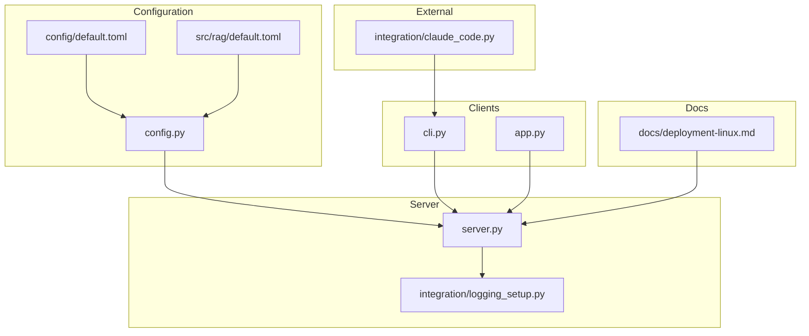
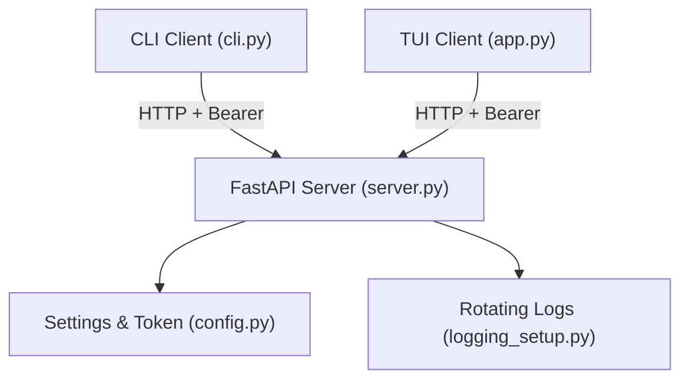
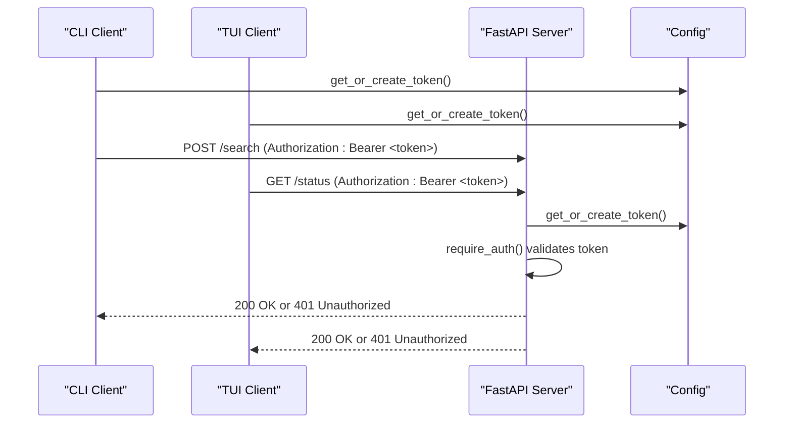
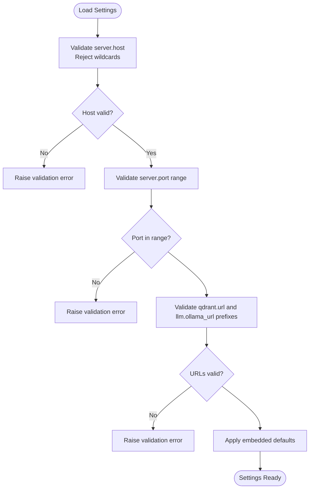
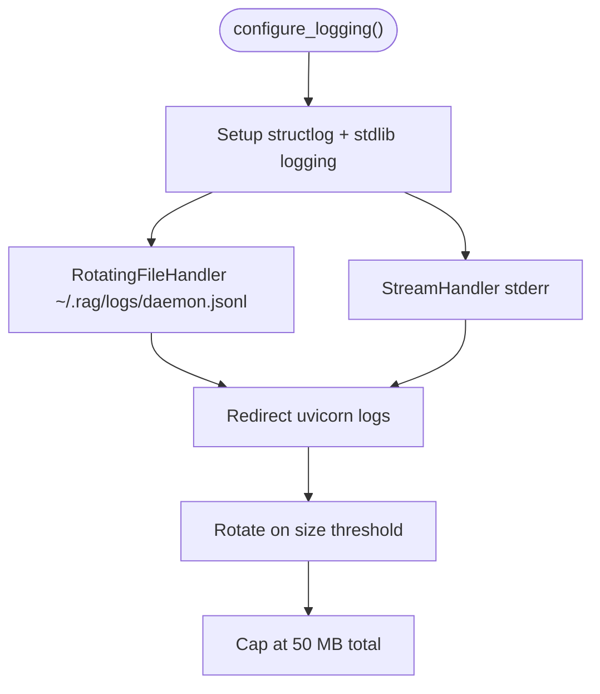
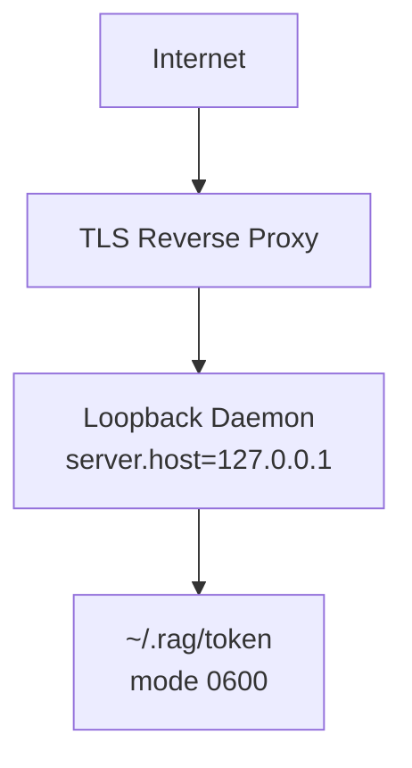
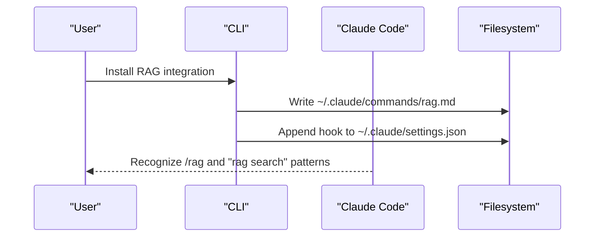
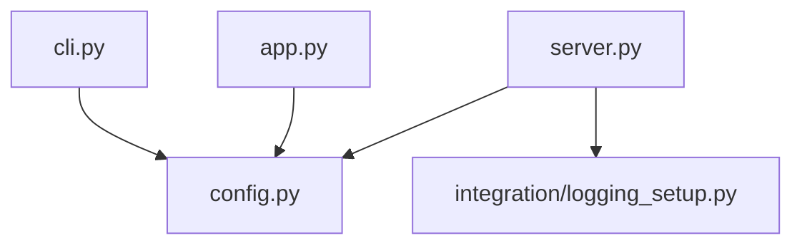

# Security and Configuration

<cite>
**Referenced Files in This Document**
- [config.py](file://src/rag/config.py)
- [default.toml](file://config/default.toml)
- [default.toml](file://src/rag/default.toml)
- [server.py](file://src/rag/server.py)
- [cli.py](file://src/rag/cli.py)
- [app.py](file://src/rag/app.py)
- [logging_setup.py](file://src/rag/integration/logging_setup.py)
- [deployment-linux.md](file://docs/deployment-linux.md)
- [test_auth.py](file://tests/test_auth.py)
- [claude_code.py](file://src/rag/integration/claude_code.py)
</cite>

## Table of Contents
1. [Introduction](#introduction)
2. [Project Structure](#project-structure)
3. [Core Components](#core-components)
4. [Architecture Overview](#architecture-overview)
5. [Detailed Component Analysis](#detailed-component-analysis)
6. [Dependency Analysis](#dependency-analysis)
7. [Performance Considerations](#performance-considerations)
8. [Troubleshooting Guide](#troubleshooting-guide)
9. [Conclusion](#conclusion)
10. [Appendices](#appendices)

## Introduction
This document focuses on secure deployment practices and system hardening for the RAG system. It covers authentication mechanisms (bearer token management), file permissions, secure storage, network security (reverse proxy with TLS), port binding restrictions, environment variable security, sensitive data handling, configuration validation, firewall and access control, external service integrations (Claude Code), audit logging, compliance and monitoring, practical secure configuration templates, vulnerability assessment procedures, and incident response protocols.

## Project Structure
The security-relevant components are primarily located under:
- Configuration and settings: src/rag/config.py, config/default.toml, src/rag/default.toml
- Server and authentication: src/rag/server.py
- CLI and TUI clients: src/rag/cli.py, src/rag/app.py
- Logging and audit trail: src/rag/integration/logging_setup.py
- Deployment guidance: docs/deployment-linux.md
- External integration: src/rag/integration/claude_code.py
- Tests: tests/test_auth.py

**Diagram sources**
- [config.py:150-194](file://src/rag/config.py#L150-L194)
- [default.toml:1-41](file://config/default.toml#L1-L41)
- [default.toml:1-41](file://src/rag/default.toml#L1-L41)
- [server.py:582-600](file://src/rag/server.py#L582-L600)
- [logging_setup.py:38-107](file://src/rag/integration/logging_setup.py#L38-L107)
- [cli.py:24-31](file://src/rag/cli.py#L24-L31)
- [app.py:294-300](file://src/rag/app.py#L294-L300)
- [claude_code.py:49-120](file://src/rag/integration/claude_code.py#L49-L120)
- [deployment-linux.md:1-57](file://docs/deployment-linux.md#L1-L57)

**Section sources**
- [config.py:150-194](file://src/rag/config.py#L150-L194)
- [default.toml:1-41](file://config/default.toml#L1-L41)
- [default.toml:1-41](file://src/rag/default.toml#L1-L41)
- [server.py:582-600](file://src/rag/server.py#L582-L600)
- [logging_setup.py:38-107](file://src/rag/integration/logging_setup.py#L38-L107)
- [cli.py:24-31](file://src/rag/cli.py#L24-L31)
- [app.py:294-300](file://src/rag/app.py#L294-L300)
- [claude_code.py:49-120](file://src/rag/integration/claude_code.py#L49-L120)
- [deployment-linux.md:1-57](file://docs/deployment-linux.md#L1-L57)

## Core Components
- Authentication and token management:
  - Bearer token stored at ~/.rag/token with permission 0600.
  - Token creation and retrieval via get_or_create_token().
  - Authorization enforced via require_auth() and _extract_bearer().
- Configuration validation and defaults:
  - Pydantic-based Settings with strict validation for server host/port, URLs, and paths.
  - Rejects wildcard bind addresses for server.host to prevent exposure.
- Logging and audit trail:
  - Structured JSON logs with rotation to avoid disk growth.
- Reverse proxy and network security:
  - Default localhost binding; expose via reverse proxy with TLS and bearer token.
- External integrations:
  - Claude Code slash command and hook installation utilities.

**Section sources**
- [config.py:167-188](file://src/rag/config.py#L167-L188)
- [config.py:35-50](file://src/rag/config.py#L35-L50)
- [server.py:592-598](file://src/rag/server.py#L592-L598)
- [server.py:582-590](file://src/rag/server.py#L582-L590)
- [logging_setup.py:38-107](file://src/rag/integration/logging_setup.py#L38-L107)
- [deployment-linux.md:51-56](file://docs/deployment-linux.md#L51-L56)
- [claude_code.py:49-120](file://src/rag/integration/claude_code.py#L49-L120)

## Architecture Overview
The system enforces authentication at the server boundary and restricts network exposure by default. Clients (CLI and TUI) attach a Bearer token to all protected requests. The server validates the token and applies CSRF protection for non-safe methods. Logs are rotated to prevent unbounded disk usage.

**Diagram sources**
- [cli.py:24-31](file://src/rag/cli.py#L24-L31)
- [app.py:294-300](file://src/rag/app.py#L294-L300)
- [server.py:592-598](file://src/rag/server.py#L592-L598)
- [config.py:167-188](file://src/rag/config.py#L167-L188)
- [logging_setup.py:38-107](file://src/rag/integration/logging_setup.py#L38-L107)

## Detailed Component Analysis

### Authentication and Bearer Token Management
- Token lifecycle:
  - Created automatically if absent at ~/.rag/token with permission 0600.
  - Used by CLI and TUI to sign all protected requests.
- Server enforcement:
  - require_auth() extracts Bearer from Authorization header and compares with stored token.
  - Uses constant-time comparison to mitigate timing attacks.
- CSRF protection:
  - Non-safe methods are blocked unless originating from localhost or a valid Bearer token is present.

**Diagram sources**
- [cli.py:24-31](file://src/rag/cli.py#L24-L31)
- [app.py:294-300](file://src/rag/app.py#L294-L300)
- [server.py:592-598](file://src/rag/server.py#L592-L598)
- [config.py:167-188](file://src/rag/config.py#L167-L188)

**Section sources**
- [config.py:167-188](file://src/rag/config.py#L167-L188)
- [server.py:592-598](file://src/rag/server.py#L592-L598)
- [server.py:798-817](file://src/rag/server.py#L798-L817)
- [cli.py:24-31](file://src/rag/cli.py#L24-L31)
- [app.py:294-300](file://src/rag/app.py#L294-L300)
- [test_auth.py:85-135](file://tests/test_auth.py#L85-L135)

### Configuration Validation and Secure Defaults
- Server host/port:
  - server.host defaults to loopback and rejects wildcard binds to prevent public exposure.
  - server.port is validated within safe range.
- URLs:
  - qdrant.url and llm.ollama_url must start with http:// or https://.
- Paths:
  - qdrant.path is expanded and resolved safely.
- Defaults:
  - Embedded TOML files define secure defaults for server, embeddings, qdrant, index, llm, and lsp.

**Diagram sources**
- [config.py:35-50](file://src/rag/config.py#L35-L50)
- [config.py:71-76](file://src/rag/config.py#L71-L76)
- [config.py:104-109](file://src/rag/config.py#L104-L109)
- [default.toml:1-41](file://config/default.toml#L1-L41)
- [default.toml:1-41](file://src/rag/default.toml#L1-L41)

**Section sources**
- [config.py:35-50](file://src/rag/config.py#L35-L50)
- [config.py:71-76](file://src/rag/config.py#L71-L76)
- [config.py:104-109](file://src/rag/config.py#L104-L109)
- [default.toml:1-41](file://config/default.toml#L1-L41)
- [default.toml:1-41](file://src/rag/default.toml#L1-L41)

### Logging and Audit Trail
- Structured JSON logs with rotation:
  - 10 MB per file, 5 backups, capped at ~50 MB.
  - Routes uvicorn logs through the same handlers.
- Daemon supervision:
  - systemd user unit recommended; logs captured in journald.

**Diagram sources**
- [logging_setup.py:38-107](file://src/rag/integration/logging_setup.py#L38-L107)
- [deployment-linux.md:1-57](file://docs/deployment-linux.md#L1-L57)

**Section sources**
- [logging_setup.py:38-107](file://src/rag/integration/logging_setup.py#L38-L107)
- [deployment-linux.md:1-57](file://docs/deployment-linux.md#L1-L57)

### Network Security and Reverse Proxy
- Default binding:
  - server.host defaults to loopback; wildcard binds are rejected.
- Exposure via reverse proxy:
  - Keep daemon bound to localhost; expose externally via TLS-enabled reverse proxy.
  - Enforce Bearer token at the proxy boundary if desired, but token-based auth is already enforced at the daemon.
- Firewall and segmentation:
  - Restrict inbound connections to the reverse proxy’s public interface.
  - Segment the daemon on loopback only; do not publish ports directly.

**Diagram sources**
- [config.py:35-50](file://src/rag/config.py#L35-L50)
- [deployment-linux.md:51-56](file://docs/deployment-linux.md#L51-L56)

**Section sources**
- [config.py:35-50](file://src/rag/config.py#L35-L50)
- [deployment-linux.md:51-56](file://docs/deployment-linux.md#L51-L56)

### External Service Integrations (Claude Code)
- Slash command generation:
  - Writes a markdown command to ~/.claude/commands/rag.md enabling /rag <query>.
- Hook installation:
  - Adds a hook entry to ~/.claude/settings.json to recognize rag search patterns.
- Security considerations:
  - These integrations operate locally; ensure ~/.claude is protected and not world-readable.
  - The daemon remains the authoritative source of RAG results; CLI/TUI clients use bearer-authenticated requests.

**Diagram sources**
- [claude_code.py:49-120](file://src/rag/integration/claude_code.py#L49-L120)

**Section sources**
- [claude_code.py:49-120](file://src/rag/integration/claude_code.py#L49-L120)

## Dependency Analysis
- Token and settings dependencies:
  - CLI and TUI depend on config.get_or_create_token() and get_settings().
  - Server depends on config.get_or_create_token() for auth and config.get_settings() for runtime configuration.
- Logging dependency:
  - Server initializes logging_setup.configure_logging() during startup.

**Diagram sources**
- [config.py:150-194](file://src/rag/config.py#L150-L194)
- [server.py:603-716](file://src/rag/server.py#L603-L716)
- [cli.py:12-13](file://src/rag/cli.py#L12-L13)
- [app.py:38-39](file://src/rag/app.py#L38-L39)
- [logging_setup.py:38-107](file://src/rag/integration/logging_setup.py#L38-L107)

**Section sources**
- [config.py:150-194](file://src/rag/config.py#L150-L194)
- [server.py:603-716](file://src/rag/server.py#L603-L716)
- [cli.py:12-13](file://src/rag/cli.py#L12-L13)
- [app.py:38-39](file://src/rag/app.py#L38-L39)
- [logging_setup.py:38-107](file://src/rag/integration/logging_setup.py#L38-L107)

## Performance Considerations
- Authentication overhead:
  - require_auth() performs a constant-time token comparison and minimal I/O.
- Logging:
  - Rotation prevents disk exhaustion; JSON rendering is lightweight.
- Network:
  - Binding to loopback avoids unnecessary network exposure and reduces attack surface.

[No sources needed since this section provides general guidance]

## Troubleshooting Guide
- Unauthorized responses:
  - Verify ~/.rag/token exists and has mode 0600.
  - Confirm CLI/TUI are sending Authorization: Bearer <token>.
- CSRF blocked:
  - Requests from non-localhost origins require a valid Bearer token.
- Daemon not reachable:
  - Ensure server.host remains loopback and the reverse proxy is configured correctly.
- Logs not rotating:
  - Confirm configure_logging() is called and ~/.rag/logs exists.

**Section sources**
- [config.py:167-188](file://src/rag/config.py#L167-L188)
- [server.py:798-817](file://src/rag/server.py#L798-L817)
- [logging_setup.py:38-107](file://src/rag/integration/logging_setup.py#L38-L107)
- [deployment-linux.md:51-56](file://docs/deployment-linux.md#L51-L56)

## Conclusion
The RAG system enforces strong defaults for secure operation: loopback-only binding, mandatory bearer token authentication, CSRF protection, and rotation-based audit logging. Deployments should rely on a TLS-enabled reverse proxy to expose the daemon securely, maintain strict file permissions for tokens and logs, and apply network segmentation and access controls.

[No sources needed since this section summarizes without analyzing specific files]

## Appendices

### Practical Secure Configuration Templates
- Server and embedding defaults:
  - Use the embedded TOML defaults for secure baseline settings.
- Token and file permissions:
  - Ensure ~/.rag/token has mode 0600.
- Logging:
  - Use the provided logging setup for rotated JSON logs.

**Section sources**
- [default.toml:1-41](file://config/default.toml#L1-L41)
- [default.toml:1-41](file://src/rag/default.toml#L1-L41)
- [config.py:167-188](file://src/rag/config.py#L167-L188)
- [logging_setup.py:38-107](file://src/rag/integration/logging_setup.py#L38-L107)

### Vulnerability Assessment Procedures
- Authentication:
  - Verify bearer token presence and correctness on protected routes.
  - Confirm wildcard bind rejection and loopback-only default.
- Authorization:
  - Validate CSRF guard for non-safe methods.
- Logging:
  - Confirm rotation and absence of sensitive data in logs.
- External integrations:
  - Review ~/.claude permissions and hook safety.

**Section sources**
- [test_auth.py:85-135](file://tests/test_auth.py#L85-L135)
- [config.py:35-50](file://src/rag/config.py#L35-L50)
- [server.py:798-817](file://src/rag/server.py#L798-L817)
- [logging_setup.py:38-107](file://src/rag/integration/logging_setup.py#L38-L107)
- [claude_code.py:49-120](file://src/rag/integration/claude_code.py#L49-L120)

### Incident Response Protocols
- Immediate actions:
  - Revoke and regenerate ~/.rag/token.
  - Rotate logs and review recent entries for anomalies.
  - Verify reverse proxy access logs and enforce stricter origin checks if needed.
- Post-incident:
  - Review configuration drift and restore embedded defaults.
  - Audit ~/.claude integration files and remove unauthorized hooks.
  - Reinstate firewall rules and network segmentation.

**Section sources**
- [config.py:167-188](file://src/rag/config.py#L167-L188)
- [logging_setup.py:38-107](file://src/rag/integration/logging_setup.py#L38-L107)
- [deployment-linux.md:51-56](file://docs/deployment-linux.md#L51-L56)
- [claude_code.py:49-120](file://src/rag/integration/claude_code.py#L49-L120)