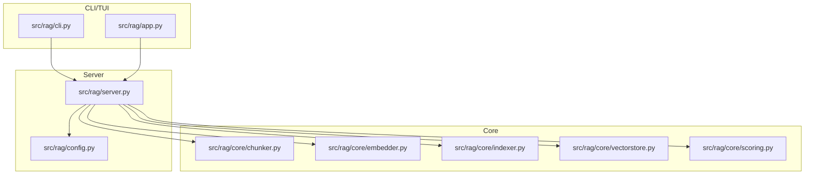
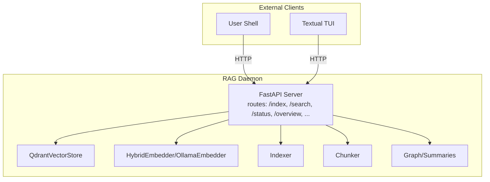
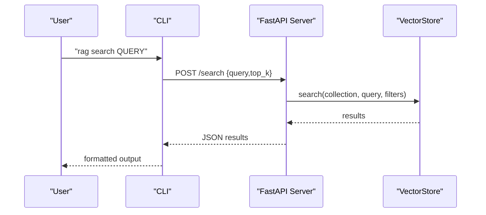
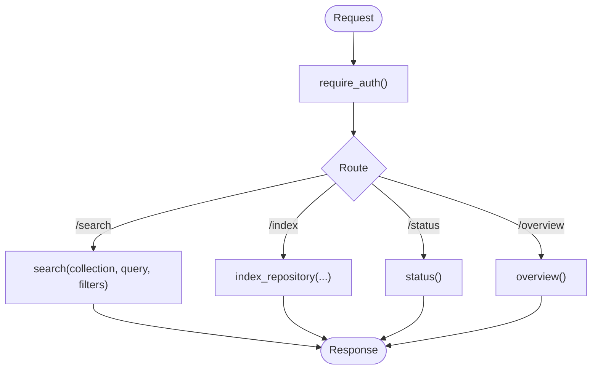
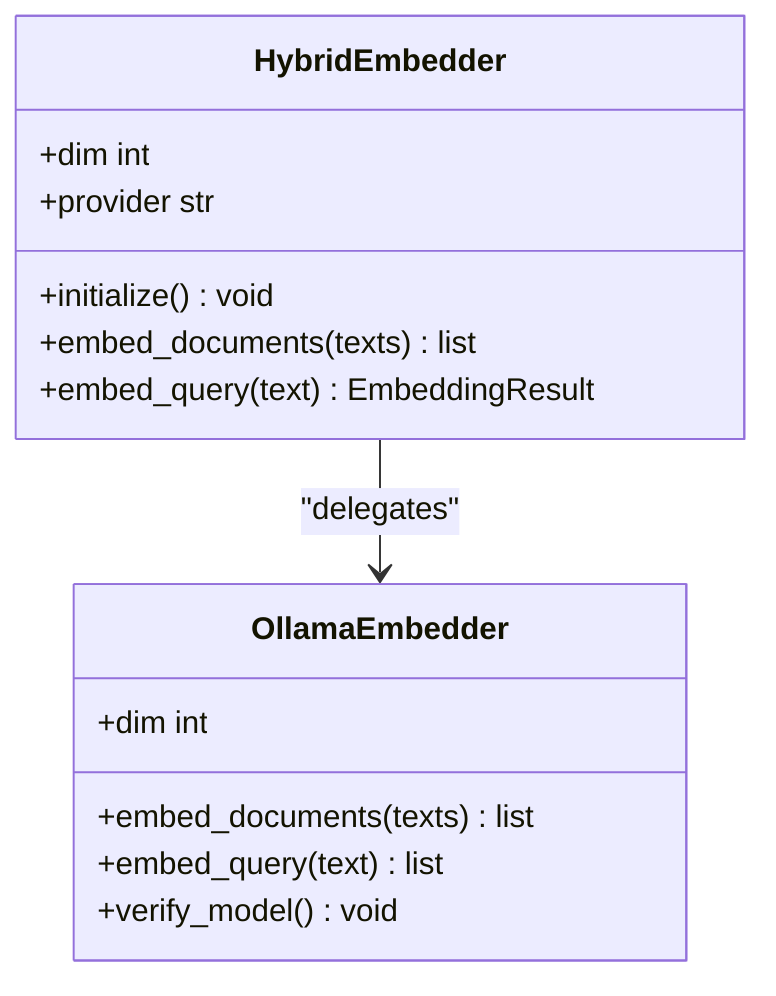
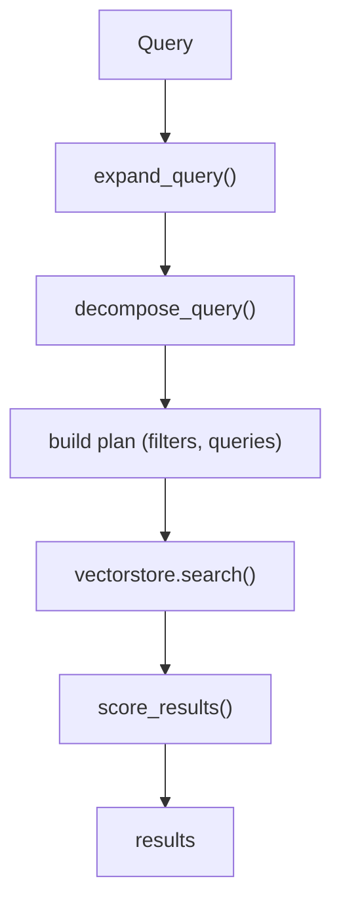
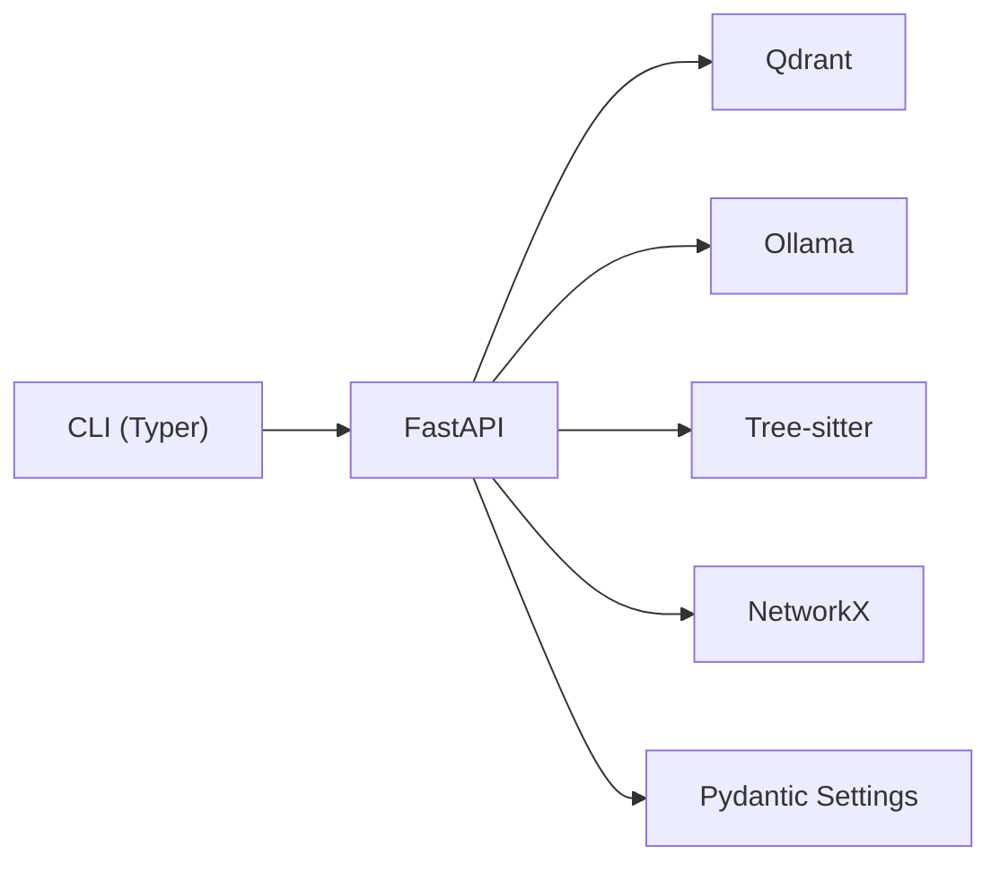
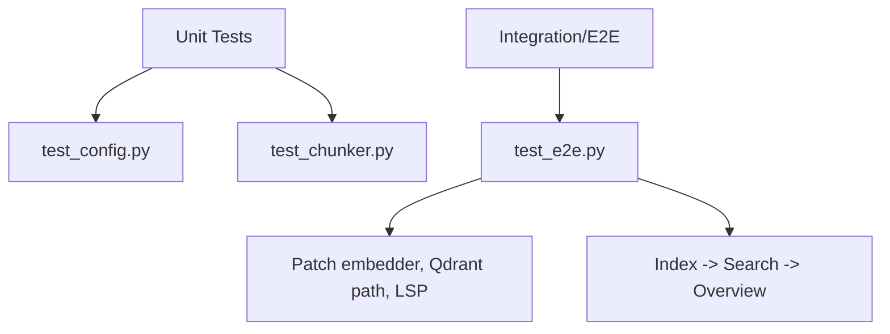

# Development Guide

<cite>
**Referenced Files in This Document**
- [README.md](file://README.md)
- [pyproject.toml](file://pyproject.toml)
- [src/rag/__main__.py](file://src/rag/__main__.py)
- [src/rag/app.py](file://src/rag/app.py)
- [src/rag/cli.py](file://src/rag/cli.py)
- [src/rag/config.py](file://src/rag/config.py)
- [src/rag/server.py](file://src/rag/server.py)
- [src/rag/core/embedder.py](file://src/rag/core/embedder.py)
- [src/rag/core/indexer.py](file://src/rag/core/indexer.py)
- [src/rag/core/vectorstore.py](file://src/rag/core/vectorstore.py)
- [src/rag/core/chunker.py](file://src/rag/core/chunker.py)
- [src/rag/core/scoring.py](file://src/rag/core/scoring.py)
- [tests/test_config.py](file://tests/test_config.py)
- [tests/test_chunker.py](file://tests/test_chunker.py)
- [tests/test_e2e.py](file://tests/test_e2e.py)
</cite>

## Update Summary
**Changes Made**
- Comprehensive documentation overhaul with complete Development Guide
- Added detailed coding conventions, testing procedures, build processes, and contribution workflows
- Enhanced architecture documentation with practical examples and troubleshooting guides
- Expanded coverage of development environment setup, performance considerations, and debugging workflows

## Table of Contents
1. [Introduction](#introduction)
2. [Project Structure](#project-structure)
3. [Core Components](#core-components)
4. [Architecture Overview](#architecture-overview)
5. [Detailed Component Analysis](#detailed-component-analysis)
6. [Dependency Analysis](#dependency-analysis)
7. [Performance Considerations](#performance-considerations)
8. [Troubleshooting Guide](#troubleshooting-guide)
9. [Testing Strategies](#testing-strategies)
10. [Coding Standards, Commit Conventions, and PR Procedures](#coding-standards-commit-conventions-and-pr-procedures)
11. [Continuous Integration, Automated Testing, and Release Procedures](#continuous-integration-automated-testing-and-release-procedures)
12. [Practical Examples](#practical-examples)
13. [Appendices](#appendices)

## Introduction
This development guide helps contributors build, extend, and maintain the RAG system. It covers:
- Environment setup and installation
- Layered architecture and component relationships
- Extension points for search strategies, embedding providers, and CLI
- Testing strategies (unit, integration, end-to-end)
- Coding standards, commit conventions, and PR procedures
- Performance profiling, debugging, and troubleshooting
- Continuous integration, automated testing, and release procedures

The system is a headless FastAPI daemon with a separate read-only Textual TUI dashboard. Retrieval is dense vector search with code-aware chunking powered by tree-sitter.

## Project Structure
The repository follows a clear separation of concerns:
- CLI and TUI clients in src/rag
- FastAPI server in src/rag/server.py
- Core domain logic in src/rag/core (chunker, embedder, indexer, vectorstore, scoring)
- Configuration and settings in src/rag/config.py
- Tests in tests/ with unit and end-to-end suites

**Diagram sources**
- [src/rag/cli.py:1-2274](file://src/rag/cli.py#L1-L2274)
- [src/rag/app.py:1-2274](file://src/rag/app.py#L1-L2274)
- [src/rag/server.py:1-2586](file://src/rag/server.py#L1-L2586)
- [src/rag/config.py:1-194](file://src/rag/config.py#L1-L194)
- [src/rag/core/chunker.py:1-622](file://src/rag/core/chunker.py#L1-L622)
- [src/rag/core/embedder.py:1-245](file://src/rag/core/embedder.py#L1-L245)
- [src/rag/core/indexer.py:1-740](file://src/rag/core/indexer.py#L1-L740)
- [src/rag/core/vectorstore.py:1-530](file://src/rag/core/vectorstore.py#L1-L530)
- [src/rag/core/scoring.py:1-143](file://src/rag/core/scoring.py#L1-L143)

**Section sources**
- [README.md:1-74](file://README.md#L1-L74)
- [pyproject.toml:1-83](file://pyproject.toml#L1-L83)

## Core Components
- CLI: Thin HTTP client that validates daemon readiness, authenticates requests, and prints structured output. See [src/rag/cli.py:1-2274](file://src/rag/cli.py#L1-L2274).
- TUI: Textual dashboard that polls the daemon for status, queries, events, and renders dashboards. See [src/rag/app.py:1-2274](file://src/rag/app.py#L1-L2274).
- Server: FastAPI app with routes for indexing, searching, context packs, and diagnostics. See [src/rag/server.py:1-2586](file://src/rag/server.py#L1-L2586).
- Configuration: TOML-based settings validated via Pydantic. See [src/rag/config.py:1-194](file://src/rag/config.py#L1-L194).
- Chunker: Tree-sitter-based 3-tier chunking for code and docs. See [src/rag/core/chunker.py:1-622](file://src/rag/core/chunker.py#L1-L622).
- Embedder: Ollama-backed dense embeddings with retry/backoff. See [src/rag/core/embedder.py:1-245](file://src/rag/core/embedder.py#L1-L245).
- Indexer: Git-aware incremental ingestion with LSP enrichment and graph/post-processing. See [src/rag/core/indexer.py:1-740](file://src/rag/core/indexer.py#L1-L740).
- Vector Store: Qdrant-backed dense-only search with payload indexes. See [src/rag/core/vectorstore.py:1-530](file://src/rag/core/vectorstore.py#L1-L530).
- Scoring: Lightweight weighted scoring combining recency, patterns, and quality. See [src/rag/core/scoring.py:1-143](file://src/rag/core/scoring.py#L1-L143).

**Section sources**
- [src/rag/cli.py:1-2274](file://src/rag/cli.py#L1-L2274)
- [src/rag/app.py:1-2274](file://src/rag/app.py#L1-L2274)
- [src/rag/server.py:1-2586](file://src/rag/server.py#L1-L2586)
- [src/rag/config.py:1-194](file://src/rag/config.py#L1-L194)
- [src/rag/core/chunker.py:1-622](file://src/rag/core/chunker.py#L1-L622)
- [src/rag/core/embedder.py:1-245](file://src/rag/core/embedder.py#L1-L245)
- [src/rag/core/indexer.py:1-740](file://src/rag/core/indexer.py#L1-L740)
- [src/rag/core/vectorstore.py:1-530](file://src/rag/core/vectorstore.py#L1-L530)
- [src/rag/core/scoring.py:1-143](file://src/rag/core/scoring.py#L1-L143)

## Architecture Overview
The system is a headless FastAPI daemon (HTTP server) with a separate read-only Textual TUI. CLI commands talk to the daemon over HTTP. The server orchestrates indexing, vector search, and retrieval planning.

**Diagram sources**
- [README.md:67-74](file://README.md#L67-L74)
- [src/rag/server.py:1-2586](file://src/rag/server.py#L1-L2586)
- [src/rag/core/vectorstore.py:1-530](file://src/rag/core/vectorstore.py#L1-L530)
- [src/rag/core/embedder.py:1-245](file://src/rag/core/embedder.py#L1-L245)
- [src/rag/core/indexer.py:1-740](file://src/rag/core/indexer.py#L1-L740)
- [src/rag/core/chunker.py:1-622](file://src/rag/core/chunker.py#L1-L622)

## Detailed Component Analysis

### CLI and TUI
- CLI:
  - Validates daemon health, authenticates with bearer token, posts JSON payloads, and prints structured output. See [src/rag/cli.py:1-2274](file://src/rag/cli.py#L1-L2274).
  - Provides commands for init, start, search, context-pack, repo-agent, benchmark-embeddings, and more. See [README.md:37-66](file://README.md#L37-L66).
- TUI:
  - Polls the daemon for status, recent queries, events, collections, plugins, and overview. Renders dashboards and search results. See [src/rag/app.py:1-2274](file://src/rag/app.py#L1-L2274).

**Diagram sources**
- [src/rag/cli.py:426-476](file://src/rag/cli.py#L426-L476)
- [src/rag/server.py:424-465](file://src/rag/server.py#L424-L465)
- [src/rag/core/vectorstore.py:424-465](file://src/rag/core/vectorstore.py#L424-L465)

**Section sources**
- [src/rag/cli.py:1-2274](file://src/rag/cli.py#L1-L2274)
- [src/rag/app.py:1-2274](file://src/rag/app.py#L1-L2274)
- [README.md:37-66](file://README.md#L37-L66)

### Server and Routes
- FastAPI app with lifespan initialization, global error handlers, rate-limiting, and CSRF guard middleware. See [src/rag/server.py:1-2586](file://src/rag/server.py#L1-L2586).
- Key routes include:
  - /health, /status, /collections
  - /index, /index-docs
  - /search, /context-pack, /resolve, /call-tree
  - /project-understand, /overview, /events/recent
  - /export, /import, /plugins, /repos, /verify, /repair
- Authentication via bearer token enforced by dependency. See [src/rag/server.py:592-598](file://src/rag/server.py#L592-L598).

**Diagram sources**
- [src/rag/server.py:592-598](file://src/rag/server.py#L592-L598)
- [src/rag/server.py:1-2586](file://src/rag/server.py#L1-L2586)

**Section sources**
- [src/rag/server.py:1-2586](file://src/rag/server.py#L1-L2586)

### Embedding Provider Extension
Current runtime: Ollama-backed dense embeddings. The embedder facade is dense-only; FastEmbed and sparse paths were removed.

- To implement a new embedding provider:
  - Implement a new embedder class with the same interface as OllamaEmbedder (embed_documents, embed_query, verify_model).
  - Update HybridEmbedder to select the new provider based on settings.
  - Ensure dimension compatibility with the Qdrant collection.
- Example extension points:
  - Add a new provider selection in HybridEmbedder.initialize.
  - Add provider-specific verification in verify_model.
- References:
  - [src/rag/core/embedder.py:189-245](file://src/rag/core/embedder.py#L189-L245)
  - [src/rag/core/vectorstore.py:260-294](file://src/rag/core/vectorstore.py#L260-L294)

**Diagram sources**
- [src/rag/core/embedder.py:189-245](file://src/rag/core/embedder.py#L189-L245)

**Section sources**
- [src/rag/core/embedder.py:1-245](file://src/rag/core/embedder.py#L1-L245)
- [src/rag/core/vectorstore.py:260-294](file://src/rag/core/vectorstore.py#L260-L294)

### Search Strategy Extension
- The server composes a plan for retrieval and applies lightweight scoring. Strategies include lexical and semantic fallbacks.
- To add a new strategy:
  - Extend the planner logic in the server route that builds the plan (e.g., hybrid planner).
  - Add new filters or query decomposition rules in the query module.
  - Integrate new filters into Qdrant filtering in vectorstore.search.
- References:
  - [src/rag/server.py:424-465](file://src/rag/server.py#L424-L465)
  - [src/rag/core/query.py:1-52](file://src/rag/core/query.py#L1-L52)
  - [src/rag/core/vectorstore.py:119-156](file://src/rag/core/vectorstore.py#L119-L156)

**Diagram sources**
- [src/rag/core/query.py:31-52](file://src/rag/core/query.py#L31-L52)
- [src/rag/server.py:424-465](file://src/rag/server.py#L424-L465)
- [src/rag/core/scoring.py:31-57](file://src/rag/core/scoring.py#L31-L57)

**Section sources**
- [src/rag/server.py:424-465](file://src/rag/server.py#L424-L465)
- [src/rag/core/query.py:1-52](file://src/rag/core/query.py#L1-L52)
- [src/rag/core/scoring.py:1-143](file://src/rag/core/scoring.py#L1-L143)

### CLI Extension
- Add a new command by defining a Typer callback in [src/rag/cli.py:1-2274](file://src/rag/cli.py#L1-L2274).
- Steps:
  - Define a new @app.command(...)
  - Implement HTTP calls to the daemon (POST/GET) with proper error handling and JSON printing.
  - Use _require_daemon() and _post_json() helpers for consistency.
- Example patterns:
  - [src/rag/cli.py:426-476](file://src/rag/cli.py#L426-L476) for search
  - [src/rag/cli.py:530-800](file://src/rag/cli.py#L530-L800) for repo-agent

**Section sources**
- [src/rag/cli.py:1-2274](file://src/rag/cli.py#L1-L2274)

### Configuration and Settings
- Settings are loaded from default and user-provided TOML, merged and validated via Pydantic models.
- Key areas:
  - Server host/port, embeddings model/batch, Qdrant mode/url/path, index limits, LLM URLs, LSP toggles.
- References:
  - [src/rag/config.py:1-194](file://src/rag/config.py#L1-L194)

**Section sources**
- [src/rag/config.py:1-194](file://src/rag/config.py#L1-L194)

## Dependency Analysis
- Runtime dependencies pinned in [pyproject.toml:15-57](file://pyproject.toml#L15-L57).
- CLI entry point defined in [src/rag/__main__.py:1-6](file://src/rag/__main__.py#L1-L6).
- Core dependencies:
  - FastAPI/Uvicorn for the server
  - Qdrant client for vector storage
  - Ollama for embeddings
  - Tree-sitter parsers for code chunking
  - NetworkX for knowledge graph
- Dev dependencies include pytest, pytest-asyncio, ruff.

**Diagram sources**
- [pyproject.toml:15-57](file://pyproject.toml#L15-L57)
- [src/rag/cli.py:1-2274](file://src/rag/cli.py#L1-L2274)
- [src/rag/server.py:1-2586](file://src/rag/server.py#L1-L2586)

**Section sources**
- [pyproject.toml:1-83](file://pyproject.toml#L1-L83)
- [src/rag/__main__.py:1-6](file://src/rag/__main__.py#L1-L6)

## Performance Considerations
- Embedding batch sizing: tune via CLI benchmark command and settings. See [src/rag/cli.py:302-385](file://src/rag/cli.py#L302-L385).
- Vector search: push filters to Qdrant to avoid post-filtering recall loss. See [src/rag/core/vectorstore.py:424-465](file://src/rag/core/vectorstore.py#L424-L465).
- Indexing pipeline:
  - Thread pool chunking to avoid blocking the event loop. See [src/rag/core/indexer.py:424-444](file://src/rag/core/indexer.py#L424-L444).
  - LSP enrichment gated by settings; disable for performance-sensitive runs. See [src/rag/core/indexer.py:380-383](file://src/rag/core/indexer.py#L380-L383).
- Payload indexes: ensure indexes exist in server mode to accelerate filtering. See [src/rag/core/vectorstore.py:238-258](file://src/rag/core/vectorstore.py#L238-L258).

**Section sources**
- [src/rag/cli.py:302-385](file://src/rag/cli.py#L302-L385)
- [src/rag/core/vectorstore.py:424-465](file://src/rag/core/vectorstore.py#L424-L465)
- [src/rag/core/indexer.py:380-383](file://src/rag/core/indexer.py#L380-L383)

## Troubleshooting Guide
- Health checks:
  - Use `rag diagnose` for daemon, Ollama, LSP, and cache diagnostics. See [README.md:71-74](file://README.md#L71-L74).
  - Use `rag status` and `rag collections list` to inspect runtime state. See [README.md:37-66](file://README.md#L37-L66).
- Index integrity:
  - Verify and repair indices with `rag verify` and `rag repair`. See [README.md:57-66](file://README.md#L57-L66).
- Common issues:
  - Ollama unreachable or model missing: ensure `ollama serve` is running and the embedding model is pulled. See [src/rag/core/embedder.py:166-186](file://src/rag/core/embedder.py#L166-L186).
  - Wildcard bind rejected: server host must be loopback; use a reverse proxy for external exposure. See [src/rag/config.py:39-50](file://src/rag/config.py#L39-L50).
  - Collection dimension mismatch: re-index with --full after changing embedding model. See [src/rag/core/vectorstore.py:264-278](file://src/rag/core/vectorstore.py#L264-L278).

**Section sources**
- [README.md:71-74](file://README.md#L71-L74)
- [src/rag/core/embedder.py:166-186](file://src/rag/core/embedder.py#L166-L186)
- [src/rag/config.py:39-50](file://src/rag/config.py#L39-L50)
- [src/rag/core/vectorstore.py:264-278](file://src/rag/core/vectorstore.py#L264-L278)

## Testing Strategies
- Unit tests:
  - Configuration validation: [tests/test_config.py:1-72](file://tests/test_config.py#L1-L72)
  - Code chunking (tree-sitter): [tests/test_chunker.py:1-183](file://tests/test_chunker.py#L1-L183)
- Integration/e2e:
  - End-to-end smoke test with deterministic fake embedder and TestClient: [tests/test_e2e.py:1-314](file://tests/test_e2e.py#L1-L314)
  - Requires environment variable to enable: RAG_E2E=1

**Diagram sources**
- [tests/test_config.py:1-72](file://tests/test_config.py#L1-L72)
- [tests/test_chunker.py:1-183](file://tests/test_chunker.py#L1-L183)
- [tests/test_e2e.py:1-314](file://tests/test_e2e.py#L1-L314)

**Section sources**
- [tests/test_config.py:1-72](file://tests/test_config.py#L1-L72)
- [tests/test_chunker.py:1-183](file://tests/test_chunker.py#L1-L183)
- [tests/test_e2e.py:1-314](file://tests/test_e2e.py#L1-L314)

## Coding Standards, Commit Conventions, and PR Procedures
- Formatting and linting:
  - Ruff configured with target Python 3.11 and line length 100. See [pyproject.toml:80-83](file://pyproject.toml#L80-L83).
- Commit conventions:
  - Use imperative mood, concise subject, and reference issue numbers when applicable.
- PR checklist:
  - Run ruff formatting and pytest locally
  - Add or update unit/integration tests
  - Document changes in README or inline where relevant
  - Ensure no breaking changes to public APIs

## Continuous Integration, Automated Testing, and Release Procedures
- CI and release:
  - The repository uses a wheel build backend and includes a lockfile for reproducibility. See [pyproject.toml:1-14](file://pyproject.toml#L1-L14).
  - Use `uv lock` to materialize an exact lockfile for deployments.
- Local automation:
  - pytest configured in [pyproject.toml:76-78](file://pyproject.toml#L76-L78) with async mode.
  - Run unit tests with pytest; enable e2e tests with RAG_E2E=1.

**Section sources**
- [pyproject.toml:1-83](file://pyproject.toml#L1-L83)

## Practical Examples

### Adding a New Search Strategy
- Extend planner logic in the server route that constructs the plan. Introduce new filters or sub-queries and wire them into vectorstore.search.
- Reference:
  - [src/rag/server.py:424-465](file://src/rag/server.py#L424-L465)
  - [src/rag/core/vectorstore.py:119-156](file://src/rag/core/vectorstore.py#L119-L156)

**Section sources**
- [src/rag/server.py:424-465](file://src/rag/server.py#L424-L465)
- [src/rag/core/vectorstore.py:119-156](file://src/rag/core/vectorstore.py#L119-L156)

### Implementing a Custom Embedding Provider
- Implement a new embedder class with embed_documents, embed_query, and verify_model.
- Update HybridEmbedder to select the new provider based on settings.
- Ensure collection dimension matches embedder dimension.
- References:
  - [src/rag/core/embedder.py:189-245](file://src/rag/core/embedder.py#L189-L245)
  - [src/rag/core/vectorstore.py:260-294](file://src/rag/core/vectorstore.py#L260-L294)

**Section sources**
- [src/rag/core/embedder.py:189-245](file://src/rag/core/embedder.py#L189-L245)
- [src/rag/core/vectorstore.py:260-294](file://src/rag/core/vectorstore.py#L260-L294)

### Extending the CLI
- Add a new command in [src/rag/cli.py:1-2274](file://src/rag/cli.py#L1-L2274) using Typer.
- Use helper functions for authentication and HTTP posting.
- Reference patterns:
  - [src/rag/cli.py:426-476](file://src/rag/cli.py#L426-L476) for search
  - [src/rag/cli.py:530-800](file://src/rag/cli.py#L530-L800) for repo-agent

**Section sources**
- [src/rag/cli.py:1-2274](file://src/rag/cli.py#L1-L2274)

## Appendices

### Development Setup
- Prerequisites:
  - Python 3.11+
  - Ollama for embeddings (Qwen3-Embedding)
- Install:
  - Editable install: pip install -e .
  - Install project-owned Codex skills: rag install-agent codex
- Quickstart:
  - ollama pull qwen3-embedding
  - rag init . (copy default config, start daemon, index cwd)
  - rag search "auth middleware"
  - rag tui (optional dashboard)

**Section sources**
- [README.md:9-36](file://README.md#L9-L36)

### Environment Variables
- RAG_WATCH_PATH: Enable file watcher for auto re-index when starting the daemon with --watch.
- RAG_E2E: Enable end-to-end tests.
- RAG_SKIP_GRAPH, RAG_ENABLE_SUMMARIES: Control graph and summary generation during indexing.

**Section sources**
- [src/rag/server.py:664-694](file://src/rag/server.py#L664-L694)
- [tests/test_e2e.py:22-25](file://tests/test_e2e.py#L22-L25)
- [src/rag/core/indexer.py:518-533](file://src/rag/core/indexer.py#L518-L533)