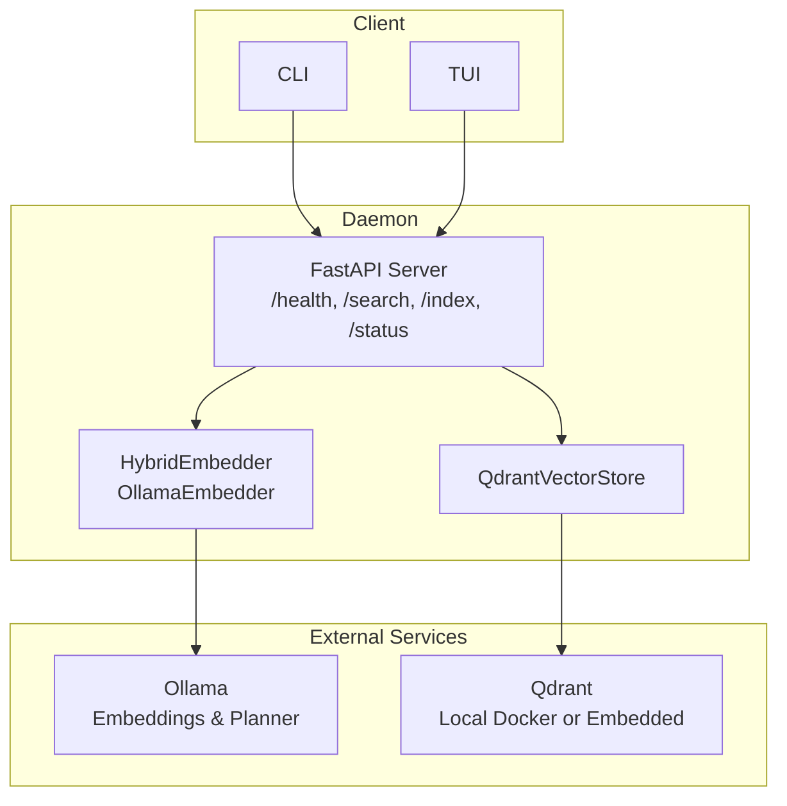
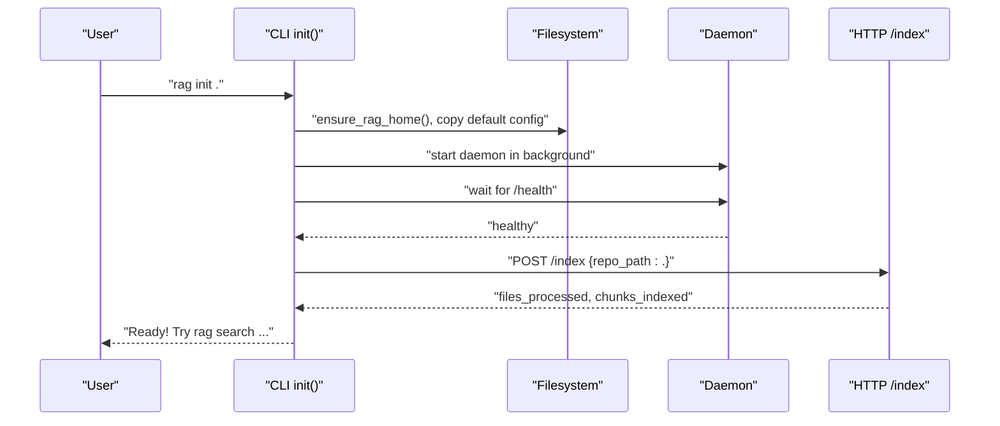
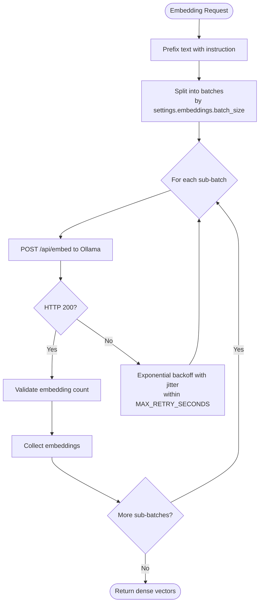
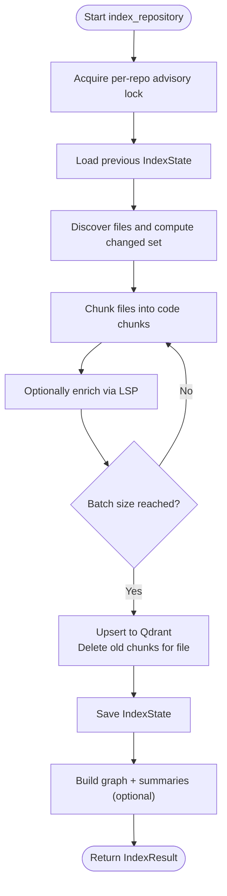
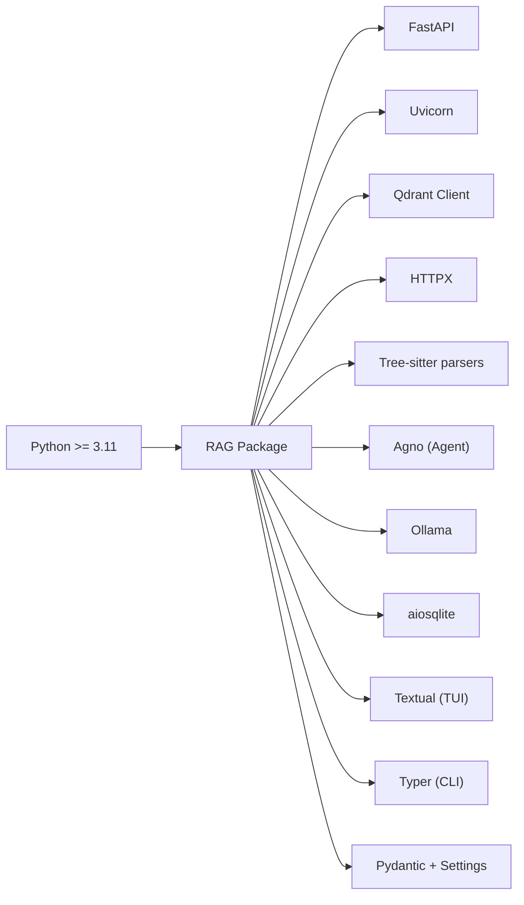

# Getting Started

<cite>
**Referenced Files in This Document**
- [README.md](file://README.md)
- [pyproject.toml](file://pyproject.toml)
- [config/default.toml](file://config/default.toml)
- [src/rag/config.py](file://src/rag/config.py)
- [src/rag/cli.py](file://src/rag/cli.py)
- [src/rag/server.py](file://src/rag/server.py)
- [src/rag/core/embedder.py](file://src/rag/core/embedder.py)
- [src/rag/core/indexer.py](file://src/rag/core/indexer.py)
- [src/rag/integration/logging_setup.py](file://src/rag/integration/logging_setup.py)
- [compose.qdrant.yml](file://compose.qdrant.yml)
- [scripts/install-codex-skills.sh](file://scripts/install-codex-skills.sh)
</cite>

## Table of Contents
1. [Introduction](#introduction)
2. [Prerequisites](#prerequisites)
3. [Quickstart in 30 Seconds](#quickstart-in-30-seconds)
4. [Installation](#installation)
5. [Environment Setup](#environment-setup)
6. [Configuration Management](#configuration-management)
7. [First-Time Usage Patterns](#first-time-usage-patterns)
8. [Architecture Overview](#architecture-overview)
9. [Detailed Component Analysis](#detailed-component-analysis)
10. [Dependency Analysis](#dependency-analysis)
11. [Performance Considerations](#performance-considerations)
12. [Troubleshooting Guide](#troubleshooting-guide)
13. [Conclusion](#conclusion)

## Introduction
This guide helps you rapidly onboard the RAG system and become productive quickly. It covers prerequisites, installation, environment setup, configuration, and a 30-second quickstart workflow. It also includes troubleshooting tips and best practices for both beginners and experienced developers.

## Prerequisites
- Python 3.11 or newer
- Ollama installed and running locally
  - Required for embeddings (Qwen3-Embedding)
  - Recommended for the planner agent (qwen3:8b)
- Optional: Docker for local Qdrant server (via docker compose)

Key runtime requirements and defaults are defined in the project’s configuration and dependencies.

**Section sources**
- [README.md:9-18](file://README.md#L9-L18)
- [pyproject.toml:9](file://pyproject.toml#L9)
- [config/default.toml:5-13](file://config/default.toml#L5-L13)
- [config/default.toml:33-35](file://config/default.toml#L33-L35)

## Quickstart in 30 Seconds
Follow this minimal workflow to get indexing and searching immediately:

1. Pull the embedding model:
   - ollama pull qwen3-embedding
2. Initialize and index the current directory:
   - rag init .
3. Perform a search:
   - rag search "your query"
4. Optional: Launch the TUI dashboard:
   - rag tui
5. Optional: Enable auto-start on macOS:
   - rag service install

This sequence creates a config file, starts the daemon, indexes the current directory, and prepares the vector store for immediate search.

**Section sources**
- [README.md:25-35](file://README.md#L25-L35)
- [src/rag/cli.py:82-141](file://src/rag/cli.py#L82-L141)

## Installation
Install the project in development mode and prepare your environment:

- Install the package:
  - pip install -e .
- Verify Python version meets the requirement (>= 3.11)
- Ensure Ollama is running and the embedding model is available

Notes:
- The CLI entry point is exposed via the project script “rag”.
- The system requires Ollama for embeddings and the planner agent; without it, the daemon will fail to start.

**Section sources**
- [README.md:9-18](file://README.md#L9-L18)
- [pyproject.toml:66-67](file://pyproject.toml#L66-L67)
- [src/rag/server.py:603-716](file://src/rag/server.py#L603-L716)

## Environment Setup
Configure your environment for optimal performance and reliability:

- Ollama
  - Ensure the Ollama service is running locally
  - Pull the embedding model: ollama pull qwen3-embedding
  - Pull the planner model (recommended): ollama pull qwen3:8b
- Vector Store
  - Local Qdrant via Docker Compose (optional):
    - docker compose -f compose.qdrant.yml up -d
  - Or use embedded mode (default) for simplicity
- Logging
  - The daemon writes rotated JSON logs to ~/.rag/logs/daemon.jsonl

**Section sources**
- [README.md:17](file://README.md#L17)
- [compose.qdrant.yml:1-11](file://compose.qdrant.yml#L1-L11)
- [src/rag/integration/logging_setup.py:38-107](file://src/rag/integration/logging_setup.py#L38-L107)

## Configuration Management
The system uses TOML-based configuration with Pydantic validation. Configuration precedence:
- Default configuration bundled with the package
- User configuration at ~/.rag/config.toml (created automatically by the CLI)

Key configuration areas:
- Server: host, port
- Embeddings: model, dimension, batch size, keep_alive
- Qdrant: mode (server/embedded), URL/path, collections
- Index: chunk size limits, retrieval top_k, skip directories
- LLM: Ollama URL, agent model, generation model
- LSP: enable/disable, auto-detect, timeout

Important defaults:
- Server binds to 127.0.0.1 by default (security-conscious)
- Embedding model defaults to Qwen/Qwen3-Embedding-4B
- Qdrant mode defaults to server with URL http://127.0.0.1:6333
- Index skip directories include common build artifacts

Managing configuration:
- Create or edit ~/.rag/config.toml
- Use the CLI to open the config file: rag config
- Changes take effect after restarting the daemon

**Section sources**
- [src/rag/config.py:150-194](file://src/rag/config.py#L150-L194)
- [config/default.toml:1-41](file://config/default.toml#L1-41)
- [src/rag/cli.py:82-141](file://src/rag/cli.py#L82-L141)

## First-Time Usage Patterns
After installation and environment setup, follow these patterns to get productive:

- Initialize and index:
  - rag init . starts the daemon, waits for readiness, then indexes the current directory
- Search:
  - rag search "your query" returns results with scores and code snippets
  - Use --top-k to adjust result count
- Explore:
  - rag overview for codebase statistics
  - rag repos to list registered repositories
  - rag collections list to inspect Qdrant collections
- TUI Dashboard:
  - rag tui launches a read-only dashboard connected to the running daemon
- Diagnose:
  - rag diagnose to check daemon health, Ollama availability, and cache stats

Agent and advanced features:
- Install Codex skills for enhanced workflows: rag install-agent codex
- Use rag repo-agent for structured retrieval planning and context packing

**Section sources**
- [README.md:37-66](file://README.md#L37-L66)
- [src/rag/cli.py:425-476](file://src/rag/cli.py#L425-L476)
- [src/rag/cli.py:530-800](file://src/rag/cli.py#L530-L800)

## Architecture Overview
High-level architecture:
- Headless FastAPI daemon (server) on 127.0.0.1:7890
- CLI and TUI are thin HTTP clients; the daemon remains alive independently
- Vector store backed by Qdrant (local Docker or embedded)
- Embeddings powered by Ollama (Qwen3-Embedding)
- Planner agent uses Ollama (qwen3:8b) for retrieval planning

**Diagram sources**
- [src/rag/server.py:603-716](file://src/rag/server.py#L603-L716)
- [src/rag/core/embedder.py:189-245](file://src/rag/core/embedder.py#L189-L245)
- [compose.qdrant.yml:1-11](file://compose.qdrant.yml#L1-L11)

**Section sources**
- [README.md:67-74](file://README.md#L67-L74)
- [src/rag/server.py:603-716](file://src/rag/server.py#L603-L716)

## Detailed Component Analysis

### CLI Initialization Flow
The CLI orchestrates initialization, daemon startup, and indexing:

**Diagram sources**
- [src/rag/cli.py:82-141](file://src/rag/cli.py#L82-L141)

**Section sources**
- [src/rag/cli.py:82-141](file://src/rag/cli.py#L82-L141)

### Embedding Pipeline
Embeddings are produced via Ollama with robust retry logic and instruction prefixes:

**Diagram sources**
- [src/rag/core/embedder.py:74-154](file://src/rag/core/embedder.py#L74-L154)

**Section sources**
- [src/rag/core/embedder.py:48-245](file://src/rag/core/embedder.py#L48-L245)

### Indexing Pipeline
The indexer performs incremental git-based indexing with crash-consistent state:

**Diagram sources**
- [src/rag/core/indexer.py:242-550](file://src/rag/core/indexer.py#L242-L550)

**Section sources**
- [src/rag/core/indexer.py:242-550](file://src/rag/core/indexer.py#L242-L550)

## Dependency Analysis
Runtime dependencies and their roles:

**Diagram sources**
- [pyproject.toml:15-57](file://pyproject.toml#L15-L57)

**Section sources**
- [pyproject.toml:15-57](file://pyproject.toml#L15-L57)

## Performance Considerations
- Embedding batch sizing: Tune settings.embeddings.batch_size for throughput vs. responsiveness
- Watch mode: Use rag start --watch to auto-reindex on file changes
- Logging: Structured, rotating logs prevent disk exhaustion during long daemon runs
- Qdrant: Prefer embedded mode for simplicity; use Docker Compose for larger deployments

[No sources needed since this section provides general guidance]

## Troubleshooting Guide
Common issues and resolutions:

- Daemon not running:
  - Start the daemon: rag start
  - Check health: curl http://127.0.0.1:7890/health
- Ollama unreachable:
  - Ensure Ollama is running locally
  - Verify model availability: ollama list
  - Pull required models: ollama pull qwen3-embedding and qwen3:8b
- Indexing errors:
  - Run verification: rag verify
  - Repair orphaned chunks: rag repair
- Diagnostics:
  - Run rag diagnose to check daemon, Ollama, LSP servers, and cache
- Logs:
  - Inspect ~/.rag/logs/daemon.jsonl for structured logs

**Section sources**
- [README.md:71-74](file://README.md#L71-L74)
- [src/rag/cli.py:388-400](file://src/rag/cli.py#L388-L400)
- [src/rag/integration/logging_setup.py:38-107](file://src/rag/integration/logging_setup.py#L38-L107)

## Conclusion
You are now ready to use the RAG system effectively. Start with the 30-second quickstart, manage configuration via ~/.rag/config.toml, and leverage the CLI and TUI for daily tasks. Use the troubleshooting steps to resolve common issues, and consult the CLI reference for advanced commands.

[No sources needed since this section summarizes without analyzing specific files]