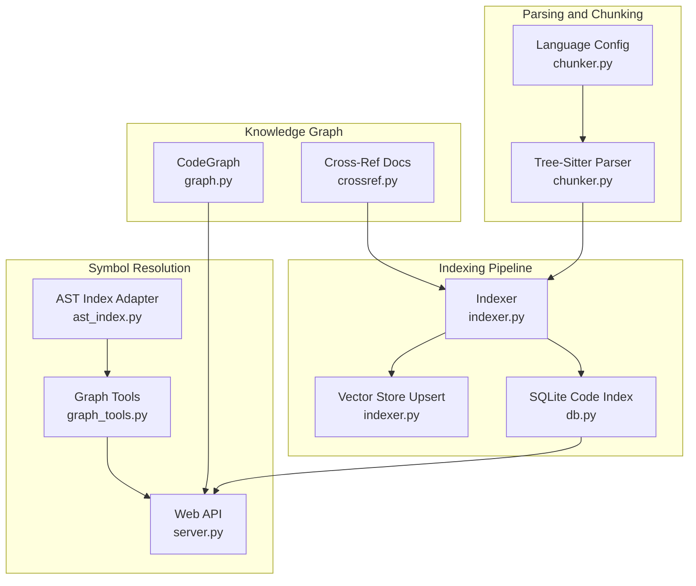
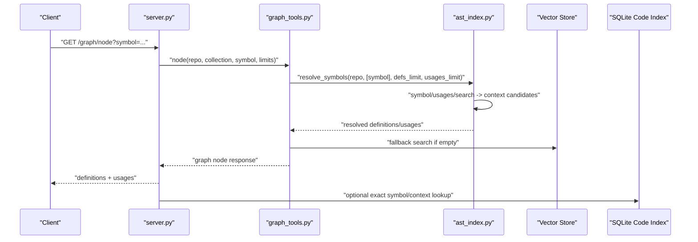
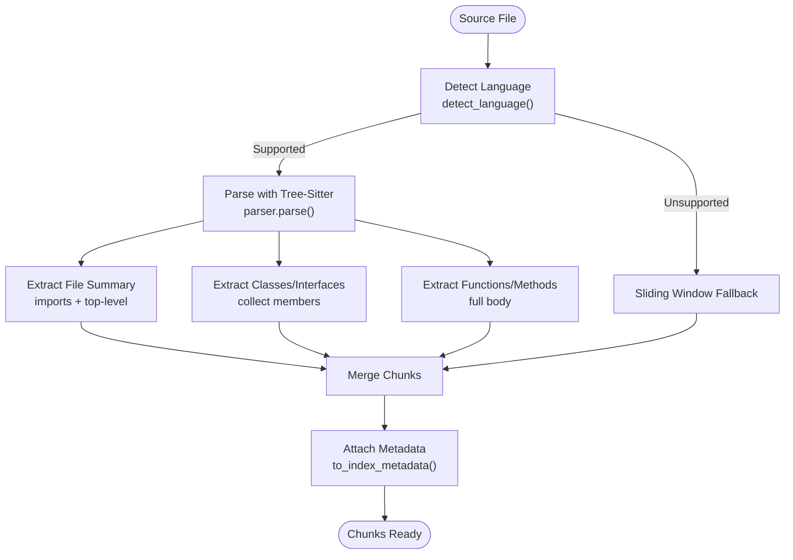
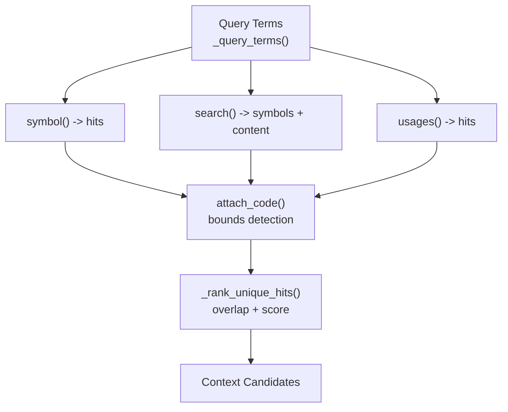
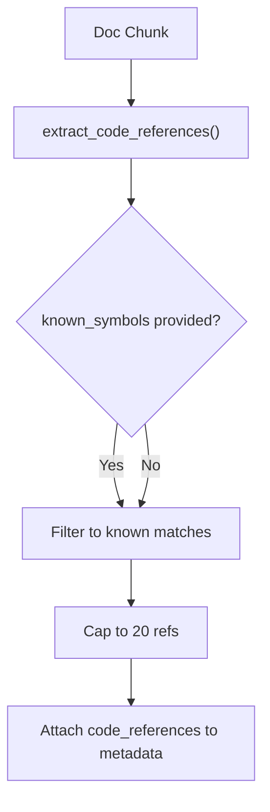
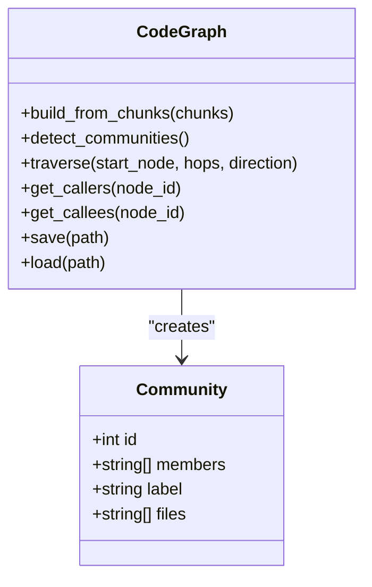
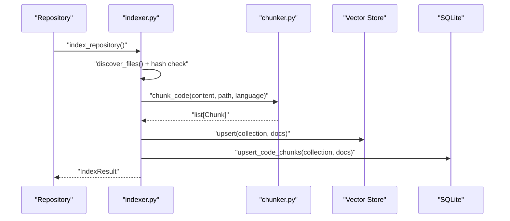
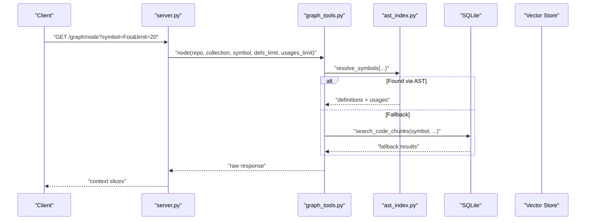
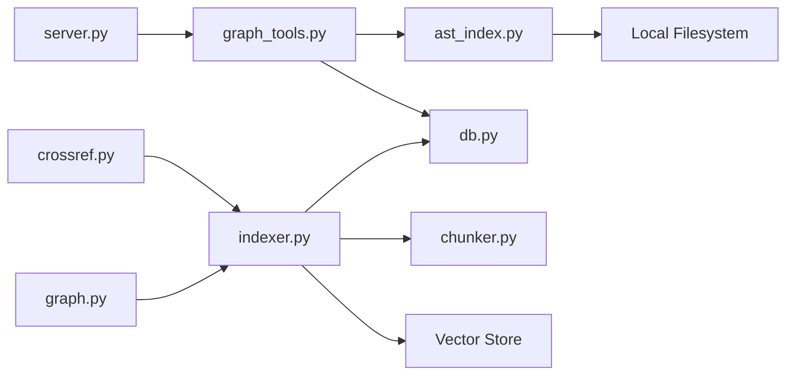

# AST Parsing and Symbol Resolution

<cite>
**Referenced Files in This Document**
- [ast_index.py](file://src/rag/core/ast_index.py)
- [chunker.py](file://src/rag/core/chunker.py)
- [indexer.py](file://src/rag/core/indexer.py)
- [crossref.py](file://src/rag/core/crossref.py)
- [graph.py](file://src/rag/core/graph.py)
- [graph_tools.py](file://src/rag/core/graph_tools.py)
- [config.py](file://src/rag/config.py)
- [default.toml](file://config/default.toml)
- [server.py](file://src/rag/server.py)
- [query.py](file://src/rag/core/query.py)
- [db.py](file://src/rag/storage/db.py)
</cite>

## Table of Contents
1. [Introduction](#introduction)
2. [Project Structure](#project-structure)
3. [Core Components](#core-components)
4. [Architecture Overview](#architecture-overview)
5. [Detailed Component Analysis](#detailed-component-analysis)
6. [Dependency Analysis](#dependency-analysis)
7. [Performance Considerations](#performance-considerations)
8. [Troubleshooting Guide](#troubleshooting-guide)
9. [Conclusion](#conclusion)
10. [Appendices](#appendices)

## Introduction
This document explains the Abstract Syntax Tree (AST)-based parsing and symbol resolution system used for precise developer navigation and retrieval. It covers:
- Tree-Sitter integration for multi-language code parsing and chunking
- AST index construction and symbol extraction
- Scope resolution and cross-reference mapping
- Symbol database creation and relationship mapping
- Query optimization and configuration options
- Practical examples, troubleshooting, and performance tuning for large codebases

## Project Structure
The AST and symbol resolution pipeline spans several modules:
- Tree-Sitter-based chunking and language detection
- AST index adapter for external CLI
- Indexing pipeline integrating chunking, metadata enrichment, and vector store upsert
- Cross-reference extraction for docs-to-code mapping
- Knowledge graph construction and traversal
- Web API integration for symbol queries

**Diagram sources**
- [chunker.py:385-444](file://src/rag/core/chunker.py#L385-L444)
- [indexer.py:242-550](file://src/rag/core/indexer.py#L242-L550)
- [ast_index.py:112-146](file://src/rag/core/ast_index.py#L112-L146)
- [graph_tools.py:43-118](file://src/rag/core/graph_tools.py#L43-L118)
- [server.py:1763-1795](file://src/rag/server.py#L1763-L1795)
- [crossref.py:41-76](file://src/rag/core/crossref.py#L41-L76)
- [db.py:136-152](file://src/rag/storage/db.py#L136-L152)
- [graph.py:47-92](file://src/rag/core/graph.py#L47-L92)

**Section sources**
- [chunker.py:190-300](file://src/rag/core/chunker.py#L190-L300)
- [indexer.py:242-550](file://src/rag/core/indexer.py#L242-L550)
- [ast_index.py:1-75](file://src/rag/core/ast_index.py#L1-L75)
- [graph_tools.py:43-118](file://src/rag/core/graph_tools.py#L43-L118)
- [crossref.py:1-90](file://src/rag/core/crossref.py#L1-L90)
- [db.py:136-152](file://src/rag/storage/db.py#L136-L152)
- [graph.py:29-129](file://src/rag/core/graph.py#L29-L129)

## Core Components
- Tree-Sitter-based chunker: Parses source files into structured chunks (file/class/function) and attaches language-specific metadata. See [chunker.py:385-444](file://src/rag/core/chunker.py#L385-L444).
- AST index adapter: Wraps an external CLI to perform fast, AST-aware symbol and usage lookups, returning context candidates. See [ast_index.py:112-146](file://src/rag/core/ast_index.py#L112-L146).
- Indexing pipeline: Discovers files, chunks code, enriches metadata, upserts to vector store, and maintains a SQLite code index. See [indexer.py:242-550](file://src/rag/core/indexer.py#L242-L550).
- Cross-reference extractor: Detects code references in documentation and augments doc chunks with code_references metadata. See [crossref.py:41-76](file://src/rag/core/crossref.py#L41-L76).
- Knowledge graph: Builds a directed graph from chunk metadata and supports traversal and community detection. See [graph.py:47-92](file://src/rag/core/graph.py#L47-L92).
- Web API: Exposes symbol resolution endpoints backed by graph tools and AST index. See [server.py:1763-1795](file://src/rag/server.py#L1763-L1795).

**Section sources**
- [chunker.py:385-444](file://src/rag/core/chunker.py#L385-L444)
- [ast_index.py:112-146](file://src/rag/core/ast_index.py#L112-L146)
- [indexer.py:242-550](file://src/rag/core/indexer.py#L242-L550)
- [crossref.py:41-76](file://src/rag/core/crossref.py#L41-L76)
- [graph.py:47-92](file://src/rag/core/graph.py#L47-L92)
- [server.py:1763-1795](file://src/rag/server.py#L1763-L1795)

## Architecture Overview
The system integrates Tree-Sitter parsing, AST index lookups, and a knowledge graph to enable precise symbol queries and navigation.

**Diagram sources**
- [server.py:1763-1795](file://src/rag/server.py#L1763-L1795)
- [graph_tools.py:43-65](file://src/rag/core/graph_tools.py#L43-L65)
- [ast_index.py:112-146](file://src/rag/core/ast_index.py#L112-L146)
- [db.py:136-152](file://src/rag/storage/db.py#L136-L152)

## Detailed Component Analysis

### Tree-Sitter Integration and Chunking
- Language detection and parser selection are configured per language with grammar modules and node field mappings. See [chunker.py:190-300](file://src/rag/core/chunker.py#L190-L300).
- Three-tier chunking strategy:
  - File summary: imports and top-level declarations
  - Class/Interface summary: class signature plus member signatures
  - Function/Method detail: full body with contextual header
  See [chunker.py:385-444](file://src/rag/core/chunker.py#L385-L444).
- Fallback sliding window chunking for unsupported languages. See [chunker.py:588-613](file://src/rag/core/chunker.py#L588-L613).
- Chunk metadata includes file_path, language, chunk_type, name, parent_name, start_line, end_line, content_hash, and enriched features. See [chunker.py:70-81](file://src/rag/core/chunker.py#L70-L81).

**Diagram sources**
- [chunker.py:385-444](file://src/rag/core/chunker.py#L385-L444)
- [chunker.py:588-613](file://src/rag/core/chunker.py#L588-L613)
- [chunker.py:70-81](file://src/rag/core/chunker.py#L70-L81)

**Section sources**
- [chunker.py:190-300](file://src/rag/core/chunker.py#L190-L300)
- [chunker.py:385-444](file://src/rag/core/chunker.py#L385-L444)
- [chunker.py:588-613](file://src/rag/core/chunker.py#L588-L613)
- [chunker.py:70-81](file://src/rag/core/chunker.py#L70-L81)

### AST Index Construction and Symbol Extraction
- The adapter wraps an external CLI to:
  - Retrieve symbol definitions and usages
  - Search symbols and content matches
  - Traverse call trees and collect callers
  See [ast_index.py:149-231](file://src/rag/core/ast_index.py#L149-L231).
- Context extraction:
  - For symbol hits, expands to function/class boundaries
  - For usage hits, finds enclosing function/class within a window
  See [ast_index.py:511-594](file://src/rag/core/ast_index.py#L511-L594).
- Ranking and de-duplication:
  - Scores adjusted by line count, override markers, and deprecation
  - Overlap-based de-duplication across files and line ranges
  See [ast_index.py:277-285](file://src/rag/core/ast_index.py#L277-L285) and [ast_index.py:555-564](file://src/rag/core/ast_index.py#L555-L564).

**Diagram sources**
- [ast_index.py:77-109](file://src/rag/core/ast_index.py#L77-L109)
- [ast_index.py:439-508](file://src/rag/core/ast_index.py#L439-L508)
- [ast_index.py:511-594](file://src/rag/core/ast_index.py#L511-L594)
- [ast_index.py:277-285](file://src/rag/core/ast_index.py#L277-L285)

**Section sources**
- [ast_index.py:77-109](file://src/rag/core/ast_index.py#L77-L109)
- [ast_index.py:149-231](file://src/rag/core/ast_index.py#L149-L231)
- [ast_index.py:439-508](file://src/rag/core/ast_index.py#L439-L508)
- [ast_index.py:511-594](file://src/rag/core/ast_index.py#L511-L594)
- [ast_index.py:277-285](file://src/rag/core/ast_index.py#L277-L285)

### Scope Resolution and Cross-Reference Mapping
- Scope resolution:
  - Symbol bounds detection uses heuristics for class/function start/end and brace balancing
  - Usage bounds expand upward to locate enclosing declarations
  See [ast_index.py:567-594](file://src/rag/core/ast_index.py#L567-L594) and [ast_index.py:539-552](file://src/rag/core/ast_index.py#L539-L552).
- Cross-reference mapping:
  - Extract code references from documentation text using regex patterns
  - Optionally filter references against known code symbols
  See [crossref.py:29-76](file://src/rag/core/crossref.py#L29-L76).
- Known symbol collection:
  - Aggregates names and qualified names from indexed code chunks
  See [crossref.py:65-76](file://src/rag/core/crossref.py#L65-L76).

**Diagram sources**
- [crossref.py:29-76](file://src/rag/core/crossref.py#L29-L76)

**Section sources**
- [ast_index.py:539-594](file://src/rag/core/ast_index.py#L539-L594)
- [crossref.py:29-76](file://src/rag/core/crossref.py#L29-L76)

### Symbol Database Creation and Relationship Mapping
- SQLite code index:
  - Ensures exact/lexical code index tables and indices for fast symbol and context lookup
  - Mirrors indexed chunks into SQLite for fallback retrieval
  See [db.py:136-152](file://src/rag/storage/db.py#L136-L152).
- Knowledge graph:
  - Nodes represent symbols with attributes derived from chunk metadata
  - Edges encode calls, references, inheritance, and imports
  - Community detection via Louvain clustering
  See [graph.py:47-92](file://src/rag/core/graph.py#L47-L92) and [graph.py:93-129](file://src/rag/core/graph.py#L93-L129).

**Diagram sources**
- [graph.py:39-129](file://src/rag/core/graph.py#L39-L129)

**Section sources**
- [db.py:136-152](file://src/rag/storage/db.py#L136-L152)
- [graph.py:47-92](file://src/rag/core/graph.py#L47-L92)
- [graph.py:93-129](file://src/rag/core/graph.py#L93-L129)

### Integration Between AST Parsing and Chunking
- The indexing pipeline:
  - Discovers files (optionally scoped to selected languages)
  - Chunks code via Tree-Sitter
  - Enriches metadata (e.g., patterns, coroutines, interfaces)
  - Upserts to vector store and mirrors to SQLite
  See [indexer.py:242-550](file://src/rag/core/indexer.py#L242-L550).
- Chunk metadata is transformed into indexable payloads and used downstream for graph building and symbol queries. See [chunker.py:70-81](file://src/rag/core/chunker.py#L70-L81).

**Diagram sources**
- [indexer.py:242-550](file://src/rag/core/indexer.py#L242-L550)
- [chunker.py:385-444](file://src/rag/core/chunker.py#L385-L444)
- [db.py:136-152](file://src/rag/storage/db.py#L136-L152)

**Section sources**
- [indexer.py:242-550](file://src/rag/core/indexer.py#L242-L550)
- [chunker.py:385-444](file://src/rag/core/chunker.py#L385-L444)
- [db.py:136-152](file://src/rag/storage/db.py#L136-L152)

### Query Optimization and Web API
- Web endpoint for symbol resolution:
  - Calls graph_tools.node() which resolves symbols via ast_index and falls back to SQLite/Qdrant
  - Converts context candidates to context slices for response
  See [server.py:1763-1795](file://src/rag/server.py#L1763-L1795) and [graph_tools.py:43-65](file://src/rag/core/graph_tools.py#L43-L65).
- Query expansion and decomposition:
  - Expands queries with domain-specific synonyms
  - Decomposes compound queries into sub-queries
  See [query.py:31-52](file://src/rag/core/query.py#L31-L52).

**Diagram sources**
- [server.py:1763-1795](file://src/rag/server.py#L1763-L1795)
- [graph_tools.py:43-65](file://src/rag/core/graph_tools.py#L43-L65)
- [ast_index.py:112-146](file://src/rag/core/ast_index.py#L112-L146)
- [db.py:136-152](file://src/rag/storage/db.py#L136-L152)

**Section sources**
- [server.py:1763-1795](file://src/rag/server.py#L1763-L1795)
- [graph_tools.py:43-65](file://src/rag/core/graph_tools.py#L43-L65)
- [query.py:31-52](file://src/rag/core/query.py#L31-L52)

## Dependency Analysis
- Coupling:
  - ast_index.py depends on an external CLI and local file system to attach code context
  - graph_tools.py orchestrates symbol resolution and falls back to SQLite/Qdrant
  - indexer.py coordinates chunking, metadata enrichment, and upserts
  - crossref.py depends on regex patterns and known symbol sets
  - graph.py depends on NetworkX and persists to disk
- Cohesion:
  - Each module encapsulates a focused responsibility: parsing, indexing, symbol resolution, graph building, and API exposure

**Diagram sources**
- [ast_index.py:340-387](file://src/rag/core/ast_index.py#L340-L387)
- [graph_tools.py:43-118](file://src/rag/core/graph_tools.py#L43-L118)
- [indexer.py:242-550](file://src/rag/core/indexer.py#L242-L550)
- [crossref.py:41-76](file://src/rag/core/crossref.py#L41-L76)
- [graph.py:47-92](file://src/rag/core/graph.py#L47-L92)
- [server.py:1763-1795](file://src/rag/server.py#L1763-L1795)

**Section sources**
- [ast_index.py:340-387](file://src/rag/core/ast_index.py#L340-L387)
- [graph_tools.py:43-118](file://src/rag/core/graph_tools.py#L43-L118)
- [indexer.py:242-550](file://src/rag/core/indexer.py#L242-L550)
- [crossref.py:41-76](file://src/rag/core/crossref.py#L41-L76)
- [graph.py:47-92](file://src/rag/core/graph.py#L47-L92)
- [server.py:1763-1795](file://src/rag/server.py#L1763-L1795)

## Performance Considerations
- Chunk sizing and limits:
  - Tune max_chunk_chars to balance retrieval precision and embedding cost. See [config.py:83-90](file://src/rag/config.py#L83-L90) and [default.toml:28-31](file://config/default.toml#L28-L31).
- Batch processing:
  - Indexer batches chunks and uses a thread pool for chunking to avoid blocking the event loop. See [indexer.py:424-476](file://src/rag/core/indexer.py#L424-L476).
- De-duplication and ranking:
  - Overlap-based de-duplication and score adjustments reduce redundant context. See [ast_index.py:277-285](file://src/rag/core/ast_index.py#L277-L285) and [ast_index.py:326-337](file://src/rag/core/ast_index.py#L326-L337).
- Query expansion:
  - Expand queries with domain synonyms to improve recall without sacrificing precision. See [query.py:31-44](file://src/rag/core/query.py#L31-L44).
- LSP enrichment:
  - Optional LSP enrichment can be toggled via settings. See [config.py:112-116](file://src/rag/config.py#L112-L116) and [indexer.py:380-383](file://src/rag/core/indexer.py#L380-L383).

[No sources needed since this section provides general guidance]

## Troubleshooting Guide
- External CLI availability:
  - If the ast-index binary is unavailable, symbol resolution returns empty lists and falls back to SQLite/Qdrant. See [ast_index.py:73-74](file://src/rag/core/ast_index.py#L73-L74) and [graph_tools.py:57-59](file://src/rag/core/graph_tools.py#L57-L59).
- Command failures and timeouts:
  - Subprocess calls log debug messages on failure or timeout; inspect logs for stderr and return codes. See [ast_index.py:340-364](file://src/rag/core/ast_index.py#L340-L364) and [ast_index.py:367-387](file://src/rag/core/ast_index.py#L367-L387).
- JSON parsing errors:
  - If ast-index output is not valid JSON, the adapter logs and returns None. See [ast_index.py:360-364](file://src/rag/core/ast_index.py#L360-L364).
- Index state and locks:
  - Per-repo advisory locks prevent concurrent index runs; failures indicate another process is running. See [indexer.py:54-99](file://src/rag/core/indexer.py#L54-L99).
- SQLite code index:
  - Ensure the code index is initialized and upserted for exact symbol lookups. See [db.py:136-152](file://src/rag/storage/db.py#L136-L152).

**Section sources**
- [ast_index.py:73-74](file://src/rag/core/ast_index.py#L73-L74)
- [graph_tools.py:57-59](file://src/rag/core/graph_tools.py#L57-L59)
- [ast_index.py:340-364](file://src/rag/core/ast_index.py#L340-L364)
- [ast_index.py:367-387](file://src/rag/core/ast_index.py#L367-L387)
- [indexer.py:54-99](file://src/rag/core/indexer.py#L54-L99)
- [db.py:136-152](file://src/rag/storage/db.py#L136-L152)

## Conclusion
The AST parsing and symbol resolution system combines Tree-Sitter-based chunking, an external AST index adapter, and a knowledge graph to deliver precise, fast developer navigation. Configuration options allow tuning chunk sizes, retrieval limits, and LSP enrichment. The pipeline integrates seamlessly with vector stores and SQLite for hybrid retrieval, while cross-reference mapping enhances cross-modal search between documentation and code.

[No sources needed since this section summarizes without analyzing specific files]

## Appendices

### Configuration Options
- Index settings:
  - max_chunk_chars: maximum characters per chunk
  - retrieval_top_k: number of top results for retrieval
  - skip_dirs: directories to exclude from scanning
  See [config.py:83-90](file://src/rag/config.py#L83-L90) and [default.toml:28-31](file://config/default.toml#L28-L31).
- LSP settings:
  - enabled, auto_detect, timeout
  See [config.py:112-116](file://src/rag/config.py#L112-L116) and [default.toml:37-41](file://config/default.toml#L37-L41).

**Section sources**
- [config.py:83-90](file://src/rag/config.py#L83-L90)
- [default.toml:28-31](file://config/default.toml#L28-L31)
- [config.py:112-116](file://src/rag/config.py#L112-L116)
- [default.toml:37-41](file://config/default.toml#L37-L41)

### Practical Examples
- Resolving a symbol:
  - Call the web endpoint with a symbol and limits; the system returns definitions and usages with context slices. See [server.py:1763-1795](file://src/rag/server.py#L1763-L1795).
- Query expansion:
  - Use domain-specific synonyms to improve recall. See [query.py:31-44](file://src/rag/core/query.py#L31-L44).
- Building the knowledge graph:
  - After indexing, the graph is built from chunk payloads and communities are detected. See [indexer.py:553-616](file://src/rag/core/indexer.py#L553-L616) and [graph.py:93-129](file://src/rag/core/graph.py#L93-L129).

**Section sources**
- [server.py:1763-1795](file://src/rag/server.py#L1763-L1795)
- [query.py:31-44](file://src/rag/core/query.py#L31-L44)
- [indexer.py:553-616](file://src/rag/core/indexer.py#L553-L616)
- [graph.py:93-129](file://src/rag/core/graph.py#L93-L129)