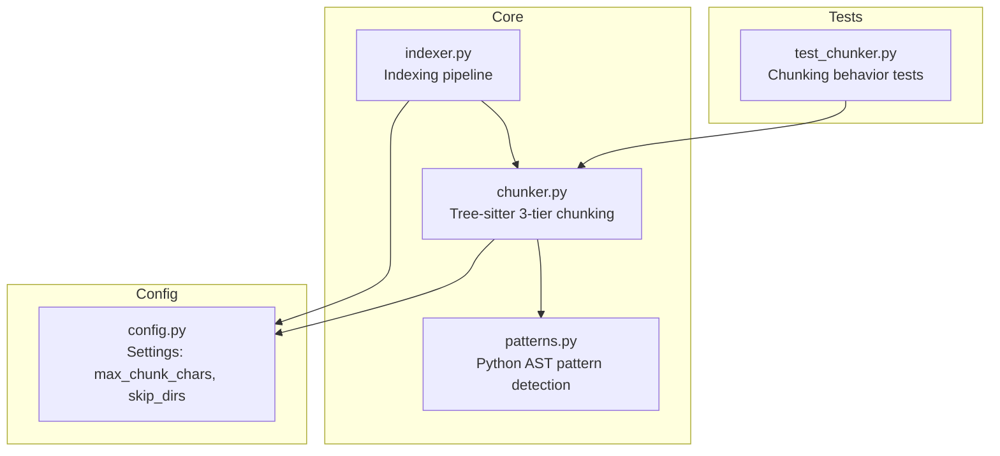
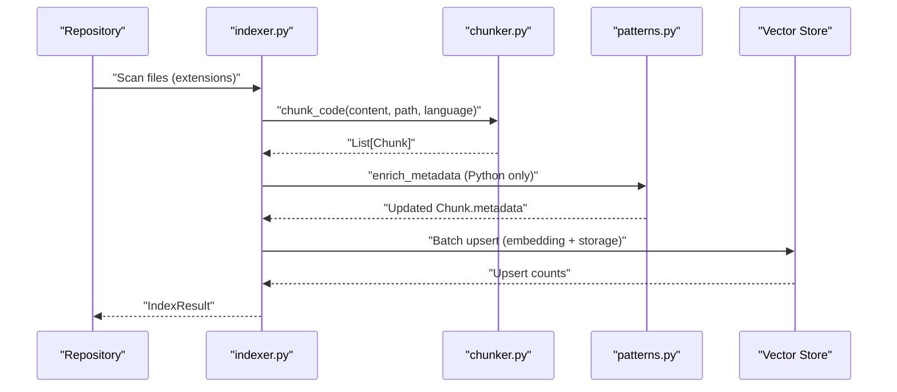
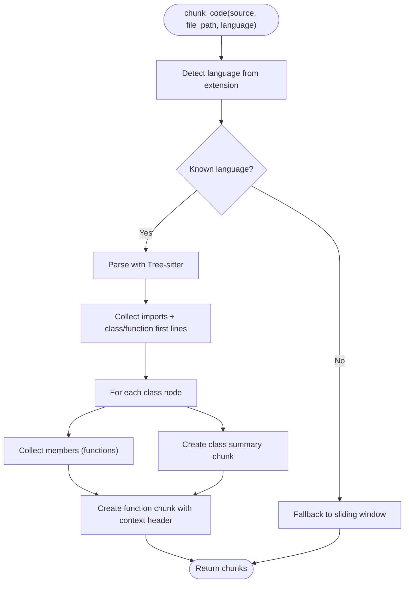
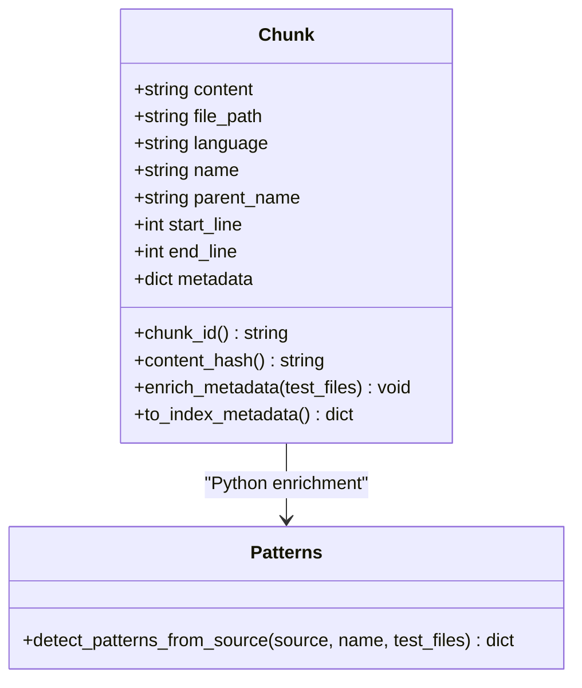
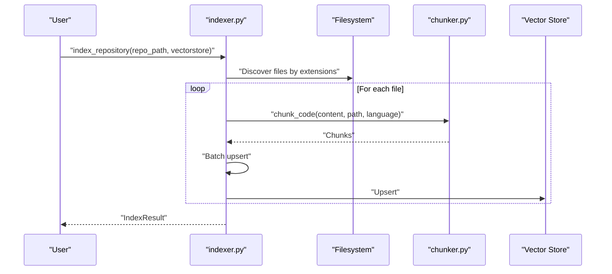
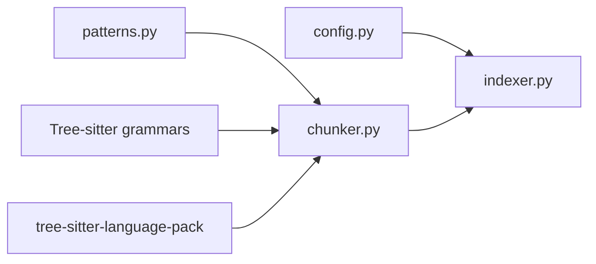

# Code Chunking and Processing

<cite>
**Referenced Files in This Document**
- [chunker.py](file://src/rag/core/chunker.py)
- [indexer.py](file://src/rag/core/indexer.py)
- [patterns.py](file://src/rag/core/patterns.py)
- [config.py](file://src/rag/config.py)
- [test_chunker.py](file://tests/test_chunker.py)
</cite>

## Table of Contents
1. [Introduction](#introduction)
2. [Project Structure](#project-structure)
3. [Core Components](#core-components)
4. [Architecture Overview](#architecture-overview)
5. [Detailed Component Analysis](#detailed-component-analysis)
6. [Dependency Analysis](#dependency-analysis)
7. [Performance Considerations](#performance-considerations)
8. [Troubleshooting Guide](#troubleshooting-guide)
9. [Conclusion](#conclusion)
10. [Appendices](#appendices)

## Introduction
This document explains the code chunking and processing system that powers semantic indexing of source code and documentation. It covers the three-tier chunking approach (file-level, class-level, and function-level), language-specific strategies for Python, TypeScript/JavaScript, Go, Rust, Java, Kotlin, C/C++, and Dart/Flutter, and the metadata enrichment pipeline. It also documents chunk ID generation, content preprocessing, encoding handling, configuration options for chunk size and overlap, and practical workflows and troubleshooting tips.

## Project Structure
The chunking system centers around a dedicated core module that integrates with the broader indexing pipeline:
- Chunking engine: code-aware parsing with Tree-sitter and fallback sliding window
- Metadata enrichment: language-specific flags and Python AST-based pattern detection
- Indexing pipeline: repository scanning, batching, and vector store ingestion

**Diagram sources**
- [chunker.py:385-444](file://src/rag/core/chunker.py#L385-L444)
- [patterns.py:164-349](file://src/rag/core/patterns.py#L164-L349)
- [indexer.py:424-436](file://src/rag/core/indexer.py#L424-L436)
- [config.py:83-90](file://src/rag/config.py#L83-L90)
- [test_chunker.py:1-183](file://tests/test_chunker.py#L1-L183)

**Section sources**
- [chunker.py:1-622](file://src/rag/core/chunker.py#L1-L622)
- [indexer.py:1-740](file://src/rag/core/indexer.py#L1-L740)
- [config.py:1-194](file://src/rag/config.py#L1-L194)
- [test_chunker.py:1-183](file://tests/test_chunker.py#L1-L183)

## Core Components
- Chunker: Implements the three-tier strategy, Tree-sitter parsing, and fallback sliding window.
- Patterns: Provides Python-specific metadata enrichment (design patterns, complexity, concurrency).
- Indexer: Orchestrates discovery, chunking, enrichment, batching, and vector store upsert.
- Config: Exposes chunk size limits and skip directories.

Key responsibilities:
- Three-tier chunking: file summary, class/method signatures, function bodies with contextual headers
- Language-specific grammars via Tree-sitter
- Metadata enrichment for Python and JVM languages
- Deterministic chunk IDs and content hashes
- Encoding handling and safe fallbacks

**Section sources**
- [chunker.py:25-82](file://src/rag/core/chunker.py#L25-L82)
- [patterns.py:1-398](file://src/rag/core/patterns.py#L1-L398)
- [indexer.py:242-550](file://src/rag/core/indexer.py#L242-L550)
- [config.py:83-90](file://src/rag/config.py#L83-L90)

## Architecture Overview
The indexing pipeline discovers files, chunks them, enriches metadata, batches for embedding, and upserts into the vector store.

**Diagram sources**
- [indexer.py:424-436](file://src/rag/core/indexer.py#L424-L436)
- [chunker.py:385-444](file://src/rag/core/chunker.py#L385-L444)
- [patterns.py:164-349](file://src/rag/core/patterns.py#L164-L349)

## Detailed Component Analysis

### Three-Tier Chunking Strategy
- Tier 1 (File summary): Top-level imports and first lines of classes/functions
- Tier 2 (Class summary): Class/interface signature plus member signatures
- Tier 3 (Function detail): Full function/method body with a contextual header

**Diagram sources**
- [chunker.py:385-444](file://src/rag/core/chunker.py#L385-L444)
- [chunker.py:458-537](file://src/rag/core/chunker.py#L458-L537)

**Section sources**
- [chunker.py:385-444](file://src/rag/core/chunker.py#L385-L444)
- [chunker.py:458-537](file://src/rag/core/chunker.py#L458-L537)

### Language-Specific Strategies
Supported languages and their Tree-sitter configurations:
- Python: class definitions, function definitions, imports, decorators, docstrings
- Java/Kotlin: class/interface/enum declarations, method/constructor declarations
- TypeScript/JavaScript: class/interface declarations, function/method/arrow definitions
- Go: type declarations, function/method declarations, imports
- Rust: struct/enum/impl/trait items, function items, use declarations
- C/C++: struct/enum/union/class specifiers, function definitions, preprocessor includes
- Dart: class/mixin/extension/enum definitions, signature nodes with body attachment

Grammar selection logic:
- Standard tree-sitter-* packages for most languages
- tree-sitter-language-pack for Dart
- Special handling for TypeScript sub-language

Name resolution and body assembly:
- Name extraction via node fields or children
- Dart signature/body merging for full function content

**Section sources**
- [chunker.py:190-300](file://src/rag/core/chunker.py#L190-L300)
- [chunker.py:314-374](file://src/rag/core/chunker.py#L314-L374)
- [chunker.py:508-518](file://src/rag/core/chunker.py#L508-L518)

### Metadata Enrichment
- Python: AST-based pattern detection, complexity metrics, concurrency indicators, decorators, domains/layers, unit test detection
- JVM (Kotlin/Java): coroutine/suspend usage, singleton patterns, interfaces, async builders, annotations

**Diagram sources**
- [chunker.py:35-82](file://src/rag/core/chunker.py#L35-L82)
- [patterns.py:164-349](file://src/rag/core/patterns.py#L164-L349)

**Section sources**
- [chunker.py:58-68](file://src/rag/core/chunker.py#L58-L68)
- [patterns.py:164-349](file://src/rag/core/patterns.py#L164-L349)

### Chunk ID Generation and Content Hashing
- Deterministic chunk_id derived from file_path, start_line, end_line
- Content hashing computed from chunk content for de-duplication signals

**Section sources**
- [chunker.py:49-56](file://src/rag/core/chunker.py#L49-L56)

### Content Preprocessing and Encoding
- UTF-8 decoding of Tree-sitter node text
- Safe fallback to sliding window on parse errors
- Sliding window with configurable window and overlap lines

**Section sources**
- [chunker.py:397-403](file://src/rag/core/chunker.py#L397-L403)
- [chunker.py:588-613](file://src/rag/core/chunker.py#L588-L613)

### Configuration Options
- max_chunk_chars: maximum characters per chunk
- skip_dirs: directories to exclude from indexing
- Retrieval and reranking settings influence downstream usage

**Section sources**
- [config.py:83-90](file://src/rag/config.py#L83-L90)

### Practical Workflows
- Repository indexing: discover files by extension, chunk and enrich, batch upsert, update overview stats
- Document indexing: split markdown sections, optionally enrich with code cross-references

**Diagram sources**
- [indexer.py:242-550](file://src/rag/core/indexer.py#L242-L550)
- [chunker.py:385-444](file://src/rag/core/chunker.py#L385-L444)

**Section sources**
- [indexer.py:242-550](file://src/rag/core/indexer.py#L242-L550)

## Dependency Analysis
- chunker.py depends on Tree-sitter grammars and language pack for Dart
- patterns.py depends on Python AST for enrichment
- indexer.py orchestrates chunking, enrichment, and vector store operations
- config.py supplies runtime settings

**Diagram sources**
- [chunker.py:314-336](file://src/rag/core/chunker.py#L314-L336)
- [patterns.py:10-12](file://src/rag/core/patterns.py#L10-L12)
- [indexer.py:17-19](file://src/rag/core/indexer.py#L17-L19)

**Section sources**
- [chunker.py:18-22](file://src/rag/core/chunker.py#L18-L22)
- [patterns.py:10-12](file://src/rag/core/patterns.py#L10-L12)
- [indexer.py:17-19](file://src/rag/core/indexer.py#L17-L19)

## Performance Considerations
- Tree-sitter parsing is CPU-bound; chunking runs in a thread pool to avoid blocking the event loop
- Batch size tuned to embedding throughput
- Sliding window fallback ensures robustness for unparsable content
- Chunk size capped by configuration to balance recall and embedding costs

**Section sources**
- [indexer.py:441-444](file://src/rag/core/indexer.py#L441-L444)
- [config.py:83-90](file://src/rag/config.py#L83-L90)

## Troubleshooting Guide
Common issues and resolutions:
- Unknown language or missing grammar: falls back to sliding window chunking
- Parse failures: warning logged, content chunked via sliding window
- Chunk ID determinism: ensure identical file_path/start_line/end_line produce identical IDs
- Content hash length: content_hash property returns fixed-length hash
- Metadata method availability: to_index_metadata must remain a Chunk method

Validation references:
- Unknown language fallback behavior
- Deterministic chunk_id and content_hash
- to_index_metadata method presence and correctness

**Section sources**
- [chunker.py:389-403](file://src/rag/core/chunker.py#L389-L403)
- [chunker.py:58-68](file://src/rag/core/chunker.py#L58-L68)
- [test_chunker.py:121-158](file://tests/test_chunker.py#L121-L158)

## Conclusion
The chunking system combines code-aware parsing with pragmatic fallbacks, producing structured, enriched chunks suitable for semantic retrieval. The three-tier strategy captures context at multiple granularities, while language-specific adaptations and metadata enrichment improve recall and relevance. Configuration enables tuning for different repositories and embedding budgets.

## Appendices

### Language Support Matrix
- Python: AST-based enrichment, design patterns, complexity
- TypeScript/JavaScript: class/interface/function definitions
- Go: type/function/method declarations
- Rust: struct/enum/impl/trait/function
- Java/Kotlin: class/interface/enum declarations, coroutine/singleton detection
- C/C++: struct/enum/union/class specifiers, function definitions
- Dart: class/mixin/extension/enum, signature-body merging

**Section sources**
- [chunker.py:190-300](file://src/rag/core/chunker.py#L190-L300)
- [chunker.py:127-187](file://src/rag/core/chunker.py#L127-L187)
- [patterns.py:164-349](file://src/rag/core/patterns.py#L164-L349)

### Configuration Reference
- max_chunk_chars: controls chunk size cap
- skip_dirs: directories excluded from discovery

**Section sources**
- [config.py:83-90](file://src/rag/config.py#L83-L90)