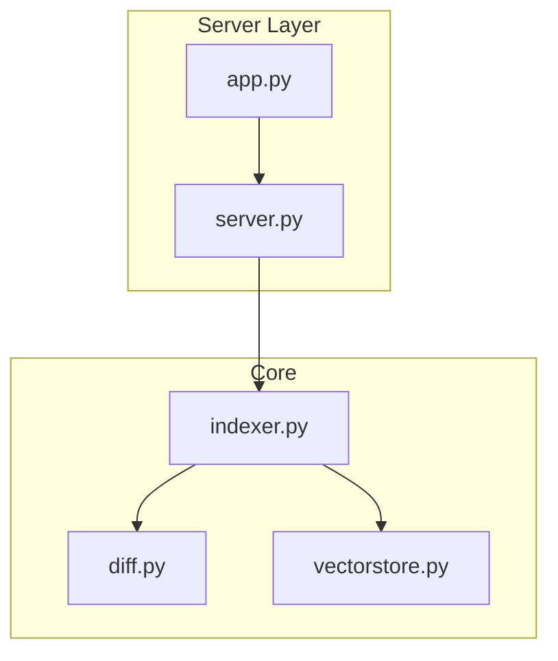
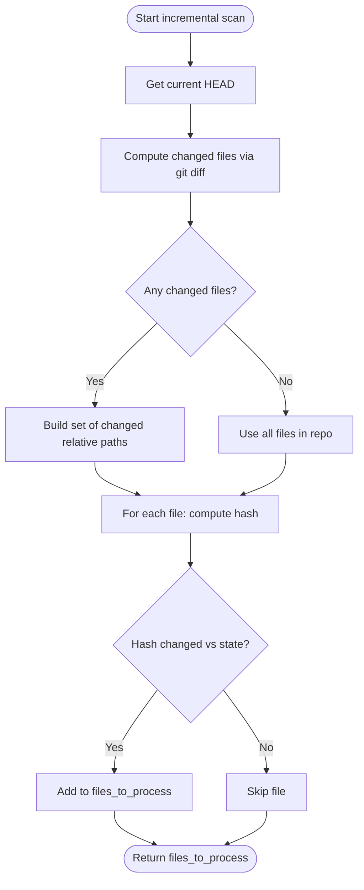
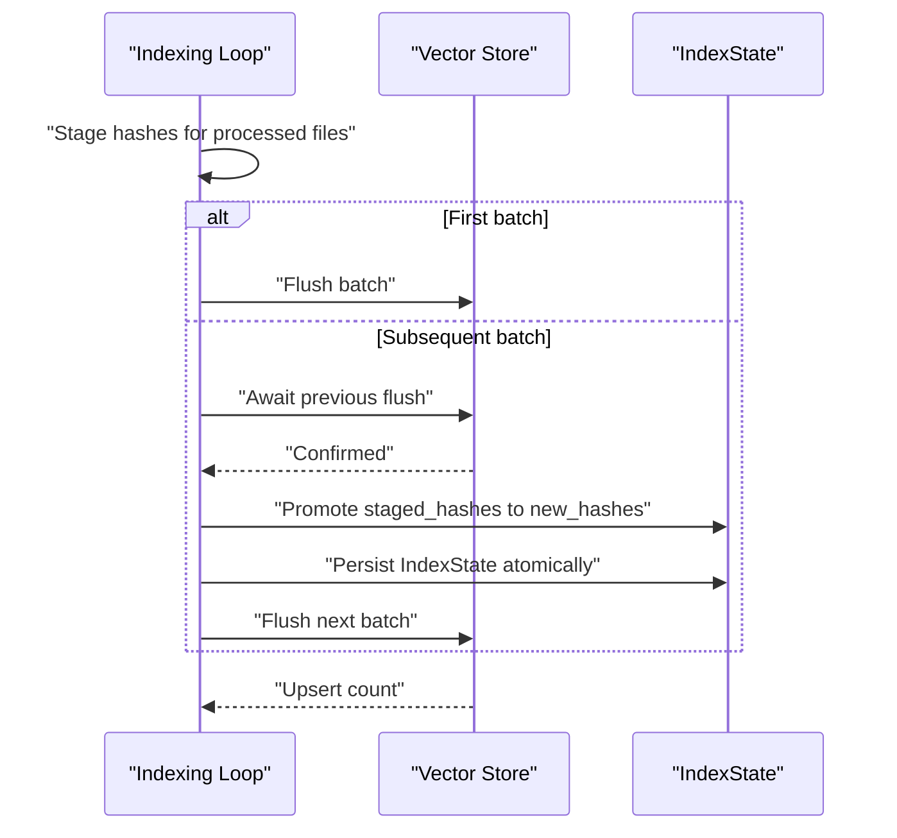
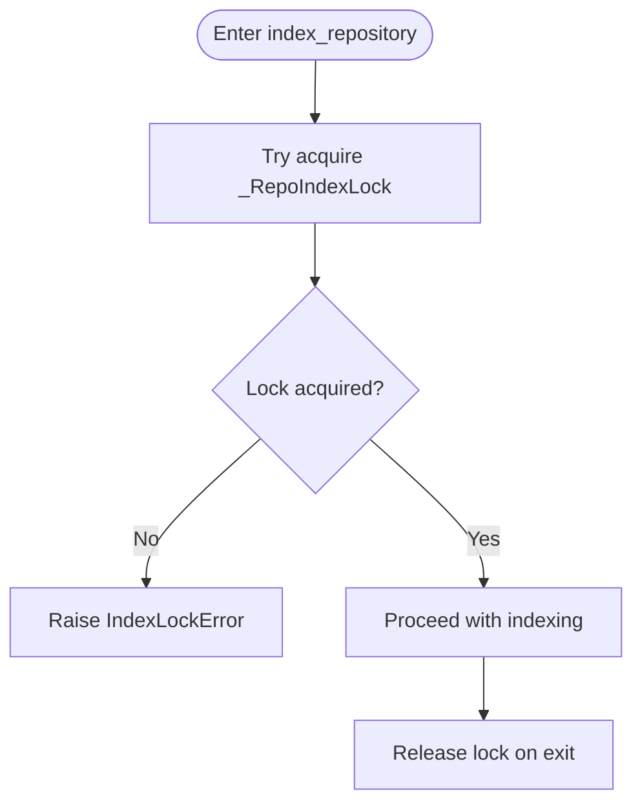
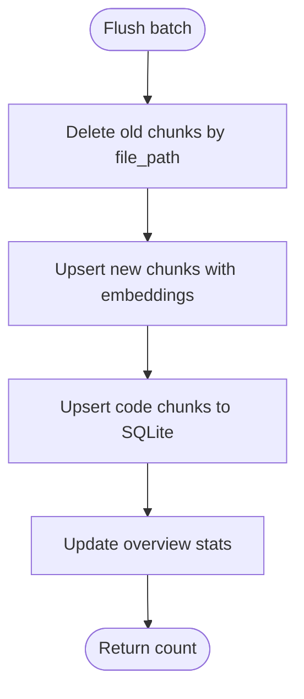
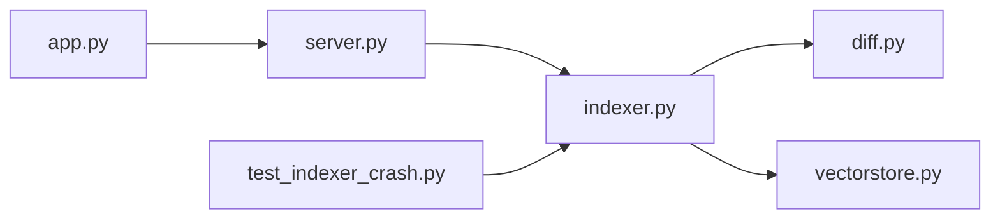

# Incremental Updates and Change Detection

<cite>
**Referenced Files in This Document**
- [indexer.py](file://src/rag/core/indexer.py)
- [diff.py](file://src/rag/core/diff.py)
- [vectorstore.py](file://src/rag/core/vectorstore.py)
- [test_indexer_crash.py](file://tests/test_indexer_crash.py)
- [server.py](file://src/rag/server.py)
- [app.py](file://src/rag/app.py)
</cite>

## Table of Contents
1. [Introduction](#introduction)
2. [Project Structure](#project-structure)
3. [Core Components](#core-components)
4. [Architecture Overview](#architecture-overview)
5. [Detailed Component Analysis](#detailed-component-analysis)
6. [Dependency Analysis](#dependency-analysis)
7. [Performance Considerations](#performance-considerations)
8. [Troubleshooting Guide](#troubleshooting-guide)
9. [Conclusion](#conclusion)

## Introduction
This document explains the incremental update and change detection system used to efficiently index repositories. It covers:
- Git-based change detection via commit history comparison and file hash verification
- IndexState management for tracking processed files and maintaining consistency across runs
- Crash-consistent indexing with staged and pending file hashes to ensure atomic state updates
- Batch processing strategy with thread pool execution for CPU-intensive chunking operations
- Lock management preventing concurrent indexing operations on the same repository
- Practical workflows, conflict resolution, and performance tuning for frequently changing repositories

## Project Structure
The incremental indexing pipeline spans several modules:
- Core indexing engine and state management
- Git diff utilities for change detection
- Vector store integration for upsert and delete operations
- Server and TUI for job orchestration and progress reporting



**Diagram sources**
- [indexer.py](file://src/rag/core/indexer.py)
- [diff.py](file://src/rag/core/diff.py)
- [vectorstore.py](file://src/rag/core/vectorstore.py)
- [server.py](file://src/rag/server.py)
- [app.py](file://src/rag/app.py)

**Section sources**
- [indexer.py](file://src/rag/core/indexer.py)
- [diff.py](file://src/rag/core/diff.py)
- [vectorstore.py](file://src/rag/core/vectorstore.py)
- [server.py](file://src/rag/server.py)
- [app.py](file://src/rag/app.py)

## Core Components
- Git-based change detection: Uses commit comparisons and optional date-based ranges to discover changed files.
- File hashing: Computes short hashes per file to detect content changes outside the immediate commit diff.
- IndexState: Persists last processed commit and per-file hashes to support incremental runs.
- Locking: Advisory file locks serialize concurrent indexing on the same repository.
- Batch pipeline: Thread pool for CPU-bound chunking, async flush batches to vector store, and staged hash promotion for crash safety.

**Section sources**
- [indexer.py](file://src/rag/core/indexer.py)
- [diff.py](file://src/rag/core/diff.py)

## Architecture Overview
The incremental indexing process follows a deterministic pipeline:
- Acquire a per-repository lock
- Load IndexState from disk
- Determine current HEAD and changed files via git diff
- Compute file hashes for all files; add those differing from state
- Discover files to process; chunk in thread pool; batch and flush to vector store
- Stage hashes during batch processing; promote to committed state after successful flush
- Persist IndexState atomically

```mermaid
sequenceDiagram
participant CLI as "CLI/TUI"
participant Server as "server.py"
participant Indexer as "indexer.py"
participant Git as "Git"
participant VS as "vectorstore.py"
CLI->>Server : "Start indexing job"
Server->>Indexer : "index_repository(full=false)"
Indexer->>Indexer : "Acquire _RepoIndexLock"
Indexer->>Indexer : "Load IndexState"
Indexer->>Git : "Get HEAD and changed files"
Git-->>Indexer : "Changed files list"
Indexer->>Indexer : "Compute file hashes for all files"
Indexer->>Indexer : "Select files_to_process"
loop For each file
Indexer->>Indexer : "Thread pool chunk + enrich"
Indexer->>Indexer : "Batch docs"
end
Indexer->>VS : "Flush batch (delete old + upsert)"
VS-->>Indexer : "Upsert count"
Indexer->>Indexer : "Stage hashes; await previous flush"
Indexer->>Indexer : "Promote staged to new_hashes"
Indexer->>Indexer : "Save IndexState atomically"
Indexer-->>Server : "IndexResult"
Server-->>CLI : "Progress and completion"
```

**Diagram sources**
- [indexer.py](file://src/rag/core/indexer.py)
- [vectorstore.py](file://src/rag/core/vectorstore.py)
- [server.py](file://src/rag/server.py)

## Detailed Component Analysis

### Git-Based Change Detection
Change detection combines commit history comparison with file hash verification:
- Commit diff: Queries changed files between a base commit and HEAD.
- Date-based ranges: Converts relative dates into git-log arguments to list affected files.
- File hash fallback: If a file is not in the diff but its hash differs from state, it is included to catch untracked or cached changes.



**Diagram sources**
- [indexer.py](file://src/rag/core/indexer.py)
- [diff.py](file://src/rag/core/diff.py)

**Section sources**
- [indexer.py](file://src/rag/core/indexer.py)
- [diff.py](file://src/rag/core/diff.py)

### IndexState Management and Crash Consistency
IndexState tracks:
- last_commit: The last indexed commit
- file_hashes: Mapping of relative file paths to short hashes

Crash-consistent updates use staged and pending hashes:
- staged_hashes: Newly computed hashes for files in the current batch
- pending_hashes: Staged hashes from the previous batch awaiting confirmation
- Promotion: After successful flush, staged hashes become new_hashes and persist to disk

Atomic persistence:
- Writes state to a temporary file and replaces the target file atomically



**Diagram sources**
- [indexer.py](file://src/rag/core/indexer.py)

**Section sources**
- [indexer.py](file://src/rag/core/indexer.py)
- [test_indexer_crash.py](file://tests/test_indexer_crash.py)

### Lock Management
A per-repository advisory lock prevents concurrent indexing:
- Lock file path derived from the repository path
- Exclusive flock with non-blocking semantics
- Raises a specific error when another process holds the lock



**Diagram sources**
- [indexer.py](file://src/rag/core/indexer.py)

**Section sources**
- [indexer.py](file://src/rag/core/indexer.py)

### Batch Processing and Thread Pool Execution
CPU-intensive chunking runs in a thread pool to avoid blocking the event loop:
- Thread pool task executes chunking and enrichment
- Batching aligns with vector store sub-batches for efficient upsert
- Flush pipeline deletes old chunks for changed files, then upserts new ones

```mermaid
sequenceDiagram
participant Loop as "Indexing Loop"
participant TP as "Thread Pool"
participant VS as "Vector Store"
loop Until all files processed
Loop->>TP : "Process file (chunk + enrich)"
TP-->>Loop : "ChunkDocument list"
Loop->>Loop : "Append to batch"
alt Batch ready
Loop->>VS : "Flush batch"
VS-->>Loop : "Count inserted"
end
end
```

**Diagram sources**
- [indexer.py](file://src/rag/core/indexer.py)
- [vectorstore.py](file://src/rag/core/vectorstore.py)

**Section sources**
- [indexer.py](file://src/rag/core/indexer.py)
- [vectorstore.py](file://src/rag/core/vectorstore.py)

### Vector Store Integration
The flush operation coordinates deletions and upserts:
- Deletes all chunks for each file in the current batch (incremental mode)
- Upserts new chunks with embedding caching and dimension validation
- Updates auxiliary code index and overview statistics



**Diagram sources**
- [indexer.py](file://src/rag/core/indexer.py)
- [vectorstore.py](file://src/rag/core/vectorstore.py)

**Section sources**
- [indexer.py](file://src/rag/core/indexer.py)
- [vectorstore.py](file://src/rag/core/vectorstore.py)

## Dependency Analysis
Key dependencies and interactions:
- server.py orchestrates asynchronous indexing jobs and exposes progress endpoints
- app.py provides TUI polling and status updates
- indexer.py depends on diff.py for change detection and vectorstore.py for persistence
- test_indexer_crash.py validates crash consistency invariants



**Diagram sources**
- [server.py](file://src/rag/server.py)
- [app.py](file://src/rag/app.py)
- [indexer.py](file://src/rag/core/indexer.py)
- [diff.py](file://src/rag/core/diff.py)
- [vectorstore.py](file://src/rag/core/vectorstore.py)
- [test_indexer_crash.py](file://tests/test_indexer_crash.py)

**Section sources**
- [server.py](file://src/rag/server.py)
- [app.py](file://src/rag/app.py)
- [indexer.py](file://src/rag/core/indexer.py)
- [diff.py](file://src/rag/core/diff.py)
- [vectorstore.py](file://src/rag/core/vectorstore.py)
- [test_indexer_crash.py](file://tests/test_indexer_crash.py)

## Performance Considerations
- Prefer incremental runs for frequently changing repositories to minimize work.
- Tune batch size to balance memory and network throughput; the code aligns batch sizing with downstream upsert batching.
- Offload CPU-bound chunking to thread pool to keep the event loop responsive.
- Use file hash verification to include content-changed files missed by commit diffs.
- Ensure atomic state writes to avoid costly reprocessing after partial failures.

[No sources needed since this section provides general guidance]

## Troubleshooting Guide
Common issues and resolutions:
- Concurrent indexing conflicts: If a lock error occurs, wait for the other process or remove stale lock files safely.
- Partial state after crash: The test suite verifies that only files whose chunks were actually upserted remain in state; a subsequent clean run reprocesses missing files.
- Dimension mismatches: If embedding dimensions differ from the collection, upsert fails early with an error; re-index with a full rebuild.
- No changes detected: Verify HEAD and since-commit; confirm git repository status and permissions.

**Section sources**
- [indexer.py](file://src/rag/core/indexer.py)
- [test_indexer_crash.py](file://tests/test_indexer_crash.py)
- [vectorstore.py](file://src/rag/core/vectorstore.py)

## Conclusion
The incremental indexing system combines git-based change detection with robust state management and crash-safe updates. By staging and promoting hashes, batching work, and preventing concurrent runs, it achieves reliable, efficient indexing for evolving repositories. Use the provided workflows and diagnostics to maintain consistency and optimize performance.