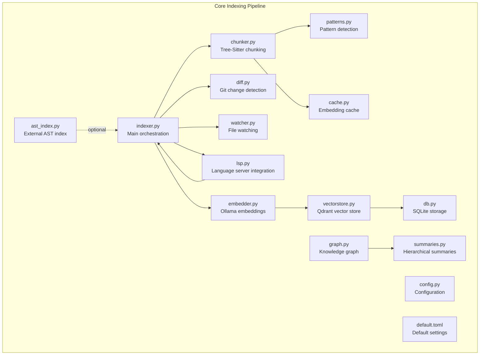
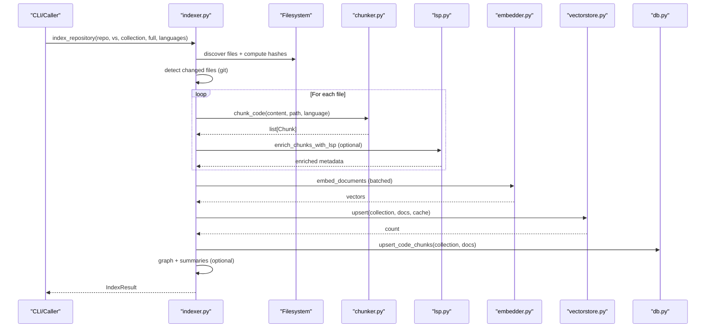
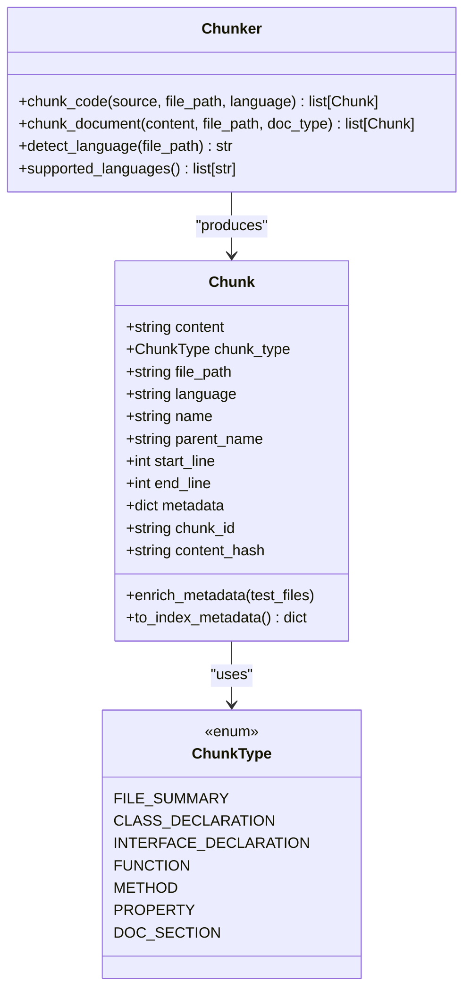
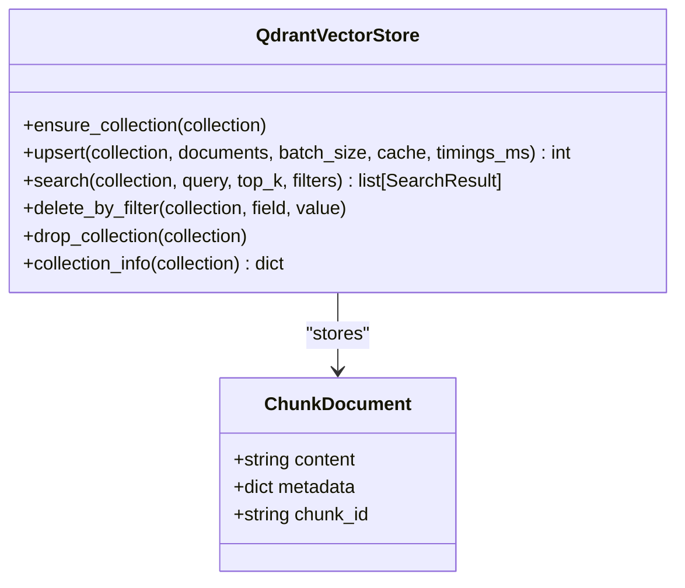
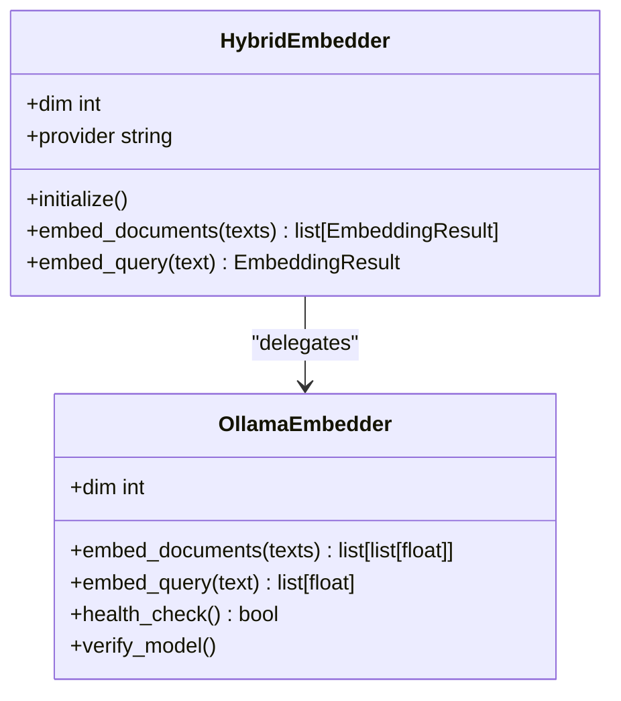
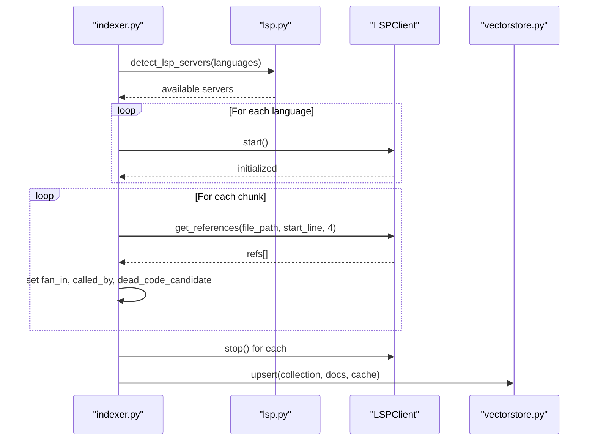
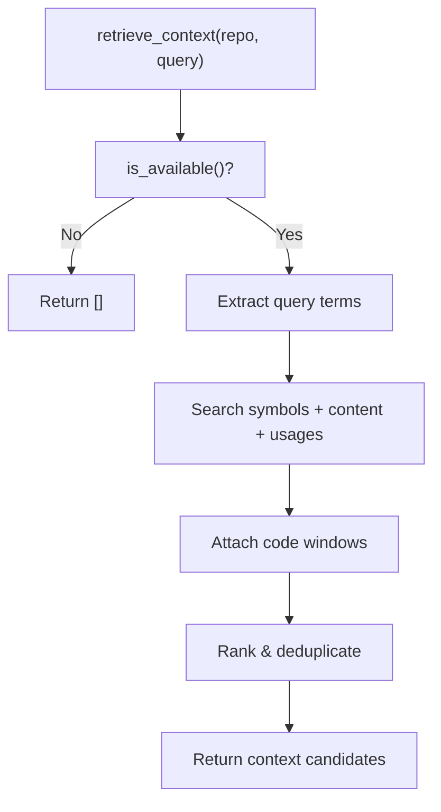
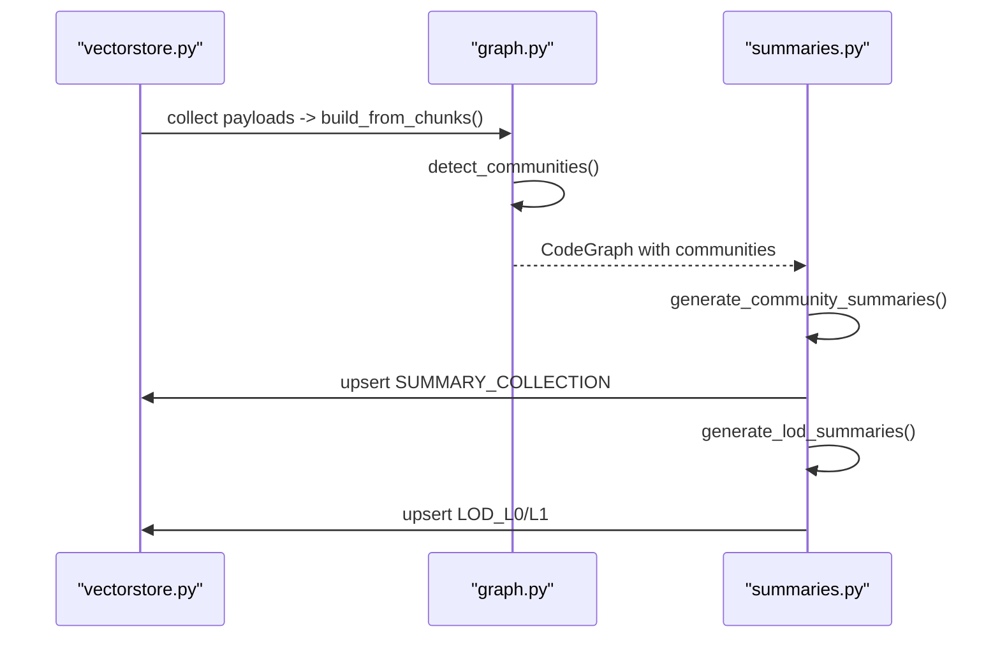
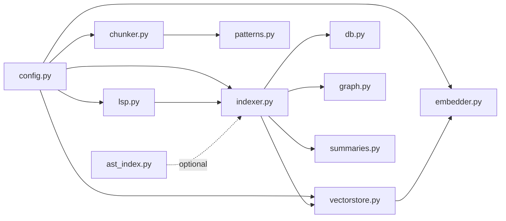

# Indexing System

<cite>
**Referenced Files in This Document**
- [indexer.py](file://src/rag/core/indexer.py)
- [chunker.py](file://src/rag/core/chunker.py)
- [ast_index.py](file://src/rag/core/ast_index.py)
- [diff.py](file://src/rag/core/diff.py)
- [watcher.py](file://src/rag/core/watcher.py)
- [config.py](file://src/rag/config.py)
- [vectorstore.py](file://src/rag/core/vectorstore.py)
- [lsp.py](file://src/rag/core/lsp.py)
- [patterns.py](file://src/rag/core/patterns.py)
- [cache.py](file://src/rag/core/cache.py)
- [db.py](file://src/rag/storage/db.py)
- [embedder.py](file://src/rag/core/embedder.py)
- [graph.py](file://src/rag/core/graph.py)
- [summaries.py](file://src/rag/core/summaries.py)
- [default.toml](file://src/rag/default.toml)
</cite>

## Update Summary
**Changes Made**
- Complete overhaul of Indexing System documentation with comprehensive coverage of all core components
- Added detailed sections on Repository Scanning, Code Chunking and Processing, AST Parsing and Symbol Resolution
- Enhanced Incremental Updates and Change Detection documentation with git-based workflows
- Expanded Real-time File Watching and Live Indexing coverage with polling mechanisms
- Updated architecture diagrams to reflect current implementation patterns
- Added comprehensive configuration and troubleshooting sections

## Table of Contents
1. [Introduction](#introduction)
2. [Project Structure](#project-structure)
3. [Core Components](#core-components)
4. [Architecture Overview](#architecture-overview)
5. [Detailed Component Analysis](#detailed-component-analysis)
6. [Repository Scanning](#repository-scanning)
7. [Code Chunking and Processing](#code-chunking-and-processing)
8. [AST Parsing and Symbol Resolution](#ast-parsing-and-symbol-resolution)
9. [Incremental Updates and Change Detection](#incremental-updates-and-change-detection)
10. [Real-time File Watching and Live Indexing](#real-time-file-watching-and-live-indexing)
11. [Dependency Analysis](#dependency-analysis)
12. [Performance Considerations](#performance-considerations)
13. [Troubleshooting Guide](#troubleshooting-guide)
14. [Conclusion](#conclusion)
15. [Appendices](#appendices)

## Introduction
This document explains the comprehensive indexing system that powers repository scanning, code-aware chunking, and incremental updates. The system provides a complete pipeline from raw code to searchable vectors with advanced features including:

- Multi-language AST parsing using Tree-Sitter for Python, TypeScript/JavaScript, Go, Rust, Java, Kotlin, C/C++, and Dart/Flutter
- Three-tier chunking (file/class/function) with code-aware context extraction
- AST index construction and symbol resolution for developer navigation
- Incremental indexing via git-based change detection and real-time file watching
- Configuration options for language-specific processing, chunk sizing, and memory management
- Dense vector embeddings with payload indexing and batched upsert operations
- Knowledge graph construction and hierarchical LOD summaries
- LSP integration for semantic enrichment and call graph analysis

The indexing system is designed for large-scale repositories with crash-consistent state management, payload indexes for efficient filtering, and optional semantic/syntactic enrichment to produce a searchable, navigable representation of codebases.

## Project Structure
The indexing system is organized around a core pipeline that orchestrates repository discovery, chunking, embedding, and persistence. The architecture emphasizes modularity with clear separation of concerns:

**Diagram sources**
- [indexer.py:242-550](file://src/rag/core/indexer.py#L242-L550)
- [chunker.py:385-444](file://src/rag/core/chunker.py#L385-L444)
- [diff.py:80-148](file://src/rag/core/diff.py#L80-L148)
- [watcher.py:18-184](file://src/rag/core/watcher.py#L18-L184)
- [vectorstore.py:199-530](file://src/rag/core/vectorstore.py#L199-L530)
- [cache.py:101-195](file://src/rag/core/cache.py#L101-L195)
- [db.py:151-251](file://src/rag/storage/db.py#L151-L251)
- [embedder.py:189-245](file://src/rag/core/embedder.py#L189-L245)
- [lsp.py:313-404](file://src/rag/core/lsp.py#L313-L404)
- [patterns.py:164-349](file://src/rag/core/patterns.py#L164-L349)
- [ast_index.py:77-110](file://src/rag/core/ast_index.py#L77-L110)
- [graph.py:39-267](file://src/rag/core/graph.py#L39-L267)
- [summaries.py:71-149](file://src/rag/core/summaries.py#L71-L149)
- [config.py:83-131](file://src/rag/config.py#L83-L131)
- [default.toml:28-41](file://src/rag/default.toml#L28-L41)

**Section sources**
- [indexer.py:242-550](file://src/rag/core/indexer.py#L242-L550)
- [chunker.py:385-444](file://src/rag/core/chunker.py#L385-L444)
- [config.py:83-131](file://src/rag/config.py#L83-L131)
- [default.toml:28-41](file://src/rag/default.toml#L28-L41)

## Core Components
The indexing system consists of several interconnected components that work together to provide comprehensive code indexing capabilities:

- **Indexer**: Central orchestrator managing repository discovery, incremental change detection, chunking, embedding, and post-processing
- **Chunker**: Tree-Sitter-based three-tier chunking engine supporting 12+ programming languages
- **Vector Store**: Qdrant integration with dense vectors, payload indexes, and batched operations
- **Embedder**: Ollama-backed dense embeddings with retry/backoff and instruction prefixes
- **LSP Integration**: Optional language server protocol enrichment for semantic analysis
- **Storage Layer**: SQLite-backed exact-match index and overview statistics
- **Graph Engine**: Knowledge graph construction with community detection and traversal
- **Summaries**: Hierarchical LOD (Level-of-Detail) summaries for navigation
- **Change Detection**: Git-based incremental updates and file watching
- **Pattern Detection**: Code pattern recognition and quality metrics extraction

**Section sources**
- [indexer.py:242-550](file://src/rag/core/indexer.py#L242-L550)
- [chunker.py:385-444](file://src/rag/core/chunker.py#L385-L444)
- [vectorstore.py:199-530](file://src/rag/core/vectorstore.py#L199-L530)
- [embedder.py:189-245](file://src/rag/core/embedder.py#L189-L245)
- [lsp.py:313-404](file://src/rag/core/lsp.py#L313-L404)
- [db.py:151-251](file://src/rag/storage/db.py#L151-L251)
- [graph.py:39-267](file://src/rag/core/graph.py#L39-L267)
- [summaries.py:71-149](file://src/rag/core/summaries.py#L71-L149)
- [watcher.py:18-184](file://src/rag/core/watcher.py#L18-L184)
- [diff.py:80-148](file://src/rag/core/diff.py#L80-L148)

## Architecture Overview
The indexing pipeline follows an asynchronous, crash-consistent design optimized for large-scale repositories. Key architectural principles include:

- **Asynchronous Processing**: Thread pools for CPU-bound chunking, async I/O for embedding and vector store operations
- **Crash Consistency**: Staged/pending hash promotion ensures partial batches aren't lost during failures
- **Payload Indexing**: Comprehensive payload indexes on Qdrant for efficient filtering and retrieval
- **Advisory Locking**: Per-repository advisory locks prevent concurrent runs from corrupting state
- **Modular Design**: Clear separation between chunking, embedding, storage, and enrichment components
- **Memory Management**: Streaming operations and batched processing for large repository handling

**Diagram sources**
- [indexer.py:242-550](file://src/rag/core/indexer.py#L242-L550)
- [chunker.py:385-444](file://src/rag/core/chunker.py#L385-L444)
- [embedder.py:230-245](file://src/rag/core/embedder.py#L230-L245)
- [vectorstore.py:296-422](file://src/rag/core/vectorstore.py#L296-L422)
- [db.py:151-251](file://src/rag/storage/db.py#L151-L251)

## Detailed Component Analysis

### Indexer: Repository Scanning, Incremental Updates, and Post-processing
The Indexer serves as the central orchestrator, managing the complete indexing lifecycle with comprehensive state management and error handling:

**Core Responsibilities:**
- Repository discovery with glob pattern matching and exclusion filtering
- Git-based change detection using HEAD commit comparison
- Crash-consistent state management with staged/pending hash promotion
- Batched processing with configurable batch sizes and timing measurements
- Optional post-processing including graph construction and LOD summaries

**State Management Features:**
- Per-repository state directory under `~/.rag/repos/<sha256>/state.json`
- Advisory file locking prevents concurrent runs
- Atomic state file replacement for crash safety
- Support for legacy in-repo state migration

**Incremental Processing Logic:**
- Computes HEAD commit and compares with previous state
- Identifies changed files via `git diff --name-only`
- Hash-based content change detection for untracked files
- Efficient batch flushing with pending hash promotion
- Removal cleanup for deleted files

**Diagram sources**
- [indexer.py:242-550](file://src/rag/core/indexer.py#L242-L550)

**Section sources**
- [indexer.py:242-550](file://src/rag/core/indexer.py#L242-L550)

### Chunker: Tree-Sitter-Based Three-Tier Chunking
The Chunker implements sophisticated code-aware chunking using Tree-Sitter parsers with language-specific extraction strategies:

**Supported Languages:** Python, Java, Kotlin, TypeScript/TSX, JavaScript/JSX, Go, Rust, C, C++, Dart

**Three-Tier Extraction Strategy:**
- **Tier 1 (File Summary)**: Package declarations, imports, and top-level signatures
- **Tier 2 (Class Summary)**: Class/interface signatures and member signatures  
- **Tier 3 (Function Detail)**: Full function bodies with contextual headers

**Language-Specific Features:**
- Python: AST-based pattern detection including design patterns, concurrency, and quality metrics
- Kotlin/Java: Coroutine detection, singleton identification, and async pattern recognition
- Dart: Special handling for separate signature/body nodes in grammar
- TypeScript: Sub-language support for TSX JSX variants

**Fallback Mechanism:**
- Sliding window chunking when Tree-Sitter parsing fails or language is unsupported
- Configurable window size (60 lines) with 10-line overlap
- Language detection via file extension mapping

**Diagram sources**
- [chunker.py:25-82](file://src/rag/core/chunker.py#L25-L82)
- [chunker.py:385-444](file://src/rag/core/chunker.py#L385-L444)

**Section sources**
- [chunker.py:190-300](file://src/rag/core/chunker.py#L190-L300)
- [chunker.py:385-444](file://src/rag/core/chunker.py#L385-L444)
- [chunker.py:539-586](file://src/rag/core/chunker.py#L539-L586)

### Vector Store: Dense Embeddings and Payload Indexing
The Vector Store provides high-performance dense vector storage with comprehensive payload indexing and filtering capabilities:

**Qdrant Integration Features:**
- Dense-only vector store with configurable dimensions (default 2560)
- Automatic collection creation with proper vector configuration
- Payload indexes for all metadata fields enabling efficient filtering
- Batched upsert operations with configurable batch sizes
- UUID assignment with deterministic hashing for crash recovery

**Payload Index Configuration:**
Comprehensive payload indexes covering structural, architectural, quality, and dependency metadata:
- Structural: file_path, language, chunk_type, name, parent_name, doc_type
- Architectural: patterns, pattern_roles, domains, layers
- Quality: is_async, is_suspend, uses_coroutines, complexity metrics
- Dependencies: external_deps, inherits_from, decorator_tags

**Performance Optimizations:**
- Dimension validation to prevent silent corruption
- Cache integration for embedding reuse
- Timing measurements for performance monitoring
- Embedded mode support for development environments

**Diagram sources**
- [vectorstore.py:199-530](file://src/rag/core/vectorstore.py#L199-L530)

**Section sources**
- [vectorstore.py:230-295](file://src/rag/core/vectorstore.py#L230-L295)
- [vectorstore.py:296-422](file://src/rag/core/vectorstore.py#L296-L422)

### Embedder: Ollama Dense Embeddings
The Embedder provides high-quality dense embeddings using Ollama with robust error handling and performance optimizations:

**Ollama Integration:**
- Qwen3-Embedding-4B model with 2560-dimensional vectors
- Instruction-based prefixes for improved semantic similarity
- Configurable batch size (default 64) for optimal throughput
- Keep-alive configuration for model persistence

**Error Handling and Reliability:**
- Retry/backoff mechanism with exponential backoff and jitter
- Hard cap on total retry time (90 seconds) to prevent hangs
- Request timeout protection (60 seconds per request)
- Health check verification for model availability

**Performance Features:**
- Sub-batch processing to avoid saturating local models
- Configurable keep-alive for sustained indexing operations
- Detailed timing measurements for performance monitoring
- Binary embedding cache with SQLite storage

**Diagram sources**
- [embedder.py:189-245](file://src/rag/core/embedder.py#L189-L245)

**Section sources**
- [embedder.py:65-154](file://src/rag/core/embedder.py#L65-L154)
- [embedder.py:217-245](file://src/rag/core/embedder.py#L217-L245)

### LSP Enrichment: Index-Time Symbol and Call Graph Enhancement
The LSP integration provides semantic enrichment through language server protocol integration:

**Supported Language Servers:**
- Python: PyRight (pyright-langserver)
- TypeScript/JavaScript: TypeScript Language Server
- Go: gopls
- Rust: rust-analyzer
- Java: jdtls
- C/C++: clangd
- Dart: dart language-server

**Enrichment Features:**
- Automatic LSP server detection and startup
- Symbol reference analysis for fan-in calculation
- Definition and implementation resolution
- Dead code candidate detection for public functions
- Call graph enrichment with fan-out metrics

**Integration Architecture:**
- Per-language LSP client instances
- JSON-RPC over stdio communication
- Timeout protection (configurable) for server operations
- Graceful shutdown and cleanup after enrichment

**Diagram sources**
- [lsp.py:313-404](file://src/rag/core/lsp.py#L313-L404)
- [indexer.py:379-422](file://src/rag/core/indexer.py#L379-L422)

**Section sources**
- [lsp.py:100-118](file://src/rag/core/lsp.py#L100-L118)
- [lsp.py:313-404](file://src/rag/core/lsp.py#L313-L404)

### AST Index Adapter: Symbol Resolution and Context Retrieval
The AST Index adapter provides optional integration with external AST analysis tools for precise symbol lookup:

**External Tool Integration:**
- Optional `ast-index` CLI integration for fast AST-aware lookups
- Symbol definition and usage resolution
- Call tree and caller analysis
- Project understanding with module ranking

**Symbol Resolution Features:**
- Exact symbol definition lookup with code windows
- Usage context extraction with scoring
- Call tree visualization with depth-based ranking
- Project-wide symbol and module analysis

**Integration Benefits:**
- Faster than embeddings for precise navigation tasks
- Developer-focused symbol and usage context
- Optional integration that gracefully falls back to other retrieval methods

**Diagram sources**
- [ast_index.py:77-110](file://src/rag/core/ast_index.py#L77-L110)

**Section sources**
- [ast_index.py:77-110](file://src/rag/core/ast_index.py#L77-L110)

### Graph and Summaries: Knowledge Graph and LOD
The system constructs comprehensive knowledge graphs and generates hierarchical summaries for navigation:

**Knowledge Graph Construction:**
- Multi-hop traversal for "trace the flow" queries
- Community detection using Louvain algorithm
- Node relationships: calls, references, inheritance, imports
- Serializable graph cache for fast reload

**Hierarchical LOD (Level-of-Detail) Summaries:**
- L0: Module directory summaries (single paragraph per module)
- L1: File-level summaries (signatures + purpose descriptions)  
- L2: Raw code chunks (existing code_chunks collection)
- Content-hash keyed regeneration for incremental updates

**Community Detection:**
- Undirected graph Louvain partitioning
- Community-to-file mapping for module clustering
- Pattern and domain aggregation per community
- Dominant language detection per community

**Diagram sources**
- [graph.py:47-129](file://src/rag/core/graph.py#L47-L129)
- [summaries.py:71-149](file://src/rag/core/summaries.py#L71-L149)
- [summaries.py:350-462](file://src/rag/core/summaries.py#L350-L462)

**Section sources**
- [graph.py:39-267](file://src/rag/core/graph.py#L39-L267)
- [summaries.py:71-149](file://src/rag/core/summaries.py#L71-L149)
- [summaries.py:350-462](file://src/rag/core/summaries.py#L350-L462)

## Repository Scanning
Repository scanning implements comprehensive file discovery with language-aware filtering and exclusion handling:

**Discovery Process:**
- Glob-based file discovery with supported language extensions
- Directory exclusion via configurable skip_dirs list
- Recursive traversal with efficient path filtering
- Test file discovery for Python-specific pattern detection

**Language Detection:**
- Extension-to-language mapping for automatic language detection
- Support for 12+ programming languages with Tree-Sitter grammars
- Fallback to sliding window chunking for unsupported languages
- Language-specific chunking strategies and metadata extraction

**Configuration Options:**
- Customizable skip directories for build artifacts and caches
- Language-specific extension filtering
- Test file detection for Python unit test patterns
- Performance tuning via batch sizes and thread pools

**Section sources**
- [indexer.py:215-239](file://src/rag/core/indexer.py#L215-L239)
- [chunker.py:302-311](file://src/rag/core/chunker.py#L302-L311)

## Code Chunking and Processing
Code chunking implements sophisticated three-tier extraction with language-aware parsing and metadata enrichment:

**Three-Tier Strategy:**
- **File Summary**: Top-level declarations, imports, and package information
- **Class Summary**: Class/interface signatures and member summaries
- **Function Detail**: Full function bodies with contextual headers

**Tree-Sitter Integration:**
- Language-specific grammar loading and parsing
- AST traversal for code structure extraction
- Error handling with fallback to sliding window chunking
- Language-specific node name extraction and context building

**Metadata Enrichment:**
- Python: Design pattern detection, concurrency analysis, quality metrics
- Kotlin/Java: Coroutine detection, singleton identification, async patterns
- Generic: Cyclomatic complexity, cognitive complexity, nesting depth
- External dependencies and architectural patterns

**Section sources**
- [chunker.py:385-444](file://src/rag/core/chunker.py#L385-L444)
- [patterns.py:164-349](file://src/rag/core/patterns.py#L164-L349)

## AST Parsing and Symbol Resolution
AST parsing leverages Tree-Sitter for language-aware code analysis with comprehensive symbol resolution:

**Tree-Sitter Grammar Support:**
- Direct PyPI packages for major languages (Python, Go, Rust, etc.)
- Community-maintained language pack for Dart support
- TypeScript sub-language handling for TSX JSX variants
- Language-specific node type extraction and naming

**Symbol Resolution Features:**
- File-level symbol extraction and classification
- Method and function signature resolution
- Import statement analysis and dependency tracking
- Decorator and annotation processing for metadata extraction

**Cross-Language Compatibility:**
- Unified AST interface across different language grammars
- Consistent node name extraction strategies
- Special handling for language-specific syntax variations
- Fallback mechanisms for parsing failures

**Section sources**
- [chunker.py:314-375](file://src/rag/core/chunker.py#L314-L375)
- [chunker.py:446-537](file://src/rag/core/chunker.py#L446-L537)

## Incremental Updates and Change Detection
Incremental updates implement git-based change detection with comprehensive state management:

**Git Integration:**
- HEAD commit tracking and comparison
- `git diff --name-only` for changed file detection
- Content hash comparison for untracked file changes
- Robust error handling for git command failures

**State Management:**
- Per-repository state directory with atomic file replacement
- Advisory file locking for concurrent run prevention
- Staged/pending hash promotion for crash consistency
- Legacy state migration support for in-repo `.rag_index_state.json`

**Change Processing:**
- Efficient batch processing of changed files
- Hash-based content change detection
- Removal cleanup for deleted files
- Optional post-processing scope limiting for LOD regeneration

**Section sources**
- [indexer.py:175-213](file://src/rag/core/indexer.py#L175-L213)
- [indexer.py:317-327](file://src/rag/core/indexer.py#L317-L327)
- [indexer.py:489-505](file://src/rag/core/indexer.py#L489-L505)

## Real-time File Watching and Live Indexing
Real-time file watching provides continuous repository monitoring with efficient change detection:

**File Watching Implementation:**
- Polling-based monitoring using mtime comparisons
- Single-flight callback dispatch to prevent concurrent processing
- Dirty set accumulation with batched processing
- Configurable poll intervals for different repository sizes

**Change Detection Algorithm:**
- Initial scan captures baseline mtime state
- Periodic polling compares current mtimes against cached state
- Change detection for new/modified/deleted files
- Coalescing of rapid changes into single batches

**Callback Management:**
- Asynchronous callback execution with error isolation
- Single-flight dispatch prevents callback overlap
- Batch processing reduces indexing overhead
- Progress tracking and logging for monitoring

**Section sources**
- [watcher.py:110-184](file://src/rag/core/watcher.py#L110-L184)

## Dependency Analysis
The indexing system exhibits a well-structured dependency hierarchy with clear separation of concerns:

**Configuration-Driven Behavior:**
- Settings drive chunk sizes, retrieval parameters, and processing options
- Language-specific configurations for Tree-Sitter grammar loading
- Embedding model and dimension configuration
- Qdrant connection and payload index settings

**Runtime Dependencies:**
- Tree-Sitter grammars (direct or via language pack)
- Qdrant client for vector storage operations
- NetworkX for graph community detection
- SQLite for local mirroring and caching
- Optional LSP servers for semantic enrichment

**External Integrations:**
- Ollama for dense embeddings and summary generation
- Optional ast-index CLI for precise symbol lookup
- Language servers for LSP enrichment
- Git for change detection and repository access

**Diagram sources**
- [config.py:83-131](file://src/rag/config.py#L83-L131)
- [indexer.py:242-550](file://src/rag/core/indexer.py#L242-L550)
- [chunker.py:385-444](file://src/rag/core/chunker.py#L385-L444)
- [vectorstore.py:199-530](file://src/rag/core/vectorstore.py#L199-L530)
- [lsp.py:313-404](file://src/rag/core/lsp.py#L313-L404)
- [patterns.py:164-349](file://src/rag/core/patterns.py#L164-L349)
- [db.py:151-251](file://src/rag/storage/db.py#L151-L251)
- [graph.py:39-267](file://src/rag/core/graph.py#L39-L267)
- [summaries.py:71-149](file://src/rag/core/summaries.py#L71-L149)
- [ast_index.py:77-110](file://src/rag/core/ast_index.py#L77-L110)

**Section sources**
- [config.py:83-131](file://src/rag/config.py#L83-L131)
- [default.toml:28-41](file://src/rag/default.toml#L28-L41)

## Performance Considerations
The indexing system incorporates numerous optimizations for handling large-scale repositories efficiently:

**Chunk Sizing and Processing:**
- Configurable max_chunk_chars (default 8000) balancing recall and token costs
- Language-specific chunking strategies for optimal context preservation
- Thread pool utilization for CPU-intensive Tree-Sitter parsing
- Async I/O for embedding and vector store operations

**Memory Management:**
- Streaming SQLite writes for large repository handling
- Batched processing with configurable batch sizes (default 64)
- Embedding cache with binary storage for reduced memory footprint
- Crash-consistent staging with pending hash promotion

**Payload Indexing:**
- Comprehensive payload indexes on Qdrant for efficient filtering
- Keyword indexes for language, chunk_type, patterns, and metadata fields
- Integer indexes for complexity and quality metrics
- Filter pushdown to avoid post-filtering recall holes

**Network and Model Performance:**
- Ollama keep-alive configuration for sustained embedding operations
- Retry/backoff with hard caps to prevent indexing hangs
- Sub-batch processing to avoid saturating local model resources
- Configurable LSP timeouts for large codebases

**Scalability Considerations:**
- Advisory locking prevents concurrent runs and state corruption
- Incremental indexing minimizes processing for large repositories
- LOD summaries reduce token costs for agent-driven navigation
- Embedded Qdrant mode for development and testing scenarios

## Troubleshooting Guide
Common issues and their solutions:

**Indexing Failures:**
- **Crash Recovery**: Pipeline uses staged/pending hashes to avoid losing chunks; re-run indexing to flush pending batches
- **Dimension Mismatch**: If embedding model changes, recreate collections or re-index with full flag
- **Missing Dependencies**: Install Tree-Sitter grammars and ensure language servers are on PATH
- **Git Commands**: Verify git installation and repository validity; timeouts logged with warnings

**Runtime Issues:**
- **LSP Servers**: Install language servers and verify with detect_lsp_servers; check PATH environment variable
- **Ollama Connectivity**: Verify model availability and service status using health checks
- **Qdrant Access**: Check connection settings and payload index creation permissions
- **SQLite Errors**: Storage operations are best-effort; failures logged but don't abort indexing

**Performance Issues:**
- **Large Repositories**: Use incremental indexing, language filters, and skip_dirs to reduce scope
- **Memory Usage**: Adjust batch sizes and consider disabling LSP enrichment for very large codebases
- **Embedding Timeouts**: Increase Ollama keep-alive and retry settings; monitor model availability
- **Payload Indexing**: Ensure payload indexes are created for efficient filtering operations

**Section sources**
- [indexer.py:379-422](file://src/rag/core/indexer.py#L379-L422)
- [vectorstore.py:264-279](file://src/rag/core/vectorstore.py#L264-L279)
- [lsp.py:100-118](file://src/rag/core/lsp.py#L100-L118)
- [embedder.py:155-187](file://src/rag/core/embedder.py#L155-L187)
- [diff.py:28-53](file://src/rag/core/diff.py#L28-L53)

## Conclusion
The indexing system provides a comprehensive, production-ready solution for codebase analysis and semantic search. Its combination of robust chunking, efficient embedding, and optional semantic/syntactic enrichment enables scalable retrieval and developer-centric navigation across diverse language ecosystems. The incremental design, payload indexes, and post-processing steps ensure that large repositories can be processed efficiently while maintaining high-quality search results and developer experience.

## Appendices

### Configuration Options
Key settings impacting indexing performance and behavior:

**Index Settings:**
- `max_chunk_chars`: Maximum characters per chunk (default 8000)
- `retrieval_top_k`: Default number of results for searches (default 20)
- `skip_dirs`: Directories to exclude from indexing (multiple defaults)

**Embedding Settings:**
- `model`: exact Ollama model tag for embeddings (default `qwen3-embedding:4b`)
- `dim`: Embedding dimension (default 2560)
- `batch_size`: Embedding batch size (default 64)
- `keep_alive`: Model persistence duration (default 30m)

**Qdrant Settings:**
- `mode`: Connection mode (server or embedded)
- `url`: Server URL (default http://127.0.0.1:6333)
- `path`: Embedded data path (~/.rag/qdrant_data)
- `code_collection`: Main code collection name (code_chunks)

**LSP Settings:**
- `enabled`: Enable/disable LSP enrichment (default true)
- `auto_detect`: Auto-detect available language servers (default true)
- `timeout`: LSP operation timeout in milliseconds (default 5000)

**LLM Settings:**
- `ollama_url`: Ollama service URL (default http://localhost:11434)
- `agent_model`: Model for agent operations (default qwen3:8b)

**Section sources**
- [config.py:83-131](file://src/rag/config.py#L83-L131)
- [default.toml:28-41](file://src/rag/default.toml#L28-L41)

### Practical Workflows
**Full Reindexing:**
- Use the `full` flag to rebuild counters, drop collections, and regenerate summaries
- Recommended for initial indexing or after major configuration changes
- Clears all existing state and processes entire repository

**Incremental Reindexing:**
- Default behavior scans git changes and content hashes
- Processes only changed files, significantly reducing indexing time
- Maintains existing state and continues from previous checkpoint

**Language-Specific Indexing:**
- Limit languages via `languages` parameter to reduce scope
- Improves performance by avoiding unnecessary language parsing
- Useful for partial repository indexing or specific language projects

**Real-time Monitoring:**
- Start file watcher to trigger incremental re-index on file changes
- Configure appropriate poll intervals for repository size
- Enables live indexing for active development environments

**Diff-Aware Search:**
- Restrict semantic search to recently changed files using `search_in_diff`
- Combines git diff analysis with vector search for targeted results
- Reduces search scope and improves relevance for recent changes

**Section sources**
- [indexer.py:242-550](file://src/rag/core/indexer.py#L242-L550)
- [watcher.py:50-84](file://src/rag/core/watcher.py#L50-L84)
- [diff.py:200-248](file://src/rag/core/diff.py#L200-L248)

### Large Repository Handling
**Optimization Strategies:**
- Prefer incremental indexing to minimize processing overhead
- Use language filters and skip_dirs to narrow indexing scope
- Monitor overview statistics and adjust chunk sizes based on repository characteristics
- Consider disabling LSP enrichment for very large codebases to reduce processing time

**Resource Management:**
- Ensure adequate disk space for SQLite caches and Qdrant data storage
- Monitor memory usage during embedding operations
- Configure appropriate batch sizes for available system resources
- Use embedded Qdrant mode for development and testing scenarios

**Performance Tuning:**
- Adjust `max_chunk_chars` based on token budget and recall requirements
- Optimize `batch_size` settings for embedding and upsert operations
- Configure LSP timeouts appropriately for large codebases
- Monitor payload index creation and filtering performance
