# Indexing System

<cite>
**Referenced Files in This Document**
- [indexer.py](file://src/rag/core/indexer.py)
- [chunker.py](file://src/rag/core/chunker.py)
- [ast_index.py](file://src/rag/core/ast_index.py)
- [diff.py](file://src/rag/core/diff.py)
- [watcher.py](file://src/rag/core/watcher.py)
- [config.py](file://src/rag/config.py)
- [vectorstore.py](file://src/rag/core/vectorstore.py)
- [lsp.py](file://src/rag/core/lsp.py)
- [patterns.py](file://src/rag/core/patterns.py)
- [cache.py](file://src/rag/core/cache.py)
- [db.py](file://src/rag/storage/db.py)
- [embedder.py](file://src/rag/core/embedder.py)
- [graph.py](file://src/rag/core/graph.py)
- [summaries.py](file://src/rag/core/summaries.py)
- [default.toml](file://src/rag/default.toml)
</cite>

## Table of Contents
1. [Introduction](#introduction)
2. [Project Structure](#project-structure)
3. [Core Components](#core-components)
4. [Architecture Overview](#architecture-overview)
5. [Detailed Component Analysis](#detailed-component-analysis)
6. [Dependency Analysis](#dependency-analysis)
7. [Performance Considerations](#performance-considerations)
8. [Troubleshooting Guide](#troubleshooting-guide)
9. [Conclusion](#conclusion)
10. [Appendices](#appendices)

## Introduction
This document explains the indexing system that powers repository scanning, code-aware chunking, and incremental updates. It covers:
- Multi-language AST parsing using Tree-Sitter for Python, TypeScript/JavaScript, Go, Rust, Java, Kotlin, C/C++, and Dart/Flutter
- Three-tier chunking (file/class/function) with code-aware context
- AST index construction and symbol resolution
- Incremental indexing via git-based change detection and real-time file watching
- Configuration options for language-specific processing, chunk sizing, and memory management
- The end-to-end pipeline from raw code to searchable vectors
- Practical workflows, troubleshooting, and performance optimization for large repositories

## Project Structure
The indexing system is organized around a core pipeline that discovers files, chunks them, enriches metadata, embeds vectors, and persists results. Supporting modules handle configuration, caching, vector storage, LSP enrichment, graph building, and summaries.

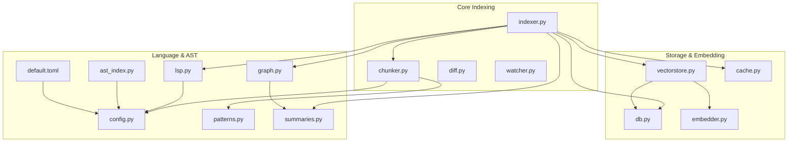

**Diagram sources**
- [indexer.py:242-550](file://src/rag/core/indexer.py#L242-L550)
- [chunker.py:385-444](file://src/rag/core/chunker.py#L385-L444)
- [diff.py:80-148](file://src/rag/core/diff.py#L80-L148)
- [watcher.py:18-184](file://src/rag/core/watcher.py#L18-L184)
- [vectorstore.py:199-530](file://src/rag/core/vectorstore.py#L199-L530)
- [cache.py:101-195](file://src/rag/core/cache.py#L101-L195)
- [db.py:151-251](file://src/rag/storage/db.py#L151-L251)
- [embedder.py:189-245](file://src/rag/core/embedder.py#L189-L245)
- [lsp.py:313-404](file://src/rag/core/lsp.py#L313-L404)
- [patterns.py:164-349](file://src/rag/core/patterns.py#L164-L349)
- [ast_index.py:77-110](file://src/rag/core/ast_index.py#L77-L110)
- [graph.py:39-267](file://src/rag/core/graph.py#L39-L267)
- [summaries.py:71-149](file://src/rag/core/summaries.py#L71-L149)
- [config.py:83-131](file://src/rag/config.py#L83-L131)
- [default.toml:28-41](file://src/rag/default.toml#L28-L41)

**Section sources**
- [indexer.py:242-550](file://src/rag/core/indexer.py#L242-L550)
- [chunker.py:385-444](file://src/rag/core/chunker.py#L385-L444)
- [config.py:83-131](file://src/rag/config.py#L83-L131)
- [default.toml:28-41](file://src/rag/default.toml#L28-L41)

## Core Components
- Indexer: Orchestrates repository discovery, incremental change detection, chunking, embedding, upsert, and post-processing (graph, summaries).
- Chunker: Implements Tree-Sitter-based three-tier chunking and language-specific extraction.
- Vector Store: Dense-only Qdrant integration with payload indexes and batched upsert.
- Embedder: Ollama-backed dense embeddings with retry/backoff and instruction prefixes.
- LSP Enrichment: Optional index-time enrichment via language servers.
- Storage: SQLite-backed exact-match index and overview statistics.
- Graph & Summaries: Knowledge graph and hierarchical LOD summaries generation.
- Watcher & Diff: Real-time file watching and git-aware change detection.

**Section sources**
- [indexer.py:242-550](file://src/rag/core/indexer.py#L242-L550)
- [chunker.py:385-444](file://src/rag/core/chunker.py#L385-L444)
- [vectorstore.py:199-530](file://src/rag/core/vectorstore.py#L199-L530)
- [embedder.py:189-245](file://src/rag/core/embedder.py#L189-L245)
- [lsp.py:313-404](file://src/rag/core/lsp.py#L313-L404)
- [db.py:151-251](file://src/rag/storage/db.py#L151-L251)
- [graph.py:39-267](file://src/rag/core/graph.py#L39-L267)
- [summaries.py:71-149](file://src/rag/core/summaries.py#L71-L149)
- [watcher.py:18-184](file://src/rag/core/watcher.py#L18-L184)
- [diff.py:80-148](file://src/rag/core/diff.py#L80-L148)

## Architecture Overview
The indexing pipeline is asynchronous and designed for large-scale repositories. It uses:
- Thread pools for CPU-bound chunking
- Async I/O for embedding and vector store operations
- Advisory locks to serialize concurrent runs per repository
- Batched upserts with payload indexes for efficient retrieval
- Optional LSP enrichment and graph/summaries for advanced navigation

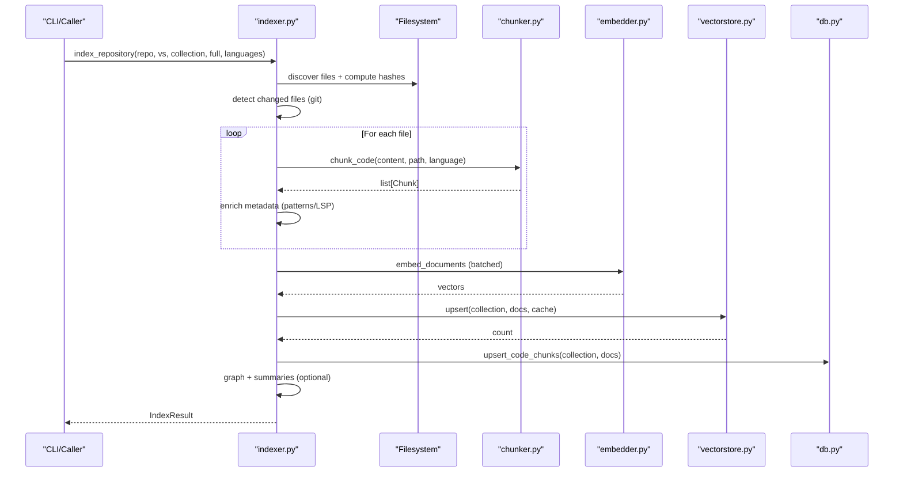

**Diagram sources**
- [indexer.py:242-550](file://src/rag/core/indexer.py#L242-L550)
- [chunker.py:385-444](file://src/rag/core/chunker.py#L385-L444)
- [embedder.py:230-245](file://src/rag/core/embedder.py#L230-L245)
- [vectorstore.py:296-422](file://src/rag/core/vectorstore.py#L296-L422)
- [db.py:151-251](file://src/rag/storage/db.py#L151-L251)

## Detailed Component Analysis

### Indexer: Repository Scanning, Incremental Updates, and Post-processing
- Repository discovery: Glob supported extensions and exclude configured directories.
- Change detection: Compute HEAD, fetch changed files, and re-chunk files whose content hash differs.
- Locking: Per-repo advisory lock prevents concurrent runs from corrupting state.
- Batching: Flush batches of chunks to Qdrant; maintain staged/pending hashes for crash consistency.
- Post-processing: Optional graph construction, community detection, and LOD/module summaries.

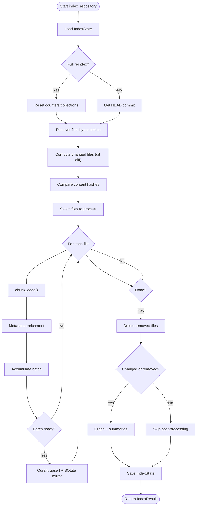

**Diagram sources**
- [indexer.py:242-550](file://src/rag/core/indexer.py#L242-L550)

**Section sources**
- [indexer.py:242-550](file://src/rag/core/indexer.py#L242-L550)

### Chunker: Tree-Sitter-Based Three-Tier Chunking
- Supported languages: Python, Java, Kotlin, TypeScript/TSX, JavaScript/JSX, Go, Rust, C, C++, Dart.
- Three-tier extraction:
  - File summary: imports and top-level declarations
  - Class/Interface summary: class signature and member signatures
  - Function/Method detail: full body with contextual header
- Fallback: Sliding window chunking if parsing fails or language unsupported.
- Metadata enrichment: Python patterns, Kotlin/Java coroutine/singleton heuristics.

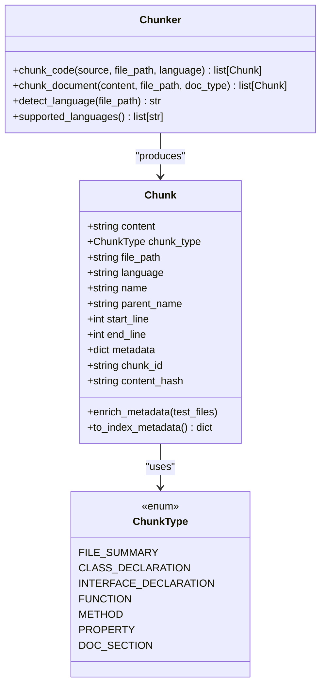

**Diagram sources**
- [chunker.py:25-82](file://src/rag/core/chunker.py#L25-L82)
- [chunker.py:385-444](file://src/rag/core/chunker.py#L385-L444)

**Section sources**
- [chunker.py:190-300](file://src/rag/core/chunker.py#L190-L300)
- [chunker.py:385-444](file://src/rag/core/chunker.py#L385-L444)
- [chunker.py:539-586](file://src/rag/core/chunker.py#L539-L586)

### Vector Store: Dense Embeddings and Payload Indexing
- Dense-only vector store with Qdrant (server or embedded mode).
- Payload indexes for efficient filtering on fields like language, chunk_type, patterns, etc.
- Batched upsert with dimension validation and UUID assignment.
- Separate collection for summaries and LOD.

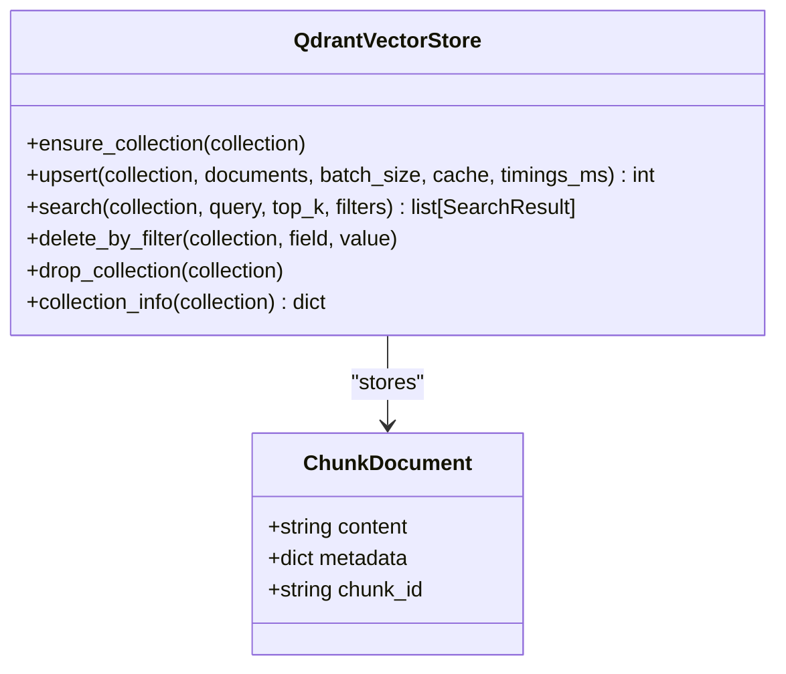

**Diagram sources**
- [vectorstore.py:199-530](file://src/rag/core/vectorstore.py#L199-L530)

**Section sources**
- [vectorstore.py:230-295](file://src/rag/core/vectorstore.py#L230-L295)
- [vectorstore.py:296-422](file://src/rag/core/vectorstore.py#L296-L422)

### Embedder: Ollama Dense Embeddings
- Instruction-prefixed queries and documents for better alignment.
- Configurable batch size and keep-alive for the model.
- Retry/backoff with a hard cap on total retry time.

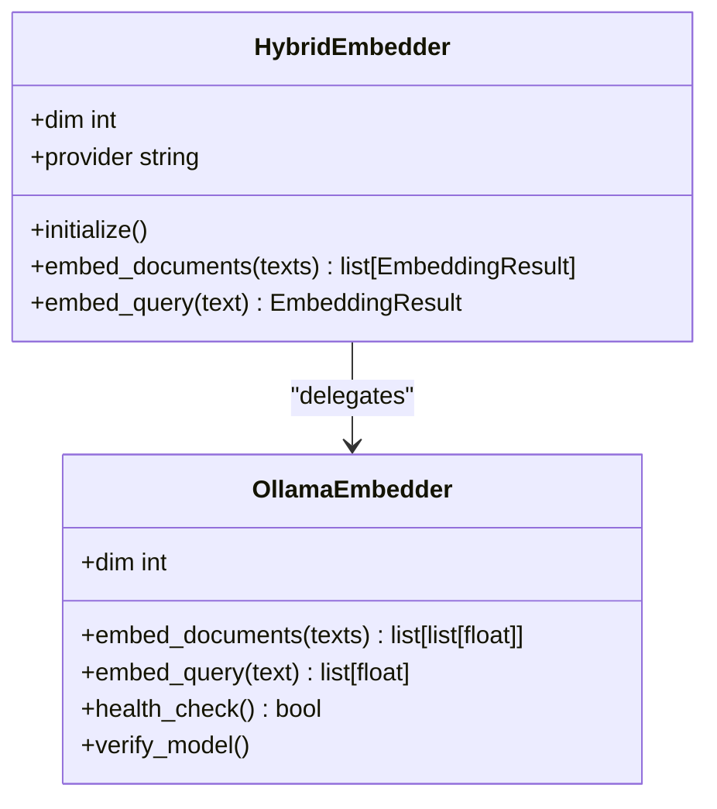

**Diagram sources**
- [embedder.py:189-245](file://src/rag/core/embedder.py#L189-L245)

**Section sources**
- [embedder.py:65-154](file://src/rag/core/embedder.py#L65-L154)
- [embedder.py:217-245](file://src/rag/core/embedder.py#L217-L245)

### LSP Enrichment: Index-Time Symbol and Call Graph Enhancement
- Detects installed LSP servers per language and starts them.
- Queries references/definitions/implementations to enrich fan-in/out and dead-code signals.
- Cleans up servers after enrichment.

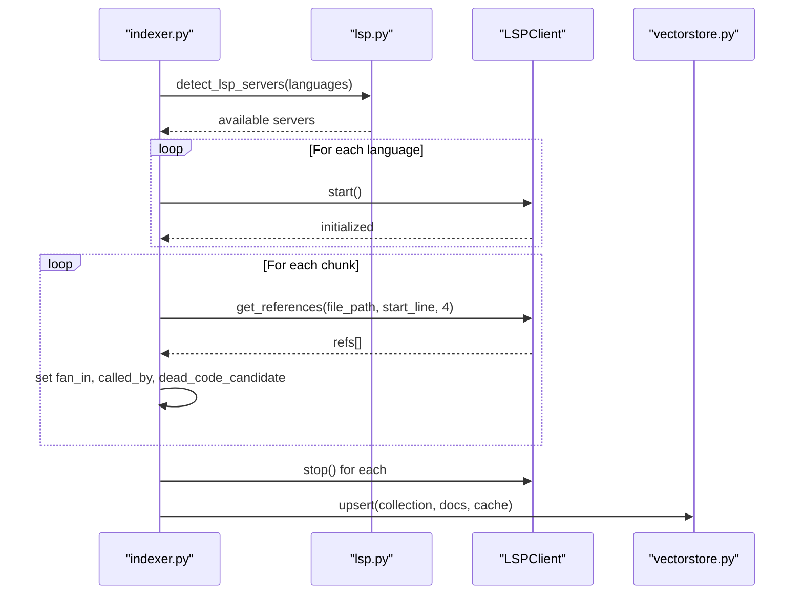

**Diagram sources**
- [lsp.py:313-404](file://src/rag/core/lsp.py#L313-L404)
- [indexer.py:379-422](file://src/rag/core/indexer.py#L379-L422)

**Section sources**
- [lsp.py:100-118](file://src/rag/core/lsp.py#L100-L118)
- [lsp.py:313-404](file://src/rag/core/lsp.py#L313-L404)

### AST Index Adapter: Symbol Resolution and Context Retrieval
- Optional external tool integration for exact symbol lookup and usage contexts.
- Provides ranked hits with code windows and scoring.

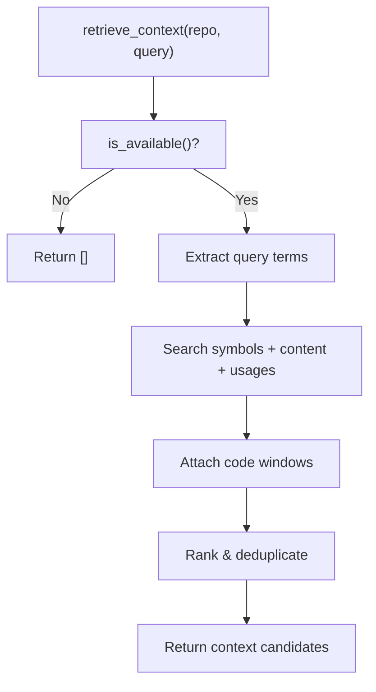

**Diagram sources**
- [ast_index.py:77-110](file://src/rag/core/ast_index.py#L77-L110)

**Section sources**
- [ast_index.py:77-110](file://src/rag/core/ast_index.py#L77-L110)

### Graph and Summaries: Knowledge Graph and LOD
- Build a DiGraph from chunk metadata; detect communities via Louvain.
- Generate community summaries and hierarchical LOD (L0/L1) summaries.
- Store summaries in dedicated collections for downstream retrieval.

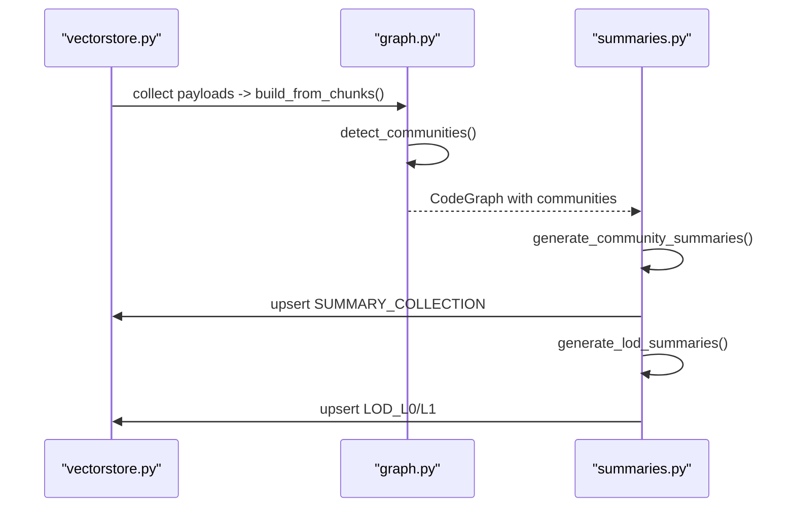

**Diagram sources**
- [graph.py:47-129](file://src/rag/core/graph.py#L47-L129)
- [summaries.py:71-149](file://src/rag/core/summaries.py#L71-L149)
- [summaries.py:350-462](file://src/rag/core/summaries.py#L350-L462)

**Section sources**
- [graph.py:39-267](file://src/rag/core/graph.py#L39-L267)
- [summaries.py:71-149](file://src/rag/core/summaries.py#L71-L149)
- [summaries.py:350-462](file://src/rag/core/summaries.py#L350-L462)

### Real-time Watcher and Git Diff-Aware Search
- FileWatcher polls mtime and invokes a callback with changed files.
- Diff utilities compute changed files and parse unified diffs for search narrowing.

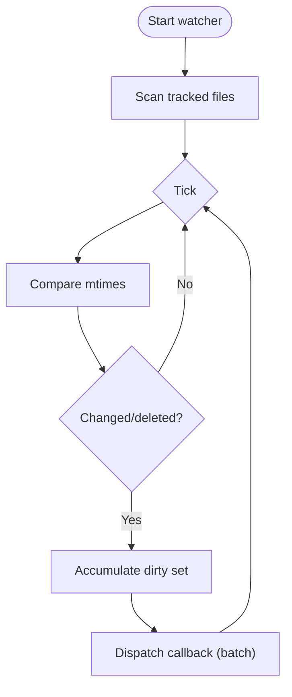

**Diagram sources**
- [watcher.py:110-184](file://src/rag/core/watcher.py#L110-L184)

**Section sources**
- [watcher.py:18-184](file://src/rag/core/watcher.py#L18-L184)
- [diff.py:80-148](file://src/rag/core/diff.py#L80-L148)

## Dependency Analysis
- Configuration-driven behavior: chunk sizes, retrieval top-K, skip directories, LSP timeout, and embedding model/dimensions.
- Runtime dependencies: Tree-Sitter grammars (direct or via language pack), Qdrant client, NetworkX for graph, SQLite for local mirroring.
- External integrations: Ollama for embeddings and summaries, optional LSP servers, optional external AST index tool.

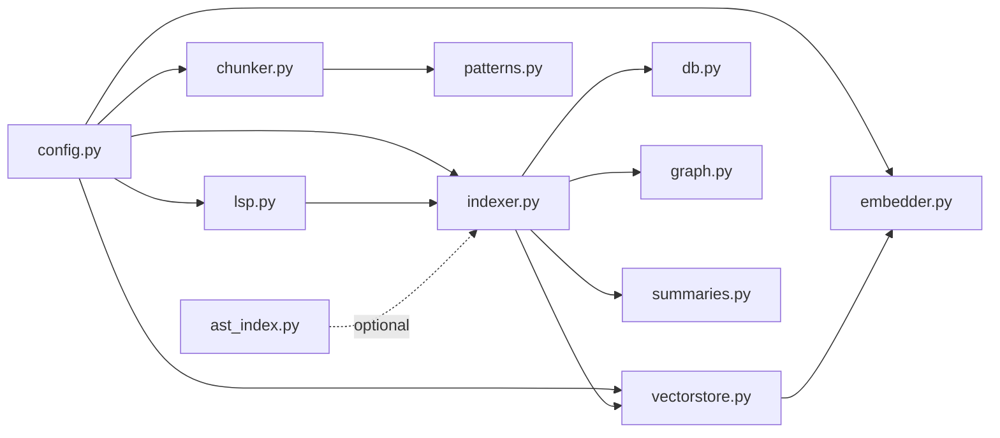

**Diagram sources**
- [config.py:83-131](file://src/rag/config.py#L83-L131)
- [indexer.py:242-550](file://src/rag/core/indexer.py#L242-L550)
- [chunker.py:385-444](file://src/rag/core/chunker.py#L385-L444)
- [vectorstore.py:199-530](file://src/rag/core/vectorstore.py#L199-L530)
- [lsp.py:313-404](file://src/rag/core/lsp.py#L313-L404)
- [patterns.py:164-349](file://src/rag/core/patterns.py#L164-L349)
- [db.py:151-251](file://src/rag/storage/db.py#L151-L251)
- [graph.py:39-267](file://src/rag/core/graph.py#L39-L267)
- [summaries.py:71-149](file://src/rag/core/summaries.py#L71-L149)
- [ast_index.py:77-110](file://src/rag/core/ast_index.py#L77-L110)

**Section sources**
- [config.py:83-131](file://src/rag/config.py#L83-L131)
- [default.toml:28-41](file://src/rag/default.toml#L28-L41)

## Performance Considerations
- Chunk sizing: Tune max_chunk_chars to balance recall and token costs.
- Batch sizes: Vector store batch size and embedding batch size impact throughput and memory.
- Payload indexes: Enable payload indexes on Qdrant for faster filtering.
- Embedding cache: SQLite cache reduces repeated embeddings; tune TTL.
- Concurrency: Use thread pool for chunking; async I/O for embedding and upsert.
- Memory management: Large repositories benefit from streaming SQLite writes and avoiding in-memory lists of all chunks.
- LSP overhead: Disable or limit LSP enrichment for very large repos.
- LOD summaries: Reduce re-generation scope by passing changed_files to LOD generator.

[No sources needed since this section provides general guidance]

## Troubleshooting Guide
Common issues and remedies:
- Indexing crashes mid-run: The pipeline uses staged/pending hashes to avoid losing chunks; re-run indexing to flush pending batches.
- Dimension mismatch: If embedding model changes, recreate collections or re-index with full.
- Missing LSP servers: Install language servers and ensure they are on PATH; verify with detect_lsp_servers.
- Ollama connectivity: Verify model availability and service status; use health checks.
- Git commands failing: Ensure git is installed and repository is a valid git repo; timeouts logged with warnings.
- SQLite errors: Storage operations are best-effort; failures are logged and do not abort indexing.

**Section sources**
- [indexer.py:379-422](file://src/rag/core/indexer.py#L379-L422)
- [vectorstore.py:264-279](file://src/rag/core/vectorstore.py#L264-L279)
- [lsp.py:100-118](file://src/rag/core/lsp.py#L100-L118)
- [embedder.py:155-187](file://src/rag/core/embedder.py#L155-L187)
- [diff.py:28-53](file://src/rag/core/diff.py#L28-L53)

## Conclusion
The indexing system combines robust chunking, efficient embedding, and optional semantic/syntactic enrichment to produce a searchable, navigable representation of codebases. Its incremental design, payload indexes, and post-processing steps enable scalable retrieval and developer-centric navigation across diverse language ecosystems.

[No sources needed since this section summarizes without analyzing specific files]

## Appendices

### Configuration Options
Key settings impacting indexing:
- Index settings: max_chunk_chars, retrieval_top_k, skip_dirs
- Embeddings: model, dim, batch_size, keep_alive
- Qdrant: mode, url/path, code/docs collections
- LSP: enabled, auto_detect, timeout
- Server: host, port

**Section sources**
- [config.py:83-131](file://src/rag/config.py#L83-L131)
- [default.toml:28-41](file://src/rag/default.toml#L28-L41)

### Practical Workflows
- Full reindex: Use the full flag to rebuild counters, drop collections, and regenerate summaries.
- Incremental reindex: Defaults to scanning git changes and content hashes; processes only changed files.
- Language-specific indexing: Limit languages to reduce scope and improve performance.
- Real-time watch: Start a watcher to trigger incremental re-index on file changes.
- Diff-aware search: Restrict semantic search to recently changed files.

**Section sources**
- [indexer.py:242-550](file://src/rag/core/indexer.py#L242-L550)
- [watcher.py:50-84](file://src/rag/core/watcher.py#L50-L84)
- [diff.py:200-248](file://src/rag/core/diff.py#L200-L248)

### Large Repository Handling
- Prefer incremental indexing to minimize work.
- Use language filters and skip_dirs to narrow scope.
- Monitor overview stats and adjust chunk sizes.
- Consider disabling LSP enrichment or reducing batch sizes.
- Ensure adequate disk space for SQLite caches and Qdrant data.

[No sources needed since this section provides general guidance]