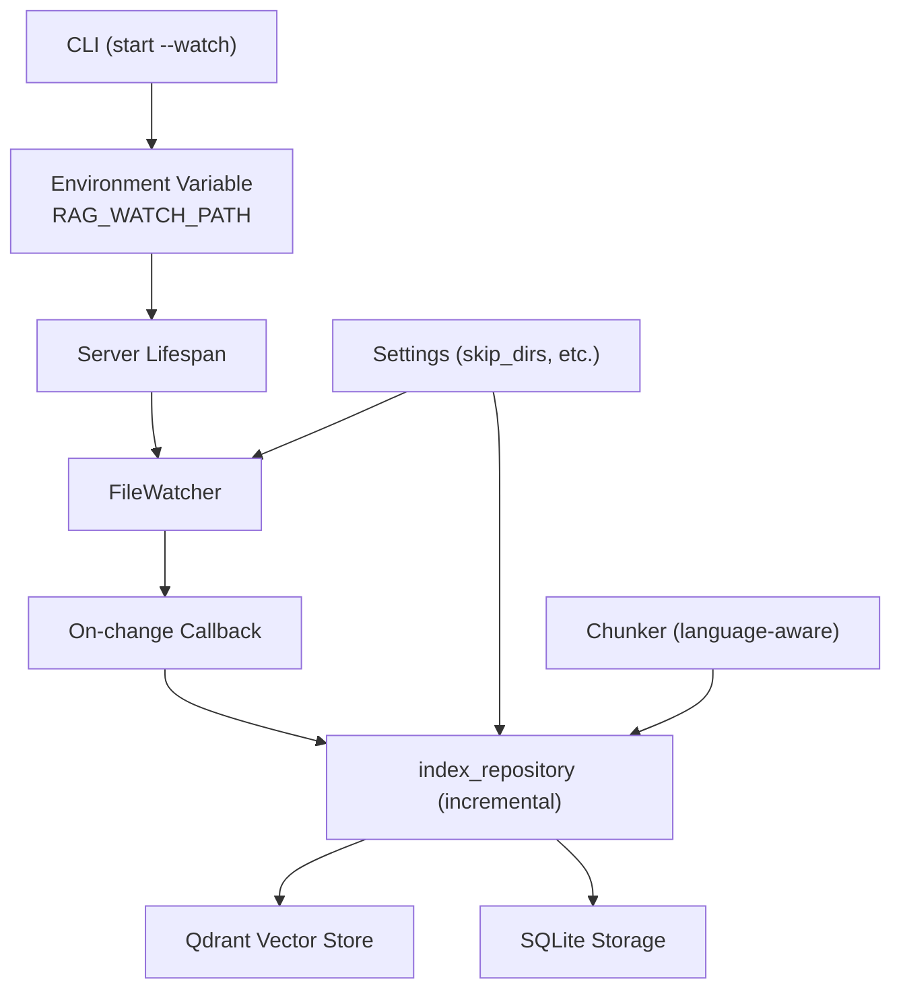
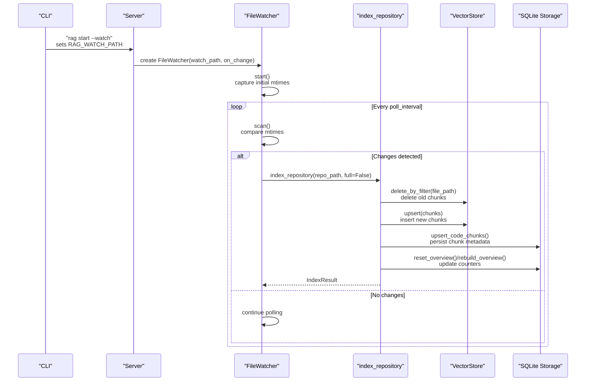
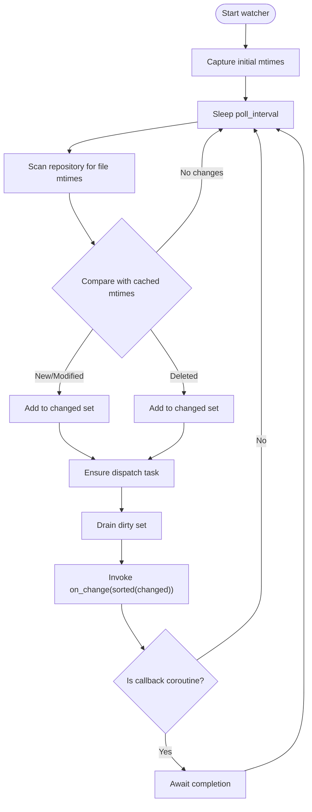
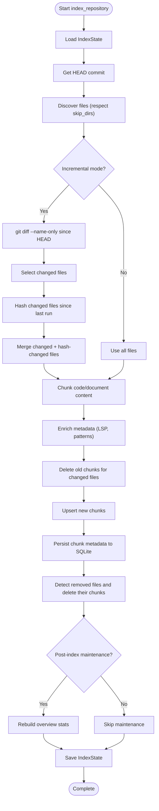
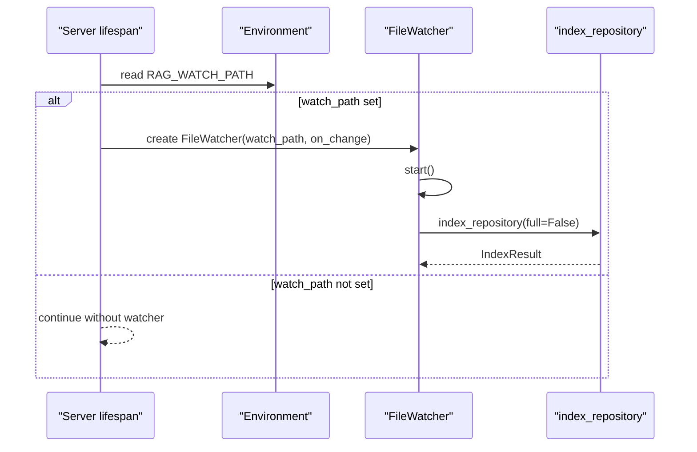
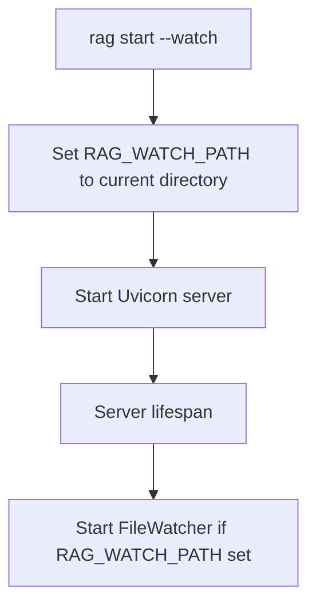
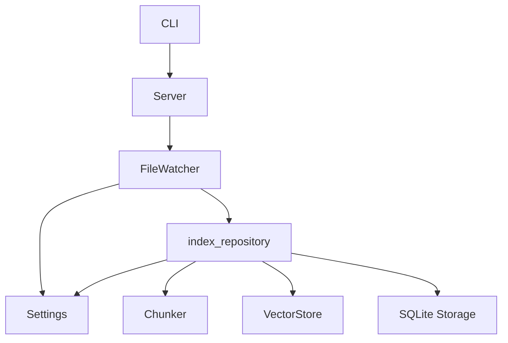

# Real-time File Watching and Live Indexing

<cite>
**Referenced Files in This Document**
- [src/rag/core/watcher.py](file://src/rag/core/watcher.py)
- [src/rag/core/indexer.py](file://src/rag/core/indexer.py)
- [src/rag/server.py](file://src/rag/server.py)
- [src/rag/config.py](file://src/rag/config.py)
- [config/default.toml](file://config/default.toml)
- [src/rag/cli.py](file://src/rag/cli.py)
- [src/rag/core/chunker.py](file://src/rag/core/chunker.py)
</cite>

## Table of Contents
1. [Introduction](#introduction)
2. [Project Structure](#project-structure)
3. [Core Components](#core-components)
4. [Architecture Overview](#architecture-overview)
5. [Detailed Component Analysis](#detailed-component-analysis)
6. [Dependency Analysis](#dependency-analysis)
7. [Performance Considerations](#performance-considerations)
8. [Troubleshooting Guide](#troubleshooting-guide)
9. [Conclusion](#conclusion)

## Introduction
This document explains the real-time file watching and live indexing system used to automatically re-index a repository when files change. The system combines a polling-based file watcher with an incremental indexing pipeline to maintain an up-to-date vector store with minimal disruption to developers. It covers how file system events are monitored, how automatic indexing is triggered, how selective re-indexing works, configuration options for watch behavior, and practical guidance for setting up and optimizing live indexing in active development environments.

## Project Structure
The live indexing system spans several modules:
- File watcher: polls for changes and invokes a callback
- Indexer: performs incremental re-indexing of changed files
- Server: integrates the watcher into the daemon lifecycle
- CLI: enables watch mode and sets the watched path
- Configuration: defines skip directories and other index behavior
- Chunker: provides language-aware chunking used during indexing

**Diagram sources**
- [src/rag/cli.py:175-220](file://src/rag/cli.py#L175-L220)
- [src/rag/server.py:664-691](file://src/rag/server.py#L664-L691)
- [src/rag/core/watcher.py:26-108](file://src/rag/core/watcher.py#L26-L108)
- [src/rag/core/indexer.py:242-550](file://src/rag/core/indexer.py#L242-L550)
- [src/rag/config.py:83-89](file://src/rag/config.py#L83-L89)
- [src/rag/core/chunker.py:385-444](file://src/rag/core/chunker.py#L385-L444)

**Section sources**
- [src/rag/cli.py:175-220](file://src/rag/cli.py#L175-L220)
- [src/rag/server.py:664-691](file://src/rag/server.py#L664-L691)
- [src/rag/core/watcher.py:26-108](file://src/rag/core/watcher.py#L26-L108)
- [src/rag/core/indexer.py:242-550](file://src/rag/core/indexer.py#L242-L550)
- [src/rag/config.py:83-89](file://src/rag/config.py#L83-L89)
- [src/rag/core/chunker.py:385-444](file://src/rag/core/chunker.py#L385-L444)

## Core Components
- FileWatcher: Polls a repository directory at a configurable interval, compares modification times, and invokes a callback with a list of changed files. It coalesces rapid changes and ensures only one callback runs at a time.
- index_repository: Performs incremental indexing by scanning for changed files since the last run, chunking and enriching content, and upserting vectors while deleting obsolete chunks for removed files.
- Server integration: Starts the watcher when the daemon initializes with watch mode enabled.
- CLI watch flag: Sets the watched path via an environment variable and launches the daemon in watch mode.
- Configuration: Controls which directories are skipped and chunk sizing.

**Section sources**
- [src/rag/core/watcher.py:18-184](file://src/rag/core/watcher.py#L18-L184)
- [src/rag/core/indexer.py:242-550](file://src/rag/core/indexer.py#L242-L550)
- [src/rag/server.py:664-691](file://src/rag/server.py#L664-L691)
- [src/rag/cli.py:175-220](file://src/rag/cli.py#L175-L220)
- [src/rag/config.py:83-89](file://src/rag/config.py#L83-L89)

## Architecture Overview
The live indexing pipeline connects the file watcher to the indexing engine and vector store. The watcher monitors file system changes and triggers incremental re-indexing. The indexer computes diffs, chunks files, enriches metadata, and updates the vector store and storage.

**Diagram sources**
- [src/rag/cli.py:175-220](file://src/rag/cli.py#L175-L220)
- [src/rag/server.py:664-691](file://src/rag/server.py#L664-L691)
- [src/rag/core/watcher.py:50-184](file://src/rag/core/watcher.py#L50-L184)
- [src/rag/core/indexer.py:242-550](file://src/rag/core/indexer.py#L242-L550)

## Detailed Component Analysis

### FileWatcher: Polling-based Change Detection
The FileWatcher periodically scans the repository for file changes by comparing modification times. It respects configured skip directories and supported file extensions. Changes are coalesced into a single in-flight callback to prevent overlapping re-indexing.

Key behaviors:
- Initialization captures baseline mtimes to avoid reporting every file on first tick
- Poll loop sleeps for a configurable interval between scans
- Change detection identifies new/modified and deleted files
- Single-flight dispatch ensures only one callback runs at a time
- Callback receives a sorted list of changed file paths (relative to repo root)

**Diagram sources**
- [src/rag/core/watcher.py:50-184](file://src/rag/core/watcher.py#L50-L184)

**Section sources**
- [src/rag/core/watcher.py:26-108](file://src/rag/core/watcher.py#L26-L108)
- [src/rag/core/watcher.py:110-184](file://src/rag/core/watcher.py#L110-L184)

### Indexer: Incremental Re-indexing Pipeline
The indexer performs incremental re-indexing by:
- Determining which files changed since the last run using Git commands
- Computing file hashes to detect content changes without Git diff
- Discovering files respecting skip directories and supported extensions
- Chunking and enriching content using language-aware chunking
- Upserting vectors into the vector store and updating SQLite storage
- Deleting chunks for removed files and rebuilding overview statistics when needed

**Diagram sources**
- [src/rag/core/indexer.py:242-550](file://src/rag/core/indexer.py#L242-L550)
- [src/rag/core/chunker.py:385-444](file://src/rag/core/chunker.py#L385-L444)

**Section sources**
- [src/rag/core/indexer.py:242-550](file://src/rag/core/indexer.py#L242-L550)
- [src/rag/core/chunker.py:385-444](file://src/rag/core/chunker.py#L385-L444)

### Server Integration: Watch Mode Lifecycle
The server starts the watcher during daemon initialization when watch mode is enabled. It sets up an on-change callback that triggers incremental re-indexing and emits events for progress visibility.

**Diagram sources**
- [src/rag/server.py:664-691](file://src/rag/server.py#L664-L691)

**Section sources**
- [src/rag/server.py:664-691](file://src/rag/server.py#L664-L691)

### CLI: Enabling Watch Mode
The CLI supports enabling watch mode via a command-line option. When enabled, it sets the watched path via an environment variable and launches the daemon in watch mode.

**Diagram sources**
- [src/rag/cli.py:175-220](file://src/rag/cli.py#L175-L220)

**Section sources**
- [src/rag/cli.py:175-220](file://src/rag/cli.py#L175-L220)

## Dependency Analysis
The live indexing system exhibits clear separation of concerns:
- FileWatcher depends on configuration for skip directories and supported extensions
- Indexer depends on configuration for chunk sizing and skip directories
- Server orchestrates the watcher lifecycle and delegates re-indexing to the indexer
- CLI controls watch mode activation and sets the watched path

**Diagram sources**
- [src/rag/cli.py:175-220](file://src/rag/cli.py#L175-L220)
- [src/rag/server.py:664-691](file://src/rag/server.py#L664-L691)
- [src/rag/core/watcher.py:26-108](file://src/rag/core/watcher.py#L26-L108)
- [src/rag/core/indexer.py:242-550](file://src/rag/core/indexer.py#L242-L550)
- [src/rag/config.py:83-89](file://src/rag/config.py#L83-L89)
- [src/rag/core/chunker.py:385-444](file://src/rag/core/chunker.py#L385-L444)

**Section sources**
- [src/rag/cli.py:175-220](file://src/rag/cli.py#L175-L220)
- [src/rag/server.py:664-691](file://src/rag/server.py#L664-L691)
- [src/rag/core/watcher.py:26-108](file://src/rag/core/watcher.py#L26-L108)
- [src/rag/core/indexer.py:242-550](file://src/rag/core/indexer.py#L242-L550)
- [src/rag/config.py:83-89](file://src/rag/config.py#L83-L89)
- [src/rag/core/chunker.py:385-444](file://src/rag/core/chunker.py#L385-L444)

## Performance Considerations
- Poll interval tuning: Adjust the watcher’s poll interval to balance responsiveness and CPU usage. Longer intervals reduce overhead but delay re-indexing.
- Skip directories: Configure skip_dirs to exclude large or irrelevant directories (e.g., build artifacts, caches) to minimize scanning overhead.
- Batch size and chunk sizing: Tune max_chunk_chars and embedding batch sizes to optimize throughput without sacrificing interactivity.
- Concurrency control: The single-flight dispatch prevents overlapping re-indexing, reducing contention and redundant work.
- Incremental indexing: Only changed files and hashes are processed, minimizing work compared to full re-indexing.
- Vector store operations: Deletion and upsert operations are scoped to changed files, reducing write amplification.

[No sources needed since this section provides general guidance]

## Troubleshooting Guide
Common issues and resolutions:
- Watcher not starting: Verify that RAG_WATCH_PATH is set and points to a valid directory. Confirm that the server started with watch mode enabled.
- No re-indexing after changes: Ensure the poll interval is appropriate and that the callback is invoked. Check logs for watcher_poll_error or watcher_callback_error.
- Excessive CPU usage: Increase the poll interval or expand skip_dirs to exclude unnecessary directories.
- Large working directories: Reduce the number of tracked files by adjusting skip_dirs and supported extensions.
- Permission errors: Ensure the process has read permissions for watched files and directories.
- Indexing stalls: Monitor the single-flight dispatch behavior; long-running re-indexes will coalesce changes into a single run.

**Section sources**
- [src/rag/core/watcher.py:50-184](file://src/rag/core/watcher.py#L50-L184)
- [src/rag/server.py:664-691](file://src/rag/server.py#L664-L691)

## Conclusion
The real-time file watching and live indexing system provides responsive, incremental updates to the vector store by combining a polling-based file watcher with an efficient indexing pipeline. By configuring watch mode, tuning poll intervals, and optimizing skip directories and chunk sizing, teams can maintain accurate search results with minimal impact on development workflows.