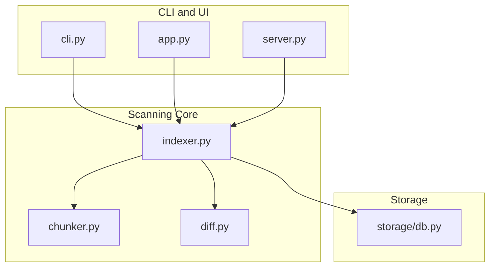
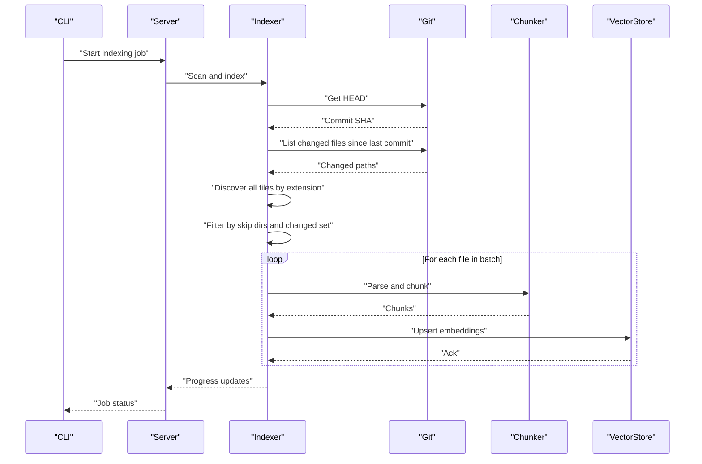
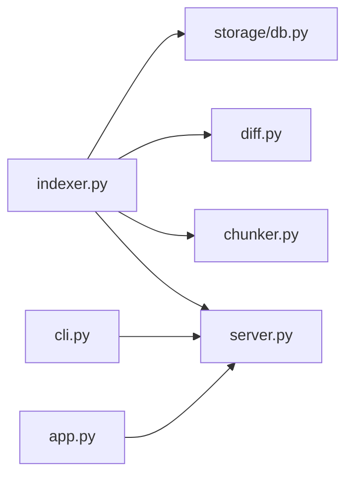

# Repository Scanning

<cite>
**Referenced Files in This Document**
- [indexer.py](file://src/rag/core/indexer.py)
- [diff.py](file://src/rag/core/diff.py)
- [chunker.py](file://src/rag/core/chunker.py)
- [cli.py](file://src/rag/cli.py)
- [server.py](file://src/rag/server.py)
- [app.py](file://src/rag/app.py)
- [db.py](file://src/rag/storage/db.py)
</cite>

## Table of Contents
1. [Introduction](#introduction)
2. [Project Structure](#project-structure)
3. [Core Components](#core-components)
4. [Architecture Overview](#architecture-overview)
5. [Detailed Component Analysis](#detailed-component-analysis)
6. [Dependency Analysis](#dependency-analysis)
7. [Performance Considerations](#performance-considerations)
8. [Troubleshooting Guide](#troubleshooting-guide)
9. [Conclusion](#conclusion)
10. [Appendices](#appendices)

## Introduction
This document explains the repository scanning component responsible for discovering files, integrating with Git for change detection, traversing directories with configurable exclusions, and performing incremental indexing by comparing file hashes against a persisted state. It also covers language-specific scanning configuration, batching for performance, and error handling for corrupted or inaccessible repositories.

## Project Structure
The scanning pipeline spans several modules:
- Discovery and traversal: file discovery, skip directories, and test file discovery
- Git integration: HEAD commit retrieval, change detection, and diff parsing
- Incremental indexing: hash comparison and state persistence
- Language support: extension-to-language mapping and parser selection
- Performance: batching and progress reporting
- Observability: TUI and server endpoints for monitoring

**Diagram sources**
- [indexer.py:87-475](file://src/rag/core/indexer.py#L87-L475)
- [chunker.py:190-345](file://src/rag/core/chunker.py#L190-L345)
- [diff.py:28-228](file://src/rag/core/diff.py#L28-L228)
- [cli.py:1431-1462](file://src/rag/cli.py#L1431-L1462)
- [app.py:869-900](file://src/rag/app.py#L869-L900)
- [server.py:1133-1173](file://src/rag/server.py#L1133-L1173)
- [db.py:433-446](file://src/rag/storage/db.py#L433-L446)

**Section sources**
- [indexer.py:215-239](file://src/rag/core/indexer.py#L215-L239)
- [chunker.py:190-345](file://src/rag/core/chunker.py#L190-L345)
- [diff.py:28-111](file://src/rag/core/diff.py#L28-L111)
- [cli.py:1431-1462](file://src/rag/cli.py#L1431-L1462)
- [app.py:869-900](file://src/rag/app.py#L869-L900)
- [server.py:1133-1173](file://src/rag/server.py#L1133-L1173)
- [db.py:433-446](file://src/rag/storage/db.py#L433-L446)

## Core Components
- File discovery and filtering
  - Glob-based discovery across supported extensions
  - Skip directories configuration
  - Test file discovery for unit-test detection
- Git integration
  - HEAD commit retrieval
  - Change detection via diff or log
  - Diff content parsing into structured chunks
- Incremental indexing
  - Hash-based change detection
  - State persistence and migration
  - Crash-consistent staging of hashes
- Language-specific scanning
  - Extension-to-language mapping
  - Parser selection per language
- Performance and observability
  - Batching for embedding throughput
  - Progress reporting via CLI/TUI/server

**Section sources**
- [indexer.py:171-189](file://src/rag/core/indexer.py#L171-L189)
- [indexer.py:215-239](file://src/rag/core/indexer.py#L215-L239)
- [indexer.py:314-328](file://src/rag/core/indexer.py#L314-L328)
- [diff.py:28-111](file://src/rag/core/diff.py#L28-L111)
- [chunker.py:190-345](file://src/rag/core/chunker.py#L190-L345)

## Architecture Overview
The scanning workflow begins with collecting candidate files, optionally narrowing to changed files since the last indexed commit, then processing each file in batches while maintaining a hash-based state. Git commands are invoked for HEAD and diff operations, and language-specific parsers are selected based on file extensions.

**Diagram sources**
- [indexer.py:175-189](file://src/rag/core/indexer.py#L175-L189)
- [indexer.py:192-212](file://src/rag/core/indexer.py#L192-L212)
- [indexer.py:314-328](file://src/rag/core/indexer.py#L314-L328)
- [chunker.py:190-345](file://src/rag/core/chunker.py#L190-L345)
- [server.py:1133-1173](file://src/rag/server.py#L1133-L1173)
- [cli.py:1431-1462](file://src/rag/cli.py#L1431-L1462)

## Detailed Component Analysis

### File Discovery and Directory Traversal
- Supported extensions are derived from language configurations and used to glob for files under the repository root.
- Skip directories are configured via settings and applied to exclude paths during discovery.
- Test file discovery scans for common Python test naming patterns to support unit-test detection.

Key behaviors:
- Discovery uses recursive globbing per extension.
- Filter excludes any discovered file whose path segments intersect with configured skip directories.
- Test file names are collected to assist downstream logic.

**Section sources**
- [indexer.py:215-239](file://src/rag/core/indexer.py#L215-L239)
- [indexer.py:232-239](file://src/rag/core/indexer.py#L232-L239)

### Git Integration: Commit Tracking and Change Detection
- HEAD commit retrieval uses a Git command with a timeout to avoid blocking.
- Changed files detection supports both ref-based and date-based ranges:
  - Ref-based: runs a diff command to list changed paths.
  - Date-based: runs a log command to find affected files within a date range and derives the appropriate commit range.
- Diff content parsing extracts added/removed lines per file and returns structured chunks.

Error handling:
- Timeouts and non-zero exit codes are logged and treated gracefully.
- When the repository is not a Git worktree, operations return safe defaults.

**Section sources**
- [indexer.py:175-189](file://src/rag/core/indexer.py#L175-L189)
- [indexer.py:192-212](file://src/rag/core/indexer.py#L192-L212)
- [diff.py:28-111](file://src/rag/core/diff.py#L28-L111)
- [diff.py:114-197](file://src/rag/core/diff.py#L114-L197)

### Incremental Indexing: Hash Comparison and State Management
- Hash-based change detection:
  - Compute a short hash for each file and compare against the stored state.
  - If a file is not in the changed set but its hash differs, it is reprocessed.
- State persistence:
  - Stores last indexed commit and a mapping of relative paths to hashes.
  - Supports migration from legacy locations and atomic writes.
- Crash consistency:
  - Uses staged and pending hashes to ensure that a file’s hash is only committed after its chunks are successfully upserted.

Batching and progress:
- Batches are processed in fixed-size groups aligned with embedding throughput.
- Progress includes counts of processed files, estimated total chunks, and current file.

**Section sources**
- [indexer.py:102-158](file://src/rag/core/indexer.py#L102-L158)
- [indexer.py:171-172](file://src/rag/core/indexer.py#L171-L172)
- [indexer.py:314-328](file://src/rag/core/indexer.py#L314-L328)
- [indexer.py:344-377](file://src/rag/core/indexer.py#L344-L377)
- [indexer.py:351-377](file://src/rag/core/indexer.py#L351-L377)

### Language-Specific Scanning Configuration
- Language configurations define:
  - Grammar module and optional loader
  - AST node types for classes, functions, imports, decorators, and docstrings
  - Name/body fields and optional sub-language
  - Supported file extensions
- An extension-to-language mapping enables fast language detection from file paths.

Practical impact:
- Only files with supported extensions are considered for parsing.
- Parser selection is language-driven, ensuring accurate AST extraction.

**Section sources**
- [chunker.py:190-345](file://src/rag/core/chunker.py#L190-L345)
- [chunker.py:302-311](file://src/rag/core/chunker.py#L302-L311)

### Observability and User Interfaces
- CLI polling displays progress and waits for asynchronous indexing jobs to complete.
- TUI updates show live progress, current file, and recent indexed files.
- Server endpoints expose progress and recent files for UI consumption.

**Section sources**
- [cli.py:1431-1462](file://src/rag/cli.py#L1431-L1462)
- [app.py:869-900](file://src/rag/app.py#L869-L900)
- [server.py:1133-1173](file://src/rag/server.py#L1133-L1173)

## Dependency Analysis
The scanning pipeline integrates multiple modules with clear boundaries:
- Indexer orchestrates discovery, Git queries, hashing, batching, and progress.
- Chunker provides language-aware parsing and chunking.
- Diff handles Git operations and diff parsing.
- CLI/TUI/server provide user-facing progress and job control.

**Diagram sources**
- [indexer.py:314-328](file://src/rag/core/indexer.py#L314-L328)
- [chunker.py:190-345](file://src/rag/core/chunker.py#L190-L345)
- [diff.py:28-111](file://src/rag/core/diff.py#L28-L111)
- [cli.py:1431-1462](file://src/rag/cli.py#L1431-L1462)
- [app.py:869-900](file://src/rag/app.py#L869-L900)
- [server.py:1133-1173](file://src/rag/server.py#L1133-L1173)
- [db.py:433-446](file://src/rag/storage/db.py#L433-L446)

**Section sources**
- [indexer.py:314-328](file://src/rag/core/indexer.py#L314-L328)
- [chunker.py:190-345](file://src/rag/core/chunker.py#L190-L345)
- [diff.py:28-111](file://src/rag/core/diff.py#L28-L111)
- [cli.py:1431-1462](file://src/rag/cli.py#L1431-L1462)
- [app.py:869-900](file://src/rag/app.py#L869-L900)
- [server.py:1133-1173](file://src/rag/server.py#L1133-L1173)
- [db.py:433-446](file://src/rag/storage/db.py#L433-L446)

## Performance Considerations
- Batching
  - Fixed batch size aligns with embedding throughput to minimize HTTP overhead and improve latency.
  - Pending upsert tasks ensure backpressure and ordered completion.
- Hashing
  - Short hashes reduce memory footprint compared to full digests while still providing reliable change detection.
- Discovery
  - Recursive globbing per extension is efficient; skip directories reduce unnecessary IO.
- Git timeouts
  - Timeouts prevent stalls; failures are logged and handled gracefully to keep the pipeline resilient.

Recommendations:
- Tune batch sizes based on embedding backend capacity.
- Monitor progress endpoints to adjust concurrency and batch sizes dynamically.
- Keep skip directories minimal and precise to avoid missing files.

**Section sources**
- [indexer.py:344-377](file://src/rag/core/indexer.py#L344-L377)
- [indexer.py:171-172](file://src/rag/core/indexer.py#L171-L172)
- [indexer.py:215-239](file://src/rag/core/indexer.py#L215-L239)
- [diff.py:28-62](file://src/rag/core/diff.py#L28-L62)

## Troubleshooting Guide
Common issues and resolutions:
- Git not found or command timed out
  - Symptoms: warnings logged for git command failures or timeouts.
  - Resolution: ensure Git is installed and accessible; verify repository path; retry indexing.
- Repository is not a Git worktree
  - Behavior: change detection returns empty sets; scanning falls back to full discovery.
  - Resolution: initialize a Git repository or disable incremental mode.
- Corrupted or inaccessible state file
  - Behavior: migration attempts may fail; state resets to empty.
  - Resolution: remove stale state files; re-run indexing; monitor warnings for migration outcomes.
- Slow or hanging indexing
  - Behavior: long-running batches or stalled progress.
  - Resolution: reduce batch size; verify embedding backend availability; check disk IO and network connectivity.

Operational tips:
- Use CLI polling or TUI progress to diagnose bottlenecks.
- Inspect recent indexed files endpoint for evidence of forward progress.
- Confirm skip directories and extensions match the repository layout.

**Section sources**
- [diff.py:28-62](file://src/rag/core/diff.py#L28-L62)
- [indexer.py:102-158](file://src/rag/core/indexer.py#L102-L158)
- [indexer.py:175-189](file://src/rag/core/indexer.py#L175-L189)
- [cli.py:1431-1462](file://src/rag/cli.py#L1431-L1462)
- [app.py:869-900](file://src/rag/app.py#L869-L900)
- [server.py:1168-1173](file://src/rag/server.py#L1168-L1173)

## Conclusion
The repository scanning component combines robust file discovery, Git-aware change detection, and crash-consistent incremental indexing to efficiently process large repositories. With language-specific parsing, batching, and strong observability, it provides a scalable foundation for code understanding and retrieval.

## Appendices

### Practical Scanning Workflows
- Full reindex
  - Discover all files by supported extensions.
  - Process all files in batches.
  - Persist new state with current HEAD.
- Incremental reindex
  - Retrieve HEAD and last indexed commit.
  - List changed files; discover all files; intersect with changed set.
  - Re-process files whose hashes differ from the stored state.
  - Persist updated state.

**Section sources**
- [indexer.py:314-328](file://src/rag/core/indexer.py#L314-L328)
- [indexer.py:175-189](file://src/rag/core/indexer.py#L175-L189)
- [indexer.py:192-212](file://src/rag/core/indexer.py#L192-L212)

### Configuration Options Summary
- Language-specific scanning
  - Extensions per language are defined in language configurations.
  - Extension-to-language mapping enables fast language detection.
- Skip directories
  - Configured via settings and applied during discovery to exclude unwanted paths.
- Batch sizing
  - Fixed batch size optimized for embedding throughput; adjustable via CLI configuration.

**Section sources**
- [chunker.py:190-345](file://src/rag/core/chunker.py#L190-L345)
- [indexer.py:215-239](file://src/rag/core/indexer.py#L215-L239)
- [cli.py:318-325](file://src/rag/cli.py#L318-L325)