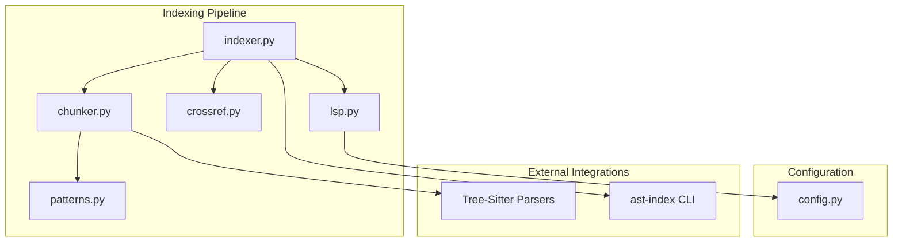
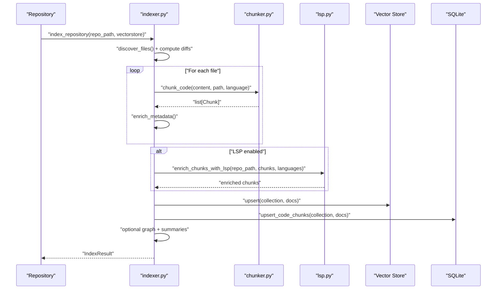
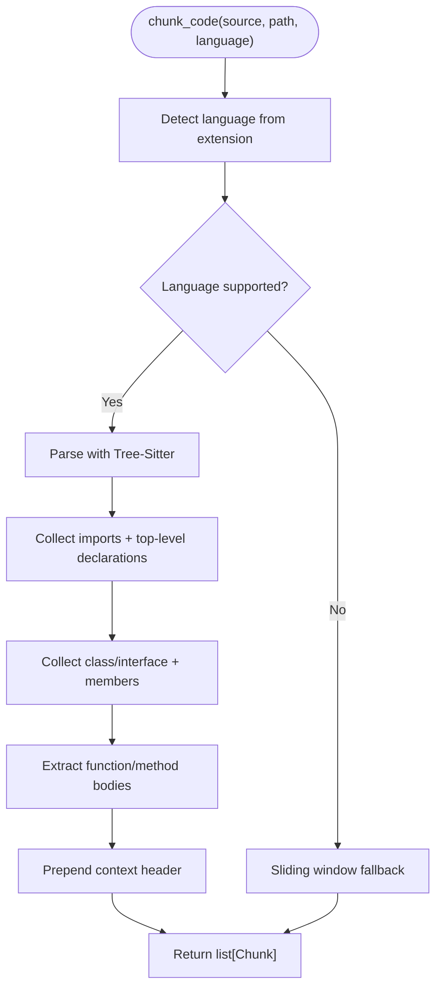
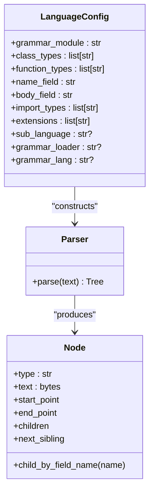
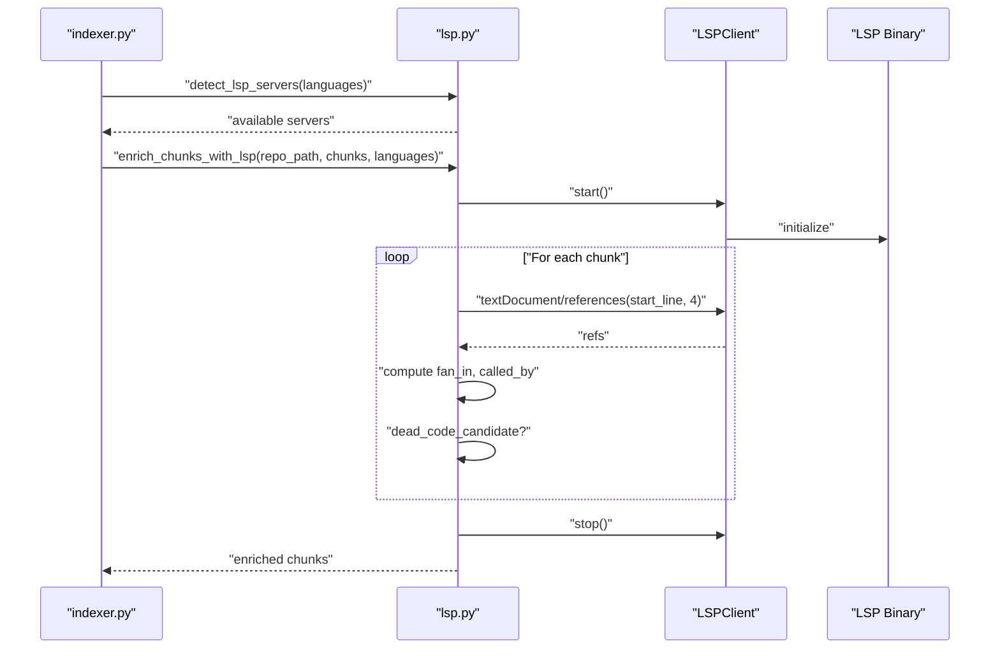
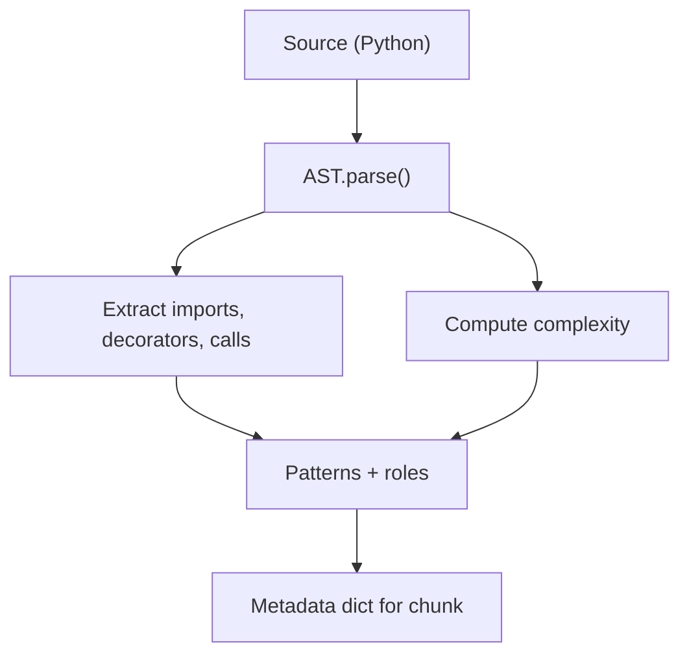
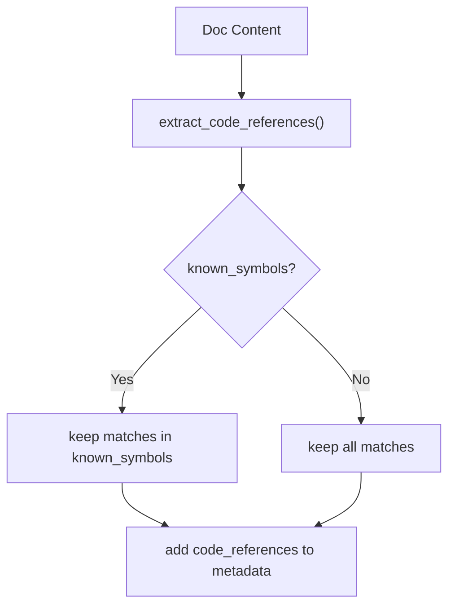
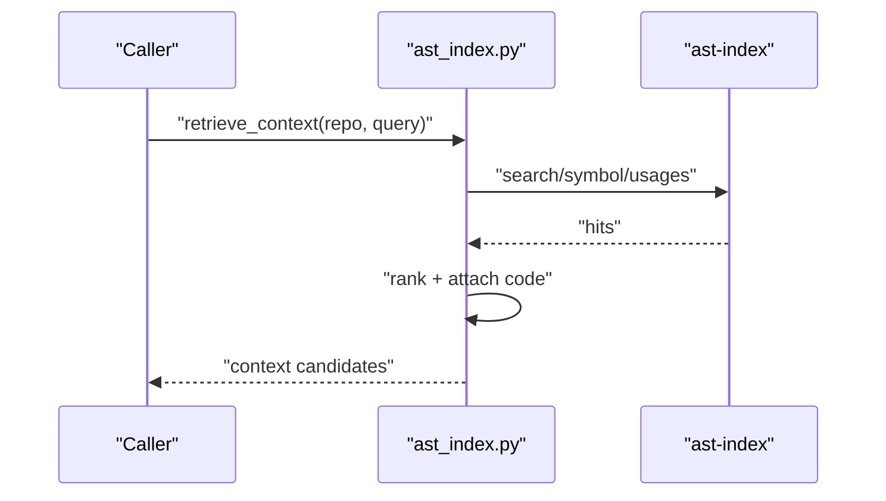
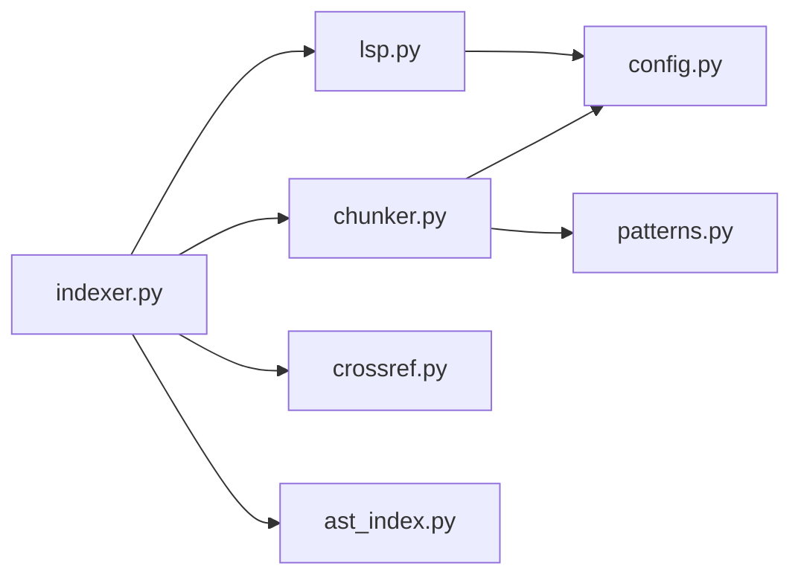

# Code Chunking and Parsing

<cite>
**Referenced Files in This Document**
- [chunker.py](file://src/rag/core/chunker.py)
- [indexer.py](file://src/rag/core/indexer.py)
- [lsp.py](file://src/rag/core/lsp.py)
- [patterns.py](file://src/rag/core/patterns.py)
- [crossref.py](file://src/rag/core/crossref.py)
- [ast_index.py](file://src/rag/core/ast_index.py)
- [config.py](file://src/rag/config.py)
- [test_chunker.py](file://tests/test_chunker.py)
</cite>

## Table of Contents
1. [Introduction](#introduction)
2. [Project Structure](#project-structure)
3. [Core Components](#core-components)
4. [Architecture Overview](#architecture-overview)
5. [Detailed Component Analysis](#detailed-component-analysis)
6. [Dependency Analysis](#dependency-analysis)
7. [Performance Considerations](#performance-considerations)
8. [Troubleshooting Guide](#troubleshooting-guide)
9. [Conclusion](#conclusion)
10. [Appendices](#appendices)

## Introduction
This document explains the code chunking and parsing strategies used to enable multi-language retrieval-augmented generation (RAG) over source code. It focuses on:
- A three-tier chunking approach (file/class/function granularity)
- AST-based analysis powered by Tree-Sitter for semantic understanding
- LSP integration for symbol resolution and cross-file references
- Chunk boundary detection, context preservation, language-specific parsing rules, and cross-reference generation
- Practical configuration examples and integration patterns

## Project Structure
The chunking and parsing pipeline spans several modules:
- Core chunking and language configuration
- Indexing orchestration and batching
- LSP-based enrichment
- Pattern detection and metadata enrichment
- Cross-document code reference extraction
- Optional AST-index integration for precise symbol lookups

**Diagram sources**
- [indexer.py:242-550](file://src/rag/core/indexer.py#L242-L550)
- [chunker.py:385-443](file://src/rag/core/chunker.py#L385-L443)
- [lsp.py:313-403](file://src/rag/core/lsp.py#L313-L403)
- [patterns.py:164-349](file://src/rag/core/patterns.py#L164-L349)
- [crossref.py:29-76](file://src/rag/core/crossref.py#L29-L76)
- [config.py:112-130](file://src/rag/config.py#L112-L130)

**Section sources**
- [indexer.py:242-550](file://src/rag/core/indexer.py#L242-L550)
- [chunker.py:190-336](file://src/rag/core/chunker.py#L190-L336)
- [lsp.py:25-76](file://src/rag/core/lsp.py#L25-L76)
- [patterns.py:1-64](file://src/rag/core/patterns.py#L1-L64)
- [crossref.py:1-26](file://src/rag/core/crossref.py#L1-L26)
- [config.py:112-130](file://src/rag/config.py#L112-L130)

## Core Components
- Three-tier chunking: file-level summaries, class-level declarations, and function-level bodies with contextual headers
- Language-agnostic Tree-Sitter parsers with language-specific grammars and node-name resolution
- LSP-driven enrichment for fan-in/out, dead-code detection, and cross-file references
- Pattern detection for Python to enrich metadata with design patterns, complexity, and domain layers
- Cross-reference extraction from documentation to code symbols

Key responsibilities:
- chunker.py: AST traversal, chunk boundaries, context headers, fallback sliding window
- indexer.py: discovery, batching, upsert, and optional graph/summaries post-processing
- lsp.py: dynamic LSP server detection, JSON-RPC client, and enrichment
- patterns.py: Python AST-based pattern detection and quality signals
- crossref.py: documentation-to-code symbol references
- ast_index.py: optional external CLI for precise symbol and usage lookups

**Section sources**
- [chunker.py:25-82](file://src/rag/core/chunker.py#L25-L82)
- [indexer.py:242-550](file://src/rag/core/indexer.py#L242-L550)
- [lsp.py:120-194](file://src/rag/core/lsp.py#L120-L194)
- [patterns.py:164-349](file://src/rag/core/patterns.py#L164-L349)
- [crossref.py:29-76](file://src/rag/core/crossref.py#L29-L76)
- [ast_index.py:77-146](file://src/rag/core/ast_index.py#L77-L146)

## Architecture Overview
The indexing pipeline orchestrates chunking, enrichment, and persistence.

**Diagram sources**
- [indexer.py:242-550](file://src/rag/core/indexer.py#L242-L550)
- [chunker.py:385-443](file://src/rag/core/chunker.py#L385-L443)
- [lsp.py:313-403](file://src/rag/core/lsp.py#L313-L403)

## Detailed Component Analysis

### Three-Tier Chunking Strategy
- Tier 1 (File summary): Top-level imports and high-level declarations (classes/functions) to provide topical orientation
- Tier 2 (Class summary): Class/interface signatures and member signatures for structural context
- Tier 3 (Function detail): Full function/method bodies with a contextual header indicating file, parent class, and language

Implementation highlights:
- Language configuration defines grammar modules, node types for classes/functions, and name/body fields
- Tree-Sitter parsing yields an AST; traversal collects nodes by type and extracts names and text
- Context headers are prepended to function chunks to preserve provenance and scope
- Fallback to sliding-window chunks when parsing fails or language is unsupported

**Diagram sources**
- [chunker.py:385-443](file://src/rag/core/chunker.py#L385-L443)
- [chunker.py:458-536](file://src/rag/core/chunker.py#L458-L536)
- [chunker.py:588-613](file://src/rag/core/chunker.py#L588-L613)

**Section sources**
- [chunker.py:190-336](file://src/rag/core/chunker.py#L190-L336)
- [chunker.py:377-383](file://src/rag/core/chunker.py#L377-L383)
- [chunker.py:385-443](file://src/rag/core/chunker.py#L385-L443)
- [chunker.py:458-536](file://src/rag/core/chunker.py#L458-L536)
- [chunker.py:588-613](file://src/rag/core/chunker.py#L588-L613)
- [test_chunker.py:95-139](file://tests/test_chunker.py#L95-L139)

### Language-Specific Parsing Rules and AST Traversal
- Language configuration maps file extensions to Tree-Sitter grammars and node types
- Name resolution varies by language (e.g., "name" field vs. "simple_identifier", "declarator")
- Special handling for Dart’s split signature/body nodes
- Import statements are extracted for file-level summaries

**Diagram sources**
- [chunker.py:190-336](file://src/rag/core/chunker.py#L190-L336)
- [chunker.py:339-374](file://src/rag/core/chunker.py#L339-L374)
- [chunker.py:508-517](file://src/rag/core/chunker.py#L508-L517)

**Section sources**
- [chunker.py:190-336](file://src/rag/core/chunker.py#L190-L336)
- [chunker.py:339-374](file://src/rag/core/chunker.py#L339-L374)
- [chunker.py:508-517](file://src/rag/core/chunker.py#L508-L517)

### LSP Integration for Symbol Resolution and Cross-References
- Detects installed LSP servers per language and starts them at index time
- Queries references and definitions to compute fan-in and “called by” lists
- Flags potential dead code for public functions with zero references
- Cleans up servers after enrichment

**Diagram sources**
- [lsp.py:100-117](file://src/rag/core/lsp.py#L100-L117)
- [lsp.py:120-194](file://src/rag/core/lsp.py#L120-L194)
- [lsp.py:313-403](file://src/rag/core/lsp.py#L313-L403)

**Section sources**
- [lsp.py:25-76](file://src/rag/core/lsp.py#L25-L76)
- [lsp.py:100-117](file://src/rag/core/lsp.py#L100-L117)
- [lsp.py:120-194](file://src/rag/core/lsp.py#L120-L194)
- [lsp.py:313-403](file://src/rag/core/lsp.py#L313-L403)

### Pattern Detection and Metadata Enrichment (Python)
- Extracts design patterns, complexity metrics, concurrency indicators, and domain/layer hints
- Uses AST to compute cyclomatic and cognitive complexity
- Detects unit test presence and decorator tags

**Diagram sources**
- [patterns.py:164-349](file://src/rag/core/patterns.py#L164-L349)

**Section sources**
- [patterns.py:164-349](file://src/rag/core/patterns.py#L164-L349)

### Cross-Reference Generation (Documentation)
- Detects code references in markdown/text via regex patterns
- Filters to known symbols to reduce noise
- Stores references in chunk metadata for cross-modal retrieval

**Diagram sources**
- [crossref.py:29-76](file://src/rag/core/crossref.py#L29-L76)

**Section sources**
- [crossref.py:1-90](file://src/rag/core/crossref.py#L1-L90)

### Optional AST-Index Adapter
- Provides symbol, search, usage, and call-tree queries via an external CLI
- Returns context candidates with scores and compact code slices
- Useful for developer navigation and exact symbol lookups

**Diagram sources**
- [ast_index.py:77-146](file://src/rag/core/ast_index.py#L77-L146)
- [ast_index.py:340-387](file://src/rag/core/ast_index.py#L340-L387)

**Section sources**
- [ast_index.py:77-146](file://src/rag/core/ast_index.py#L77-L146)
- [ast_index.py:340-387](file://src/rag/core/ast_index.py#L340-L387)

## Dependency Analysis
- chunker.py depends on Tree-Sitter grammars and language configuration
- indexer.py orchestrates chunking, enrichment, and persistence
- lsp.py depends on config for timeouts and on external LSP binaries
- patterns.py depends on Python AST
- crossref.py depends on regex patterns
- ast_index.py depends on an external CLI

**Diagram sources**
- [indexer.py:242-550](file://src/rag/core/indexer.py#L242-L550)
- [chunker.py:385-443](file://src/rag/core/chunker.py#L385-L443)
- [lsp.py:313-403](file://src/rag/core/lsp.py#L313-L403)
- [patterns.py:164-349](file://src/rag/core/patterns.py#L164-L349)
- [crossref.py:29-76](file://src/rag/core/crossref.py#L29-L76)
- [ast_index.py:77-146](file://src/rag/core/ast_index.py#L77-L146)
- [config.py:112-130](file://src/rag/config.py#L112-L130)

**Section sources**
- [indexer.py:242-550](file://src/rag/core/indexer.py#L242-L550)
- [chunker.py:385-443](file://src/rag/core/chunker.py#L385-L443)
- [lsp.py:313-403](file://src/rag/core/lsp.py#L313-L403)
- [patterns.py:164-349](file://src/rag/core/patterns.py#L164-L349)
- [crossref.py:29-76](file://src/rag/core/crossref.py#L29-L76)
- [ast_index.py:77-146](file://src/rag/core/ast_index.py#L77-L146)
- [config.py:112-130](file://src/rag/config.py#L112-L130)

## Performance Considerations
- Chunk size is configurable and enforced per-language to balance recall and embedding cost
- Sliding-window fallback ensures robustness when parsing fails
- Batched upsert minimizes database and vector store overhead
- Optional LSP enrichment adds latency; controlled by settings and timeouts
- Graph and summaries are rebuilt incrementally to avoid full recomputation

[No sources needed since this section provides general guidance]

## Troubleshooting Guide
Common issues and mitigations:
- Unknown language or missing grammar: falls back to sliding-window chunks
- LSP server not found or failing to start: enrichment skipped with warnings
- Parsing errors: logs warnings and falls back to sliding window
- Dead code detection: flagged when public functions have zero references

**Section sources**
- [chunker.py:401-403](file://src/rag/core/chunker.py#L401-L403)
- [lsp.py:172-174](file://src/rag/core/lsp.py#L172-L174)
- [lsp.py:390-393](file://src/rag/core/lsp.py#L390-L393)

## Conclusion
The system combines Tree-Sitter-powered AST parsing with language-specific rules, LSP-based enrichment, and pattern detection to produce semantically meaningful chunks across many programming languages. The three-tier strategy balances coarse-grained orientation with fine-grained function details, while optional integrations (LSP and AST-index) enhance precision for developer navigation and retrieval.

[No sources needed since this section summarizes without analyzing specific files]

## Appendices

### Example Chunking Configurations
- Language configuration keys:
  - Grammar module or loader
  - Class and function node types
  - Name/body fields
  - Import node types
  - Supported extensions
  - Sub-language for TypeScript
- Settings:
  - Maximum chunk size
  - Retrieval top-k
  - Skip directories
  - LSP timeout and enable flag

**Section sources**
- [chunker.py:190-336](file://src/rag/core/chunker.py#L190-L336)
- [config.py:83-130](file://src/rag/config.py#L83-L130)

### Integration Notes
- Tree-Sitter grammars are dynamically imported; some languages use a community pack
- LSP binaries are discovered via PATH; startup and shutdown are managed per language
- Pattern detection is Python-specific and attached to chunk metadata
- Cross-reference extraction is useful for documentation indexing

**Section sources**
- [chunker.py:314-336](file://src/rag/core/chunker.py#L314-L336)
- [lsp.py:100-117](file://src/rag/core/lsp.py#L100-L117)
- [patterns.py:164-349](file://src/rag/core/patterns.py#L164-L349)
- [crossref.py:29-76](file://src/rag/core/crossref.py#L29-L76)