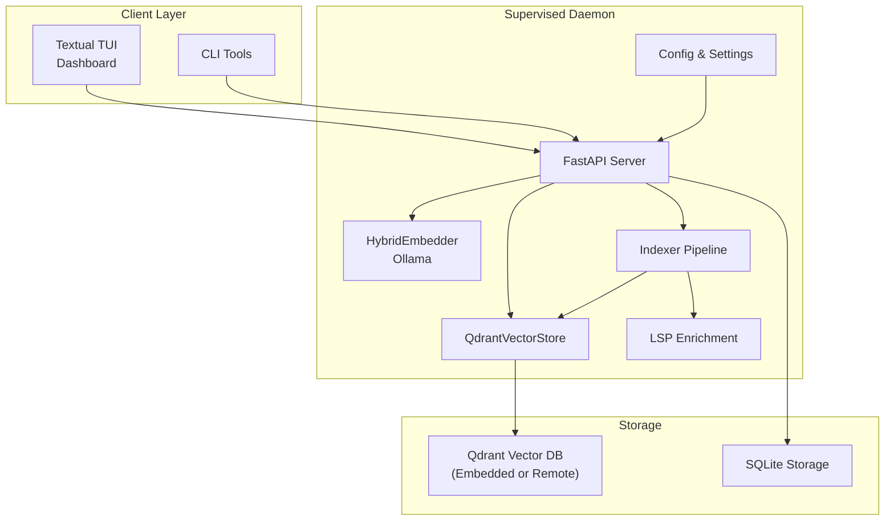
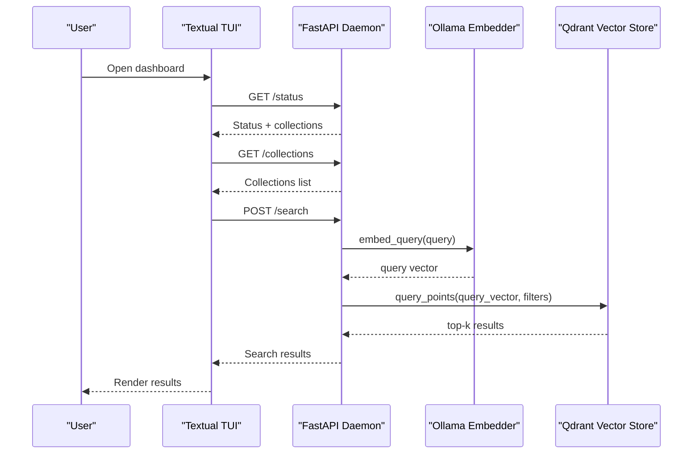
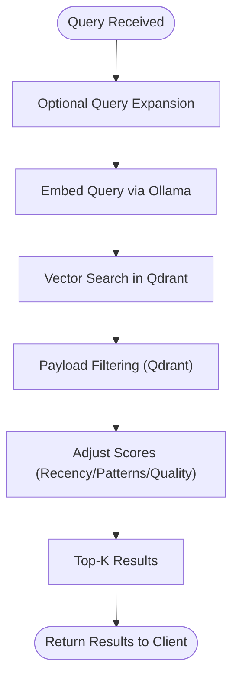
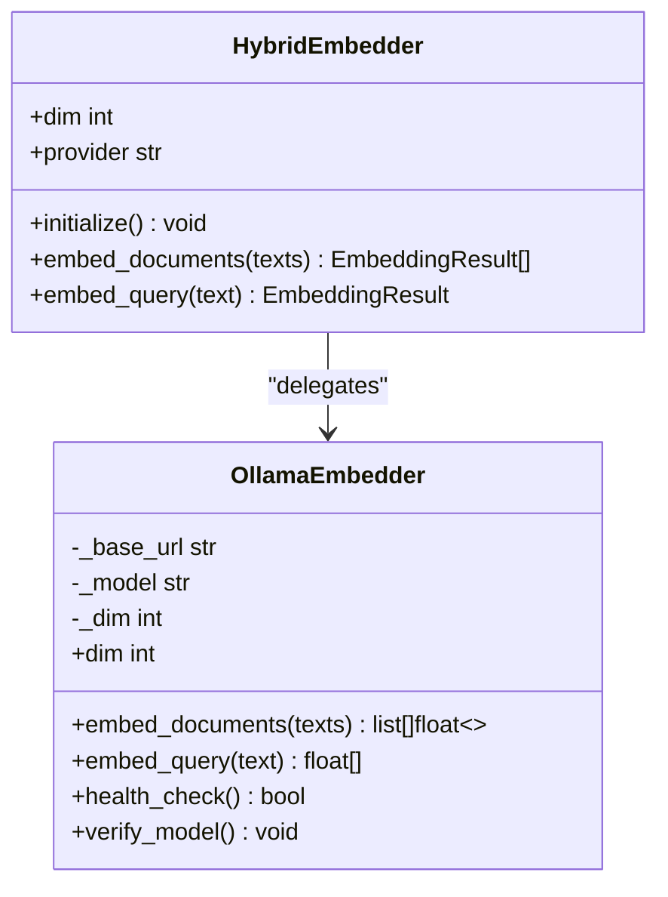
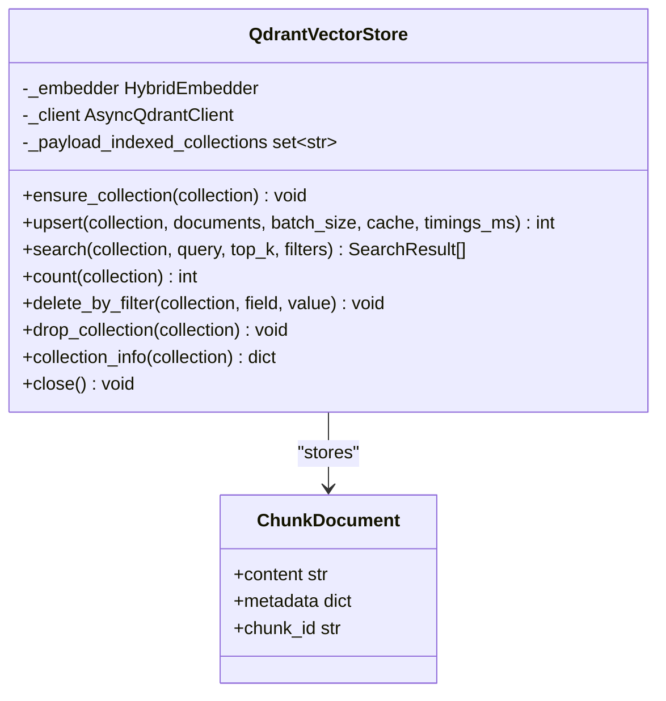
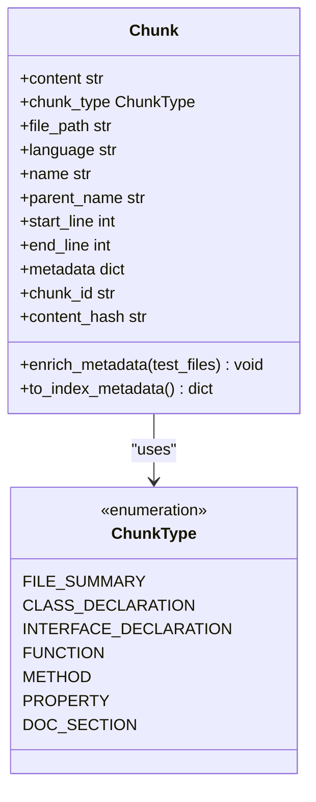
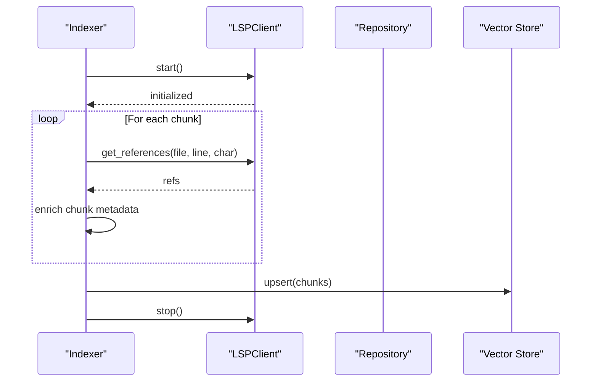
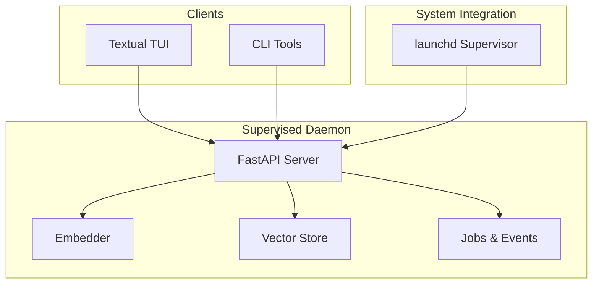
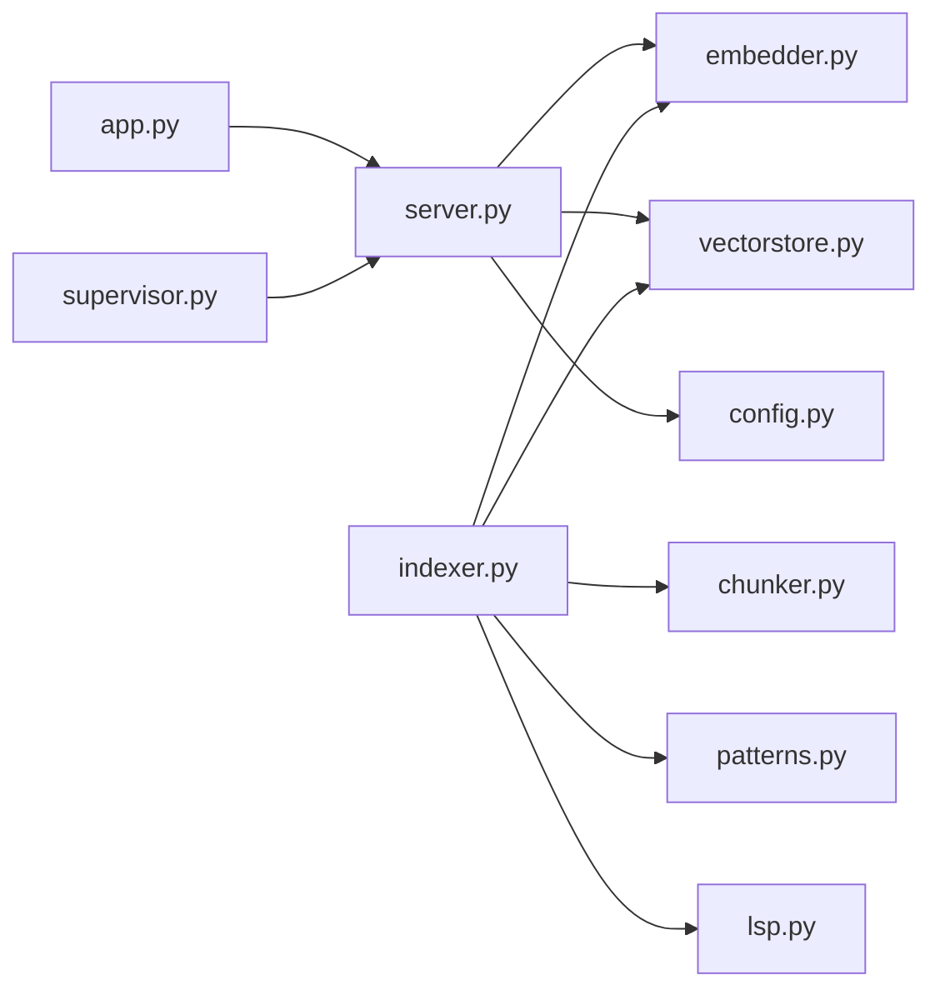

# Core Concepts

<cite>
**Referenced Files in This Document**
- [README.md](file://README.md)
- [server.py](file://src/rag/server.py)
- [app.py](file://src/rag/app.py)
- [chunker.py](file://src/rag/core/chunker.py)
- [embedder.py](file://src/rag/core/embedder.py)
- [vectorstore.py](file://src/rag/core/vectorstore.py)
- [lsp.py](file://src/rag/core/lsp.py)
- [indexer.py](file://src/rag/core/indexer.py)
- [scoring.py](file://src/rag/core/scoring.py)
- [patterns.py](file://src/rag/core/patterns.py)
- [config.py](file://src/rag/config.py)
- [supervisor.py](file://src/rag/integration/supervisor.py)
- [query.py](file://src/rag/core/query.py)
</cite>

## Table of Contents
1. [Introduction](#introduction)
2. [Project Structure](#project-structure)
3. [Core Components](#core-components)
4. [Architecture Overview](#architecture-overview)
5. [Detailed Component Analysis](#detailed-component-analysis)
6. [Dependency Analysis](#dependency-analysis)
7. [Performance Considerations](#performance-considerations)
8. [Troubleshooting Guide](#troubleshooting-guide)
9. [Conclusion](#conclusion)

## Introduction
This document explains the core concepts of the Retrieval-Augmented Generation (RAG) system, focusing on fundamentals and the system architecture. It covers:
- Retrieval-Augmented Generation principles and how they apply to code search
- Dense vector embeddings via Ollama and the vector database backend
- Multi-strategy search approach (dense vector search)
- Code-aware chunking using Tree-Sitter for 3-tier granularity across multiple programming languages
- The daemon-client architecture, supervised process model, and zero-query-path overhead LSP enrichment

The content balances beginner-friendly explanations with technical details for experienced developers, consistently using terminology from the codebase such as "daemon," "chunking," "collections," and "supervised."

## Project Structure
The system is organized around a headless FastAPI daemon that serves as the supervised process, with a separate read-only Textual TUI acting as a thin HTTP client. The daemon manages indexing, embedding, vector storage, and search, while the TUI provides a dashboard for monitoring and interacting with the daemon.

**Diagram sources**
- [server.py:603-716](file://src/rag/server.py#L603-L716)
- [app.py:156-289](file://src/rag/app.py#L156-L289)
- [indexer.py:242-550](file://src/rag/core/indexer.py#L242-L550)
- [vectorstore.py:199-530](file://src/rag/core/vectorstore.py#L199-L530)
- [embedder.py:48-245](file://src/rag/core/embedder.py#L48-L245)
- [lsp.py:120-404](file://src/rag/core/lsp.py#L120-L404)
- [config.py:150-194](file://src/rag/config.py#L150-L194)

**Section sources**
- [README.md:67-74](file://README.md#L67-L74)
- [server.py:603-716](file://src/rag/server.py#L603-L716)
- [app.py:156-289](file://src/rag/app.py#L156-L289)
- [config.py:150-194](file://src/rag/config.py#L150-L194)

## Core Components
This section introduces the fundamental building blocks of the RAG system and how they work together.

- Retrieval-Augmented Generation (RAG) fundamentals
  - RAG augments downstream generation with retrieved context from a vector store. In this codebase, retrieval is dense vector search over code chunks, with optional lexical filtering and scoring adjustments.
  - The system emphasizes zero-query-path overhead: enrichment occurs at index time, not at query time.

- Dense embeddings via Ollama
  - The embedder uses Qwen3-Embedding through Ollama, with instruction prefixes for documents and queries. The embedder batches requests and retries with exponential backoff to handle transient failures.

- Vector database and collections
  - Qdrant is used as the vector store. Collections are created per repository or document set, with payload indexes for efficient filtering. The system maintains dimensional consistency between the embedder and the collection.

- Code-aware chunking with Tree-Sitter
  - The chunker applies a 3-tier strategy: file-level summaries, class-level declarations, and function-level bodies. It supports multiple languages and enriches chunks with metadata (e.g., patterns, quality signals).

- LSP enrichment (index-time only)
  - During indexing, the system starts language servers and enriches chunks with references, definitions, implementations, and quality signals. This ensures zero overhead at query time.

- Daemon-client architecture and supervised process model
  - The FastAPI server runs as a supervised daemon. The TUI is a read-only client that polls the daemon for state and renders results. A macOS supervisor integrates with launchd for auto-start and restart on crash.

**Section sources**
- [README.md:5-7](file://README.md#L5-L7)
- [embedder.py:48-245](file://src/rag/core/embedder.py#L48-L245)
- [vectorstore.py:199-530](file://src/rag/core/vectorstore.py#L199-L530)
- [chunker.py:25-622](file://src/rag/core/chunker.py#L25-L622)
- [lsp.py:120-404](file://src/rag/core/lsp.py#L120-L404)
- [supervisor.py:1-153](file://src/rag/integration/supervisor.py#L1-L153)

## Architecture Overview
The system follows a clear separation of concerns:
- The daemon is the supervised process responsible for indexing, embedding, vector storage, and serving search results.
- The TUI is a read-only client that polls the daemon for status, collections, and recent activity.
- The CLI interacts with the daemon via HTTP endpoints for search, indexing, and administrative tasks.
- Optional LSP enrichment runs during indexing to improve recall and quality signals without affecting query latency.

**Diagram sources**
- [server.py:33-68](file://src/rag/server.py#L33-L68)
- [server.py:424-466](file://src/rag/server.py#L424-L466)
- [embedder.py:65-72](file://src/rag/core/embedder.py#L65-L72)
- [vectorstore.py:424-466](file://src/rag/core/vectorstore.py#L424-L466)
- [app.py:722-772](file://src/rag/app.py#L722-L772)

**Section sources**
- [README.md:67-74](file://README.md#L67-L74)
- [server.py:603-716](file://src/rag/server.py#L603-L716)
- [app.py:156-289](file://src/rag/app.py#L156-L289)

## Detailed Component Analysis

### Retrieval-Augmented Generation Principles
- Purpose: Augment downstream generation with relevant code context retrieved from a vector store.
- In this codebase: retrieval is dense vector search over code chunks. Lexical filtering and payload indexes enable precise targeting. Scoring adjusts base scores by recency, pattern relevance, and code quality signals.
- Zero-query-path overhead: enrichment (e.g., LSP-derived metadata) is computed at index time, not at query time.

**Diagram sources**
- [query.py:31-52](file://src/rag/core/query.py#L31-L52)
- [embedder.py:65-72](file://src/rag/core/embedder.py#L65-L72)
- [vectorstore.py:424-466](file://src/rag/core/vectorstore.py#L424-L466)
- [scoring.py:31-57](file://src/rag/core/scoring.py#L31-L57)

**Section sources**
- [README.md:5](file://README.md#L5)
- [query.py:31-52](file://src/rag/core/query.py#L31-L52)
- [scoring.py:31-143](file://src/rag/core/scoring.py#L31-L143)

### Dense Embeddings via Ollama
- Provider: Ollama with Qwen3-Embedding model.
- Batch processing: The embedder batches multiple texts per request to reduce overhead.
- Retry strategy: Exponential backoff with jitter and a hard cap on retry duration.
- Health checks: Verify model availability and warm-up measurements for steady-state latency reporting.

**Diagram sources**
- [embedder.py:189-245](file://src/rag/core/embedder.py#L189-L245)
- [embedder.py:48-165](file://src/rag/core/embedder.py#L48-L165)

**Section sources**
- [embedder.py:48-245](file://src/rag/core/embedder.py#L48-L245)
- [config.py:53-62](file://src/rag/config.py#L53-L62)

### Vector Database and Collections
- Backend: Qdrant (embedded or remote).
- Collections: One per repository or document set. Each collection stores dense vectors and payload metadata.
- Payload indexes: Created on demand for efficient filtering by language, chunk type, patterns, and quality signals.
- Upsert pipeline: Embeddings are computed, cached, and upserted in batches. Dimension consistency is enforced.

**Diagram sources**
- [vectorstore.py:199-530](file://src/rag/core/vectorstore.py#L199-L530)

**Section sources**
- [vectorstore.py:199-530](file://src/rag/core/vectorstore.py#L199-L530)
- [config.py:64-81](file://src/rag/config.py#L64-L81)

### Code-Aware Chunking with Tree-Sitter
- Strategy: 3-tier chunking across multiple languages.
  - Tier 1: File summary (imports, top-level signatures).
  - Tier 2: Class/Interface declarations (signatures and member summaries).
  - Tier 3: Function/Method bodies (with context header).
- Language support: Python, Java, Kotlin, TypeScript/JavaScript, Go, Rust, C/C++, Dart.
- Metadata enrichment: Patterns, quality signals, coroutine/suspend usage, and more.
- Fallback: Sliding window chunking if Tree-Sitter parsing fails.

**Diagram sources**
- [chunker.py:35-82](file://src/rag/core/chunker.py#L35-L82)
- [chunker.py:25-33](file://src/rag/core/chunker.py#L25-L33)

**Section sources**
- [chunker.py:25-622](file://src/rag/core/chunker.py#L25-L622)
- [patterns.py:164-349](file://src/rag/core/patterns.py#L164-L349)

### LSP Enrichment (Index-Time Only)
- Purpose: Improve recall and quality by adding type resolution, call graphs, and cross-file references.
- Scope: Index-time only. No overhead at query time.
- Process: Detect installed LSP servers, start them, query for references/definitions/implementations, then shut down.

**Diagram sources**
- [lsp.py:120-404](file://src/rag/core/lsp.py#L120-L404)
- [indexer.py:666-677](file://src/rag/core/indexer.py#L666-L677)

**Section sources**
- [lsp.py:120-404](file://src/rag/core/lsp.py#L120-L404)
- [indexer.py:666-677](file://src/rag/core/indexer.py#L666-L677)

### Daemon-Client Architecture and Supervised Process Model
- Daemon: Headless FastAPI server on localhost with bearer token authentication. It initializes the embedder and vector store, manages jobs and events, and exposes HTTP endpoints for search, indexing, and status.
- TUI: Read-only client that polls the daemon for status, collections, recent queries, and logs. It renders dashboards and allows interactive search.
- Supervisor: On macOS, the daemon can be registered as a launchd agent for auto-start and restart on crash. The TUI cannot bring down the daemon.

**Diagram sources**
- [server.py:603-716](file://src/rag/server.py#L603-L716)
- [app.py:156-289](file://src/rag/app.py#L156-L289)
- [supervisor.py:1-153](file://src/rag/integration/supervisor.py#L1-L153)

**Section sources**
- [README.md:67-74](file://README.md#L67-L74)
- [server.py:603-716](file://src/rag/server.py#L603-L716)
- [app.py:156-289](file://src/rag/app.py#L156-L289)
- [supervisor.py:1-153](file://src/rag/integration/supervisor.py#L1-L153)

## Dependency Analysis
Key dependencies and relationships:
- The server depends on the embedder and vector store for search and indexing.
- The indexer depends on the chunker, embedder, and vector store to process and persist code chunks.
- The TUI depends on the server for all state and results.
- Configuration is centralized and validated via Pydantic models.

**Diagram sources**
- [server.py:18-23](file://src/rag/server.py#L18-L23)
- [indexer.py:17-20](file://src/rag/core/indexer.py#L17-L20)
- [app.py:38-45](file://src/rag/app.py#L38-L45)
- [supervisor.py:1-153](file://src/rag/integration/supervisor.py#L1-L153)

**Section sources**
- [server.py:18-23](file://src/rag/server.py#L18-L23)
- [indexer.py:17-20](file://src/rag/core/indexer.py#L17-L20)
- [app.py:38-45](file://src/rag/app.py#L38-L45)
- [supervisor.py:1-153](file://src/rag/integration/supervisor.py#L1-L153)

## Performance Considerations
- Embedding throughput: Batch requests and warm-up probes help reduce query latency. The embedder enforces retry budgets to prevent long stalls.
- Vector search: Payload filtering is pushed into Qdrant to avoid post-filtering recall loss and to leverage payload indexes for speed.
- Indexing pipeline: Thread pool chunking, staged hashing, and batched upserts minimize contention and ensure crash consistency.
- LSP enrichment: Runs once per index run; disabled by default in some environments to balance indexing time and recall gains.

[No sources needed since this section provides general guidance]

## Troubleshooting Guide
Common issues and diagnostics:
- Daemon health: Use diagnostic commands to check Ollama availability, model presence, and LSP server detection.
- Index integrity: Verify and repair orphaned or duplicate chunks.
- Restart counting: The daemon tracks restarts to monitor stability.
- Rate limiting: The server enforces per-token rate buckets to protect the daemon.

**Section sources**
- [README.md:71-74](file://README.md#L71-L74)
- [server.py:741-789](file://src/rag/server.py#L741-L789)
- [server.py:626-642](file://src/rag/server.py#L626-L642)

## Conclusion
This RAG system combines dense vector search with code-aware chunking and index-time LSP enrichment to deliver fast, relevant code search results. The supervised daemon-client architecture ensures reliability and zero-query-path overhead, while the modular design enables easy configuration and extensibility. The codebase demonstrates practical engineering choices for production-grade code search, emphasizing correctness, performance, and maintainability.