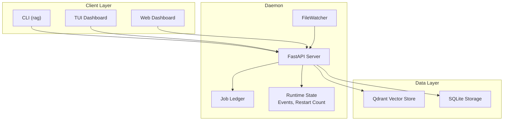
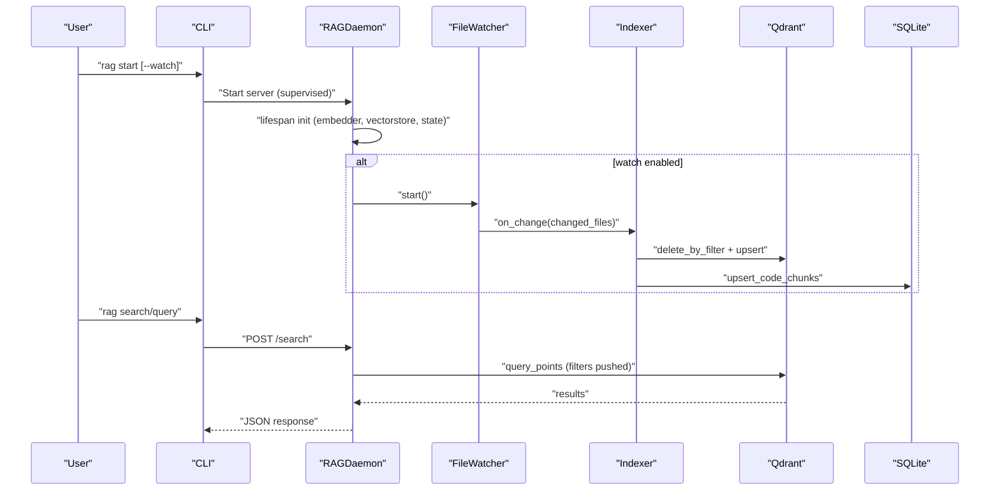
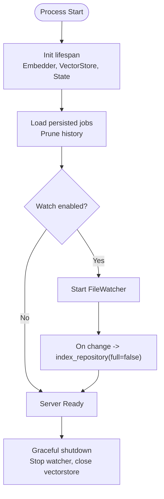
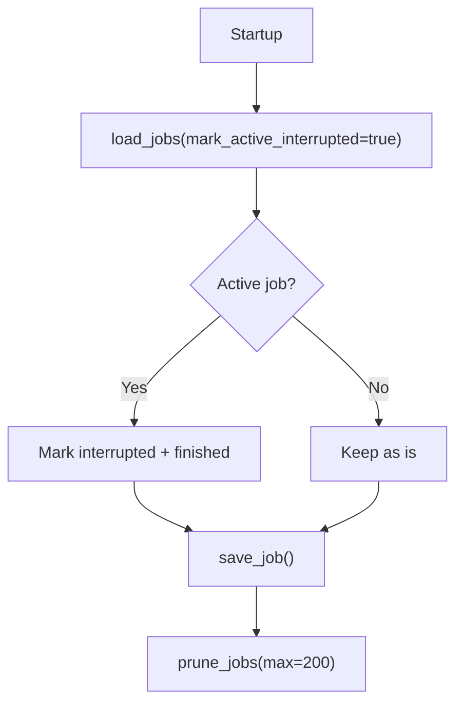
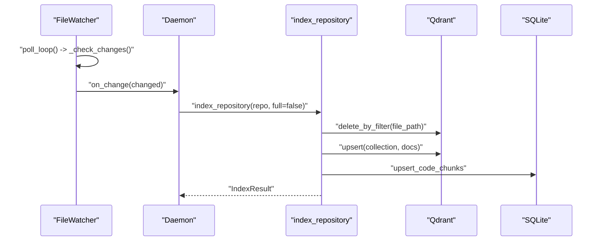
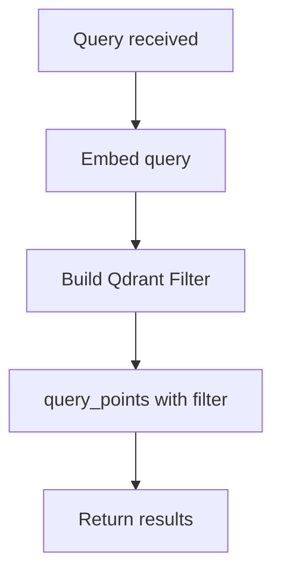
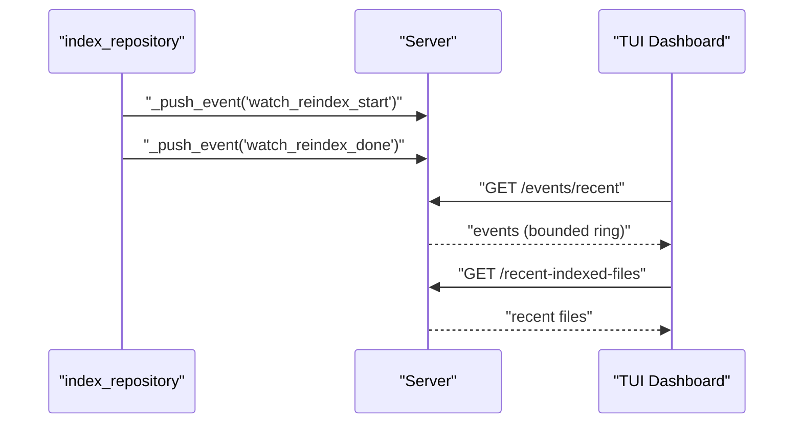
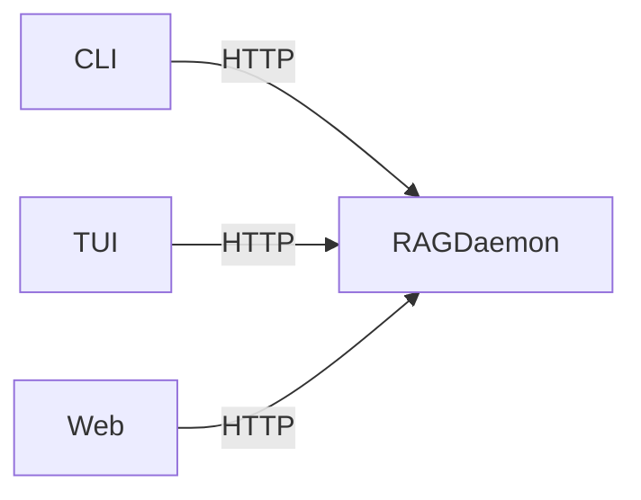
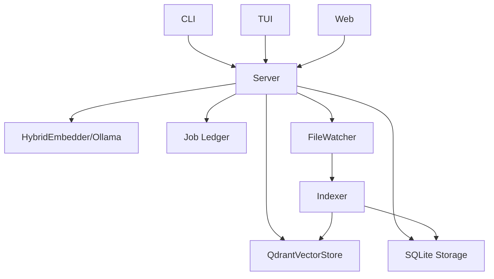

# Daemon Architecture

<cite>
**Referenced Files in This Document**
- [src/rag/server.py](file://src/rag/server.py)
- [src/rag/cli.py](file://src/rag/cli.py)
- [src/rag/app.py](file://src/rag/app.py)
- [src/rag/integration/supervisor.py](file://src/rag/integration/supervisor.py)
- [src/rag/core/jobs.py](file://src/rag/core/jobs.py)
- [src/rag/core/watcher.py](file://src/rag/core/watcher.py)
- [src/rag/core/indexer.py](file://src/rag/core/indexer.py)
- [src/rag/core/vectorstore.py](file://src/rag/core/vectorstore.py)
- [src/rag/storage/db.py](file://src/rag/storage/db.py)
- [src/rag/config.py](file://src/rag/config.py)
- [config/default.toml](file://config/default.toml)
</cite>

## Table of Contents
1. [Introduction](#introduction)
2. [Project Structure](#project-structure)
3. [Core Components](#core-components)
4. [Architecture Overview](#architecture-overview)
5. [Detailed Component Analysis](#detailed-component-analysis)
6. [Dependency Analysis](#dependency-analysis)
7. [Performance Considerations](#performance-considerations)
8. [Troubleshooting Guide](#troubleshooting-guide)
9. [Conclusion](#conclusion)
10. [Appendices](#appendices)

## Introduction
This document explains the daemon-client architecture and supervised process model of the RAG system. The RAGDaemon is a persistent background service that exposes an HTTP API for search, indexing, and status operations. Clients include a headless CLI, a TUI dashboard, and a web dashboard. The daemon integrates a file watcher for incremental re-indexing, a robust job ledger for state persistence across restarts, and a zero-query-path overhead design that minimizes latency by pushing filters into the vector database.

## Project Structure
The repository organizes the daemon around a FastAPI server, a CLI, a TUI, and supporting subsystems for indexing, vector storage, and state management. Key areas:
- Server and API: FastAPI app with routes for search, indexing, status, and monitoring
- CLI: Thin HTTP client for daemon control and operations
- TUI: Real-time dashboard that polls the daemon for status, events, and results
- Supervisor: OS-level service integration for macOS launchd
- Indexing and state: Git-based incremental indexing, per-repo state, and SQLite-backed storage
- Vector store: Qdrant-backed dense vector search with payload indexes
- Configuration: TOML-based settings with Pydantic validation

**Diagram sources**
- [src/rag/server.py:603-716](file://src/rag/server.py#L603-L716)
- [src/rag/cli.py:162-243](file://src/rag/cli.py#L162-L243)
- [src/rag/app.py:270-289](file://src/rag/app.py#L270-L289)
- [src/rag/core/watcher.py:18-84](file://src/rag/core/watcher.py#L18-L84)
- [src/rag/core/jobs.py:25-55](file://src/rag/core/jobs.py#L25-L55)
- [src/rag/core/vectorstore.py:199-295](file://src/rag/core/vectorstore.py#L199-L295)
- [src/rag/storage/db.py:40-81](file://src/rag/storage/db.py#L40-L81)

**Section sources**
- [src/rag/server.py:603-716](file://src/rag/server.py#L603-L716)
- [src/rag/cli.py:162-243](file://src/rag/cli.py#L162-L243)
- [src/rag/app.py:270-289](file://src/rag/app.py#L270-L289)
- [src/rag/core/watcher.py:18-84](file://src/rag/core/watcher.py#L18-L84)
- [src/rag/core/jobs.py:25-55](file://src/rag/core/jobs.py#L25-L55)
- [src/rag/core/vectorstore.py:199-295](file://src/rag/core/vectorstore.py#L199-L295)
- [src/rag/storage/db.py:40-81](file://src/rag/storage/db.py#L40-L81)

## Core Components
- RAGDaemon (FastAPI server): Initializes embedder, vector store, restart counter, event ring, and optional file watcher. Provides routes for search, indexing, status, and monitoring.
- CLI: Starts/stops the daemon, runs indexing, and performs queries via HTTP.
- TUI: Polls the daemon for status, events, stats, and recent queries; renders results and logs.
- Supervisor: Generates a launchd plist for macOS to run the daemon under OS supervision.
- Job Ledger: Persists job state to JSON files under ~/.rag/jobs with automatic cleanup and restart-interruption marking.
- File Watcher: Polls repository for mtime changes and triggers incremental re-indexing.
- Indexer: Performs incremental git-based indexing with crash-consistent state, per-repo advisory locks, and SQLite mirroring for exact/lexical search.
- Vector Store: Qdrant-backed dense-only search with payload indexes and filter pushdown.
- Storage: SQLite tables for query logs, index runs, overview stats, rate buckets, and a mirrored exact/lexical index.

**Section sources**
- [src/rag/server.py:603-716](file://src/rag/server.py#L603-L716)
- [src/rag/cli.py:162-243](file://src/rag/cli.py#L162-L243)
- [src/rag/app.py:270-289](file://src/rag/app.py#L270-L289)
- [src/rag/integration/supervisor.py:46-111](file://src/rag/integration/supervisor.py#L46-L111)
- [src/rag/core/jobs.py:25-55](file://src/rag/core/jobs.py#L25-L55)
- [src/rag/core/watcher.py:18-84](file://src/rag/core/watcher.py#L18-L84)
- [src/rag/core/indexer.py:242-550](file://src/rag/core/indexer.py#L242-L550)
- [src/rag/core/vectorstore.py:199-295](file://src/rag/core/vectorstore.py#L199-L295)
- [src/rag/storage/db.py:40-81](file://src/rag/storage/db.py#L40-L81)

## Architecture Overview
The daemon is a supervised process managed by launchd on macOS. It initializes shared resources at startup, starts a file watcher if configured, and serves HTTP endpoints. Clients (CLI/TUI/Web) communicate over HTTP with bearer token authentication. The server maintains in-memory runtime state (events, restart count) and persists job state to disk. Indexing is performed by the indexer with crash-consistency guarantees and incremental semantics.

**Diagram sources**
- [src/rag/cli.py:162-243](file://src/rag/cli.py#L162-L243)
- [src/rag/server.py:603-716](file://src/rag/server.py#L603-L716)
- [src/rag/core/watcher.py:50-83](file://src/rag/core/watcher.py#L50-L83)
- [src/rag/core/indexer.py:242-550](file://src/rag/core/indexer.py#L242-L550)
- [src/rag/core/vectorstore.py:424-465](file://src/rag/core/vectorstore.py#L424-L465)

## Detailed Component Analysis

### RAGDaemon (Supervised Process Model)
- Supervision: The CLI’s start command optionally sets RAG_WATCH_PATH and runs the FastAPI app under uvicorn. On macOS, the supervisor module generates a launchd plist to keep the daemon alive.
- Initialization: During lifespan, the daemon initializes the hybrid embedder, ensures Qdrant collection existence, primes payload indexes (when applicable), loads persisted jobs, prunes old job history, and starts periodic tasks.
- Shutdown: Stops the file watcher and closes the vector store gracefully.
- Authentication: Routes enforce bearer token auth; CSRF guard middleware enforces localhost origin for non-GET requests when Origin is present.
- Rate limiting: Token-bucket middleware protects the daemon from excessive polling.

**Diagram sources**
- [src/rag/server.py:603-716](file://src/rag/server.py#L603-L716)
- [src/rag/cli.py:216-243](file://src/rag/cli.py#L216-L243)
- [src/rag/integration/supervisor.py:46-111](file://src/rag/integration/supervisor.py#L46-L111)

**Section sources**
- [src/rag/server.py:603-716](file://src/rag/server.py#L603-L716)
- [src/rag/cli.py:162-243](file://src/rag/cli.py#L162-L243)
- [src/rag/integration/supervisor.py:46-111](file://src/rag/integration/supervisor.py#L46-L111)

### Job Ledger and State Management
- Persistence: Jobs are stored as JSON files under ~/.rag/jobs with atomic writes. Each job includes job_id, updated_at, and status.
- Lifecycle: On startup, active jobs are marked interrupted and finished to reflect restarts. Jobs are pruned to a maximum count to prevent unbounded growth.
- Usage: The server persists job updates and exposes them via the in-memory state.

**Diagram sources**
- [src/rag/core/jobs.py:37-55](file://src/rag/core/jobs.py#L37-L55)
- [src/rag/server.py:621-622](file://src/rag/server.py#L621-L622)

**Section sources**
- [src/rag/core/jobs.py:25-68](file://src/rag/core/jobs.py#L25-L68)
- [src/rag/server.py:621-622](file://src/rag/server.py#L621-L622)

### File Watching and Incremental Re-indexing
- Polling: FileWatcher periodically scans the repository for mtime changes, detects new/modified/deleted files, and coalesces changes into batches.
- Dispatch: A single-flight dispatch worker ensures callbacks do not overlap; rapid bursts collapse into a small number of callbacks.
- Trigger: When changes are detected, the daemon’s watcher invokes index_repository with full=false to re-index only changed files and delete removed chunks.

**Diagram sources**
- [src/rag/core/watcher.py:110-184](file://src/rag/core/watcher.py#L110-L184)
- [src/rag/server.py:674-687](file://src/rag/server.py#L674-L687)
- [src/rag/core/indexer.py:242-550](file://src/rag/core/indexer.py#L242-L550)
- [src/rag/core/vectorstore.py:476-495](file://src/rag/core/vectorstore.py#L476-L495)
- [src/rag/storage/db.py:151-226](file://src/rag/storage/db.py#L151-L226)

**Section sources**
- [src/rag/core/watcher.py:18-184](file://src/rag/core/watcher.py#L18-L184)
- [src/rag/server.py:664-694](file://src/rag/server.py#L664-L694)
- [src/rag/core/indexer.py:242-550](file://src/rag/core/indexer.py#L242-L550)

### Zero-Query-Path Overhead Design
- Filter pushdown: Vector search pushes filters into Qdrant via query_filter, avoiding post-filtering and preserving recall.
- Dense-only search: Removes prefetch stages; a single dense query_points call retrieves top-k results.
- Payload indexes: Pre-created indexes accelerate filter evaluation in Qdrant.

**Diagram sources**
- [src/rag/core/vectorstore.py:424-465](file://src/rag/core/vectorstore.py#L424-L465)
- [src/rag/core/vectorstore.py:119-156](file://src/rag/core/vectorstore.py#L119-L156)

**Section sources**
- [src/rag/core/vectorstore.py:424-465](file://src/rag/core/vectorstore.py#L424-L465)
- [src/rag/core/vectorstore.py:119-156](file://src/rag/core/vectorstore.py#L119-L156)

### Real-time Indexing and Event-driven Processing
- Event ring: The server maintains a bounded ring buffer of recent events appended by _push_event. The TUI polls /events/recent and streams deltas to the UI.
- Recent files: A bounded ring tracks recently indexed files for quick UI updates.
- Warm probe: A background task periodically probes the embedder to measure steady-state latency.

**Diagram sources**
- [src/rag/server.py:558-577](file://src/rag/server.py#L558-L577)
- [src/rag/server.py:645-655](file://src/rag/server.py#L645-L655)
- [src/rag/app.py:592-631](file://src/rag/app.py#L592-L631)

**Section sources**
- [src/rag/server.py:558-577](file://src/rag/server.py#L558-L577)
- [src/rag/server.py:645-655](file://src/rag/server.py#L645-L655)
- [src/rag/app.py:592-631](file://src/rag/app.py#L592-L631)

### CLI, TUI, and Web Dashboards
- CLI: Provides commands to start the daemon (optionally with watch), run indexing, search, and open dashboards. It validates daemon readiness and authenticates with bearer tokens.
- TUI: Spawns polling tasks to fetch status, events, stats, and recent queries; renders results and logs; handles daemon connectivity warnings.
- Web: Serves a static web dashboard from the daemon’s host/port.

**Diagram sources**
- [src/rag/cli.py:162-243](file://src/rag/cli.py#L162-L243)
- [src/rag/app.py:270-289](file://src/rag/app.py#L270-L289)

**Section sources**
- [src/rag/cli.py:162-243](file://src/rag/cli.py#L162-L243)
- [src/rag/app.py:270-289](file://src/rag/app.py#L270-L289)

### Configuration and Defaults
- Configuration: Loaded from ~/.rag/config.toml with defaults from config/default.toml. Includes server host/port, embeddings, Qdrant, indexing, LLM, and LSP settings.
- Validation: Pydantic models validate and normalize settings; server host rejects wildcard binds by default.

**Section sources**
- [src/rag/config.py:150-194](file://src/rag/config.py#L150-L194)
- [config/default.toml:1-41](file://config/default.toml#L1-41)

## Dependency Analysis
The daemon composes several subsystems with clear boundaries:
- Server depends on embedder, vector store, SQLite storage, and job ledger.
- Indexer depends on vector store, SQLite mirroring, and file system operations.
- Watcher is decoupled and invoked by the server when enabled.
- TUI and CLI depend on the server’s HTTP API and bearer token.

**Diagram sources**
- [src/rag/server.py:603-716](file://src/rag/server.py#L603-L716)
- [src/rag/core/indexer.py:242-550](file://src/rag/core/indexer.py#L242-L550)
- [src/rag/core/watcher.py:18-84](file://src/rag/core/watcher.py#L18-L84)
- [src/rag/core/vectorstore.py:199-295](file://src/rag/core/vectorstore.py#L199-L295)
- [src/rag/storage/db.py:40-81](file://src/rag/storage/db.py#L40-L81)

**Section sources**
- [src/rag/server.py:603-716](file://src/rag/server.py#L603-L716)
- [src/rag/core/indexer.py:242-550](file://src/rag/core/indexer.py#L242-L550)
- [src/rag/core/watcher.py:18-84](file://src/rag/core/watcher.py#L18-L84)
- [src/rag/core/vectorstore.py:199-295](file://src/rag/core/vectorstore.py#L199-L295)
- [src/rag/storage/db.py:40-81](file://src/rag/storage/db.py#L40-L81)

## Performance Considerations
- Embedding throughput: The CLI includes a benchmark command to tune batch sizes for Ollama embeddings.
- Warm probe: A background task measures steady-state embedder latency to inform UI KPI captions.
- Payload indexes: Pre-created indexes improve filter performance in Qdrant.
- Rate limiting: Token-bucket middleware prevents starvation of interactive requests.
- Batch sizing: Vector store upsert batches align with embedder sub-batches to minimize HTTP overhead.

[No sources needed since this section provides general guidance]

## Troubleshooting Guide
- Daemon not reachable: The TUI displays warnings and reconnect counts; verify the daemon is running and reachable.
- Authentication failures: Ensure ~/.rag/token exists and matches the Authorization header.
- Watcher start failures: Check environment variable RAG_WATCH_PATH and permissions.
- Embedding model issues: Verify Ollama is running and the configured model is available.
- SQLite errors: The daemon and TUI handle non-critical storage failures gracefully.

**Section sources**
- [src/rag/app.py:332-357](file://src/rag/app.py#L332-L357)
- [src/rag/server.py:592-598](file://src/rag/server.py#L592-L598)
- [src/rag/server.py:664-694](file://src/rag/server.py#L664-L694)
- [src/rag/core/embedder.py:166-186](file://src/rag/core/embedder.py#L166-L186)

## Conclusion
The RAGDaemon is a robust, supervised background service designed for reliability and performance. Its zero-query-path overhead design, incremental indexing, and event-driven monitoring enable real-time codebase awareness with minimal latency. The job ledger and restart counting preserve state across restarts, while the CLI, TUI, and web dashboards provide flexible client experiences.

## Appendices

### Example Daemon Configuration
- Host and port: Configure server.host and server.port in ~/.rag/config.toml.
- Embeddings: Set embeddings.model, dim, and batch_size.
- Qdrant: Choose mode (server/embedded), URL/path, and collection names.
- Indexing: Adjust max_chunk_chars and retrieval_top_k.
- LLM: Set ollama_url and agent/gen models.

**Section sources**
- [config/default.toml:1-41](file://config/default.toml#L1-L41)
- [src/rag/config.py:150-194](file://src/rag/config.py#L150-L194)

### Job Lifecycle Management
- Persist a job: Use save_job(job_id, job) to atomically write JSON.
- Load jobs: Use load_jobs(mark_active_interrupted=True) to recover state after restart.
- Prune history: Use prune_jobs(max_jobs=200) to cap retained history.

**Section sources**
- [src/rag/core/jobs.py:25-68](file://src/rag/core/jobs.py#L25-L68)

### Watch Patterns and Event Handling
- Enable watch: Start the daemon with --watch to set RAG_WATCH_PATH and start FileWatcher.
- Change detection: FileWatcher compares mtimes and coalesces changes into batches.
- Event ring: Use _push_event to append structured events; bounded to 500 entries.

**Section sources**
- [src/rag/cli.py:216-243](file://src/rag/cli.py#L216-L243)
- [src/rag/core/watcher.py:110-184](file://src/rag/core/watcher.py#L110-L184)
- [src/rag/server.py:558-568](file://src/rag/server.py#L558-L568)