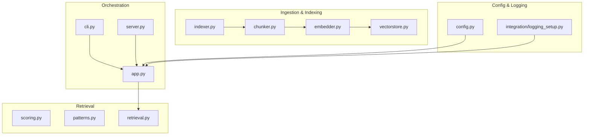
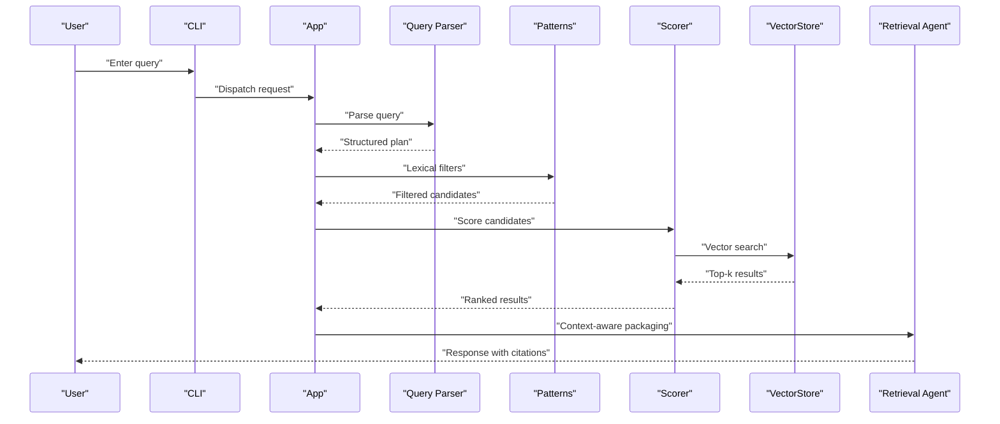
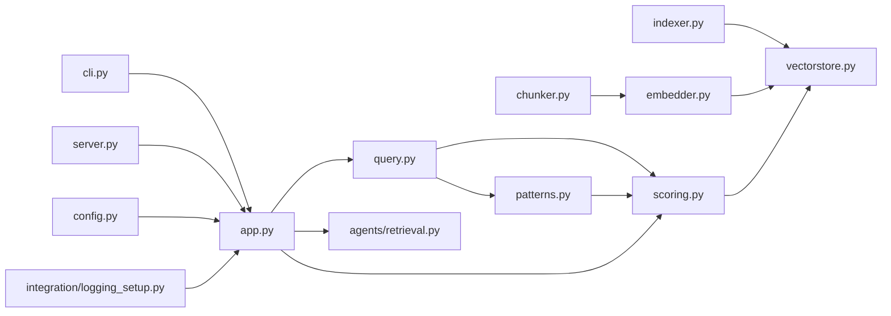

# RAG Fundamentals

<cite>
**Referenced Files in This Document**
- [README.md](file://README.md)
- [src/rag/app.py](file://src/rag/app.py)
- [src/rag/cli.py](file://src/rag/cli.py)
- [src/rag/server.py](file://src/rag/server.py)
- [src/rag/config.py](file://src/rag/config.py)
- [src/rag/core/query.py](file://src/rag/core/query.py)
- [src/rag/core/scoring.py](file://src/rag/core/scoring.py)
- [src/rag/core/chunker.py](file://src/rag/core/chunker.py)
- [src/rag/core/embedder.py](file://src/rag/core/embedder.py)
- [src/rag/core/vectorstore.py](file://src/rag/core/vectorstore.py)
- [src/rag/core/indexer.py](file://src/rag/core/indexer.py)
- [src/rag/core/patterns.py](file://src/rag/core/patterns.py)
- [src/rag/agents/retrieval.py](file://src/rag/agents/retrieval.py)
- [src/rag/agents/repo_agent.py](file://src/rag/agents/repo_agent.py)
- [src/rag/integration/logging_setup.py](file://src/rag/integration/logging_setup.py)
- [tests/test_query.py](file://tests/test_query.py)
- [tests/test_scoring.py](file://tests/test_scoring.py)
- [tests/test_chunker.py](file://tests/test_chunker.py)
- [tests/test_embedder_retry.py](file://tests/test_embedder_retry.py)
- [docs/rag_vs_vanilla_walkthrough.md](file://docs/rag_vs_vanilla_walkthrough.md)
- [docs/refactoring_rag_strategies.md](file://docs/refactoring_rag_strategies.md)
</cite>

## Table of Contents
1. [Introduction](#introduction)
2. [Project Structure](#project-structure)
3. [Core Components](#core-components)
4. [Architecture Overview](#architecture-overview)
5. [Detailed Component Analysis](#detailed-component-analysis)
6. [Dependency Analysis](#dependency-analysis)
7. [Performance Considerations](#performance-considerations)
8. [Troubleshooting Guide](#troubleshooting-guide)
9. [Conclusion](#conclusion)
10. [Appendices](#appendices)

## Introduction
This document explains Retrieval-Augmented Generation (RAG) fundamentals and how they apply to code search. It covers hybrid search combining dense vector similarity with lexical matching, token budgeting, context-aware result packaging, query decomposition, search plan generation, and the relationship between user queries and retrieval operations. The content is structured for beginners seeking conceptual understanding and experienced developers needing implementation details such as scoring functions, pattern matching, and query optimization.

## Project Structure
The repository implements a modular RAG system with clear separation between ingestion, indexing, retrieval, and serving layers. Key areas:
- Core: ingestion pipeline, embedding, vector storage, scoring, query parsing, and chunking
- Agents: retrieval orchestration and repository agent for contextual actions
- Integration: logging and external service integrations
- Tests: focused coverage of query parsing, scoring, chunking, and embedding retries
- Docs: walkthroughs and strategies for RAG application

**Diagram sources**
- [src/rag/core/indexer.py](file://src/rag/core/indexer.py)
- [src/rag/core/chunker.py](file://src/rag/core/chunker.py)
- [src/rag/core/embedder.py](file://src/rag/core/embedder.py)
- [src/rag/core/vectorstore.py](file://src/rag/core/vectorstore.py)
- [src/rag/core/scoring.py](file://src/rag/core/scoring.py)
- [src/rag/core/patterns.py](file://src/rag/core/patterns.py)
- [src/rag/agents/retrieval.py](file://src/rag/agents/retrieval.py)
- [src/rag/app.py](file://src/rag/app.py)
- [src/rag/cli.py](file://src/rag/cli.py)
- [src/rag/server.py](file://src/rag/server.py)
- [src/rag/config.py](file://src/rag/config.py)
- [src/rag/integration/logging_setup.py](file://src/rag/integration/logging_setup.py)

**Section sources**
- [README.md](file://README.md)
- [src/rag/app.py](file://src/rag/app.py)
- [src/rag/cli.py](file://src/rag/cli.py)
- [src/rag/server.py](file://src/rag/server.py)
- [src/rag/config.py](file://src/rag/config.py)

## Core Components
This section introduces the building blocks essential to RAG in code search:

- Query parsing and decomposition: transforms user intent into structured retrieval plans
- Scoring and ranking: combines lexical and semantic signals
- Chunking and embeddings: prepares code artifacts for vector search
- Vector storage and retrieval: efficient nearest neighbor search over embeddings
- Pattern matching: lexical filtering and refinement
- Token budgeting and context packaging: ensures prompts fit model constraints
- Agent orchestration: coordinates retrieval and action planning

Key implementation anchors:
- Query parsing and decomposition: [src/rag/core/query.py](file://src/rag/core/query.py)
- Scoring and ranking: [src/rag/core/scoring.py](file://src/rag/core/scoring.py)
- Chunking: [src/rag/core/chunker.py](file://src/rag/core/chunker.py)
- Embedding: [src/rag/core/embedder.py](file://src/rag/core/embedder.py)
- Vector storage: [src/rag/core/vectorstore.py](file://src/rag/core/vectorstore.py)
- Lexical patterns: [src/rag/core/patterns.py](file://src/rag/core/patterns.py)
- Retrieval agent: [src/rag/agents/retrieval.py](file://src/rag/agents/retrieval.py)

**Section sources**
- [src/rag/core/query.py](file://src/rag/core/query.py)
- [src/rag/core/scoring.py](file://src/rag/core/scoring.py)
- [src/rag/core/chunker.py](file://src/rag/core/chunker.py)
- [src/rag/core/embedder.py](file://src/rag/core/embedder.py)
- [src/rag/core/vectorstore.py](file://src/rag/core/vectorstore.py)
- [src/rag/core/patterns.py](file://src/rag/core/patterns.py)
- [src/rag/agents/retrieval.py](file://src/rag/agents/retrieval.py)

## Architecture Overview
The RAG system follows a pipeline from ingestion to retrieval and agent-driven action. The high-level flow:

**Diagram sources**
- [src/rag/cli.py](file://src/rag/cli.py)
- [src/rag/app.py](file://src/rag/app.py)
- [src/rag/core/query.py](file://src/rag/core/query.py)
- [src/rag/core/patterns.py](file://src/rag/core/patterns.py)
- [src/rag/core/scoring.py](file://src/rag/core/scoring.py)
- [src/rag/core/vectorstore.py](file://src/rag/core/vectorstore.py)
- [src/rag/agents/retrieval.py](file://src/rag/agents/retrieval.py)

## Detailed Component Analysis

### Query Parsing and Decomposition
Purpose:
- Convert natural language queries into structured retrieval plans
- Identify intent categories (e.g., “find function”, “explain class”, “locate bug”)
- Generate candidate sets via lexical filters and semantic search

Key behaviors:
- Decompose composite queries into atomic retrieval tasks
- Apply domain-specific heuristics to prioritize relevant scopes (files, classes, functions)
- Produce a search plan consumed by the scorer and retriever

Implementation anchors:
- [src/rag/core/query.py](file://src/rag/core/query.py)

Validation:
- [tests/test_query.py](file://tests/test_query.py)

**Section sources**
- [src/rag/core/query.py](file://src/rag/core/query.py)
- [tests/test_query.py](file://tests/test_query.py)

### Scoring and Ranking
Purpose:
- Combine lexical and semantic signals to rank candidates
- Integrate pattern matches, proximity, and relevance scores
- Enforce token budgeting to keep prompts within model limits

Key behaviors:
- Hybrid scoring: vector similarity + lexical match bonuses
- Context-aware weighting: emphasize recent or related contexts
- Budget-aware curation: truncate and merge chunks to fit token budgets

Implementation anchors:
- [src/rag/core/scoring.py](file://src/rag/core/scoring.py)

Validation:
- [tests/test_scoring.py](file://tests/test_scoring.py)

**Section sources**
- [src/rag/core/scoring.py](file://src/rag/core/scoring.py)
- [tests/test_scoring.py](file://tests/test_scoring.py)

### Chunking and Embedding
Purpose:
- Split source code into semantically coherent chunks
- Generate embeddings for vector similarity search

Key behaviors:
- AST-aware chunking to respect code boundaries
- Deduplication and overlap strategies
- Batch embedding with retry and backoff

Implementation anchors:
- [src/rag/core/chunker.py](file://src/rag/core/chunker.py)
- [src/rag/core/embedder.py](file://src/rag/core/embedder.py)

Validation:
- [tests/test_chunker.py](file://tests/test_chunker.py)
- [tests/test_embedder_retry.py](file://tests/test_embedder_retry.py)

**Section sources**
- [src/rag/core/chunker.py](file://src/rag/core/chunker.py)
- [src/rag/core/embedder.py](file://src/rag/core/embedder.py)
- [tests/test_chunker.py](file://tests/test_chunker.py)
- [tests/test_embedder_retry.py](file://tests/test_embedder_retry.py)

### Vector Storage and Retrieval
Purpose:
- Store embeddings with metadata for fast nearest neighbor search
- Support hybrid retrieval combining vector and lexical filters

Key behaviors:
- Upsert and delete operations keyed by document identifiers
- Metadata filtering and score normalization
- Top-k retrieval with configurable thresholds

Implementation anchors:
- [src/rag/core/vectorstore.py](file://src/rag/core/vectorstore.py)
- [src/rag/core/indexer.py](file://src/rag/core/indexer.py)

**Section sources**
- [src/rag/core/vectorstore.py](file://src/rag/core/vectorstore.py)
- [src/rag/core/indexer.py](file://src/rag/core/indexer.py)

### Lexical Pattern Matching
Purpose:
- Refine retrieval candidates using keyword and structural patterns
- Improve precision by aligning query intent with code constructs

Key behaviors:
- Pattern extraction from parsed queries
- Regex and keyword filters applied to metadata and content
- Post-filtering to remove low-signal matches

Implementation anchors:
- [src/rag/core/patterns.py](file://src/rag/core/patterns.py)

**Section sources**
- [src/rag/core/patterns.py](file://src/rag/core/patterns.py)

### Retrieval Agent Orchestration
Purpose:
- Coordinate retrieval steps, apply token budgeting, and package results
- Provide context-aware responses with citations

Key behaviors:
- Search plan execution based on query decomposition
- Context-aware result packaging respecting token budgets
- Citation and provenance tracking

Implementation anchors:
- [src/rag/agents/retrieval.py](file://src/rag/agents/retrieval.py)
- [src/rag/agents/repo_agent.py](file://src/rag/agents/repo_agent.py)

**Section sources**
- [src/rag/agents/retrieval.py](file://src/rag/agents/retrieval.py)
- [src/rag/agents/repo_agent.py](file://src/rag/agents/repo_agent.py)

### Serving and CLI
Purpose:
- Expose RAG capabilities via CLI and optional server
- Centralize configuration and logging setup

Key behaviors:
- CLI entry points for ingestion and querying
- Optional HTTP server for downstream integrations
- Centralized logging and configuration

Implementation anchors:
- [src/rag/cli.py](file://src/rag/cli.py)
- [src/rag/server.py](file://src/rag/server.py)
- [src/rag/app.py](file://src/rag/app.py)
- [src/rag/config.py](file://src/rag/config.py)
- [src/rag/integration/logging_setup.py](file://src/rag/integration/logging_setup.py)

**Section sources**
- [src/rag/cli.py](file://src/rag/cli.py)
- [src/rag/server.py](file://src/rag/server.py)
- [src/rag/app.py](file://src/rag/app.py)
- [src/rag/config.py](file://src/rag/config.py)
- [src/rag/integration/logging_setup.py](file://src/rag/integration/logging_setup.py)

## Dependency Analysis
The system exhibits layered cohesion:
- Ingestion depends on chunking and embedding
- Retrieval depends on vector storage, scoring, and lexical patterns
- Orchestration depends on query parsing and agent modules
- CLI and server depend on app and configuration

**Diagram sources**
- [src/rag/core/query.py](file://src/rag/core/query.py)
- [src/rag/core/scoring.py](file://src/rag/core/scoring.py)
- [src/rag/core/patterns.py](file://src/rag/core/patterns.py)
- [src/rag/core/chunker.py](file://src/rag/core/chunker.py)
- [src/rag/core/embedder.py](file://src/rag/core/embedder.py)
- [src/rag/core/indexer.py](file://src/rag/core/indexer.py)
- [src/rag/core/vectorstore.py](file://src/rag/core/vectorstore.py)
- [src/rag/agents/retrieval.py](file://src/rag/agents/retrieval.py)
- [src/rag/app.py](file://src/rag/app.py)
- [src/rag/cli.py](file://src/rag/cli.py)
- [src/rag/server.py](file://src/rag/server.py)
- [src/rag/config.py](file://src/rag/config.py)
- [src/rag/integration/logging_setup.py](file://src/rag/integration/logging_setup.py)

**Section sources**
- [src/rag/core/query.py](file://src/rag/core/query.py)
- [src/rag/core/scoring.py](file://src/rag/core/scoring.py)
- [src/rag/core/patterns.py](file://src/rag/core/patterns.py)
- [src/rag/core/chunker.py](file://src/rag/core/chunker.py)
- [src/rag/core/embedder.py](file://src/rag/core/embedder.py)
- [src/rag/core/indexer.py](file://src/rag/core/indexer.py)
- [src/rag/core/vectorstore.py](file://src/rag/core/vectorstore.py)
- [src/rag/agents/retrieval.py](file://src/rag/agents/retrieval.py)
- [src/rag/app.py](file://src/rag/app.py)
- [src/rag/cli.py](file://src/rag/cli.py)
- [src/rag/server.py](file://src/rag/server.py)
- [src/rag/config.py](file://src/rag/config.py)
- [src/rag/integration/logging_setup.py](file://src/rag/integration/logging_setup.py)

## Performance Considerations
- Vector search efficiency: tune top-k and threshold parameters to balance recall and latency
- Chunk size and overlap: larger chunks reduce fragmentation but increase embedding costs; overlaps aid continuity
- Batch embedding: process in batches to amortize network overhead; implement retry with exponential backoff
- Token budgeting: precompute approximate token counts per chunk; dynamically truncate or merge to fit model limits
- Lexical pruning: early filtering reduces downstream scoring cost
- Caching: reuse embeddings and query results where safe to avoid recomputation

[No sources needed since this section provides general guidance]

## Troubleshooting Guide
Common issues and remedies:
- Query parsing failures: validate input structure and ensure supported intent categories; check decomposition logic
- Low recall: adjust lexical filters, increase top-k, or refine embedding quality
- Out-of-memory or timeouts: reduce batch sizes, enable retries, and enforce stricter token budgets
- Logging and observability: configure logging setup and route logs to appropriate handlers

References:
- [src/rag/integration/logging_setup.py](file://src/rag/integration/logging_setup.py)
- [tests/test_query.py](file://tests/test_query.py)
- [tests/test_embedder_retry.py](file://tests/test_embedder_retry.py)

**Section sources**
- [src/rag/integration/logging_setup.py](file://src/rag/integration/logging_setup.py)
- [tests/test_query.py](file://tests/test_query.py)
- [tests/test_embedder_retry.py](file://tests/test_embedder_retry.py)

## Conclusion
This RAG system integrates lexical and semantic retrieval for code search, with structured query decomposition, robust scoring, and strict token budgeting. The modular design enables incremental improvements in accuracy and performance while maintaining operational reliability.

[No sources needed since this section summarizes without analyzing specific files]

## Appendices

### Beginner Concepts: RAG Overview
- Retrieval-Augmented Generation: Augments generation with retrieved context to improve accuracy
- Hybrid search: Combines lexical matching (keywords, patterns) with dense vector similarity
- Token budgeting: Ensures prompt fits model constraints by truncating or merging chunks
- Context-aware packaging: Assembles retrieved segments into coherent, citable responses

[No sources needed since this section provides conceptual overview]

### Developer Reference: Implementation Highlights
- Query decomposition: [src/rag/core/query.py](file://src/rag/core/query.py)
- Scoring and ranking: [src/rag/core/scoring.py](file://src/rag/core/scoring.py)
- Chunking and embeddings: [src/rag/core/chunker.py](file://src/rag/core/chunker.py), [src/rag/core/embedder.py](file://src/rag/core/embedder.py)
- Vector storage: [src/rag/core/vectorstore.py](file://src/rag/core/vectorstore.py), [src/rag/core/indexer.py](file://src/rag/core/indexer.py)
- Lexical patterns: [src/rag/core/patterns.py](file://src/rag/core/patterns.py)
- Retrieval agent: [src/rag/agents/retrieval.py](file://src/rag/agents/retrieval.py)
- CLI and server: [src/rag/cli.py](file://src/rag/cli.py), [src/rag/server.py](file://src/rag/server.py)
- Configuration and logging: [src/rag/config.py](file://src/rag/config.py), [src/rag/integration/logging_setup.py](file://src/rag/integration/logging_setup.py)

**Section sources**
- [src/rag/core/query.py](file://src/rag/core/query.py)
- [src/rag/core/scoring.py](file://src/rag/core/scoring.py)
- [src/rag/core/chunker.py](file://src/rag/core/chunker.py)
- [src/rag/core/embedder.py](file://src/rag/core/embedder.py)
- [src/rag/core/vectorstore.py](file://src/rag/core/vectorstore.py)
- [src/rag/core/indexer.py](file://src/rag/core/indexer.py)
- [src/rag/core/patterns.py](file://src/rag/core/patterns.py)
- [src/rag/agents/retrieval.py](file://src/rag/agents/retrieval.py)
- [src/rag/cli.py](file://src/rag/cli.py)
- [src/rag/server.py](file://src/rag/server.py)
- [src/rag/config.py](file://src/rag/config.py)
- [src/rag/integration/logging_setup.py](file://src/rag/integration/logging_setup.py)

### Walkthroughs and Strategies
- RAG vs vanilla search: [docs/rag_vs_vanilla_walkthrough.md](file://docs/rag_vs_vanilla_walkthrough.md)
- RAG strategies: [docs/refactoring_rag_strategies.md](file://docs/refactoring_rag_strategies.md)

**Section sources**
- [docs/rag_vs_vanilla_walkthrough.md](file://docs/rag_vs_vanilla_walkthrough.md)
- [docs/refactoring_rag_strategies.md](file://docs/refactoring_rag_strategies.md)