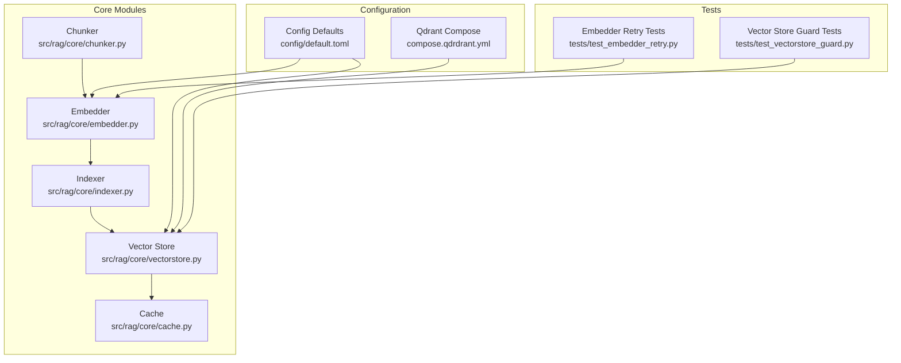
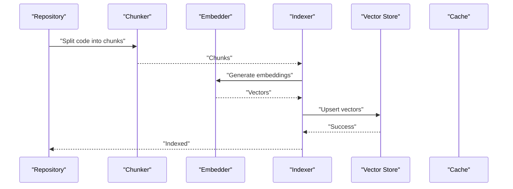
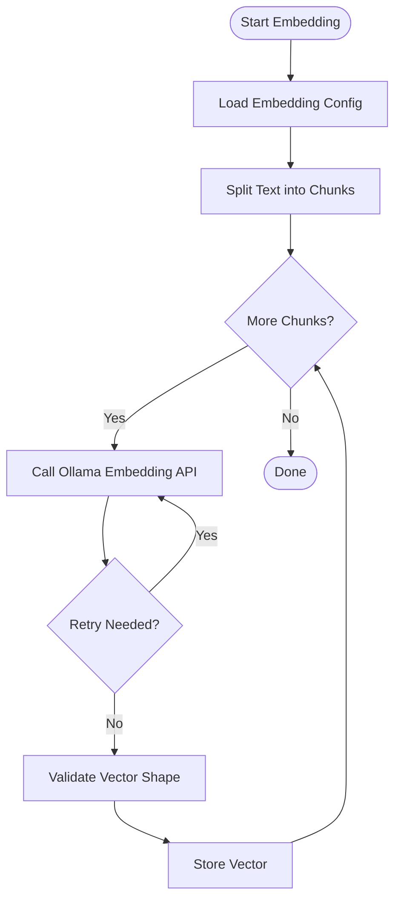
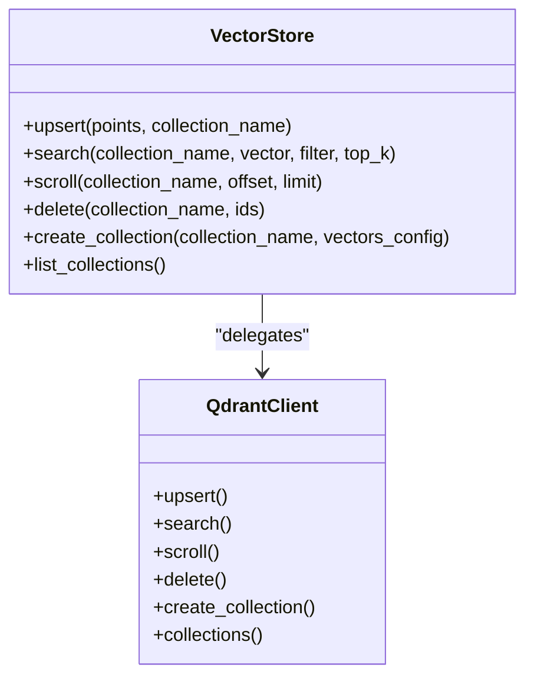
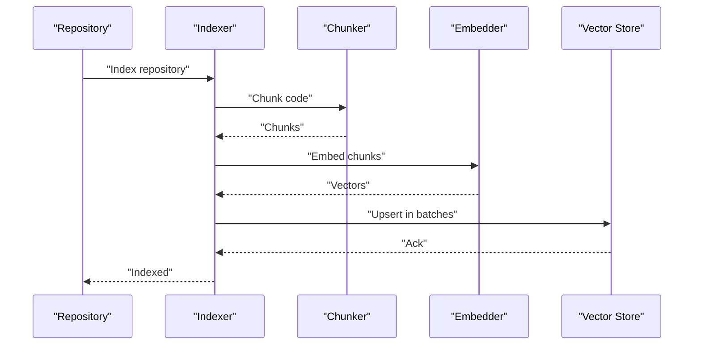
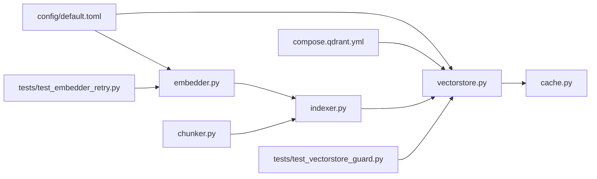

# Vector Operations

<cite>
**Referenced Files in This Document**
- [embedder.py](file://src/rag/core/embedder.py)
- [vectorstore.py](file://src/rag/core/vectorstore.py)
- [indexer.py](file://src/rag/core/indexer.py)
- [chunker.py](file://src/rag/core/chunker.py)
- [cache.py](file://src/rag/core/cache.py)
- [default.toml](file://config/default.toml)
- [compose.qdrant.yml](file://compose.qdrant.yml)
- [test_embedder_retry.py](file://tests/test_embedder_retry.py)
- [test_vectorstore_guard.py](file://tests/test_vectorstore_guard.py)
</cite>

## Table of Contents
1. [Introduction](#introduction)
2. [Project Structure](#project-structure)
3. [Core Components](#core-components)
4. [Architecture Overview](#architecture-overview)
5. [Detailed Component Analysis](#detailed-component-analysis)
6. [Dependency Analysis](#dependency-analysis)
7. [Performance Considerations](#performance-considerations)
8. [Troubleshooting Guide](#troubleshooting-guide)
9. [Conclusion](#conclusion)

## Introduction
This document explains the vector operations pipeline for dense embeddings, focusing on the integration with Ollama for generating embeddings, Qdrant as the vector database, and collection management. It covers the end-to-end embedding pipeline from code chunks to vector representations, vector store operations (upsert, search, batch operations), caching strategies for performance, collection isolation per repository, vector dimensionality, similarity metrics, and query-time operations. Practical examples demonstrate embedding configuration, vector store setup, and performance tuning for large-scale codebases.

## Project Structure
The vector operations functionality is implemented across several core modules:
- Embedding generation and retry logic
- Vector store abstraction and Qdrant integration
- Indexing pipeline coordinating chunking, embedding, and upsert
- Chunking logic for code-aware segmentation
- Caching for performance optimization
- Configuration and infrastructure for Qdrant

**Diagram sources**
- [embedder.py](file://src/rag/core/embedder.py)
- [vectorstore.py](file://src/rag/core/vectorstore.py)
- [indexer.py](file://src/rag/core/indexer.py)
- [chunker.py](file://src/rag/core/chunker.py)
- [cache.py](file://src/rag/core/cache.py)
- [default.toml](file://config/default.toml)
- [compose.qdrant.yml](file://compose.qdrant.yml)
- [test_embedder_retry.py](file://tests/test_embedder_retry.py)
- [test_vectorstore_guard.py](file://tests/test_vectorstore_guard.py)

**Section sources**
- [embedder.py](file://src/rag/core/embedder.py)
- [vectorstore.py](file://src/rag/core/vectorstore.py)
- [indexer.py](file://src/rag/core/indexer.py)
- [chunker.py](file://src/rag/core/chunker.py)
- [cache.py](file://src/rag/core/cache.py)
- [default.toml](file://config/default.toml)
- [compose.qdrant.yml](file://compose.qdrant.yml)

## Core Components
- Embedder: Generates dense vectors for text chunks using Ollama, with retry logic and error handling.
- Vector Store: Abstraction layer for Qdrant operations (upsert, search, scroll, delete), with guards and collection management.
- Indexer: Orchestrates chunking, embedding, and upsert into the vector store.
- Chunker: Splits code into semantically meaningful segments.
- Cache: Provides caching for performance optimization around expensive operations.
- Configuration: Defines embedding model, vector dimensions, similarity metric, and Qdrant connection settings.

Key responsibilities:
- Embedding pipeline: chunk → embed → upsert
- Collection isolation: per-repository collections
- Similarity metric: cosine distance
- Batch operations: upsert and search batching
- Caching: reduce repeated embeddings and Qdrant calls

**Section sources**
- [embedder.py](file://src/rag/core/embedder.py)
- [vectorstore.py](file://src/rag/core/vectorstore.py)
- [indexer.py](file://src/rag/core/indexer.py)
- [chunker.py](file://src/rag/core/chunker.py)
- [cache.py](file://src/rag/core/cache.py)
- [default.toml](file://config/default.toml)

## Architecture Overview
The vector operations pipeline integrates code chunking, embedding generation, and vector storage. The indexer coordinates these steps, while the vector store manages persistence and retrieval against Qdrant. Caching reduces redundant work.

**Diagram sources**
- [indexer.py](file://src/rag/core/indexer.py)
- [chunker.py](file://src/rag/core/chunker.py)
- [embedder.py](file://src/rag/core/embedder.py)
- [vectorstore.py](file://src/rag/core/vectorstore.py)
- [cache.py](file://src/rag/core/cache.py)

## Detailed Component Analysis

### Embedder: Dense Embeddings via Ollama
The embedder generates dense vectors for text chunks using Ollama. It includes:
- Model selection and configuration
- Retry logic for transient failures
- Error handling and graceful degradation
- Vector normalization and shape validation

**Diagram sources**
- [embedder.py](file://src/rag/core/embedder.py)

**Section sources**
- [embedder.py](file://src/rag/core/embedder.py)
- [default.toml](file://config/default.toml)
- [test_embedder_retry.py](file://tests/test_embedder_retry.py)

### Vector Store: Qdrant Integration and Collection Management
The vector store module encapsulates Qdrant operations:
- Upsert vectors with payload metadata
- Search with filters and similarity scoring
- Scroll and delete operations
- Collection creation and lifecycle management
- Guards to prevent misuse and enforce constraints

**Diagram sources**
- [vectorstore.py](file://src/rag/core/vectorstore.py)
- [compose.qdrant.yml](file://compose.qdrant.yml)

**Section sources**
- [vectorstore.py](file://src/rag/core/vectorstore.py)
- [test_vectorstore_guard.py](file://tests/test_vectorstore_guard.py)

### Indexer: Pipeline Orchestration
The indexer coordinates chunking, embedding, and upsert:
- Repository-aware collection naming for isolation
- Batch processing for efficient upsert
- Metadata enrichment for retrieval

**Diagram sources**
- [indexer.py](file://src/rag/core/indexer.py)
- [chunker.py](file://src/rag/core/chunker.py)
- [embedder.py](file://src/rag/core/embedder.py)
- [vectorstore.py](file://src/rag/core/vectorstore.py)

**Section sources**
- [indexer.py](file://src/rag/core/indexer.py)

### Chunker: Code-Aware Segmentation
The chunker splits code into semantically coherent segments suitable for embedding:
- Language-aware boundaries
- Maximum chunk size constraints
- Overlap to preserve context

**Section sources**
- [chunker.py](file://src/rag/core/chunker.py)

### Cache: Performance Optimization
Caching reduces repeated embeddings and Qdrant calls:
- Embedding cache keyed by chunk content
- Vector store operation cache for search results
- Eviction policies and TTL to manage memory

**Section sources**
- [cache.py](file://src/rag/core/cache.py)

## Dependency Analysis
Vector operations depend on configuration and infrastructure:
- Embedding model and dimensions are configured centrally
- Qdrant connection settings are defined in configuration and compose files
- Tests validate retry behavior and guard enforcement

**Diagram sources**
- [default.toml](file://config/default.toml)
- [compose.qdrant.yml](file://compose.qdrant.yml)
- [embedder.py](file://src/rag/core/embedder.py)
- [vectorstore.py](file://src/rag/core/vectorstore.py)
- [indexer.py](file://src/rag/core/indexer.py)
- [chunker.py](file://src/rag/core/chunker.py)
- [cache.py](file://src/rag/core/cache.py)
- [test_embedder_retry.py](file://tests/test_embedder_retry.py)
- [test_vectorstore_guard.py](file://tests/test_vectorstore_guard.py)

**Section sources**
- [default.toml](file://config/default.toml)
- [compose.qdrant.yml](file://compose.qdrant.yml)
- [embedder.py](file://src/rag/core/embedder.py)
- [vectorstore.py](file://src/rag/core/vectorstore.py)
- [indexer.py](file://src/rag/core/indexer.py)
- [chunker.py](file://src/rag/core/chunker.py)
- [cache.py](file://src/rag/core/cache.py)
- [test_embedder_retry.py](file://tests/test_embedder_retry.py)
- [test_vectorstore_guard.py](file://tests/test_vectorstore_guard.py)

## Performance Considerations
- Batch size tuning: Increase batch sizes for upsert and search to reduce network overhead.
- Embedding cache: Enable caching to avoid recomputing identical vectors across runs.
- Qdrant optimization: Use appropriate vector dimensions and similarity metric to balance recall and speed.
- Concurrency: Limit concurrent embedding requests to avoid rate limits from Ollama.
- Memory management: Configure cache eviction and TTL to prevent memory pressure during indexing large repositories.
- Network locality: Run Ollama and Qdrant close to the indexing service for lower latency.

[No sources needed since this section provides general guidance]

## Troubleshooting Guide
Common issues and resolutions:
- Embedding failures: Verify Ollama availability and model readiness; check retry configuration and logs.
- Qdrant connectivity: Confirm endpoint configuration and credentials; ensure collection exists or allow auto-creation.
- Dimension mismatch: Ensure embedding model output matches configured vector dimensions.
- Guard violations: Review guard conditions for upsert/search parameters; adjust filters and top_k values.
- Large repository indexing: Reduce batch size temporarily; enable cache; monitor memory usage.

**Section sources**
- [test_embedder_retry.py](file://tests/test_embedder_retry.py)
- [test_vectorstore_guard.py](file://tests/test_vectorstore_guard.py)
- [default.toml](file://config/default.toml)
- [compose.qdrant.yml](file://compose.qdrant.yml)

## Conclusion
The vector operations pipeline integrates code chunking, Ollama-based embeddings, and Qdrant-backed storage with robust orchestration and caching. Repository-level collection isolation, configurable similarity metrics, and batch operations enable scalable retrieval for large codebases. Proper configuration and performance tuning yield reliable and efficient vector search.

[No sources needed since this section summarizes without analyzing specific files]