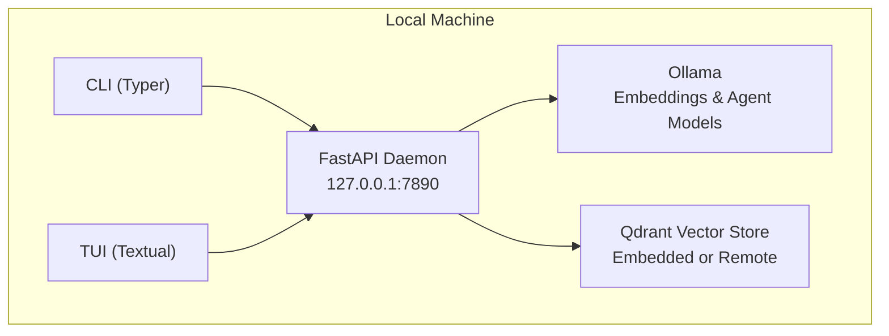

# Getting Started

<cite>
**Referenced Files in This Document**
- [README.md](file://README.md)
- [pyproject.toml](file://pyproject.toml)
- [src/rag/cli.py](file://src/rag/cli.py)
- [src/rag/config.py](file://src/rag/config.py)
- [src/rag/default.toml](file://src/rag/default.toml)
- [src/rag/server.py](file://src/rag/server.py)
- [scripts/install-codex-skills.sh](file://scripts/install-codex-skills.sh)
- [compose.qdrant.yml](file://compose.qdrant.yml)
- [docs/deployment-linux.md](file://docs/deployment-linux.md)
</cite>

## Table of Contents
1. [Introduction](#introduction)
2. [Prerequisites](#prerequisites)
3. [Quickstart in 30 Seconds](#quickstart-in-30-seconds)
4. [Installation](#installation)
5. [Initial Setup and Verification](#initial-setup-and-verification)
6. [Architecture Overview](#architecture-overview)
7. [Troubleshooting Guide](#troubleshooting-guide)
8. [Next Steps](#next-steps)

## Introduction
This guide helps you quickly install, start, and verify the RAG system. It covers prerequisites, platform-specific installation, the 30-second quickstart workflow, and troubleshooting. The system consists of:
- A headless FastAPI daemon (HTTP server) that indexes and searches your code
- A read-only Textual TUI dashboard that connects to the daemon over HTTP
- Dense vector search powered by Qwen3 embeddings via Ollama
- An optional planner agent model for retrieval planning

## Prerequisites
- Python 3.11+ is required to run the daemon and CLI.
- Ollama is required for:
  - Embeddings (Qwen3-Embedding)
  - Planner agent (qwen3:8b)
- Optional: Codex skills for agent guidance.

Key configuration defaults:
- The daemon listens on 127.0.0.1:7890 by default.
- Embedding model defaults to Qwen/Qwen3-Embedding-4B.
- Planner agent model defaults to qwen3:8b.
- Qdrant runs locally by default (Docker Compose).

**Section sources**
- [README.md:11-17](file://README.md#L11-L17)
- [pyproject.toml:9](file://pyproject.toml#L9)
- [src/rag/default.toml:1-41](file://src/rag/default.toml#L1-L41)
- [src/rag/config.py:35-110](file://src/rag/config.py#L35-L110)

## Quickstart in 30 Seconds
Follow this minimal workflow to get up and running:

1) Pull the required models
- Pull the embedding model recommended for embeddings
- Pull the planner agent model recommended for the planner

2) Initialize and index
- Initialize the system, start the daemon, and index the current directory

3) Search
- Perform a search query against the indexed codebase

4) Optional: Launch the TUI dashboard
- Open the read-only TUI dashboard connected to the running daemon

5) Optional: Enable auto-start on macOS
- Register the daemon as a launchd agent so it starts automatically on login and restarts on crash

Notes:
- The daemon is supervised and will stay up even if the TUI crashes.
- The CLI commands are thin HTTP clients that talk to the daemon.

**Section sources**
- [README.md:25-35](file://README.md#L25-L35)
- [src/rag/cli.py:82-141](file://src/rag/cli.py#L82-L141)

## Installation
Choose your operating system and follow the steps below.

### macOS
- Install Python 3.11+ (via pyenv, Homebrew, or official installer)
- Install Ollama and start the service
- Install the project in development/editable mode
- Optionally install Codex skills

Verification:
- Confirm Python version meets the requirement
- Confirm Ollama is reachable and has the required models
- Confirm the daemon is reachable at 127.0.0.1:7890

### Linux
- Install Python 3.11+ and pip
- Install Ollama and start the service
- Install the project in development/editable mode
- Optionally install Codex skills

Supervision:
- Use systemd to supervise the daemon (user-level unit recommended)
- The daemon writes rotated structured logs to ~/.rag/logs

### Windows
- Install Python 3.11+ and pip
- Install Ollama and start the service
- Install the project in development/editable mode
- Optionally install Codex skills

Notes:
- The daemon binds 127.0.0.1 by default; do not bind to 0.0.0.0 in config.
- The bearer token lives at ~/.rag/token (mode 0600).

**Section sources**
- [README.md:9-23](file://README.md#L9-L23)
- [pyproject.toml:9](file://pyproject.toml#L9)
- [docs/deployment-linux.md:1-57](file://docs/deployment-linux.md#L1-L57)
- [src/rag/config.py:35-50](file://src/rag/config.py#L35-L50)

## Initial Setup and Verification
After installing and starting the daemon, verify the setup:

1) Health check
- Ensure the daemon responds to /health

2) Ollama models
- Confirm Ollama is running and has the embedding and agent models

3) Index verification
- Run a basic search to confirm indexing worked
- Use diagnostic commands to check daemon, Ollama, and LSP servers

4) Optional: Start the TUI
- Launch the read-only TUI dashboard to browse results

5) Optional: Auto-start on macOS
- Register the daemon as a launchd agent

**Section sources**
- [src/rag/cli.py:33-48](file://src/rag/cli.py#L33-L48)
- [src/rag/cli.py:2144-2188](file://src/rag/cli.py#L2144-L2188)
- [src/rag/cli.py:426-476](file://src/rag/cli.py#L426-L476)

## Architecture Overview
High-level architecture:
- The daemon is a supervised FastAPI server listening on 127.0.1:7890
- The CLI and TUI are thin HTTP clients that communicate with the daemon
- Dense embeddings are produced by Ollama (Qwen3)
- Qdrant stores vectors and documents

**Diagram sources**
- [src/rag/server.py:1-200](file://src/rag/server.py#L1-L200)
- [src/rag/config.py:53-110](file://src/rag/config.py#L53-L110)
- [compose.qdrant.yml:1-11](file://compose.qdrant.yml#L1-L11)

## Troubleshooting Guide
Common issues and resolutions:

- Daemon not running
  - Start the daemon explicitly or use the convenience commands
  - On macOS, register the daemon as a launchd agent for auto-start
  - On Linux, use a systemd user unit to supervise the daemon

- Ollama unreachable or missing models
  - Ensure Ollama is running and reachable
  - Pull the embedding and agent models if missing
  - Use the diagnostic command to check model availability

- Indexing failures
  - Verify the daemon is healthy and reachable
  - Check for permission issues or invalid paths
  - Use verification and repair commands to fix index problems

- TUI connection issues
  - Ensure the daemon is running before launching the TUI
  - The TUI is read-only and will not affect daemon uptime

- Platform-specific notes
  - Do not bind the daemon to 0.0.0.0; keep it on 127.0.0.1
  - On Linux, ensure PATH includes Ollama and git for indexing and planning

**Section sources**
- [README.md:71-74](file://README.md#L71-L74)
- [src/rag/cli.py:426-476](file://src/rag/cli.py#L426-L476)
- [src/rag/cli.py:2144-2188](file://src/rag/cli.py#L2144-L2188)
- [docs/deployment-linux.md:50-57](file://docs/deployment-linux.md#L50-L57)

## Next Steps
- Explore CLI commands for search, indexing, and diagnostics
- Install optional Codex skills for agent guidance
- Configure Qdrant for embedded or remote operation
- Set up supervision on your OS of choice

**Section sources**
- [README.md:37-66](file://README.md#L37-L66)
- [scripts/install-codex-skills.sh:1-28](file://scripts/install-codex-skills.sh#L1-L28)
- [src/rag/default.toml:21-27](file://src/rag/default.toml#L21-L27)
- [compose.qdrant.yml:1-11](file://compose.qdrant.yml#L1-L11)