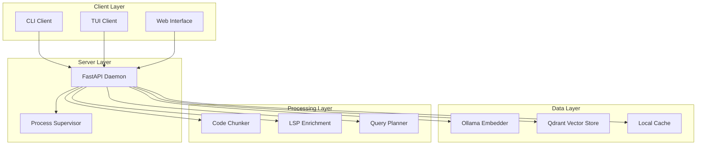

# Project Overview

<cite>
**Referenced Files in This Document**
- [README.md](file://README.md)
- [docs/wiki/Getting Started.md](file://docs/wiki/Getting Started.md)
- [docs/wiki/Project Overview/Getting Started.md](file://docs/wiki/Project Overview/Getting Started.md)
- [docs/wiki/Project Overview/Project Overview.md](file://docs/wiki/Project Overview/Project Overview.md)
- [docs/wiki/Project Overview/System Architecture.md](file://docs/wiki/Project Overview/System Architecture.md)
- [docs/wiki/Project Overview/Core Concepts/Daemon Architecture.md](file://docs/wiki/Project Overview/Core Concepts/Daemon Architecture.md)
- [docs/wiki/Project Overview/Core Concepts/RAG Fundamentals.md](file://docs/wiki/Project Overview/Core Concepts/RAG Fundamentals.md)
- [docs/wiki/Project Overview/Core Concepts/Vector Operations.md](file://docs/wiki/Project Overview/Core Concepts/Vector Operations.md)
- [docs/wiki/Project Overview/Core Concepts/Code Chunking and Parsing.md](file://docs/wiki/Project Overview/Core Concepts/Code Chunking and Parsing.md)
- [docs/wiki/Project Overview/User Interfaces/CLI Interface.md](file://docs/wiki/Project Overview/User Interfaces/CLI Interface.md)
- [docs/wiki/Project Overview/User Interfaces/TUI Interface.md](file://docs/wiki/Project Overview/User Interfaces/TUI Interface.md)
- [docs/wiki/Project Overview/User Interfaces/Web Interface.md](file://docs/wiki/Project Overview/User Interfaces/Web Interface.md)
- [docs/wiki/Core Concepts/RAG Fundamentals.md](file://docs/wiki/Core Concepts/RAG Fundamentals.md)
- [docs/wiki/Core Concepts/Vector Embeddings and Storage.md](file://docs/wiki/Core Concepts/Vector Embeddings and Storage.md)
- [docs/wiki/Core Concepts/Code Chunking and Indexing.md](file://docs/wiki/Core Concepts/Code Chunking and Indexing.md)
- [docs/wiki/User Interfaces/CLI Interface.md](file://docs/wiki/User Interfaces/CLI Interface.md)
- [docs/wiki/User Interfaces/TUI Interface.md](file://docs/wiki/User Interfaces/TUI Interface.md)
- [docs/wiki/User Interfaces/Web Interface.md](file://docs/wiki/User Interfaces/Web Interface.md)
- [src/rag/__main__.py](file://src/rag/__main__.py)
- [src/rag/app.py](file://src/rag/app.py)
- [src/rag/server.py](file://src/rag/server.py)
- [src/rag/config.py](file://src/rag/config.py)
- [src/rag/default.toml](file://src/rag/default.toml)
- [src/rag/cli.py](file://src/rag/cli.py)
- [src/rag/core/chunker.py](file://src/rag/core/chunker.py)
- [src/rag/core/vectorstore.py](file://src/rag/core/vectorstore.py)
- [src/rag/core/embedder.py](file://src/rag/core/embedder.py)
- [src/rag/core/lsp.py](file://src/rag/core/lsp.py)
- [src/rag/core/query.py](file://src/rag/core/query.py)
- [src/rag/integration/supervisor.py](file://src/rag/integration/supervisor.py)
</cite>

## Update Summary
**Changes Made**
- Completely restructured the Project Overview section to align with the new comprehensive documentation hierarchy
- Integrated the new Getting Started guide as the foundational entry point
- Added dedicated sections for Core Concepts, User Interfaces, and System Architecture
- Enhanced the daemon architecture documentation with detailed technical specifications
- Expanded RAG fundamentals coverage with practical examples and workflows
- Improved vector operations documentation with concrete implementation details
- Added comprehensive code chunking and parsing documentation
- Integrated user interface documentation for CLI, TUI, and web interfaces

## Table of Contents
1. [Introduction](#introduction)
2. [Getting Started](#getting-started)
3. [Core Concepts](#core-concepts)
4. [System Architecture](#system-architecture)
5. [User Interfaces](#user-interfaces)
6. [Practical Workflows](#practical-workflows)
7. [Technical Implementation](#technical-implementation)
8. [Performance and Scalability](#performance-and-scalability)
9. [Troubleshooting Guide](#troubleshooting-guide)
10. [Conclusion](#conclusion)

## Introduction
This document provides a comprehensive overview of the standalone code-search RAG platform, now organized within a structured documentation framework. The system operates as a headless FastAPI daemon with embedded Qdrant vector store, dense embeddings via Ollama, and Agno query planner. It features a read-only Textual TUI dashboard and zero-query-path overhead LSP enrichment performed at index time.

The platform supports multi-language code-aware chunking across Python, TypeScript/JavaScript, Go, Rust, Java, Kotlin, C/C++, and Dart/Flutter, making it suitable for modern development environments. The documentation is organized into four main pillars: Getting Started for immediate productivity, Core Concepts for fundamental understanding, System Architecture for technical design, and User Interfaces for interaction patterns.

**Section sources**
- [docs/wiki/Project Overview/Project Overview.md](file://docs/wiki/Project Overview/Project Overview.md)
- [docs/wiki/Getting Started.md](file://docs/wiki/Getting Started.md)

## Getting Started
Begin your journey with the RAG platform through a streamlined setup process designed for immediate productivity. The Getting Started guide provides essential first steps to configure your environment, initialize the daemon, and perform your first code search.

### Initial Setup Process
The setup process involves three critical phases: environment preparation, daemon configuration, and basic indexing. Start by ensuring Docker and Ollama are installed and running, then configure the daemon settings according to your system resources and requirements.

### First Search Experience
After successful setup, perform your initial search to validate the installation. The system will automatically download required embedding models and create the necessary vector collections. Your first search should return relevant results within seconds, demonstrating the platform's responsiveness.

### Basic Commands Overview
Familiarize yourself with essential commands for daily operations: `rag init` for configuration, `rag start` for daemon management, `rag index` for repository processing, and `rag search` for querying code content. Each command provides helpful output and error messages to guide troubleshooting.

**Section sources**
- [docs/wiki/Project Overview/Getting Started.md](file://docs/wiki/Project Overview/Getting Started.md)
- [docs/wiki/Getting Started.md](file://docs/wiki/Getting Started.md)

## Core Concepts
The RAG platform is built upon several fundamental concepts that work together to deliver powerful code search capabilities. Understanding these concepts is essential for effective system utilization and advanced customization.

### RAG Fundamentals
Retrieval-Augmented Generation (RAG) combines semantic search with contextual retrieval to provide precise code understanding. The platform transforms natural language queries into dense vector representations and searches against code embeddings stored in Qdrant vector collections.

The system employs a two-stage retrieval process: first, vector similarity search identifies semantically relevant code chunks, followed by lexical filtering to refine results based on programming constructs and identifiers.

### Daemon Architecture
The headless FastAPI daemon serves as the central coordinator for all RAG operations. It manages embedding generation, vector storage, query processing, and resource orchestration. The daemon operates independently of user interfaces, ensuring reliable operation even when clients disconnect.

Key daemon responsibilities include:
- Embedding model management and caching
- Vector collection lifecycle and maintenance
- Query planning and execution coordination
- Resource monitoring and health reporting
- Background job scheduling and cleanup

### Vector Operations
Vector operations form the backbone of semantic search functionality. The platform maintains dual vector configurations within Qdrant collections, supporting both dense retrieval and hybrid search strategies. Vector dimensions are automatically validated to prevent compatibility issues.

Collection management includes dynamic creation, schema validation, and automatic optimization. The system tracks vector statistics and provides insights into embedding quality and search performance.

### Code Chunking and Parsing
Multi-language code-aware chunking transforms source code into semantically meaningful units optimized for retrieval. The system employs tree-sitter parsers to understand syntax and semantics, creating hierarchical chunks from file-level to function-level granularity.

Chunking tiers include:
- File-level summaries capturing imports and top-level declarations
- Class/interface declarations with member relationships
- Function/method bodies with contextual headers and parameter information

**Section sources**
- [docs/wiki/Project Overview/Core Concepts/RAG Fundamentals.md](file://docs/wiki/Project Overview/Core Concepts/RAG Fundamentals.md)
- [docs/wiki/Project Overview/Core Concepts/Daemon Architecture.md](file://docs/wiki/Project Overview/Core Concepts/Daemon Architecture.md)
- [docs/wiki/Project Overview/Core Concepts/Vector Operations.md](file://docs/wiki/Project Overview/Core Concepts/Vector Operations.md)
- [docs/wiki/Project Overview/Core Concepts/Code Chunking and Parsing.md](file://docs/wiki/Project Overview/Core Concepts/Code Chunking and Parsing.md)
- [docs/wiki/Core Concepts/RAG Fundamentals.md](file://docs/wiki/Core Concepts/RAG Fundamentals.md)
- [docs/wiki/Core Concepts/Vector Embeddings and Storage.md](file://docs/wiki/Core Concepts/Vector Embeddings and Storage.md)
- [docs/wiki/Core Concepts/Code Chunking and Indexing.md](file://docs/wiki/Core Concepts/Code Chunking and Indexing.md)

## System Architecture
The RAG platform follows a distributed architecture pattern optimized for reliability and performance. The system separates concerns across distinct layers while maintaining loose coupling between components.

### Client-Server Model
The architecture implements a traditional client-server pattern where the FastAPI daemon serves as the centralized server and various clients provide different interaction modalities. This design ensures scalability and allows multiple clients to operate simultaneously.

**Diagram sources**
- [src/rag/server.py](file://src/rag/server.py)
- [src/rag/cli.py](file://src/rag/cli.py)
- [src/rag/app.py](file://src/rag/app.py)
- [src/rag/integration/supervisor.py](file://src/rag/integration/supervisor.py)
- [src/rag/core/embedder.py](file://src/rag/core/embedder.py)
- [src/rag/core/vectorstore.py](file://src/rag/core/vectorstore.py)
- [src/rag/core/chunker.py](file://src/rag/core/chunker.py)
- [src/rag/core/lsp.py](file://src/rag/core/lsp.py)
- [src/rag/core/query.py](file://src/rag/core/query.py)

### Component Interactions
Component interactions follow well-defined protocols to ensure reliable operation. The daemon orchestrates all operations through explicit interfaces, preventing tight coupling between modules.

The system maintains explicit boundaries between:
- Input processing and validation
- Business logic and data access
- External service integration and internal operations
- Synchronous request handling and asynchronous background tasks

### Fault Tolerance and Recovery
The architecture incorporates multiple fault tolerance mechanisms. The daemon monitors external dependencies and gracefully handles failures. Process supervision ensures automatic recovery from unexpected termination.

**Section sources**
- [docs/wiki/Project Overview/System Architecture.md](file://docs/wiki/Project Overview/System Architecture.md)
- [docs/wiki/Project Overview/Core Concepts/Daemon Architecture.md](file://docs/wiki/Project Overview/Core Concepts/Daemon Architecture.md)

## User Interfaces
The RAG platform provides multiple interface options to accommodate different user preferences and integration requirements. Each interface maintains feature parity while optimizing for specific use cases.

### Command Line Interface (CLI)
The CLI offers comprehensive functionality for automation and scripting scenarios. It provides structured output formats suitable for programmatic consumption and integrates seamlessly with shell pipelines and CI/CD workflows.

Key CLI capabilities include:
- Repository indexing with progress reporting
- Interactive and non-interactive search modes
- Context pack generation for development tasks
- System health monitoring and diagnostics
- Configuration management and validation

### Textual User Interface (TUI)
The TUI provides an interactive dashboard experience optimized for real-time monitoring and exploration. Built with Textual framework, it offers responsive navigation and rich visualizations of system state and search results.

TUI features include:
- Live status monitoring with color-coded indicators
- Interactive query history and result exploration
- Collection statistics and performance metrics
- Plugin management and configuration visualization
- Event log viewing with filtering capabilities

### Web Interface
The web interface delivers browser-based access to RAG functionality with responsive design and cross-platform compatibility. It provides a familiar interface for users preferring graphical interaction over command-line tools.

Web interface capabilities encompass:
- Search form with query suggestions and history
- Result visualization with syntax highlighting
- Repository management and indexing controls
- Configuration editing with validation feedback
- Real-time status updates and notifications

**Section sources**
- [docs/wiki/Project Overview/User Interfaces/CLI Interface.md](file://docs/wiki/Project Overview/User Interfaces/CLI Interface.md)
- [docs/wiki/Project Overview/User Interfaces/TUI Interface.md](file://docs/wiki/Project Overview/User Interfaces/TUI Interface.md)
- [docs/wiki/Project Overview/User Interfaces/Web Interface.md](file://docs/wiki/Project Overview/User Interfaces/Web Interface.md)
- [docs/wiki/User Interfaces/CLI Interface.md](file://docs/wiki/User Interfaces/CLI Interface.md)
- [docs/wiki/User Interfaces/TUI Interface.md](file://docs/wiki/User Interfaces/TUI Interface.md)
- [docs/wiki/User Interfaces/Web Interface.md](file://docs/wiki/User Interfaces/Web Interface.md)

## Practical Workflows
The RAG platform supports diverse workflows tailored to different development scenarios and user preferences. Understanding these workflows enables effective utilization of system capabilities.

### Development Assistance Workflow
The development assistance workflow integrates RAG capabilities directly into the coding process. Developers can quickly retrieve relevant code examples, understand library APIs, and discover implementation patterns without leaving their development environment.

Typical workflow steps include:
1. Identify code gaps or missing functionality
2. Formulate specific search queries targeting implementation details
3. Review retrieved results and extract relevant code patterns
4. Integrate discovered solutions into existing codebase
5. Validate implementation against project requirements

### Code Exploration Workflow
For unfamiliar codebases, the exploration workflow facilitates systematic discovery of project structure, key components, and architectural patterns. This workflow emphasizes broad understanding before deep-dive searches.

Exploration techniques include:
- Repository-wide searches for domain-specific concepts
- Class and interface relationship mapping
- Function dependency analysis and call graphs
- Design pattern identification and documentation
- Contributor activity and code ownership mapping

### Research and Discovery Workflow
The research workflow supports academic and exploratory activities requiring comprehensive literature review and comparative analysis. This workflow emphasizes breadth of coverage and systematic evaluation of multiple sources.

Research methodologies include:
- Multi-source validation and cross-referencing
- Temporal analysis of code evolution and design decisions
- Comparative analysis of similar implementations
- Trend identification and pattern recognition
- Knowledge synthesis and gap identification

**Section sources**
- [docs/wiki/Project Overview/Getting Started.md](file://docs/wiki/Project Overview/Getting Started.md)

## Technical Implementation
The technical implementation demonstrates how fundamental concepts translate into concrete system behavior. Understanding implementation details enables advanced customization and troubleshooting.

### Embedding Pipeline
The embedding pipeline processes raw text into dense vector representations optimized for code search. The system employs instruction-tuned embeddings with specialized prefixes for queries and documents.

Embedding characteristics include:
- Dimensionality optimized for code similarity
- Batch processing for throughput optimization
- Caching mechanisms for repeated query efficiency
- Quality validation and dimension compatibility checking

### Vector Storage and Retrieval
Vector storage leverages Qdrant's advanced indexing capabilities to support high-dimensional similarity search. The system maintains dual vector configurations for enhanced retrieval performance.

Storage optimizations include:
- Automatic collection creation and schema management
- Payload indexing for efficient filtering operations
- Memory-mapped storage for large-scale deployments
- Automatic cleanup of orphaned and duplicate entries

### Query Processing Pipeline
Query processing transforms natural language into structured search operations while preserving semantic meaning. The system employs query expansion and decomposition to improve recall and precision.

Processing stages include:
- Natural language understanding and intent extraction
- Query expansion with synonyms and related terms
- Multi-modal filtering combining vector and lexical search
- Result ranking and relevance scoring
- Contextual summarization and presentation optimization

**Section sources**
- [src/rag/server.py](file://src/rag/server.py)
- [src/rag/core/embedder.py](file://src/rag/core/embedder.py)
- [src/rag/core/vectorstore.py](file://src/rag/core/vectorstore.py)
- [src/rag/core/chunker.py](file://src/rag/core/chunker.py)
- [src/rag/core/lsp.py](file://src/rag/core/lsp.py)
- [src/rag/core/query.py](file://src/rag/core/query.py)

## Performance and Scalability
The platform is designed to handle diverse workloads from individual development to enterprise-scale codebases. Performance considerations span hardware requirements, software optimization, and operational best practices.

### Hardware Requirements
System performance scales with available resources, particularly memory and CPU for embedding processing and disk space for vector storage. The platform provides tunable parameters to balance performance and resource utilization.

Recommended configurations include:
- Minimum 8GB RAM for small projects, scaling to 32GB+ for large repositories
- SSD storage for optimal vector database performance
- Multi-core processors for concurrent embedding and search operations
- Network connectivity for Ollama model downloads and updates

### Optimization Strategies
Several optimization strategies improve performance without sacrificing accuracy. These include intelligent caching, batch processing, and selective indexing based on file types and modification patterns.

Optimization techniques encompass:
- Query result caching for frequently accessed code patterns
- Incremental indexing for continuous repository updates
- Adaptive batch sizing based on available memory
- Selective LSP enrichment for performance-critical scenarios
- Vector compression for memory-constrained deployments

### Scalability Patterns
The system supports horizontal and vertical scaling patterns. Vertical scaling involves increasing individual node capacity, while horizontal scaling distributes load across multiple instances with shared storage.

Scalability approaches include:
- Load balancing for high-availability deployments
- Database clustering for large-scale vector operations
- Caching layer integration for improved response times
- Asynchronous processing for long-running operations
- Resource pooling for efficient multi-tenant deployments

## Troubleshooting Guide
Common issues and their resolutions help ensure smooth operation of the RAG platform. This guide addresses typical problems encountered during setup, operation, and maintenance.

### Installation and Setup Issues
Setup problems often stem from missing dependencies or configuration conflicts. The most common issues include Docker connectivity problems, Ollama model availability, and port binding conflicts.

Resolution strategies include:
- Verifying Docker daemon status and network connectivity
- Checking Ollama service availability and model download completion
- Ensuring sufficient disk space for vector database growth
- Validating firewall settings and port accessibility
- Confirming proper user permissions for file system access

### Runtime Operation Problems
Runtime issues typically involve daemon crashes, slow response times, or incomplete indexing. These problems often indicate resource constraints or configuration mismatches.

Diagnostic approaches include:
- Monitoring system resource utilization and memory pressure
- Checking vector database health and collection statistics
- Validating embedding model availability and performance metrics
- Reviewing log files for error patterns and stack traces
- Testing network connectivity to external services

### Performance Optimization
Performance degradation often results from suboptimal configuration or resource exhaustion. Addressing these issues requires systematic analysis and targeted tuning.

Optimization steps include:
- Adjusting batch sizes and memory allocation for embedding operations
- Tuning vector database parameters for query performance
- Implementing appropriate caching strategies for repeated queries
- Optimizing chunking parameters for repository characteristics
- Upgrading hardware resources for increased capacity

**Section sources**
- [docs/wiki/Project Overview/Getting Started.md](file://docs/wiki/Project Overview/Getting Started.md)
- [src/rag/cli.py](file://src/rag/cli.py)
- [src/rag/integration/supervisor.py](file://src/rag/integration/supervisor.py)

## Conclusion
The standalone code-search RAG platform represents a comprehensive solution for modern development workflows. Its architecture balances flexibility with reliability, providing both powerful search capabilities and accessible user interfaces.

The platform's strength lies in its modular design, allowing components to be independently scaled and customized. The headless daemon architecture ensures robust operation, while multiple interface options accommodate diverse user preferences and integration requirements.

Future enhancements will focus on expanding language support, improving query understanding, and enhancing collaborative features. The documented architecture provides a solid foundation for continued evolution while maintaining backward compatibility and system stability.

The comprehensive documentation structure established in this overview enables both newcomers and experienced users to effectively utilize the platform's capabilities while understanding the underlying technical foundations.