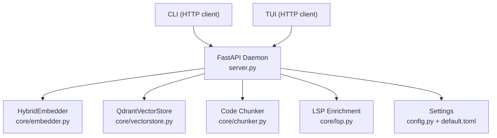
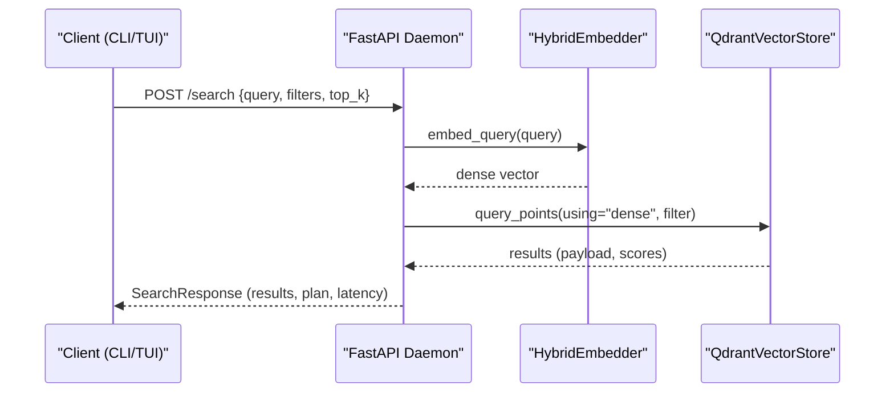
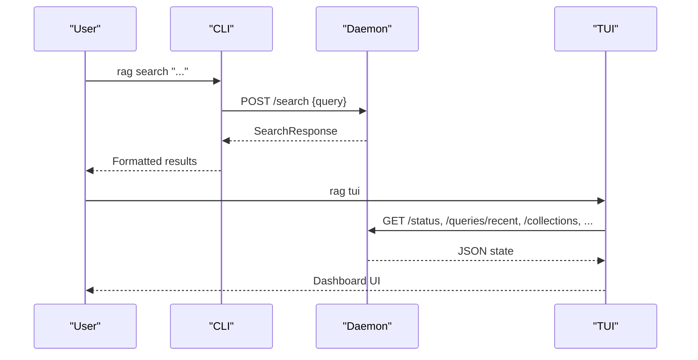
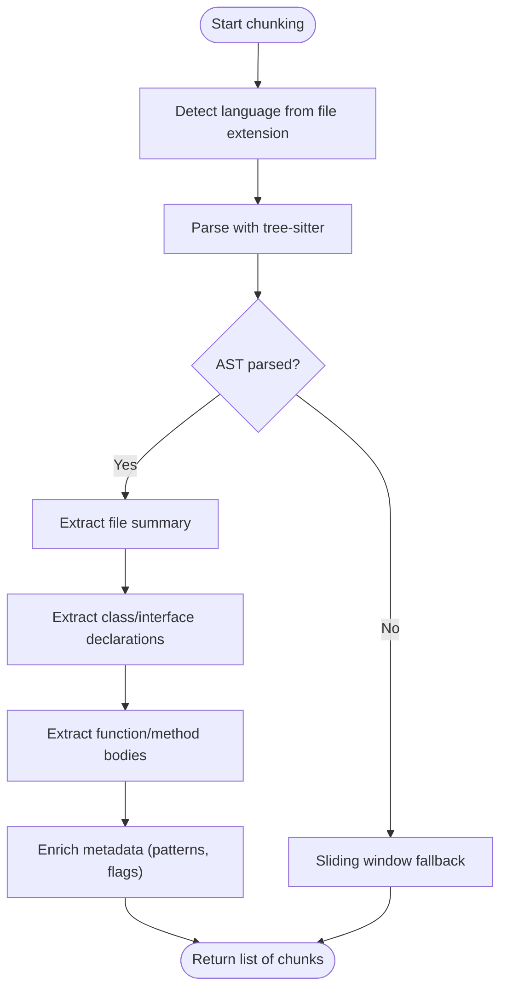
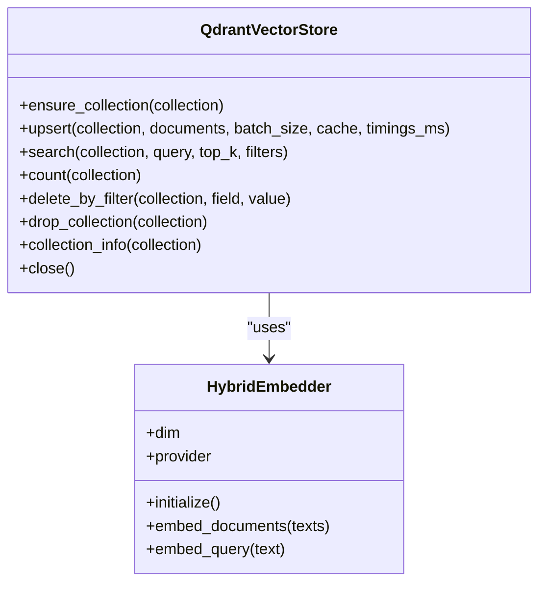
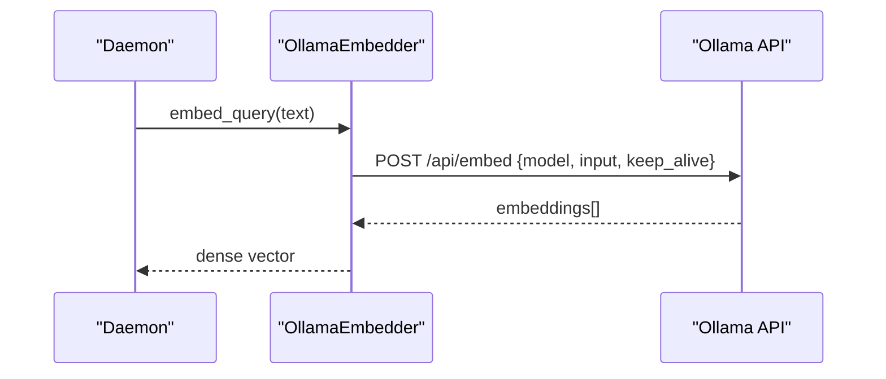
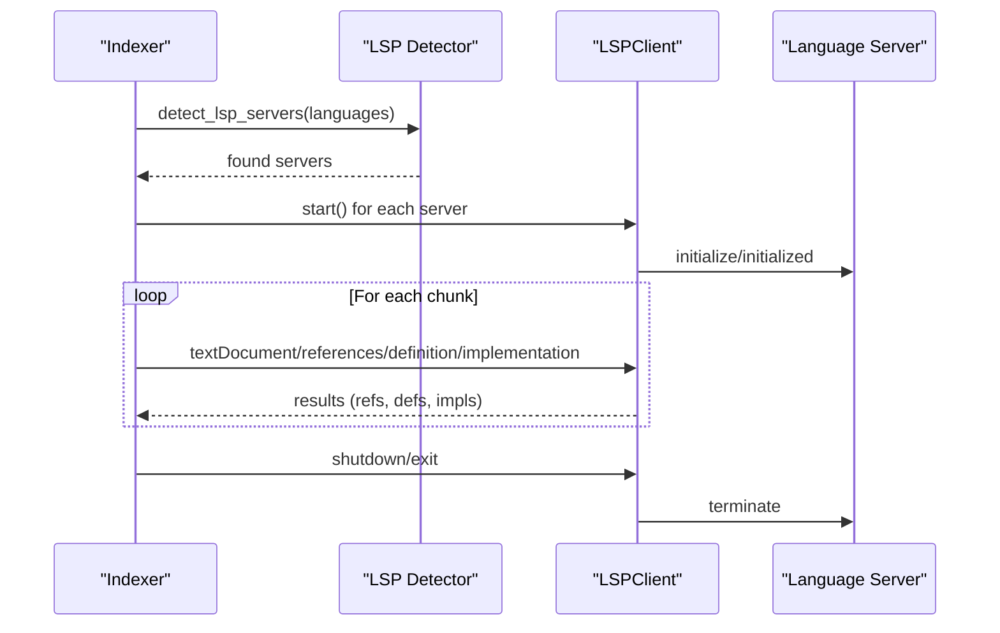
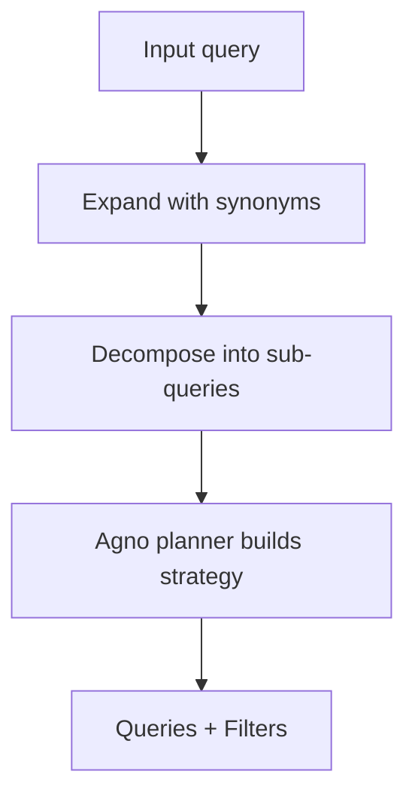
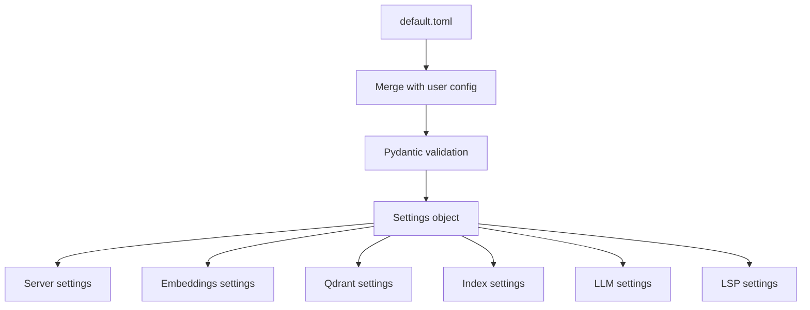
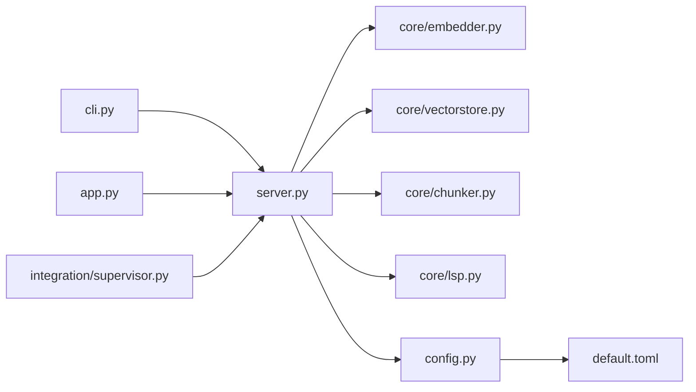

# Project Overview

<cite>
**Referenced Files in This Document**
- [README.md](file://README.md)
- [src/rag/__main__.py](file://src/rag/__main__.py)
- [src/rag/app.py](file://src/rag/app.py)
- [src/rag/server.py](file://src/rag/server.py)
- [src/rag/config.py](file://src/rag/config.py)
- [src/rag/default.toml](file://src/rag/default.toml)
- [src/rag/cli.py](file://src/rag/cli.py)
- [src/rag/core/chunker.py](file://src/rag/core/chunker.py)
- [src/rag/core/vectorstore.py](file://src/rag/core/vectorstore.py)
- [src/rag/core/embedder.py](file://src/rag/core/embedder.py)
- [src/rag/core/lsp.py](file://src/rag/core/lsp.py)
- [src/rag/core/query.py](file://src/rag/core/query.py)
- [src/rag/integration/supervisor.py](file://src/rag/integration/supervisor.py)
</cite>

## Table of Contents
1. [Introduction](#introduction)
2. [Project Structure](#project-structure)
3. [Core Components](#core-components)
4. [Architecture Overview](#architecture-overview)
5. [Detailed Component Analysis](#detailed-component-analysis)
6. [Dependency Analysis](#dependency-analysis)
7. [Performance Considerations](#performance-considerations)
8. [Troubleshooting Guide](#troubleshooting-guide)
9. [Conclusion](#conclusion)

## Introduction
This document presents a comprehensive overview of the standalone code-search RAG platform. The system is designed as a headless FastAPI daemon that provides a dense-vector search engine over codebases, with an optional read-only Textual TUI dashboard. It integrates an embedded Qdrant vector store, dense embeddings via Ollama, and an Agno query planner. The architecture emphasizes reliability and developer productivity: the daemon is supervised and resilient, while the TUI remains a lightweight client that can crash without affecting the daemon.

Key goals:
- Provide a robust, headless RAG daemon for code search and development assistance.
- Deliver a read-only TUI dashboard for monitoring and exploration.
- Enable zero-query-path overhead LSP enrichment performed at index time.
- Support multi-language code-aware chunking across Python, TypeScript/JavaScript, Go, Rust, Java, Kotlin, C/C++, and Dart/Flutter.

## Project Structure
The repository organizes functionality into cohesive modules:
- Web server and API: FastAPI application exposing search, indexing, and status endpoints.
- CLI: Typer-based commands for initialization, starting/stopping, searching, and managing collections.
- Core systems: chunking, vector store, embedding, LSP enrichment, query planning, and configuration.
- TUI: Textual-based read-only dashboard that polls the daemon for state and results.
- Supervisor: macOS launchd integration for daemon supervision.

```mermaid
graph TB
subgraph "CLI"
CLI["cli.py"]
end
subgraph "Web Server"
Server["server.py"]
Config["config.py"]
DefaultCfg["default.toml"]
end
subgraph "Core"
Chunker["core/chunker.py"]
VectorStore["core/vectorstore.py"]
Embedder["core/embedder.py"]
LSP["core/lsp.py"]
Query["core/query.py"]
end
subgraph "TUI"
App["app.py"]
end
subgraph "Supervisor"
Supervisor["integration/supervisor.py"]
end
CLI --> Server
App --> Server
Server --> VectorStore
Server --> Embedder
Server --> Config
Server --> Chunker
Server --> LSP
Server --> Query
Supervisor --> Server
DefaultCfg --> Config
```

**Diagram sources**
- [src/rag/cli.py:1-2274](file://src/rag/cli.py#L1-L2274)
- [src/rag/server.py:1-2586](file://src/rag/server.py#L1-L2586)
- [src/rag/config.py:1-194](file://src/rag/config.py#L1-L194)
- [src/rag/default.toml:1-41](file://src/rag/default.toml#L1-L41)
- [src/rag/core/chunker.py:1-622](file://src/rag/core/chunker.py#L1-L622)
- [src/rag/core/vectorstore.py:1-530](file://src/rag/core/vectorstore.py#L1-L530)
- [src/rag/core/embedder.py:1-245](file://src/rag/core/embedder.py#L1-L245)
- [src/rag/core/lsp.py:1-404](file://src/rag/core/lsp.py#L1-L404)
- [src/rag/core/query.py:1-52](file://src/rag/core/query.py#L1-L52)
- [src/rag/app.py:1-1105](file://src/rag/app.py#L1-L1105)
- [src/rag/integration/supervisor.py:1-153](file://src/rag/integration/supervisor.py#L1-L153)

**Section sources**
- [README.md:1-74](file://README.md#L1-L74)
- [src/rag/__main__.py:1-6](file://src/rag/__main__.py#L1-L6)

## Core Components
- Headless FastAPI daemon: Provides HTTP endpoints for search, indexing, status, and administrative operations. It initializes the hybrid embedder and Qdrant vector store, manages jobs and events, and enforces authentication and rate limits.
- CLI: Thin client that communicates with the daemon over HTTP. Supports initialization, starting/stopping, searching, context packs, and service management.
- TUI: Read-only Textual dashboard that polls the daemon for status, recent queries, collections, plugins, events, and overview data. It renders charts and lists without holding model or vectorstore state.
- Code-aware chunking: Multi-language tree-sitter based 3-tier chunking (file/class/function) with fallback sliding windows. Emits rich metadata for filtering and discovery.
- Vector store: Qdrant-backed dense vector search with payload indexes for efficient filtering. Collections are created on demand with dual vectors configuration.
- Embeddings: Dense embeddings via Ollama (Qwen3-Embedding). The embedder is initialized at startup and verified for model availability.
- LSP enrichment: Optional index-time enrichment using language servers (Pyright, TS Server, gopls, rust-analyzer, clangd, dart language-server). Enrichment adds references, fan-in/out, and dead-code signals.
- Query planning: Query expansion and decomposition to improve recall and manage compound queries.
- Configuration: TOML-based settings with Pydantic validation, including server, embeddings, Qdrant, index, LLM, and LSP settings.

**Section sources**
- [src/rag/server.py:1-2586](file://src/rag/server.py#L1-L2586)
- [src/rag/cli.py:1-2274](file://src/rag/cli.py#L1-L2274)
- [src/rag/app.py:1-1105](file://src/rag/app.py#L1-L1105)
- [src/rag/core/chunker.py:1-622](file://src/rag/core/chunker.py#L1-L622)
- [src/rag/core/vectorstore.py:1-530](file://src/rag/core/vectorstore.py#L1-L530)
- [src/rag/core/embedder.py:1-245](file://src/rag/core/embedder.py#L1-L245)
- [src/rag/core/lsp.py:1-404](file://src/rag/core/lsp.py#L1-L404)
- [src/rag/core/query.py:1-52](file://src/rag/core/query.py#L1-L52)
- [src/rag/config.py:1-194](file://src/rag/config.py#L1-L194)
- [src/rag/default.toml:1-41](file://src/rag/default.toml#L1-L41)

## Architecture Overview
The system follows a client-server model:
- The daemon is the supervised component, running on localhost and protected by a bearer token. It exposes a FastAPI application with lifecycle hooks for initialization and shutdown.
- The CLI and TUI are thin HTTP clients. The TUI polls the daemon for state and renders dashboards; a TUI crash does not affect the daemon.
- The daemon orchestrates indexing, embedding, and vector search, and maintains persistent state (jobs, events, restart counters).
- Zero-query-path overhead LSP enrichment occurs during indexing, not at query time, ensuring low-latency searches.



**Diagram sources**
- [src/rag/server.py:600-716](file://src/rag/server.py#L600-L716)
- [src/rag/cli.py:24-70](file://src/rag/cli.py#L24-L70)
- [src/rag/app.py:294-331](file://src/rag/app.py#L294-L331)
- [src/rag/core/embedder.py:189-245](file://src/rag/core/embedder.py#L189-L245)
- [src/rag/core/vectorstore.py:199-530](file://src/rag/core/vectorstore.py#L199-L530)
- [src/rag/core/chunker.py:385-444](file://src/rag/core/chunker.py#L385-L444)
- [src/rag/core/lsp.py:313-404](file://src/rag/core/lsp.py#L313-L404)
- [src/rag/config.py:150-194](file://src/rag/config.py#L150-L194)
- [src/rag/default.toml:1-41](file://src/rag/default.toml#L1-L41)

## Detailed Component Analysis

### Headless FastAPI Daemon
The daemon initializes the hybrid embedder and Qdrant vector store, sets up logging, and manages background tasks. It defines request/response models for search, context packs, symbol resolution, call trees, and project understanding. It enforces bearer token authentication and rate limiting, and exposes health, status, collections, and overview endpoints.



**Diagram sources**
- [src/rag/server.py:424-466](file://src/rag/server.py#L424-L466)
- [src/rag/core/embedder.py:238-245](file://src/rag/core/embedder.py#L238-L245)
- [src/rag/core/vectorstore.py:424-466](file://src/rag/core/vectorstore.py#L424-L466)

**Section sources**
- [src/rag/server.py:600-716](file://src/rag/server.py#L600-L716)
- [src/rag/server.py:721-790](file://src/rag/server.py#L721-L790)
- [src/rag/server.py:382-408](file://src/rag/server.py#L382-L408)

### CLI and TUI
The CLI is a thin HTTP client that communicates with the daemon. It checks daemon health, authenticates with a bearer token, and prints structured results. The TUI is a read-only client that polls the daemon for status, recent queries, collections, plugins, events, and overview data, rendering charts and lists.



**Diagram sources**
- [src/rag/cli.py:426-476](file://src/rag/cli.py#L426-L476)
- [src/rag/app.py:363-457](file://src/rag/app.py#L363-L457)

**Section sources**
- [src/rag/cli.py:24-70](file://src/rag/cli.py#L24-L70)
- [src/rag/cli.py:426-476](file://src/rag/cli.py#L426-L476)
- [src/rag/app.py:363-457](file://src/rag/app.py#L363-L457)

### Code-Aware Chunking System
The chunker performs 3-tier code-aware chunking using tree-sitter:
- Tier 1: File summary (imports and top-level declarations).
- Tier 2: Class/interface declarations with member summaries.
- Tier 3: Function/method bodies with contextual headers.

It supports multiple languages and falls back to sliding-window chunking when parsing fails. Metadata enrichment detects patterns and language-specific features (e.g., coroutines, singletons, composable functions).



**Diagram sources**
- [src/rag/core/chunker.py:385-444](file://src/rag/core/chunker.py#L385-L444)
- [src/rag/core/chunker.py:446-537](file://src/rag/core/chunker.py#L446-L537)
- [src/rag/core/chunker.py:588-614](file://src/rag/core/chunker.py#L588-L614)

**Section sources**
- [src/rag/core/chunker.py:1-622](file://src/rag/core/chunker.py#L1-L622)

### Vector Store and Collections
Qdrant is used for dense vector search. Collections are created on demand with dual vectors configuration. Payload indexes are created for efficient filtering. The vector store ensures dimension compatibility and guards against silent corruption by rejecting mismatched embeddings.



**Diagram sources**
- [src/rag/core/vectorstore.py:199-530](file://src/rag/core/vectorstore.py#L199-L530)
- [src/rag/core/embedder.py:189-245](file://src/rag/core/embedder.py#L189-L245)

**Section sources**
- [src/rag/core/vectorstore.py:1-530](file://src/rag/core/vectorstore.py#L1-L530)
- [src/rag/core/embedder.py:1-245](file://src/rag/core/embedder.py#L1-L245)

### Embeddings via Ollama
The embedder uses Ollama to produce dense embeddings with instruction prefixes for queries and documents. It batches requests and retries with exponential backoff, with strict timeouts to prevent long blocking.



**Diagram sources**
- [src/rag/core/embedder.py:69-73](file://src/rag/core/embedder.py#L69-L73)
- [src/rag/core/embedder.py:102-154](file://src/rag/core/embedder.py#L102-L154)

**Section sources**
- [src/rag/core/embedder.py:1-245](file://src/rag/core/embedder.py#L1-L245)

### LSP Enrichment (Zero-Query-Path Overhead)
LSP enrichment runs at index time to add cross-file references, fan-in/out metrics, and dead-code signals. It starts language servers per detected language, queries references/definitions/implementations, and shuts down servers afterward. This ensures query-time performance remains unaffected.



**Diagram sources**
- [src/rag/core/lsp.py:100-118](file://src/rag/core/lsp.py#L100-L118)
- [src/rag/core/lsp.py:131-194](file://src/rag/core/lsp.py#L131-L194)
- [src/rag/core/lsp.py:313-404](file://src/rag/core/lsp.py#L313-L404)

**Section sources**
- [src/rag/core/lsp.py:1-404](file://src/rag/core/lsp.py#L1-L404)

### Query Planning and Expansion
The query planner expands queries with synonyms and decomposes compound queries into sub-queries. This improves recall and helps the Agno planner generate precise strategies.



**Diagram sources**
- [src/rag/core/query.py:31-52](file://src/rag/core/query.py#L31-L52)

**Section sources**
- [src/rag/core/query.py:1-52](file://src/rag/core/query.py#L1-L52)

### Configuration and Defaults
Configuration is loaded from a default TOML file merged with user overrides. It controls server bind address/port, embeddings model/dimension/batch size, Qdrant mode/url/path and collection names, index chunking parameters, LLM/Ollama URLs, and LSP settings.



**Diagram sources**
- [src/rag/default.toml:1-41](file://src/rag/default.toml#L1-L41)
- [src/rag/config.py:150-194](file://src/rag/config.py#L150-L194)

**Section sources**
- [src/rag/default.toml:1-41](file://src/rag/default.toml#L1-L41)
- [src/rag/config.py:1-194](file://src/rag/config.py#L1-L194)

### Practical Examples
- Code search workflow: Initialize config, start the daemon, index a repository, search with queries, and explore results in the TUI.
- Development assistance: Use the CLI to retrieve context packs for a task, optionally enabling semantic fallback, then synthesize answers with the LLM.
- Monitoring: Use the TUI to observe collections, plugins, recent queries, and event logs; use the CLI to diagnose health and verify index integrity.

**Section sources**
- [README.md:25-66](file://README.md#L25-L66)
- [src/rag/cli.py:82-141](file://src/rag/cli.py#L82-L141)
- [src/rag/cli.py:426-476](file://src/rag/cli.py#L426-L476)
- [src/rag/app.py:363-457](file://src/rag/app.py#L363-L457)

## Dependency Analysis
The system exhibits clear separation of concerns:
- The daemon depends on the embedder, vector store, chunker, LSP, and configuration modules.
- The CLI and TUI depend only on HTTP endpoints exposed by the daemon.
- Supervisor integration is OS-specific and only affects installation/uninstallation of the daemon service.



**Diagram sources**
- [src/rag/cli.py:1-2274](file://src/rag/cli.py#L1-L2274)
- [src/rag/app.py:1-1105](file://src/rag/app.py#L1-L1105)
- [src/rag/server.py:1-2586](file://src/rag/server.py#L1-L2586)
- [src/rag/core/embedder.py:1-245](file://src/rag/core/embedder.py#L1-L245)
- [src/rag/core/vectorstore.py:1-530](file://src/rag/core/vectorstore.py#L1-L530)
- [src/rag/core/chunker.py:1-622](file://src/rag/core/chunker.py#L1-L622)
- [src/rag/core/lsp.py:1-404](file://src/rag/core/lsp.py#L1-L404)
- [src/rag/config.py:1-194](file://src/rag/config.py#L1-L194)
- [src/rag/default.toml:1-41](file://src/rag/default.toml#L1-L41)
- [src/rag/integration/supervisor.py:1-153](file://src/rag/integration/supervisor.py#L1-L153)

**Section sources**
- [src/rag/server.py:600-716](file://src/rag/server.py#L600-L716)
- [src/rag/cli.py:24-70](file://src/rag/cli.py#L24-L70)
- [src/rag/app.py:294-331](file://src/rag/app.py#L294-L331)

## Performance Considerations
- Dense vector search: Single dense query_points call with payload filters pushed server-side to avoid silent recall holes.
- Embedding throughput: Batched requests to Ollama with configurable batch size; benchmarking command available to tune performance.
- Payload indexes: Created on-demand for Qdrant collections to accelerate filtering; embedded mode skips payload indexes for simplicity.
- LSP enrichment: Runs at index time to eliminate query-time overhead; servers are terminated after enrichment.
- Restart tracking: Persistent restart counter helps monitor daemon stability.

[No sources needed since this section provides general guidance]

## Troubleshooting Guide
Common diagnostics:
- Health checks: Verify daemon readiness, Ollama reachability and model availability, LSP server detection, and cache statistics.
- Index integrity: Run verification to detect orphaned or duplicate chunks, then repair to clean them up.
- Service management: On macOS, register the daemon as a launchd agent so it auto-starts on login and restarts on crash.

**Section sources**
- [README.md:71-74](file://README.md#L71-L74)
- [src/rag/cli.py:302-386](file://src/rag/cli.py#L302-L386)
- [src/rag/integration/supervisor.py:75-153](file://src/rag/integration/supervisor.py#L75-L153)

## Conclusion
This standalone code-search RAG platform combines a resilient headless FastAPI daemon, a read-only TUI dashboard, and a powerful multi-language code-aware chunking system. Dense embeddings via Ollama and Qdrant enable fast, accurate retrieval, while LSP enrichment at index time ensures zero-query-path overhead. The architecture balances developer productivity with reliability, offering a practical foundation for code search and development assistance workflows.